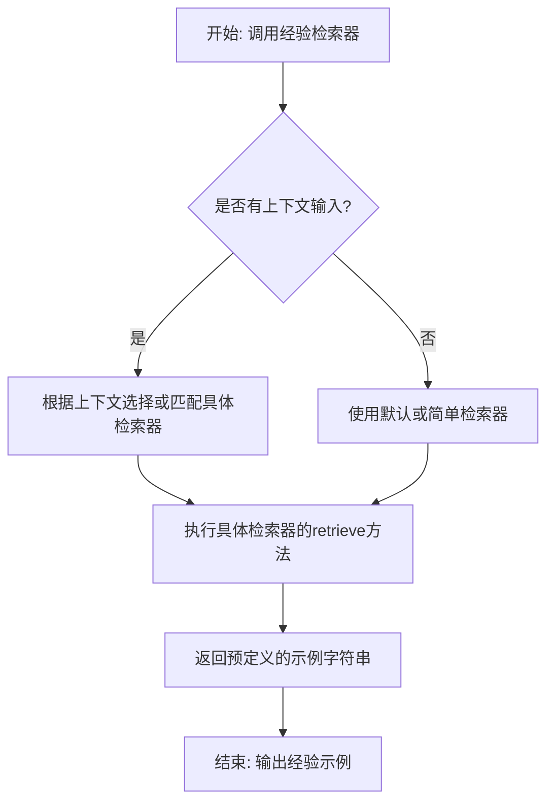
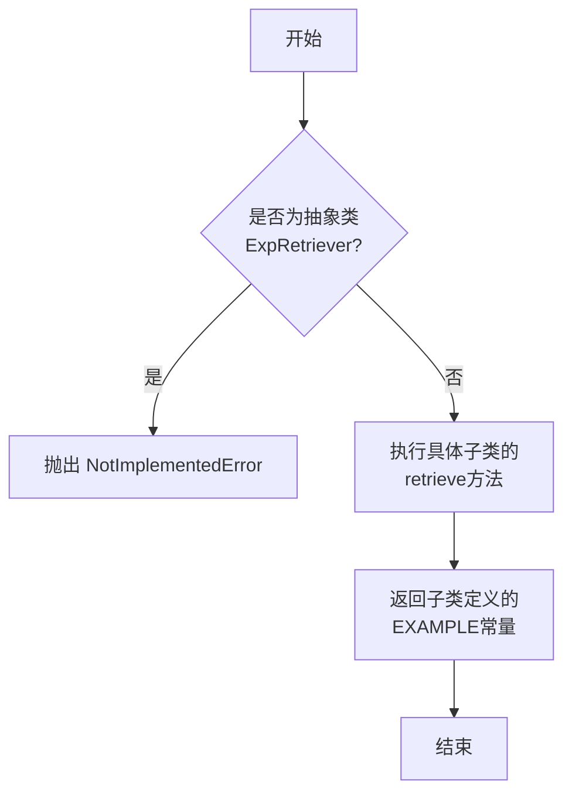
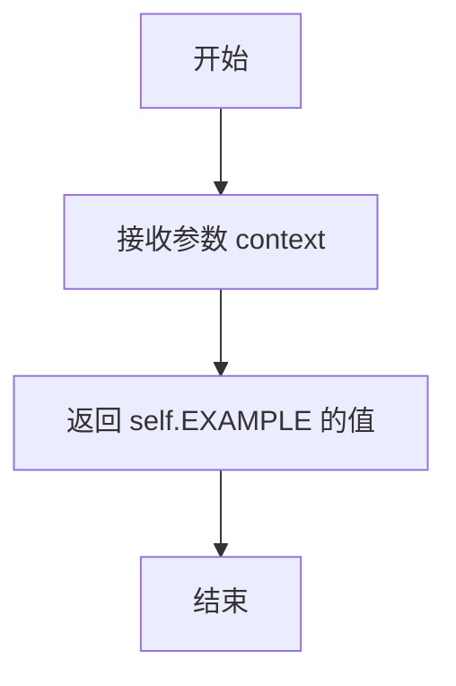
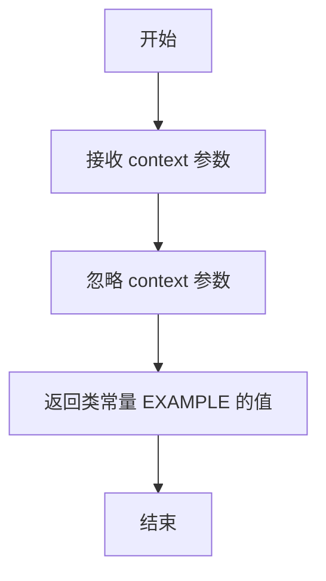
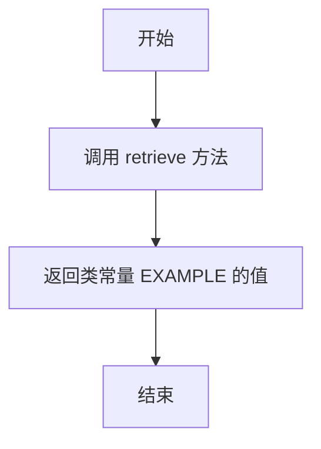
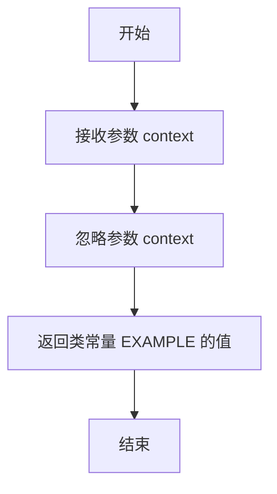
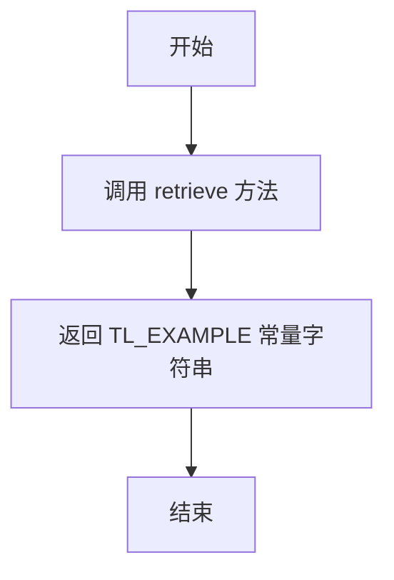
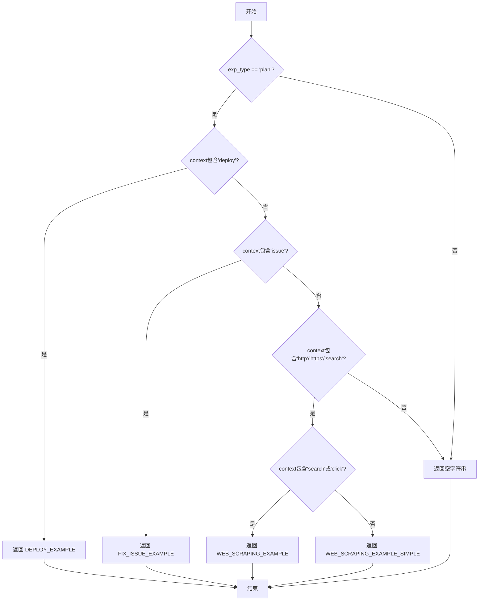

# `.\MetaGPT\metagpt\strategy\experience_retriever.py` 详细设计文档

该代码定义了一个经验检索器（Experience Retriever）的抽象基类及其多个具体实现，用于在AI代理系统中根据上下文（如用户需求类型）返回预定义的、结构化的任务执行示例（通常以JSON格式表示任务序列）。这些示例作为“经验”指导AI代理如何将复杂需求分解为有序的命令序列，应用于软件框架设计（TRD）、团队任务分配、Web爬虫、问题修复等多种场景。

## 整体流程



## 类结构

```
ExpRetriever (抽象基类)
├── DummyExpRetriever (空示例检索器)
├── TRDAllExpRetriever (TRD全流程示例检索器)
├── TRDToolExpRetriever (TRD工具示例检索器)
├── TRDExpRetriever (TRD示例检索器)
├── SimpleExpRetriever (简单示例检索器)
└── KeywordExpRetriever (关键词匹配检索器)
```

## 全局变量及字段


### `TL_EXAMPLE`
    
一个包含团队领导（Team Leader）场景下多个示例的字符串，用于演示如何根据用户需求或观察结果生成任务计划、分配任务、发布消息和结束对话。

类型：`str`
    


### `DEPLOY_EXAMPLE`
    
一个包含部署服务场景示例的字符串，展示了如何将服务启动、测试和公开部署分解为一系列任务。

类型：`str`
    


### `FIX_ISSUE_EXAMPLE`
    
一个包含修复GitHub问题场景示例的字符串，展示了从阅读问题、克隆仓库、诊断问题、修复代码到提交PR的完整任务流程。

类型：`str`
    


### `ENGINEER_EXAMPLE`
    
一个包含工程师（Engineer）角色多种操作场景示例的字符串，涵盖了阅读文档、复制模板、编写代码、编辑文件、安装构建、部署以及处理Git操作等。

类型：`str`
    


### `WEB_SCRAPING_EXAMPLE`
    
一个包含复杂网页抓取场景示例的字符串，展示了从导航、搜索、查看页面结构到解析数据的多步骤任务规划和工具使用。

类型：`str`
    


### `WEB_SCRAPING_EXAMPLE_SIMPLE`
    
一个包含简单网页抓取场景示例的字符串，展示了直接访问URL并解析页面数据的简化任务流程。

类型：`str`
    


### `DummyExpRetriever.EXAMPLE`
    
一个空字符串，作为DummyExpRetriever类retrieve方法的默认返回内容，表示不提供任何经验示例。

类型：`str`
    


### `TRDAllExpRetriever.EXAMPLE`
    
一个包含多个TRD（技术需求文档）和软件框架编写复杂流程示例的字符串，展示了从需求到TRD生成、评估、框架实现、再评估的迭代任务链。

类型：`str`
    


### `TRDToolExpRetriever.EXAMPLE`
    
一个包含TRD相关工具使用简化示例的字符串，展示了将TRD和框架编写合并为单个任务的流程。

类型：`str`
    


### `TRDExpRetriever.EXAMPLE`
    
一个包含TRD（技术需求文档）编写和软件框架实现详细流程示例的字符串，内容与TRDAllExpRetriever.EXAMPLE相同，展示了复杂的多步骤、带条件循环的任务规划。

类型：`str`
    
    

## 全局函数及方法

### `ExpRetriever.retrieve`

该方法定义了一个经验检索器的抽象接口，其核心功能是接收一个上下文字符串，并返回一个包含相关经验示例的字符串。具体的实现由子类完成，用于为不同的任务场景（如TRD撰写、团队协作、代码开发等）提供预设的示例流程。

参数：
- `context`：`str`，可选参数，默认为空字符串。表示检索经验时所依据的上下文信息，例如用户需求或当前任务描述。

返回值：`str`，返回一个包含一个或多个经验示例的字符串。每个示例通常包含用户需求描述、步骤解释以及一个JSON格式的任务列表。

#### 流程图



#### 带注释源码

```python
def retrieve(self, context: str = "") -> str:
    # 在基类 ExpRetriever 中，此方法被定义为抽象方法。
    # 它接收一个可选的上下文字符串 `context`，并期望返回一个字符串。
    # 具体的实现应由继承此基类的子类提供。
    # 如果直接调用基类的此方法，将抛出 NotImplementedError 异常。
    raise NotImplementedError
```

### `DummyExpRetriever.retrieve`

该方法是一个虚拟的经验检索器实现，它不执行任何实际的检索逻辑，而是直接返回类中预定义的静态示例字符串。

参数：

- `context`：`str`，检索的上下文信息，在此方法中未被使用。
- `self`：`DummyExpRetriever`，类实例自身。

返回值：`str`，返回类字段 `EXAMPLE` 的值，即一个空字符串。

#### 流程图



#### 带注释源码

```python
def retrieve(self, context: str = "") -> str:
    # 直接返回类字段 EXAMPLE 的值，不进行任何处理或逻辑判断。
    # 这是一个占位符实现，用于在需要经验检索器接口但无需实际功能时使用。
    return self.EXAMPLE
```

### `TRDAllExpRetriever.retrieve`

该方法是一个经验检索器的具体实现，用于返回一个预定义的、包含多个TRD（技术需求文档）和软件框架编写示例的字符串。它不执行任何动态检索或逻辑处理，仅返回类中硬编码的静态示例文本。

参数：

- `context`：`str`，一个可选的上下文字符串，用于描述检索的背景或条件。在此实现中，该参数未被使用。

返回值：`str`，返回一个硬编码的多行字符串，其中包含了三个详细的TRD和软件框架编写流程示例。每个示例都包括用户需求、步骤解释以及一个JSON格式的任务列表。

#### 流程图



#### 带注释源码

```python
def retrieve(self, context: str = "") -> str:
    # 该方法直接返回类属性 EXAMPLE 的值。
    # 参数 `context` 在此实现中未被使用，仅用于遵循父类接口。
    return self.EXAMPLE
```

### `TRDToolExpRetriever.retrieve`

该方法用于检索与TRD（技术需求文档）工具相关的经验示例。它继承自`ExpRetriever`基类，并重写了`retrieve`方法。该方法不接受任何外部输入（`context`参数未使用），直接返回一个硬编码的、包含一个任务规划示例的字符串。该示例展示了如何将“编写软件框架”的用户需求分解为一个单一的命令任务。

参数：

- `context`：`str`，用于提供检索上下文的字符串，但在此实现中未使用。
- `self`：`TRDToolExpRetriever`，类实例自身。

返回值：`str`，返回一个预定义的、包含任务规划示例的Markdown格式字符串。

#### 流程图



#### 带注释源码

```python
def retrieve(self, context: str = "") -> str:
    # 直接返回类级别的常量字符串 EXAMPLE。
    # 该常量包含了一个固定的任务规划示例，展示了如何将用户需求映射为具体的命令。
    # 参数 `context` 在此方法中未被使用，但为保持接口一致性而保留。
    return self.EXAMPLE
```

### `TRDExpRetriever.retrieve`

该方法是一个经验检索器的具体实现，用于返回一个预定义的、与TRD（技术需求文档）和软件框架开发流程相关的示例字符串。它不执行任何动态检索或逻辑处理，仅返回类中硬编码的静态示例。

参数：

- `context`：`str`，一个可选的上下文字符串，用于描述检索的背景或条件。在当前实现中，此参数未被使用。

返回值：`str`，返回一个包含详细TRD和软件框架开发流程示例的字符串。该字符串描述了从需求分析到框架实现的完整步骤，并包含了一系列JSON格式的命令示例。

#### 流程图



#### 带注释源码

```python
def retrieve(self, context: str = "") -> str:
    # 该方法直接返回类属性 EXAMPLE 的值。
    # 参数 `context` 在此实现中未被使用，仅用于遵循接口定义。
    # 返回值是一个硬编码的字符串，包含TRD开发流程的示例。
    return self.EXAMPLE
```

### `SimpleExpRetriever.retrieve`

该方法是一个简单的经验检索器，用于返回预定义的手工编写的示例文本。它继承自`ExpRetriever`基类，并重写了`retrieve`方法，直接返回一个名为`TL_EXAMPLE`的全局常量字符串，该字符串包含了多个团队协作和任务管理的示例场景。

参数：

- `context`：`str`，一个可选的上下文字符串，用于提供检索的上下文信息。在此方法中，该参数未被使用。
- `self`：`SimpleExpRetriever`，表示`SimpleExpRetriever`类的实例。

返回值：`str`，返回一个包含多个示例的字符串，这些示例描述了在不同场景下（如创建项目、处理数据任务、更新项目状态等）如何生成一系列的命令序列。

#### 流程图



#### 带注释源码

```python
def retrieve(self, context: str = "") -> str:
    # 直接返回预定义的全局常量 TL_EXAMPLE
    # 该常量包含了一系列团队协作和任务管理的示例
    return TL_EXAMPLE
```

### `KeywordExpRetriever.retrieve`

该方法根据传入的上下文（`context`）和指定的经验类型（`exp_type`），通过关键词匹配来检索并返回相应的预定义示例字符串。它主要用于在特定场景（如“计划”或“任务”）下，根据上下文中的关键词（如“deploy”、“issue”、“http”等）提供相关的操作示例。

参数：

- `context`：`str`，用于进行关键词匹配的上下文字符串。
- `exp_type`：`Literal["plan", "task"]`，指定检索的经验类型，目前仅支持“plan”类型。

返回值：`str`，返回匹配到的预定义示例字符串。如果未匹配到任何关键词，则返回空字符串。

#### 流程图



#### 带注释源码

```python
def retrieve(self, context: str, exp_type: Literal["plan", "task"] = "plan") -> str:
    # 检查经验类型是否为“plan”
    if exp_type == "plan":
        # 如果上下文包含“deploy”关键词，返回部署示例
        if "deploy" in context.lower():
            return DEPLOY_EXAMPLE
        # 如果上下文包含“issue”关键词，返回问题修复示例
        elif "issue" in context.lower():
            return FIX_ISSUE_EXAMPLE
        # 如果上下文包含URL或“search”关键词，进一步判断
        elif "https:" in context.lower() or "http:" in context.lower() or "search" in context.lower():
            # 如果上下文还包含“search”或“click”关键词，返回复杂网页抓取示例
            if "search" in context.lower() or "click" in context.lower():
                return WEB_SCRAPING_EXAMPLE
            # 否则返回简单网页抓取示例
            return WEB_SCRAPING_EXAMPLE_SIMPLE
    # 如果经验类型不是“plan”或未匹配到任何关键词，返回空字符串
    return ""
```

## 关键组件

### ExpRetriever 抽象基类

定义了经验检索器的统一接口，所有具体的检索器都必须实现 `retrieve` 方法。

### DummyExpRetriever

一个返回空字符串的虚拟经验检索器，主要用于测试或作为默认/占位符实现。

### TRDAllExpRetriever

一个返回完整TRD（技术需求文档）相关示例的经验检索器，其示例包含了从需求分析到框架实现的完整、复杂的多步骤工作流。

### TRDToolExpRetriever

一个返回TRD工具相关示例的经验检索器，其示例展示了一个简化的、将TRD和框架生成合并为单一命令的工作流。

### TRDExpRetriever

一个返回TRD相关示例的经验检索器，其示例与 `TRDAllExpRetriever` 类似，但可能用于不同的上下文或场景。

### SimpleExpRetriever

一个返回预定义的团队协作（Team Leader）示例的经验检索器，示例涵盖了任务分配、进度更新和项目状态查询等多种场景。

### KeywordExpRetriever

一个基于输入上下文中的关键词（如“deploy”、“issue”、“http”）来动态返回相应领域示例（如部署、问题修复、网页抓取）的经验检索器。

## 问题及建议

### 已知问题

1.  **硬编码示例数据**：所有具体的经验检索器类（如 `TRDAllExpRetriever`, `SimpleExpRetriever`, `KeywordExpRetriever` 等）的 `EXAMPLE` 字段均为硬编码的字符串。这导致示例数据与代码逻辑紧密耦合，难以维护、更新和扩展。任何示例的修改都需要直接编辑源代码并重新部署。
2.  **`KeywordExpRetriever` 逻辑不完整**：`KeywordExpRetriever.retrieve` 方法在 `exp_type` 参数为 `"task"` 时，无论 `context` 内容如何，都直接返回空字符串 `""`。这导致其针对“任务”类型的经验检索功能完全失效，与类名和设计意图不符。
3.  **`DummyExpRetriever` 行为不一致**：`DummyExpRetriever` 的类文档字符串描述为“返回空字符串”，但其 `retrieve` 方法实际返回的是类字段 `self.EXAMPLE`（其值为空字符串）。虽然当前结果一致，但这种实现方式容易引起误解，且如果 `EXAMPLE` 被意外修改，行为将与文档描述不符。
4.  **缺乏上下文感知**：`retrieve` 方法的 `context` 参数在大多数实现中未被有效利用（除了 `KeywordExpRetriever` 的部分逻辑）。当前检索逻辑基本上是静态的，无法根据用户的具体查询上下文动态返回最相关的经验示例，限制了系统的智能性和实用性。
5.  **代码重复与结构松散**：多个经验检索器类（`TRDAllExpRetriever`, `TRDToolExpRetriever`, `TRDExpRetriever`）包含大量重复的示例文本。`ENGINEER_EXAMPLE`, `WEB_SCRAPING_EXAMPLE` 等全局变量也存储了冗长的示例。这种模式使得代码库臃肿，且相同经验的更新需要在多个位置进行，容易出错。
6.  **潜在的性能问题**：由于示例数据以巨大的多行字符串形式直接嵌入在代码中，每次模块加载时都会解析和存储这些字符串，增加了内存开销和模块加载时间。对于包含大量或复杂示例的场景，此问题会加剧。
7.  **类型注解不完整**：`KeywordExpRetriever.retrieve` 方法重写了父类方法，但新增了 `exp_type` 参数，这破坏了里氏替换原则。父类 `ExpRetriever.retrieve` 的签名是 `(self, context: str = "") -> str`，而子类方法签名是 `(self, context: str, exp_type: Literal["plan", "task"] = "plan") -> str`，这可能导致在以父类类型调用时出现错误。

### 优化建议

1.  **外部化示例数据**：将所有的 `EXAMPLE` 字符串和全局示例变量（如 `TL_EXAMPLE`, `ENGINEER_EXAMPLE` 等）移出代码，存储到外部配置文件中（如 JSON、YAML）或专用的数据库/向量数据库中。代码中仅保留检索逻辑。这能极大提升可维护性、支持动态更新，并便于进行版本管理。
2.  **实现动态检索逻辑**：强化 `retrieve` 方法，使其能够基于 `context` 参数进行智能匹配。可以引入以下机制：
    *   **关键词匹配增强**：改进 `KeywordExpRetriever`，使其支持更复杂的匹配规则，如正则表达式、多个关键词的组合逻辑等。
    *   **向量化检索**：将示例文本和查询 `context` 转换为向量，使用余弦相似度等度量方法查找最相关的示例。这需要集成嵌入模型（如 Sentence-BERT）和向量数据库（如 FAISS, Chroma）。
    *   **分类检索**：训练或使用一个轻量级文本分类器，根据 `context` 将查询分类到预定义的类别（如“部署”、“问题修复”、“网页抓取”、“TRD编写”），然后返回该类别的示例。
3.  **重构类层次结构，消除重复**：
    *   创建一个基类 `BaseExampleRetriever`，定义从外部源加载示例的通用方法。
    *   将 `TRDAllExpRetriever`, `TRDToolExpRetriever`, `TRDExpRetriever` 合并或重构为更通用的类，通过配置指定其加载的示例集，而非在代码中硬编码。
    *   考虑使用策略模式，将不同的检索策略（如关键词匹配、向量检索）封装成独立的类，并通过配置或工厂方法在运行时选择。
4.  **修复 `KeywordExpRetriever`**：完善 `exp_type == "task"` 分支的逻辑，实现针对“任务”类型上下文的示例检索功能，或者如果该功能暂无需求，应更新文档说明或移除该参数以保持接口一致性。
5.  **明确 `DummyExpRetriever` 的职责**：将其 `retrieve` 方法修改为直接返回空字符串 `""`，而不是引用 `self.EXAMPLE`，使其行为与文档严格一致，并可将 `EXAMPLE` 字段移除。
6.  **性能优化**：如果短期内无法外部化数据，可以考虑惰性加载示例。例如，将 `EXAMPLE` 字符串的初始化放在第一次调用 `retrieve` 时，或者使用 `__init__` 方法加载，但避免在模块顶层定义巨大的字符串。
7.  **完善接口契约**：重新设计 `ExpRetriever` 基类接口。如果 `context` 参数是检索的关键，应将其设为必需参数或明确其默认行为。对于像 `KeywordExpRetriever` 这样需要额外参数的情况，应考虑将其设计为不同的检索器类，或使用一个统一的配置对象（如 `RetrievalRequest`）作为参数，以保持接口的纯洁性和扩展性。
8.  **增加单元测试**：为每个检索器类编写单元测试，验证其在不同 `context` 输入下的输出是否符合预期，确保检索逻辑的正确性和鲁棒性。这在外化数据和重构后尤为重要。

## 其它


### 设计目标与约束

本模块的设计目标是提供一个可扩展的“经验检索器”抽象接口及其多个具体实现。这些检索器用于根据给定的上下文（`context`）返回预定义的、结构化的示例文本（通常为JSON格式），这些示例旨在指导后续的决策或任务规划流程。核心约束包括：1) 保持接口的简洁性，仅定义一个`retrieve`方法；2) 所有具体实现类必须继承自基类`ExpRetriever`；3) 返回的示例字符串需包含清晰的解释和结构化的命令列表，以支持下游的解析与执行。

### 错误处理与异常设计

当前代码的错误处理机制较为简单。基类`ExpRetriever`的`retrieve`方法默认抛出`NotImplementedError`，强制子类必须实现该方法。在现有的具体实现类（如`DummyExpRetriever`, `TRDAllExpRetriever`等）中，`retrieve`方法直接返回类属性`EXAMPLE`，不涉及复杂的逻辑或外部调用，因此没有额外的运行时错误处理。如果未来实现需要从外部资源（如数据库、文件、网络）动态检索经验，则需要引入更完善的异常处理机制，例如处理连接失败、数据解析错误、资源不存在等情况。

### 数据流与状态机

本模块的数据流是单向且无状态的。输入为可选的字符串参数`context`，输出为固定的示例字符串。对于大多数实现（如`DummyExpRetriever`, `TRDAllExpRetriever`, `TRDToolExpRetriever`, `TRDExpRetriever`, `SimpleExpRetriever`），`context`参数未被使用，输出与输入无关。唯一的例外是`KeywordExpRetriever`，它根据`context`的内容和`exp_type`参数，通过简单的关键字匹配（如“deploy”、“issue”、“http”）来决定返回哪个预定义的示例字符串（`DEPLOY_EXAMPLE`, `FIX_ISSUE_EXAMPLE`等）。模块本身不维护任何内部状态，每次调用都是独立的。

### 外部依赖与接口契约

1.  **外部库依赖**：
    *   `typing.Literal`：用于`KeywordExpRetriever.retrieve`方法中`exp_type`参数的类型注解，确保传入值只能是“plan”或“task”。
    *   `pydantic.BaseModel`：所有检索器类继承自此类，主要利用了Pydantic的数据验证和序列化能力。虽然当前代码未显式定义字段验证，但为未来可能的配置化扩展提供了基础。

2.  **接口契约**：
    *   **`ExpRetriever` 抽象接口**：定义了所有经验检索器必须遵守的契约。即实现一个`retrieve(context: str = "") -> str`方法。任何客户端代码都可以依赖此接口来获取经验字符串，而不需要关心具体的检索器实现。
    *   **下游系统契约**：返回的字符串（尤其是JSON部分）需要符合下游任务规划或命令执行模块所期望的格式。例如，`TL_EXAMPLE`、`ENGINEER_EXAMPLE`等全局变量中的JSON结构，需要与系统中处理`Plan.append_task`、`Browser.goto`等命令的组件兼容。这是一种隐式但关键的接口契约。

### 配置管理与扩展性

当前模块的配置是硬编码在类属性（`EXAMPLE`）和全局变量（如`TL_EXAMPLE`, `ENGINEER_EXAMPLE`）中的。这种方式在示例稳定且数量有限时是简单有效的。然而，这也带来了挑战：1) **扩展性**：添加新的经验示例需要修改源代码并新增类或变量。2) **可维护性**：当示例数量增多或内容需要频繁更新时，代码会变得臃肿且难以管理。3) **动态性**：无法在不重启服务的情况下更新经验库。未来的优化方向可以包括将示例存储在外部的配置文件（如YAML、JSON）、数据库或向量数据库中，并通过配置注入或动态加载机制来初始化检索器，从而提升系统的灵活性和可维护性。

### 测试策略建议

针对此模块的测试应聚焦于接口合规性和核心逻辑：
1.  **单元测试**：
    *   验证每个具体类（如`DummyExpRetriever`）的实例是否确实是`ExpRetriever`的子类。
    *   测试每个`retrieve`方法是否返回非空的字符串，并且对于`DummyExpRetriever`等类，返回内容是否等于其`EXAMPLE`属性。
    *   针对`KeywordExpRetriever`，需要测试其关键字匹配逻辑。应创建多组测试用例，覆盖`context`中包含“deploy”、“issue”、“http”等关键词以及不包含任何关键词的情况，同时测试`exp_type`参数为“plan”和“task”时的行为，确保返回正确的示例字符串或空字符串。
2.  **集成测试**：将检索器与下游使用其输出的模块（如解析JSON并执行命令的模块）进行集成测试，确保返回的经验字符串格式正确，能够被顺利解析和处理。
3.  **契约测试**：如果`ExpRetriever`接口被多个模块依赖，可以考虑引入契约测试，确保接口的稳定性。

    