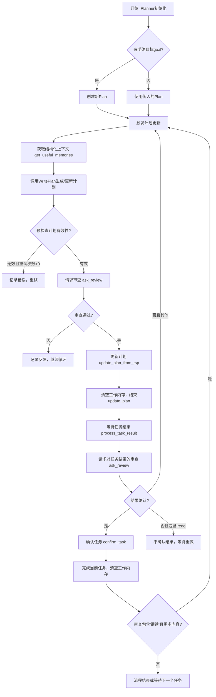
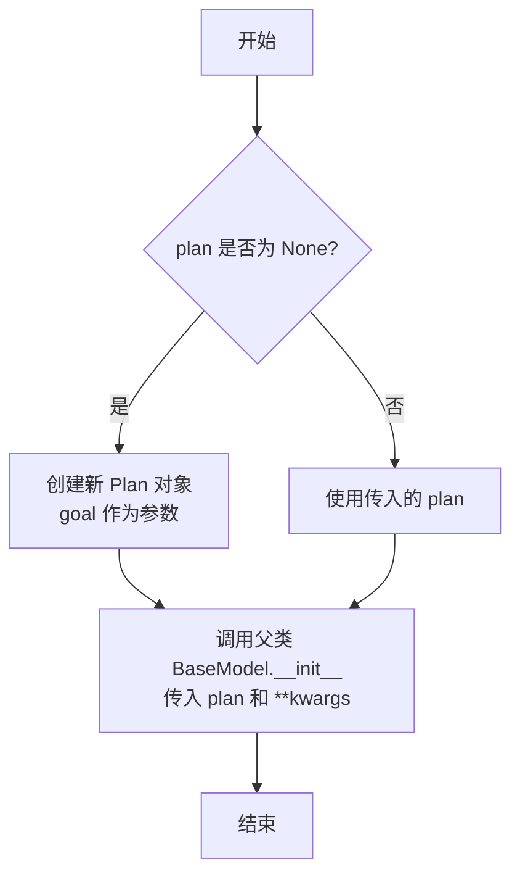
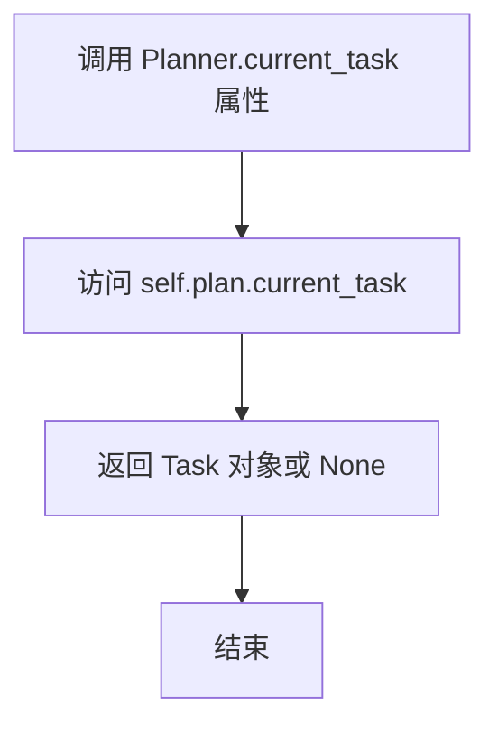
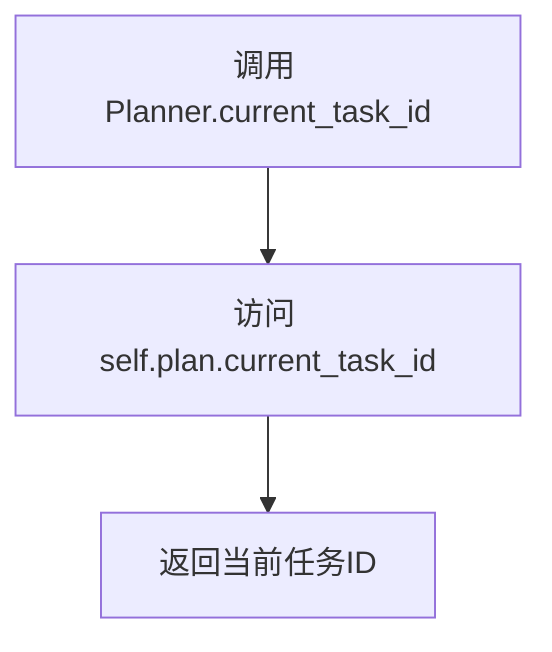
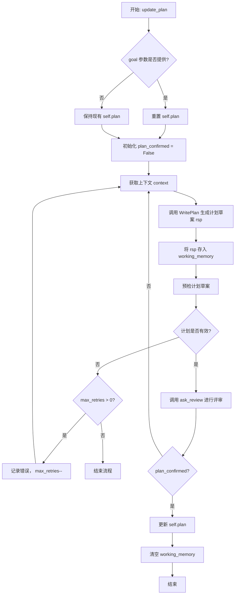
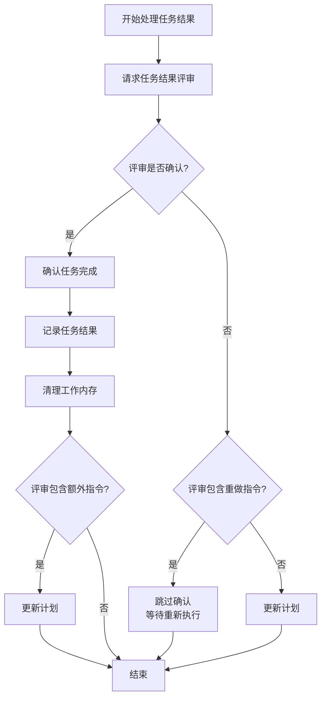
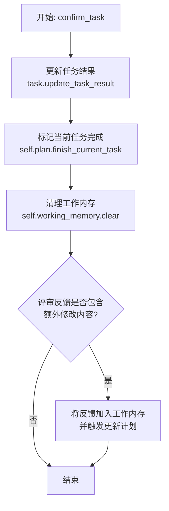
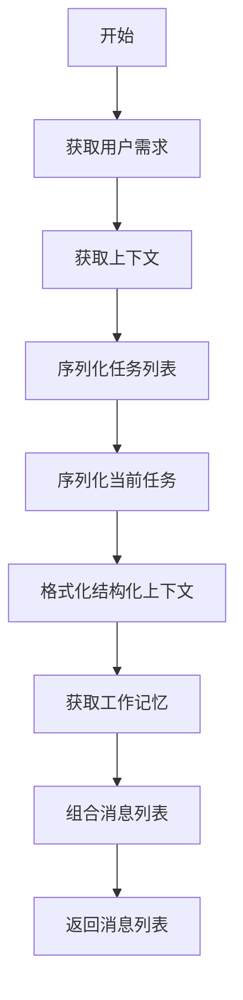
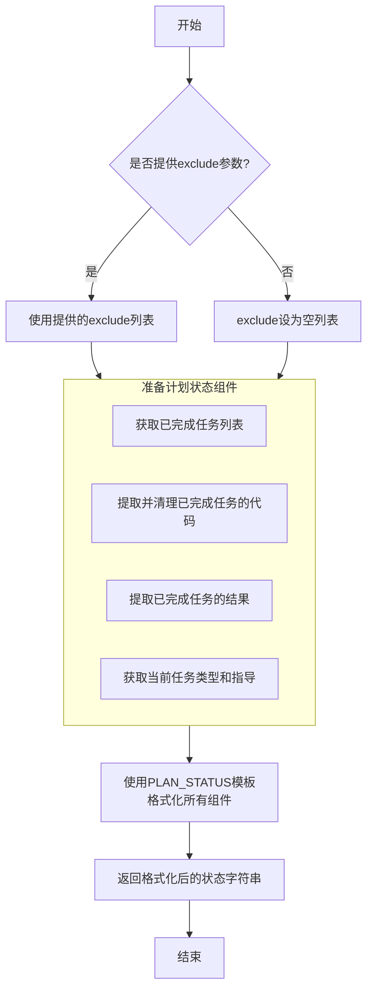

# `.\MetaGPT\metagpt\strategy\planner.py` 详细设计文档

该代码定义了一个任务规划器（Planner），它基于用户需求生成、更新和管理一个任务执行计划（Plan）。核心功能是协调任务规划（WritePlan）、任务执行结果处理（TaskResult）和人工/自动审查（AskReview）的流程，通过结构化上下文和计划状态来指导AI代理（如代码生成）完成复杂任务。

## 整体流程



## 类结构

```
BaseModel (Pydantic基类)
└── Planner (任务规划器)
    ├── 依赖类/模型:
    │   ├── Plan (计划)
    │   ├── Task (任务)
    │   ├── TaskResult (任务结果)
    │   ├── Message (消息)
    │   ├── Memory (内存)
    │   └── TaskType (任务类型)
    └── 依赖动作:
        ├── WritePlan (编写计划)
        └── AskReview (请求审查)
```

## 全局变量及字段


### `STRUCTURAL_CONTEXT`
    
一个用于格式化生成计划上下文的模板字符串，包含用户需求、上下文、当前计划和当前任务等信息。

类型：`str`
    


### `PLAN_STATUS`
    
一个用于格式化生成计划状态报告的模板字符串，包含已完成任务的代码和执行结果、当前任务及其完成部分、以及任务指导等信息。

类型：`str`
    


### `Planner.plan`
    
表示当前正在执行或待执行的总体计划，包含目标、任务列表和当前任务索引等核心信息。

类型：`Plan`
    


### `Planner.working_memory`
    
一个临时工作内存，用于存储处理单个任务过程中的中间消息和上下文，任务完成后会被清空。

类型：`Memory`
    


### `Planner.auto_run`
    
一个布尔标志，指示是否启用自动运行模式。在此模式下，任务结果的确认将依赖于代码执行的成功与否，而非人工审核。

类型：`bool`
    
    

## 全局函数及方法

### `Planner.__init__`

该方法用于初始化`Planner`类的实例。它接受一个目标字符串和一个可选的计划对象，并调用父类的初始化方法，确保`Planner`实例在创建时具有一个有效的计划。

参数：

- `goal`：`str`，表示计划的目标或用户需求，默认为空字符串。
- `plan`：`Plan`，表示一个可选的预定义计划对象，默认为`None`。
- `**kwargs`：`Any`，表示其他关键字参数，用于传递给父类的初始化方法。

返回值：`None`，该方法不返回任何值。

#### 流程图



#### 带注释源码

```python
def __init__(self, goal: str = "", plan: Plan = None, **kwargs):
    # 如果未提供 plan 参数，则根据 goal 创建一个新的 Plan 对象
    plan = plan or Plan(goal=goal)
    # 调用父类 Pydantic BaseModel 的 __init__ 方法，传入 plan 和所有其他关键字参数
    super().__init__(plan=plan, **kwargs)
```

### `Planner.current_task`

这是一个只读属性，用于获取当前计划（`Plan`）中正在处理的任务。它不执行任何计算或逻辑，只是简单地返回`self.plan.current_task`的值，提供了对计划对象内部状态的便捷访问。

参数：无

返回值：`Task`，当前正在执行的任务对象，如果所有任务已完成或计划为空，则可能为`None`。

#### 流程图



#### 带注释源码

```python
    @property
    def current_task(self):
        # 这是一个属性装饰器，将方法转换为只读属性。
        # 当外部代码访问 `planner_instance.current_task` 时，会调用此方法。
        return self.plan.current_task
        # 直接返回 Planner 实例所持有的 Plan 对象的 current_task 属性。
        # 该属性由 Plan 类内部管理，表示当前正在执行或待执行的任务。
```

### `Planner.current_task_id`

这是一个只读属性，用于获取当前计划（`Plan`）中正在执行的任务的ID。

参数：无

返回值：`int`，当前任务的ID。如果当前没有任务，则返回 `None`。

#### 流程图



#### 带注释源码

```python
    @property
    def current_task_id(self):
        # 这是一个属性装饰器，将方法转换为只读属性。
        # 当访问 Planner 实例的 current_task_id 属性时，会执行此方法。
        return self.plan.current_task_id
        # 直接返回 Planner 实例内部 plan 对象的 current_task_id 属性。
        # 该属性由 Plan 类管理，表示计划中当前活跃任务的索引或标识符。
```

### `Planner.update_plan`

`Planner.update_plan` 是 `Planner` 类的核心方法，负责根据用户目标或当前上下文，动态生成或更新任务执行计划。该方法通过调用 `WritePlan` 动作生成计划草案，并进行预检和人工（或自动）评审，确保计划的有效性。如果计划无效，会进行重试；如果评审通过，则更新当前计划并清空工作内存。

参数：

- `goal`：`str`，可选参数，表示新的用户目标。如果提供，将重置整个计划。
- `max_tasks`：`int`，可选参数，默认为3，表示生成计划时建议的最大任务数量。
- `max_retries`：`int`，可选参数，默认为3，表示计划生成失败时的最大重试次数。

返回值：`None`，该方法不返回任何值，但会更新 `self.plan` 和 `self.working_memory`。

#### 流程图



#### 带注释源码

```python
async def update_plan(self, goal: str = "", max_tasks: int = 3, max_retries: int = 3):
    # 如果提供了新的目标，则重置整个计划
    if goal:
        self.plan = Plan(goal=goal)

    # 初始化计划确认状态为 False，进入计划生成与评审循环
    plan_confirmed = False
    while not plan_confirmed:
        # 1. 获取有用的记忆（上下文），用于生成计划
        context = self.get_useful_memories()
        # 2. 调用 WritePlan 动作，根据上下文生成新的计划草案（rsp）
        rsp = await WritePlan().run(context, max_tasks=max_tasks)
        # 3. 将生成的计划草案作为一条消息存入工作内存，用于后续可能的迭代
        self.working_memory.add(Message(content=rsp, role="assistant", cause_by=WritePlan))

        # 4. 对生成的计划草案进行预检，检查其结构有效性
        is_plan_valid, error = precheck_update_plan_from_rsp(rsp, self.plan)
        # 如果计划无效且还有重试次数，则记录错误并重试
        if not is_plan_valid and max_retries > 0:
            error_msg = f"The generated plan is not valid with error: {error}, try regenerating, remember to generate either the whole plan or the single changed task only"
            logger.warning(error_msg)
            self.working_memory.add(Message(content=error_msg, role="assistant", cause_by=WritePlan))
            max_tries -= 1
            continue  # 跳回循环开始，重新生成计划

        # 5. 计划草案通过预检后，请求评审（人工或自动）
        # ask_review 返回评审意见和确认状态
        _, plan_confirmed = await self.ask_review(trigger=ReviewConst.TASK_REVIEW_TRIGGER)
        # 如果 plan_confirmed 为 False，循环将继续，重新生成计划

    # 6. 计划被确认后，使用生成的响应（rsp）更新当前计划
    update_plan_from_rsp(rsp=rsp, current_plan=self.plan)

    # 7. 清空工作内存，为下一个任务或计划周期做准备
    self.working_memory.clear()
```

### `Planner.process_task_result`

该方法用于处理任务执行结果，包括请求用户评审、根据评审结果确认任务或重新规划任务。

参数：

- `task_result`：`TaskResult`，当前任务的执行结果，包含代码执行状态和输出信息

返回值：`None`，无返回值

#### 流程图



#### 带注释源码

```python
async def process_task_result(self, task_result: TaskResult):
    # 请求用户评审任务结果，用户可以选择确认、拒绝或修改计划中的任务
    review, task_result_confirmed = await self.ask_review(task_result)

    if task_result_confirmed:
        # 如果用户确认，则标记任务完成并记录进度
        await self.confirm_task(self.current_task, task_result, review)

    elif "redo" in review:
        # 如果评审反馈中包含"redo"，则要求角色重新执行该任务
        # 适用于代码执行成功但过程或结果不符合预期的情况
        pass  # 简单跳过，不确认结果

    else:
        # 根据用户的反馈更新计划，处理变更的任务
        await self.update_plan()
```

### `Planner.ask_review`

该方法用于请求对任务结果进行评审。评审者需要提供确认或请求更改。如果人工确认任务结果，则无论代码运行是否成功，我们都认为任务已完成；如果是自动模式，则代码运行必须成功才能认为任务完成。

参数：

- `task_result`：`TaskResult`，可选参数，表示待评审的任务结果。如果为`None`，则仅触发评审流程。
- `auto_run`：`bool`，可选参数，表示是否启用自动运行模式。如果为`None`，则使用实例的`auto_run`属性。
- `trigger`：`str`，可选参数，表示触发评审的标识符，默认为`ReviewConst.TASK_REVIEW_TRIGGER`。
- `review_context_len`：`int`，可选参数，表示从工作记忆中获取的上下文消息数量，默认为5。

返回值：`tuple[str, bool]`，返回一个元组，包含评审内容（字符串）和确认状态（布尔值）。如果确认，则评审内容可能为空字符串。

#### 流程图

```mermaid
flowchart TD
    A[开始] --> B{auto_run 是否为 True?}
    B -->|是| C[检查 task_result 是否成功]
    C --> D[返回空字符串和确认状态]
    B -->|否| E[获取最近的有用记忆]
    E --> F[调用 AskReview().run 进行评审]
    F --> G{是否确认?}
    G -->|是| H[返回评审内容和确认状态]
    G -->|否| I[将评审内容添加到工作记忆]
    I --> H
    H --> J[结束]
```

#### 带注释源码

```python
async def ask_review(
    self,
    task_result: TaskResult = None,  # 待评审的任务结果，可选
    auto_run: bool = None,  # 是否自动运行，可选，默认使用实例属性
    trigger: str = ReviewConst.TASK_REVIEW_TRIGGER,  # 触发评审的标识符
    review_context_len: int = 5,  # 从工作记忆中获取的上下文消息数量
):
    """
    请求评审任务结果，评审者需要提供确认或请求更改。
    如果人工确认任务结果，则无论代码运行是否成功，我们都认为任务已完成；
    如果是自动模式，则代码运行必须成功才能认为任务完成。
    """
    auto_run = auto_run if auto_run is not None else self.auto_run  # 确定是否自动运行
    if not auto_run:  # 非自动模式，需要人工或外部评审
        context = self.get_useful_memories()  # 获取有用的记忆作为上下文
        review, confirmed = await AskReview().run(
            context=context[-review_context_len:], plan=self.plan, trigger=trigger  # 调用评审动作
        )
        if not confirmed:  # 如果未确认，将评审内容添加到工作记忆
            self.working_memory.add(Message(content=review, role="user", cause_by=AskReview))
        return review, confirmed  # 返回评审内容和确认状态
    # 自动模式，仅根据任务结果的成功状态确认
    confirmed = task_result.is_success if task_result else True  # 如果有任务结果，检查是否成功；否则直接确认
    return "", confirmed  # 返回空字符串和确认状态
```

### `Planner.confirm_task`

该方法用于确认当前任务已完成，更新任务结果，并清理工作内存。如果用户确认时提供了额外反馈（如修改后续任务），则会触发计划更新。

参数：

- `task`：`Task`，当前待确认的任务对象
- `task_result`：`TaskResult`，当前任务的执行结果
- `review`：`str`，用户对任务结果的评审反馈内容

返回值：`None`，无返回值

#### 流程图



#### 带注释源码

```python
async def confirm_task(self, task: Task, task_result: TaskResult, review: str):
    # 将任务执行结果更新到任务对象中
    task.update_task_result(task_result=task_result)
    # 在计划中标记当前任务为已完成状态
    self.plan.finish_current_task()
    # 清空工作内存，为下一个任务做准备
    self.working_memory.clear()

    # 检查用户反馈是否在确认的同时包含了额外内容（例如修改后续任务的指令）
    # 判断逻辑：反馈中包含“confirm”关键词，但不仅仅是“confirm”这个词本身
    confirmed_and_more = (
        ReviewConst.CONTINUE_WORDS[0] in review.lower() and review.lower() not in ReviewConst.CONTINUE_WORDS[0]
    )  # "confirm, ... (more content, such as changing downstream tasks)"
    
    # 如果反馈包含额外内容，则将其加入工作内存并触发计划更新流程
    if confirmed_and_more:
        self.working_memory.add(Message(content=review, role="user", cause_by=AskReview))
        await self.update_plan()
```

### `Planner.get_useful_memories`

该方法用于从规划器（Planner）中提取有用的记忆信息，并将其格式化为一个结构化的上下文消息列表。它通过组合用户需求、当前上下文、任务列表和当前任务信息，生成一个用于后续处理（如计划更新或任务评审）的上下文。

参数：

- `task_exclude_field`：`Optional`，默认为`None`，指定在序列化任务时需要排除的字段，以减少上下文长度或避免冗余信息。

返回值：`list[Message]`，返回一个包含结构化上下文消息和当前工作记忆的消息列表。

#### 流程图



#### 带注释源码

```python
def get_useful_memories(self, task_exclude_field=None) -> list[Message]:
    """find useful memories only to reduce context length and improve performance"""
    # 获取用户需求（即计划的目标）
    user_requirement = self.plan.goal
    # 获取当前上下文
    context = self.plan.context
    # 将任务列表序列化为JSON格式，排除指定字段以减少冗余
    tasks = [task.dict(exclude=task_exclude_field) for task in self.plan.tasks]
    tasks = json.dumps(tasks, indent=4, ensure_ascii=False)
    # 序列化当前任务，如果当前任务不存在则返回空字典
    current_task = self.plan.current_task.json() if self.plan.current_task else {}
    # 使用预定义的结构化模板格式化上下文信息
    context = STRUCTURAL_CONTEXT.format(
        user_requirement=user_requirement, context=context, tasks=tasks, current_task=current_task
    )
    # 创建包含结构化上下文的消息
    context_msg = [Message(content=context, role="user")]

    # 将结构化上下文与当前工作记忆中的消息合并，形成完整的上下文消息列表
    return context_msg + self.working_memory.get()
```

### `Planner.get_plan_status`

该方法用于生成当前计划执行状态的详细摘要，以便为后续的代码生成或任务执行提供上下文和指导。它汇总了已完成任务的代码和结果、当前任务的详细信息以及针对当前任务的特定指导。

参数：

- `exclude`：`List[str]`，一个字符串列表，用于指定在生成的摘要中需要省略的组件。例如，可以传入 `['code']` 来省略代码部分，或传入 `['task_result']` 来省略任务执行结果部分。

返回值：`str`，返回一个格式化的字符串，该字符串描述了计划的当前状态，包括已完成的任务、当前任务以及任务指导。

#### 流程图



#### 带注释源码

```python
def get_plan_status(self, exclude: List[str] = None) -> str:
    # 准备计划状态的各个组件
    # 如果未提供exclude参数，则初始化为空列表
    exclude = exclude or []
    # 定义在摘要中需要省略部分时使用的占位符文本
    exclude_prompt = "omit here"
    # 1. 从计划中获取所有已完成的任务
    finished_tasks = self.plan.get_finished_tasks()
    # 2. 提取已完成任务的代码，并移除其中的注释
    code_written = [remove_comments(task.code) for task in finished_tasks]
    # 将代码列表连接成一个字符串，任务之间用双换行符分隔
    code_written = "\n\n".join(code_written)
    # 3. 提取已完成任务的结果
    task_results = [task.result for task in finished_tasks]
    # 将结果列表连接成一个字符串，结果之间用双换行符分隔
    task_results = "\n\n".join(task_results)
    # 4. 获取当前任务的类型名称
    task_type_name = self.current_task.task_type
    # 根据类型名称获取对应的TaskType对象
    task_type = TaskType.get_type(task_type_name)
    # 从TaskType对象中获取针对该类型任务的指导文本，如果类型不存在则使用空字符串
    guidance = task_type.guidance if task_type else ""

    # 使用预定义的PLAN_STATUS模板字符串，将所有准备好的组件格式化成一个完整的摘要
    prompt = PLAN_STATUS.format(
        # 根据exclude列表决定是否包含已完成任务的代码
        code_written=code_written if "code" not in exclude else exclude_prompt,
        # 根据exclude列表决定是否包含已完成任务的结果
        task_results=task_results if "task_result" not in exclude else exclude_prompt,
        # 当前任务的指令描述
        current_task=self.current_task.instruction,
        # 根据exclude列表决定是否包含当前任务的代码
        current_task_code=self.current_task.code if "code" not in exclude else exclude_prompt,
        # 根据exclude列表决定是否包含当前任务的结果
        current_task_result=self.current_task.result if "task_result" not in exclude else exclude_prompt,
        # 针对当前任务的指导
        guidance=guidance,
    )

    # 返回格式化后的计划状态摘要字符串
    return prompt
```

## 关键组件


### 计划（Plan）管理

核心数据结构，用于表示和管理由多个任务（Task）组成的整体计划。它维护当前任务状态、任务列表、目标以及上下文信息，是驱动整个规划与执行流程的枢纽。

### 任务（Task）与任务结果（TaskResult）

`Task` 定义了计划中的一个具体工作单元，包含指令、代码、结果和类型等信息。`TaskResult` 封装了任务执行的结果（如代码、输出、成功状态），是任务完成状态的载体。

### 结构化上下文（STRUCTURAL_CONTEXT）

一个预定义的字符串模板，用于将用户需求、计划上下文、当前计划（任务列表）和当前任务信息整合成一段结构化的文本，作为生成或更新计划时的输入上下文。

### 计划状态（PLAN_STATUS）

一个预定义的字符串模板，用于生成反映当前计划执行状态的提示。它汇总了已完成任务的代码与结果、当前任务及其已完成部分的代码与结果，并附上针对当前任务类型的指导，以引导后续代码编写。

### 规划器（Planner）

协调计划制定、任务执行与评审的核心控制类。它负责管理计划（`Plan`）对象、工作内存（`working_memory`），并提供了更新计划（`update_plan`）、处理任务结果（`process_task_result`）、请求评审（`ask_review`）等关键方法，驱动着“规划-执行-评审”的循环。

### 工作内存（working_memory）

一个临时的、任务级别的内存（`Memory`实例），用于存储在单个任务处理周期内产生的中间消息（如LLM的响应、错误信息、用户反馈）。它在任务确认完成后被清空，以实现任务间的隔离。

### 计划更新逻辑（update_plan_from_rsp / precheck_update_plan_from_rsp）

一组用于解析LLM对计划生成或修改请求的响应（`rsp`），并据此更新现有`Plan`对象的函数。`precheck_update_plan_from_rsp` 负责对响应进行前置校验，`update_plan_from_rsp` 负责执行实际的更新操作。

### 评审机制（AskReview）

一个独立的动作（Action），负责在非自动运行模式下，向用户（或评审者）展示当前计划或任务结果，并获取确认或修改意见。它是实现人工监督和流程控制的关键环节。

### 任务类型与指导（TaskType）

一个枚举或配置系统，为不同类型的任务（如数据分析、模型训练）提供特定的指导文本（`guidance`）。这些指导文本被嵌入到`PLAN_STATUS`提示中，为代码生成提供更具体的上下文。


## 问题及建议


### 已知问题

-   **`process_task_result` 方法中的 `redo` 逻辑不完整**：当用户反馈中包含“redo”时，代码仅通过注释 `pass` 表示跳过确认结果，但未提供任何机制来触发任务重做或向执行者传递反馈。这可能导致系统无法正确处理“重做”请求，使得任务状态停滞。
-   **`get_useful_memories` 方法存在潜在的 `KeyError` 风险**：当 `self.plan.current_task` 为 `None` 时，调用其 `.json()` 方法会引发 `AttributeError`。虽然代码使用了 `if self.plan.current_task else {}` 进行保护，但将空字典 `{}` 传递给 `json.dumps` 格式化到 `STRUCTURAL_CONTEXT` 中可能产生非预期的占位符输出（如 `"current_task": {}`），影响上下文信息的清晰度。
-   **`get_plan_status` 方法对 `TaskType` 的依赖可能导致 `AttributeError`**：如果 `task_type` 为 `None`（即 `TaskType.get_type` 未找到对应类型），代码会尝试访问 `task_type.guidance` 属性，这将引发 `AttributeError`。虽然有一行 `if task_type else ""` 的判断，但该判断仅用于 `guidance` 变量的赋值，并未保护 `task_type.guidance` 的访问本身。
-   **硬编码的字符串常量与魔法值**：代码中多处使用了硬编码的字符串（如 `"code"`, `"task_result"`, `"confirm, ..."` 的逻辑判断），这降低了代码的可维护性和可读性，且容易在修改时引入错误。
-   **`confirm_task` 方法中的逻辑判断可能不准确**：条件 `confirmed_and_more` 试图检查 `review` 字符串是否以特定词开头但包含更多内容。然而，使用 `review.lower() not in ReviewConst.CONTINUE_WORDS[0]` 进行判断（检查整个字符串是否不等于第一个词）逻辑上不严谨，且 `ReviewConst.CONTINUE_WORDS` 的结构假设未被明确说明，容易导致误判。

### 优化建议

-   **完善“重做”流程**：在 `process_task_result` 方法中，当检测到“redo”反馈时，应明确设置一个标志或生成一个特定的指令消息，并将其添加到 `working_memory` 或通过其他机制通知执行角色（如 `Role`），以便其基于反馈重新执行当前任务。
-   **增强 `get_useful_memories` 的健壮性与清晰性**：建议在 `self.plan.current_task` 为 `None` 时，为 `current_task` 变量设置一个更明确的占位符（如 `"No current task"`），避免在上下文中输出空的JSON对象。同时，考虑对 `tasks` 的序列化进行异常捕获。
-   **修复 `get_plan_status` 中的潜在空指针访问**：调整 `guidance` 的赋值逻辑，确保在 `task_type` 为 `None` 时安全地获取指导文本。例如：`guidance = task_type.guidance if task_type else ""` 应应用于访问之前，或者直接使用三元表达式保护访问。
-   **使用枚举或常量类管理字符串**：将 `"code"`、`"task_result"` 等字符串提取为类常量或枚举，并在 `exclude` 列表比较和格式化中使用它们。这有助于统一管理，减少拼写错误。
-   **重构 `confirm_task` 中的确认逻辑**：简化或重构 `confirmed_and_more` 的判断逻辑。可以明确检查 `review` 是否以 `ReviewConst.CONTINUE_WORDS` 中的某个词开头，并且字符串长度大于该词的长度，或者使用更清晰的正则表达式匹配。同时，确保 `ReviewConst.CONTINUE_WORDS` 的文档说明其用途和结构。
-   **考虑添加更全面的输入验证与错误处理**：在关键方法（如 `update_plan`, `process_task_result`）的入口处，增加对输入参数（如 `task_result` 是否为 `None`，`goal` 是否有效）的验证，并提供明确的错误日志或异常，避免后续处理中出现难以调试的问题。
-   **提升日志信息的具体性**：在 `update_plan` 的预检查失败重试逻辑中，当前的 `error_msg` 较为通用。建议将具体的错误信息 `error` 更详细地记录或反馈，以帮助调试或用户理解问题所在。
-   **评估 `working_memory` 清理策略**：`working_memory` 在 `update_plan` 和 `confirm_task` 成功时被清除。需确保这种清除策略在所有执行路径（包括异常路径）下都是合适的，避免内存中残留过时信息影响后续决策。


## 其它


### 设计目标与约束

本模块（`Planner`类）是智能体（Agent）在数据解释（Data Interpretation）任务中的核心规划与协调组件。其主要设计目标是：1) 将用户的高层目标（`goal`）分解为可执行的任务序列（`Plan`）；2) 在任务执行过程中，根据执行结果和用户反馈动态调整计划；3) 管理与任务执行相关的上下文记忆，以支持有效的决策和代码生成。核心约束包括：必须与`WritePlan`、`AskReview`等动作（Action）协同工作；需要处理计划生成、任务确认、结果审查等交互循环；内存（`working_memory`）设计为任务级临时存储，以控制上下文长度。

### 错误处理与异常设计

模块的错误处理主要围绕计划生成（`update_plan`）的验证和任务结果处理（`process_task_result`）展开。在`update_plan`中，通过`precheck_update_plan_from_rsp`函数对生成的计划响应进行预检查，若无效则记录错误信息到工作内存并重试（最多`max_retries`次）。在`process_task_result`中，通过`ask_review`获取对任务结果的确认，根据返回的`review`字符串内容判断是确认任务、要求重做还是触发计划更新。模块本身不直接抛出业务异常，而是通过日志记录（`logger.warning`）和状态传递（如`confirmed`标志、`review`内容）来驱动流程的转向。对于外部依赖（如`WritePlan().run`）可能抛出的异常，当前代码未显式捕获，预计由上层调用者处理。

### 数据流与状态机

数据流始于用户需求（`goal`）或现有计划（`plan`）。核心状态是`Plan`对象，它维护任务列表、当前任务指针和完成状态。`working_memory`作为临时缓冲区，存储计划生成、审查过程中的中间消息（`Message`）。主要流程构成一个状态循环：1) **计划生成/更新**：基于目标、上下文和记忆，调用`WritePlan`生成或调整计划，经`precheck`和`ask_review`确认后，通过`update_plan_from_rsp`更新`Plan`状态。2) **任务执行与确认**：外部执行器（未在本代码中）执行`current_task`并产生`TaskResult`，调用`process_task_result`发起审查。根据审查结果，可能确认任务（`confirm_task`）、标记重做或触发新一轮计划更新。`confirm_task`会更新任务结果、推进`Plan`的当前任务指针并清空`working_memory`。两个全局模板字符串`STRUCTURAL_CONTEXT`和`PLAN_STATUS`定义了在不同环节（如获取记忆、报告状态）时，如何将内部状态（计划、任务、代码、结果）组装成供下游动作使用的提示词（Prompt）。

### 外部依赖与接口契约

1.  **输入依赖**：
    *   `Plan`、`Task`、`TaskResult`、`Message`：来自`metagpt.schema`，定义了核心数据结构。
    *   `Memory`：来自`metagpt.memory`，提供工作记忆的存储能力。
2.  **动作（Action）依赖**：
    *   `WritePlan`：来自`metagpt.actions.di.write_plan`，契约是接收上下文和参数，返回一个计划描述字符串（`rsp`）。
    *   `AskReview`：来自`metagpt.actions.di.ask_review`，契约是接收上下文、计划和触发条件，返回审查意见字符串和确认布尔值。
3.  **工具函数依赖**：
    *   `precheck_update_plan_from_rsp`、`update_plan_from_rsp`：来自`metagpt.actions.di.write_plan`，用于验证和解析`WritePlan`的响应并更新`Plan`对象。
    *   `remove_comments`：来自`metagpt.utils.common`，用于清理代码字符串中的注释。
    *   `TaskType.get_type`：来自`metagpt.strategy.task_type`，用于根据任务类型名称获取指导信息。
4.  **配置/常量依赖**：
    *   `ReviewConst`：来自`metagpt.actions.di.ask_review`，提供审查相关的触发词和确认词常量。
5.  **隐式契约**：
    *   调用`Planner.process_task_result`的外部执行器需要提供有意义的`TaskResult`（包含`is_success`等信息）。
    *   `ask_review`方法在`auto_run=True`时，依赖于`TaskResult.is_success`来自动确认任务。

    