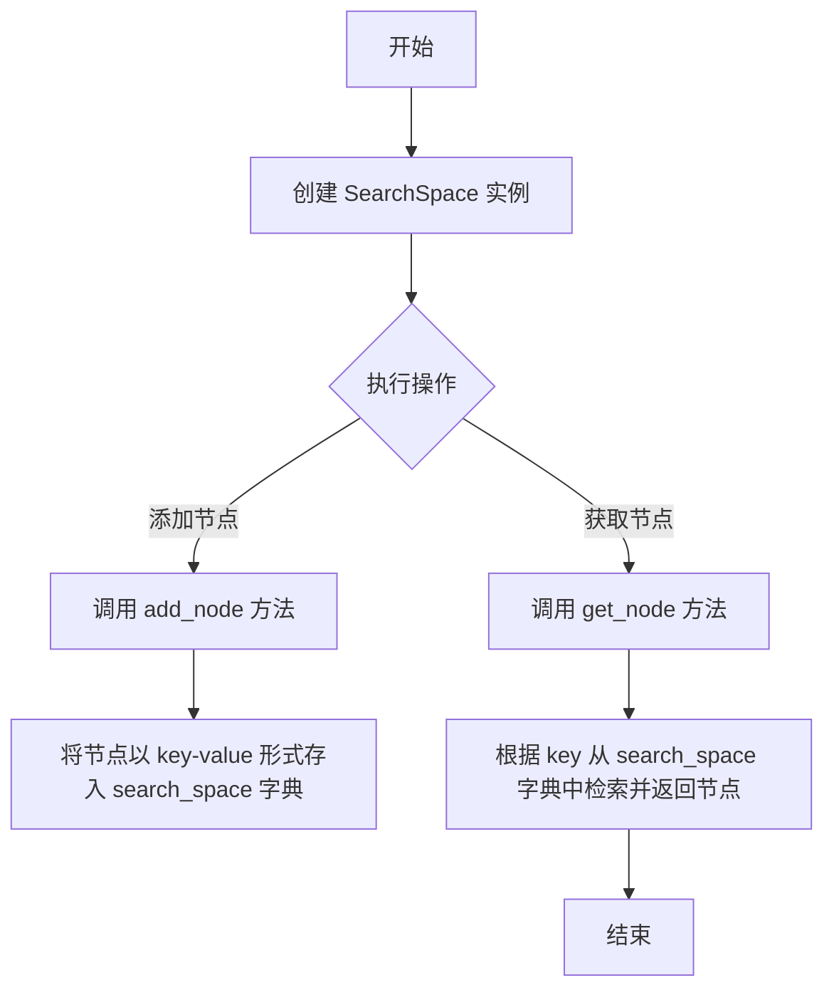
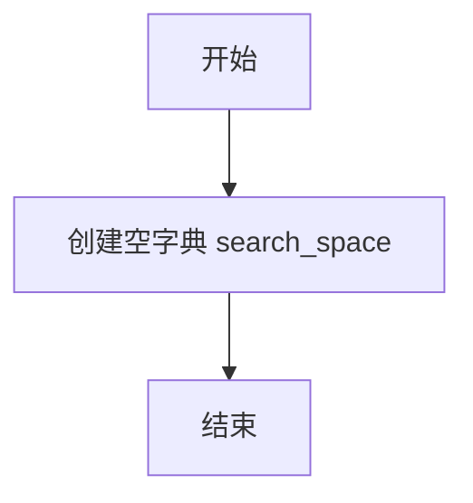
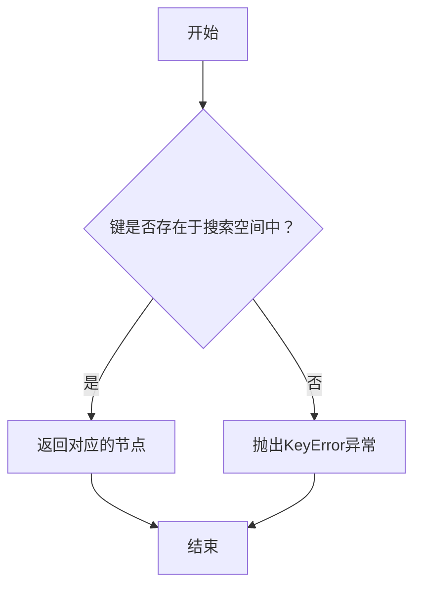

# `.\MetaGPT\metagpt\strategy\search_space.py` 详细设计文档

该代码定义了一个名为 SearchSpace 的类，用于管理和存储 ActionNode 类型的节点，构成一个可查询的搜索空间。核心功能是提供节点的添加和检索能力。

## 整体流程



## 类结构

```
SearchSpace
├── __init__
├── add_node
└── get_node
```

## 全局变量及字段


### `SearchSpace.search_space`
    
用于存储搜索空间中所有节点的字典，以节点的键（key）作为字典的键，节点对象作为值。

类型：`dict`
    
    

## 全局函数及方法

### `SearchSpace.__init__`

该方法用于初始化 `SearchSpace` 类的实例，创建一个空的搜索空间字典。

参数：
- 无

返回值：`None`，无返回值

#### 流程图



#### 带注释源码

```python
def __init__(self):
    # 初始化一个空字典，用于存储搜索空间中的节点
    # 键为节点的 key，值为 ActionNode 对象
    self.search_space = {}
```


### `SearchSpace.add_node`

该方法用于向搜索空间中添加一个节点。节点以键值对的形式存储在内部字典中，其中键是节点的 `key` 属性，值是节点对象本身。

参数：

-  `node`：`ActionNode`，需要添加到搜索空间中的节点对象。该节点必须具有 `key` 属性。

返回值：`None`，此方法不返回任何值。

#### 流程图

```mermaid
flowchart TD
    A[开始: add_node(node)] --> B{node.key 是否存在?};
    B -- 否 --> C[将 node 存入字典<br/>self.search_space[node.key] = node];
    B -- 是 --> D[覆盖字典中 key 对应的旧节点];
    C --> E[结束];
    D --> E;
```

#### 带注释源码

```python
def add_node(self, node):
    # 使用传入节点对象的 `key` 属性作为字典的键
    # 将节点对象本身作为字典的值，存储到内部的 `search_space` 字典中
    # 如果键已存在，新的节点会覆盖旧的节点
    self.search_space[node.key] = node
```


### `SearchSpace.get_node`

该方法用于根据给定的键从搜索空间中检索对应的节点。

参数：

- `key`：`str`，要检索的节点的唯一标识符

返回值：`ActionNode`，返回与给定键关联的节点对象

#### 流程图



#### 带注释源码

```python
def get_node(self, key):
    """
    根据给定的键从搜索空间中获取对应的节点。

    参数:
        key (str): 要检索的节点的唯一标识符。

    返回:
        ActionNode: 与给定键关联的节点对象。

    异常:
        KeyError: 如果给定的键在搜索空间中不存在。
    """
    return self.search_space[key]  # 直接从字典中返回对应键的值
```

## 关键组件


### SearchSpace 类

用于定义和管理一个由 ActionNode 节点构成的搜索空间，提供节点的添加和检索功能。

### 节点存储字典 (search_space)

一个字典类型的类字段，用于存储搜索空间中的所有节点，以节点的键（key）作为字典的键，节点对象作为字典的值。

### 节点添加方法 (add_node)

将给定的 ActionNode 节点添加到搜索空间中，使用节点的 `key` 属性作为字典的键。

### 节点检索方法 (get_node)

根据提供的键（key）从搜索空间中检索并返回对应的 ActionNode 节点。


## 问题及建议


### 已知问题

-   **缺乏输入验证**：`add_node` 方法直接接受 `node` 参数并将其 `key` 属性作为字典键，但未验证 `node` 是否为 `None` 或其 `key` 属性是否存在或有效。如果传入无效对象，可能导致运行时错误或数据不一致。
-   **缺乏错误处理**：`get_node` 方法直接使用 `self.search_space[key]` 进行索引。如果 `key` 不存在于字典中，将抛出 `KeyError` 异常，调用方必须自行处理，增加了使用复杂度。
-   **数据结构单一且缺乏约束**：`search_space` 是一个简单的字典，其值可以是任何对象。这缺乏对存储节点类型的约束，可能导致非 `ActionNode` 类型的对象被错误地添加，破坏搜索空间的语义一致性。
-   **功能过于基础**：当前类仅提供了最基本的增删改查功能，作为一个“搜索空间”，缺乏与搜索相关的核心功能，如遍历节点、查找特定条件的节点、计算路径等，实用性有限。

### 优化建议

-   **增强健壮性**：
    -   在 `add_node` 方法中，添加参数验证。例如，检查 `node` 不为 `None` 且具有 `key` 属性。
    -   将 `get_node` 方法改为更安全的形式。例如，使用 `self.search_space.get(key)` 并返回 `None` 或抛出自定义异常，或者提供一个 `contains_node(key)` 方法供调用方先检查。
-   **明确类型约束**：
    -   在 `__init__` 和 `add_node` 方法中添加类型提示，明确期望的节点类型（例如 `ActionNode`）。
    -   可以考虑在运行时使用 `isinstance` 进行检查，或在文档中明确约定。
-   **扩展功能**：
    -   根据“搜索空间”的职责，添加更多方法，如 `get_all_nodes()`, `find_nodes(predicate)`, `remove_node(key)` 等。
    -   考虑将内部数据结构从 `dict` 升级为更专业的图结构（如使用 `networkx` 库），以支持节点间的边（关系）和复杂的图算法。
-   **改进接口设计**：
    -   考虑将 `search_space` 属性设为私有（如 `_search_space`），并通过公共方法提供访问，以更好地封装内部实现。
    -   可以设计为支持批量添加节点。


## 其它


### 设计目标与约束

该代码旨在提供一个轻量级的搜索空间管理组件，用于存储和检索 ActionNode 类型的节点。其核心设计目标是实现一个简单的键值对映射，以支持后续的搜索或图遍历算法。主要约束包括：1) 当前仅支持通过唯一的键（key）进行节点的添加和获取；2) 内部使用 Python 字典实现，依赖于键的哈希特性；3) 未提供节点删除、空间遍历或持久化功能，功能较为基础。

### 错误处理与异常设计

当前代码的错误处理机制较为简单。在 `get_node` 方法中，如果提供的 `key` 不存在于 `search_space` 字典中，Python 将直接抛出 `KeyError` 异常。代码本身没有定义自定义异常或进行额外的异常捕获与处理。`add_node` 方法假设 `node` 对象具有 `key` 属性，且该属性可用作字典的键，如果 `node.key` 不存在或不可哈希，程序将抛出 `AttributeError` 或 `TypeError`。

### 数据流与状态机

数据流非常简单：1) 初始化时，`search_space` 字典为空。2) 通过 `add_node` 方法，外部传入的 `node` 对象以其 `node.key` 为键被存入 `search_space` 字典。3) 通过 `get_node` 方法，外部传入一个 `key`，方法返回字典中对应键的值（即 `node` 对象）。整个类没有复杂的状态变迁，其状态完全由 `search_space` 字典的内容决定。

### 外部依赖与接口契约

1.  **外部依赖**：依赖于 `ActionNode` 类（代码中提及但未定义）。`SearchSpace` 类的正确运行假设所有通过 `add_node` 添加的对象都是 `ActionNode` 实例（或至少具有 `key` 属性的对象）。
2.  **接口契约**：
    *   `add_node(node)`：调用者需确保 `node` 参数是一个对象，并且该对象具有 `key` 属性。该属性值将作为其在搜索空间内的唯一标识符。
    *   `get_node(key)`：调用者需确保 `key` 参数是之前通过 `add_node` 方法添加的某个节点的 `key` 值。方法返回与该键关联的节点对象。

### 测试策略建议

1.  **单元测试**：
    *   测试 `add_node`：验证添加节点后，`search_space` 字典中确实包含以 `node.key` 为键的条目。
    *   测试 `get_node`：验证对于已添加的节点，`get_node` 能返回正确的节点对象；对于不存在的键，应测试其是否按预期抛出 `KeyError`。
    *   测试键的唯一性：验证添加两个具有相同 `key` 的节点时，后添加的节点会覆盖先前的节点。
2.  **集成测试**：与 `ActionNode` 类一起测试，验证 `SearchSpace` 能否正确管理 `ActionNode` 实例的集合。

### 扩展性考虑

当前实现是一个最小可行产品（MVP）。为支持更复杂的场景，可考虑以下扩展点：
1.  **查询接口**：增加按节点属性（而非仅键）查询、获取所有节点列表或键列表的方法。
2.  **图结构支持**：如果 `ActionNode` 之间存在关系（如边），可扩展此类以维护节点间的邻接关系，从而使其成为一个图数据结构。
3.  **持久化**：添加将搜索空间保存到文件（如 JSON、Pickle）或数据库以及从存储中加载的方法。
4.  **并发控制**：如果存在多线程访问，需要考虑对 `search_space` 的访问加锁（如使用 `threading.Lock`）。

    