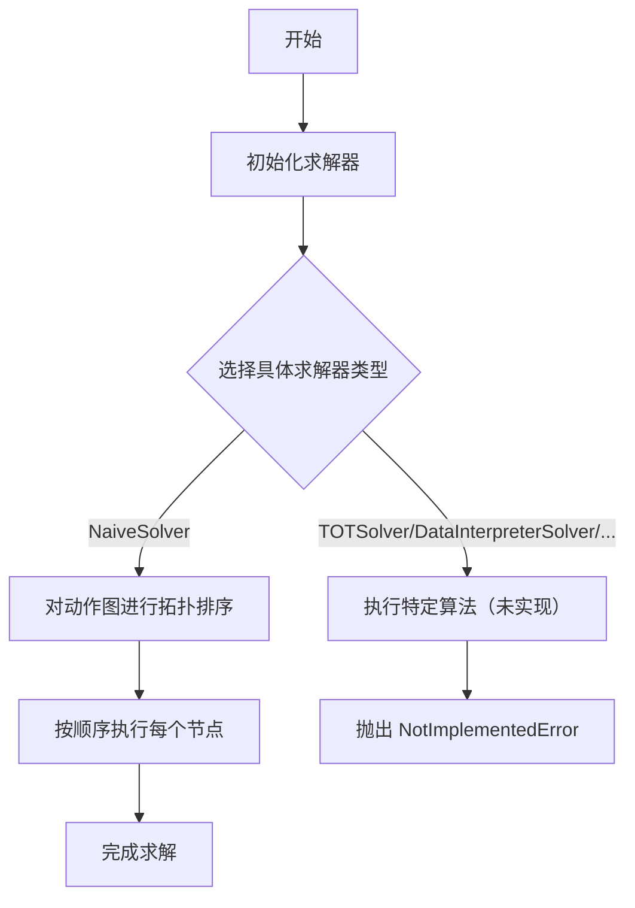
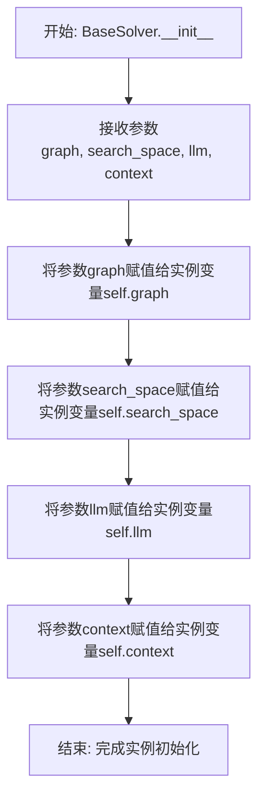
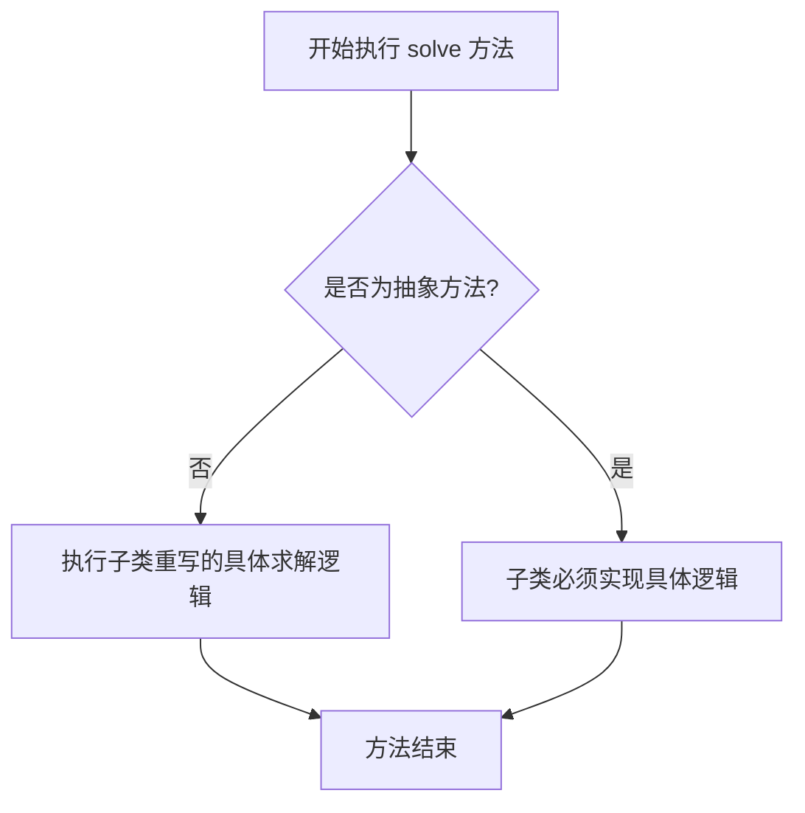
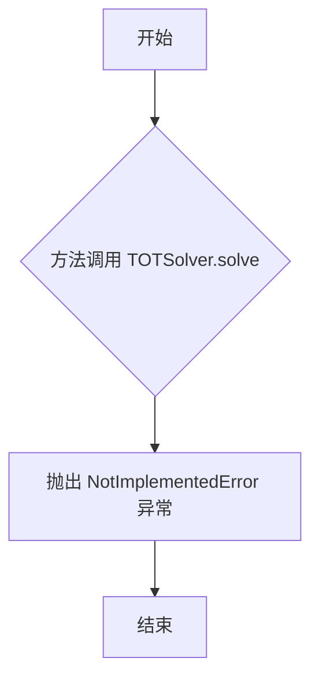
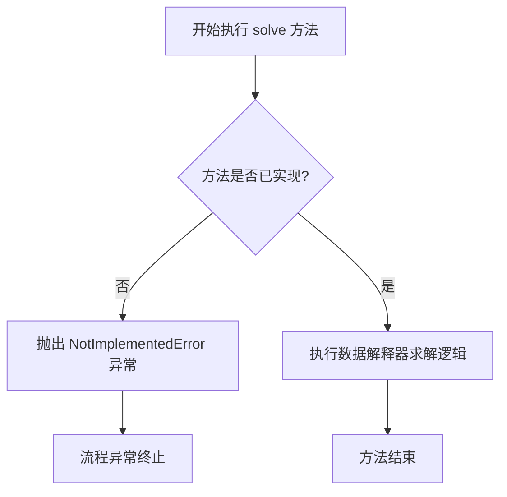
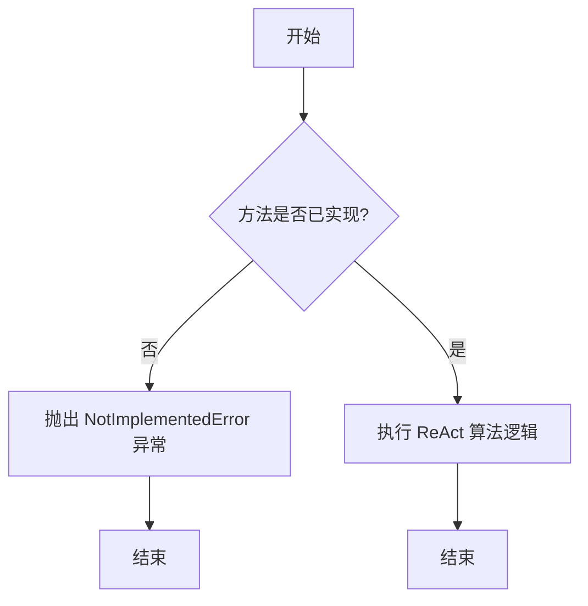
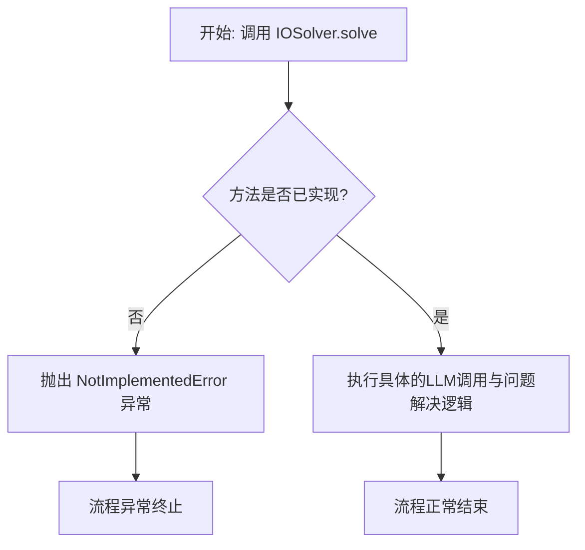
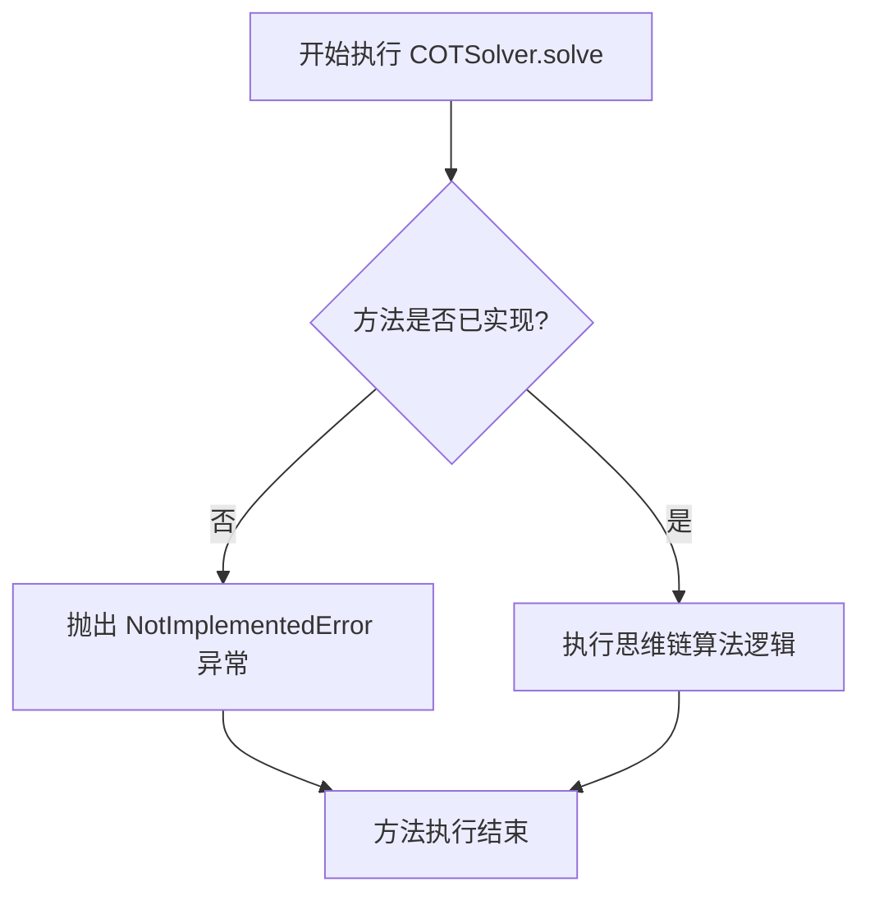

# `.\MetaGPT\metagpt\strategy\solver.py` 详细设计文档

该文件定义了一个求解器（Solver）框架，包含一个抽象基类 BaseSolver 和多个具体实现类（如 NaiveSolver、TOTSolver 等）。这些求解器使用动作图（ActionGraph）、搜索空间（SearchSpace）和大语言模型（BaseLLM）等组件，通过不同的算法策略（如朴素执行、思维树、ReAct等）来解决问题。

## 整体流程



## 类结构

```
BaseSolver (抽象基类)
├── NaiveSolver (朴素求解器)
├── TOTSolver (思维树求解器)
├── DataInterpreterSolver (数据解释器求解器)
├── ReActSolver (ReAct算法求解器)
├── IOSolver (直接输入输出求解器)
└── COTSolver (思维链求解器)
```

## 全局变量及字段


### `BaseSolver.graph`
    
表示问题求解过程中的操作图，定义了需要执行的动作序列及其依赖关系。

类型：`ActionGraph`
    


### `BaseSolver.search_space`
    
定义了问题求解的搜索空间，包含可能的解决方案或路径。

类型：`SearchSpace`
    


### `BaseSolver.llm`
    
大语言模型实例，用于提供自然语言处理能力以辅助问题求解。

类型：`BaseLLM`
    


### `BaseSolver.context`
    
问题求解的上下文信息，包含当前状态、输入数据或环境参数。

类型：`Context`
    
    

## 全局函数及方法


### `BaseSolver.__init__`

`BaseSolver` 类的构造函数，用于初始化求解器实例。它接收并存储求解器运行所需的核心组件，包括一个定义了操作节点和依赖关系的动作图、一个定义了问题搜索空间的描述、一个用于执行推理的大语言模型实例以及一个包含当前问题上下文信息的对象。

参数：

-  `graph`：`ActionGraph`，定义了求解过程中可执行的操作节点及其依赖关系的有向无环图。
-  `search_space`：`SearchSpace`，定义了待解决问题的搜索空间或约束条件。
-  `llm`：`BaseLLM`，提供核心推理能力的大语言模型实例。
-  `context`：`Context`，包含当前待解决问题的具体信息、状态和数据的上下文对象。

返回值：`None`，构造函数不返回任何值。

#### 流程图



#### 带注释源码

```python
def __init__(self, graph: ActionGraph, search_space: SearchSpace, llm: BaseLLM, context):
    """
    :param graph: ActionGraph
    :param search_space: SearchSpace
    :param llm: BaseLLM
    :param context: Context
    """
    # 将传入的动作图对象存储为实例属性，供后续求解过程使用。
    self.graph = graph
    # 将传入的搜索空间对象存储为实例属性，用于定义和约束问题的求解范围。
    self.search_space = search_space
    # 将传入的大语言模型实例存储为实例属性，作为求解器的核心推理引擎。
    self.llm = llm
    # 将传入的上下文对象存储为实例属性，包含了待解决问题的具体信息和数据。
    self.context = context
```


### `BaseSolver.solve`

`BaseSolver.solve` 是 `BaseSolver` 抽象基类中定义的抽象方法，它规定了所有具体求解器（如 `NaiveSolver`）必须实现的、用于解决问题的核心异步接口。该方法旨在利用给定的动作图、搜索空间、大语言模型和上下文来执行求解逻辑。

参数：
-  `self`：`BaseSolver` 或其子类的实例，表示调用该方法的求解器对象本身。

返回值：`None`，此方法为异步执行过程，不直接返回数据结果，而是通过操作 `self.graph` 等内部状态来达成求解目标。

#### 流程图



#### 带注释源码

```python
    @abstractmethod  # 装饰器，表明这是一个抽象方法，子类必须重写实现
    async def solve(self):  # 定义异步抽象方法 solve，无额外参数
        """abstract method to solve the problem."""  # 方法文档字符串：说明这是一个用于解决问题的抽象方法
```


### `NaiveSolver.solve`

`NaiveSolver.solve` 方法是 `NaiveSolver` 类的核心方法，它实现了对 `ActionGraph` 中所有节点的朴素顺序执行。该方法首先对图进行拓扑排序以确定一个无环的执行顺序，然后按照此顺序遍历图中的每个节点（操作），并异步地调用每个节点的 `fill` 方法来执行具体的操作逻辑。

参数：
-  `self`：`NaiveSolver` 实例，包含 `graph`（`ActionGraph` 类型）、`search_space`（`SearchSpace` 类型）、`llm`（`BaseLLM` 类型）和 `context`（`Context` 类型）等属性。这些属性在 `__init__` 方法中初始化，用于提供图结构、搜索空间、大语言模型和上下文信息。

返回值：`None`，该方法不返回任何值，其作用在于执行图中的操作并可能更新内部状态或上下文。

#### 流程图

```mermaid
flowchart TD
    A[开始 solve] --> B[对 self.graph 进行拓扑排序<br>self.graph.topological_sort]
    B --> C[获取图的执行顺序列表<br>self.graph.execution_order]
    C --> D{遍历 execution_order?}
    D -- 是 --> E[获取当前键对应的操作节点<br>op = self.graph.nodes[key]]
    E --> F[异步执行操作节点的 fill 方法<br>await op.fill]
    F --> D
    D -- 否 --> G[结束 solve]
```

#### 带注释源码

```python
async def solve(self):
    # 对图进行拓扑排序，确保执行顺序满足依赖关系（例如，无环图中的节点顺序）
    self.graph.topological_sort()
    # 按照拓扑排序后确定的执行顺序遍历图中的所有节点键
    for key in self.graph.execution_order:
        # 根据当前键从图节点字典中获取对应的操作对象
        op = self.graph.nodes[key]
        # 异步调用操作对象的 fill 方法，传入上下文、大语言模型和执行模式参数，以执行该操作
        await op.fill(req=self.context, llm=self.llm, mode="root")
```


### `TOTSolver.solve`

该方法是一个占位符方法，旨在实现“思维树”（Tree of Thought）算法来解决问题，但目前尚未实现具体逻辑。

参数：
- `self`：`TOTSolver`，`TOTSolver`类的实例。

返回值：`None`，该方法不返回任何值，但会抛出`NotImplementedError`异常。

#### 流程图



#### 带注释源码

```python
async def solve(self):
    # 该方法目前尚未实现，当被调用时会抛出 NotImplementedError 异常。
    # 这表明 TOTSolver 类的 solve 方法是一个待完成的功能。
    raise NotImplementedError
```

### `DataInterpreterSolver.solve`

该方法旨在实现一个“数据解释器”求解器，其核心设计思想是通过在动作图中编写并运行代码来解决问题。根据当前提供的代码，该方法尚未实现具体逻辑，仅抛出了一个`NotImplementedError`异常，表明这是一个待开发的功能占位符。

参数：
-  `self`：`DataInterpreterSolver`，`DataInterpreterSolver`类的实例。

返回值：`None`，此方法为异步方法，不直接返回值，其执行结果可能通过修改实例状态或上下文（`self.context`）来体现。

#### 流程图



#### 带注释源码

```python
async def solve(self):
    # 方法功能：作为数据解释器求解器的核心执行方法。
    # 当前状态：尚未实现具体逻辑，是一个待完成的接口。
    # 预期行为：未来应在此方法中实现通过编写和运行代码来遍历、操作ActionGraph并解决问题的逻辑。
    # 抛出异常：明确指示该功能目前不可用，符合抽象基类BaseSolver的接口约定。
    raise NotImplementedError
```


### `ReActSolver.solve`

该方法旨在实现ReAct（推理-行动）算法，用于解决由`ActionGraph`定义的问题。ReAct是一种结合了推理（Reasoning）和行动（Action）的交互式问题解决范式，通常涉及与大语言模型（LLM）的多次交互，以迭代地思考、计划并执行动作来达成目标。然而，在当前提供的代码中，该方法仅是一个占位符，尚未实现具体的逻辑。

参数：
-  `self`：`ReActSolver`，`ReActSolver`类的实例，包含解决问题所需的上下文信息，如动作图、搜索空间、大语言模型和上下文环境。

返回值：`None`，该方法不返回任何值（在Python中，`async`函数默认返回`None`，除非显式返回其他值）。

#### 流程图



#### 带注释源码

```
async def solve(self):
    # 当前方法尚未实现具体的 ReAct 算法逻辑。
    # 根据类文档字符串的描述，它计划实现 ReAct（推理-行动）算法。
    # ReAct 算法通常涉及以下步骤的循环：
    # 1. 观察（Observation）：从环境中获取当前状态信息。
    # 2. 思考（Thought）：利用 LLM 分析当前状态，推理出下一步应该采取的行动或策略。
    # 3. 行动（Action）：根据推理结果，在动作图（self.graph）中执行相应的动作节点。
    # 4. 获取反馈：行动可能产生新的观察或结果，更新上下文（self.context）。
    # 这个过程会迭代进行，直到问题被解决或达到终止条件。
    # 由于当前是占位实现，直接抛出 NotImplementedError 异常，
    # 提示开发者该方法需要后续完成。
    raise NotImplementedError
```


### `IOSolver.solve`

`IOSolver.solve` 是 `IOSolver` 类的核心方法，旨在直接利用大型语言模型（LLM）来解决问题。根据其类文档描述，该方法目前尚未实现具体逻辑，仅作为框架中的一个占位符，用于定义一种特定的问题解决策略接口。

参数：
-  `self`：`IOSolver`，`IOSolver` 类的实例，用于访问实例属性如 `graph`、`search_space`、`llm` 和 `context`。

返回值：`None`，该方法是一个异步协程，不返回具体值，其主要作用是通过执行内部逻辑来更新状态或产生副作用（例如，通过LLM生成答案并可能更新上下文）。

#### 流程图



#### 带注释源码

```python
async def solve(self):
    # 当前方法体仅包含一个占位符，用于抛出“未实现”异常。
    # 这表明该方法的设计意图是：子类或未来的实现需要重写此方法，
    # 以提供具体的逻辑来利用 self.llm（BaseLLM实例）和 self.context（上下文信息）
    # 直接解决问题，而不是通过预定义的行动图（ActionGraph）步骤。
    raise NotImplementedError
```


### `COTSolver.solve`

COTSolver 类中定义的 `solve` 方法，旨在实现“思维链”算法来解决问题。根据当前提供的代码，该方法尚未实现具体逻辑，仅作为占位符存在，并直接抛出 `NotImplementedError` 异常。

参数：
-  `self`：`COTSolver`，COTSolver 类的实例。

返回值：`None`，此方法为异步方法，不直接返回值，但可能通过修改实例状态或上下文来产生效果。

#### 流程图



#### 带注释源码

```python
async def solve(self):
    """COTSolver: Chain of Thought"""
    # 当前方法体为空，仅抛出未实现错误。
    # 预期的功能是：利用思维链（Chain of Thought）推理方式，
    # 可能通过分解问题、逐步推理、调用LLM等方式来驱动ActionGraph中的节点执行。
    raise NotImplementedError
```


## 关键组件


### BaseSolver

定义了求解器的抽象基类，为所有具体求解器提供统一的接口和基础属性。

### NaiveSolver

实现了朴素的求解策略，通过拓扑排序遍历并顺序执行图中的所有节点。

### TOTSolver

计划实现“思维树”求解策略，旨在通过树形结构探索和评估多种解决方案路径。

### DataInterpreterSolver

计划实现“数据解释器”求解策略，核心是在图中编写并运行代码来解决问题。

### ReActSolver

计划实现“推理-行动”求解策略，通过交替进行推理和外部工具调用来解决问题。

### IOSolver

计划实现“直接输入输出”求解策略，直接使用大语言模型来生成最终答案。

### COTSolver

计划实现“思维链”求解策略，引导大语言模型通过逐步推理来解决问题。


## 问题及建议


### 已知问题

-   **多个求解器未实现**：`TOTSolver`、`DataInterpreterSolver`、`ReActSolver`、`IOSolver`、`COTSolver` 等类的 `solve` 方法均抛出 `NotImplementedError`，表明这些功能尚处于规划或开发阶段，无法实际使用。
-   **上下文参数类型模糊**：`BaseSolver.__init__` 方法中的 `context` 参数类型标注为 `Context`，但在当前代码片段中未定义或导入 `Context` 类，这可能导致类型检查工具报错或开发者理解困难。
-   **缺乏错误处理机制**：`NaiveSolver.solve` 方法在执行 `op.fill` 操作时未进行异常捕获和处理，如果某个操作节点执行失败，整个求解过程将中断，缺乏鲁棒性。
-   **执行顺序依赖单一**：`NaiveSolver` 严格依赖 `graph.topological_sort()` 生成的静态拓扑顺序执行，无法处理动态依赖或执行过程中产生的新依赖关系。
-   **资源管理缺失**：代码中未体现对 `BaseLLM` 等外部资源（如API调用次数、速率限制）的管理和优化策略，在密集调用场景下可能存在性能瓶颈或成本问题。

### 优化建议

-   **实现占位求解器或明确开发状态**：为尚未实现的求解器类（如`TOTSolver`）提供基础实现、存根（Stub）或至少更新文档说明其开发状态，避免运行时直接抛出 `NotImplementedError`。
-   **明确上下文类型**：应导入或正确定义 `Context` 类，或使用更通用的类型提示（如 `Any`、`Dict` 或 `Protocol`）并辅以详细文档说明 `context` 参数的结构和预期内容。
-   **增强错误处理与日志记录**：在 `NaiveSolver.solve` 方法中增加 `try-except` 块来捕获 `op.fill` 可能抛出的异常，记录错误日志，并考虑实现重试、跳过失败节点或优雅降级等策略。
-   **引入动态调度机制**：考虑将 `NaiveSolver` 的静态执行策略扩展为支持动态任务调度的模式，例如基于事件驱动或状态机，以处理执行过程中产生的动态依赖。
-   **抽象资源管理层**：建议在 `BaseSolver` 或更高层级引入资源管理组件，负责管理LLM调用、缓存、限流和成本控制，提高系统整体的可维护性和经济性。
-   **统一求解结果接口**：目前 `solve` 方法没有返回值。建议在 `BaseSolver` 中定义统一的返回类型（如 `Result` 类），包含执行状态、结果数据、指标等信息，便于后续处理和监控。
-   **考虑配置化与依赖注入**：将求解器的选择、图结构、搜索空间等配置外部化，并通过依赖注入框架进行管理，提高系统的可测试性和灵活性。


## 其它


### 设计目标与约束

本模块旨在提供一个可扩展的求解器框架，用于驱动基于动作图（ActionGraph）的任务执行。其核心设计目标包括：
1.  **抽象与扩展性**：通过定义抽象的 `BaseSolver` 基类，为不同的任务求解策略（如顺序执行、思维树、ReAct等）提供统一的接口，支持未来轻松添加新的求解算法。
2.  **策略模式**：将任务执行的算法（`solve` 方法）封装在各个具体的求解器子类中，使得算法可以独立于使用它的客户端而变化。
3.  **资源注入**：通过构造函数将执行所需的资源（动作图、搜索空间、LLM实例、上下文）一次性注入，确保求解器具备完整的执行环境，并遵循依赖注入原则以提高可测试性。
主要约束包括：
1.  **异步执行**：所有求解器的 `solve` 方法均为异步方法，要求调用环境支持异步I/O，以适应LLM调用等耗时操作。
2.  **接口一致性**：所有具体求解器必须实现 `BaseSolver` 定义的 `solve` 接口，保证客户端代码能以统一方式调用。
3.  **未实现功能**：当前代码中，除 `NaiveSolver` 外，其他具体求解器（如 `TOTSolver`, `ReActSolver` 等）的 `solve` 方法均未实现，仅为占位符，这是框架演进过程中的已知状态。

### 错误处理与异常设计

当前模块的错误处理机制较为基础，主要体现在以下方面：
1.  **抽象方法强制**：`BaseSolver` 使用 `@abstractmethod` 装饰器定义了 `async def solve(self)`，强制子类必须实现此方法，否则在实例化时会抛出 `TypeError`。
2.  **未实现异常**：对于尚未完成的具体求解器（如 `TOTSolver`），其 `solve` 方法直接抛出 `NotImplementedError`，明确指示该功能不可用。
3.  **运行时异常传递**：在 `NaiveSolver.solve` 中，潜在的异常（如 `graph.topological_sort()` 对环状图的处理，或 `op.fill()` 执行过程中的错误）会直接向上层调用者抛出，未在模块内部进行捕获或转换。这要求调用者负责处理这些可能发生的运行时异常。
4.  **缺乏输入验证**：构造函数未对传入的 `graph`, `search_space`, `llm`, `context` 参数进行有效性或类型验证。如果传入 `None` 或不兼容的对象，错误可能会在后续方法执行时才暴露，增加了调试难度。

### 数据流与状态机

本模块管理的数据流和状态相对清晰：
1.  **初始状态**：求解器实例化后，其状态由注入的 `graph`, `search_space`, `llm`, `context` 四个核心组件定义。
2.  **数据流（以NaiveSolver为例）**：
    *   **输入**：`self.context` 作为初始请求数据。
    *   **处理**：
        a. 调用 `self.graph.topological_sort()`，确定图中节点的执行顺序（`execution_order`）。此步骤可能修改图的内部分状态。
        b. 按顺序遍历 `execution_order`，对每个节点（`op`）调用 `await op.fill(req=self.context, llm=self.llm, mode="root")`。
        c. `op.fill` 方法执行具体的动作（可能涉及LLM调用、工具使用等），并可能更新 `self.context` 的内容。`llm` 实例作为执行引擎被使用。
    *   **输出**：求解过程的主要“输出”体现在被修改后的 `self.context` 对象中，它累积了各个动作节点的执行结果。`graph` 中各个节点的状态也可能被更新。
3.  **状态机**：模块本身没有显式的复杂状态机。`NaiveSolver` 的执行是一个简单的线性过程：`初始化 -> 拓扑排序 -> 顺序执行每个节点 -> 结束`。其他求解器（如ReAct, ToT）在实现后，可能会引入更复杂的循环、分支或回溯等状态逻辑。

### 外部依赖与接口契约

1.  **外部依赖**：
    *   `metagpt.actions.action_graph.ActionGraph`：提供了任务的动作图表示，包含节点、边以及拓扑排序等功能。
    *   `metagpt.provider.base_llm.BaseLLM`：定义了与大语言模型交互的抽象接口，具体求解器通过它执行LLM调用。
    *   `metagpt.strategy.search_space.SearchSpace`：定义了搜索空间的抽象，可能用于更高级的求解策略（如规划、探索），当前在 `NaiveSolver` 中未使用。
    *   `context`：这是一个类型注解为 `Context` 的参数，代表任务执行的上下文环境，具体结构和类型由系统其他部分定义，是动作节点读写数据的共享空间。
2.  **接口契约**：
    *   **`BaseSolver.__init__`**：契约要求调用者提供有效的 `ActionGraph`, `SearchSpace`, `BaseLLM` 子类实例以及一个上下文对象。
    *   **`BaseSolver.solve()`**：契约要求子类实现此异步方法，该方法负责启动求解流程，不强制规定返回值（当前均为 `None`）。
    *   **`ActionGraph` 契约**：`NaiveSolver` 依赖 `graph` 具有 `topological_sort()` 方法和 `execution_order` 属性以及 `nodes` 字典。
    *   **`ActionNode` 契约**：`NaiveSolver` 依赖 `graph.nodes` 中的每个 `op` 对象具有 `async fill(req, llm, mode)` 方法。
    *   **`BaseLLM` 契约**：`op.fill` 方法内部会使用 `llm` 参数，因此依赖 `BaseLLM` 的具体实现（如 `ask`, `aask` 等方法）。


    