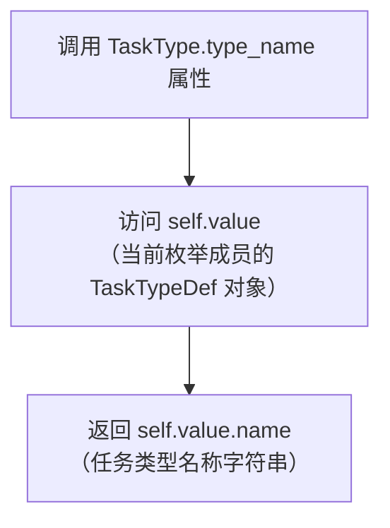

# `.\MetaGPT\metagpt\strategy\task_type.py` 详细设计文档

该代码定义了一个任务类型枚举系统，用于在MetaGPT框架中标识不同类型的AI任务（如EDA、模型训练、网页抓取等），并为每种任务类型关联一个包含名称、描述和指导提示的结构化定义。通过注入人类先验知识（guidance）来辅助任务解决。

## 整体流程

```mermaid
graph TD
    A[开始: 使用TaskType] --> B{调用类方法或属性?}
    B -- 是属性 --> C[访问枚举成员.value获取TaskTypeDef]
    B -- 是类方法 --> D[调用TaskType.get_type(type_name)]
    D --> E[遍历所有枚举成员]
    E --> F{成员.type_name == type_name?}
    F -- 是 --> G[返回对应的TaskTypeDef]
    F -- 否 --> H[继续遍历]
    H --> I{遍历完成?}
    I -- 是 --> J[返回None]
    I -- 否 --> E
```

## 类结构

```
BaseModel (Pydantic基类)
└── TaskTypeDef (任务类型定义模型)
Enum (Python枚举基类)
└── TaskType (任务类型枚举)
```

## 全局变量及字段


### `TaskTypeDef.name`
    
任务类型的名称标识符。

类型：`str`
    


### `TaskTypeDef.desc`
    
任务类型的详细描述。

类型：`str`
    


### `TaskTypeDef.guidance`
    
用于指导解决此类任务的提示文本。

类型：`str`
    


### `TaskType.EDA`
    
表示“探索性数据分析”任务类型的枚举成员。

类型：`TaskTypeDef`
    


### `TaskType.DATA_PREPROCESS`
    
表示“数据预处理”任务类型的枚举成员。

类型：`TaskTypeDef`
    


### `TaskType.FEATURE_ENGINEERING`
    
表示“特征工程”任务类型的枚举成员。

类型：`TaskTypeDef`
    


### `TaskType.MODEL_TRAIN`
    
表示“模型训练”任务类型的枚举成员。

类型：`TaskTypeDef`
    


### `TaskType.MODEL_EVALUATE`
    
表示“模型评估”任务类型的枚举成员。

类型：`TaskTypeDef`
    


### `TaskType.IMAGE2WEBPAGE`
    
表示“图像转网页代码”任务类型的枚举成员。

类型：`TaskTypeDef`
    


### `TaskType.OTHER`
    
表示“其他”任务类型的枚举成员，用于未在定义类别中的任务。

类型：`TaskTypeDef`
    


### `TaskType.TEXT2IMAGE`
    
表示“文本转图像”任务类型的枚举成员（遗留类型）。

类型：`TaskTypeDef`
    


### `TaskType.WEBSCRAPING`
    
表示“网页抓取”任务类型的枚举成员（遗留类型）。

类型：`TaskTypeDef`
    


### `TaskType.EMAIL_LOGIN`
    
表示“电子邮件登录”任务类型的枚举成员（遗留类型）。

类型：`TaskTypeDef`
    


### `TaskType.DEVELOP_SOFTWARE`
    
表示“软件开发”任务类型的枚举成员（遗留类型）。

类型：`TaskTypeDef`
    
    

## 全局函数及方法

### `TaskType.type_name`

`TaskType.type_name` 是 `TaskType` 枚举类的一个属性（property），用于获取当前枚举成员对应的 `TaskTypeDef` 对象中的 `name` 字段值。它提供了一种便捷的方式来访问每个任务类型定义的名称。

参数：
- 无参数。

返回值：`str`，返回当前枚举成员所关联的 `TaskTypeDef` 对象的 `name` 属性值，即该任务类型的字符串名称。

#### 流程图



#### 带注释源码

```python
    @property
    def type_name(self):
        # @property 装饰器将 type_name 方法定义为一个只读属性。
        # 当访问 TaskType.EDA.type_name 时，会调用此方法。
        # self 指向当前的枚举成员（例如 TaskType.EDA）。
        return self.value.name
        # self.value 是当前枚举成员关联的 TaskTypeDef 对象。
        # 返回该对象的 name 属性，即任务类型的名称字符串。
```

### `TaskType.get_type`

这是一个类方法，用于根据给定的类型名称（`type_name`）在 `TaskType` 枚举中查找对应的成员，并返回其关联的 `TaskTypeDef` 对象。如果未找到匹配项，则返回 `None`。

参数：
- `type_name`：`str`，要查找的任务类型名称。

返回值：`TaskTypeDef | None`，如果找到匹配的枚举成员，则返回其 `value`（即 `TaskTypeDef` 对象）；否则返回 `None`。

#### 流程图

```mermaid
flowchart TD
    A[开始: get_type(type_name)] --> B[遍历 TaskType 枚举成员]
    B --> C{成员.type_name == type_name?}
    C -- 是 --> D[返回 member.value]
    C -- 否 --> E[继续遍历]
    E --> B
    B -- 遍历结束 --> F[返回 None]
    D --> G[结束]
    F --> G
```

#### 带注释源码

```python
    @classmethod
    def get_type(cls, type_name):
        # 遍历 TaskType 枚举的所有成员
        for member in cls:
            # 检查当前成员的 type_name 属性是否与传入的 type_name 参数相等
            if member.type_name == type_name:
                # 如果相等，则返回该成员关联的 TaskTypeDef 对象（即 member.value）
                return member.value
        # 如果遍历完所有成员都未找到匹配项，则返回 None
        return None
```

## 关键组件


### TaskTypeDef 类

用于定义任务类型的数据模型，包含任务名称、描述和指导信息。

### TaskType 枚举

通过枚举预定义的任务类型，为每种类型注入人类先验知识（指导信息），以辅助任务解决。

### 任务类型定义与指导信息

将具体的任务类型（如EDA、数据预处理、特征工程等）与对应的指导提示（Prompt）关联，实现任务类型的结构化管理和指导信息的动态注入。

### 类型匹配与检索机制

提供通过任务类型名称检索对应枚举成员和其定义信息的功能，支持基于类型匹配的工具推荐等场景。


## 问题及建议


### 已知问题

-   **枚举成员定义不一致**：`TaskType` 枚举中的成员，如 `OTHER`、`TEXT2IMAGE`、`EMAIL_LOGIN`、`DEVELOP_SOFTWARE` 未提供 `guidance` 字段的值（默认为空字符串），而其他成员都从 `metagpt.prompts.task_type` 导入了具体的提示词。这种不一致性可能导致在使用 `guidance` 时出现空值或意外行为。
-   **`OTHER` 类型的模糊性**：`OTHER` 类型的描述为“Any tasks not in the defined categories”，这可能导致任务分类的边界模糊。当新任务无法精确匹配现有类型时，可能被归类为 `OTHER`，但 `OTHER` 类型缺乏具体的 `guidance`（人类先验知识）来指导任务解决，降低了其实际效用。
-   **潜在的扩展性瓶颈**：当前所有任务类型都硬编码在 `TaskType` 枚举中。添加新的任务类型需要直接修改此枚举类并重新部署代码，这违反了开闭原则，在需要动态或频繁扩展任务类型的场景下会带来维护负担。
-   **`get_type` 方法性能一般**：`TaskType.get_type` 方法通过线性遍历所有枚举成员来查找匹配的 `type_name`。虽然枚举成员数量目前有限，性能影响不大，但随着任务类型的增加，查找效率会线性下降。
-   **缺少输入验证**：`TaskType.get_type` 方法接受一个 `type_name` 字符串参数，但未对该参数进行有效性检查（如是否为 `None` 或空字符串）。虽然代码能处理（返回 `None`），但更明确的验证或错误提示可能有助于调试。

### 优化建议

-   **统一枚举成员定义**：为所有 `TaskTypeDef` 实例提供 `guidance` 字段。对于确实不需要特定指导的类别（如 `OTHER`），可以提供一个通用的、鼓励创造性解决问题的提示词，或者明确注释此处 `guidance` 为空是设计使然，并在使用处做好空值处理。
-   **重构 `OTHER` 类型或引入默认机制**：考虑为 `OTHER` 类型提供一个默认的、通用的任务解决指导 (`guidance`)。或者，设计一个回退机制，当任务被归类为 `OTHER` 或找不到对应类型时，系统能使用一个默认的、更通用的提示策略来辅助任务分解与执行。
-   **将任务类型配置化或插件化**：考虑将任务类型的定义（名称、描述、指导语）移出代码，放入配置文件（如 YAML、JSON）或数据库中。可以设计一个注册机制，允许在运行时动态发现和注册新的任务类型。这能极大提高系统的灵活性和可扩展性。
-   **优化 `get_type` 查找效率**：可以预先构建一个 `{type_name: TaskTypeDef}` 的字典缓存，在 `get_type` 方法中直接进行 O(1) 复杂度的查找。这可以在类初始化时完成，避免每次调用都进行线性遍历。
-   **增强 `get_type` 方法的健壮性**：在 `get_type` 方法开始处添加对 `type_name` 参数的简单检查，例如 `if not type_name: return None`，以提高代码的清晰度和健壮性。同时，可以考虑在找不到匹配类型时，记录一条警告日志，便于问题追踪。


## 其它


### 设计目标与约束

1.  **设计目标**：
    *   **可扩展性**：通过枚举（Enum）和配置类（TaskTypeDef）的设计，允许在不修改核心枚举结构的情况下，通过修改外部提示词（prompt）文件来更新任务类型的指导内容，并支持未来新增任务类型。
    *   **可读性与维护性**：使用枚举清晰地定义一组固定的、已知的任务类型，使代码意图明确，便于开发者理解和使用。通过`TaskTypeDef`模型封装每个类型的元数据（名称、描述、指导），结构清晰。
    *   **提供先验知识**：核心目标是“注入人类先验知识（guidance）以帮助任务解决”，通过为特定任务类型关联预定义的提示词（prompt），为AI代理（Agent）执行任务提供结构化指导。
    *   **向后兼容**：代码中明确注释了`TEXT2IMAGE`等类型为“Legacy TaskType”，旨在支持旧有的工具推荐逻辑，这体现了对历史功能或接口的兼容性考虑。

2.  **设计约束**：
    *   **类型固定性**：任务类型在代码编译时通过枚举定义，是静态的。运行时无法动态创建新的枚举成员，新增类型需要修改代码并重新部署。
    *   **依赖外部提示词**：`TaskType`枚举的`guidance`字段严重依赖于从`metagpt.prompts.task_type`模块导入的全局常量。这些常量的定义和维护在外部，构成了关键的外部依赖。
    *   **Pydantic 模型使用**：使用`BaseModel`作为`TaskTypeDef`的基类，主要利用了其数据验证和序列化能力，但在此上下文中，可能并未完全发挥其数据验证的作用（如`guidance`字段可为空字符串）。

### 错误处理与异常设计

1.  **显式错误处理**：
    *   `get_type` 类方法：当传入的`type_name`无法匹配任何枚举成员时，该方法返回`None`。这是一种“静默失败”的设计，调用方需要检查返回值是否为`None`来判断是否查找成功。这要求调用方具备良好的错误处理逻辑。

2.  **潜在异常**：
    *   **导入错误**：如果`metagpt.prompts.task_type`模块中定义的任何一个`*_PROMPT`常量不存在或无法导入，在模块加载时就会抛出`ImportError`，导致整个`TaskType`枚举无法使用。
    *   **属性访问错误**：虽然枚举成员的值是`TaskTypeDef`实例，访问其`name`、`desc`、`guidance`属性通常是安全的，但如果`TaskTypeDef`的初始化出现问题（例如，传入的`guidance`不是字符串类型），可能在访问时暴露底层数据问题，但Pydantic会在初始化时进行基础类型校验。

3.  **异常处理建议**：
    *   当前设计将错误处理的责任完全交给了`get_type`的调用方。对于关键业务流，调用方应处理`None`返回值，例如抛出一个自定义的`TaskTypeNotFoundError`异常或提供默认行为。
    *   对于`guidance`字段可能为空字符串的情况（如`OTHER`, `TEXT2IMAGE`等类型），使用这些类型的代码需要能够处理空的指导信息。

### 数据流与状态机

1.  **数据流**：
    *   **初始化流**：在模块首次导入时，`TaskType`枚举被定义，其每个成员通过`TaskTypeDef`初始化，并从外部模块加载对应的提示词字符串。这是一个静态的、一次性的数据加载过程。
    *   **查询流**：外部代码通过调用`TaskType.get_type(type_name: str)`发起查询。查询过程在枚举所有成员中进行线性比较（`O(n)`复杂度），返回匹配的`TaskTypeDef`对象或`None`。返回的`TaskTypeDef`对象（包含`name`, `desc`, `guidance`）将作为数据提供给调用方（通常是AI代理或任务调度系统）使用。
    *   **数据使用流**：获取到的`TaskTypeDef`对象中的`guidance`字段（即提示词）很可能被注入到一个更大的提示词模板中，最终发送给大语言模型（LLM），以指导其完成特定类型的任务。

2.  **状态机**：
    *   本模块不管理任何运行时状态。`TaskType`枚举及其成员是 immutable（不可变）的常量。它代表的是一个静态的、定义好的“任务类型分类”知识库，而非一个具有状态变迁的实体。因此，不涉及状态机设计。

### 外部依赖与接口契约

1.  **外部依赖**：
    *   **`enum.Enum`**：Python标准库，用于定义枚举类型。是核心依赖，无版本风险。
    *   **`pydantic.BaseModel`**：用于定义`TaskTypeDef`数据模型。依赖Pydantic库的特定版本。如果未来Pydantic的API发生重大变更，可能会影响本模块。
    *   **`metagpt.prompts.task_type` 模块**：**这是最关键的外部依赖**。本模块期望该模块导出以下特定名称的字符串常量：`DATA_PREPROCESS_PROMPT`, `EDA_PROMPT`, `FEATURE_ENGINEERING_PROMPT`, `IMAGE2WEBPAGE_PROMPT`, `MODEL_EVALUATE_PROMPT`, `MODEL_TRAIN_PROMPT`, `WEB_SCRAPING_PROMPT`。这些常量的缺失或类型不符会导致运行时错误。

2.  **接口契约（对外暴露的API）**：
    *   **`TaskType` 枚举**：作为一组常量对外提供。用户可以直接引用`TaskType.EDA`, `TaskType.MODEL_TRAIN`等。
    *   **`TaskType.type_name` 属性**：每个枚举实例的只读属性，返回其对应`TaskTypeDef`的`name`字符串。
    *   **`TaskType.get_type(type_name: str) -> Optional[TaskTypeDef]` 类方法**：主要的查询接口。契约是：传入一个字符串，如果匹配某个枚举成员的`type_name`，则返回对应的`TaskTypeDef`对象；否则返回`None`。
    *   **`TaskTypeDef` 模型**：作为数据容器对外暴露。契约是：它拥有`name: str`, `desc: str`, `guidance: str`三个字段，其中`guidance`可能为空字符串。

3.  **契约稳定性**：
    *   `TaskType`枚举成员的增减会被视为API的破坏性变更。
    *   `TaskTypeDef`模型的字段变更（增、删、改类型）也会是破坏性变更。
    *   `get_type`方法的签名和返回值语义是稳定的，调用方依赖其返回`None`表示未找到。

    