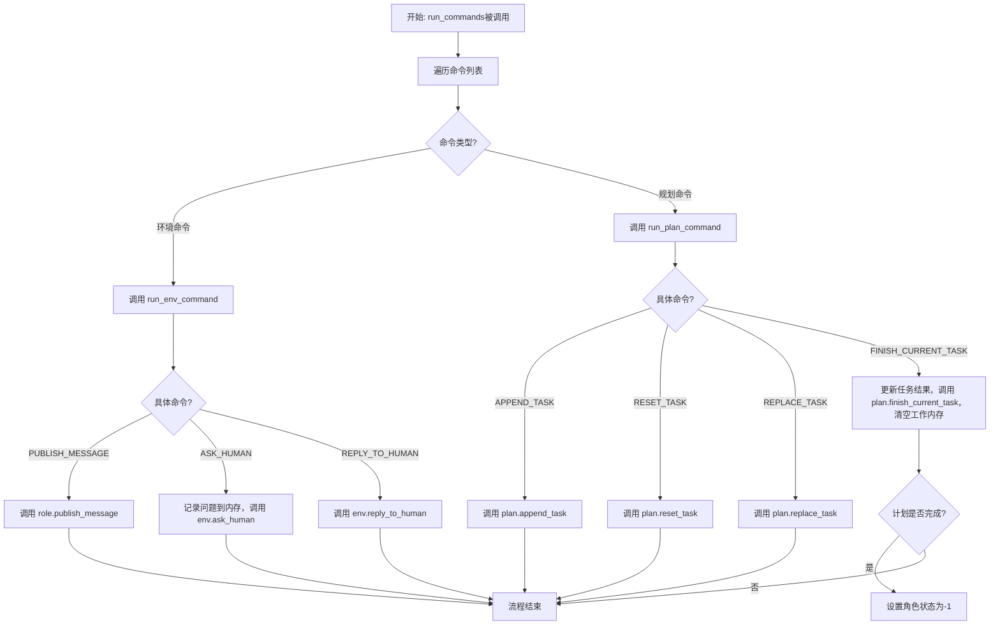
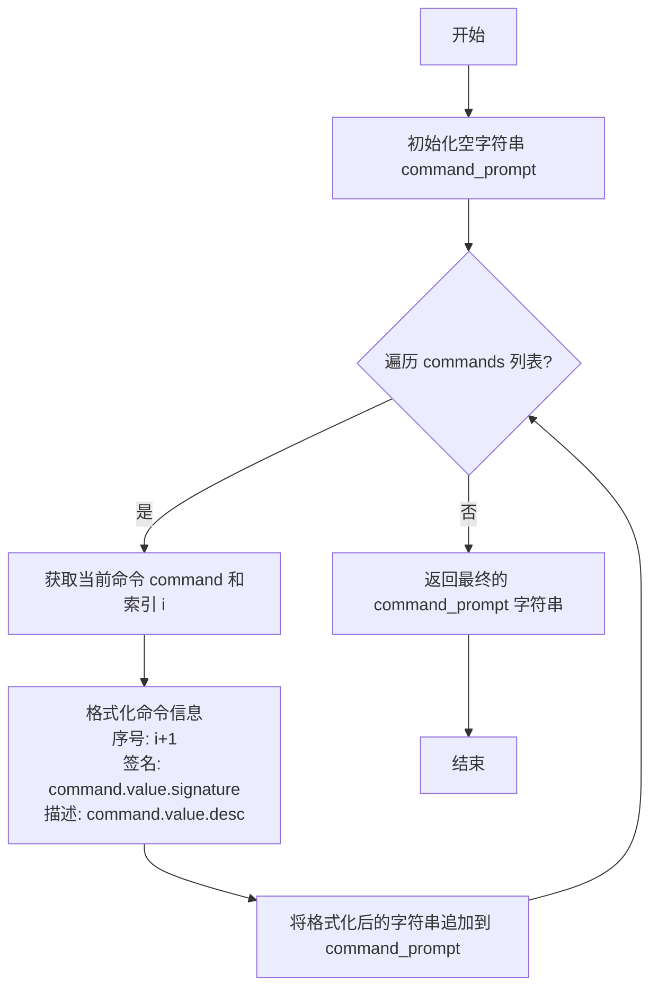
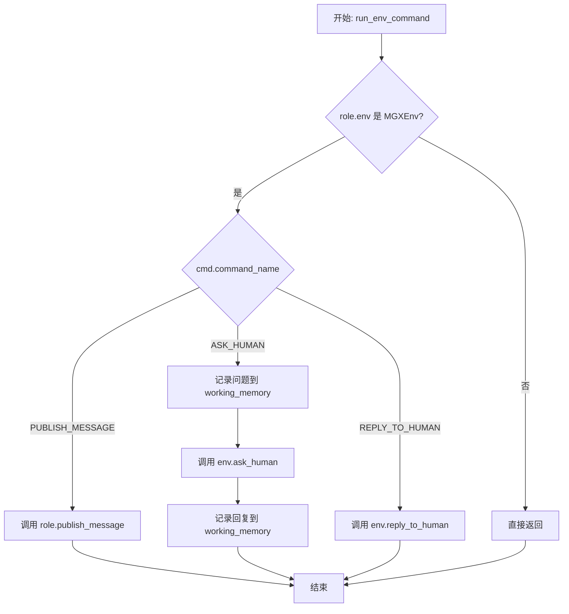
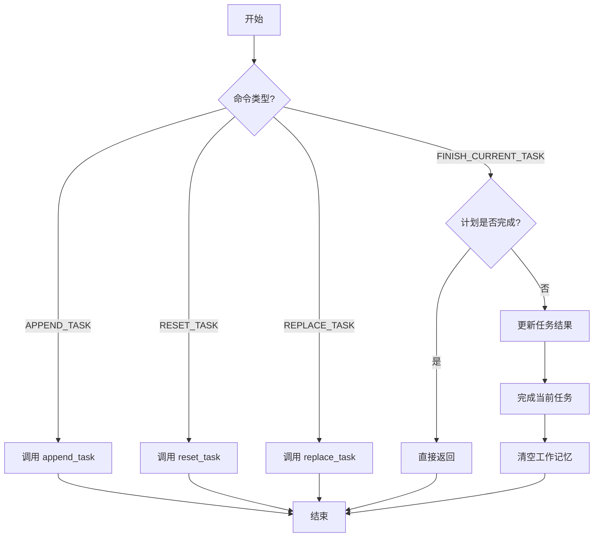
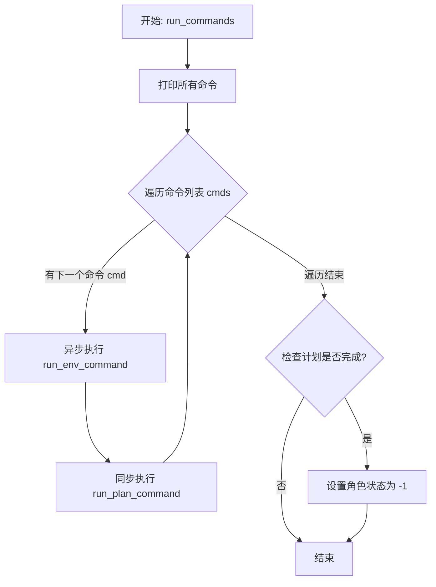
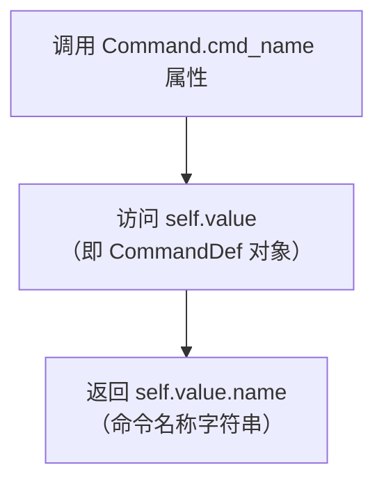

# `.\MetaGPT\metagpt\strategy\thinking_command.py` 详细设计文档

该代码定义了一个命令系统，用于在MetaGPT框架中协调角色（Role）的行为。它通过枚举（Enum）定义了一系列可执行的命令（如任务规划、环境交互），并提供了相应的执行函数。核心功能是解析和执行来自角色的命令，驱动任务计划的更新（如添加、重置、完成任务）以及与环境（如发布消息、询问人类）进行交互，从而实现多智能体协作流程的自动化控制。

## 整体流程



## 类结构

```
BaseModel (Pydantic)
├── CommandDef (命令定义模型)
Enum (Python内置)
└── Command (命令枚举)
     ├── APPEND_TASK
     ├── RESET_TASK
     ├── REPLACE_TASK
     ├── FINISH_CURRENT_TASK
     ├── PUBLISH_MESSAGE
     ├── REPLY_TO_HUMAN
     ├── ASK_HUMAN
     └── PASS
```

## 全局变量及字段


### `CommandDef.name`
    
命令的名称，用于唯一标识一个命令。

类型：`str`
    


### `CommandDef.signature`
    
命令的签名，描述了命令的参数格式，用于生成命令提示或调用。

类型：`str`
    


### `CommandDef.desc`
    
命令的详细描述，解释了命令的功能和使用场景。

类型：`str`
    
    

## 全局函数及方法

### `prepare_command_prompt`

该函数接收一个`Command`枚举类型的列表，将其格式化为一个可读的命令提示字符串。每个命令会按照其在列表中的顺序，被格式化为一个带有序号的条目，包含命令签名和描述。

参数：
- `commands`：`list[Command]`，一个包含`Command`枚举实例的列表，表示需要被格式化为提示的命令。

返回值：`str`，返回一个格式化后的字符串，其中每个命令条目包含序号、签名和描述，条目之间用空行分隔。

#### 流程图



#### 带注释源码

```python
def prepare_command_prompt(commands: list[Command]) -> str:
    # 初始化一个空字符串，用于累积最终的提示文本
    command_prompt = ""
    # 遍历传入的命令列表，同时获取索引 i 和命令对象 command
    for i, command in enumerate(commands):
        # 将每个命令格式化为一个带序号的条目，包含其签名和描述，并追加到 command_prompt 字符串末尾。
        # 格式为：“序号. 签名:\n描述\n\n”
        command_prompt += f"{i+1}. {command.value.signature}:\n{command.value.desc}\n\n"
    # 返回格式化完成的命令提示字符串
    return command_prompt
```


### `run_env_command`

该函数用于执行与`MGXEnv`环境交互相关的命令。它根据传入的命令字典，调用`Role`对象相应的方法来发布消息、询问人类或回复人类。函数会检查当前`Role`的环境是否为`MGXEnv`类型，如果不是则直接返回。对于`ASK_HUMAN`命令，它还会操作角色的工作记忆，记录询问内容和人类回复。

参数：

-  `role`：`Role`，执行命令的角色对象，包含环境、规划器、工作记忆等上下文信息。
-  `cmd`：`list[dict]`，一个包含命令信息的字典。字典中应至少包含`command_name`和`args`键，分别表示命令名称和命令参数。
-  `role_memory`：`Memory`，可选参数，表示角色的记忆对象。在当前函数实现中未直接使用，但作为参数保留以备未来扩展。

返回值：`None`，该函数不返回任何值，其作用是通过副作用（如发送消息、更新记忆）来影响系统状态。

#### 流程图



#### 带注释源码

```python
async def run_env_command(role: Role, cmd: list[dict], role_memory: Memory = None):
    # 检查角色所在的环境是否为 MGXEnv 类型，如果不是则无需执行环境命令，直接返回。
    if not isinstance(role.rc.env, MGXEnv):
        return
    # 处理发布消息命令：根据命令参数创建 Message 对象并调用角色的发布消息方法。
    if cmd["command_name"] == Command.PUBLISH_MESSAGE.cmd_name:
        role.publish_message(Message(**cmd["args"]))
    # 处理询问人类命令：
    if cmd["command_name"] == Command.ASK_HUMAN.cmd_name:
        # TODO: 对角色记忆的操作不应出现在这里，考虑将其移到 Role 类内部。
        # 1. 将助理的提问内容添加到角色的工作记忆中。
        role.rc.working_memory.add(Message(content=cmd["args"]["question"], role="assistant"))
        # 2. 通过环境向人类提问，并等待回复。
        human_rsp = await role.rc.env.ask_human(sent_from=role, **cmd["args"])
        # 3. 将人类的回复内容添加到角色的工作记忆中。
        role.rc.working_memory.add(Message(content=human_rsp, role="user"))
    # 处理回复人类命令：通过环境向人类发送回复。
    elif cmd["command_name"] == Command.REPLY_TO_HUMAN.cmd_name:
        # TODO: 考虑消息是否应该进入记忆。
        await role.rc.env.reply_to_human(sent_from=role, **cmd["args"])
```


### `run_plan_command`

该函数用于执行与任务规划相关的命令。它根据传入的命令字典中的 `command_name`，调用角色（`Role`）的规划器（`planner`）中计划（`plan`）对象的相应方法来修改任务计划。具体支持的命令包括追加任务、重置任务、替换任务和完成当前任务。在执行完成当前任务命令时，如果计划已完成，则直接返回；否则，会先更新当前任务的结果，然后完成当前任务，并清空角色的工作记忆。

参数：
- `role`：`Role`，执行命令的角色对象，包含规划器（`planner`）等属性。
- `cmd`：`list[dict]`，包含命令信息的字典，其中 `command_name` 指定要执行的命令，`args` 包含命令所需的参数。

返回值：`None`，该函数不返回任何值。

#### 流程图



#### 带注释源码

```python
def run_plan_command(role: Role, cmd: list[dict]):
    # 根据命令名称执行相应的计划操作
    if cmd["command_name"] == Command.APPEND_TASK.cmd_name:
        # 追加新任务到计划末尾
        role.planner.plan.append_task(**cmd["args"])
    elif cmd["command_name"] == Command.RESET_TASK.cmd_name:
        # 重置指定任务及其依赖任务
        role.planner.plan.reset_task(**cmd["args"])
    elif cmd["command_name"] == Command.REPLACE_TASK.cmd_name:
        # 替换指定任务并重置其依赖任务
        role.planner.plan.replace_task(**cmd["args"])
    elif cmd["command_name"] == Command.FINISH_CURRENT_TASK.cmd_name:
        # 如果整个计划已经完成，则无需操作
        if role.planner.plan.is_plan_finished():
            return
        # 如果角色有任务结果，则更新当前任务的结果
        if role.task_result:
            role.planner.plan.current_task.update_task_result(task_result=role.task_result)
        # 标记当前任务为完成，并移动到下一个任务
        role.planner.plan.finish_current_task()
        # 清空角色的工作记忆，为下一个任务做准备
        role.rc.working_memory.clear()
```

### `run_commands`

`run_commands` 是一个异步函数，负责执行一个命令列表。它遍历给定的命令列表，针对每个命令，分别调用处理环境交互命令的 `run_env_command` 函数和处理规划命令的 `run_plan_command` 函数。执行完所有命令后，它会检查当前计划是否已完成，如果已完成，则将角色状态设置为 -1。

参数：

- `role`：`Role`，执行命令的角色实例，包含了角色的上下文、规划器、环境等信息。
- `cmds`：`list[dict]`，待执行的命令列表，每个命令是一个字典，包含 `command_name` 和 `args` 等键。
- `role_memory`：`Memory`，可选参数，角色的记忆对象，用于在某些命令（如询问人类）时存储消息。

返回值：`None`，该函数没有返回值。

#### 流程图



#### 带注释源码

```python
async def run_commands(role: Role, cmds: list[dict], role_memory: Memory = None):
    # 打印所有接收到的命令，用于调试或日志记录
    print(*cmds, sep="\n")
    
    # 遍历命令列表，依次执行每个命令
    for cmd in cmds:
        # 异步执行与环境交互相关的命令（如发布消息、询问人类、回复人类）
        await run_env_command(role, cmd, role_memory)
        # 同步执行与任务规划相关的命令（如追加、重置、替换、完成任务）
        run_plan_command(role, cmd)

    # 所有命令执行完毕后，检查当前计划是否已经全部完成
    if role.planner.plan.is_plan_finished():
        # 如果计划完成，将角色的内部状态设置为 -1，通常表示任务结束或进入空闲状态
        role._set_state(-1)
```

### `Command.cmd_name`

`Command.cmd_name` 是 `Command` 枚举类的一个属性（property），用于获取枚举成员所关联的 `CommandDef` 对象的 `name` 字段值。它提供了一种便捷的方式来访问每个命令定义的名称字符串。

参数：
- 无

返回值：`str`，返回当前枚举成员对应的 `CommandDef` 对象的 `name` 属性值，即命令的名称字符串。

#### 流程图



#### 带注释源码

```python
    @property
    def cmd_name(self):
        # 属性访问器，返回当前枚举成员（如 Command.APPEND_TASK）所关联的
        # CommandDef 对象（如 APPEND_TASK 对应的 CommandDef 实例）的 `name` 字段值。
        # 这使得可以通过 `Command.APPEND_TASK.cmd_name` 直接获取到字符串 "append_task"。
        return self.value.name
```

## 关键组件


### CommandDef 数据模型

定义了命令的元数据，包括命令名称、签名（参数列表）和描述，用于统一管理和生成命令提示信息。

### Command 枚举

枚举了系统支持的所有命令类型，分为规划类命令（如追加、重置、替换任务）、环境交互类命令（如发布消息、询问/回复人类）和通用命令（如PASS），每个枚举项都关联一个CommandDef实例。

### prepare_command_prompt 函数

根据提供的命令列表，格式化生成一个可读的命令提示字符串，用于向用户或Agent展示可用的操作选项。

### run_env_command 函数

负责执行与环境交互相关的命令，例如向团队成员发布消息、向人类用户提问或回复。它处理了命令的分发和与MGXEnv环境的交互，并涉及工作内存的更新。

### run_plan_command 函数

负责执行与任务规划相关的命令，例如追加、重置、替换任务或标记当前任务完成。它直接操作Role关联的Planner中的Plan对象，并管理任务状态与工作内存。

### run_commands 函数

命令执行的总入口和协调器。它遍历并依次执行传入的命令列表，分别调用`run_env_command`和`run_plan_command`来处理环境命令和规划命令，并在所有命令执行完毕后检查计划是否完成以更新角色状态。


## 问题及建议


### 已知问题

-   **命令执行逻辑耦合度高**：`run_env_command` 和 `run_plan_command` 函数通过硬编码的 `if-elif` 语句将命令名称与具体的执行逻辑绑定。这种设计违反了开闭原则，当需要新增或修改命令时，必须修改这两个核心函数，增加了维护成本和出错风险。
-   **职责分离不清晰**：`run_env_command` 函数中直接操作了 `role.rc.working_memory`（处理 `ASK_HUMAN` 命令时）。代码中的 `TODO` 注释也指出了这一点，认为内存操作不应出现在此，而应封装在 `Role` 类内部。这破坏了模块间的边界，使得环境命令执行器需要了解角色内部的内存管理细节。
-   **异常处理缺失**：代码中没有对命令执行过程中可能出现的异常（如命令参数错误、`role.planner` 为 `None`、环境方法调用失败等）进行捕获和处理。这可能导致程序在遇到意外情况时直接崩溃，缺乏健壮性。
-   **潜在的竞态条件**：`run_commands` 函数顺序执行多个命令，但在异步上下文中，如果命令执行涉及异步I/O（如 `ask_human`），并且角色状态或计划被并发修改，可能会引发状态不一致的问题。当前代码没有提供任何并发控制机制。
-   **命令验证不足**：在执行命令前，没有对传入的 `cmd` 字典的结构（如是否包含 `command_name` 和 `args` 键）、命令参数的类型和有效性进行验证。这可能导致运行时错误或非预期的行为。
-   **打印日志过于简单**：`run_commands` 函数开头使用 `print(*cmds, sep="\n")` 进行日志输出。这种方式不利于日志的收集、分级、过滤和持久化，在生产环境中不适用，且可能泄露敏感信息。
-   **状态管理可能不完整**：在 `run_plan_command` 中执行 `FINISH_CURRENT_TASK` 后，会调用 `role.rc.working_memory.clear()`。而在 `run_commands` 的最后，如果计划完成，会调用 `role._set_state(-1)`。这些状态变更操作分散在不同层级，逻辑上耦合且可能遗漏其他需要清理或重置的状态。

### 优化建议

-   **引入命令模式或注册机制**：将每个命令封装成独立的类或函数，并通过一个注册表（Registry）或字典来映射命令名称到其处理器。这样，新增命令只需注册新的处理器，无需修改 `run_env_command` 和 `run_plan_command` 函数，符合开闭原则，提高可扩展性。
-   **重构职责，明确边界**：将 `run_env_command` 中关于 `role.rc.working_memory` 的操作移除。`ASK_HUMAN` 和 `REPLY_TO_HUMAN` 命令的完整处理逻辑（包括内存更新）应封装在 `Role` 类或一个专门的 `HumanInteractionHandler` 组件中。`run_env_command` 只应负责调用环境接口。
-   **增强异常处理与验证**：
    -   在命令执行前，验证 `cmd` 字典的格式和必需字段。
    -   使用 `try-except` 块包裹每个命令的执行过程，捕获可能出现的 `KeyError`、`AttributeError`、`TypeError` 等异常，并记录详细的错误日志，或向上层返回明确的错误信息，而不是让程序崩溃。
    -   考虑对命令参数使用 Pydantic 模型进行验证，确保类型和约束正确。
-   **实施并发控制**：如果系统存在并发执行命令的可能，需要为每个 `Role` 实例或关键资源（如 `plan`）引入锁机制（如 `asyncio.Lock`），以确保在命令执行序列中状态修改的原子性和可见性。
-   **升级日志系统**：使用成熟的日志库（如 Python 内置的 `logging` 模块）替代 `print` 语句。可以定义不同的日志级别（DEBUG, INFO, WARNING, ERROR），并配置输出格式、目的地（文件、控制台等）和过滤规则，便于调试和监控。
-   **集中化状态管理**：考虑将计划完成后的状态清理逻辑（如清空工作内存、设置角色状态）集中到一个方法中，例如 `role.on_plan_finished()`。这样可以使状态转换的逻辑更清晰、更易于维护和测试。
-   **提高代码可测试性**：当前函数直接依赖 `role.rc.env` 和 `role.planner` 等具体属性，使得单元测试困难。可以考虑通过依赖注入的方式，让这些函数接收必要的接口（如 `Environment`， `Planner`）作为参数，而不是完整的 `Role` 对象，以便于模拟（Mock）和测试。
-   **优化命令定义**：`Command` 枚举中的 `CommandDef` 包含了签名和描述，可以考虑进一步扩展，例如关联其对应的处理器函数或验证模式，使得命令的定义、文档和执行能更紧密地结合。


## 其它


### 设计目标与约束

本模块的核心设计目标是提供一个可扩展的命令定义与执行框架，用于协调智能体（Role）在元编程任务（MetaGPT）中的规划（Planning）与环境交互（Environment Interaction）行为。其核心约束包括：1. **松耦合**：命令定义（`Command`枚举）与命令执行逻辑（`run_*_command`函数）分离，便于独立维护和扩展新命令类型。2. **上下文感知**：命令执行依赖于`Role`实例的上下文（如`planner`, `env`, `memory`），确保操作在正确的任务和团队状态下进行。3. **异步支持**：部分涉及人机交互或环境通信的命令（如`ASK_HUMAN`, `PUBLISH_MESSAGE`）需要异步执行，框架需支持`async/await`模式。4. **向后兼容**：新增命令不应破坏现有命令的执行流程和`Role`的状态管理。

### 错误处理与异常设计

当前代码的错误处理较为薄弱，主要依赖外部调用方（如`Role`的`_act`方法）进行异常捕获。模块内部缺乏健壮的错误处理机制：1. **命令验证缺失**：`run_env_command`和`run_plan_command`函数未验证传入的`cmd`字典是否包含必需的`command_name`和`args`键，或`args`是否符合命令签名要求，可能导致运行时`KeyError`或参数错误。2. **环境类型检查不充分**：`run_env_command`仅在命令为`PUBLISH_MESSAGE`或`ASK_HUMAN`时检查`role.rc.env`是否为`MGXEnv`实例，若环境不匹配，其他命令可能静默失败或引发属性错误。3. **异常传播**：异步命令（如`ask_human`）中发生的异常会直接向上层传播，缺乏统一的错误日志记录或恢复机制。4. **状态一致性风险**：在`run_plan_command`中，若`finish_current_task`或内存清理操作因异常中断，可能导致`Role`的`working_memory`与`plan`状态不一致。

### 数据流与状态机

本模块管理两条主要数据流：**命令调度流**和**角色状态流**。1. **命令调度流**：入口函数`run_commands`接收来自`Role`决策生成的命令列表（`cmds`）。每条命令被顺序处理：首先尝试匹配环境交互命令（`run_env_command`），然后尝试匹配规划命令（`run_plan_command`）。这种顺序设计意味着规划命令可能依赖于环境命令执行后的状态（如`ASK_HUMAN`后更新了`working_memory`）。2. **角色状态流**：命令执行会驱动`Role`及其关联组件的状态变迁。例如，`APPEND_TASK`/`RESET_TASK`/`REPLACE_TASK`修改`planner.plan`中的任务图；`FINISH_CURRENT_TASK`推进当前任务指针并清空`working_memory`；`PUBLISH_MESSAGE`和`ASK_HUMAN`通过`MGXEnv`改变团队通信状态；`PASS`命令不引发状态变化。最终，当计划完成（`is_plan_finished`）时，通过`role._set_state(-1)`将角色置为终止状态，构成一个隐式的状态机。

### 外部依赖与接口契约

本模块严重依赖外部组件，并定义了清晰的接口契约：1. **对`Role`类的依赖**：要求传入的`role`对象必须包含`rc.env`（环境）、`rc.working_memory`（工作记忆）、`planner.plan`（计划器）等属性，并且`rc.env`在需要时必须是`MGXEnv`实例。`role`还需提供`publish_message`方法。这是模块正常工作的前提。2. **对`MGXEnv`环境的依赖**：`run_env_command`函数要求`role.rc.env`实现`ask_human`和`reply_to_human`方法，并遵循特定的调用签名（接收`sent_from`等参数）。3. **对`Memory`和`Message`的依赖**：`ASK_HUMAN`命令的临时实现直接操作`role.rc.working_memory`（一个`Memory`实例）和`Message`类，这违反了关注点分离原则，构成了紧耦合。4. **输入数据契约**：`run_commands`函数要求`cmds`参数是一个字典列表，每个字典必须包含`command_name`（字符串）和`args`（字典）键。`args`的内容必须与对应`CommandDef`中定义的`signature`匹配。

### 安全与权限考量

当前代码未显式涉及安全与权限控制，但在多智能体协作场景下，这是潜在的重要方面：1. **命令执行权限**：所有命令对拥有`Role`实例的调用者都是可用的。没有机制限制某个特定`Role`（如“成员”角色）执行`RESET_TASK`或`REPLACE_TASK`等可能影响整体计划的高级命令。2. **消息传递安全**：`PUBLISH_MESSAGE`命令允许向任何指定的团队成员（`send_to`）发送任意内容，缺乏对消息内容（如是否包含敏感信息）或接收者合法性（如是否在团队内）的验证。3. **人机交互隔离**：`ASK_HUMAN`和`REPLY_TO_HUMAN`命令直接将内容呈现给人类用户或接收用户输入，缺乏对输入内容的清洗、过滤或对输出内容的审查，可能存在提示注入或信息泄露风险。4. **内存访问控制**：代码中直接访问和修改`role.rc.working_memory`，任何能触发命令执行的路径都可以清空或添加记忆，缺乏细粒度的访问控制。

    