# `.\MetaGPT\metagpt\strategy\tot.py` 详细设计文档

该代码实现了一个基于“思维树”（Tree of Thoughts, ToT）框架的通用问题求解器。核心功能是使用不同的搜索策略（如广度优先搜索BFS、深度优先搜索DFS）来探索和评估由大型语言模型（LLM）生成的多个候选解决方案（“思维”），并从中选择最优解。它通过构建一个树形结构来组织和管理这些候选方案，并使用可配置的评估器对每个节点进行评分，最终输出得分最高的解决方案路径。

## 整体流程

```mermaid
graph TD
    A[开始: 用户调用TreeofThought.solve] --> B{根据Strategy初始化Solver}
    B -- BFS --> C[BFSSolver]
    B -- DFS --> D[DFSSolver]
    B -- MCTS --> E[MCTSSolver (未实现)]
    C --> F[BFSSolver.solve: 初始化根节点和树]
    D --> G[DFSSolver.solve: 初始化根节点和树]
    F --> H[循环: 对于当前层的每个节点]
    H --> I[生成子节点: generate_thoughts]
    I --> J[评估子节点: evaluate_node]
    J --> K[根据策略选择节点: select_nodes]
    K --> L{是否达到最大步数?}
    L -- 否 --> H
    L -- 是 --> M[选择最优解: update_solution]
    M --> N[返回最优解路径]
    G --> O[循环: 对于每条解决方案采样]
    O --> P[执行深度优先搜索: _dfs]
    P --> Q[生成并评估单个子节点]
    Q --> R{子节点是否无效?}
    R -- 是 --> S[增加无效状态计数]
    R -- 否 --> T[将子节点设为当前节点]
    S --> U{无效计数>=2?}
    U -- 是 --> V[中断循环]
    U -- 否 --> T
    T --> P
    V --> O
    O --> W[选择最优解: update_solution]
    W --> X[返回最优解路径]
```

## 类结构

```
BaseModel (Pydantic)
├── ThoughtSolverBase (抽象求解器基类)
│   ├── BFSSolver (广度优先搜索求解器)
│   ├── DFSSolver (深度优先搜索求解器)
│   └── MCTSSolver (蒙特卡洛树搜索求解器 - 未实现)
└── TreeofThought (主入口类，管理配置和求解器)
```

## 全局变量及字段


### `OUTPUT_FORMAT`
    
一个定义LLM输出格式的字符串常量，要求LLM以特定的JSON列表格式返回生成的思考节点。

类型：`str`
    


### `ThoughtSolverBase.thought_tree`
    
表示当前求解过程中的思考树结构，用于存储和追踪所有生成的思考节点及其关系。

类型：`Optional[ThoughtTree]`
    


### `ThoughtSolverBase.llm`
    
用于生成思考和评估节点的大型语言模型实例，是求解器的核心推理引擎。

类型：`BaseLLM`
    


### `ThoughtSolverBase.config`
    
求解器的配置对象，包含生成样本数、选择方法、最大步数等控制求解过程的关键参数。

类型：`ThoughtSolverConfig`
    


### `TreeofThought.config`
    
树搜索算法的全局配置，传递给具体的求解器（Solver）以控制其行为。

类型：`ThoughtSolverConfig`
    


### `TreeofThought.solver`
    
根据选定策略（如BFS、DFS）实例化的具体求解器对象，负责执行核心的搜索逻辑。

类型：`ThoughtSolverBase`
    


### `TreeofThought.strategy`
    
枚举类型，指定要使用的树搜索策略（如广度优先BFS、深度优先DFS、蒙特卡洛树搜索MCTS）。

类型：`Strategy`
    
    

## 全局函数及方法

### `ThoughtSolverBase.__init__`

该方法用于初始化`ThoughtSolverBase`类的实例。它首先调用父类`BaseModel`的构造函数以处理传入的关键字参数，然后设置实例的`llm`属性的`use_system_prompt`字段为`False`，以禁用LLM的系统提示功能。

参数：

-  `kwargs`：`Any`，传递给父类`BaseModel`构造函数的任意关键字参数。

返回值：`None`，此方法不返回任何值。

#### 流程图

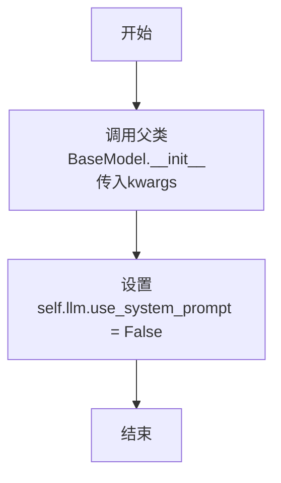

#### 带注释源码

```python
def __init__(self, **kwargs: Any):
    # 调用父类BaseModel的构造函数，传入所有关键字参数
    super().__init__(**kwargs)
    # 将当前实例的llm属性的use_system_prompt字段设置为False
    # 这通常意味着在后续使用此LLM进行交互时，不会自动添加系统提示
    self.llm.use_system_prompt = False
```

### `ThoughtSolverBase.solve`

该方法是一个抽象方法，定义了所有具体求解器（如BFS、DFS、MCTS）必须实现的“解决”问题的核心接口。它接收一个初始提示，并启动整个思维树的构建与搜索过程，最终返回一个解决方案。

参数：
- `init_prompt`：`str`，启动求解过程的初始问题描述或指令。

返回值：`Any`，由具体子类实现的`solve`方法决定，通常返回一个代表最佳解决方案的路径或节点列表。

#### 流程图

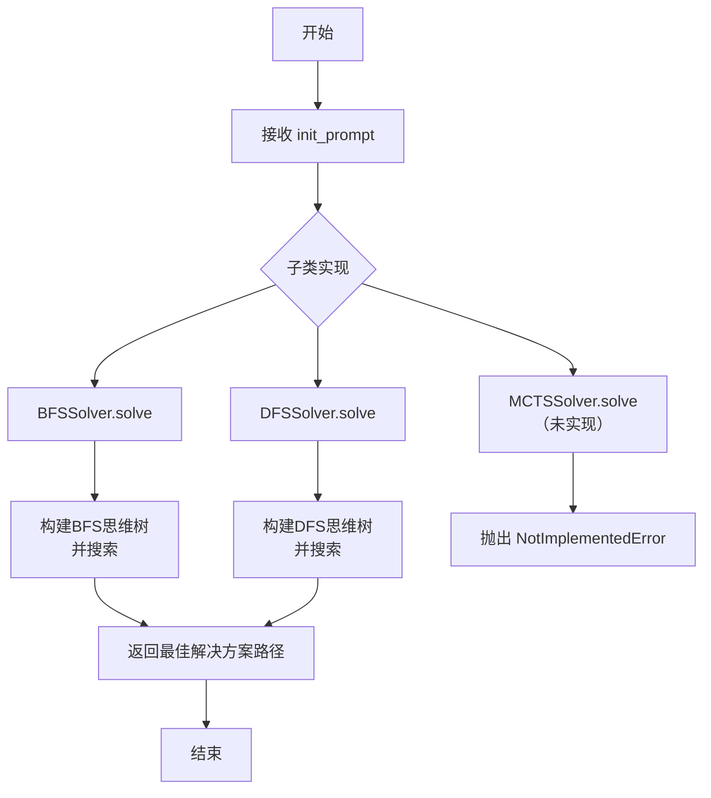

#### 带注释源码

```python
    async def solve(self, init_prompt):
        """
        Solve method for subclasses to implement.
        """
        # 这是一个抽象方法，具体逻辑由继承自ThoughtSolverBase的子类（如BFSSolver, DFSSolver）实现。
        # 它定义了求解器的统一入口，接收初始提示`init_prompt`。
        raise NotImplementedError("Subclasses must implement the solve method")
```

### `ThoughtSolverBase.generate_thoughts`

该方法根据当前状态（`current_state`）和当前节点（`current_node`）生成新的子节点（ThoughtNode）。它通过调用配置的解析器（`parser.propose`）来构建提示，然后使用大语言模型（LLM）生成候选解决方案。生成的文本被解析为JSON格式的节点列表，并最终通过调用`thought_tree.update_node`方法将这些新节点添加到思想树中，作为当前节点的子节点。

参数：

- `current_state`：`str`，当前的状态描述，用于生成新的想法。
- `current_node`：`ThoughtNode`，思想树中的当前节点，新生成的节点将作为其子节点。

返回值：`List[ThoughtNode]`，返回一个ThoughtNode列表，代表新生成的子节点。

#### 流程图

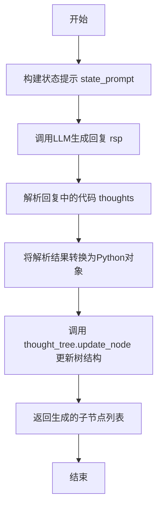

#### 带注释源码

```python
async def generate_thoughts(self, current_state="", current_node=None) -> List[ThoughtNode]:
    """
    根据当前状态生成子节点想法。

    参数:
        current_state (str): 用于生成想法的当前状态。
        current_node (ThoughtNode): 思想树中的当前节点。

    返回:
        List[ThoughtNode]: 代表生成想法的节点列表。
    """
    # 1. 使用配置的解析器，结合当前状态和生成样本数量，构建提示。
    state_prompt = self.config.parser.propose(
        current_state=current_state, **{"n_generate_sample": self.config.n_generate_sample}
    )
    # 2. 调用LLM的异步ask方法，传入构建的提示和输出格式要求，获取模型回复。
    rsp = await self.llm.aask(msg=state_prompt + "\n" + OUTPUT_FORMAT)
    # 3. 使用CodeParser从回复中解析出代码部分（期望是JSON格式的节点列表）。
    thoughts = CodeParser.parse_code(text=rsp)
    # 4. 将解析出的字符串（JSON格式）转换为Python列表对象。
    thoughts = eval(thoughts)
    # fixme 避免不跟随，生成过多nodes
    # valid_thoughts = [_node for idx, _node in enumerate(thoughts) if idx < self.n_generate_sample]
    # 5. 调用思想树的update_node方法，将新生成的节点列表作为当前节点的子节点添加到树中，并返回这些子节点。
    return self.thought_tree.update_node(thoughts, current_node=current_node)
```

### `ThoughtSolverBase.evaluate_node`

该方法用于评估一个思维节点（ThoughtNode），通过调用大语言模型（LLM）对节点的状态进行价值评估，并根据评估结果更新节点的有效状态和累计价值。

参数：

- `node`：`ThoughtNode`，需要被评估的思维节点。
- `parent_value`：`float`，父节点的累计价值，用于计算当前节点的累计价值。

返回值：`None`，该方法不返回任何值，直接更新传入的`node`对象的状态。

#### 流程图

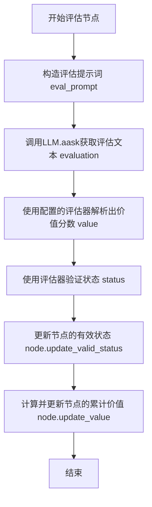

#### 带注释源码

```python
async def evaluate_node(self, node, parent_value) -> None:
    """
    评估一个节点并更新其状态和价值。

    Args:
        node (ThoughtNode): 需要被评估的节点。
        parent_value (float): 父节点的价值。

    Returns:
        None
    """
    # 1. 根据节点信息和配置的解析器，构造用于评估的提示词。
    eval_prompt = self.config.parser.value(input=node.name, **{"node_id": node.id})
    # 2. 异步调用大语言模型，获取对当前节点状态的评估文本。
    evaluation = await self.llm.aask(msg=eval_prompt)

    # 3. 使用配置的评估器（evaluator）从评估文本中解析出具体的价值分数。
    value = self.config.evaluator(evaluation, **{"node_id": node.id})
    # 4. 使用评估器验证该价值分数对应的状态（例如，是否有效或可行）。
    status = self.config.evaluator.status_verify(value)

    # 5. 根据验证结果更新节点的有效状态（valid_status）。
    node.update_valid_status(status=status)
    # 6. 计算当前节点的累计价值：父节点价值 + 当前节点评估价值，并更新节点。
    node.update_value(parent_value + value)
```

### `ThoughtSolverBase.select_nodes`

该方法根据配置的选择策略（如贪婪选择）从一个候选节点列表中筛选出指定数量的最优节点，并将未选中的节点从其父节点中移除，从而更新搜索树的结构。

参数：

- `thought_nodes`：`List[ThoughtNode]`，待筛选的候选节点列表。

返回值：`List[ThoughtNode]`，经过筛选后选中的节点列表。

#### 流程图

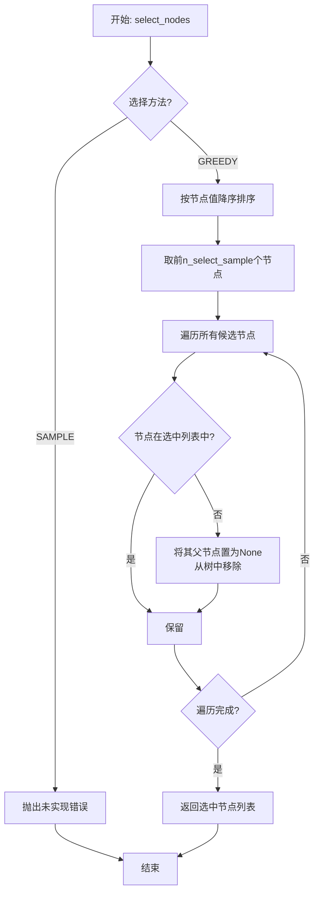

#### 带注释源码

```python
def select_nodes(self, thought_nodes: List[ThoughtNode]) -> List[ThoughtNode]:
    """
    根据配置的选择方法筛选节点。

    Args:
        thought_nodes (List[ThoughtNode]): 待筛选的节点列表。

    Returns:
        List[ThoughtNode]: 筛选后的节点列表。
    """
    # 待选节点列表
    nodes = []
    # 判断配置的筛选方法
    if self.config.method_select == MethodSelect.SAMPLE:
        # 采样方法尚未实现
        raise NotImplementedError
    elif self.config.method_select == MethodSelect.GREEDY:
        # 贪婪选择：按节点值降序排序，取前n_select_sample个
        nodes = sorted(thought_nodes, key=lambda x: x.value, reverse=True)[: self.config.n_select_sample]
    # 遍历所有候选节点，将未选中的节点从其父节点中移除
    for node in thought_nodes:
        if node not in nodes:
            node.parent = None  # 从树中删除节点
    # 返回选中的节点列表
    return nodes
```

### `ThoughtSolverBase.update_solution`

该方法用于从已构建的思维树中，根据节点的累计价值（`value`）选择出最优的解决方案。它首先找到整个树中价值最高的节点，然后回溯该节点的路径，从而得到从根节点到该最优节点的完整解决方案序列。

参数：
- 无

返回值：`Tuple[List[ThoughtNode], List[str]]`，返回一个包含两个元素的元组。第一个元素是包含最优节点的列表（通常只有一个节点），第二个元素是从根节点到该最优节点的路径上所有节点名称（`node.name`）组成的列表。

#### 流程图

```mermaid
flowchart TD
    A[开始] --> B[获取思维树中所有节点]
    B --> C{节点列表是否为空?}
    C -- 是 --> D[设置 best_node 为 None]
    C -- 否 --> E[遍历所有节点<br>找到 value 最大的节点]
    E --> F[设置 best_node 为找到的节点]
    D --> G
    F --> G[调用 thought_tree.parse_node_path(best_node)]
    G --> H[返回 [best_node] 和 best_solution_path]
    H --> I[结束]
```

#### 带注释源码

```python
def update_solution(self):
    """
    选择得分最高的结果。

    返回:
        - List[ThoughtNode]: 代表最佳解决方案的节点列表。
        - List[str]: 构成最佳解决方案路径的节点名称列表。
    """
    # 1. 从思维树的所有节点中，找出 value 值最大的节点。
    #    如果节点列表为空，则 best_node 为 None。
    best_node = max(self.thought_tree.all_nodes, key=lambda x: x.value, default=None)
    
    # 2. 通过思维树的方法，回溯并获取从根节点到 best_node 的路径上的所有节点名称。
    best_solution_path = self.thought_tree.parse_node_path(best_node)
    
    # 3. 返回结果：包含最优节点的列表和解决方案路径。
    return [best_node], best_solution_path
```

### `BFSSolver.solve`

该方法实现了广度优先搜索（BFS）策略来解决“思维树”（Tree of Thoughts）问题。它从初始提示开始，通过多轮迭代生成和评估候选思维节点，每轮选择最有希望的节点进行下一轮扩展，最终返回找到的最佳解决方案路径。

参数：

- `init_prompt`：`str`，启动求解过程的初始问题描述或提示。

返回值：`List[str]`，通过BFS策略找到的最佳解决方案路径，即一系列思维节点名称的列表。

#### 流程图

```mermaid
flowchart TD
    A[开始: solve(init_prompt)] --> B[创建根节点并初始化思维树]
    B --> C{循环: step < max_steps?}
    C -- 是 --> D[调用 _bfs_build 扩展当前节点列表]
    D --> E[调用 select_nodes 选择最有希望的节点]
    E --> F[更新当前节点列表为选中节点]
    F --> G[显示当前思维树状态]
    G --> C
    C -- 否 --> H[调用 update_solution 获取最佳解决方案]
    H --> I[记录并返回最佳解决方案路径]
    I --> J[结束]
```

#### 带注释源码

```python
async def solve(self, init_prompt=""):
    """
    使用广度优先搜索（BFS）策略解决问题。

    Args:
        init_prompt (str): 求解器的初始提示。

    Returns:
        List[str]: 通过BFS获得的最佳解决方案路径。
    """
    # 1. 创建根节点，并基于它初始化整个思维树结构
    root = ThoughtNode(init_prompt)
    self.thought_tree = ThoughtTree(root)
    # 2. 初始化当前待扩展的节点列表，开始时只有根节点
    current_nodes = [root]
    # 3. 进行多轮（max_steps）迭代搜索
    for step in range(self.config.max_steps):
        # 3.1 对当前所有节点进行并行扩展（生成子节点并评估）
        solutions = await self._bfs_build(current_nodes)

        # 3.2 根据评估价值，从所有新生成的子节点中选择最有希望的一批（n_select_sample个）
        selected_nodes = self.select_nodes(solutions)
        # 3.3 更新当前节点列表，下一轮将扩展这些选中的节点
        current_nodes = selected_nodes

        # 3.4 （可选）可视化展示当前思维树的状态，用于调试或监控
        self.thought_tree.show()

    # 4. 所有轮次结束后，从整个树中找出累计价值最高的节点作为最佳解决方案
    best_solution, best_solution_path = self.update_solution()
    # 5. 记录日志并返回最佳解决方案的路径（节点名称序列）
    logger.info(f"best solution is: {best_solution_path}")
    return best_solution_path
```

### `BFSSolver._bfs_build`

该方法实现了广度优先搜索（BFS）策略的核心构建步骤。它接收当前待扩展的节点列表，为每个节点异步生成子节点（新的思考状态）并评估其价值，然后将所有生成的子节点扁平化后返回，作为下一轮BFS扩展的候选节点集。

参数：

-  `current_nodes`：`List[ThoughtNode]`，当前需要进行扩展的节点列表，通常是上一轮搜索中选出的最优节点。

返回值：`List[ThoughtNode]`，返回一个列表，包含所有由`current_nodes`扩展出的子节点（即新的解决方案候选）。

#### 流程图

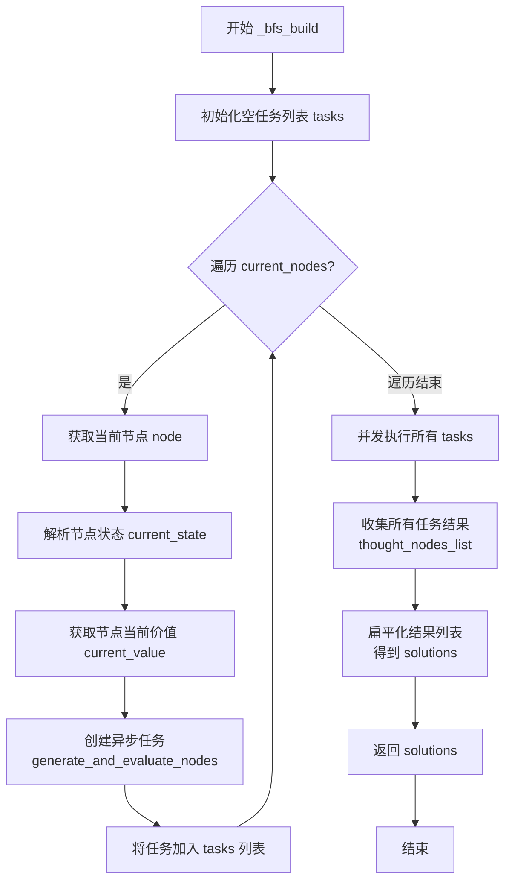

#### 带注释源码

```python
async def _bfs_build(self, current_nodes):
    """
    使用广度优先搜索（BFS）策略构建思考树。

    Args:
        current_nodes (List[ThoughtNode]): 当前待扩展的节点列表。

    Returns:
        List[ThoughtNode]: 扩展当前节点后得到的所有子节点（解决方案候选）。
    """
    # 1. 初始化一个空列表，用于存放所有异步任务。
    tasks = []
    # 2. 遍历当前需要扩展的每一个节点。
    for node in current_nodes:
        # 2.1 使用配置的解析器，从节点名称中提取当前状态。
        current_state = self.config.parser(node.name)
        # 2.2 获取当前节点的累计价值。
        current_value = node.value
        # 2.3 为当前节点创建一个异步任务。
        #     该任务将：a) 生成子节点，b) 评估所有子节点。
        #     任务函数 `generate_and_evaluate_nodes` 返回该节点生成的所有子节点列表。
        tasks.append(self.generate_and_evaluate_nodes(current_state, current_value, node))

    # 3. 并发执行所有节点的生成与评估任务，并等待所有任务完成。
    #    `thought_nodes_list` 是一个列表的列表，每个元素对应一个节点生成的子节点列表。
    thought_nodes_list = await asyncio.gather(*tasks)
    # 4. 将嵌套的列表结构扁平化，得到一个包含所有生成子节点的单一列表。
    solutions = [child_node for thought_nodes in thought_nodes_list for child_node in thought_nodes]
    # 5. 返回所有子节点，作为下一轮BFS的候选节点。
    return solutions
```

### `BFSSolver.generate_and_evaluate_nodes`

该方法负责在广度优先搜索（BFS）策略中，为给定的当前节点生成子节点（候选解决方案），并异步评估这些子节点的价值。它是构建思维树（Thought Tree）的核心步骤，通过并行生成和评估来探索解决方案空间。

参数：

- `current_state`：`str`，当前节点的状态描述，用于生成下一步的候选方案。
- `current_value`：`float`，当前节点的累计价值，将传递给子节点作为评估基准。
- `node`：`ThoughtNode`，当前在思维树中的节点对象，新生成的子节点将作为其子节点。

返回值：`List[ThoughtNode]`，返回一个包含所有新生成且已评估的子节点列表。

#### 流程图

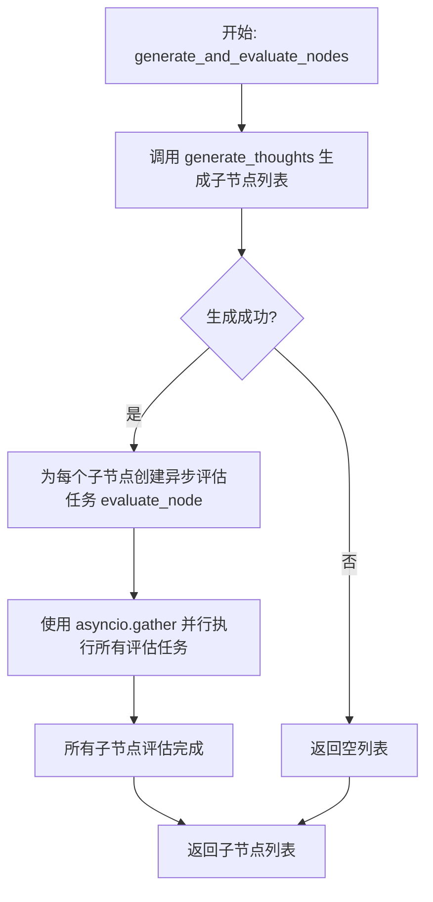

#### 带注释源码

```python
async def generate_and_evaluate_nodes(self, current_state, current_value, node):
    # 1. 生成子节点：基于当前状态，利用LLM生成多个候选解决方案（ThoughtNode）
    thought_nodes = await self.generate_thoughts(current_state, current_node=node)
    
    # 2. 并行评估子节点：为每个生成的子节点创建一个异步评估任务。
    #    评估任务会调用LLM对子节点的解决方案进行评分，并更新节点的有效状态和累计价值。
    await asyncio.gather(
        *(self.evaluate_node(child_node, parent_value=current_value) for child_node in thought_nodes)
    )
    
    # 3. 返回所有已评估的子节点列表，供后续的选择步骤使用。
    return thought_nodes
```

### `DFSSolver.solve`

该方法实现了基于深度优先搜索（DFS）策略的思维树求解过程。它通过递归生成和评估思维节点，探索可能的解决方案路径，最终选择得分最高的路径作为最优解。

参数：

- `init_prompt`：`str`，初始提示，用于生成根节点的思维状态。
- `root`：`ThoughtNode`，根节点，默认为空节点。

返回值：`List[str]`，最优解决方案路径，即从根节点到得分最高节点的节点名称序列。

#### 流程图

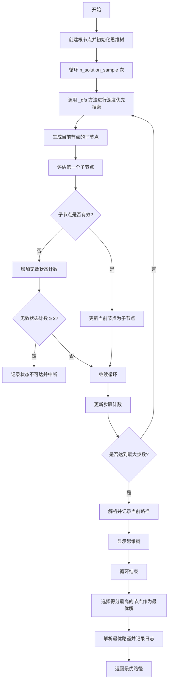

#### 带注释源码

```python
async def solve(self, init_prompt="", root=ThoughtNode("")):
    """
    使用深度优先搜索（DFS）策略解决问题。

    Args:
        init_prompt (str): 求解器的初始提示。
        root (ThoughtNode): 根节点，默认为空节点。

    Returns:
        List[str]: 通过DFS获得的最优解决方案路径。
    """
    # 创建根节点并初始化思维树
    root = ThoughtNode(init_prompt)
    self.thought_tree = ThoughtTree(root)
    
    # 循环生成多个解决方案样本
    for n in range(self.config.n_solution_sample):
        # 注意：需要实现回退机制，当当前节点不可用时回退到父节点，生成新节点继续探索
        await self._dfs(root)

    # 选择得分最高的节点作为最优解
    best_solution, best_solution_path = self.update_solution()
    
    # 记录最优解决方案路径
    logger.info(f"best solution is: {best_solution_path}")
    
    # 返回最优解决方案路径
    return best_solution_path
```

### `DFSSolver._dfs`

该方法实现了深度优先搜索（DFS）策略，用于在思想树中探索可能的解决方案。它从给定的根节点开始，递归地生成子节点并评估其有效性，直到达到最大步数或遇到连续两个无效状态时停止。最终返回从根节点到当前节点的路径作为解决方案。

参数：

- `root_node`：`ThoughtNode`，思想树的根节点，表示搜索的起始点。

返回值：`List[str]`，返回从根节点到当前节点的路径，表示通过DFS探索得到的解决方案。

#### 流程图

```mermaid
graph TD
    A[开始] --> B[初始化计数器 impossible_state_cnt = 0]
    B --> C[设置当前节点 node = root_node]
    C --> D[循环 step 从 0 到 max_steps-1]
    D --> E[获取当前状态 current_state]
    E --> F[生成子节点 thought_nodes]
    F --> G[评估第一个子节点 thought_nodes[0]]
    G --> H{子节点是否有效?}
    H -->|否| I[计数器 impossible_state_cnt 加 1]
    I --> J{计数器 >= 2?}
    J -->|是| K[记录日志并跳出循环]
    J -->|否| L[继续]
    H -->|是| L
    L --> M[更新当前节点为 thought_nodes[0]]
    M --> N[继续循环]
    K --> O[解析当前节点路径]
    O --> P[显示思想树]
    P --> Q[返回解决方案路径]
    N --> D
    D --> Q
```

#### 带注释源码

```python
async def _dfs(self, root_node):
    """
    在思想树上执行深度优先搜索（DFS）。

    Args:
        root_node (ThoughtNode): 思想树的根节点。

    Returns:
        List[str]: 通过DFS获得的解决方案路径。
    """
    impossible_state_cnt = 0  # 记录连续无效状态的计数器
    node = root_node  # 设置当前节点为根节点
    for step in range(self.max_steps):  # 循环直到达到最大步数
        current_state = self.config.parser(node.name)  # 获取当前节点的状态
        current_value = node.value  # 获取当前节点的值
        thought_nodes = await self.generate_thoughts(current_state, current_node=node)  # 生成子节点
        await self.evaluate_node(thought_nodes[0], parent_value=current_value)  # 评估第一个子节点
        if thought_nodes[0].valid_status is False:  # 如果子节点无效
            impossible_state_cnt += 1  # 计数器加1
        if impossible_state_cnt >= 2:  # 如果连续两个子节点无效
            logger.info("impossible state reached, break")  # 记录日志
            break  # 跳出循环
        node = thought_nodes[0]  # 更新当前节点为第一个子节点
    _solution_path = self.thought_tree.parse_node_path(node)  # 解析当前节点的路径
    self.thought_tree.show()  # 显示思想树

    return _solution_path  # 返回解决方案路径
```

### `MCTSSolver.solve`

该方法当前未实现，是蒙特卡洛树搜索（MCTS）求解器的占位方法。根据其父类 `ThoughtSolverBase` 的设计，该方法旨在接收一个初始提示，通过 MCTS 算法在思想树中搜索并返回最优解决方案路径。当前实现仅抛出 `NotImplementedError` 异常，表明这是一个待完成的功能。

参数：
- `init_prompt`：`str`，启动求解过程的初始问题描述或提示。

返回值：`NotImplementedError`，该方法当前未实现，调用时会抛出此异常。

#### 流程图

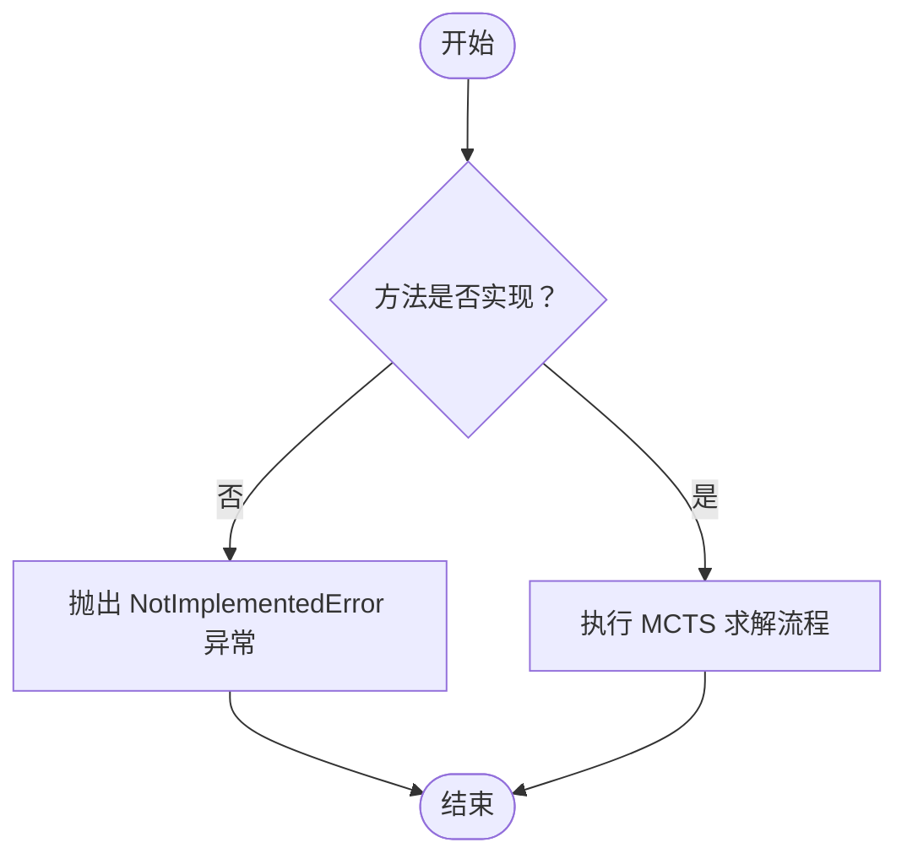

#### 带注释源码

```python
async def solve(self, init_prompt=""):
    # 该方法当前未实现，是 MCTS 求解器的占位方法。
    # 根据设计，它应接收初始提示，通过蒙特卡洛树搜索算法
    # 在思想树中探索和评估节点，最终返回最优解决方案路径。
    # 当前实现直接抛出异常，提示需要子类或后续开发来完成具体逻辑。
    raise NotImplementedError
```

### `TreeofThought.__init__`

该方法用于初始化TreeofThought类，根据传入的策略配置初始化相应的求解器。

参数：

- `**kwargs`：`Any`，任意关键字参数，用于初始化父类BaseModel的字段。

返回值：`None`，无返回值。

#### 流程图

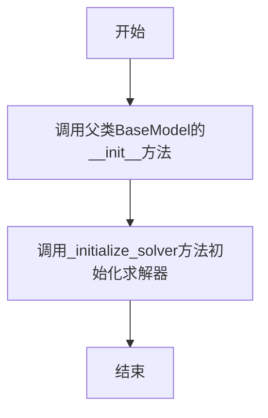

#### 带注释源码

```python
def __init__(self, **kwargs: Any):
    # 调用父类BaseModel的__init__方法，初始化配置和字段
    super().__init__(**kwargs)
    # 根据策略初始化相应的求解器
    self._initialize_solver(self.strategy)
```

### `TreeofThought._initialize_solver`

该方法根据传入的策略枚举值，初始化对应的求解器（Solver）实例，并将其赋值给当前`TreeofThought`对象的`solver`字段。它实现了策略模式，将不同搜索算法（BFS、DFS、MCTS）的创建逻辑封装起来。

参数：

-  `strategy`：`Strategy`，用于指定要使用的求解策略，例如广度优先搜索（BFS）、深度优先搜索（DFS）或蒙特卡洛树搜索（MCTS）。

返回值：`None`，该方法不返回任何值，其作用是为当前`TreeofThought`对象的`solver`字段赋值。

#### 流程图

```mermaid
flowchart TD
    A[开始: _initialize_solver(strategy)] --> B{判断 strategy 类型}
    B -- strategy == Strategy.BFS --> C[创建 BFSSolver 实例]
    B -- strategy == Strategy.DFS --> D[创建 DFSSolver 实例]
    B -- strategy == Strategy.MCTS --> E[创建 MCTSSolver 实例]
    B -- 其他 --> F[抛出 NotImplementedError 异常]
    C --> G[将实例赋值给 self.solver]
    D --> G
    E --> G
    F --> H[流程结束]
    G --> H
```

#### 带注释源码

```
    def _initialize_solver(self, strategy):
        """
        Initialize the solver based on the chosen strategy.

        Args:
            strategy (Strategy): The strategy to use for solving.

        Returns:
            ThoughtSolverBase: An instance of the appropriate solver.
        """
        # 根据传入的策略枚举值，选择创建对应的求解器实例
        if strategy == Strategy.BFS:
            # 创建广度优先搜索求解器
            self.solver = BFSSolver(config=self.config)
        elif strategy == Strategy.DFS:
            # 创建深度优先搜索求解器
            self.solver = DFSSolver(config=self.config)
        elif strategy == Strategy.MCTS:
            # 创建蒙特卡洛树搜索求解器（当前未实现）
            self.solver = MCTSSolver(config=self.config)
        else:
            # 如果传入的策略不在支持范围内，抛出未实现错误
            raise NotImplementedError(f"Invalid strategy: {strategy}, only support BFS/DFS/MCTS currently!")
```

### `TreeofThought.solve`

该方法根据指定的策略（BFS、DFS或MCTS）初始化相应的求解器，并调用其`solve`方法来解决给定的问题。它作为TreeofThought类的主要入口点，负责协调整个求解过程。

参数：

- `init_prompt`：`str`，提供给求解器的初始提示，用于启动问题求解过程。

返回值：`Any`，返回由具体求解器（如BFSSolver或DFSSolver）计算出的最佳解决方案路径。

#### 流程图

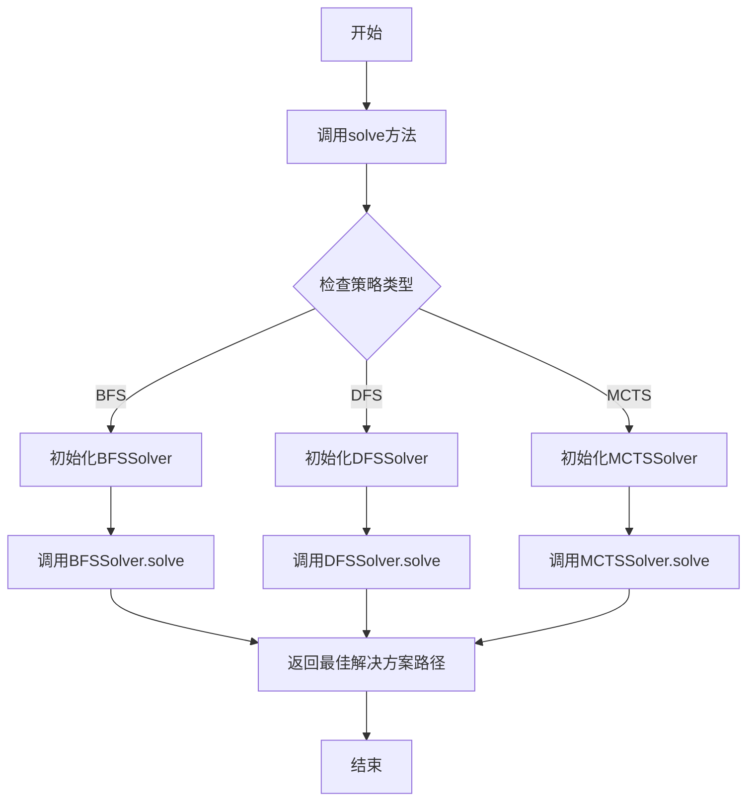

#### 带注释源码

```python
async def solve(self, init_prompt=""):
    """
    根据指定的策略（BFS、DFS或MCTS）初始化相应的求解器，并调用其solve方法来解决给定的问题。

    Args:
        init_prompt (str): 提供给求解器的初始提示，用于启动问题求解过程。

    Returns:
        Any: 返回由具体求解器（如BFSSolver或DFSSolver）计算出的最佳解决方案路径。
    """
    # 调用已初始化的求解器的solve方法
    await self.solver.solve(init_prompt)
```

## 关键组件

### ThoughtSolverBase

作为所有具体求解器（BFS、DFS、MCTS）的基类，定义了树搜索求解器的通用框架，包括思想生成、节点评估、节点选择和解决方案更新等核心流程。

### ThoughtTree

用于管理和维护搜索过程中的节点关系与状态，提供节点更新、路径解析和树结构展示等功能，是树搜索算法的核心数据结构。

### ThoughtNode

表示搜索树中的一个节点，包含节点的状态、价值、有效性状态以及父子关系，是构建和遍历思想树的基本单元。

### ThoughtSolverConfig

配置类，封装了求解器的运行参数，包括搜索步数、生成样本数、选择样本数、评估器、状态解析器以及节点选择方法等。

### Strategy

枚举类，定义了不同的搜索策略（如BFS、DFS、MCTS），用于在`TreeofThought`中初始化对应的求解器。

### MethodSelect

枚举类，定义了节点选择的方法（如贪婪选择、采样选择），用于在`ThoughtSolverBase.select_nodes`方法中指导如何从候选节点中筛选出下一步要扩展的节点。

### BFSSolver

广度优先搜索求解器，通过逐层扩展节点来探索解空间，使用贪婪选择法筛选节点，适用于寻找较浅层的较优解。

### DFSSolver

深度优先搜索求解器，通过深入探索单一路径来寻找解，当遇到无效状态时尝试回溯，适用于探索深层解空间。

### MCTSSolver

蒙特卡洛树搜索求解器（当前未实现），计划用于通过模拟和回溯来平衡探索与利用，适用于复杂决策场景。

### TreeofThought

高层封装类，根据指定的策略（BFS、DFS、MCTS）初始化对应的求解器，并提供统一的调用接口来启动问题求解过程。

### Parser & Evaluator

（在`ThoughtSolverConfig`中配置）关键功能组件。`Parser`负责将节点状态转换为提示词以生成新思想，或将节点状态转换为评估输入。`Evaluator`负责评估生成的思想的价值并判断其有效性状态。它们共同定义了问题领域的具体逻辑。

## 问题及建议


### 已知问题

-   **DFS 算法实现不完整**：`DFSSolver` 中的 `_dfs` 方法存在逻辑缺陷。当生成的子节点无效时，代码仅增加计数器，但未实现真正的“回退”机制（即回溯到父节点并尝试其他子节点）。注释 `# fixme: 需要产生回退...` 也指出了这一点，导致 DFS 可能无法有效探索解空间。
-   **MCTS 策略未实现**：`MCTSSolver` 类中的 `solve` 方法直接抛出 `NotImplementedError`，导致选择 MCTS 策略时功能不可用。
-   **节点生成数量控制缺失**：在 `ThoughtSolverBase.generate_thoughts` 方法中，从 LLM 解析出的 `thoughts` 列表被直接使用。虽然存在注释 `# fixme 避免不跟随，生成过多nodes` 和被注释掉的代码 `valid_thoughts = ...`，但当前逻辑并未限制返回的节点数量，可能违反 `n_generate_sample` 的配置约束。
-   **硬编码的评估逻辑**：`ThoughtSolverBase.evaluate_node` 方法中，节点的有效状态 (`status`) 完全由 `self.config.evaluator.status_verify(value)` 决定，但 `evaluator` 的接口和 `status_verify` 方法的契约未在代码中明确，存在潜在的接口不一致风险。
-   **潜在的类型安全风险**：`ThoughtSolverBase.generate_thoughts` 方法中使用 `eval(thoughts)` 来解析 LLM 返回的 JSON 字符串。这存在安全风险（如果 LLM 输出被恶意污染）和稳定性风险（如果输出格式不符合严格的 JSON 格式）。
-   **错误处理不完善**：代码中缺乏对关键操作（如 LLM 调用失败、JSON 解析失败、节点评估异常）的健壮错误处理，可能导致整个求解过程意外终止。

### 优化建议

-   **完善 DFS 回溯机制**：重构 `DFSSolver._dfs` 方法，实现显式的栈来管理搜索状态。当当前节点的子节点全部无效或探索完毕时，应能回溯到上一个决策点（父节点），并尝试其下一个待探索的子节点，直到找到有效解或穷尽所有可能。
-   **实现 MCTS 求解器**：根据 MCTS (蒙特卡洛树搜索) 算法的标准步骤（选择、扩展、模拟、反向传播），实现 `MCTSSolver` 类，以提供另一种有效的启发式搜索策略。
-   **加强节点生成控制**：取消 `generate_thoughts` 方法中的注释代码，或实现更健壮的控制逻辑，确保返回的 `ThoughtNode` 列表长度严格等于 `self.config.n_generate_sample`。如果 LLM 返回过多，应截断；如果返回不足，应考虑重试或使用默认值填充。
-   **明确评估器接口契约**：在 `ThoughtSolverConfig` 或相关文档中明确定义 `evaluator` 对象必须实现的接口（至少包含 `__call__` 和 `status_verify` 方法），包括其输入、输出和异常行为，以提高代码的可维护性和可扩展性。
-   **替换 `eval` 为安全解析**：将 `eval(thoughts)` 替换为 `json.loads(thoughts)`，并在外围添加 `try-except` 块以捕获 `json.JSONDecodeError`。这能提高安全性并给出更清晰的错误信息。同时，可以在提示工程中强化 LLM 的 JSON 输出格式要求。
-   **增强错误处理与日志**：
    -   在 `llm.aask`、`CodeParser.parse_code`、`evaluator` 调用等可能失败的地方添加异常捕获。
    -   记录关键步骤的日志（如节点生成、评估结果、选择过程），并记录警告或错误信息，便于调试和监控求解过程。
    -   考虑设计重试机制（如 LLM 调用失败时）或降级策略。
-   **优化异步任务管理**：在 `BFSSolver._bfs_build` 中，大量并发调用 `generate_and_evaluate_nodes` 可能导致资源耗尽或 API 速率限制。建议引入信号量 (`asyncio.Semaphore`) 来控制最大并发数，或根据 `config` 添加批处理大小控制。
-   **提高配置灵活性**：考虑将 `OUTPUT_FORMAT` 等硬编码的提示模板部分也纳入 `ThoughtSolverConfig` 或 `parser` 的配置中，使输出格式要求更易于调整和定制。
-   **代码结构与复用**：`BFSSolver` 和 `DFSSolver` 中 `solve` 方法末尾的日志记录和解决方案更新逻辑是重复的。可以将其提取到 `ThoughtSolverBase` 的一个公共方法中（如 `_finalize_solution`），供子类调用，遵循 DRY 原则。


## 其它


### 设计目标与约束

本模块旨在实现一个基于“思维树”（Tree of Thought, ToT）框架的通用问题求解器。其核心设计目标是将复杂的推理问题分解为多步的“思维”节点，并通过搜索策略（如BFS、DFS）在树状结构中探索和评估可能的解决方案路径，最终选择最优解。主要约束包括：依赖外部大语言模型（LLM）生成和评估思维节点；搜索深度和宽度受配置参数（`max_steps`, `n_generate_sample`, `n_select_sample`）限制；当前DFS策略的回退机制尚未完全实现；MCTS策略暂未实现。

### 错误处理与异常设计

模块中的错误处理主要依赖于Python的异常机制和日志记录。关键方法如`solve`、`generate_thoughts`在子类中未实现时会抛出`NotImplementedError`。在`_initialize_solver`方法中，如果传入不支持的策略枚举，也会抛出`NotImplementedError`。代码中使用`metagpt.logs.logger`记录信息（如找到最优解）和警告（如遇到不可能状态）。然而，对于LLM API调用失败、返回的响应格式不符合`OUTPUT_FORMAT`要求（导致`eval(thoughts)`失败）、或配置参数无效等情况，缺乏明确的异常捕获和恢复处理，存在潜在的运行时崩溃风险。

### 数据流与状态机

模块的核心数据流围绕`ThoughtTree`和`ThoughtNode`对象展开。**初始化阶段**：用户提供初始问题描述（`init_prompt`），`TreeofThought`根据配置的`Strategy`初始化对应的Solver（如`BFSSolver`）。**搜索阶段**：Solver从根节点开始，循环执行“生成-评估-选择”流程。1. **生成**：Solver调用`generate_thoughts`，将当前节点状态（`current_state`）通过`config.parser.propose`方法格式化为Prompt，调用LLM生成多个子思维节点。LLM返回的文本被`CodeParser`解析并转化为`ThoughtNode`列表，加入树中。2. **评估**：Solver为每个新生成的节点调用`evaluate_node`，通过`config.parser.value`格式化Prompt调用LLM进行评估，然后使用`config.evaluator`函数和`status_verify`方法计算节点价值与有效性状态，并更新节点的累计价值。3. **选择**：根据配置的`method_select`（如贪心算法），Solver调用`select_nodes`从当前层的所有节点中筛选出最有希望的节点，作为下一轮扩展的起点（BFS）或继续深入的节点（DFS）。**终止与输出**：达到最大步数（`max_steps`）或满足其他终止条件后，调用`update_solution`，从所有节点中找出累计价值最高的节点，并通过`parse_node_path`回溯得到完整的解决方案路径。

### 外部依赖与接口契约

1.  **大语言模型（LLM）**：强依赖`metagpt.provider.base_llm.BaseLLM`接口（通过`metagpt.llm.LLM`实例化）。契约要求该接口提供异步方法`aask(msg: str) -> str`以接收Prompt并返回文本响应。`ThoughtSolverBase`中设置了`llm.use_system_prompt = False`。
2.  **思维解析与评估器（Parser & Evaluator）**：依赖`ThoughtSolverConfig`中配置的`parser`和`evaluator`。`parser`需提供`propose`（用于生成思维）和`value`（用于评估思维）方法；`evaluator`需是一个可调用对象，接受评估文本和参数返回一个数值，并具有`status_verify`方法用于判断思维有效性。这些组件的具体实现由使用方注入，定义了问题领域的特定逻辑。
3.  **数据结构**：依赖`metagpt.strategy.base`中的`ThoughtNode`和`ThoughtTree`类来构建和管理树形结构。
4.  **工具函数**：依赖`metagpt.utils.common.CodeParser`来从LLM响应中解析JSON格式的思维列表。
5.  **配置与策略枚举**：依赖`metagpt.strategy.tot_schema`中的`ThoughtSolverConfig`、`MethodSelect`和`Strategy`枚举进行配置和策略选择。

### 并发与异步设计

模块充分利用了`asyncio`进行并发操作以提高性能，特别是在需要批量处理节点时。在`BFSSolver._bfs_build`方法中，使用`asyncio.gather`并发地为多个当前节点执行`generate_and_evaluate_nodes`任务。在`generate_and_evaluate_nodes`内部，又再次使用`asyncio.gather`并发地评估一个父节点下的所有子节点。这种设计显著减少了在BFS策略下因顺序执行LLM调用而产生的IO等待时间。`ThoughtSolverBase`的核心方法（`solve`, `generate_thoughts`, `evaluate_node`）均定义为`async`，确保了异步调用的兼容性。

### 配置管理与扩展性

系统的行为高度由`ThoughtSolverConfig`对象控制，包括搜索步数（`max_steps`）、每步生成的思维数量（`n_generate_sample`）、每步选择的思维数量（`n_select_sample`）、选择方法（`method_select`）以及领域特定的`parser`和`evaluator`。这种设计将通用搜索框架与具体问题逻辑解耦，提供了良好的扩展性。新增一种搜索策略（如A*）只需继承`ThoughtSolverBase`并实现`solve`方法，然后在`TreeofThought._initialize_solver`和`Strategy`枚举中注册即可。新增一种节点选择算法也只需扩展`MethodSelect`枚举并在`select_nodes`中实现。

    