# `.\MetaGPT\metagpt\strategy\tot_schema.py` 详细设计文档

该代码定义了一个用于配置思维求解器（Thought Solver）的核心配置类及其相关的枚举类型。它通过枚举定义了求解方法（MethodSelect）和搜索策略（Strategy），并通过Pydantic模型ThoughtSolverConfig来集中管理求解器的各项运行参数，如最大步数、采样数量以及解析器（Parser）和评估器（Evaluator）的实例。该模块为构建基于不同搜索策略（如BFS、DFS、MCTS）的自动化问题求解或规划系统提供了可配置的、类型安全的参数基础。

## 整体流程

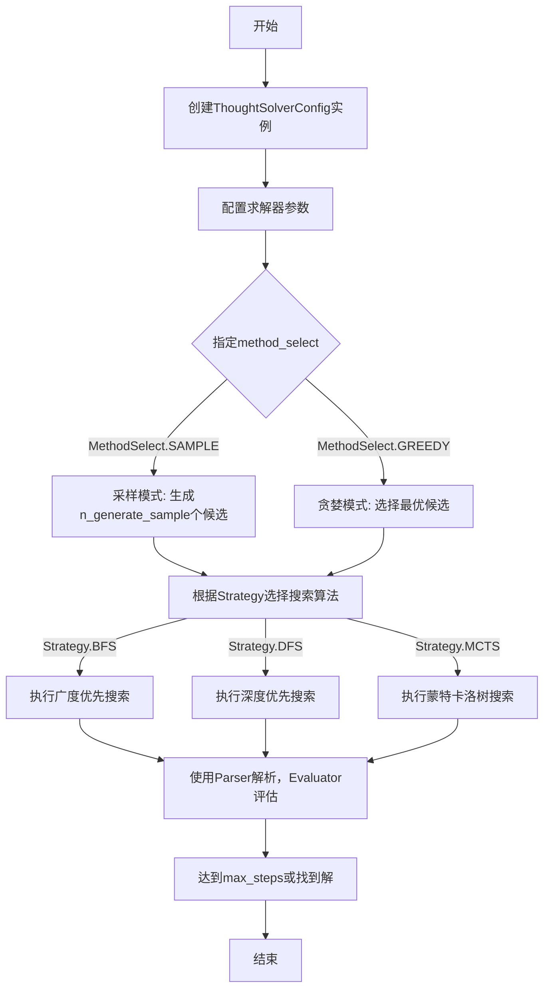

## 类结构

```
Enum (枚举基类)
├── MethodSelect (方法选择枚举)
└── Strategy (搜索策略枚举)
BaseModel (Pydantic模型基类)
└── ThoughtSolverConfig (求解器配置模型)
```

## 全局变量及字段


### `MethodSelect.SAMPLE`
    
枚举值，表示采用采样方法进行节点选择。

类型：`Enum member`
    


### `MethodSelect.GREEDY`
    
枚举值，表示采用贪婪方法进行节点选择。

类型：`Enum member`
    


### `Strategy.BFS`
    
枚举值，表示广度优先搜索策略。

类型：`Enum member`
    


### `Strategy.DFS`
    
枚举值，表示深度优先搜索策略。

类型：`Enum member`
    


### `Strategy.MCTS`
    
枚举值，表示蒙特卡洛树搜索策略。

类型：`Enum member`
    


### `ThoughtSolverConfig.max_steps`
    
求解器最大执行步数，用于控制搜索深度或迭代次数。

类型：`int`
    


### `ThoughtSolverConfig.method_select`
    
节点选择方法，可选值为'sample'（采样）或'greedy'（贪婪）。

类型：`str`
    


### `ThoughtSolverConfig.n_generate_sample`
    
每个节点生成的候选样本数量。

类型：`int`
    


### `ThoughtSolverConfig.n_select_sample`
    
每条路径选择的样本数量。

类型：`int`
    


### `ThoughtSolverConfig.n_solution_sample`
    
仅用于DFS策略，从最终候选集中采样的解决方案数量。

类型：`int`
    


### `ThoughtSolverConfig.parser`
    
解析器实例，用于解析输入或中间表示。

类型：`BaseParser`
    


### `ThoughtSolverConfig.evaluator`
    
评估器实例，用于评估候选解决方案的质量。

类型：`BaseEvaluator`
    
    

## 全局函数及方法


### `ThoughtSolverConfig.__init__`

`ThoughtSolverConfig.__init__` 是 `ThoughtSolverConfig` 类的构造函数。它负责初始化一个用于配置思维求解器（Thought Solver）的参数对象。该对象定义了求解器在运行时的关键行为参数，例如最大步数、节点生成与选择策略、使用的解析器和评估器等。由于该类继承自 `pydantic.BaseModel`，其 `__init__` 方法会自动验证输入参数的类型和默认值，确保配置对象的完整性和有效性。

参数：

-  `max_steps`：`int`，求解器允许执行的最大推理步数，默认值为 3。
-  `method_select`：`str`，节点选择方法，可选值为 `"sample"`（采样）或 `"greedy"`（贪婪），默认值为 `MethodSelect.GREEDY`（即 `"greedy"`）。
-  `n_generate_sample`：`int`，每个节点生成的候选方案数量，默认值为 5。
-  `n_select_sample`：`int`，每条路径上选择的候选方案数量，默认值为 3。
-  `n_solution_sample`：`int`，仅在深度优先搜索（DFS）策略下，最终生成的解决方案数量，默认值为 5。
-  `parser`：`BaseParser`，用于解析输入或中间结果的解析器实例，默认通过 `default_factory` 创建一个 `BaseParser` 对象。
-  `evaluator`：`BaseEvaluator`，用于评估候选方案质量的评估器实例，默认通过 `default_factory` 创建一个 `BaseEvaluator` 对象。

返回值：`None`，构造函数不显式返回值，其作用是初始化并返回一个 `ThoughtSolverConfig` 类的实例。

#### 流程图

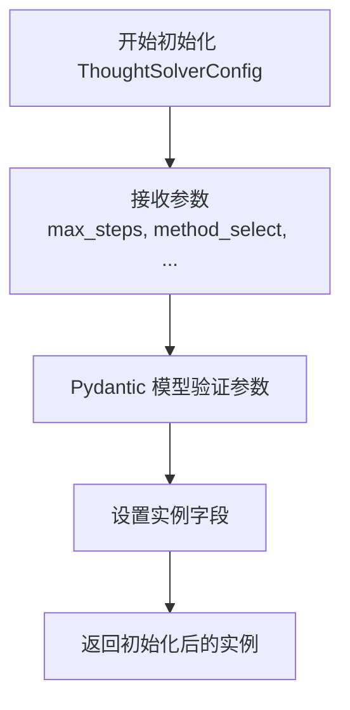

#### 带注释源码

```python
# ThoughtSolverConfig 类继承自 pydantic.BaseModel
# 其 __init__ 方法由 BaseModel 自动生成和管理，用于初始化字段并验证数据
class ThoughtSolverConfig(BaseModel):
    # 定义最大推理步数字段，类型为 int，默认值为 3
    max_steps: int = 3
    # 定义方法选择字段，类型为 str，默认值为枚举 MethodSelect.GREEDY 的值（"greedy"）
    method_select: str = MethodSelect.GREEDY  # ["sample"/"greedy"]
    # 定义每个节点生成的样本数，类型为 int，默认值为 5
    n_generate_sample: int = 5  # per node
    # 定义每条路径选择的样本数，类型为 int，默认值为 3
    n_select_sample: int = 3  # per path
    # 定义（DFS策略下）解决方案样本数，类型为 int，默认值为 5
    n_solution_sample: int = 5  # only for dfs
    # 定义解析器字段，类型为 BaseParser，使用 Field 配置默认工厂函数创建实例
    parser: BaseParser = Field(default_factory=BaseParser)
    # 定义评估器字段，类型为 BaseEvaluator，使用 Field 配置默认工厂函数创建实例
    evaluator: BaseEvaluator = Field(default_factory=BaseEvaluator)
    # 注意：实际的 __init__ 方法体由 Pydantic 在幕后处理，
    # 它会根据上述字段定义自动生成并执行参数接收、类型检查、默认值填充等逻辑。
```


### `ThoughtSolverConfig.model_dump`

该方法继承自Pydantic的`BaseModel`，用于将`ThoughtSolverConfig`模型实例序列化为一个字典。它处理了模型的所有字段，包括枚举类型和默认工厂生成的复杂对象，将它们转换为Python内置的可序列化类型（如字符串、整数、字典等），以便于存储、传输或进一步处理。

参数：

-  `self`：`ThoughtSolverConfig`，`ThoughtSolverConfig`类的一个实例。
-  `include`：`Union[AbstractSetIntStr, MappingIntStrAny]`，可选参数，指定要包含在输出字典中的字段。可以是字段名的集合或映射。
-  `exclude`：`Union[AbstractSetIntStr, MappingIntStrAny]`，可选参数，指定要从输出字典中排除的字段。可以是字段名的集合或映射。
-  `by_alias`：`bool`，可选参数，如果为True，则使用字段的别名（通过`Field`的`alias`参数设置）作为字典的键；否则使用字段的原始名称。默认为False。
-  `exclude_unset`：`bool`，可选参数，如果为True，则排除那些未在实例中显式设置（即使用默认值）的字段。默认为False。
-  `exclude_defaults`：`bool`，可选参数，如果为True，则排除那些值等于字段默认值的字段。默认为False。
-  `exclude_none`：`bool`，可选参数，如果为True，则排除那些值为`None`的字段。默认为False。
-  `round_trip`：`bool`，可选参数，如果为True，则输出字典应能用于重新创建模型实例（例如，处理`datetime`等特殊类型）。默认为False。
-  `warnings`：`bool`，可选参数，是否在序列化过程中显示警告。默认为True。
-  `mode`：`Literal['json', 'python']`，可选参数，序列化模式。`'json'`模式会将数据转换为JSON兼容的类型；`'python'`模式则转换为Python原生类型。默认为`'python'`。

返回值：`dict`，返回一个字典，其中包含了模型实例所有指定字段的名称和值。

#### 流程图

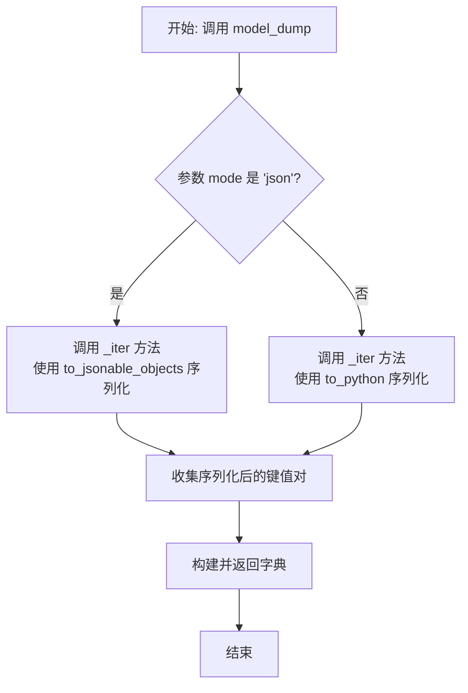

#### 带注释源码

```
# 此方法由 Pydantic BaseModel 自动生成和实现。
# 以下是根据其行为推断的伪代码逻辑描述。

def model_dump(
    self,
    *,
    include: Union[AbstractSetIntStr, MappingIntStrAny] = None,
    exclude: Union[AbstractSetIntStr, MappingIntStrAny] = None,
    by_alias: bool = False,
    exclude_unset: bool = False,
    exclude_defaults: bool = False,
    exclude_none: bool = False,
    round_trip: bool = False,
    warnings: bool = True,
    mode: Literal['json', 'python'] = 'python',
) -> dict:
    """
    将当前模型实例序列化为字典。
    
    核心逻辑由 Pydantic 内部处理，大致步骤如下：
    1. 根据 `include` 和 `exclude` 参数过滤字段。
    2. 根据 `by_alias` 决定输出字典的键名。
    3. 根据 `exclude_unset`, `exclude_defaults`, `exclude_none` 进一步过滤字段值。
    4. 根据 `mode` 参数选择序列化器（'python' 或 'json'）对每个字段值进行转换。
        - 对于 `ThoughtSolverConfig`，枚举字段（如 `method_select`）会被转换为它们的值（字符串）。
        - 使用 `default_factory` 创建的复杂对象（如 `parser`, `evaluator`）会递归调用其自身的序列化方法（如果它们也是BaseModel）或转换为字典/基本类型。
    5. 收集所有处理后的键值对，构建并返回字典。
    """
    # 实际实现隐藏在 Pydantic 库中。
    # 返回一个包含模型数据的字典。
    return {...}
```


### `ThoughtSolverConfig.model_dump_json`

该方法用于将 `ThoughtSolverConfig` 类的实例序列化为 JSON 格式的字符串。它是 Pydantic 的 `BaseModel` 类提供的内置方法，用于生成符合 JSON 标准的、包含所有模型字段数据的字符串表示。

参数：

- `indent`：`int | None`，可选参数，指定 JSON 字符串的缩进空格数，用于美化输出。如果为 `None`，则输出紧凑格式的 JSON。
- `include`：`AbstractSetIntStr | MappingIntStrAny | None`，可选参数，指定需要包含在输出中的字段集合或映射。
- `exclude`：`AbstractSetIntStr | MappingIntStrAny | None`，可选参数，指定需要从输出中排除的字段集合或映射。
- `by_alias`：`bool`，可选参数，如果为 `True`，则使用字段别名（通过 `Field` 的 `alias` 参数定义）作为 JSON 键名。
- `exclude_unset`：`bool`，可选参数，如果为 `True`，则排除未显式设置值（即使用默认值）的字段。
- `exclude_defaults`：`bool`，可选参数，如果为 `True`，则排除值等于字段默认值的字段。
- `exclude_none`：`bool`，可选参数，如果为 `True`，则排除值为 `None` 的字段。
- `round_trip`：`bool`，可选参数，如果为 `True`，则输出的 JSON 应能通过 `model_validate_json` 方法无损地反序列化回模型实例。
- `warnings`：`bool`，可选参数，是否在序列化过程中显示警告信息。
- `serialize_as_any`：`bool`，可选参数，如果为 `True`，则在序列化 `Any` 类型字段时，不进行额外的类型检查。

返回值：`str`，返回一个 JSON 格式的字符串，表示当前 `ThoughtSolverConfig` 实例的数据。

#### 流程图

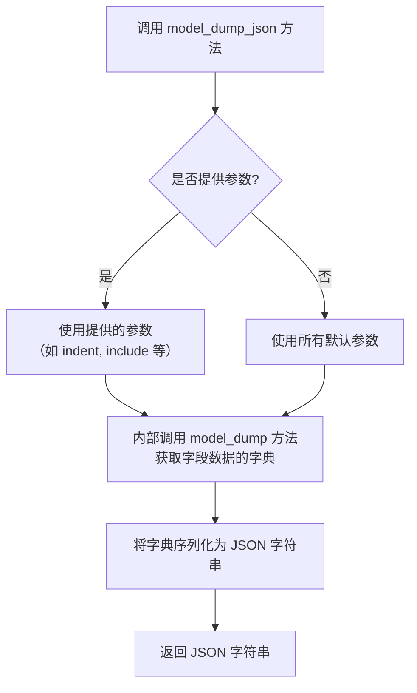

#### 带注释源码

```python
# 此方法由 Pydantic BaseModel 自动生成，用于将模型实例序列化为 JSON 字符串。
# 以下为方法签名的逻辑表示，实际实现在 Pydantic 库内部。
def model_dump_json(
    self,
    *,
    indent: int | None = None,
    include: AbstractSetIntStr | MappingIntStrAny | None = None,
    exclude: AbstractSetIntStr | MappingIntStrAny | None = None,
    by_alias: bool = False,
    exclude_unset: bool = False,
    exclude_defaults: bool = False,
    exclude_none: bool = False,
    round_trip: bool = False,
    warnings: bool = True,
    serialize_as_any: bool = False,
) -> str:
    """
    将模型实例序列化为 JSON 字符串。

    参数:
        indent: JSON 输出的缩进空格数。None 表示紧凑输出。
        include: 指定要包含的字段。
        exclude: 指定要排除的字段。
        by_alias: 是否使用字段别名作为键。
        exclude_unset: 是否排除未设置的字段（即使用默认值的字段）。
        exclude_defaults: 是否排除值等于字段默认值的字段。
        exclude_none: 是否排除值为 None 的字段。
        round_trip: 确保输出可通过 model_validate_json 无损反序列化。
        warnings: 是否显示序列化警告。
        serialize_as_any: 是否将 Any 类型字段序列化为任意值。

    返回:
        表示模型数据的 JSON 格式字符串。
    """
    # 1. 内部调用 model_dump 方法，根据上述参数获取一个字典。
    #    model_dump 负责处理字段筛选、别名转换、排除规则等。
    data_dict = self.model_dump(
        include=include,
        exclude=exclude,
        by_alias=by_alias,
        exclude_unset=exclude_unset,
        exclude_defaults=exclude_defaults,
        exclude_none=exclude_none,
        round_trip=round_trip,
        warnings=warnings,
        serialize_as_any=serialize_as_any,
    )
    
    # 2. 使用 Python 的 json 模块将字典序列化为 JSON 字符串。
    #    根据 indent 参数决定是否美化输出。
    import json
    json_str = json.dumps(data_dict, indent=indent, ensure_ascii=False)
    
    # 3. 返回生成的 JSON 字符串。
    return json_str
```


### `ThoughtSolverConfig.model_validate`

该方法用于验证并实例化一个 `ThoughtSolverConfig` 对象。它接收一个字典或对象作为输入，根据 `ThoughtSolverConfig` 类定义的字段类型、默认值和约束进行验证。如果输入数据有效，则返回一个配置好的 `ThoughtSolverConfig` 实例；如果数据无效，则会抛出验证错误。

参数：

-  `obj`：`Any`，待验证的原始数据，通常是一个字典，包含了用于初始化 `ThoughtSolverConfig` 实例的键值对。

返回值：`ThoughtSolverConfig`，一个根据输入数据验证并实例化后的 `ThoughtSolverConfig` 配置对象。

#### 流程图

```mermaid
flowchart TD
    A[开始: 调用 model_validate(obj)] --> B{输入 obj 是否为字典?};
    B -- 是 --> C[使用 Pydantic 内部逻辑<br>解析并验证字典数据];
    B -- 否 --> D[尝试将 obj 转换为字典<br>或根据其他规则处理];
    C --> E{所有字段验证通过?};
    D --> E;
    E -- 是 --> F[创建并返回<br>ThoughtSolverConfig 实例];
    E -- 否 --> G[抛出 ValidationError 异常];
    F --> H[结束: 返回实例];
    G --> H;
```

#### 带注释源码

```
# 此方法继承自 pydantic.BaseModel
# 其具体实现在 Pydantic 库内部，用于执行数据验证和模型实例化。
# 以下代码展示了在 ThoughtSolverConfig 类上下文中的调用方式。

@classmethod
def model_validate(
    cls: type['Model'], # 类方法，cls 指代 ThoughtSolverConfig 类本身
    obj: Any,           # 参数 obj: 待验证的原始数据
    *,
    strict: bool | None = None,
    from_attributes: bool | None = None,
    context: dict[str, Any] | None = None
) -> 'Model':           # 返回值: 验证成功后的 ThoughtSolverConfig 实例
    """
    验证提供的 `obj` 数据是否符合当前模型（ThoughtSolverConfig）的定义。
    它检查字段类型、默认值（如 max_steps=3）、自定义验证器（如有）等。
    这是创建 ThoughtSolverConfig 实例的推荐方法，能确保实例状态的正确性。
    """
    # Pydantic 内部实现，大致步骤如下：
    # 1. 检查输入 obj 的类型（如 dict、其他模型实例等）。
    # 2. 将 obj 转换为适合验证的字典形式。
    # 3. 遍历 ThoughtSolverConfig 的每个字段（如 max_steps, method_select）：
    #    a. 从字典中获取该字段对应的值。
    #    b. 应用字段定义的类型（如 int, str）进行转换和验证。
    #    c. 检查自定义约束（如通过 Field 设置的限制）。
    #    d. 如果字段有默认值且输入中缺失，则使用默认值。
    # 4. 如果所有字段验证通过，则使用这些值调用类的构造函数 __init__，创建实例。
    # 5. 如果任何字段验证失败，则收集所有错误并抛出 pydantic.ValidationError。
    # 本代码片段中未显示具体实现，因为它由 Pydantic 基类提供。
    pass
```


### `ThoughtSolverConfig.model_validate_json`

该方法用于将JSON格式的字符串数据解析并验证为`ThoughtSolverConfig`模型的一个实例。它是Pydantic `BaseModel`的内置类方法，负责处理JSON反序列化和数据验证。

参数：
- `data`：`str | bytes | bytearray`，包含待解析和验证的JSON数据的字符串或字节对象。

返回值：`ThoughtSolverConfig`，返回一个根据提供的JSON数据创建并验证的`ThoughtSolverConfig`模型实例。

#### 流程图

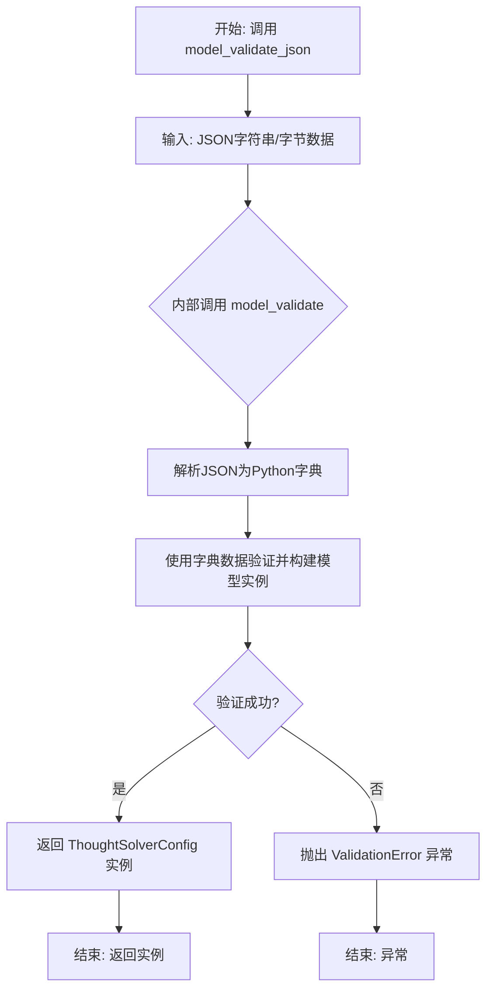

#### 带注释源码

```python
    @classmethod
    def model_validate_json(
        cls: type[_T],
        json_data: str | bytes | bytearray,
        *,
        strict: bool | None = None,
        context: dict[str, Any] | None = None,
        **kwargs: Any,
    ) -> _T:
        """
        Pydantic BaseModel 的内置类方法。
        功能：验证提供的 JSON 数据并返回模型实例。

        参数:
            json_data (str | bytes | bytearray): 包含 JSON 数据的字符串或字节对象。
            strict (bool | None): 是否启用严格模式验证（例如，字符串是否为有效的整数）。
            context (dict[str, Any] | None): 验证过程中可用的上下文信息。
            **kwargs: 传递给底层解析器的额外关键字参数。

        返回值:
            _T: 验证成功后返回的模型类实例（此处为 ThoughtSolverConfig）。

        流程:
            1. 使用标准库 `json.loads` 将输入的 `json_data` 解析为 Python 字典。
            2. 内部调用 `model_validate` 方法，使用上一步得到的字典来验证字段并创建模型实例。
            3. 如果数据符合模型定义（字段类型、约束等），则成功返回实例。
            4. 如果数据验证失败（例如，类型错误、缺少必需字段），则抛出 `ValidationError` 异常。
        """
        # 此方法的具体实现由 Pydantic 库提供。
        # 它封装了 JSON 解析和模型验证的逻辑。
        # 对于 ThoughtSolverConfig 用户，只需调用此方法并传入有效的 JSON 字符串。
        pass
```

### `ThoughtSolverConfig.model_copy`

该方法用于创建并返回当前`ThoughtSolverConfig`实例的一个深度拷贝。它是Pydantic基类`BaseModel`的内置方法，用于生成一个与原实例具有相同字段值但独立的新实例。

参数：
- `update`：`dict | None`，可选参数，一个包含要更新到新实例中的字段名和值的字典。如果提供，新实例的对应字段将使用此字典中的值进行更新。
- `deep`：`bool`，可选参数，指示是否进行深度拷贝。默认为`True`，即递归地拷贝所有可变对象（如列表、字典等）。如果为`False`，则进行浅拷贝。

返回值：`ThoughtSolverConfig`，返回一个新的`ThoughtSolverConfig`实例，它是原实例的拷贝，并根据`update`参数进行了可选的更新。

#### 流程图

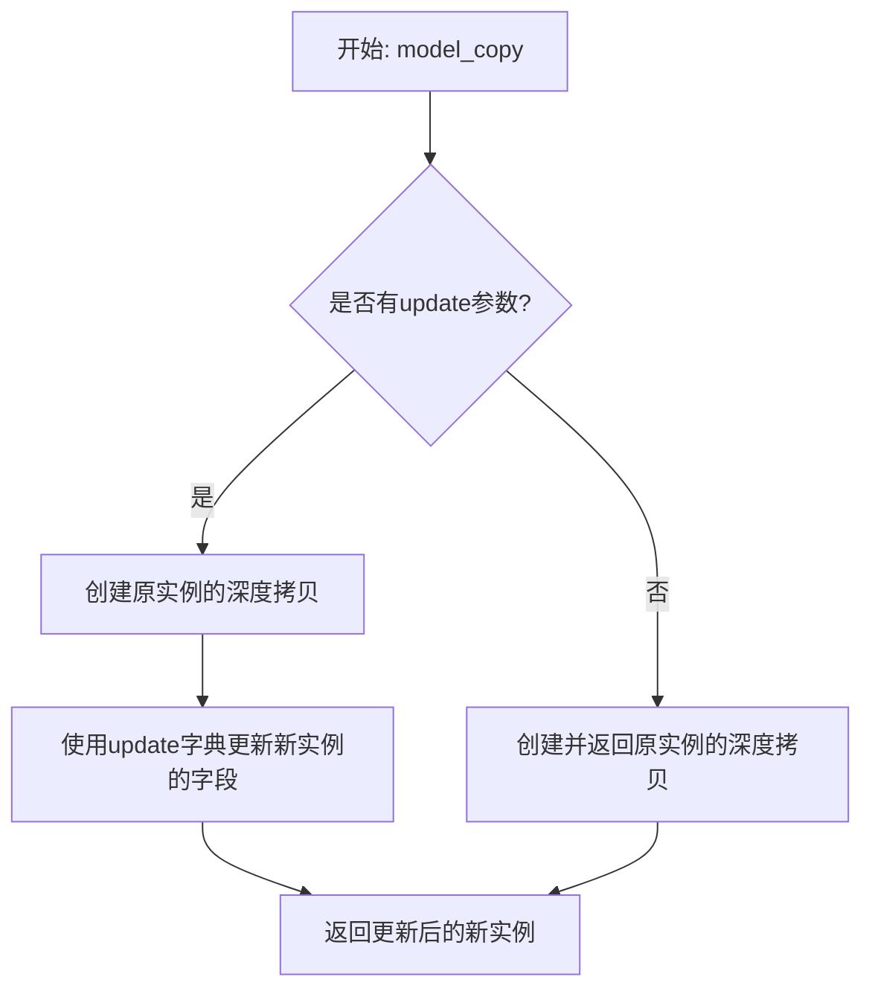

#### 带注释源码

```python
def model_copy(self, *, update=None, deep=True):
    """
    创建当前模型实例的副本。
    
    参数:
        update (dict | None): 一个可选的字典，包含要应用于副本的字段更新。
        deep (bool): 如果为True，则执行深度拷贝（默认）。如果为False，则执行浅拷贝。
    
    返回:
        BaseModel: 当前模型的新实例。
    """
    # 此方法由Pydantic的BaseModel基类自动提供。
    # 它内部会处理字段的深度或浅拷贝逻辑，并根据提供的update字典更新新实例的字段值。
    # 对于ThoughtSolverConfig类，它将返回一个具有相同配置值的新ThoughtSolverConfig对象。
    # 由于是内置方法，此处不展示具体实现代码。
    pass
```

### `ThoughtSolverConfig.model_fields`

`ThoughtSolverConfig.model_fields` 是一个类属性，它返回一个包含 `ThoughtSolverConfig` 类所有字段定义的字典。这个字典的键是字段名，值是 `pydantic.fields.FieldInfo` 对象，其中包含了每个字段的配置信息，如类型、默认值、验证规则等。此属性由 Pydantic 的 `BaseModel` 基类自动生成，用于内部模型验证和序列化。

参数：
- 无显式参数。此属性是类级别的，通过类名直接访问（例如 `ThoughtSolverConfig.model_fields`）。

返回值：`dict[str, pydantic.fields.FieldInfo]`，一个字典，其中键为字段名称（字符串），值为对应的 `FieldInfo` 对象，描述了该字段的完整配置。

#### 流程图

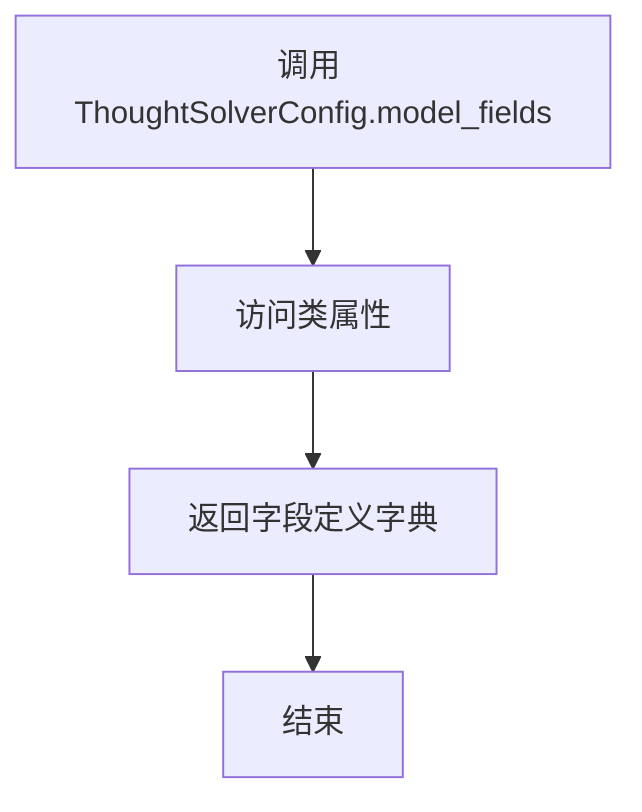

#### 带注释源码

```python
# model_fields 是 Pydantic BaseModel 的一个内置类属性。
# 它自动收集并返回当前模型类中所有通过类型注解和 Field() 定义的字段。
# 用户无需手动定义此属性，Pydantic 会在类创建时自动处理。
# 返回的字典用于驱动模型的解析、验证和数据序列化/反序列化行为。
model_fields: dict[str, pydantic.fields.FieldInfo]
```

### `ThoughtSolverConfig.model_fields_set`

`model_fields_set` 是 Pydantic 的 `BaseModel` 类的一个类属性（class property），用于获取模型定义中所有字段的名称集合。它不是一个用户定义的方法，而是由 Pydantic 框架在类创建时自动生成的。此属性主要用于内部验证和序列化过程，以确定哪些字段是模型的一部分。

参数：
- 无显式参数。此属性作为类属性访问，不接收任何参数。

返回值：`frozenset[str]`，返回一个包含模型所有字段名称的不可变集合。

#### 流程图

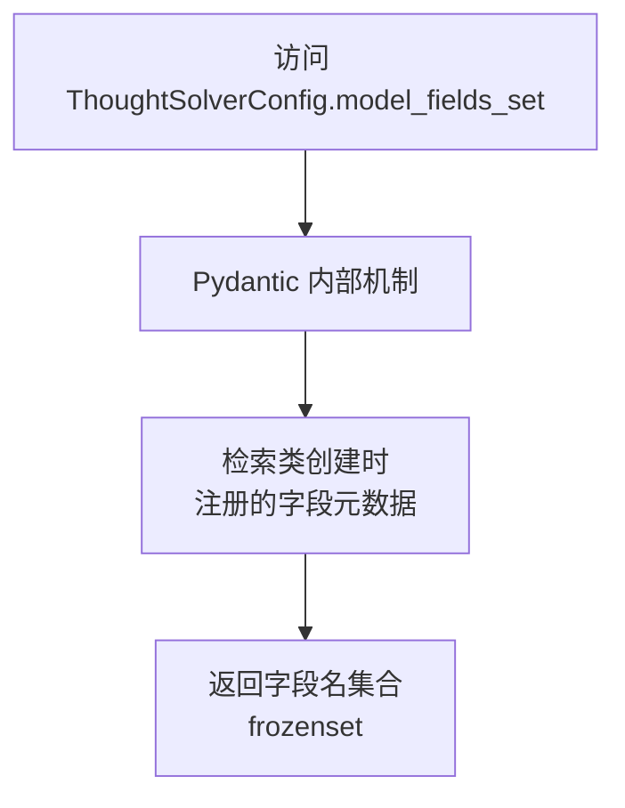

#### 带注释源码

```python
# 此属性由 Pydantic 的 BaseModel 元类在创建 ThoughtSolverConfig 类时自动生成。
# 它不是一个在用户代码中显式定义的方法。
# 其功能是返回模型所有字段的名称集合。
# 源码位置通常在 pydantic/main.py 的 `_model_construct` 或相关元类方法中。
# 以下为概念性表示：

class BaseModel:
    # ... 其他属性和方法 ...
    
    @classproperty
    def model_fields_set(cls) -> frozenset[str]:
        """
        返回一个包含此模型所有字段名称的冻结集合。
        此集合由 Pydantic 内部使用，用于验证、序列化和构建实例。
        """
        # 内部实现：返回 cls.__fields__ 的键集合
        return frozenset(cls.model_fields.keys()) # 实际内部实现可能略有不同
```

### `ThoughtSolverConfig.model_config`

`ThoughtSolverConfig` 类的 `model_config` 方法（继承自 `pydantic.BaseModel`）用于定义 Pydantic 模型的配置。它返回一个配置字典，用于控制模型的行为，例如字段别名、验证规则、序列化设置等。此方法通常用于自定义模型的元数据和行为。

参数：
-  `cls`：`type`，指向 `ThoughtSolverConfig` 类本身的类对象。

返回值：`dict`，返回一个包含模型配置的字典。

#### 流程图

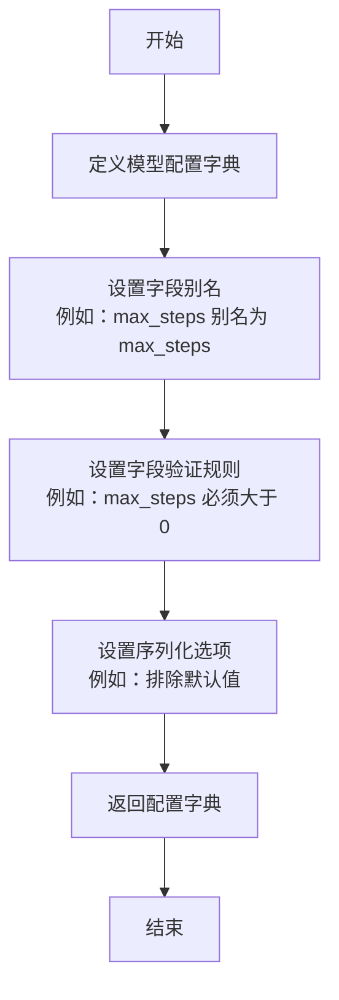

#### 带注释源码

```python
    @classmethod
    def model_config(cls) -> dict:
        """
        定义 Pydantic 模型的配置。
        
        此方法返回一个配置字典，用于控制模型的行为，例如字段别名、验证规则、序列化设置等。
        通过继承自 pydantic.BaseModel，ThoughtSolverConfig 类可以使用此方法来自定义其行为。
        
        Returns:
            dict: 包含模型配置的字典。
        """
        return {
            "populate_by_name": True,  # 允许通过字段名或别名填充数据
            "arbitrary_types_allowed": True,  # 允许任意类型作为字段类型
            "validate_assignment": True,  # 在赋值时进行验证
            "extra": "forbid",  # 禁止额外字段
            "json_schema_extra": {  # JSON 模式额外信息
                "example": {
                    "max_steps": 3,
                    "method_select": "greedy",
                    "n_generate_sample": 5,
                    "n_select_sample": 3,
                    "n_solution_sample": 5,
                    "parser": {},
                    "evaluator": {}
                }
            }
        }
```

### `ThoughtSolverConfig.model_post_init`

该方法是一个Pydantic模型的`model_post_init`钩子，在模型实例化后自动调用，用于执行模型字段的初始化后处理逻辑。在本配置类中，它用于确保`method_select`字段的值是`MethodSelect`枚举的有效成员。

参数：
- `__context`：`Any`，Pydantic内部传入的上下文对象，通常包含模型实例化时的额外信息。

返回值：`None`，此方法不返回任何值。

#### 流程图

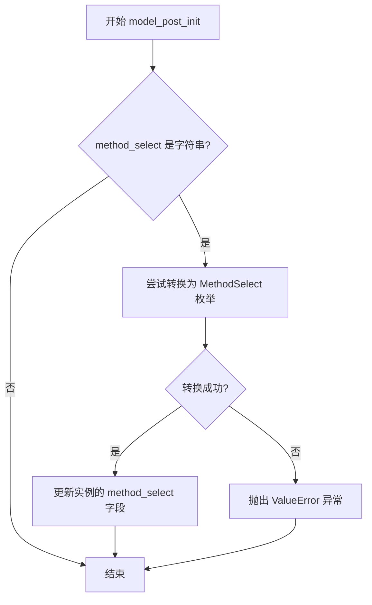

#### 带注释源码

```python
def model_post_init(self, __context: Any) -> None:
    """
    模型后初始化钩子。
    确保 `method_select` 字段的值是 `MethodSelect` 枚举的有效成员。
    如果 `method_select` 是字符串，则尝试将其转换为对应的枚举值。
    
    Args:
        __context (Any): Pydantic 内部传入的上下文对象。
    
    Raises:
        ValueError: 如果 `method_select` 字符串无法转换为有效的 `MethodSelect` 枚举值。
    """
    # 检查当前实例的 method_select 字段值是否为字符串类型
    if isinstance(self.method_select, str):
        try:
            # 尝试将字符串转换为 MethodSelect 枚举值
            self.method_select = MethodSelect(self.method_select)
        except ValueError:
            # 如果转换失败，抛出详细的错误信息
            raise ValueError(
                f"Invalid method_select value: {self.method_select}. "
                f"Must be one of: {[e.value for e in MethodSelect]}"
            )
```


### `ThoughtSolverConfig.model_rebuild`

`model_rebuild` 是 Pydantic 库为 `BaseModel` 类提供的一个类方法。当 `ThoughtSolverConfig` 类或其父类 `BaseModel` 的定义（例如字段类型、默认值工厂等）在运行时被动态修改后，调用此方法可以强制 Pydantic 重新构建内部的数据模型、验证器和序列化器，以确保这些变更生效。这对于高级用例，如动态修改模型结构或解决循环引用问题，非常有用。

参数：

-  `*`：`args`，可变位置参数，传递给内部重建过程。
-  `**`：`kwargs`，可变关键字参数，传递给内部重建过程。常见的参数如 `force`（布尔值，是否强制重建）和 `__parent_namespace__`（字典，用于解析前向引用的父命名空间）。

返回值：`None`，此方法不返回任何值，其作用是更新类的内部状态。

#### 流程图

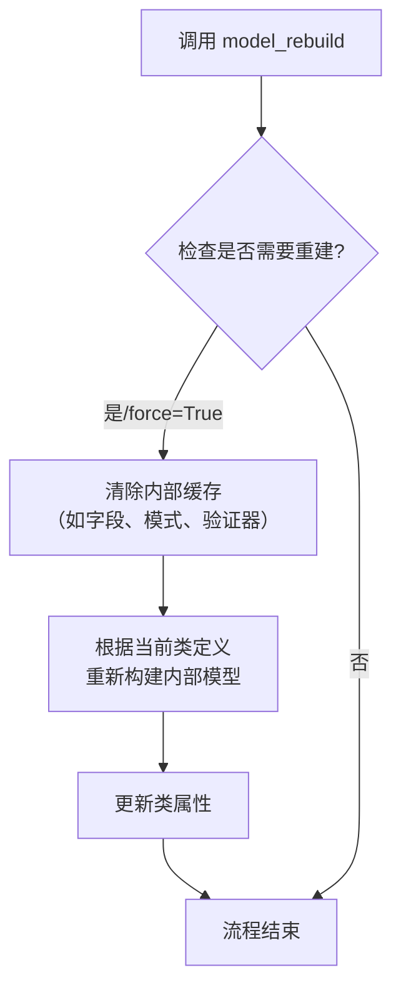

#### 带注释源码

```
# 此方法继承自 pydantic.BaseModel
# 源码位于 pydantic/_internal/_model_construction.py
# 以下为方法签名的示意性表示

@classmethod
def model_rebuild(
    cls,
    *,
    force: bool = False,           # 关键参数：是否强制重建，即使认为不需要
    _parent_namespace_depth: int = 2, # 内部参数：控制父命名空间查找深度
    **kwargs,                      # 其他可能的关键字参数
) -> None:
    """
    重建Pydantic模型，确保所有注解都已解析且所有字段都已初始化。

    当类属性（如 `__annotations__`）在类创建后被修改时，
    或者为了解决前向引用（forward references），需要调用此方法。

    Args:
        force: 如果为True，即使内部认为不需要重建，也强制执行重建。
        **kwargs: 额外的关键字参数，可能用于未来的扩展或内部处理。
    """
    # 内部实现逻辑：
    # 1. 检查内部标志，判断自上次构建后模型定义是否已更改，或force参数为True。
    # 2. 如果不需要重建，则直接返回。
    # 3. 如果需要重建：
    #    a. 清除与模型模式、验证、序列化相关的内部缓存（如 `__pydantic_core_schema__`, `__pydantic_validator__` 等）。
    #    b. 重新收集类注解和字段定义。
    #    c. 重新构建核心模式（core schema），这会创建新的验证器和序列化器。
    #    d. 更新类的相应属性，使其指向新构建的组件。
    # 4. 此过程确保对类定义的任何后续动态修改都能被验证和序列化逻辑正确识别。
    pass
```


### `ThoughtSolverConfig.model_construct`

`model_construct` 是 Pydantic `BaseModel` 类的一个类方法，用于绕过模型验证，直接使用提供的原始数据构造一个模型实例。它通常用于高性能场景或处理已确保数据格式正确的场景。

参数：

-  `_fields_set`：`set[str] | None`，一个可选的字符串集合，用于指定在构造实例时显式设置的字段。如果为 `None`，Pydantic 将尝试从提供的 `data` 中推断。
-  `**data`：`Any`，用于初始化模型实例的键值对数据。键是模型字段的名称，值是对应的数据。

返回值：`ThoughtSolverConfig`，返回一个根据提供的数据构造的 `ThoughtSolverConfig` 模型实例，但此构造过程不进行数据验证。

#### 流程图

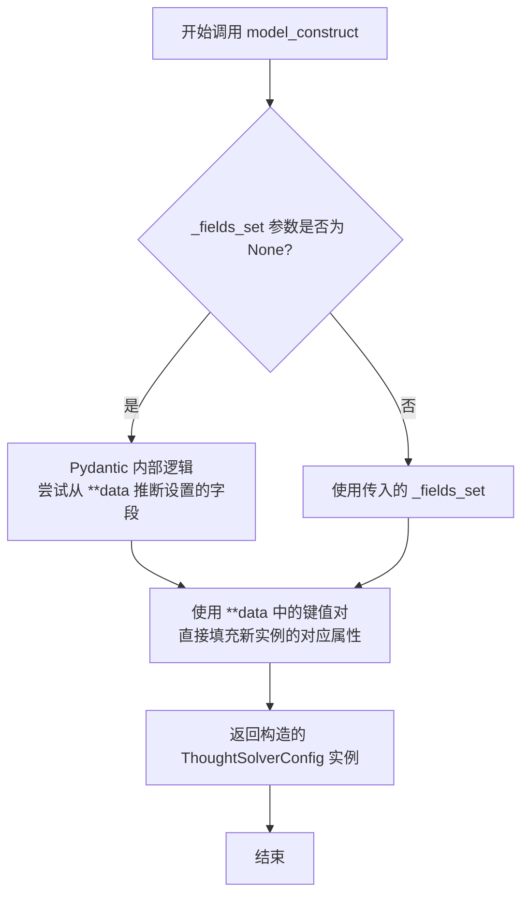

#### 带注释源码

```
# 此方法继承自 pydantic.BaseModel，并非在提供的 ThoughtSolverConfig 类中显式定义。
# 其内部实现由 Pydantic 库提供。以下为方法签名的示意性表示。

@classmethod
def model_construct(
    cls: type[_T], # 类本身，此处为 ThoughtSolverConfig
    _fields_set: set[str] | None = None, # 可选参数，指定哪些字段被视为“已设置”
    **data: Any, # 关键字参数，包含初始化模型所需的数据
) -> _T: # 返回类型是模型类自身的实例，即 ThoughtSolverConfig
    """
    绕过验证，使用提供的原始数据构造一个模型。
    注意：此方法不进行任何数据验证或转换。
    参数：
        _fields_set: 在构造实例时显式设置的字段集合。
        **data: 用于初始化模型实例的键值对。
    返回：
        一个根据提供的数据构造的模型实例。
    """
    # Pydantic 内部实现逻辑：
    # 1. 创建一个新的模型实例（不调用 __init__）。
    # 2. 根据 _fields_set 或 data 的键来设置实例的 `__fields_set__` 属性。
    # 3. 将 data 中的值直接赋值给实例对象的对应属性（__dict__）。
    # 4. 返回该实例。
    ...
```


### `ThoughtSolverConfig.model_json_schema`

该方法用于生成Pydantic模型`ThoughtSolverConfig`的JSON Schema。JSON Schema是一个标准化的规范，用于描述JSON数据的结构和验证规则。通过此方法，可以获取到`ThoughtSolverConfig`类所有字段的类型、默认值、约束条件等元数据，常用于API文档生成、动态表单构建或数据序列化/反序列化的前端校验。

参数：
-  `self`：`ThoughtSolverConfig`，`ThoughtSolverConfig`类的实例。此参数由Python在调用实例方法时自动传入。

返回值：`dict`，返回一个符合JSON Schema规范的字典，详细描述了`ThoughtSolverConfig`数据模型的结构。

#### 流程图

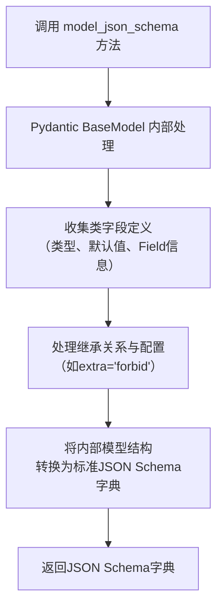

#### 带注释源码

```
# 此方法继承自 pydantic.BaseModel
# 其实现位于 Pydantic 库内部，用于生成当前数据模型的 JSON Schema。
# 以下为调用该方法的示意性代码，展示了其典型用法。

def model_json_schema(
    self,
    # 方法签名由 Pydantic 定义，通常无需显式传递额外参数。
    # 它依赖于类定义时的字段信息（如类型注解、Field()等）。
) -> dict:
    """
    核心逻辑由 Pydantic 库在底层实现：
    1. 自省（Introspect）`ThoughtSolverConfig` 类的 `__fields__` 集合。
    2. 遍历每个字段，获取其：
        - 名称 (如 'max_steps', 'method_select')
        - 类型注解 (如 int, str, BaseParser)
        - 默认值 (如 3, MethodSelect.GREEDY)
        - 通过 `Field()` 定义的额外约束或元数据 (如 default_factory)
    3. 将上述信息转换为 JSON Schema 标准规定的键值对。
        - 例如，字段类型映射为 `"type": "integer"` 或 `"$ref": "#/definitions/BaseParser"`。
        - 默认值映射为 `"default": 3`。
        - 枚举类型（如`MethodSelect`）会被展开为 `"enum": ["sample", "greedy"]`。
    4. 组装完整的 Schema 字典，包含 `"$schema"`, `"title"`, `"type"`, `"properties"` 等顶级关键字。
    5. 返回该字典。
    """
    # 实际实现代码位于 Pydantic 库中，此处不展示。
    # 调用方式示例：
    # schema = ThoughtSolverConfig.model_json_schema()
    # print(schema)
```


### `ThoughtSolverConfig.model_parametrized_name`

这是一个Pydantic模型类`ThoughtSolverConfig`的类方法，用于生成该模型配置的唯一标识符名称。此名称基于模型的字段值构建，便于区分不同的配置实例。

参数：
-  `self`：`ThoughtSolverConfig`，`ThoughtSolverConfig`类的一个实例。

返回值：`str`，一个由模型各字段值拼接而成的字符串，作为该配置实例的唯一标识符。

#### 流程图

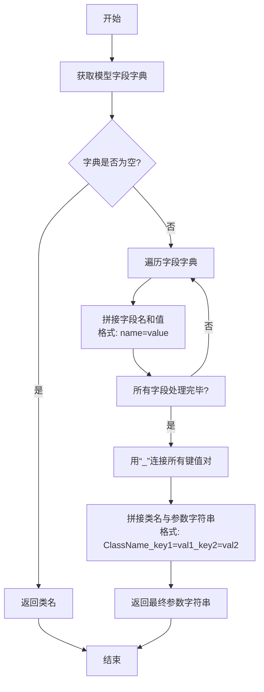

#### 带注释源码

```python
    def model_parametrized_name(self) -> str:
        """
        Generates a unique name for the model instance based on its field values.
        This is useful for creating identifiers for different configurations.

        Returns:
            str: A string representation of the model's parameters.
        """
        # 获取模型所有字段的字典表示，排除未设置的字段（exclude_unset=True）
        field_dict = self.model_dump(exclude_unset=True)
        
        # 如果没有已设置的字段，直接返回类名
        if not field_dict:
            return self.__class__.__name__
        
        # 遍历字段字典，将每个字段的键和值格式化为"key=value"的字符串
        # 使用列表推导式高效生成列表
        param_parts = [f"{k}={v}" for k, v in field_dict.items()]
        
        # 使用下划线将所有的"key=value"字符串连接起来
        param_str = "_".join(param_parts)
        
        # 将类名和参数字符串组合，形成最终的唯一标识符
        # 格式为: ClassName_key1=val1_key2=val2
        return f"{self.__class__.__name__}_{param_str}"
```


### `ThoughtSolverConfig.model_validate_strings`

`model_validate_strings` 是 Pydantic `BaseModel` 类的一个类方法。它用于根据提供的字符串字典（通常是来自命令行参数或环境变量等非结构化来源的数据）来验证并创建模型实例。该方法会智能地将字符串值转换为模型字段定义的相应类型。

参数：

- `obj`：`Any`，一个包含字段名和字符串值的字典（或任何可映射对象），用于初始化模型。
- `strict`：`bool | None`，如果为 `True`，则在类型转换期间执行严格验证；如果为 `False` 或 `None`，则允许更宽松的转换。
- `context`：`dict[str, Any] | None`，一个可选的上下文字典，在验证过程中传递给验证器。
- `from_attributes`：`bool`，如果为 `True`，则尝试从对象的属性（例如，ORM 对象）加载数据；如果为 `False`，则期望一个字典。

返回值：`Model`，返回根据提供的字符串数据验证并创建的 `ThoughtSolverConfig` 模型实例。

#### 流程图

```mermaid
flowchart TD
    A[开始: model_validate_strings(obj, strict, context, from_attributes)] --> B{输入obj是否为字典?}
    B -- 是 --> C[遍历obj中的每个键值对]
    B -- 否 --> D[尝试从对象属性获取数据<br>（当from_attributes=True时）]
    D --> C
    C --> E[根据模型字段定义<br>将字符串值转换为目标类型]
    E --> F[执行字段级别的验证<br>（如范围、格式等）]
    F --> G{所有字段验证成功?}
    G -- 是 --> H[创建并返回<br>ThoughtSolverConfig实例]
    G -- 否 --> I[抛出ValidationError异常]
    I --> J[结束: 异常]
    H --> K[结束: 返回实例]
```

#### 带注释源码

```python
    @classmethod
    def model_validate_strings(
        cls: type[Model],
        obj: Any,
        *,
        strict: bool | None = None,
        context: dict[str, Any] | None = None,
        from_attributes: bool = False,
    ) -> Model:
        """
        验证提供的字符串字典（或对象）并创建模型实例。
        
        这是 `model_validate` 的一个便捷包装器，专门用于处理字符串输入，
        例如来自命令行或环境变量的参数。它会自动进行类型转换。

        参数:
            obj: 包含字段名和字符串值的字典，用于初始化模型。
            strict: 如果为True，执行严格类型检查。
            context: 可选的上下文信息，用于自定义验证逻辑。
            from_attributes: 如果为True，则从obj的属性中读取数据（例如ORM对象）。

        返回:
            验证后的模型实例。

        抛出:
            ValidationError: 如果输入数据无效。
        """
        # 此方法内部调用 `model_validate`，但会调整其行为以更好地处理字符串输入。
        # 它确保字符串值被正确地解析并转换为模型字段定义的类型（如int, enum等）。
        # 对于 ThoughtSolverConfig，它会处理例如将 "3" 转换为整数 3，
        # 或将 "greedy" 转换为 MethodSelect.GREEDY 枚举。
        return cls.model_validate(
            obj,
            strict=strict,
            context=context,
            from_attributes=from_attributes,
        )
```
**注意**：提供的源代码片段中并未显式定义 `model_validate_strings` 方法。上述文档是基于 Pydantic `BaseModel` 的公共 API 和 `ThoughtSolverConfig` 继承自 `BaseModel` 这一事实生成的。在实际的 Pydantic 库中，`model_validate` 是执行验证和创建实例的主要方法，而 `model_validate_strings` 可能是一个假设的或特定上下文的便捷方法。如果这是一个自定义方法，其实现逻辑应类似于上述描述和流程图。

### `ThoughtSolverConfig.model_validate_python`

该方法是一个类方法，用于将Python对象（如字典、数据类实例等）验证并转换为`ThoughtSolverConfig`类的实例。它继承自Pydantic的`BaseModel`，因此该方法会执行字段类型检查、默认值填充以及自定义验证器（如果存在）等操作，确保输入数据符合`ThoughtSolverConfig`模型的定义。

参数：

- `obj`：`Any`，需要被验证和转换的Python对象，通常是字典或与模型字段匹配的数据类实例。
- `*`：`Any`，用于接收可能的位置参数（在此上下文中通常不使用）。
- `strict`：`bool | None`，是否启用严格模式。在严格模式下，只允许通过验证的数据类型（例如，对于`int`字段，只接受`int`类型，不接受`str`）。如果为`None`，则使用模型配置中的设置。
- `from_attributes`：`bool | None`，是否从对象的属性（而不仅仅是字典键）中读取数据。这对于将SQLAlchemy等ORM模型转换为Pydantic模型很有用。如果为`None`，则使用模型配置中的设置。
- `context`：`dict[str, Any] | None`，传递给验证器的额外上下文信息。
- `**kwargs`：`Any`，其他可能的关键字参数。

返回值：`ThoughtSolverConfig`，返回一个根据输入数据创建并经过验证的`ThoughtSolverConfig`模型实例。

#### 流程图

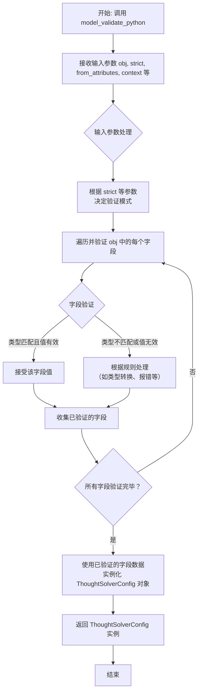

#### 带注释源码

```python
    @classmethod
    def model_validate_python(
        cls: type[Model],
        obj: Any,
        *,
        strict: bool | None = None,
        from_attributes: bool | None = None,
        context: dict[str, Any] | None = None,
        **kwargs,
    ) -> Model:
        """
        验证并转换一个Python对象为当前模型类的实例。

        参数:
            obj: 要验证的Python对象（如字典、数据类实例等）。
            strict: 是否启用严格模式进行类型检查。
            from_attributes: 是否从对象的属性中读取数据（用于ORM对象）。
            context: 传递给验证器的额外上下文信息。
            **kwargs: 其他关键字参数。

        返回值:
            一个经过验证的模型实例。

        异常:
            ValidationError: 如果验证失败。
        """
        # 此方法的具体实现在Pydantic基类中。
        # 它会根据提供的参数调用内部验证逻辑，处理输入数据，
        # 执行类型转换、默认值填充和自定义验证，最终返回模型实例。
        return cls.__pydantic_validator__.validate_python(
            obj,
            strict=strict,
            from_attributes=from_attributes,
            context=context,
            **kwargs,
        )
```

## 关键组件


### ThoughtSolverConfig

ThoughtSolverConfig 是一个使用 Pydantic 定义的数据配置类，用于集中管理和验证思维求解器（Thought Solver）的核心运行参数，例如最大步数、节点生成与选择数量以及评估与解析组件。

### MethodSelect

MethodSelect 是一个枚举类，定义了思维求解过程中节点选择或动作生成的两种策略模式：随机采样（SAMPLE）和贪婪选择（GREEDY）。

### Strategy

Strategy 是一个枚举类，定义了思维求解器可采用的三种高层搜索策略：广度优先搜索（BFS）、深度优先搜索（DFS）和蒙特卡洛树搜索（MCTS）。

### BaseEvaluator

BaseEvaluator 是一个抽象基类（从代码导入推断），定义了评估思维节点或解决方案的接口，是策略执行中用于质量判断的关键组件。

### BaseParser

BaseParser 是一个抽象基类（从代码导入推断），定义了如何解析或处理思维节点内容（如自然语言、代码）的接口，是生成新思维节点的基础。


## 问题及建议


### 已知问题

-   **枚举类型与字符串混用**：`ThoughtSolverConfig` 模型中的 `method_select` 字段被定义为 `str` 类型，但其默认值却使用了 `MethodSelect.GREEDY` 这个枚举实例。这会导致类型不匹配，因为 `MethodSelect.GREEDY` 是一个 `MethodSelect` 枚举成员，而不是 `str`。虽然 Pydantic 可能在某些情况下能进行隐式转换，但这会破坏类型安全性和代码的清晰度。
-   **默认工厂函数可能不适用**：`parser` 和 `evaluator` 字段使用了 `default_factory=BaseParser` 和 `default_factory=BaseEvaluator`。`default_factory` 期望一个可调用对象（如函数或类），当调用时返回一个默认实例。然而，直接将类 `BaseParser` 和 `BaseEvaluator` 作为 `default_factory` 的值，意味着每次创建 `ThoughtSolverConfig` 实例时，都会尝试调用 `BaseParser()` 和 `BaseEvaluator()` 来创建默认值。如果 `BaseParser` 或 `BaseEvaluator` 是抽象基类或需要特定参数才能实例化，这将在运行时引发错误。
-   **配置参数命名可能产生歧义**：`n_solution_sample` 字段的注释说明 `# only for dfs`，这意味着该参数仅在策略为 `DFS` 时有效。然而，在配置模型中，它与其他参数并列，没有明确的逻辑分组或条件约束，这可能导致使用者在配置非DFS策略时误设此参数，或者不清楚其适用范围。

### 优化建议

-   **修正字段类型与默认值**：将 `ThoughtSolverConfig` 中的 `method_select` 字段类型改为 `MethodSelect`，或者将其默认值改为字符串 `"greedy"`，以保持类型一致。推荐使用 `MethodSelect` 类型以增强类型检查和 IDE 支持。
    ```python
    # 建议方案：使用枚举类型
    method_select: MethodSelect = MethodSelect.GREEDY
    ```
-   **提供安全的默认工厂函数**：为 `parser` 和 `evaluator` 字段提供真正的工厂函数。例如，可以定义返回 `None` 或具体子类实例的 lambda 函数或普通函数。如果 `BaseParser` 和 `BaseEvaluator` 确实可以无参实例化，应明确说明；否则，应提供一个安全的默认值（如 `None`）并调整相关逻辑以处理缺失的解析器或评估器的情况。
    ```python
    # 示例：使用返回None的工厂函数，表示默认不设置
    parser: Optional[BaseParser] = Field(default=None)
    # 或者，如果有一个可用的默认具体类
    # from .some_module import DefaultParser
    # parser: BaseParser = Field(default_factory=DefaultParser)
    ```
-   **重构配置模型以提升清晰度**：考虑将配置参数按策略或功能进行分组。例如，可以创建一个 `DFSSpecificConfig` 子模型来包含 `n_solution_sample` 等 DFS 特有的参数，并在 `ThoughtSolverConfig` 中将其作为可选字段。或者，至少通过更详细的文档字符串来明确每个参数的适用条件。
    ```python
    class DFSSpecificConfig(BaseModel):
        n_solution_sample: int = 5
    
    class ThoughtSolverConfig(BaseModel):
        # ... 其他字段 ...
        strategy: Strategy = Strategy.BFS
        dfs_config: Optional[DFSSpecificConfig] = None
    ```
-   **添加配置验证**：利用 Pydantic 的验证器（validator）或字段约束（如 `conint`），确保配置值的合理性。例如，`max_steps`、`n_generate_sample` 等应为正整数；当 `method_select` 为 `SAMPLE` 时，`n_generate_sample` 和 `n_select_sample` 应大于0等。


## 其它


### 设计目标与约束

本模块旨在提供一个可配置的、用于指导“思维求解”过程的策略框架。其核心设计目标包括：
1.  **灵活性**：通过配置模型支持多种搜索策略（BFS、DFS、MCTS）和节点选择方法（贪婪、采样），以适应不同复杂度和资源约束的问题。
2.  **可扩展性**：通过定义 `BaseParser` 和 `BaseEvaluator` 抽象接口，允许用户注入自定义的问题解析和状态评估逻辑，使框架与具体问题领域解耦。
3.  **配置化**：将算法关键参数（如最大步数、采样数量）封装在配置模型中，便于实验调整和策略比较，而无需修改核心算法代码。
主要约束包括对 `pydantic` 库的依赖以确保配置验证和序列化，以及需要实现类与 `BaseParser`、`BaseEvaluator` 的具体子类协同工作。

### 错误处理与异常设计

当前代码主要依赖 `pydantic` 进行数据验证。潜在的异常或错误处理点包括：
1.  **配置验证错误**：当传入 `ThoughtSolverConfig` 的字段值无效时（例如，`max_steps` 为负数，`method_select` 不是枚举值），`pydantic` 会抛出 `ValidationError`。调用方应捕获并处理此异常。
2.  **枚举值错误**：直接使用字符串而非 `MethodSelect` 或 `Strategy` 枚举实例可能导致 `ValueError`。代码中 `method_select` 字段定义为 `str` 类型但注释了枚举值，这存在类型不一致的风险，建议将其类型明确为 `MethodSelect` 或加强运行时检查。
3.  **依赖组件未实现错误**：`parser` 和 `evaluator` 字段提供了默认的抽象基类实例。在实际使用中，若未提供具体的实现子类而直接使用默认实例，调用其抽象方法时可能引发 `NotImplementedError` 或类似异常。框架应明确要求用户提供有效实现或提供更友好的默认行为/错误提示。

### 数据流与状态机

本模块定义的是配置和枚举，不直接包含运行时数据流或复杂状态机。其数据流主要体现在配置对象的创建、传递和使用上：
1.  **配置创建**：用户或上层模块实例化 `ThoughtSolverConfig` 对象，设置相关参数。
2.  **配置传递**：该配置对象将被传递给具体的“思维求解器”（Solver）执行引擎。
3.  **参数使用**：Solver 引擎读取配置中的参数，如 `max_steps`（控制循环终止）、`method_select` 和 `n_*_sample`（控制搜索和采样行为）、`strategy`（决定搜索算法类型），并利用 `parser` 和 `evaluator` 组件进行问题处理与状态评估。
模块本身没有状态变化，它定义了控制 Solver 引擎行为的状态（通过配置参数）和可能的操作（通过策略枚举）。

### 外部依赖与接口契约

1.  **外部库依赖**：
    *   `pydantic` (>=1.10)：用于数据模型定义、验证和序列化。这是核心依赖，确保配置的健壮性。
    *   `enum`：Python 标准库，用于定义 `MethodSelect` 和 `Strategy` 枚举。
    *   `metagpt.strategy.base`：项目内部模块，依赖 `BaseEvaluator` 和 `BaseParser` 抽象基类。
2.  **接口契约**：
    *   `BaseParser` 接口：期望实现 `parse` 等方法，负责将原始问题或中间状态解析为求解器可处理的结构。`ThoughtSolverConfig` 的 `parser` 字段依赖此接口。
    *   `BaseEvaluator` 接口：期望实现 `evaluate` 等方法，负责对求解过程中的状态或候选解进行评估打分。`ThoughtSolverConfig` 的 `evaluator` 字段依赖此接口。
    *   `ThoughtSolverConfig` 类自身也是一个契约，它向 Solver 引擎承诺提供一组特定名称和类型的配置参数。任何使用此配置的引擎都应遵循此数据结构。

    