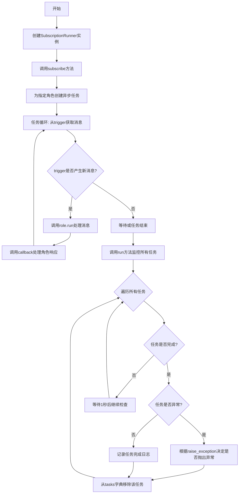
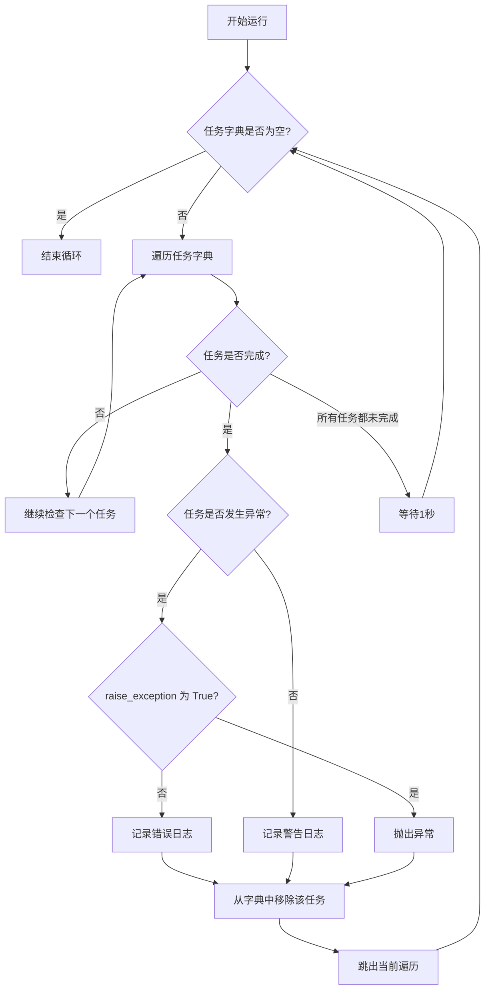

# `.\MetaGPT\metagpt\subscription.py` 详细设计文档

该代码实现了一个基于异步编程的订阅运行器，用于管理不同角色的订阅任务。它允许将角色（Role）与异步消息触发器（trigger）和回调函数（callback）绑定，自动处理消息的生成、角色的响应执行以及结果的回调通知，并通过异步任务进行统一的生命周期管理。

## 整体流程



## 类结构

```
BaseModel (Pydantic基类)
└── SubscriptionRunner (订阅运行器主类)
```

## 全局变量及字段


### `SubscriptionRunner.model_config`
    
Pydantic模型配置，允许任意类型以支持异步任务等复杂字段。

类型：`pydantic.ConfigDict`
    


### `SubscriptionRunner.tasks`
    
存储角色与其对应的异步订阅任务的映射字典。

类型：`dict[Role, asyncio.Task]`
    
    

## 全局函数及方法

### `SubscriptionRunner.subscribe`

该方法用于订阅一个角色（Role）到指定的异步消息触发器（trigger），并设置一个回调函数（callback）来处理角色处理后的响应消息。它会在事件循环中为每个角色创建一个异步任务，该任务会持续监听触发器产生的消息，调用角色的 `run` 方法处理消息，并将处理结果通过回调函数返回。

参数：

- `role`：`Role`，要订阅的角色实例，负责处理触发器产生的消息。
- `trigger`：`AsyncGenerator[Message, None]`，一个异步生成器，持续产生 `Message` 对象，作为角色的输入。
- `callback`：`Callable[[Message], Awaitable[None]]`，一个异步回调函数，接收角色处理后的 `Message` 响应作为参数。

返回值：`None`，该方法没有返回值，其作用是将新创建的异步任务注册到 `self.tasks` 字典中。

#### 流程图

```mermaid
flowchart TD
    A[开始调用 subscribe 方法] --> B[获取当前事件循环 loop]
    B --> C[定义内部异步函数 _start_role]
    C --> D{trigger 是否产生新消息?}
    D -- 是 --> E[获取消息 msg]
    E --> F[调用 role.run(msg) 处理消息]
    F --> G[获取响应 resp]
    G --> H[调用 callback(resp) 处理响应]
    H --> D
    D -- 否/结束 --> I[使用 loop.create_task 创建异步任务]
    I --> J[将任务 task 存入 self.tasks[role]]
    J --> K[方法结束]
```

#### 带注释源码

```python
async def subscribe(
    self,
    role: Role,
    trigger: AsyncGenerator[Message, None],
    callback: Callable[
        [
            Message,
        ],
        Awaitable[None],
    ],
):
    """Subscribes a role to a trigger and sets up a callback to be called with the role's response.

    Args:
        role: The role to subscribe.
        trigger: An asynchronous generator that yields Messages to be processed by the role.
        callback: An asynchronous function to be called with the response from the role.
    """
    # 获取当前正在运行的 asyncio 事件循环
    loop = asyncio.get_running_loop()

    # 定义内部异步函数，用于持续监听触发器并处理消息
    async def _start_role():
        # 异步迭代触发器，每次 yield 一个 Message 对象
        async for msg in trigger:
            # 调用角色的 run 方法处理接收到的消息，并等待其响应
            resp = await role.run(msg)
            # 将角色的响应传递给回调函数进行处理
            await callback(resp)

    # 使用事件循环创建一个新的异步任务，任务名为 "Subscription-{role.name}"
    # 并将此任务与对应的角色关联，存储在 tasks 字典中
    self.tasks[role] = loop.create_task(_start_role(), name=f"Subscription-{role}")
```

### `SubscriptionRunner.unsubscribe`

该方法用于取消指定角色的订阅，并从任务字典中移除并取消其关联的异步任务。

参数：
- `role`：`Role`，需要取消订阅的角色对象。

返回值：`None`，无返回值。

#### 流程图

```mermaid
flowchart TD
    A[开始: unsubscribe(role)] --> B{角色是否在<br>tasks字典中?}
    B -- 是 --> C[从tasks字典中<br>弹出并获取任务]
    C --> D[取消该任务]
    D --> E[结束]
    B -- 否 --> F[结束<br>（无操作）]
```

#### 带注释源码

```python
async def unsubscribe(self, role: Role):
    """Unsubscribes a role from its trigger and cancels the associated task.

    Args:
        role: The role to unsubscribe.
    """
    # 从任务字典 `self.tasks` 中移除并获取与给定 `role` 关联的异步任务。
    # 如果 `role` 不存在于字典中，`pop` 方法会引发 `KeyError`。
    task = self.tasks.pop(role)
    # 取消获取到的异步任务。
    task.cancel()
```

### `SubscriptionRunner.run`

该方法用于运行所有已订阅的任务，并持续监控它们的完成状态。它会循环检查每个任务是否已完成，如果任务完成，则根据是否发生异常以及`raise_exception`参数决定是抛出异常、记录错误还是记录警告。如果任务正常完成，会从任务字典中移除该任务。如果所有任务都在运行中，则每秒钟休眠一次。

参数：

- `raise_exception`：`bool`，控制当任务发生异常时是否抛出异常。默认为`True`。

返回值：`None`，此方法是一个异步协程，不返回具体值，会持续运行直到所有任务完成或被取消。

#### 流程图



#### 带注释源码

```python
async def run(self, raise_exception: bool = True):
    """运行所有已订阅的任务并处理它们的完成或异常。

    参数:
        raise_exception: 控制当任务发生异常时是否抛出异常。默认为True。

    异常:
        如果任务发生异常且raise_exception为True，则抛出该异常。
    """
    while True:  # 主循环，持续运行直到所有任务处理完毕
        for role, task in self.tasks.items():  # 遍历当前所有任务
            if task.done():  # 检查任务是否已完成（包括正常完成或异常）
                if task.exception():  # 检查任务是否因异常而完成
                    if raise_exception:  # 根据参数决定是否抛出异常
                        raise task.exception()
                    # 如果不抛出，则记录错误日志，包含异常堆栈信息
                    logger.opt(exception=task.exception()).error(f"Task {task.get_name()} run error")
                else:
                    # 任务正常完成，记录警告日志（因为订阅任务通常应持续运行）
                    logger.warning(
                        f"Task {task.get_name()} has completed. "
                        "If this is unexpected behavior, please check the trigger function."
                    )
                # 无论正常还是异常完成，都将该任务从管理字典中移除
                self.tasks.pop(role)
                break  # 跳出for循环，因为字典在迭代过程中被修改
        else:
            # for循环的else分支：当for循环正常遍历完所有项（即没有遇到break）时执行。
            # 这意味着当前没有任何一个任务完成，所有任务都在运行中。
            await asyncio.sleep(1)  # 等待1秒后再次检查，避免CPU空转
```

## 关键组件


### 异步任务管理器

SubscriptionRunner 类，用于管理基于异步生成器的订阅任务，为不同的 Role 实例创建并运行独立的后台任务，实现消息的触发、处理和回调。

### 角色订阅机制

`subscribe` 方法，将指定的 Role 实例与一个异步消息生成器（trigger）绑定，并为该角色创建一个持续运行的后台任务，自动处理生成的消息并调用回调函数。

### 异步消息触发器

`trigger` 参数（类型为 `AsyncGenerator[Message, None]`），作为异步消息源，以非阻塞方式持续或周期性地产生需要被 Role 处理的消息。

### 响应回调处理器

`callback` 参数（类型为 `Callable[[Message], Awaitable[None]]`），一个异步函数，用于接收并处理 Role 对触发消息的响应结果。

### 任务生命周期监控器

`run` 方法，作为主循环，持续监控所有已创建任务的状态，处理任务正常完成或异常退出的情况，并据此决定是否重新抛出异常或记录日志。


## 问题及建议


### 已知问题

-   **`run` 方法中的无限循环可能导致主线程阻塞**：`run` 方法使用 `while True` 循环来监控任务状态，并在没有任务完成时通过 `await asyncio.sleep(1)` 休眠。这种轮询方式效率较低，且如果所有任务都是长期运行或没有任务，该方法会持续占用事件循环，可能影响其他异步操作的响应性。
-   **异常处理逻辑可能导致任务被意外移除**：在 `run` 方法中，当检测到一个任务完成（`task.done()`）时，无论是因为异常还是正常完成，都会立即将该任务从 `self.tasks` 字典中移除（`self.tasks.pop(role)`）。如果在同一轮循环中有多个任务完成，`break` 语句会导致只处理第一个完成的任务，其他完成的任务可能不会被及时处理，直到下一轮循环。这可能导致日志记录不完整或资源清理延迟。
-   **任务取消后未等待其终止可能引发警告**：`unsubscribe` 方法取消了任务，但没有等待任务真正终止（例如使用 `await task` 或 `task.cancel()` 后配合异常处理）。如果被取消的任务在清理资源时发生异常，这些异常可能不会被捕获和记录，可能导致难以调试的问题。
-   **缺乏并发控制机制**：`subscribe` 方法为每个角色创建一个独立的任务来运行 `_start_role`。如果 `trigger` 生成消息的速度快于 `role.run` 处理的速度，或者为大量角色订阅了快速触发器，可能会创建大量并发任务，消耗过多系统资源，缺乏背压（backpressure）或限流机制。
-   **`run` 方法的 `raise_exception` 参数描述不清晰**：文档字符串中 `raise_exception` 参数的描述为 `_description_`，未提供有效说明，影响代码可读性和使用体验。

### 优化建议

-   **使用 `asyncio.wait` 替代轮询监控任务**：重构 `run` 方法，使用 `asyncio.wait(self.tasks.values(), return_when=asyncio.FIRST_COMPLETED)` 来异步等待任意任务完成。这可以消除忙等待（busy-waiting），提高效率并降低CPU使用率。
-   **改进任务完成处理逻辑**：在 `run` 方法中，处理完成的任务时，应收集所有已完成的任务（例如通过 `asyncio.as_completed` 或循环检查所有任务），然后统一进行异常处理、日志记录和从字典中移除，避免因 `break` 导致的遗漏。同时，考虑在任务正常完成时（非异常）是否应重新订阅或执行其他逻辑，而不仅仅是记录警告。
-   **在 `unsubscribe` 中妥善处理任务取消**：在 `unsubscribe` 方法中，取消任务后，建议添加 `try/except asyncio.CancelledError` 块来等待任务被取消并安全地清理，例如：`try: await task; except asyncio.CancelledError: pass`。这可以确保任务被正确终止，并捕获可能的清理异常。
-   **引入并发控制或队列机制**：考虑在 `_start_role` 内部或 `subscribe` 层面引入异步队列（`asyncio.Queue`）来控制从 `trigger` 到 `role.run` 的消息流。可以设置队列最大长度来实现背压，防止消息积压。或者，可以为整个 `SubscriptionRunner` 设置最大并发任务数。
-   **完善文档字符串**：更新 `run` 方法中 `raise_exception` 参数的描述，清晰说明其作用（例如：当任务因异常完成时，是否将异常抛出给调用者；若为 `False`，则仅记录错误日志而不中断 `run` 循环）。
-   **增加运行状态控制**：为 `SubscriptionRunner` 添加一个停止机制（例如 `stop` 方法），允许优雅地关闭所有订阅任务，而不是依赖外部取消或无限运行。这可以设置一个停止标志，并在 `run` 循环中检查，同时取消所有 `self.tasks` 中的任务。
-   **考虑任务生命周期管理**：当前设计下，一旦任务完成（无论原因），就会被从 `tasks` 字典中移除且无法自动重启。对于需要长期订阅的场景，可以考虑增加自动重启逻辑（例如，当任务因非取消原因退出时，重新调用 `subscribe`），但这会增加复杂性，需根据实际需求权衡。


## 其它


### 设计目标与约束

1.  **设计目标**:
    *   **异步事件驱动**: 核心目标是构建一个基于异步生成器的订阅-响应模型，允许角色（Role）异步地响应来自外部触发器（trigger）的消息流。
    *   **松耦合管理**: 将消息源（trigger）、消息处理器（role）和结果处理器（callback）解耦，通过 `SubscriptionRunner` 统一管理其生命周期和任务调度。
    *   **简易集成**: 提供简洁的 `subscribe` 和 `run` 接口，便于将现有的 `Role` 和异步消息源快速集成到一个长期运行的后台任务中。
    *   **资源管理**: 能够动态地订阅和取消订阅角色，并妥善处理任务完成或异常情况，防止资源泄漏。

2.  **设计约束**:
    *   **异步环境**: 代码强依赖于 Python 的 `asyncio` 框架，所有相关操作必须在异步上下文中进行。
    *   **Pydantic 模型**: `SubscriptionRunner` 继承自 `BaseModel`，其字段定义和序列化/反序列化行为受 Pydantic 约束（例如，通过 `model_config` 允许任意类型）。
    *   **角色接口**: 订阅的 `role` 必须实现 `async def run(msg: Message) -> Message` 方法。
    *   **触发器接口**: `trigger` 必须是一个 `AsyncGenerator[Message, None]`。
    *   **回调接口**: `callback` 必须是一个可异步调用的函数，接受一个 `Message` 参数并返回 `None`。

### 错误处理与异常设计

1.  **异常传播策略**:
    *   `subscribe` 方法：不直接捕获异常。在 `_start_role` 内部协程中，`role.run(msg)` 或 `callback(resp)` 抛出的异常会导致任务 (`asyncio.Task`) 状态变为 `done` 并携带异常。异常的具体处理延迟到 `run` 方法中。
    *   `unsubscribe` 方法：调用 `task.cancel()` 会引发 `asyncio.CancelledError` 到被取消的任务内部。此异常通常在任务内部被捕获和处理，或导致任务状态变为 `cancelled`。
    *   `run` 方法：提供了主要的异常处理逻辑。通过检查 `task.exception()` 来获取任务中发生的异常。当 `raise_exception=True`（默认）时，直接抛出该异常，导致整个 `run` 循环停止。当 `raise_exception=False` 时，异常被记录到日志（使用 `logger.opt(exception=...).error` 包含堆栈跟踪），然后对应的任务被从管理字典中移除，主循环继续运行其他任务。

2.  **资源清理**:
    *   在 `run` 方法中，无论任务因异常完成还是正常完成，都会通过 `self.tasks.pop(role)` 将已完成的任务从管理字典中移除，防止字典无限增长。
    *   在 `unsubscribe` 方法中，取消任务后同样会将其从管理字典中移除。

3.  **日志记录**:
    *   使用 `metagpt.logs.logger` 进行结构化日志记录。
    *   记录错误（`logger.error`）时附带异常信息。
    *   记录警告（`logger.warning`）当任务意外完成时（例如，触发器生成器提前耗尽），提示用户检查触发器函数。

### 数据流与状态机

1.  **核心数据流**:
    *   **触发流**: `AsyncGenerator trigger` -> 产生 `Message`。
    *   **处理流**: `Message` -> `Role.run()` -> 生成响应 `Message`。
    *   **回调流**: 响应 `Message` -> `Callback` 函数 -> 副作用（如存储、转发、打印）。
    数据流是单向的：`trigger` -> `role` -> `callback`。`SubscriptionRunner` 作为管道和组织者，驱动数据沿此路径流动。

2.  **任务状态机**:
    每个被订阅的 `Role` 对应一个 `asyncio.Task`，其生命周期由 `asyncio` 管理，`SubscriptionRunner` 对其进行监控：
    *   **Pending**: 调用 `subscribe` 后，任务被创建 (`loop.create_task`)，进入 pending 状态，等待事件循环调度。
    *   **Running**: 事件循环开始执行 `_start_role` 协程。
    *   **Done**: 任务执行完毕。进入此状态后，`run` 方法会检查其子状态：
        *   **Completed**: `_start_role` 协程正常返回（即 `trigger` 异步生成器耗尽）。记录警告日志。
        *   **Cancelled**: 被 `unsubscribe` 方法取消。任务被移出管理字典。
        *   **Failed (Exceptioned)**: `_start_role` 执行过程中发生未捕获异常。根据 `raise_exception` 参数决定是抛出异常还是记录错误日志。

### 外部依赖与接口契约

1.  **外部库依赖**:
    *   `asyncio`: Python 标准库，用于异步任务创建和管理。
    *   `pydantic`: 用于数据验证和设置管理（`BaseModel`, `ConfigDict`, `Field`）。
    *   `typing`: 用于类型注解（`AsyncGenerator`, `Awaitable`, `Callable`）。

2.  **项目内部依赖**:
    *   `metagpt.logs.logger`: 提供日志记录器。
    *   `metagpt.roles.Role`: 被订阅的角色类，必须实现 `async run(Message) -> Message` 方法。
    *   `metagpt.schema.Message`: 在触发器、角色处理和回调之间传递的消息数据模型。

3.  **接口契约**:
    *   **`trigger` 参数**: 契约定义为 `AsyncGenerator[Message, None]`。调用者必须提供一个能异步生成 `Message` 对象的生成器。生成器结束（`StopAsyncIteration`）意味着触发源关闭。
    *   **`callback` 参数**: 契约定义为 `Callable[[Message], Awaitable[None]]`。调用者必须提供一个异步函数，该函数能接受一个 `Message` 参数并进行处理，不返回任何值（或返回 `None`）。
    *   **`Role.run` 方法**: 这是 `metagpt.roles.Role` 类必须满足的隐式契约。它应是一个异步方法，接收一个 `Message`，返回一个 `Message`。
    *   **`SubscriptionRunner.run` 方法**: 调用者需在一个异步环境中运行此方法，它将阻塞直到所有被监控的任务完成或根据 `raise_exception` 设置抛出异常。

    