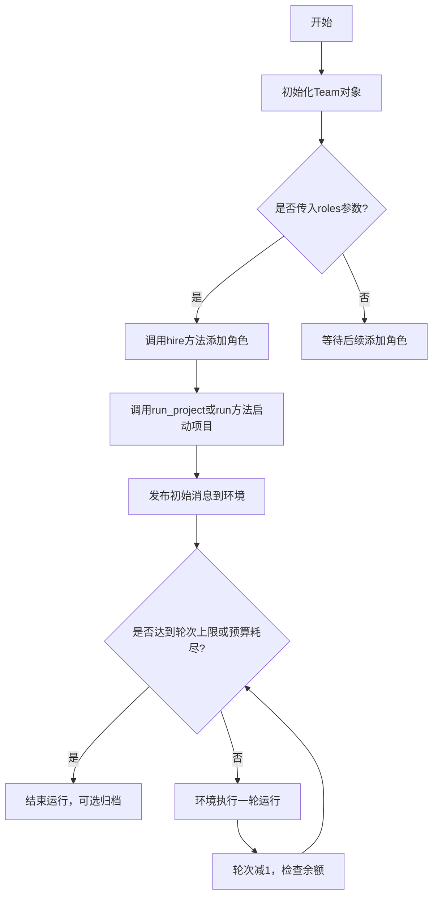
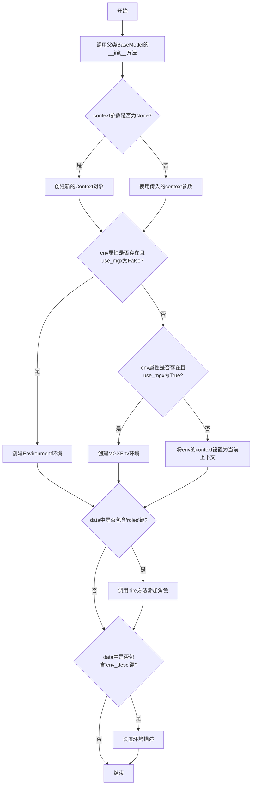
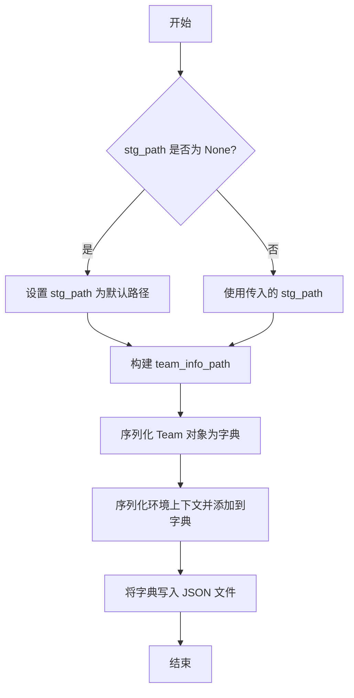
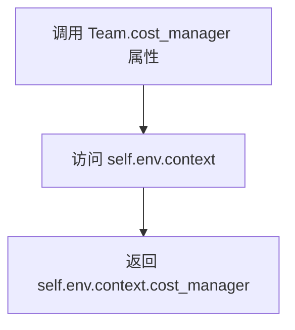
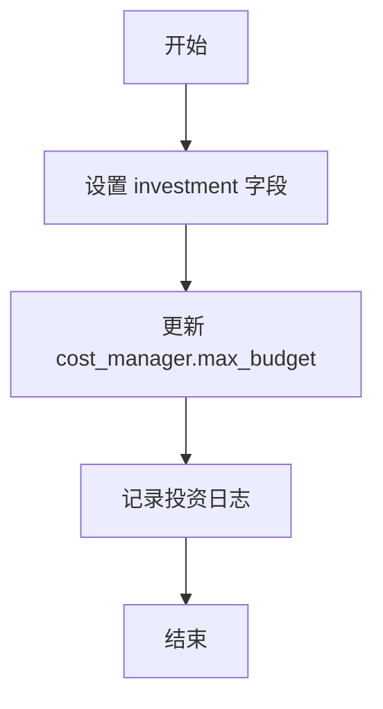
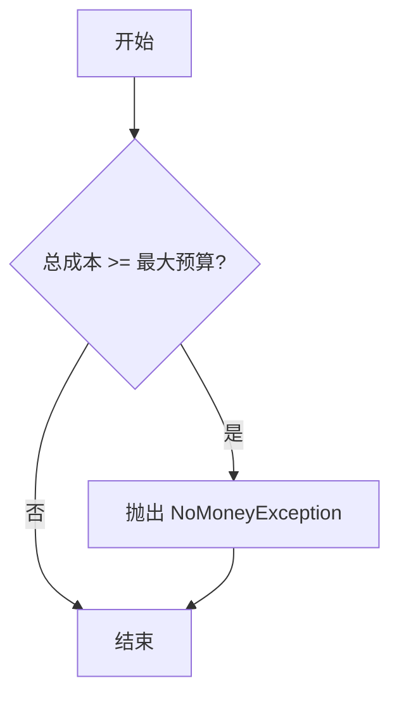
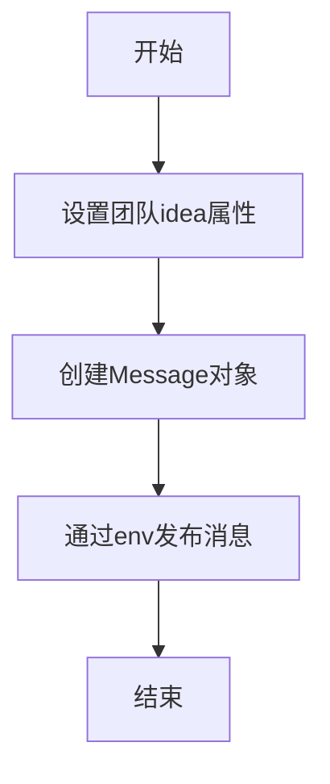
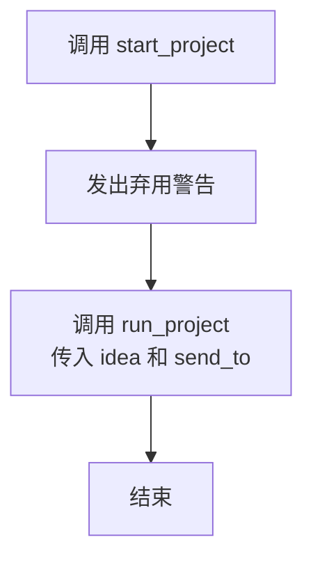
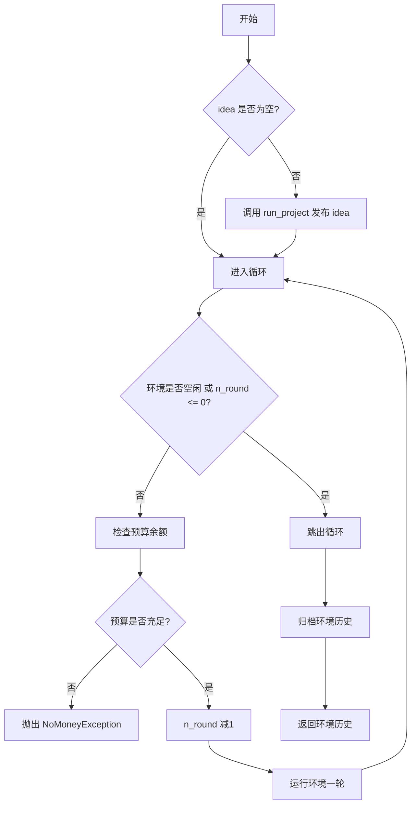

# `.\MetaGPT\metagpt\team.py` 详细设计文档

该代码定义了一个Team类，用于管理和协调多个角色（智能体）在特定环境中协作完成项目。它提供了团队初始化、角色雇佣、项目投资、项目运行、序列化/反序列化以及成本控制等功能，支持通过环境（Environment或MGXEnv）进行角色间的消息传递和任务调度，直到达到指定轮次或预算耗尽。

## 整体流程



## 类结构

```
BaseModel (Pydantic基类)
└── Team
    ├── 依赖: Environment / MGXEnv
    ├── 依赖: Context
    ├── 依赖: Role
    └── 依赖: Message
```

## 全局变量及字段


### `Team.env`
    
团队运行的环境，用于角色间的消息传递和交互，可以是基础环境或MGX环境。

类型：`Optional[Environment]`
    


### `Team.investment`
    
团队的投资预算，用于控制成本管理器的最大预算。

类型：`float`
    


### `Team.idea`
    
团队当前运行的项目需求或核心想法。

类型：`str`
    


### `Team.use_mgx`
    
标志位，指示是否使用MGX环境（MetaGPT扩展环境）。

类型：`bool`
    
    

## 全局函数及方法

### `Team.__init__`

初始化Team类的实例，设置团队的环境、上下文、角色和环境描述等属性。

参数：

- `context`：`Context`，可选的上下文对象，用于初始化团队环境
- `**data`：`Any`，其他关键字参数，用于初始化团队属性，如角色和环境描述

返回值：`None`，无返回值

#### 流程图



#### 带注释源码

```python
def __init__(self, context: Context = None, **data: Any):
    # 调用父类BaseModel的初始化方法，传入其他关键字参数
    super(Team, self).__init__(**data)
    
    # 如果context参数为None，则创建一个新的Context对象
    ctx = context or Context()
    
    # 如果env属性不存在且use_mgx为False，则创建Environment环境
    if not self.env and not self.use_mgx:
        self.env = Environment(context=ctx)
    # 如果env属性不存在且use_mgx为True，则创建MGXEnv环境
    elif not self.env and self.use_mgx:
        self.env = MGXEnv(context=ctx)
    # 如果env属性已存在（例如通过反序列化分配），则更新其上下文
    else:
        self.env.context = ctx  # The `env` object is allocated by deserialization
    
    # 如果data中包含'roles'键，则调用hire方法添加角色
    if "roles" in data:
        self.hire(data["roles"])
    
    # 如果data中包含'env_desc'键，则设置环境描述
    if "env_desc" in data:
        self.env.desc = data["env_desc"]
```

### `Team.serialize`

该方法用于将`Team`对象的状态序列化到指定的存储路径，以便后续可以重新加载和恢复团队状态。它主要将团队信息（包括环境上下文）保存为JSON文件。

参数：

- `stg_path`：`Path`，可选参数，指定序列化文件的存储路径。如果未提供，则使用默认路径`SERDESER_PATH.joinpath("team")`。

返回值：`None`，该方法不返回任何值，但会将序列化数据写入文件。

#### 流程图



#### 带注释源码

```python
def serialize(self, stg_path: Path = None):
    # 如果未提供存储路径，则使用默认路径
    stg_path = SERDESER_PATH.joinpath("team") if stg_path is None else stg_path
    # 构建团队信息文件的完整路径
    team_info_path = stg_path.joinpath("team.json")
    # 将 Team 对象序列化为字典
    serialized_data = self.model_dump()
    # 将环境上下文序列化并添加到字典中
    serialized_data["context"] = self.env.context.serialize()

    # 将序列化数据写入 JSON 文件
    write_json_file(team_info_path, serialized_data)
```

### `Team.deserialize`

`Team.deserialize` 是一个类方法，用于从指定的存储路径反序列化（即加载）一个 `Team` 对象。它读取序列化时保存的团队信息文件（`team.json`），恢复团队的状态，包括其环境、投资、想法等属性，并重新构建团队对象。

参数：

- `stg_path`：`Path`，指定包含序列化团队数据（特别是 `team.json` 文件）的目录路径。
- `context`：`Context`，可选参数，提供一个上下文对象。如果未提供，将创建一个新的 `Context` 对象。

返回值：`Team`，返回一个根据序列化数据重建的 `Team` 对象实例。

#### 流程图

```mermaid
flowchart TD
    A[开始: Team.deserialize(stg_path, context)] --> B[构建 team_info_path = stg_path/team.json]
    B --> C{文件 team_info_path 是否存在?}
    C -- 否 --> D[抛出 FileNotFoundError 异常]
    D --> E[结束]
    C -- 是 --> F[读取 JSON 文件内容到 team_info 字典]
    F --> G{是否提供了 context 参数?}
    G -- 否 --> H[创建新的 Context 对象 ctx]
    G -- 是 --> I[使用提供的 context 作为 ctx]
    H --> J
    I --> J[从 team_info 中弹出 'context' 键值对<br>并调用 ctx.deserialize() 恢复上下文]
    J --> K[使用剩余 team_info 数据和 ctx 实例化 Team 对象]
    K --> L[返回 Team 对象]
    L --> M[结束]
```

#### 带注释源码

```python
    @classmethod
    def deserialize(cls, stg_path: Path, context: Context = None) -> "Team":
        """stg_path = ./storage/team"""
        # 1. 定位并检查团队信息文件
        team_info_path = stg_path.joinpath("team.json")
        if not team_info_path.exists():
            # 如果文件不存在，抛出异常，提示无法恢复
            raise FileNotFoundError(
                "recover storage meta file `team.json` not exist, " "not to recover and please start a new project."
            )

        # 2. 读取序列化的团队信息
        team_info: dict = read_json_file(team_info_path)
        # 3. 处理上下文：使用提供的或创建新的，并反序列化保存的上下文数据
        ctx = context or Context()
        ctx.deserialize(team_info.pop("context", None))
        # 4. 使用反序列化得到的数据和上下文实例化一个新的 Team 对象
        team = Team(**team_info, context=ctx)
        # 5. 返回重建的 Team 对象
        return team
```

### `Team.hire`

该方法用于向团队中添加一个或多个角色（代理），使其能够参与团队环境中的协作活动。

参数：

- `roles`：`list[Role]`，要添加到团队中的角色列表。

返回值：`None`，无返回值。

#### 流程图

```mermaid
flowchart TD
    A[开始] --> B[接收角色列表 roles]
    B --> C[调用 self.env.add_roles(roles)]
    C --> D[结束]
```

#### 带注释源码

```python
def hire(self, roles: list[Role]):
    """Hire roles to cooperate"""
    # 调用环境对象的 add_roles 方法，将传入的角色列表添加到环境中
    self.env.add_roles(roles)
```

### `Team.cost_manager`

这是一个只读属性（property），用于获取团队环境（`self.env`）中上下文（`context`）所关联的成本管理器（`cost_manager`）。它提供了对团队资金消耗进行统一管理的接口。

参数：无

返回值：`CostManager` 类型，返回当前团队环境上下文中的成本管理器实例。

#### 流程图



#### 带注释源码

```python
    @property
    def cost_manager(self):
        """Get cost manager"""
        # 通过 self.env 访问环境对象，再通过环境的 context 属性访问上下文对象，
        # 最后返回上下文对象中的 cost_manager 属性。
        # 这是一个只读属性，用于集中管理项目的成本（如Token消耗）。
        return self.env.context.cost_manager
```

### `Team.invest`

该方法用于为团队（公司）注入资金，设置投资金额并更新成本管理器的最大预算。

参数：

- `investment`：`float`，投资金额，用于设置团队的最大预算。

返回值：`None`，无返回值。

#### 流程图



#### 带注释源码

```python
def invest(self, investment: float):
    """Invest company. raise NoMoneyException when exceed max_budget."""
    # 设置实例的 investment 字段为传入的投资金额
    self.investment = investment
    # 更新成本管理器的最大预算为投资金额
    self.cost_manager.max_budget = investment
    # 记录投资金额的日志信息
    logger.info(f"Investment: ${investment}.")
```

### `Team._check_balance`

该方法用于检查团队的资金余额是否充足。如果当前总成本已经达到或超过了最大预算，则抛出 `NoMoneyException` 异常，表示资金不足。

参数：无

返回值：无返回值，但在资金不足时会抛出 `NoMoneyException` 异常。

#### 流程图



#### 带注释源码

```python
def _check_balance(self):
    # 检查当前总成本是否达到或超过最大预算
    if self.cost_manager.total_cost >= self.cost_manager.max_budget:
        # 如果资金不足，抛出 NoMoneyException 异常
        raise NoMoneyException(self.cost_manager.total_cost, f"Insufficient funds: {self.cost_manager.max_budget}")
```

### `Team.run_project`

该方法用于启动一个项目，通过将用户需求（idea）作为消息发布到环境中，从而触发团队中角色的协作流程。

参数：

- `idea`：`str`，项目的核心需求或想法描述
- `send_to`：`str`，指定消息接收者的名称，默认为空字符串表示广播给所有角色

返回值：`None`，该方法没有返回值

#### 流程图



#### 带注释源码

```python
def run_project(self, idea, send_to: str = ""):
    """Run a project from publishing user requirement."""
    # 将传入的idea参数保存到团队的idea属性中
    self.idea = idea

    # 创建Message对象，包含用户需求内容
    # 通过环境对象发布消息，触发团队协作流程
    self.env.publish_message(Message(content=idea))
```

### `Team.start_project`

`Team.start_project` 是一个已弃用的方法，用于启动一个项目。它接收一个项目想法（idea）和一个可选的接收者（send_to），然后调用 `run_project` 方法来实际执行项目启动流程。该方法已被标记为弃用，建议使用 `run_project` 方法替代。

参数：

- `idea`：`str`，项目的核心想法或需求描述。
- `send_to`：`str`，可选参数，指定消息的接收者，默认为空字符串。

返回值：`None`，无返回值。

#### 流程图



#### 带注释源码

```python
def start_project(self, idea, send_to: str = ""):
    """
    Deprecated: This method will be removed in the future.
    Please use the `run_project` method instead.
    """
    # 发出弃用警告，提示开发者使用 `run_project` 方法替代
    warnings.warn(
        "The 'start_project' method is deprecated and will be removed in the future. "
        "Please use the 'run_project' method instead.",
        DeprecationWarning,
        stacklevel=2,
    )
    # 调用 `run_project` 方法，传入相同的参数，执行项目启动逻辑
    return self.run_project(idea=idea, send_to=send_to)
```

### `Team.run`

`Team.run` 方法是团队（Team）对象的核心执行方法，它负责启动并运行一个多智能体协作项目。该方法会持续运行指定的轮数（`n_round`），直到所有角色（Role）空闲、达到最大轮数或预算耗尽。在运行过程中，它会检查预算余额，确保项目在预算内进行。运行结束后，可以选择自动归档项目历史。

参数：

- `n_round`：`int`，指定项目运行的轮数，默认为3轮。
- `idea`：`str`，项目的初始想法或需求，如果提供，会通过 `run_project` 方法发布到环境中。
- `send_to`：`str`，指定消息的接收者，默认为空字符串。
- `auto_archive`：`bool`，控制是否在项目运行结束后自动归档环境历史，默认为 `True`。

返回值：`list`，返回环境（`env`）的历史记录（`history`），包含项目运行过程中的所有消息和事件。

#### 流程图



#### 带注释源码

```python
@serialize_decorator  # 序列化装饰器，用于在方法执行前后进行序列化操作
async def run(self, n_round=3, idea="", send_to="", auto_archive=True):
    """运行团队项目直到达到目标轮数或预算耗尽"""
    # 如果提供了 idea 参数，则调用 run_project 方法发布项目需求
    if idea:
        self.run_project(idea=idea, send_to=send_to)

    # 循环运行项目，直到达到指定轮数或所有角色空闲
    while n_round > 0:
        # 检查环境是否空闲（所有角色无任务）
        if self.env.is_idle:
            logger.debug("All roles are idle.")
            break
        # 减少剩余轮数
        n_round -= 1
        # 检查预算余额，如果预算不足则抛出异常
        self._check_balance()
        # 运行环境一轮，处理角色间的交互
        await self.env.run()

        # 记录剩余轮数
        logger.debug(f"max {n_round=} left.")
    # 归档环境历史，根据 auto_archive 参数决定是否自动归档
    self.env.archive(auto_archive)
    # 返回环境的历史记录
    return self.env.history
```

## 关键组件


### Team类

Team类是团队协作的核心组件，它封装了一个或多个角色（智能体）、标准操作流程（SOP）以及一个用于即时通讯的环境，专门用于处理任何多智能体活动，例如协作编写可执行代码。

### Environment环境

Environment是团队内部角色进行交互和通信的核心环境，它管理消息的发布、订阅以及角色的运行调度，是支撑多智能体协作的基础设施。

### MGXEnv环境

MGXEnv是Environment的一个具体实现，可能提供了额外的功能或针对特定场景（如MetaGPT扩展）进行了优化，是团队环境的一种可选配置。

### 序列化与反序列化

序列化与反序列化机制允许将Team对象及其状态（包括环境、上下文和角色信息）保存到磁盘或从磁盘恢复，实现了团队状态的持久化和项目存档功能。

### 成本管理器

成本管理器（通过`cost_manager`属性访问）集成在团队的上下文中，用于跟踪和管理项目执行过程中的资源消耗（如Token成本），并在预算超支时抛出异常，是资源约束管理的关键组件。

### 消息驱动的工作流

团队通过`run_project`方法发布初始消息（如用户需求）来启动项目，随后环境驱动各角色异步运行（`env.run`），形成基于消息发布/订阅的协作工作流，这是团队执行任务的核心模式。


## 问题及建议


### 已知问题

-   **`start_project` 方法已弃用但未移除**：代码中保留了 `start_project` 方法，并标记为 `Deprecated`。虽然发出了警告，但该方法仍然存在，可能导致新用户误用或增加代码维护的复杂性。
-   **序列化/反序列化路径硬编码**：`serialize` 方法中默认使用 `SERDESER_PATH.joinpath("team")` 作为存储路径。这种硬编码方式降低了灵活性，使得在不同环境或配置下调整存储位置变得困难。
-   **`run` 方法中的循环条件可能不直观**：`while n_round > 0` 循环在每次迭代前检查 `self.env.is_idle`。如果所有角色在循环开始前就处于空闲状态，循环会立即跳出，但 `n_round` 的递减和 `_check_balance` 的调用逻辑在这种边界情况下可能不符合开发者直觉。
-   **构造函数中 `env` 与 `use_mgx` 的逻辑耦合**：`__init__` 方法中根据 `use_mgx` 标志和 `env` 是否存在来初始化环境。如果同时提供了 `env` 对象和设置了 `use_mgx=True`，`use_mgx` 标志实际上被忽略（因为已有 `env`）。这种隐式逻辑可能令人困惑。
-   **缺乏对无效 `idea` 参数的处理**：`run_project` 和 `run` 方法接受 `idea` 参数，但如果传入空字符串或 `None`，可能不会抛出明确的错误或警告，导致项目目标不明确。

### 优化建议

-   **移除已弃用的 `start_project` 方法**：既然已提供 `run_project` 作为替代，并已发出弃用警告，应在未来的版本中完全移除 `start_project` 方法，以简化 API 并消除混淆。
-   **将序列化路径配置化**：建议将默认存储路径从硬编码改为通过配置类或环境变量管理。可以在 `Team` 类或全局配置中引入一个可配置的基路径，提高部署灵活性。
-   **重构 `run` 方法的循环逻辑**：考虑将 `n_round` 的检查与空闲状态检查的顺序进行调整或合并，使逻辑更清晰。例如，可以优先检查 `env.is_idle`，如果为真则直接返回，避免进入循环。同时，可以添加更明确的日志来说明提前退出的原因。
-   **简化环境初始化逻辑**：重构 `__init__` 方法，使 `use_mgx` 和 `env` 的优先级更明确。例如，可以规定如果显式提供了 `env` 实例，则忽略 `use_mgx` 标志；否则，根据 `use_mgx` 创建相应类型的环境。清晰的文档或断言有助于阐明这一行为。
-   **增加参数验证**：在 `run_project` 和 `run` 方法中，对 `idea` 参数进行基本的非空验证或修剪，并在无效时抛出 `ValueError` 或记录警告，确保项目启动时有明确的需求描述。
-   **考虑异步序列化**：`serialize` 方法是同步的，而 `run` 方法是异步的。如果序列化操作涉及大量 I/O（例如，写入大型历史记录），考虑提供异步版本的 `serialize` 方法（如 `async def aserialize`）以避免阻塞事件循环。
-   **增强错误恢复能力**：在 `deserialize` 方法中，除了检查 `team.json` 是否存在，还可以增加对文件内容格式的有效性验证（例如，使用 Pydantic 模型验证），并在数据损坏时提供更友好的错误信息或恢复选项。


## 其它


### 设计目标与约束

1. **核心目标**：提供一个可扩展的多智能体协作框架，支持角色（Role）在环境（Environment）中通过消息传递进行交互，共同完成复杂任务（如协作编写代码）。
2. **关键约束**：
   - 必须支持智能体的序列化（serialize）与反序列化（deserialize），以实现状态的持久化和恢复。
   - 必须集成成本管理（CostManager），在资源（预算）耗尽时停止运行。
   - 必须兼容两种环境实现：基础的`Environment`和增强的`MGXEnv`，通过`use_mgx`标志进行切换。
   - 向后兼容：保留已弃用的`start_project`方法，但发出警告引导用户使用新的`run_project`方法。
3. **非功能性目标**：
   - **可维护性**：通过Pydantic模型确保数据验证和配置管理。
   - **可观测性**：通过结构化日志记录关键操作和状态变更。
   - **灵活性**：通过依赖注入（Context）和环境抽象支持不同的运行时配置和扩展。

### 错误处理与异常设计

1. **异常类型**：
   - `NoMoneyException`：当运行成本超过总投资（`max_budget`）时抛出，用于强制停止项目执行。
   - `FileNotFoundError`：在反序列化过程中，当必需的元数据文件（`team.json`）不存在时抛出。
2. **错误处理策略**：
   - **资源耗尽**：在`run`方法的每轮循环中调用`_check_balance`检查预算，超支则抛出`NoMoneyException`终止运行。
   - **状态恢复**：反序列化时若文件缺失，抛出`FileNotFoundError`并提示用户启动新项目，避免数据不一致。
   - **弃用方法**：对`start_project`方法使用`warnings.warn`发出`DeprecationWarning`，引导用户迁移至新API，平衡兼容性与演进。
3. **日志记录**：关键操作（如投资、环境运行、空闲检测）通过`logger`记录不同级别（INFO, DEBUG）的日志，辅助调试和监控。

### 数据流与状态机

1. **主要数据流**：
   - **初始化**：通过`__init__`接收`context`、`roles`等参数，初始化环境（`Environment`或`MGXEnv`）并雇佣角色。
   - **项目启动**：`run_project`接收`idea`（用户需求），将其封装为`Message`发布到环境的消息队列中。
   - **运行循环**：`run`方法驱动环境执行多轮交互。每轮中，环境调用各角色的`react`方法处理消息，生成新消息。循环在达到指定轮数（`n_round`）或所有角色空闲（`env.is_idle`）时结束。
   - **状态持久化**：`serialize`将团队状态（包括环境上下文）保存为JSON文件；`deserialize`从文件恢复状态。
2. **关键状态**：
   - **环境状态**：由`env`管理，包括消息历史（`history`）、角色列表、当前是否空闲（`is_idle`）等。
   - **财务状态**：由`cost_manager`管理，跟踪总成本（`total_cost`）和预算上限（`max_budget`）。
   - **项目状态**：`idea`字段保存当前项目的核心需求。
3. **状态转换**：
   - **空闲 -> 活跃**：当通过`run_project`发布新消息时，环境被激活，角色开始处理消息。
   - **活跃 -> 空闲**：当环境消息队列为空且所有角色无新动作时，`is_idle`变为`True`，运行循环退出。
   - **运行 -> 停止**：触发`NoMoneyException`（预算超支）或完成指定轮数后，运行停止，并可选执行归档（`env.archive`）。

### 外部依赖与接口契约

1. **内部依赖（同一项目内）**：
   - `metagpt.context.Context`：提供运行时上下文，包括成本管理器、配置等。
   - `metagpt.environment.Environment` / `MGXEnv`：提供智能体交互的消息环境。
   - `metagpt.roles.Role`：定义参与协作的智能体角色。
   - `metagpt.schema.Message`：定义环境中传递的消息格式。
   - `metagpt.utils.common`：提供工具函数（如序列化装饰器、JSON读写）和异常（`NoMoneyException`）。
2. **外部依赖（第三方库）**：
   - `pydantic.BaseModel`：用于数据模型定义、验证和序列化。
   - `pathlib.Path`：用于跨平台的文件路径操作。
3. **接口契约**：
   - **序列化接口**：`serialize(stg_path: Path)`必须将团队完整状态写入指定路径；`deserialize(stg_path: Path, context: Context)`必须从指定路径恢复状态，并可与提供的`context`合并。
   - **环境接口**：`env`必须提供`add_roles`, `publish_message`, `run`, `is_idle`, `archive`等方法。
   - **成本管理接口**：通过`context.cost_manager`提供`total_cost`和`max_budget`属性，用于财务控制。
4. **配置契约**：
   - 序列化默认路径由`metagpt.const.SERDESER_PATH`定义。
   - 模型配置通过`model_config`允许任意类型，以支持复杂的`env`对象。

    