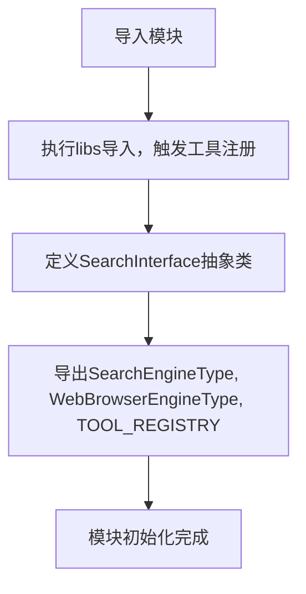
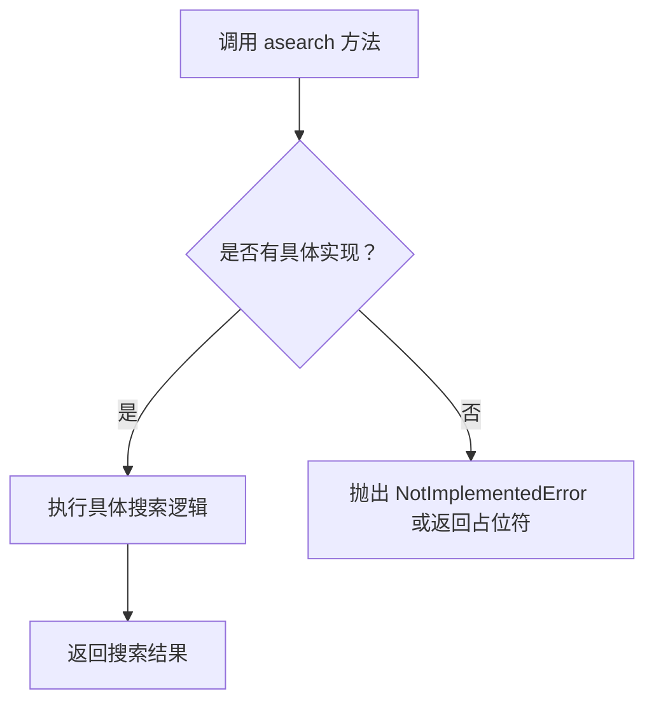

# `.\MetaGPT\metagpt\tools\__init__.py` 详细设计文档

该文件是metagpt.tools包的初始化模块，主要功能是注册所有工具并导出关键配置和接口。它通过导入libs模块来触发工具注册，然后定义了搜索接口的抽象类，并导出了搜索配置、浏览器配置和工具注册表等核心组件。

## 整体流程



## 类结构

```
metagpt.tools.__init__
├── SearchInterface (抽象接口类)
├── SearchEngineType (配置枚举)
├── WebBrowserEngineType (配置枚举)
└── TOOL_REGISTRY (工具注册表)
```

## 全局变量及字段


### `_`
    
一个占位符变量，用于避免导入的模块（libs, TOOL_REGISTRY）因未被使用而触发代码检查工具（如pre-commit）的警告。

类型：`tuple`
    


    

## 全局函数及方法


### `SearchInterface.asearch`

`SearchInterface.asearch` 是一个异步方法，作为搜索功能的抽象接口。它定义了搜索操作的标准签名，但当前并未实现具体功能，需要子类或具体实现类来提供实际的搜索逻辑。

参数：

- `*args`：`tuple`，可变位置参数，用于接收任意数量的位置参数，具体含义由实现类定义。
- `**kwargs`：`dict`，可变关键字参数，用于接收任意数量的关键字参数，具体含义由实现类定义。

返回值：`Any`，返回值类型和描述由具体的实现类决定。当前抽象方法返回 `...`（Ellipsis），表示未实现。

#### 流程图



#### 带注释源码

```python
async def asearch(self, *args, **kwargs):
    # 这是一个异步抽象方法，定义了搜索接口。
    # *args: 可变位置参数，允许调用者传入任意数量的位置参数。
    # **kwargs: 可变关键字参数，允许调用者传入任意数量的关键字参数。
    # 返回值: 由具体实现决定，通常应为搜索结果。
    # 当前实现仅为占位符（...），表示需要子类重写此方法。
    ...
```


## 关键组件


### 工具注册机制

通过导入 `metagpt.tools.libs` 模块自动注册所有工具到 `TOOL_REGISTRY` 中，实现工具的集中管理和发现。

### 工具注册表 (`TOOL_REGISTRY`)

一个全局的注册表，用于存储和管理所有可用的工具，为系统提供统一的工具访问入口。

### 搜索接口 (`SearchInterface`)

定义了一个异步搜索接口 `asearch`，为不同的搜索引擎实现提供了统一的调用契约。

### 配置枚举 (`SearchEngineType`, `WebBrowserEngineType`)

定义了搜索和网页浏览器引擎类型的枚举，用于在配置中选择和指定具体的技术实现。


## 问题及建议


### 已知问题

-   **`SearchInterface` 类未实现具体功能**：`SearchInterface` 类目前仅定义了一个空的异步方法 `asearch`，没有提供任何实际的搜索实现。这可能导致依赖此接口的代码无法正常工作或需要自行实现。
-   **工具注册机制不明确**：代码通过 `from metagpt.tools import libs` 导入 `libs` 来注册所有工具，但注册过程是隐式的（通过模块导入的副作用）。这种设计使得工具注册的时机和依赖关系不透明，增加了代码的理解和维护难度。
-   **`__all__` 导出列表不完整**：`__all__` 列表中没有包含 `SearchInterface` 类，这可能导致在使用 `from module import *` 语法时无法导入该类，影响其可用性。

### 优化建议

-   **实现 `SearchInterface` 类**：应为 `SearchInterface` 类的 `asearch` 方法提供具体的实现逻辑，或者将其明确标记为抽象基类（例如使用 `abc.ABC` 和 `@abstractmethod`），并定义其预期的参数和返回值，以建立清晰的接口契约。
-   **显式化工具注册流程**：建议将工具注册逻辑从模块导入的副作用中剥离出来，改为提供一个显式的函数（如 `register_all_tools()`）来执行注册。这样可以更好地控制注册时机，并提高代码的可测试性和可维护性。
-   **完善 `__all__` 列表**：将 `SearchInterface` 类添加到 `__all__` 列表中，以确保在使用通配符导入时能够正确导出，保持接口的公开性。
-   **考虑接口设计的合理性**：评估 `SearchInterface` 是否必要。如果项目中只有一个预期的搜索实现，或许可以直接提供具体的搜索类。如果需要支持多种搜索后端，则应将其设计为更完整的抽象基类或协议（Protocol），并可能引入一个工厂方法来根据配置返回具体的实例。
-   **添加类型注解**：为 `SearchInterface.asearch` 方法的参数和返回值添加详细的类型注解，这能提高代码的清晰度和 IDE 的支持度。


## 其它


### 设计目标与约束

该模块的核心设计目标是提供一个统一的工具注册与发现机制，并定义与外部服务（如搜索引擎、浏览器）交互的抽象接口。其约束包括：1) 保持模块的轻量级，避免复杂的初始化逻辑；2) 通过抽象类定义清晰的接口契约，便于未来扩展不同的实现；3) 确保工具注册表（`TOOL_REGISTRY`）在模块导入时即可用。

### 错误处理与异常设计

当前代码未显式定义错误处理机制。对于 `SearchInterface.asearch` 这样的抽象方法，预期的错误处理应由其具体实现类负责，例如处理网络超时、API调用失败、无效参数等异常。模块级别的错误（如工具注册失败）目前未做处理，这是一个潜在的风险点。

### 数据流与状态机

该模块不管理复杂的数据流或状态。其主要数据流是静态的：在模块导入时，执行 `from metagpt.tools import libs` 会触发 `libs` 模块中的代码，向全局的 `TOOL_REGISTRY` 注册工具。之后，其他代码可以通过 `TOOL_REGISTRY` 查询和使用已注册的工具。`SearchInterface` 类定义了一个状态无关的异步接口。

### 外部依赖与接口契约

1.  **外部依赖**：
    *   `metagpt.tools.libs`: 该模块的导入是注册所有工具的关键前置条件。
    *   `metagpt.configs.search_config.SearchEngineType`: 枚举类，定义了支持的搜索引擎类型。
    *   `metagpt.configs.browser_config.WebBrowserEngineType`: 枚举类，定义了支持的网页浏览器引擎类型。
2.  **接口契约**：
    *   `SearchInterface` 类定义了一个异步搜索的接口契约。任何实现该接口的类必须提供 `async def asearch(self, *args, **kwargs)` 方法。这为系统提供了可插拔的搜索能力。
    *   `TOOL_REGISTRY` 作为一个全局注册表，其预期的契约是：键为工具标识符，值为可调用的工具对象或工具类。使用者通过标识符从注册表中获取工具。

### 安全与权限考虑

当前代码未涉及显式的安全与权限控制。如果注册的工具或 `SearchInterface` 的实现会执行敏感操作（如访问外部API、执行系统命令、访问数据库），那么权限验证、访问控制、输入清洗和输出过滤等安全措施必须在工具的具体实现层面或调用上下文中完成。注册机制本身是开放的，需要警惕恶意工具的注册。

### 配置管理

模块通过导入 `SearchEngineType` 和 `WebBrowserEngineType` 暴露了与搜索和浏览器相关的配置枚举。这表明系统的行为（如选择哪种搜索引擎）可以通过配置来控制。具体的配置加载、解析和传递逻辑可能存在于 `metagpt.configs` 模块或其他地方，本模块仅提供类型定义。

### 测试策略

针对此模块的测试应关注：
1.  **工具注册**：验证导入 `metagpt.tools` 模块后，预期的工具是否已正确注册到 `TOOL_REGISTRY` 中。
2.  **接口定义**：验证 `SearchInterface` 作为一个抽象接口，其定义是否符合预期（例如，方法签名）。
3.  **模块导出**：验证 `__all__` 变量是否正确导出了指定的公共对象。
由于模块本身逻辑简单，单元测试应聚焦于其与依赖模块（如 `libs`）的集成效果。

    