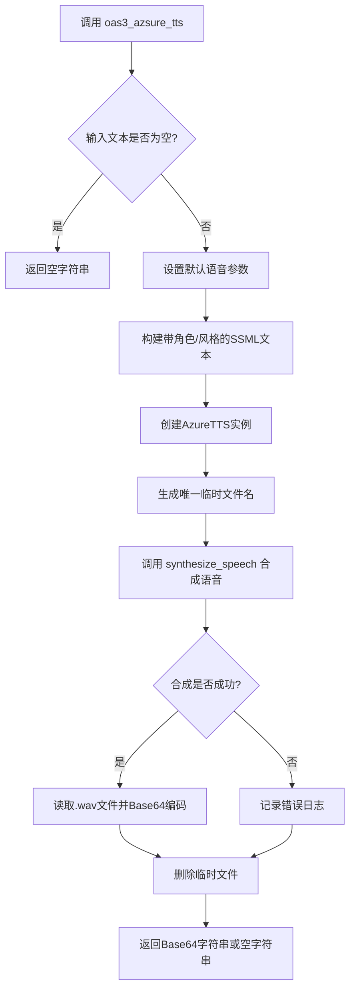
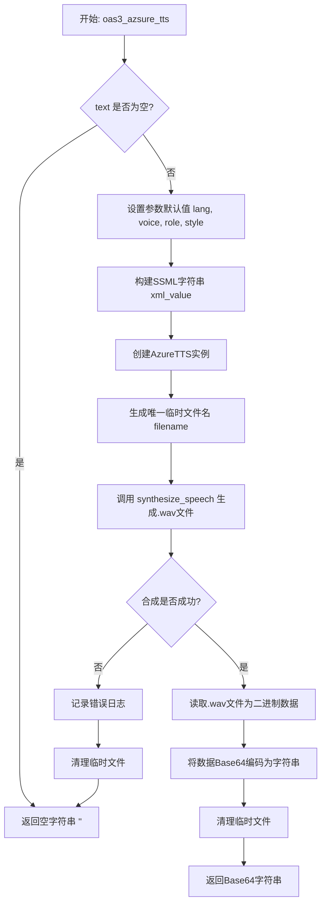
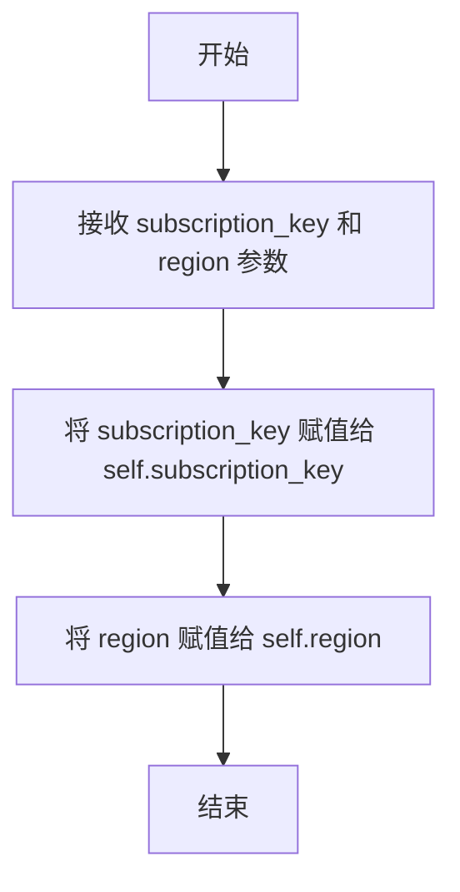
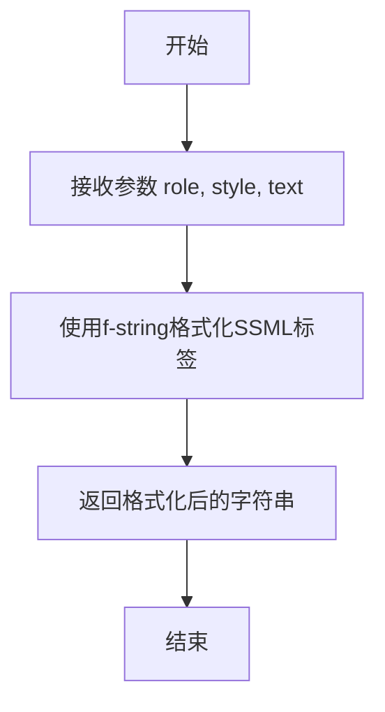
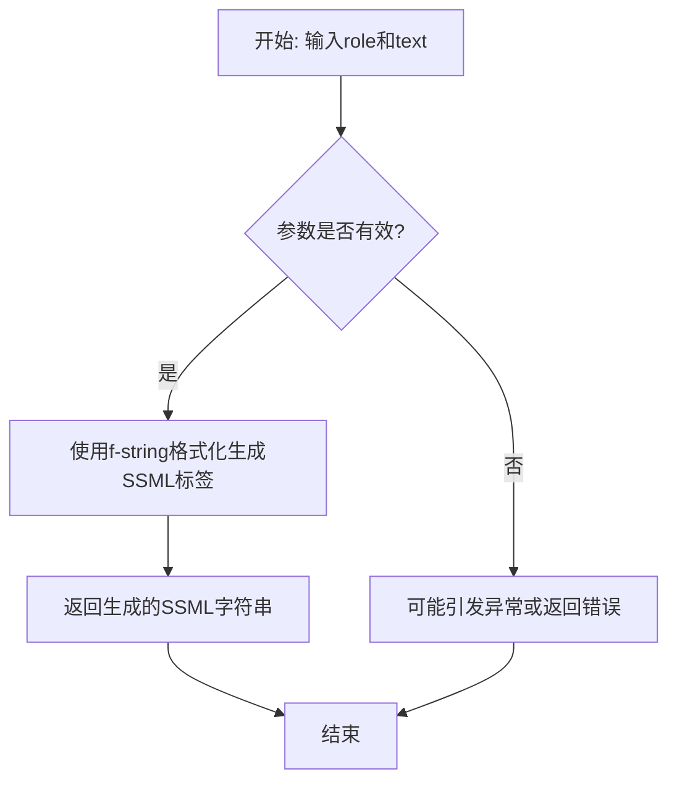
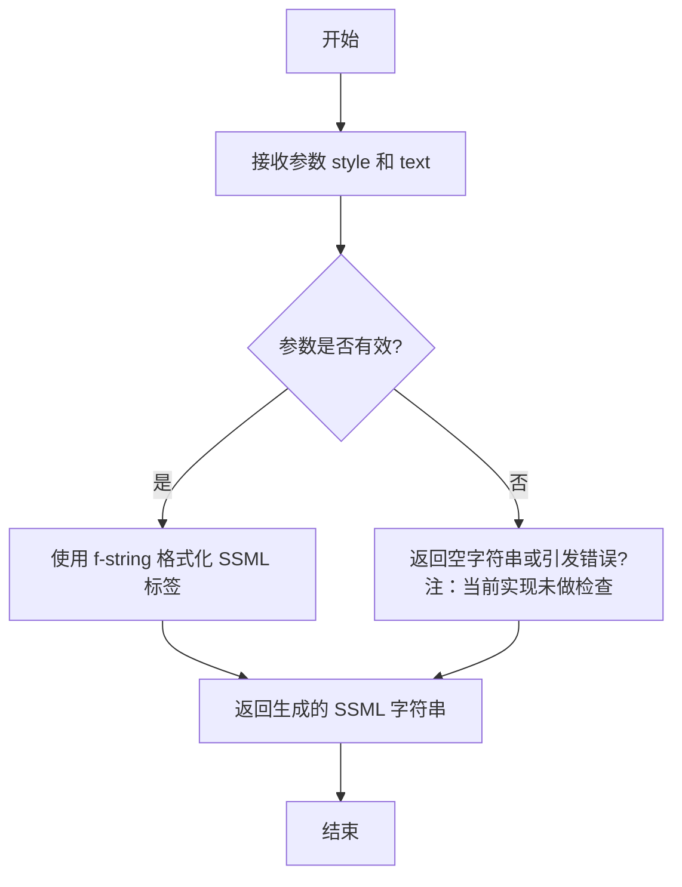

# `.\MetaGPT\metagpt\tools\azure_tts.py` 详细设计文档

该代码提供了一个基于微软Azure认知服务的文本转语音（TTS）功能封装。核心类AzureTTS封装了与Azure TTS API的交互，包括语音合成的配置和SSML（语音合成标记语言）的构建。同时，提供了一个便捷的异步全局函数oas3_azsure_tts，它接收文本和语音参数（如语言、音色、风格、角色），调用AzureTTS生成语音文件，并将其内容以Base64编码的字符串形式返回，同时负责临时文件的清理。

## 整体流程



## 类结构

```
AzureTTS
├── 字段: subscription_key, region
├── 方法: __init__, synthesize_speech
└── 静态方法: role_style_text, role_text, style_text

全局函数: oas3_azsure_tts
```

## 全局变量及字段


### `AzureTTS.subscription_key`
    
用于访问Azure AI服务API的密钥，从Azure门户获取。

类型：`str`
    


### `AzureTTS.region`
    
Azure AI服务资源所在的区域或地理位置。

类型：`str`
    
    

## 全局函数及方法


### `oas3_azsure_tts`

这是一个异步全局函数，作为Azure文本转语音（TTS）服务的OAS3 API接口。它接收文本和语音参数，调用Azure TTS服务生成语音文件，并将生成的.wav文件内容以Base64编码字符串的形式返回。函数内部处理了参数的默认值、SSML（语音合成标记语言）的构建、语音合成、文件读写、Base64编码以及异常处理和资源清理。

参数：

-  `text`：`str`，需要进行语音转换的文本内容。
-  `lang`：`str`，语音的语言代码或区域设置（例如 `en-US`）。默认为 `zh-CN`。
-  `voice`：`str`，指定要使用的语音名称（例如 `zh-CN-XiaomoNeural`）。默认为 `zh-CN-XiaomoNeural`。
-  `style`：`str`，语音的表达风格（例如 `cheerful`, `calm`）。默认为 `affectionate`。
-  `role`：`str`，语音扮演的角色（例如 `YoungAdultFemale`, `OlderAdultMale`）。默认为 `Girl`。
-  `subscription_key`：`str`，用于访问Azure AI服务API的订阅密钥。
-  `region`：`str`，Azure AI服务资源所在的区域。

返回值：`str`，成功时返回Base64编码的.wav文件数据字符串；如果输入文本为空或处理过程中发生异常，则返回空字符串 `""`。

#### 流程图



#### 带注释源码

```python
async def oas3_azsure_tts(text, lang="", voice="", style="", role="", subscription_key="", region=""):
    """Text to speech
    For more details, check out:`https://learn.microsoft.com/en-us/azure/ai-services/speech-service/language-support?tabs=tts`

    :param lang: The value can contain a language code such as en (English), or a locale such as en-US (English - United States). For more details, checkout: `https://learn.microsoft.com/en-us/azure/ai-services/speech-service/language-support?tabs=tts`
    :param voice: For more details, checkout: `https://learn.microsoft.com/en-us/azure/ai-services/speech-service/language-support?tabs=tts`, `https://speech.microsoft.com/portal/voicegallery`
    :param style: Speaking style to express different emotions like cheerfulness, empathy, and calm. For more details, checkout: `https://learn.microsoft.com/en-us/azure/ai-services/speech-service/language-support?tabs=tts`
    :param role: With roles, the same voice can act as a different age and gender. For more details, checkout: `https://learn.microsoft.com/en-us/azure/ai-services/speech-service/language-support?tabs=tts`
    :param text: The text used for voice conversion.
    :param subscription_key: key is used to access your Azure AI service API, see: `https://portal.azure.com/` > `Resource Management` > `Keys and Endpoint`
    :param region: This is the location (or region) of your resource. You may need to use this field when making calls to this API.
    :return: Returns the Base64-encoded .wav file data if successful, otherwise an empty string.

    """
    # 1. 输入验证：如果文本为空，直接返回空字符串
    if not text:
        return ""

    # 2. 设置参数默认值
    if not lang:
        lang = "zh-CN"
    if not voice:
        voice = "zh-CN-XiaomoNeural"
    if not role:
        role = "Girl"
    if not style:
        style = "affectionate"

    # 3. 使用AzureTTS类的静态方法构建包含角色和风格的SSML文本片段
    xml_value = AzureTTS.role_style_text(role=role, style=style, text=text)
    
    # 4. 实例化AzureTTS客户端
    tts = AzureTTS(subscription_key=subscription_key, region=region)
    
    # 5. 在当前脚本文件所在目录下，生成一个唯一的临时.wav文件名
    filename = Path(__file__).resolve().parent / (str(uuid4()).replace("-", "") + ".wav")
    
    try:
        # 6. 调用异步合成方法，生成语音文件
        await tts.synthesize_speech(lang=lang, voice=voice, text=xml_value, output_file=str(filename))
        
        # 7. 异步读取生成的.wav文件
        async with aiofiles.open(filename, mode="rb") as reader:
            data = await reader.read()
            # 8. 将二进制音频数据转换为Base64编码字符串
            base64_string = base64.b64encode(data).decode("utf-8")
    except Exception as e:
        # 9. 异常处理：记录错误日志
        logger.error(f"text:{text}, error:{e}")
        return ""
    finally:
        # 10. 资源清理：无论成功与否，都尝试删除临时文件
        filename.unlink(missing_ok=True)

    # 11. 返回Base64编码的音频数据
    return base64_string
```


### `AzureTTS.__init__`

AzureTTS 类的构造函数，用于初始化 Azure 文本转语音服务的客户端配置。它接收 Azure 服务的订阅密钥和区域信息，并将它们存储为实例变量，以便后续的语音合成方法使用。

参数：

-  `subscription_key`：`str`，用于访问 Azure AI 服务 API 的密钥。可以在 Azure 门户的资源管理部分的“密钥和终结点”页面找到。
-  `region`：`str`，Azure 资源所在的区域（或位置）。在调用此 API 时可能需要使用此字段。

返回值：`None`，此方法不返回任何值，仅用于初始化对象状态。

#### 流程图



#### 带注释源码

```python
def __init__(self, subscription_key, region):
    """
    :param subscription_key: key is used to access your Azure AI service API, see: `https://portal.azure.com/` > `Resource Management` > `Keys and Endpoint`
    :param region: This is the location (or region) of your resource. You may need to use this field when making calls to this API.
    """
    # 将传入的订阅密钥存储为实例变量，供后续语音合成方法使用
    self.subscription_key = subscription_key
    # 将传入的区域信息存储为实例变量，供后续语音合成方法使用
    self.region = region
```


### `AzureTTS.synthesize_speech`

该方法使用Azure认知服务的文本转语音（TTS）功能，将给定的文本合成为语音，并保存到指定的音频文件中。它通过构造SSML（语音合成标记语言）字符串来指定语言、语音角色和文本内容，然后调用Azure SDK进行异步语音合成。

参数：

-  `lang`：`str`，指定语音合成的语言和区域设置，例如 `'zh-CN'` 或 `'en-US'`。
-  `voice`：`str`，指定要使用的语音名称，例如 `'zh-CN-XiaomoNeural'`。
-  `text`：`str`，需要进行语音合成的文本内容。
-  `output_file`：`str`，合成语音后输出的音频文件路径。

返回值：`azure.cognitiveservices.speech.SpeechSynthesisResult`，返回Azure语音合成的结果对象，其中包含合成操作的详细信息（如音频数据、原因等）。调用方可以通过此结果判断合成是否成功或获取音频流。

#### 流程图

```mermaid
graph TD
    A[开始: synthesize_speech] --> B[创建SpeechConfig<br/>设置subscription_key和region]
    B --> C[设置speech_synthesis_voice_name为voice参数]
    C --> D[创建AudioConfig<br/>指定输出文件名]
    D --> E[创建SpeechSynthesizer<br/>组合SpeechConfig和AudioConfig]
    E --> F[构造SSML字符串<br/>包含lang, voice和text]
    F --> G[调用synthesizer.speak_ssml_async<br/>传入SSML字符串]
    G --> H[获取异步结果.get()]
    H --> I[返回SpeechSynthesisResult]
```

#### 带注释源码

```python
async def synthesize_speech(self, lang, voice, text, output_file):
    # 1. 配置语音服务：使用提供的订阅密钥和区域创建基础配置。
    speech_config = SpeechConfig(subscription=self.subscription_key, region=self.region)
    # 2. 指定语音：设置要使用的具体语音名称。
    speech_config.speech_synthesis_voice_name = voice
    # 3. 配置音频输出：指定合成语音的保存文件路径。
    audio_config = AudioConfig(filename=output_file)
    # 4. 创建合成器：组合语音配置和音频输出配置。
    synthesizer = SpeechSynthesizer(speech_config=speech_config, audio_config=audio_config)

    # 5. 构造SSML：根据参数构建符合SSML标准的XML字符串，用于精确控制语音合成。
    #    SSML允许指定语言、语音、以及更丰富的表达特性。
    ssml_string = (
        "<speak version='1.0' xmlns='http://www.w3.org/2001/10/synthesis' "
        f"xml:lang='{lang}' xmlns:mstts='http://www.w3.org/2001/mstts'>"
        f"<voice name='{voice}'>{text}</voice></speak>"
    )

    # 6. 执行合成并返回结果：异步执行SSML语音合成，并等待获取最终结果。
    #    .get() 方法会等待异步操作完成。
    return synthesizer.speak_ssml_async(ssml_string).get()
```


### `AzureTTS.role_style_text`

这是一个静态方法，用于生成一个包含指定角色（role）和风格（style）属性的SSML（语音合成标记语言）XML标签字符串。该标签用于包裹文本，以指示Azure TTS服务使用特定的语音角色和表达风格来合成语音。

参数：

- `role`：`str`，指定语音的角色，例如“Girl”、“Boy”、“Senior”等，用于模拟不同年龄和性别的说话者。
- `style`：`str`，指定语音的表达风格，例如“cheerful”、“sad”、“angry”等，用于表达不同的情感。
- `text`：`str`，需要被合成的文本内容。

返回值：`str`，返回一个格式化的SSML XML字符串，例如：`<mstts:express-as role="Girl" style="cheerful">Hello</mstts:express-as>`。

#### 流程图



#### 带注释源码

```python
    @staticmethod
    def role_style_text(role, style, text):
        # 使用f-string将传入的角色(role)、风格(style)和文本(text)参数
        # 格式化为一个符合SSML标准的<mstts:express-as>标签字符串。
        # 这个标签用于指示语音合成引擎使用特定的角色和风格来朗读包裹的文本。
        return f'<mstts:express-as role="{role}" style="{style}">{text}</mstts:express-as>'
```


### `AzureTTS.role_text`

这是一个静态方法，用于生成包含指定“角色”（role）属性的SSML（语音合成标记语言）XML标签片段。该标签用于指示Azure TTS服务以特定的角色（如不同年龄、性别）来朗读文本。

参数：

-  `role`：`str`，指定语音的角色，例如 "Girl"、"Boy"、"YoungAdultFemale"、"OlderAdultMale" 等。这会影响合成语音的音色和语调，使其听起来像特定角色在说话。
-  `text`：`str`，需要被合成的文本内容。

返回值：`str`，返回一个格式化的SSML字符串，例如 `<mstts:express-as role="Girl">你好</mstts:express-as>`。这个字符串可以直接嵌入到更大的SSML文档中，作为 `synthesize_speech` 方法的输入文本部分。

#### 流程图



#### 带注释源码

```python
    @staticmethod
    def role_text(role, text):
        # 使用f-string将角色(role)和文本(text)插入到预定义的SSML标签模板中。
        # 生成的XML标签 `<mstts:express-as role="{role}">` 是Azure TTS服务
        # 用于控制语音角色的特定标签。
        return f'<mstts:express-as role="{role}">{text}</mstts:express-as>'
```


### `AzureTTS.style_text`

`AzureTTS.style_text` 是一个静态方法，用于生成包含指定说话风格（style）的 SSML（语音合成标记语言）标签片段。该方法将输入的文本包裹在 `<mstts:express-as>` 标签中，并设置其 `style` 属性，以便在语音合成时应用特定的情感或表达风格（如 cheerful, empathetic, calm 等）。

参数：

-  `style`：`str`，指定要应用的说话风格（例如："cheerful", "sad", "angry"）。
-  `text`：`str`，需要进行语音合成的原始文本内容。

返回值：`str`，返回一个格式化的 SSML 字符串片段，例如：`<mstts:express-as style="cheerful">Hello World</mstts:express-as>`。

#### 流程图



#### 带注释源码

```python
    @staticmethod
    def style_text(style, text):
        """
        静态方法：生成带有指定说话风格的 SSML 标签文本。
        
        参数:
            style (str): 要应用的语音风格，例如 'cheerful', 'sad'。
            text (str): 需要被合成的文本内容。
            
        返回:
            str: 包裹在 <mstts:express-as> 标签中的文本，其 style 属性被设置为给定的值。
            示例: <mstts:express-as style="affectionate">你好</mstts:express-as>
        """
        # 使用 f-string 将参数插入到预定义的 XML 标签模板中。
        # 注意：此方法假设输入参数是有效的，未进行空值或类型检查。
        return f'<mstts:express-as style="{style}">{text}</mstts:express-as>'
```


## 关键组件


### AzureTTS 类

封装了 Azure 认知服务文本转语音（TTS）的核心功能，负责配置语音合成参数、生成 SSML 标记语言并调用 Azure SDK 进行语音合成。

### synthesize_speech 方法

AzureTTS 类的核心异步方法，负责根据指定的语言、语音、文本和输出文件路径，配置 Azure 语音合成器，生成 SSML 字符串，并最终调用 Azure SDK 的 `speak_ssml_async` 方法将文本合成为音频文件。

### SSML 辅助静态方法 (role_style_text, role_text, style_text)

一组静态工具方法，用于便捷地生成符合 Speech Synthesis Markup Language (SSML) 标准的 XML 片段，以支持在语音合成中指定说话者的角色（如年龄、性别）和表达风格（如情感）。

### oas3_azsure_tts 全局函数

一个面向 OpenAPI Specification 3 (OAS3) 的异步接口函数，作为模块的主要对外服务入口。它整合了参数处理、SSML 构建、AzureTTS 实例调用、音频文件生成、Base64 编码以及临时文件清理的完整流程，将文本转换为 Base64 编码的音频数据。

### 音频文件与 Base64 编码处理流程

负责在语音合成过程中管理临时音频文件的创建、读取、Base64 编码转换以及最终的清理工作，确保不留下中间文件，并将最终的音频数据以字符串形式返回。

### 错误处理与日志记录

通过 try-except-finally 结构捕获合成过程中的异常，使用 logger 记录错误信息，确保函数在出错时能返回空字符串并清理临时文件，保障服务的健壮性。

### 外部依赖 (Azure Cognitive Services Speech SDK)

代码的核心依赖，即 `azure.cognitiveservices.speech` 库，提供了与 Azure 语音服务交互的底层 API，包括语音配置、音频配置和合成器的创建与控制。


## 问题及建议


### 已知问题

-   **同步调用阻塞异步流程**：`AzureTTS.synthesize_speech` 方法内部使用了 `synthesizer.speak_ssml_async(...).get()`。`.get()` 是一个同步调用，它会阻塞当前事件循环，直到语音合成完成，这违背了异步编程的初衷，可能导致在并发场景下性能下降或响应延迟。
-   **硬编码的默认参数**：`oas3_azsure_tts` 函数中，语言 (`lang`)、语音 (`voice`)、角色 (`role`)、风格 (`style`) 等参数都设置了硬编码的默认值（如 `"zh-CN"`, `"zh-CN-XiaomoNeural"`）。这降低了函数的灵活性，使其难以适应多语言或不同语音风格的需求，且默认值可能不符合所有用户场景。
-   **异常处理过于宽泛**：`oas3_azsure_tts` 函数使用 `except Exception as e` 捕获所有异常。虽然记录了错误日志，但返回空字符串可能掩盖了具体的错误原因（如网络问题、认证失败、参数错误等），不利于调用者进行针对性的错误处理和调试。
-   **临时文件管理风险**：代码使用 `uuid4()` 生成临时文件名，并在 finally 块中删除。虽然使用了 `missing_ok=True`，但在极端并发情况下，仍存在文件名冲突的微小风险。此外，文件操作（创建、写入、读取、删除）完全在异步函数中完成，若合成过程被取消或发生严重错误，可能导致文件未被正确清理。
-   **配置参数传递方式**：`AzureTTS` 类的初始化参数 (`subscription_key`, `region`) 和合成参数 (`lang`, `voice` 等) 在 `oas3_azsure_tts` 函数中都是作为参数传递。对于需要频繁调用的场景，每次调用都传递密钥和区域信息不够高效，且密钥以明文形式在函数间传递存在潜在安全风险。

### 优化建议

-   **将同步调用改为真正的异步**：修改 `AzureTTS.synthesize_speech` 方法，使其成为真正的异步方法。可以利用 `asyncio.to_thread` 将阻塞的 SDK 调用 (`speak_ssml_async`) 放到线程池中执行，或者寻找 Azure SDK 是否提供了原生异步接口 (`asyncio` 兼容版本) 进行替换。
-   **提供可配置的默认值**：将 `oas3_azsure_tts` 函数中的硬编码默认值提取为模块级常量或配置项。更好的做法是允许通过配置文件、环境变量或一个配置类来管理这些默认值，提高代码的可维护性和灵活性。
-   **细化异常处理**：将 `except Exception` 替换为更具体的异常捕获，例如捕获 `azure.cognitiveservices.speech` 可能抛出的特定异常（如 `SpeechSynthesisException`）。可以定义自定义异常类，将底层异常信息封装后抛出，或者至少返回更具信息量的错误标识，而不仅仅是空字符串。
-   **使用 `tempfile` 模块管理临时文件**：建议使用 Python 标准库的 `tempfile` 模块（如 `tempfile.NamedTemporaryFile`）来创建和管理临时文件。该模块能更好地处理跨平台路径、自动清理以及并发安全问题。
-   **引入配置管理或客户端池**：考虑创建一个 `AzureTTSClient` 单例或使用连接池模式来管理 `AzureTTS` 实例。这样可以将 `subscription_key` 和 `region` 等配置信息在初始化时加载一次，避免重复传递。同时，确保敏感信息（如密钥）通过安全的方式加载（如环境变量、密钥管理服务）。
-   **增加输入验证与清理**：在 `oas3_azsure_tts` 函数开始处，增加对输入参数（特别是 `text`）的验证，例如检查是否为空、是否包含可能导致 SSML 注入的特殊字符，并进行适当的清理或转义，以提高安全性。
-   **考虑支持流式输出**：当前实现将音频文件保存到磁盘，再读入内存并编码为 Base64。如果 Azure SDK 支持，可以考虑直接将合成的音频流输出到内存缓冲区，避免磁盘 I/O 操作，从而提升性能和响应速度。


## 其它


### 设计目标与约束

1. **核心目标**：提供一个简单、异步的接口，将文本通过Azure TTS服务转换为语音，并以Base64编码的WAV音频数据形式返回。
2. **关键约束**：
    *   **外部依赖**：必须依赖Azure Cognitive Services的Speech SDK (`azure-cognitiveservices-speech`) 和有效的订阅密钥与区域。
    *   **异步操作**：主要功能需设计为异步，以支持非阻塞的I/O操作，特别是在网络请求和文件读写时。
    *   **资源管理**：生成的临时音频文件必须在处理后（无论成功或失败）被清理，避免磁盘空间泄漏。
    *   **错误隔离**：Azure服务调用或本地文件操作失败时，不应导致调用进程崩溃，而应返回空字符串并记录错误。
    *   **接口简化**：对外暴露的全局函数 `oas3_azsure_tts` 应提供合理的默认参数，降低调用复杂度。

### 错误处理与异常设计

1. **异常捕获范围**：在 `oas3_azsure_tts` 函数中，使用 `try...except...finally` 块包裹核心业务逻辑（Azure SDK调用、文件读写、Base64编码），以捕获所有可能的异常。
2. **错误处理策略**：
    *   **输入验证**：函数入口检查 `text` 参数是否为空，若为空则直接返回空字符串，避免无效的API调用。
    *   **异常降级**：当捕获到任何 `Exception` 时，记录错误日志（包含原始文本和异常信息），并返回空字符串作为失败标识。这确保了调用方不会因TTS功能故障而中断。
    *   **资源清理保证**：`finally` 块确保临时生成的WAV文件一定会被尝试删除 (`missing_ok=True`)，无论前面步骤成功与否。
3. **日志记录**：使用项目统一的 `logger` 记录错误信息，便于问题追踪。
4. **局限性**：当前错误处理较为笼统，所有异常均统一处理。未来可考虑对 `azure.cognitiveservices.speech` 的特定异常（如 `AuthenticationFailure`, `ServiceTimeout`）进行更精细化的捕获和处理。

### 数据流与状态机

1. **主要数据流**：
    *   **输入**：调用者提供文本 (`text`) 及可选的语音参数（`lang`, `voice`, `style`, `role`）和认证信息（`subscription_key`, `region`）。
    *   **处理**：
        1.  参数补全（使用默认值）。
        2.  构建包含角色和样式信息的SSML XML字符串。
        3.  使用 `AzureTTS` 类，通过Azure SDK向远程服务发送SSML请求。
        4.  Azure服务返回音频流，SDK将其写入本地临时文件。
        5.  读取临时文件内容，进行Base64编码。
    *   **输出**：Base64编码的WAV音频字符串。失败时输出空字符串。
2. **状态机（简化）**：
    *   **初始态**：等待调用。
    *   **参数处理态**：验证并补全输入参数。
    *   **服务调用态**：通过SDK与Azure TTS服务交互。此状态可能因网络或服务问题进入**错误态**。
    *   **文件操作态**：写入和读取临时文件。此状态可能因I/O问题进入**错误态**。
    *   **编码态**：将音频数据转换为Base64。
    *   **清理态**：删除临时文件。这是一个必须到达的终结态。
    *   **完成态**：返回结果（Base64字符串或空字符串）。

### 外部依赖与接口契约

1. **第三方库**：
    *   `azure-cognitiveservices-speech`：核心SDK，用于与Azure TTS服务通信。版本兼容性需明确。
    *   `aiofiles`：用于异步文件操作，提升I/O性能。
2. **外部服务**：
    *   **Azure Cognitive Services - Speech Service**：代码功能的实现完全依赖于该云服务的可用性、延迟和配额。
    *   **接口契约**：代码通过SDK调用服务，隐式遵循了Azure TTS服务的API契约。`lang`, `voice`, `style`, `role` 等参数必须符合Azure官方文档定义的有效值。
3. **项目内部依赖**：
    *   `metagpt.logs.logger`：用于记录错误信息，依赖于项目内部的日志配置。
4. **环境要求**：需要有效的Azure订阅密钥和服务区域，这些通常通过配置或参数传入。

### 安全与合规考虑

1. **敏感信息**：`subscription_key` 是敏感凭证，在代码中不应硬编码。当前设计通过函数参数传入，建议在生产环境中从安全的配置管理系统（如环境变量、密钥库）获取。
2. **数据传输**：与Azure服务之间的通信由官方SDK处理，应确保其使用HTTPS等加密通道。
3. **临时文件**：虽然文件会被立即删除，但在极短的存在时间内，仍可能包含生成的语音数据。确保临时文件路径不会泄露敏感信息（当前使用UUID命名，安全性尚可）。
4. **输入验证**：当前仅验证文本是否为空。如果文本来源不可信，需考虑防范通过SSML注入进行服务滥用或产生非预期语音内容的风险（尽管风险较低）。可增加对SSML保留字符的简单转义或更严格的文本过滤。

### 配置管理

1. **硬编码配置**：`oas3_azsure_tts` 函数中为 `lang`, `voice`, `style`, `role` 提供了默认值（如 `zh-CN`, `zh-CN-XiaomoNeural` 等）。这些默认值符合中文场景，但限制了灵活性。
2. **建议改进**：将默认语音参数（语言、音色、风格、角色）提取到配置文件中，允许根据不同部署环境或用户偏好进行修改，而不需要修改代码。
3. **密钥与区域管理**：`subscription_key` 和 `region` 作为函数参数，要求调用者管理。更优的做法是让 `AzureTTS` 类在初始化时从配置源（如环境变量、配置文件）读取，`oas3_azsure_tts` 函数可以保留覆盖这些参数的选项。

### 测试策略建议

1. **单元测试**：
    *   `AzureTTS` 类的静态方法 (`role_style_text`, `role_text`, `style_text`)：验证SSML片段生成是否正确。
    *   参数补全逻辑：验证当输入参数为空时，是否正确应用默认值。
2. **集成测试**：
    *   `oas3_azsure_tts` 函数：使用测试用的Azure订阅密钥（或Mock SDK），验证从文本输入到Base64输出的完整流程。需要测试成功路径和错误路径（如无效密钥、空文本）。
3. **Mock策略**：由于依赖外部服务，单元测试应Mock `SpeechSynthesizer` 的 `speak_ssml_async` 方法，模拟成功返回和异常抛出，以验证函数的核心逻辑、错误处理和资源清理。
4. **临时文件操作**：测试应验证临时文件在任何情况下（成功、异常）都会被清理。


    