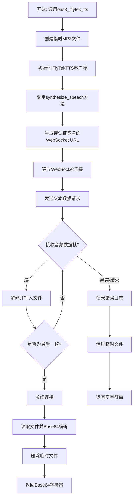
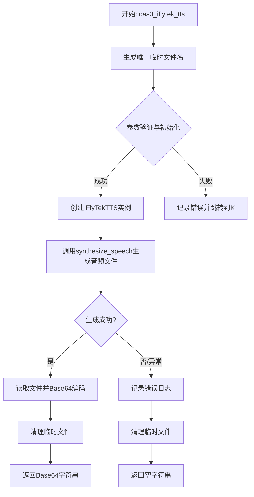
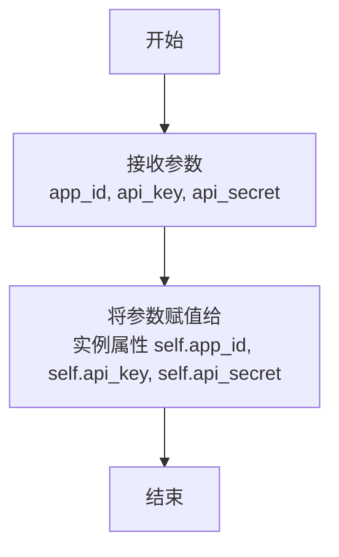
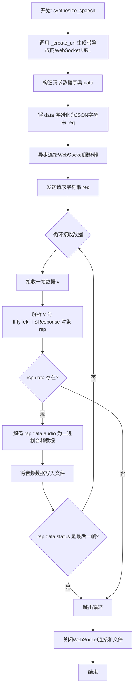
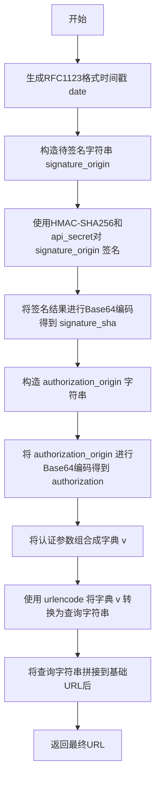

# `.\MetaGPT\metagpt\tools\iflytek_tts.py` 详细设计文档

该代码实现了一个基于iFLYTEK讯飞开放平台WebSocket API的文本转语音(TTS)服务，通过异步WebSocket连接接收音频数据流，将文本合成为MP3格式的音频文件，并最终返回Base64编码的音频数据。

## 整体流程



## 类结构

```
IFlyTekTTS (主服务类)
├── __init__ (构造函数)
├── synthesize_speech (语音合成主方法)
└── _create_url (私有URL生成方法)

IFlyTekTTSStatus (枚举类)
├── STATUS_FIRST_FRAME
├── STATUS_CONTINUE_FRAME
└── STATUS_LAST_FRAME

AudioData (Pydantic模型)
├── audio
├── status
└── ced

IFlyTekTTSResponse (Pydantic模型)
├── code
├── message
├── data
└── sid
```

## 全局变量及字段


### `DEFAULT_IFLYTEK_VOICE`
    
默认的语音合成音色名称，用于指定文本转语音时使用的发音人。

类型：`str`
    


### `IFlyTekTTSStatus.STATUS_FIRST_FRAME`
    
表示接收到的音频数据帧为第一帧的状态枚举值。

类型：`int`
    


### `IFlyTekTTSStatus.STATUS_CONTINUE_FRAME`
    
表示接收到的音频数据帧为中间帧的状态枚举值。

类型：`int`
    


### `IFlyTekTTSStatus.STATUS_LAST_FRAME`
    
表示接收到的音频数据帧为最后一帧的状态枚举值。

类型：`int`
    


### `AudioData.audio`
    
Base64编码的音频数据字符串，包含文本转换后的语音内容。

类型：`str`
    


### `AudioData.status`
    
音频数据帧的状态标识，对应IFlyTekTTSStatus枚举值，指示当前帧的类型。

类型：`int`
    


### `AudioData.ced`
    
音频数据的附加信息字段，具体含义由讯飞TTS API定义，可能包含错误码或扩展数据。

类型：`str`
    


### `IFlyTekTTSResponse.code`
    
API响应状态码，表示请求处理的结果（如成功、失败等）。

类型：`int`
    


### `IFlyTekTTSResponse.message`
    
与状态码对应的详细描述信息，用于解释请求结果。

类型：`str`
    


### `IFlyTekTTSResponse.data`
    
可选的音频数据对象，当请求成功时包含转换后的语音数据。

类型：`Optional[AudioData]`
    


### `IFlyTekTTSResponse.sid`
    
会话标识符，用于唯一标识一次TTS请求会话。

类型：`str`
    


### `IFlyTekTTS.app_id`
    
讯飞开放平台的应用ID，用于认证和标识调用方身份。

类型：`str`
    


### `IFlyTekTTS.api_key`
    
讯飞TTS服务的API密钥，用于接口调用的身份验证。

类型：`str`
    


### `IFlyTekTTS.api_secret`
    
讯飞TTS服务的API密钥对应的密钥，用于生成请求签名。

类型：`str`
    
    

## 全局函数及方法


### `oas3_iflytek_tts`

该函数是科大讯飞（iFLYTEK）文本转语音（TTS）服务的异步接口。它接收文本和认证信息，调用讯飞TTS服务将文本转换为语音，并将生成的MP3音频文件以Base64编码的字符串形式返回。函数内部处理了WebSocket连接、音频数据接收、临时文件管理以及异常处理。

参数：

-  `text`：`str`，需要转换为语音的文本内容。
-  `voice`：`str`，可选，指定语音角色，默认为空字符串（函数内部会使用默认值`xiaoyan`）。
-  `app_id`：`str`，访问讯飞TTS服务所需的应用程序ID。
-  `api_key`：`str`，访问讯飞TTS服务所需的API Key。
-  `api_secret`：`str`，访问讯飞TTS服务所需的API Secret。

返回值：`str`，如果转换成功，返回Base64编码的MP3音频数据字符串；如果发生任何异常，则返回空字符串。

#### 流程图



#### 带注释源码

```python
async def oas3_iflytek_tts(text: str, voice: str = "", app_id: str = "", api_key: str = "", api_secret: str = ""):
    """Text to speech
    For more details, check out:`https://www.xfyun.cn/doc/tts/online_tts/API.html`

    :param voice: Default `xiaoyan`. For more details, checkout: `https://www.xfyun.cn/doc/tts/online_tts/API.html#%E6%8E%A5%E5%8F%A3%E8%B0%83%E7%94%A8%E6%B5%81%E7%A8%8B`
    :param text: The text used for voice conversion.
    :param app_id: Application ID is used to access your iFlyTek service API, see: `https://console.xfyun.cn/services/tts`
    :param api_key: WebAPI argument, see: `https://console.xfyun.cn/services/tts`
    :param api_secret: WebAPI argument, see: `https://console.xfyun.cn/services/tts`
    :return: Returns the Base64-encoded .mp3 file data if successful, otherwise an empty string.

    """
    # 1. 生成一个唯一的临时文件名，用于存储TTS服务返回的音频数据。
    filename = Path(__file__).parent / (uuid.uuid4().hex + ".mp3")
    try:
        # 2. 使用传入的认证参数创建IFlyTekTTS服务客户端实例。
        tts = IFlyTekTTS(app_id=app_id, api_key=api_key, api_secret=api_secret)
        # 3. 调用核心合成方法，将文本转换为语音并保存到临时文件。
        #    注意：`voice`参数若为空，`synthesize_speech`方法内部会使用其默认值`DEFAULT_IFLYTEK_VOICE`（即`xiaoyan`）。
        await tts.synthesize_speech(text=text, output_file=str(filename), voice=voice)
        # 4. 读取生成的音频文件，并将其内容进行Base64编码。
        async with aiofiles.open(str(filename), mode="rb") as reader:
            data = await reader.read()
            base64_string = base64.b64encode(data).decode("utf-8")
    except Exception as e:
        # 5. 如果在上述任何步骤中发生异常，记录错误日志。
        logger.error(f"text:{text}, error:{e}")
        # 6. 发生异常时，将返回值设置为空字符串。
        base64_string = ""
    finally:
        # 7. 无论成功与否，最后都清理掉生成的临时音频文件。
        #    `missing_ok=True`确保如果文件不存在也不会抛出异常。
        filename.unlink(missing_ok=True)
    # 8. 返回结果：成功时为Base64字符串，失败时为空字符串。
    return base64_string
```


### `IFlyTekTTS.__init__`

`IFlyTekTTS` 类的构造函数，用于初始化一个科大讯飞文本转语音（TTS）服务的客户端实例。它接收访问讯飞开放平台API所需的认证凭据，并将其存储为实例属性，供后续的语音合成方法使用。

参数：

-  `app_id`：`str`，应用程序ID，用于标识和访问您在讯飞开放平台创建的TTS服务。详情请见：`https://console.xfyun.cn/services/tts`
-  `api_key`：`str`，WebAPI密钥，用于API身份验证。详情请见：`https://console.xfyun.cn/services/tts`
-  `api_secret`：`str`，WebAPI密钥对应的密钥，用于生成请求签名。详情请见：`https://console.xfyun.cn/services/tts`

返回值：`None`，此方法不返回任何值，仅用于初始化对象状态。

#### 流程图



#### 带注释源码

```python
def __init__(self, app_id: str, api_key: str, api_secret: str):
    """
    :param app_id: Application ID is used to access your iFlyTek service API, see: `https://console.xfyun.cn/services/tts`
    :param api_key: WebAPI argument, see: `https://console.xfyun.cn/services/tts`
    :param api_secret: WebAPI argument, see: `https://console.xfyun.cn/services/tts`
    """
    # 将传入的认证凭据存储为实例变量，供类内其他方法（如 `_create_url` 和 `synthesize_speech`）使用。
    self.app_id = app_id
    self.api_key = api_key
    self.api_secret = api_secret
```


### `IFlyTekTTS.synthesize_speech`

该方法通过连接科大讯飞（iFLYTEK）的WebSocket TTS（文本转语音）API，将输入的文本合成为语音，并将接收到的音频数据流写入到指定的输出文件中。它处理了从建立连接、发送请求、接收分帧音频数据到最终写入文件的完整流程。

参数：

-  `text`：`str`，需要转换为语音的文本内容。
-  `output_file`：`str`，合成语音后保存的本地文件路径。
-  `voice`：`str`，指定语音合成使用的音色，默认为`DEFAULT_IFLYTEK_VOICE`（即`"xiaoyan"`）。

返回值：`None`，该方法不直接返回值，其执行结果是将音频数据写入到`output_file`指定的文件中。

#### 流程图



#### 带注释源码

```python
async def synthesize_speech(self, text, output_file: str, voice=DEFAULT_IFLYTEK_VOICE):
    # 1. 生成带有身份验证参数的WebSocket请求URL
    url = self._create_url()
    # 2. 构造符合API要求的请求数据体
    data = {
        "common": {"app_id": self.app_id},  # 应用ID
        "business": {  # 业务参数
            "aue": "lame",  # 音频编码格式，此处指定为lame（MP3编码器）
            "sfl": 1,  # 流式返回模式
            "auf": "audio/L16;rate=16000",  # 音频采样率及格式
            "vcn": voice,  # 发音人音色
            "tte": "utf8"  # 文本编码格式
        },
        "data": {
            "status": 2,  # 数据状态，2表示最后一帧（对于单次请求）
            "text": str(base64.b64encode(text.encode("utf-8")), "UTF8")  # 将文本进行Base64编码
        },
    }
    # 3. 将数据字典序列化为JSON字符串
    req = json.dumps(data)
    # 4. 异步建立WebSocket连接
    async with websockets.connect(url) as websocket:
        # 5. 发送合成请求
        await websocket.send(req)

        # 6. 以二进制写入模式打开输出文件
        async with aiofiles.open(str(output_file), "wb") as writer:
            # 7. 循环接收服务器返回的数据帧
            while True:
                v = await websocket.recv()  # 接收一帧数据
                # 8. 解析JSON响应并转换为IFlyTekTTSResponse对象
                rsp = IFlyTekTTSResponse(**json.loads(v))
                # 9. 检查响应中是否包含音频数据
                if rsp.data:
                    # 10. 对音频数据进行Base64解码，得到原始的二进制音频数据
                    binary_data = base64.b64decode(rsp.data.audio)
                    # 11. 将解码后的音频数据写入文件
                    await writer.write(binary_data)
                    # 12. 判断当前帧是否为最后一帧，如果不是则继续接收
                    if rsp.data.status != IFlyTekTTSStatus.STATUS_LAST_FRAME.value:
                        continue
                # 13. 如果响应中没有音频数据或已是最后一帧，则跳出接收循环
                break
    # 14. 方法结束，连接和文件通过async with上下文管理器自动关闭
```


### `IFlyTekTTS._create_url`

该方法用于构造一个用于连接 iFLYTEK TTS WebSocket 服务的 URL。它通过生成符合 RFC1123 格式的时间戳，并使用 HMAC-SHA256 算法结合 API Secret 对特定字符串进行签名，最终将认证参数（authorization、date、host）编码并拼接到基础 URL 上，形成一个完整的、带有认证信息的 WebSocket 请求地址。

参数：
-  `self`：`IFlyTekTTS`，IFlyTekTTS 类的实例，用于访问其 `api_key` 和 `api_secret` 字段。

返回值：`str`，一个完整的、带有认证查询参数的 WebSocket URL。

#### 流程图



#### 带注释源码

```python
def _create_url(self):
    """Create request url"""
    # 基础 WebSocket 服务地址
    url = "wss://tts-api.xfyun.cn/v2/tts"
    # 生成符合 RFC1123 格式的当前时间戳，用于请求认证
    now = datetime.now()
    date = format_date_time(mktime(now.timetuple()))

    # 构造用于生成签名的原始字符串，格式遵循特定规范
    signature_origin = "host: " + "ws-api.xfyun.cn" + "\n"
    signature_origin += "date: " + date + "\n"
    signature_origin += "GET " + "/v2/tts " + "HTTP/1.1"
    # 使用 HMAC-SHA256 算法，以 api_secret 为密钥，对 signature_origin 进行加密
    signature_sha = hmac.new(
        self.api_secret.encode("utf-8"), signature_origin.encode("utf-8"), digestmod=hashlib.sha256
    ).digest()
    # 将加密得到的二进制签名进行 Base64 编码，转换为字符串
    signature_sha = base64.b64encode(signature_sha).decode(encoding="utf-8")

    # 构造 Authorization 头的原始值
    authorization_origin = 'api_key="%s", algorithm="%s", headers="%s", signature="%s"' % (
        self.api_key,          # API Key
        "hmac-sha256",         # 使用的算法
        "host date request-line", # 参与签名的头部字段
        signature_sha,         # 上一步计算得到的签名
    )
    # 将 Authorization 原始字符串进行 Base64 编码
    authorization = base64.b64encode(authorization_origin.encode("utf-8")).decode(encoding="utf-8")
    # 将所有需要放在 URL 查询参数中的认证信息组合成字典
    v = {"authorization": authorization, "date": date, "host": "ws-api.xfyun.cn"}
    # 使用 urlencode 将字典转换为 URL 查询字符串格式，并拼接到基础 URL 后面
    url = url + "?" + urlencode(v)
    # 返回最终构造好的完整 URL
    return url
```


## 关键组件


### IFlyTekTTS 类

封装了与讯飞TTS WebSocket API交互的核心逻辑，负责构建认证URL、建立连接、发送文本数据并接收/保存音频流。

### 音频数据帧处理

通过 `IFlyTekTTSStatus` 枚举和 `AudioData` 模型定义了音频流的状态机（首帧、中间帧、尾帧），指导客户端对接收到的二进制音频数据进行顺序写入，直至收到结束帧。

### WebSocket 认证与 URL 构建

使用 HMAC-SHA256 算法，结合 `api_secret`、`api_key` 和当前时间戳生成请求签名，并按照讯飞API规范构建包含认证参数的完整 WebSocket 连接 URL。

### 异步文件 I/O 与资源管理

利用 `aiofiles` 库进行异步文件写入，确保在高并发场景下不会阻塞事件循环。在全局函数 `oas3_iflytek_tts` 中，通过 `try...finally` 块确保生成的临时音频文件无论成功与否都会被清理，避免资源泄漏。

### 外部服务接口适配器 (`oas3_iflytek_tts` 函数)

作为模块对外的统一异步接口，封装了 `IFlyTekTTS` 类的实例化与调用过程，处理输入参数、执行TTS转换、将结果转换为Base64字符串，并提供统一的异常处理和日志记录。


## 问题及建议


### 已知问题

-   **硬编码的API端点与参数**：`_create_url` 方法中，WebSocket URL (`wss://tts-api.xfyun.cn/v2/tts`)、主机名 (`ws-api.xfyun.cn`) 以及业务参数（如 `aue: "lame"`, `sfl: 1`）都是硬编码的。这使得代码难以适应API的变更或配置不同的音频格式、采样率等参数。
-   **缺乏配置验证**：`IFlyTekTTS` 类的构造函数和 `oas3_iflytek_tts` 函数接收 `app_id`, `api_key`, `api_secret` 等关键参数，但未在初始化时进行有效性或非空检查。如果传入无效或空值，错误可能直到网络请求阶段才被发现，导致调试困难。
-   **有限的错误处理与重试机制**：`synthesize_speech` 和 `oas3_iflytek_tts` 函数仅通过一个宽泛的 `except Exception` 捕获错误并记录日志。对于网络波动、认证失败、服务端错误等常见故障，没有实现重试逻辑或更细粒度的异常处理，可能影响服务的健壮性。
-   **临时文件管理风险**：`oas3_iflytek_tts` 函数使用UUID生成临时文件名并保存在当前脚本目录 (`Path(__file__).parent`)。这存在并发冲突风险（极小概率）且未考虑跨平台路径兼容性。虽然使用了 `finally` 块进行清理，但在异常发生时，文件可能因权限等问题而未被成功删除。
-   **同步阻塞的日期生成**：`_create_url` 方法中用于生成签名的日期 (`date`) 使用了 `datetime.now()` 和 `mktime`，这些是同步操作。虽然在当前上下文中影响微乎其微，但在严格异步环境中，使用异步兼容的时间库（如 `asyncio` 配合 `time.time()`）是更佳实践。
-   **资源释放依赖上下文管理器**：`synthesize_speech` 方法中 WebSocket 连接和文件写入都依赖于 `async with` 上下文管理器来确保正确关闭。虽然这是推荐做法，但代码中没有显式处理连接中断或写入失败时可能发生的资源泄漏（尽管上下文管理器通常会处理）。

### 优化建议

-   **将配置参数化**：将API端点、主机名及业务参数（如 `aue`, `auf`, `sfl` 等）提取为类常量或通过构造函数/配置文件传入。这提高了代码的可配置性和可维护性。
-   **增加输入验证**：在 `IFlyTekTTS.__init__` 和 `oas3_iflytek_tts` 函数开始处，添加对必要参数（`app_id`, `api_key`, `api_secret`, `text`）的非空和格式验证。可以使用 `pydantic` 模型进行验证，与现有代码风格保持一致。
-   **增强错误处理与重试**：
    -   将 `except Exception` 替换为更具体的异常捕获，如 `websockets.exceptions.ConnectionClosed`, `aiofiles.IOException`, `json.JSONDecodeError` 等。
    -   为核心网络请求（`websockets.connect`, `websocket.recv`）和文件操作实现带退避策略的重试机制（例如，使用 `tenacity` 库）。
    -   在 `oas3_iflytek_tts` 中，考虑区分“业务逻辑错误”（如API返回错误码）和“系统错误”（如网络问题），并可能向上抛出更具体的异常供调用者处理。
-   **改进临时文件处理**：
    -   使用标准库 `tempfile.NamedTemporaryFile`（注意其在Windows下的删除行为）或 `aiofiles.tempfile`（如果支持异步）来安全地创建和管理临时文件，避免文件名冲突和清理问题。
    -   确保临时文件目录是可写的，并考虑指定一个专用的临时目录而非脚本所在目录。
-   **使用异步友好的时间处理**：在 `_create_url` 中，考虑使用 `time.time()` 获取时间戳，它不涉及系统调用阻塞，更适合异步环境。或者，如果项目有统一的异步时间工具，则使用该工具。
-   **考虑添加连接超时和心跳**：在 `websockets.connect` 中设置 `ping_interval` 和 `ping_timeout` 参数以维持连接活性，并设置 `open_timeout` 防止连接过程无响应。对于长时间的语音合成，这有助于检测并处理僵死的连接。
-   **优化数据模型**：`IFlyTekTTSStatus` 枚举类与 `AudioData.status` 字段关联，但 `AudioData` 模型中的 `status` 类型是 `int`。可以考虑将 `AudioData.status` 的类型注解为 `IFlyTekTTSStatus` 或使用 `Literal` 来增强类型安全性和代码可读性。
-   **提供更灵活的返回方式**：`oas3_iflytek_tts` 函数目前只返回Base64字符串。可以考虑增加一个参数，让调用者选择返回原始字节流、Base64字符串或直接保存到指定路径，增加函数的实用性。
-   **添加日志与监控点**：在关键步骤（如开始合成、收到每一帧数据、合成完成、发生错误）添加更详细的日志记录，便于问题追踪和性能监控。可以记录请求ID (`sid`)、文本长度、合成耗时等信息。


## 其它


### 设计目标与约束

1. **功能目标**：提供一个异步的文本转语音（TTS）服务接口，将输入的文本通过iFLYTEK的WebSocket API转换为音频文件（MP3格式），并最终返回Base64编码的音频数据。
2. **非功能目标**：
    - **可用性**：通过异步I/O（`asyncio`， `websockets`， `aiofiles`）实现高并发处理能力，避免阻塞主线程。
    - **安全性**：遵循iFLYTEK API的认证机制（HMAC-SHA256签名），确保请求的合法性与数据安全。
    - **可维护性**：使用Pydantic模型（`BaseModel`）进行数据验证和序列化，提高代码的健壮性和可读性。
    - **资源管理**：确保临时生成的音频文件在使用后被正确清理，避免磁盘空间泄漏。
3. **约束条件**：
    - 必须依赖iFLYTEK TTS v2 API的WebSocket端点。
    - 输入文本需要先进行Base64编码。
    - 输出音频格式固定为MP3（通过`lame`编码器），采样率为16000Hz。
    - 必须处理API返回的流式音频帧（首帧、中间帧、尾帧）。

### 错误处理与异常设计

1. **异常分类**：
    - **连接与网络异常**：`websockets.exceptions.ConnectionClosed`， `aiohttp.ClientError`等。在`synthesize_speech`和`oas3_iflytek_tts`函数中通过`try-except`捕获，记录错误日志并返回空字符串。
    - **数据验证异常**：`pydantic.ValidationError`。在解析API响应（`IFlyTekTTSResponse(**json.loads(v))`）时可能触发，当前代码未显式处理，会向上层抛出。
    - **文件操作异常**：`OSError`， `IOError`。在读写临时文件时可能发生，在`oas3_iflytek_tts`的`finally`块中确保文件被清理。
2. **错误处理策略**：
    - **降级处理**：当TTS转换失败时，对外接口`oas3_iflytek_tts`返回空字符串（`""`），调用方需检查返回值。
    - **资源清理**：使用`try...finally`结构确保临时文件无论成功与否都会被删除（`filename.unlink(missing_ok=True)`）。
    - **日志记录**：使用项目内部的`logger`记录错误详情（包括触发错误的文本），便于问题追踪。

### 数据流与状态机

1. **主数据流**：
    - **输入**：纯文本字符串。
    - **处理**：
        1. 文本在`IFlyTekTTS`内部被Base64编码。
        2. 与配置参数一起组装成符合iFLYTEK API要求的JSON请求体。
        3. 通过WebSocket发送请求。
    - **输出**：Base64编码的MP3音频数据字符串。
2. **音频帧状态机**（由`IFlyTekTTSStatus`枚举和`AudioData.status`字段定义）：
    - **STATUS_FIRST_FRAME (0)**：接收到的第一个音频数据帧。
    - **STATUS_CONTINUE_FRAME (1)**：接收到的中间音频数据帧。代码逻辑为持续接收并写入文件。
    - **STATUS_LAST_FRAME (2)**：接收到的最后一个音频数据帧。代码逻辑为写入该帧数据后，跳出接收循环，完成本次合成。
    - 该状态机由远程iFLYTEK API驱动，客户端代码根据状态决定是继续接收还是结束会话。

### 外部依赖与接口契约

1. **外部服务依赖**：
    - **iFLYTEK TTS v2 API**：
        - **端点**：`wss://tts-api.xfyun.cn/v2/tts`
        - **认证方式**：基于`api_key`和`api_secret`的HMAC-SHA256签名，签名信息包含在URL的查询参数中。
        - **请求契约**：要求JSON格式的请求体，包含`common`， `business`， `data`三个部分，具体字段见代码`data`字典。
        - **响应契约**：返回JSON格式的流式响应，包含`code`， `message`， `sid`和`data`字段，其中`data`包含Base64编码的音频数据和状态码。
2. **第三方库依赖**：
    - `websockets`：用于建立和维护WebSocket连接。
    - `aiofiles`：用于异步文件读写，避免阻塞事件循环。
    - `pydantic`：用于请求/响应数据的模型定义和验证。
    - 标准库：`base64`， `hashlib`， `hmac`， `json`， `uuid`， `datetime`等。
3. **项目内部依赖**：
    - `metagpt.logs.logger`：用于项目统一的日志记录。

### 配置管理

1. **认证配置**：`app_id`， `api_key`， `api_secret`是访问iFLYTEK服务的核心凭证，通过`IFlyTekTTS`类的构造函数或`oas3_iflytek_tts`函数参数传入。建议在生产环境中从环境变量或配置中心获取，而非硬编码。
2. **合成参数配置**：
    - `voice`：发音人音色，默认值为`xiaoyan`。可通过`business.vcn`参数传递。
    - 音频参数：如编码器(`aue=lame`)，音频格式(`auf`)，文本编码(`tte`)等在代码中硬编码为固定值，与iFLYTEK API的默认业务参数绑定。
3. **临时文件管理**：临时音频文件使用UUID生成唯一名称，存储在当前脚本文件同级目录，并在使用后立即删除。未提供可配置的临时目录路径。

### 并发与生命周期

1. **并发模型**：基于`asyncio`的协程异步模型。主要耗时操作（网络I/O， 文件I/O）均为异步，允许单个进程同时处理多个TTS请求。
2. **对象生命周期**：
    - `IFlyTekTTS`实例：仅封装配置信息，无复杂状态，可重复用于多次`synthesize_speech`调用。
    - WebSocket连接：在`synthesize_speech`方法中，通过`async with websockets.connect(url) as websocket`创建，其生命周期仅限于一次语音合成请求的会话期内。
    - 临时文件：在`oas3_iflytek_tts`函数中创建，在函数返回前（`finally`块中）被删除，生命周期仅限于单次函数调用。
3. **全局函数**：`oas3_iflytek_tts`是一个无状态的工具函数，每次调用都独立创建`IFlyTekTTS`实例和临时文件。


    