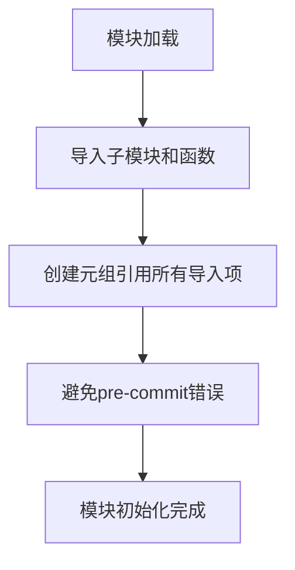

# `.\MetaGPT\metagpt\tools\libs\__init__.py` 详细设计文档

该文件是一个Python包的初始化模块，主要功能是导入和暴露`metagpt.tools.libs`子模块中的各种工具库（如数据处理、特征工程、AI引擎、网页抓取、终端操作等）以及环境管理相关的函数，并通过一个元组引用这些导入来避免代码检查工具（如pre-commit）的警告。

## 整体流程



## 类结构

```
metagpt.tools.libs (工具库包)
├── data_preprocess (数据预处理)
├── feature_engineering (特征工程)
├── sd_engine (SD引擎)
├── gpt_v_generator (GPT-V生成器)
├── web_scraping (网页抓取)
├── terminal (终端操作)
├── editor (编辑器)
├── browser (浏览器)
├── deployer (部署器)
└── git (Git操作)
metagpt.tools.libs.env (环境管理)
├── get_env
├── set_get_env_entry
├── default_get_env
├── get_env_description
└── get_env_default
```

## 全局变量及字段


### `_`
    
一个包含多个导入模块和函数的元组，用于避免代码检查工具（如pre-commit）因未使用的导入而报错。

类型：`tuple`
    


    

## 全局函数及方法


## 关键组件


### 工具库模块导入与组织

该组件负责导入并组织一系列预定义的工具库模块（如数据处理、特征工程、SD引擎、GPT-V生成器等），并通过一个元组引用这些模块以避免代码检查工具（如pre-commit）报错，同时从`env`子模块中导入环境管理相关的函数。

### 环境管理接口

该组件提供了环境配置的接口，包括获取环境变量(`get_env`)、设置环境变量获取入口(`set_get_env_entry`)、获取环境描述(`get_env_description`)以及获取环境默认值(`get_env_default`)等功能，用于支持工具库在不同运行环境下的灵活配置。


## 问题及建议


### 已知问题

-   **导入模块未使用**：代码中导入了多个模块（如 `data_preprocess`, `feature_engineering` 等），但除了将它们赋值给一个元组 `_` 以避免静态检查工具（如 `pre-commit`）报错外，并未在 `__init__.py` 文件中实际使用。这可能导致代码阅读者困惑，不清楚这些导入是必需的还是遗留代码。
-   **注释掉的导入项**：`email_login` 模块被注释掉，这可能表示该功能已被弃用、存在缺陷或正在开发中，但未在代码或文档中说明原因，增加了维护的不确定性。
-   **环境变量管理分散**：从 `metagpt.tools.libs.env` 导入了多个环境变量相关的函数（`get_env`, `set_get_env_entry`, `default_get_env`, `get_env_description`, `get_env_default`），这表明环境配置逻辑可能分散在多个地方，缺乏统一的管理入口，容易导致配置不一致或难以调试。
-   **缺乏明确的公共API定义**：`__init__.py` 文件通常用于定义包的公共接口，但当前代码仅进行了导入和规避错误操作，没有明确导出哪些类、函数或变量是供外部使用的，降低了包的易用性和清晰度。

### 优化建议

-   **清理未使用的导入**：如果这些导入的模块确实不需要在当前 `__init__.py` 中直接使用，应考虑移除它们，或者明确其导入目的（例如，为了触发子模块的初始化）。如果是为了暴露子模块的公共接口，应使用 `__all__` 列表来显式定义。
-   **处理注释代码**：评估 `email_login` 模块的状态。如果已废弃，应删除相关导入和代码；如果暂不可用，应添加 `TODO` 或 `FIXME` 注释说明原因和计划；如果正在开发，应确保其与其他代码的隔离性。
-   **统一环境配置接口**：考虑在 `metagpt.tools.libs.env` 模块中创建一个统一的配置类或函数，封装 `get_env`, `set_get_env_entry` 等操作，提供更简洁、一致的配置访问方式，并完善相关文档。
-   **定义清晰的公共API**：在 `__init__.py` 中使用 `__all__` 变量明确列出希望对外暴露的类、函数和变量。例如，如果希望将 `data_preprocess` 等工具模块以及 `get_env` 等环境函数作为包的主要功能提供，应将其加入 `__all__` 列表。这有助于用户理解包的结构，并方便IDE进行自动补全。
-   **补充模块文档字符串（Docstring）**：在 `__init__.py` 文件顶部添加模块级别的文档字符串，简要说明 `metagpt.tools.libs` 包的主要功能、包含的子模块以及基本的使用方法，提升代码的可读性和可维护性。


## 其它


### 设计目标与约束

本模块 (`metagpt.tools.libs.__init__`) 的核心设计目标是作为一个统一的工具库入口，集中管理和暴露 `metagpt.tools.libs` 包下的所有子模块和关键环境管理函数。其设计遵循了以下约束：
1.  **简化导入**：为用户提供便捷的导入方式，用户只需从 `metagpt.tools.libs` 导入即可访问所有工具，而无需了解内部复杂的子模块结构。
2.  **模块化组织**：保持底层工具（如 `data_preprocess`, `feature_engineering` 等）的独立性和松耦合，`__init__.py` 仅负责聚合，不包含具体业务逻辑。
3.  **环境配置抽象**：通过 `env` 模块提供的函数（如 `get_env`, `set_get_env_entry`），为上层应用提供统一、可配置的环境变量访问接口，支持运行时替换实现。
4.  **兼容性与静默处理**：通过 `_` 变量显式引用所有导入项，旨在规避某些代码质量检查工具（如 `pre-commit`）可能因“未使用导入”而产生的警告或错误，确保代码库的整洁和构建流程的顺畅。

### 错误处理与异常设计

当前 `__init__.py` 文件本身不包含任何业务逻辑，因此没有显式的错误处理或异常抛出机制。其潜在的错误场景和设计如下：
1.  **导入错误**：如果 `from metagpt.tools.libs import (...)` 语句中列出的任何子模块不存在或无法导入，Python 解释器将在模块加载时直接抛出 `ModuleNotFoundError` 或 `ImportError`。这是预期的失败模式，需要开发者在维护模块列表时确保其正确性。
2.  **环境函数错误**：从 `env` 子模块导入的函数（如 `get_env`）可能在内部包含错误处理逻辑（例如，处理缺失的环境变量），但这些异常会在函数被调用时抛出，而非在导入时。本文件仅负责提供访问入口。
3.  **设计原则**：本文件遵循“故障快速暴露”原则，导入期错误应立即终止，以利于早期发现配置或依赖问题。运行时错误则委托给各个具体的工具函数或类去处理。

### 数据流与状态机

本文件作为初始化脚本，不涉及运行时数据流或复杂的状态转换。其数据流是静态的、与Python模块系统绑定的：
1.  **初始化数据流**：当 `metagpt.tools.libs` 包首次被导入时，Python 解释器执行此 `__init__.py`。
2.  **操作**：
    a. **子模块加载**：执行 `from ... import ...` 语句，将指定的子模块和函数加载到当前包 (`metagpt.tools.libs`) 的命名空间中。
    b. **引用保留**：将所有这些导入项赋值给一个元组变量 `_`，确保它们被“使用”，以避免静态检查工具的警告。
3.  **结果状态**：执行完毕后，`metagpt.tools.libs` 包的命名空间包含了所有导入的子模块和函数，可供外部代码直接使用。没有持久化的状态机。

### 外部依赖与接口契约

本模块的依赖和提供的接口如下：
1.  **外部依赖**：
    *   **内部子模块**：强依赖于 `metagpt.tools.libs` 下的 `data_preprocess`, `feature_engineering`, ..., `git`, `env` 等子模块。这些子模块必须存在且可导入。
    *   **Python 环境**：依赖标准的 Python 模块导入机制。
2.  **提供的接口契约**：
    *   **包级属性**：本文件执行后，`metagpt.tools.libs` 包对象将直接拥有所有导入的子模块和函数作为其属性。例如，用户可以通过 `metagpt.tools.libs.data_preprocess` 访问数据预处理工具，通过 `metagpt.tools.libs.get_env` 访问环境变量。
    *   **隐式契约**：承诺导入列表中公开的模块和函数是稳定、可用的公共API的一部分。任何从此列表中的移除都应视为破坏性变更。
    *   **`env` 模块函数契约**：`get_env`, `set_get_env_entry`, `default_get_env`, `get_env_description`, `get_env_default` 提供了操作运行时环境配置的接口，其具体行为由 `env` 子模块的实现定义，本文件仅负责转发。

### 配置管理

本模块自身没有配置文件。其核心的“配置”体现在代码硬编码的导入列表中。然而，它通过导入 `env` 模块，为整个工具库提供了环境配置的管理入口：
1.  **静态配置**：需要暴露哪些工具子模块，是通过编辑 `__init__.py` 中的导入列表来管理的。这是一个源代码级别的配置。
2.  **动态配置桥梁**：通过暴露 `set_get_env_entry` 和 `default_get_env` 等函数，允许上层应用在运行时动态修改或设置环境变量获取策略（例如，从不同来源如文件、命令行、远程配置中心读取）。这使得工具库的行为可以在不修改代码的情况下进行配置。
3.  **环境描述**：`get_env_description` 函数可能用于获取环境变量的元信息（如描述、默认值），辅助生成配置文档或用户界面。

### 安全考虑

当前 `__init__.py` 文件内容简单，安全风险较低，主要考虑以下几点：
1.  **导入安全**：导入的模块均为项目内部的、受信任的代码模块。不存在动态导入或从不可信源导入代码的风险。
2.  **暴露面管理**：本文件决定了哪些内部工具对包外部可见。需要谨慎评估添加到导入列表中的模块，避免意外暴露内部或实验性接口，增大攻击面。
3.  **环境变量安全**：通过 `env` 模块管理的环境变量可能包含敏感信息（如API密钥、数据库密码）。`get_env` 等函数的安全责任在于其具体实现，应确保在生产环境中不会通过日志、错误信息等方式泄露敏感配置。本文件仅提供访问路径。
4.  **代码检查规避**：使用 `_ = (...)` 来规避 `pre-commit` 检查是一种实践技巧，但需确保团队理解其意图，避免被误认为是无用代码而被清理。

    