# `.\MetaGPT\metagpt\tools\libs\browser.py` 详细设计文档

该文件定义了一个基于 Playwright 的异步 Web 浏览器工具类 `Browser`，用于自动化网页浏览和交互。它封装了启动/停止浏览器、导航、点击、输入、滚动等常见操作，并通过辅助功能树（accessibility tree）来定位和操作页面元素，同时集成了页面状态监控和报告功能，旨在为 AI 代理（如 MetaGPT）提供结构化的网页交互能力。

## 整体流程

```mermaid
graph TD
    A[用户调用 Browser 方法] --> B{浏览器已启动?}
    B -- 否 --> C[调用 start 方法]
    C --> D[启动 Playwright 和 Chromium]
    D --> E[创建新页面]
    E --> F[注册页面事件监听器]
    B -- 是 --> F
    F --> G[执行具体操作 (如 goto, click)]
    G --> H[调用 _wait_page]
    H --> I[等待页面空闲]
    I --> J[获取并更新辅助功能树]
    J --> K[报告页面状态]
    K --> L[返回操作结果]
```

## 类结构

```
Browser (Pydantic BaseModel)
├── 字段 (Fields)
├── 公共方法 (Public Methods)
│   ├── start
│   ├── stop
│   ├── click
│   ├── type
│   ├── hover
│   ├── press
│   ├── scroll
│   ├── goto
│   ├── go_back
│   ├── go_forward
│   ├── tab_focus
│   ├── close_tab
│   ├── view
│   ├── __aenter__
│   └── __aexit__
└── 私有方法 (Private Methods)
    ├── _wait_page
    ├── _register_page_event
    ├── _wait_until_page_idle
    ├── _update_page_last_busy_time
    ├── _on_page_request
    ├── _on_page_requestfinished
    └── _on_frame_change
```

## 全局变量及字段


### `Browser.playwright`
    
Playwright 库的主入口点，用于管理浏览器实例的生命周期。

类型：`Optional[Playwright]`
    


### `Browser.browser_instance`
    
由 Playwright 启动的浏览器实例（如 Chromium），是执行所有网页操作的基础。

类型：`Optional[Browser_]`
    


### `Browser.browser_ctx`
    
浏览器上下文，提供独立的会话（如 cookies、本地存储），用于管理多个标签页。

类型：`Optional[BrowserContext]`
    


### `Browser.page`
    
当前活动的浏览器标签页，是执行网页导航和交互操作的主要对象。

类型：`Optional[Page]`
    


### `Browser.accessibility_tree`
    
存储当前页面的可访问性树（A11y Tree），用于辅助定位和操作页面元素。

类型：`list`
    


### `Browser.headless`
    
控制浏览器是否以无头模式运行（不显示图形界面），默认为 True 以提高性能。

类型：`bool`
    


### `Browser.proxy`
    
代理服务器配置，从环境变量自动获取，用于网络请求的代理设置。

类型：`Optional[dict]`
    


### `Browser.is_empty_page`
    
标识当前页面是否为空（未加载任何 URL），用于状态管理和初始化判断。

类型：`bool`
    


### `Browser.reporter`
    
浏览器操作报告器，用于记录和报告导航、页面加载等关键事件。

类型：`BrowserReporter`
    
    

## 全局函数及方法

### `Browser.start`

启动 Playwright 并启动一个浏览器实例。如果 `playwright` 属性为 `None`，则初始化 Playwright、启动 Chromium 浏览器、创建新的浏览器上下文和页面。

参数：
- 无显式参数。

返回值：`None`，无返回值。

#### 流程图

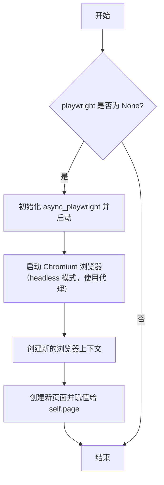

#### 带注释源码

```python
async def start(self) -> None:
    """Starts Playwright and launches a browser"""
    # 检查 Playwright 实例是否存在，如果不存在则进行初始化
    if self.playwright is None:
        # 启动 Playwright 异步上下文管理器，获取 Playwright 实例
        self.playwright = playwright = await async_playwright().start()
        # 使用 Playwright 启动一个 Chromium 浏览器实例
        # headless 参数控制是否以无头模式运行，proxy 参数设置代理
        browser = self.browser_instance = await playwright.chromium.launch(headless=self.headless, proxy=self.proxy)
        # 在浏览器中创建一个新的上下文（类似于一个独立的浏览器会话）
        browser_ctx = self.browser_ctx = await browser.new_context()
        # 在上下文中创建一个新的页面（标签页），并将其赋值给实例的 page 属性
        self.page = await browser_ctx.new_page()
```

### `Browser.stop`

停止Playwright浏览器实例并清理相关资源。

参数：无

返回值：无

#### 流程图

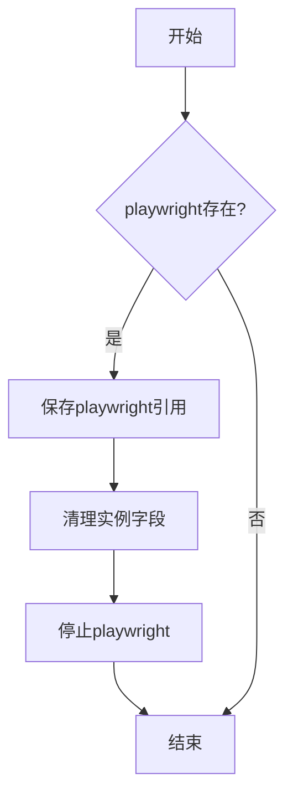

#### 带注释源码

```python
async def stop(self):
    # 检查playwright实例是否存在
    if self.playwright:
        # 保存当前playwright引用到局部变量
        playwright = self.playwright
        # 清理所有实例字段，防止重复关闭
        self.playwright = None
        self.browser_instance = None
        self.browser_ctx = None
        # 停止playwright，这会关闭所有浏览器实例
        await playwright.stop()
```

### `Browser.click`

该方法用于在网页上点击指定ID的元素。它首先通过元素ID获取对应的后端节点ID，然后调用底层工具执行点击操作，最后等待页面加载完成并更新可访问性树。

参数：

- `element_id`：`int`，要点击的元素的ID

返回值：`str`，返回操作成功信息及当前页面的URL

#### 流程图

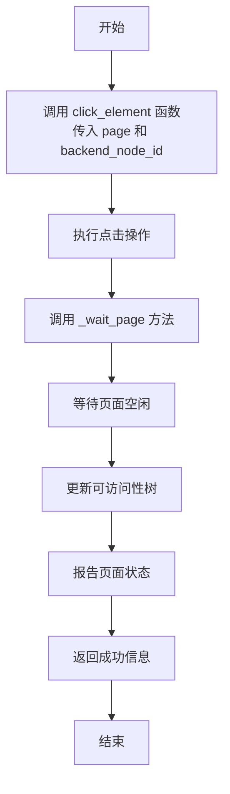

#### 带注释源码

```python
async def click(self, element_id: int):
    """clicks on an element with a specific id on the webpage."""
    # 通过元素ID从可访问性树中获取对应的后端节点ID
    await click_element(self.page, get_backend_node_id(element_id, self.accessibility_tree))
    # 等待页面加载完成并返回结果
    return await self._wait_page()
```

### `Browser.type`

该方法用于在网页上指定ID的输入元素中输入文本内容，并可选择在输入后模拟按下回车键。

参数：

- `element_id`：`int`，目标输入元素在无障碍树中的唯一标识符。
- `content`：`str`，需要输入到目标元素中的文本内容。
- `press_enter_after`：`bool`，指示是否在输入文本后模拟按下回车键，默认为`False`。

返回值：`str`，操作成功后的状态信息，格式为"SUCCESS, URL: {page.url} have been loaded."，其中`{page.url}`是当前页面的URL。

#### 流程图

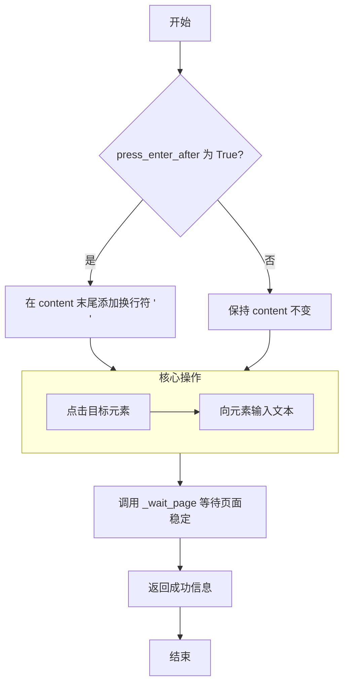

#### 带注释源码

```python
async def type(self, element_id: int, content: str, press_enter_after: bool = False):
    """Use this to type the content into the field with id."""
    # 1. 处理回车键逻辑：如果参数 press_enter_after 为 True，则在输入文本末尾添加换行符 '\n'
    if press_enter_after:
        content += "\n"
    # 2. 点击目标元素：通过 element_id 在无障碍树中找到对应的后端节点ID，并执行点击操作
    await click_element(self.page, get_backend_node_id(element_id, self.accessibility_tree))
    # 3. 输入文本：将处理后的 content 文本输入到已聚焦的元素中
    await type_text(self.page, content)
    # 4. 等待页面稳定并返回结果：调用内部方法 _wait_page 等待页面加载/网络请求完成，并返回成功信息
    return await self._wait_page()
```


### `Browser.hover`

将鼠标悬停在网页上指定ID的元素上。该方法首先通过元素ID获取对应的后端节点ID，然后调用底层工具函数执行悬停操作，最后等待页面进入空闲状态并更新可访问性树。

参数：

- `element_id`：`int`，要悬停的元素的唯一标识符。该ID对应于当前页面可访问性树中的节点ID。

返回值：`str`，返回一个字符串，格式为"SUCCESS, URL: {page.url} have been loaded."，表示操作成功并提供了当前页面的URL。

#### 流程图

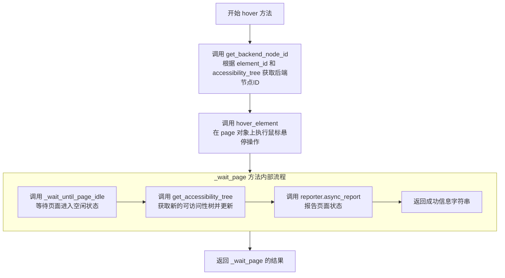

#### 带注释源码

```python
async def hover(self, element_id: int):
    """Hover over an element with id."""
    # 1. 根据前端元素ID和当前页面的可访问性树，获取对应的Playwright后端节点ID。
    backend_node_id = get_backend_node_id(element_id, self.accessibility_tree)
    # 2. 调用底层工具函数，在当前的Page对象上执行鼠标悬停操作。
    await hover_element(self.page, backend_node_id)
    # 3. 调用内部等待方法，确保页面加载/网络请求完成，并更新可访问性树和报告器。
    #    最终返回一个包含成功状态和当前URL的字符串。
    return await self._wait_page()
```


### `Browser.press`

模拟在键盘上按下组合键（例如 Ctrl+v）。

参数：

- `key_comb`：`str`，要模拟按下的键盘按键组合字符串。

返回值：`str`，返回一个表示操作成功的字符串，格式为 `"SUCCESS, URL: {page.url} have been loaded."`，其中 `{page.url}` 是当前页面的 URL。

#### 流程图

```mermaid
flowchart TD
    A[开始: Browser.press(key_comb)] --> B[调用 key_press(page, key_comb)]
    B --> C[调用 _wait_page 方法]
    C --> D[调用 _wait_until_page_idle(page)]
    D --> E{页面是否空闲?}
    E -- 否 --> F[等待100毫秒]
    F --> E
    E -- 是 --> G[获取页面可访问性树<br>get_accessibility_tree(page)]
    G --> H[更新实例的 accessibility_tree 字段]
    H --> I[报告页面状态<br>reporter.async_report(page, "page")]
    I --> J[返回成功信息]
    J --> K[结束]
```

#### 带注释源码

```python
async def press(self, key_comb: str):
    """Simulates the pressing of a key combination on the keyboard (e.g., Ctrl+v)."""
    # 调用 key_press 工具函数，向当前页面发送指定的按键组合
    await key_press(self.page, key_comb)
    # 调用内部等待页面加载完成的方法，并返回操作结果
    return await self._wait_page()
```

### `Browser.scroll`

滚动当前浏览器页面向上或向下。

参数：

- `direction`：`Literal["down", "up"]`，滚动方向，只能是 "down"（向下）或 "up"（向上）。

返回值：`str`，返回一个成功消息字符串，格式为 "SUCCESS, URL: {page.url} have been loaded."，其中 `{page.url}` 是滚动后页面的URL。

#### 流程图

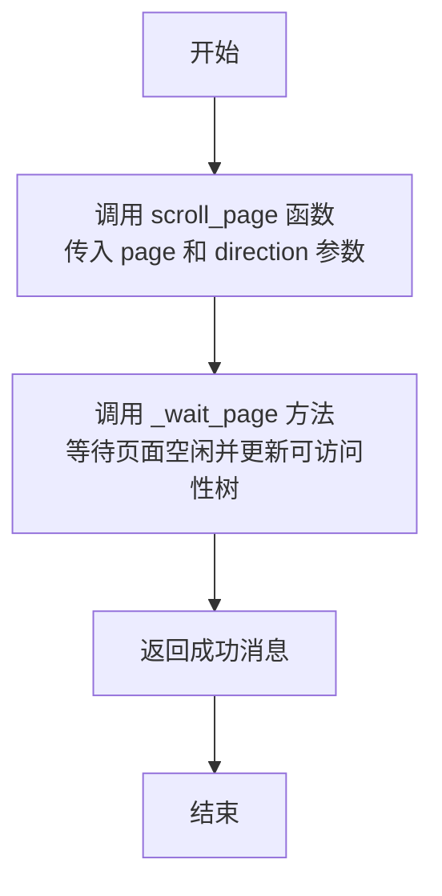

#### 带注释源码

```python
async def scroll(self, direction: Literal["down", "up"]):
    """Scroll the page up or down."""
    # 调用 scroll_page 函数，传入当前页面对象和滚动方向，执行页面滚动
    await scroll_page(self.page, direction)
    # 调用 _wait_page 方法，等待页面空闲、更新可访问性树并返回成功消息
    return await self._wait_page()
```

### `Browser.goto`

导航到指定的URL，并等待页面加载完成。

参数：

- `url`：`str`，要导航到的目标URL
- `timeout`：`float`，页面加载超时时间，默认为90000毫秒

返回值：`str`，返回加载成功信息，格式为"SUCCESS, URL: {page.url} have been loaded."

#### 流程图

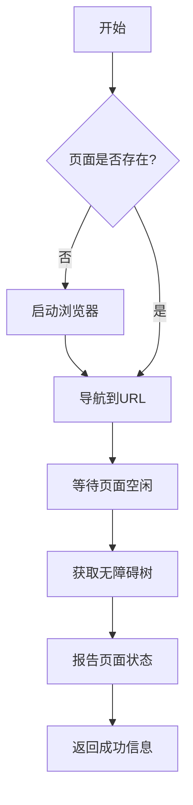

#### 带注释源码

```python
async def goto(self, url: str, timeout: float = 90000):
    """Navigate to a specific URL."""
    # 如果页面不存在，先启动浏览器
    if self.page is None:
        await self.start()
    
    # 使用报告器记录URL访问
    async with self.reporter as reporter:
        await reporter.async_report(url, "url")
        
        # 导航到指定URL，设置超时时间
        await self.page.goto(url, timeout=timeout)
        
        # 标记页面为非空状态
        self.is_empty_page = False
        
        # 等待页面加载完成并返回结果
        return await self._wait_page()
```

### `Browser.go_back`

该方法用于在浏览器中导航到上一个访问过的页面（即执行“后退”操作）。它调用底层 Playwright 页面的 `go_back` 方法，然后等待页面进入空闲状态，并更新可访问性树和报告器。

参数：
- 无

返回值：`str`，返回一个字符串，指示操作成功以及当前页面的 URL。

#### 流程图

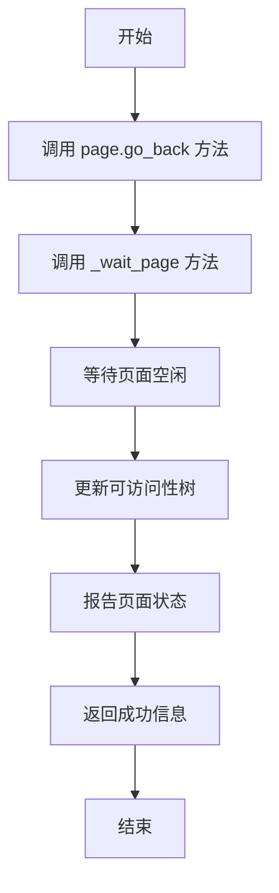

#### 带注释源码

```python
async def go_back(self):
    """Navigate to the previously viewed page."""
    # 调用 Playwright Page 对象的 go_back 方法，执行浏览器后退操作
    await self.page.go_back()
    # 调用内部方法 _wait_page，等待页面加载完成并更新状态
    return await self._wait_page()
```


### `Browser.go_forward`

该方法用于在浏览器历史记录中向前导航，即导航到执行过`go_back`操作后的下一个页面。它是浏览器基本导航功能的一部分。

参数：
-  `self`：`Browser`，`Browser`类的实例，代表当前浏览器会话。

返回值：`str`，返回一个表示操作成功的字符串，格式为`"SUCCESS, URL: {page.url} have been loaded."`，其中`{page.url}`是导航后页面的URL。

#### 流程图

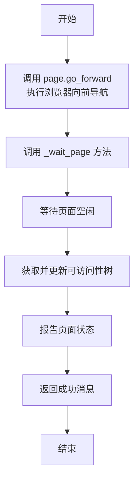

#### 带注释源码

```python
async def go_forward(self):
    """Navigate to the next page (if a previous 'go_back' action was performed)."""
    # 调用 Playwright Page 对象的 go_forward 方法，执行浏览器向前导航。
    await self.page.go_back()
    # 调用内部方法 _wait_page，该方法会等待页面加载完成、更新内部状态并返回成功消息。
    return await self._wait_page()
```


### `Browser.tab_focus`

将浏览器上下文（`BrowserContext`）中指定索引的页面（标签页）切换到前台，使其成为当前活动的标签页。

参数：

- `page_number`：`int`，要切换到前台的页面的索引号（从0开始）。

返回值：`str`，返回一个字符串，格式为 `"SUCCESS, URL: {page.url} have been loaded."`，表示操作成功并加载了目标页面的URL。

#### 流程图

```mermaid
flowchart TD
    A[开始: Browser.tab_focus(page_number)] --> B{检查 browser_ctx 是否存在?}
    B -- 是 --> C[从 browser_ctx.pages 列表中<br>获取指定索引的 Page 对象]
    C --> D[调用 page.bring_to_front()<br>将该页面切换到前台]
    D --> E[调用 _wait_page() 方法<br>等待页面加载完成并更新状态]
    E --> F[返回成功信息字符串]
    B -- 否 --> G[流程结束<br>（实际代码中，browser_ctx 应在 start() 中初始化）]
```

#### 带注释源码

```python
async def tab_focus(self, page_number: int):
    """Open a new, empty browser tab."""
    # 1. 从浏览器上下文（browser_ctx）的页面列表中，根据传入的索引 page_number 获取对应的 Page 对象。
    page = self.browser_ctx.pages[page_number]
    # 2. 调用 Page 对象的 bring_to_front() 方法，将该标签页切换到浏览器窗口的前台，使其成为活动标签页。
    await page.bring_to_front()
    # 3. 调用内部的 _wait_page() 方法。该方法会：
    #    a. 等待页面进入空闲状态（例如，网络请求完成）。
    #    b. 获取并更新当前页面的无障碍访问树（accessibility_tree）。
    #    c. 通过 reporter 报告页面状态。
    #    d. 返回一个格式化的成功字符串，其中包含当前页面的 URL。
    return await self._wait_page()
```

### `Browser.close_tab`

关闭当前活动的浏览器标签页。如果关闭后仍有其他标签页存在，则将最后一个标签页设置为活动页；如果没有其他标签页，则创建一个新的空白标签页并设置为活动页。

参数：
- 无

返回值：`str`，操作成功后的状态信息字符串，格式为 `"SUCCESS, URL: {page.url} have been loaded."`，其中 `{page.url}` 是新活动页面的 URL。

#### 流程图

```mermaid
flowchart TD
    A[开始: close_tab] --> B[关闭当前活动页面 self.page]
    B --> C{检查剩余页面数量<br>len(self.browser_ctx.pages) > 0?}
    C -- 是 --> D[将最后一个页面<br>self.browser_ctx.pages[-1] 设为新活动页]
    C -- 否 --> E[创建一个新的空白页面<br>await self.browser_ctx.new_page()]
    E --> F[将新页面设为活动页<br>并标记 is_empty_page 为 True]
    D --> G[调用 _wait_page 方法<br>等待页面空闲并更新辅助功能树]
    F --> G
    G --> H[返回成功信息]
    H --> I[结束]
```

#### 带注释源码

```python
async def close_tab(self):
    """Close the currently active tab."""
    # 1. 关闭当前活动的页面对象
    await self.page.close()
    # 2. 检查浏览器上下文中是否还有其他页面
    if len(self.browser_ctx.pages) > 0:
        # 2.1 如果还有其他页面，将最后一个页面（列表末尾）设置为新的活动页
        self.page = self.browser_ctx.pages[-1]
    else:
        # 2.2 如果没有其他页面，创建一个新的空白页面
        self.page = await self.browser_ctx.new_page()
        # 2.3 标记新页面为空页面
        self.is_empty_page = True
    # 3. 调用内部方法等待新页面加载完成，更新辅助功能树，并返回成功信息
    return await self._wait_page()
```

### `Browser._wait_page`

该方法用于在页面执行操作（如点击、导航、输入等）后，等待页面进入空闲状态，然后获取页面的无障碍访问树并报告页面状态，最后返回成功信息。

参数：

- 无显式参数。该方法是一个实例方法，通过`self`访问当前`Browser`实例的状态。

返回值：`str`，返回一个表示操作成功的字符串，格式为`"SUCCESS, URL: {page.url} have been loaded."`，其中`{page.url}`是当前页面的URL。

#### 流程图

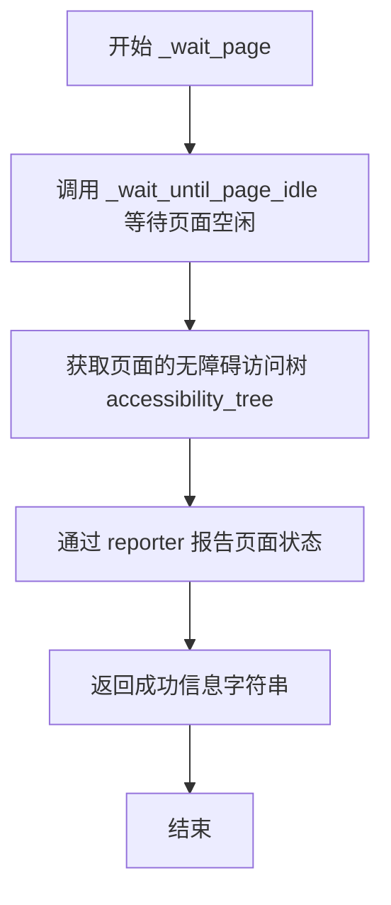

#### 带注释源码

```python
async def _wait_page(self):
    # 获取当前浏览器页面对象
    page = self.page
    # 等待页面进入空闲状态（即没有正在进行的网络请求或DOM变化）
    await self._wait_until_page_idle(page)
    # 获取当前页面的无障碍访问树，并更新到实例变量中
    self.accessibility_tree = await get_accessibility_tree(page)
    # 使用报告器记录当前页面状态
    await self.reporter.async_report(page, "page")
    # 返回操作成功的消息，包含当前页面的URL
    return f"SUCCESS, URL: {page.url} have been loaded."
```

### `Browser._register_page_event`

该方法用于为给定的Playwright Page对象注册一系列事件监听器，以跟踪页面的活动状态（如加载、请求、框架变化等），从而辅助判断页面何时进入“空闲”状态。

参数：

- `page`：`Page`，需要注册事件监听器的Playwright Page对象。

返回值：`None`，该方法不返回任何值。

#### 流程图

```mermaid
graph TD
    A[开始: _register_page_event(page)] --> B[初始化 page.last_busy_time 为当前时间];
    B --> C[初始化 page.requests 为空集合];
    C --> D[注册事件监听器: domcontentloaded];
    D --> E[注册事件监听器: load];
    E --> F[注册事件监听器: request];
    F --> G[注册事件监听器: requestfailed];
    G --> H[注册事件监听器: requestfinished];
    H --> I[注册事件监听器: frameattached];
    I --> J[注册事件监听器: framenavigated];
    J --> K[结束];
```

#### 带注释源码

```python
def _register_page_event(self, page: Page):
    # 初始化页面的最后活跃时间戳为当前时间
    page.last_busy_time = time.time()
    # 初始化一个集合，用于跟踪该页面上进行中的网络请求
    page.requests = set()
    # 注册事件监听器：当DOM内容加载完成时，更新页面的最后活跃时间
    page.on("domcontentloaded", self._update_page_last_busy_time)
    # 注册事件监听器：当页面完全加载时，更新页面的最后活跃时间
    page.on("load", self._update_page_last_busy_time)
    # 注册事件监听器：当页面发起新的网络请求时，将请求加入跟踪集合并更新活跃时间
    page.on("request", self._on_page_request)
    # 注册事件监听器：当页面请求失败时，从跟踪集合中移除该请求
    page.on("requestfailed", self._on_page_requestfinished)
    # 注册事件监听器：当页面请求成功完成时，从跟踪集合中移除该请求
    page.on("requestfinished", self._on_page_requestfinished)
    # 注册事件监听器：当有新的框架（iframe）附加到页面时，更新页面的最后活跃时间
    page.on("frameattached", self._on_frame_change)
    # 注册事件监听器：当页面内的框架完成导航时，更新页面的最后活跃时间
    page.on("framenavigated", self._on_frame_change)
```

### `Browser._wait_until_page_idle`

该方法用于等待页面进入空闲状态。它通过监听页面事件（如DOM加载、请求等）来更新页面的“最后繁忙时间”，然后循环检查，直到页面在指定时间窗口内没有新的活动，从而判断页面已加载完成或达到稳定状态。

参数：

- `page`：`Page`，Playwright的Page对象，代表当前操作的浏览器标签页。

返回值：`None`，无返回值。

#### 流程图

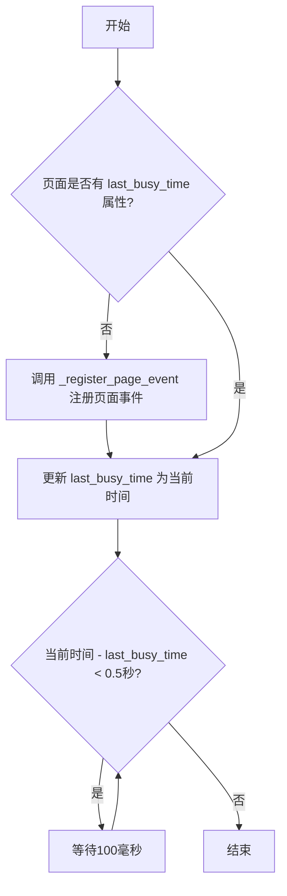

#### 带注释源码

```python
async def _wait_until_page_idle(self, page) -> None:
    # 检查页面对象是否已经注册了事件监听器（通过检查是否有 last_busy_time 属性）
    if not hasattr(page, "last_busy_time"):
        # 如果没有，则调用 _register_page_event 方法为页面注册相关事件监听器
        # 这些事件包括：DOM加载完成、页面加载完成、请求开始、请求结束、框架变化等
        self._register_page_event(page)
    else:
        # 如果已经注册过，则更新页面的“最后繁忙时间”为当前时间
        # 这表示一个新的操作或事件刚刚发生，重置空闲计时器
        page.last_busy_time = time.time()
    # 进入循环，检查页面是否在最近0.5秒内处于繁忙状态
    while time.time() - page.last_busy_time < 0.5:
        # 如果页面在0.5秒内有活动（last_busy_time被更新），则等待100毫秒后再次检查
        # 这避免了CPU空转，同时给了页面处理事件的时间
        await page.wait_for_timeout(100)
    # 当页面在0.5秒内没有新的活动（即 time.time() - last_busy_time >= 0.5）时，
    # 循环结束，方法返回，表示页面已进入空闲状态
```

### `Browser._update_page_last_busy_time`

该方法是一个私有的事件处理函数，用于在浏览器页面（Page）触发特定事件（如DOM内容加载完成、页面加载完成、网络请求、框架变化等）时，更新该页面的 `last_busy_time` 属性。这个时间戳记录了页面最后一次“繁忙”的时刻，是 `_wait_until_page_idle` 方法判断页面是否进入空闲状态的核心依据。

参数：

- `page`：`Page`，一个 Playwright 的 Page 对象，代表当前正在操作的浏览器标签页。

返回值：`None`，此方法不返回任何值，仅更新传入 Page 对象的属性。

#### 流程图

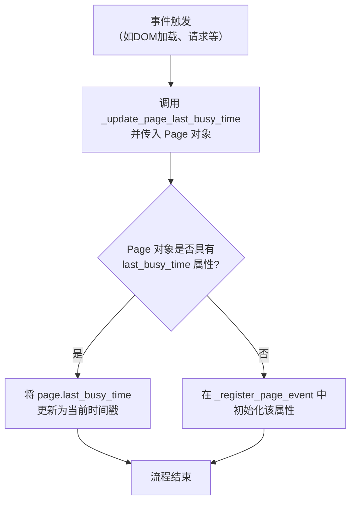

#### 带注释源码

```python
async def _update_page_last_busy_time(self, page: Page):
    # 将传入的 Page 对象的 `last_busy_time` 属性更新为当前时间。
    # 这个属性在 `_wait_until_page_idle` 方法中被用来计算页面是否已空闲（即超过0.5秒无活动）。
    page.last_busy_time = time.time()
```

### `Browser._on_page_request`

该方法用于处理页面请求事件。当页面发起新的网络请求时，此方法会被触发，其主要功能是更新页面的“最后繁忙时间”并跟踪该请求。

参数：

- `request`：`Request`，表示触发了该事件的网络请求对象。

返回值：`None`，此方法不返回任何值。

#### 流程图

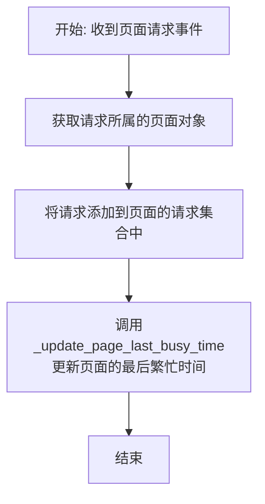

#### 带注释源码

```python
async def _on_page_request(self, request: Request):
    # 从请求对象中获取其所属的页面（Page）对象
    page = request.frame.page
    # 将该请求添加到页面的请求集合（requests）中，用于跟踪进行中的请求
    page.requests.add(request)
    # 调用内部方法，更新页面的“最后繁忙时间”为当前时间
    await self._update_page_last_busy_time(page)
```

### `Browser._on_page_requestfinished`

该方法是一个异步事件处理器，用于在页面（Page）的 `requestfinished` 事件触发时被调用。其主要功能是清理已完成的网络请求，将其从页面的待处理请求集合中移除，以帮助判断页面是否处于空闲状态。

参数：

- `request`：`Request`，表示已完成（无论是成功还是失败）的HTTP请求对象。

返回值：`None`，此方法不返回任何值。

#### 流程图

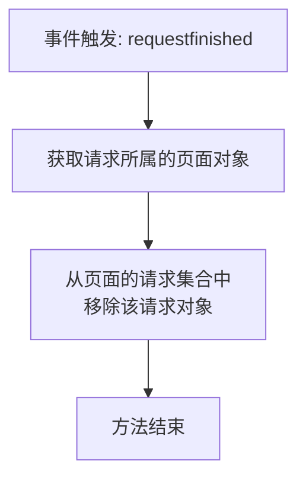

#### 带注释源码

```python
async def _on_page_requestfinished(self, request: Request):
    # 从请求对象中获取其所属的页面（Page）对象
    # 然后从该页面的 `requests` 集合中移除（discard）这个已完成的请求
    # `discard` 方法在元素不存在时不会报错，比 `remove` 更安全
    request.frame.page.requests.discard(request)
```

### `Browser._on_frame_change`

该方法是一个事件处理器，用于响应页面中框架（iframe）的附加（`frameattached`）或导航（`framenavigated`）事件。当这些事件发生时，它会更新所属页面的“最后繁忙时间”戳，以辅助判断页面是否处于空闲状态。

参数：

- `frame`：`Frame`，触发事件的框架对象。该参数由Playwright的事件系统自动传入。

返回值：`None`，此方法不返回任何值。

#### 流程图

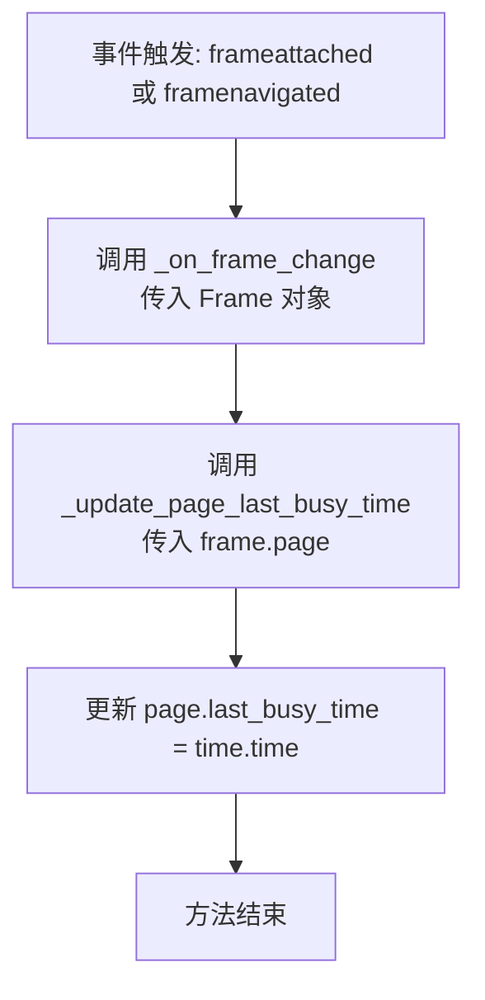

#### 带注释源码

```python
async def _on_frame_change(self, frame: Frame):
    # 当页面中的框架（iframe）被附加或导航时，Playwright会触发此事件。
    # 该方法作为事件监听器被调用，传入触发事件的框架对象。
    await self._update_page_last_busy_time(frame.page)  # 调用内部方法，更新该框架所属页面的“最后繁忙时间”戳。
    # 此操作有助于 `_wait_until_page_idle` 方法判断页面网络活动是否已停止。
```

### `Browser.view`

`Browser.view` 方法用于获取当前浏览器页面的可访问性树解析结果，并以格式化字符串的形式返回当前页面的URL和观察到的内容。它不执行任何页面操作，仅用于查看当前页面的状态。

参数：无

返回值：`str`，返回一个格式化的字符串，包含当前页面的URL和从可访问性树解析出的观察内容。

#### 流程图

```mermaid
flowchart TD
    A[开始] --> B[调用 parse_accessibility_tree<br>解析 self.accessibility_tree]
    B --> C[格式化字符串<br>包含 URL 和解析结果]
    C --> D[返回格式化字符串]
    D --> E[结束]
```

#### 带注释源码

```python
async def view(self):
    # 解析当前实例中存储的可访问性树（accessibility_tree）
    # parse_accessibility_tree 函数将树结构转换为可读的文本或结构化数据
    observation = parse_accessibility_tree(self.accessibility_tree)
    
    # 返回一个格式化的字符串，包含当前页面的URL和解析出的观察内容
    # 格式为：
    # Current Browser Viewer
    # URL: {self.page.url}
    # OBSERVATION:
    # {observation[0]}
    # 
    # 其中 observation[0] 是 parse_accessibility_tree 返回结果的第一部分（通常是主要观察内容）
    return f"Current Browser Viewer\n URL: {self.page.url}\nOBSERVATION:\n{observation[0]}\n"
```

### `Browser.__aenter__`

该方法实现了异步上下文管理器的入口协议，用于在进入 `async with` 代码块时自动启动浏览器实例。它确保在使用浏览器工具前，Playwright 和浏览器实例已正确初始化。

参数：

- `self`：`Browser`，`Browser` 类的当前实例。

返回值：`Browser`，返回已启动的 `Browser` 实例自身，以便在 `async with` 代码块中使用。

#### 流程图

```mermaid
flowchart TD
    A[开始: 进入 async with 代码块] --> B{playwright 是否为 None?}
    B -- 是 --> C[调用 async_playwright().start()<br>启动 Playwright]
    C --> D[使用 playwright.chromium.launch<br>启动 Chromium 浏览器]
    D --> E[创建新的浏览器上下文]
    E --> F[在新上下文中创建新页面]
    F --> G[将启动的组件赋值给实例字段]
    G --> H[返回 self]
    B -- 否 --> I[直接返回 self]
    I --> H
```

#### 带注释源码

```python
async def __aenter__(self):
    # 调用 start 方法，确保 Playwright 和浏览器实例已启动。
    # 如果 playwright 字段为 None，start 方法会初始化 Playwright、浏览器实例、上下文和页面。
    await self.start()
    # 返回当前 Browser 实例，使其可在 `async with` 代码块中被引用和使用。
    return self
```

### `Browser.__aexit__`

该方法作为异步上下文管理器的退出方法，用于在退出`with`块时自动清理和停止浏览器实例及其相关资源。它确保浏览器被正确关闭，释放系统资源，防止资源泄漏。

参数：

- `self`：`Browser`，当前`Browser`类的实例。
- `*args`：`tuple`，捕获任何位置参数（通常用于异常信息，但在此方法中未使用）。
- `**kwargs`：`dict`，捕获任何关键字参数（通常用于异常信息，但在此方法中未使用）。

返回值：`None`，该方法不返回任何值。

#### 流程图

```mermaid
flowchart TD
    A[开始 __aexit__] --> B{playwright 实例存在?}
    B -- 是 --> C[调用 stop 方法]
    C --> D[清理实例变量<br>playwright, browser_instance, browser_ctx]
    D --> E[停止 Playwright 进程]
    E --> F[结束]
    B -- 否 --> F
```

#### 带注释源码

```python
async def __aexit__(self, *args, **kwargs):
    # 调用内部的 stop 方法，执行资源清理工作
    await self.stop()
```

## 关键组件


### 浏览器自动化与交互

通过 Playwright 库提供完整的浏览器自动化能力，包括启动浏览器、导航页面、模拟用户交互（点击、输入、悬停、滚动、按键）以及管理浏览器标签页。

### 可访问性树解析与操作

利用 `metagpt.utils.a11y_tree` 模块提供的功能，获取并解析页面的可访问性树，将高层的元素ID映射到底层的后端节点ID，从而实现对页面元素的精确定位和操作。

### 页面状态监控与空闲检测

通过注册页面事件监听器（如 DOM 内容加载、页面加载、网络请求、框架变化），动态追踪页面的活动状态，并实现 `_wait_until_page_idle` 方法，确保在页面完全空闲（例如网络请求完成）后再进行后续操作或数据采集。

### 工具注册与集成

使用 `@register_tool` 装饰器将 `Browser` 类注册为一个可用的工具，并指定其功能标签和包含的具体操作方法，便于在更大的智能体或任务系统中被发现和调用。

### 代理配置支持

通过 `get_proxy_from_env` 函数从环境变量中读取代理配置，并在启动浏览器时应用，使得浏览器操作可以在需要代理的网络环境中运行。

### 操作报告与记录

集成 `BrowserReporter` 类，在关键操作（如导航到新URL、页面加载完成）时生成报告，用于记录、调试或审计浏览器的执行过程。


## 问题及建议


### 已知问题

-   **资源管理不严谨**：`stop` 方法在停止 Playwright 时，没有确保 `browser_instance` 和 `browser_ctx` 被正确关闭。虽然 `playwright.stop()` 通常会清理所有资源，但显式关闭上下文和浏览器实例是更健壮的做法，尤其是在处理异常时。
-   **状态一致性风险**：`close_tab` 方法在关闭当前页面后，如果存在其他页面，会将 `self.page` 切换到最后一个标签页。然而，它没有更新 `self.accessibility_tree` 以反映新页面的状态，这可能导致后续操作（如 `click`, `type`）基于过时的无障碍树信息，引发错误。
-   **潜在的竞态条件**：`_wait_until_page_idle` 方法依赖于 `page.last_busy_time` 的更新。事件监听器（如 `_on_page_request`）异步地更新时间。在极端情况下，如果页面在 `_wait_until_page_idle` 检查空闲条件后、但在下一次 `wait_for_timeout` 之前立即发起新请求，可能导致方法过早返回，误判页面已空闲。
-   **错误处理缺失**：类中的大多数异步方法（如 `goto`, `click`, `type`）没有包含显式的错误处理（如 `try...except`）。如果底层 Playwright 操作失败（例如，网络错误、元素未找到），异常会直接抛出给调用者，缺乏上下文信息或恢复机制。
-   **代理配置默认值可能不符合预期**：`proxy` 字段使用 `default_factory=get_proxy_from_env`。如果环境变量未设置或格式错误，`get_proxy_from_env` 可能返回 `None` 或无效的代理字典，导致浏览器启动失败或行为不符合预期，且没有明确的错误提示。

### 优化建议

-   **改进资源清理**：在 `stop` 方法中，应先显式关闭 `browser_ctx` 和 `browser_instance`，再停止 `playwright`。这确保了资源释放的顺序性和可靠性。
-   **确保状态同步**：在 `close_tab` 方法中，在切换 `self.page` 后，应立即调用 `_wait_page()` 或类似逻辑来更新 `self.accessibility_tree`，确保浏览器内部状态与页面实际内容一致。
-   **增强空闲检测鲁棒性**：考虑在 `_wait_until_page_idle` 中增加对 `page.requests` 集合的检查，确保不仅基于时间，还基于是否有未完成的网络请求来判断页面是否真正空闲。这可以减少因竞态条件导致的误判。
-   **增加错误处理与日志**：为关键操作方法（特别是 `goto`, `click`, `type`, `start`）添加 `try...except` 块，捕获 `Playwright` 异常（如 `TimeoutError`, `ElementHandleError`），并记录详细的错误日志或返回结构化的错误信息，便于调试和上游处理。
-   **验证代理配置**：在 `start` 方法中或通过 Pydantic 验证器，对 `proxy` 字段的值进行校验。如果代理配置无效，可以抛出明确的异常或回退到无代理模式，并记录警告信息，提高系统的健壮性。
-   **考虑连接池或复用**：如果该类在长时间运行的服务中被频繁创建和销毁，频繁启动/停止浏览器实例开销较大。可以考虑引入浏览器实例池或单例模式来复用 `Playwright` 和 `Browser` 实例，但需注意隔离性和状态清理。
-   **提取页面事件管理逻辑**：`_register_page_event` 及其相关的事件处理方法（`_update_page_last_busy_time`, `_on_page_request` 等）可以提取到一个单独的辅助类或模块中，使 `Browser` 类的核心浏览逻辑更清晰，也便于单独测试事件处理逻辑。


## 其它


### 设计目标与约束

该代码旨在提供一个高级、可编程的Web浏览器自动化工具，作为AI智能体（如MetaGPT）与Web环境交互的接口。其核心设计目标包括：1) **封装复杂性**：将Playwright的底层API封装为更简单、语义化的操作（如`click`, `type`, `goto`），降低使用门槛。2) **状态感知**：通过维护可访问性树（`accessibility_tree`）和页面空闲检测（`_wait_until_page_idle`），使智能体能“看到”并理解页面内容，从而做出决策。3) **资源管理**：通过上下文管理器（`__aenter__`, `__aexit__`）和`start`/`stop`方法确保浏览器实例的正确初始化和清理。4) **可观测性**：集成`BrowserReporter`用于记录和报告浏览活动，便于调试和审计。主要约束包括对Playwright库的强依赖、异步编程模型的要求，以及通过可访问性树而非传统DOM进行元素定位的特定交互模式。

### 错误处理与异常设计

代码中的错误处理主要依赖于Playwright库自身抛出的异常（如导航超时、元素未找到等），这些异常会向上传播给调用者。类方法内部没有广泛的`try...except`块，这要求调用方（如智能体）具备处理这些异常的能力。`_wait_page`方法作为多个操作的公共结尾，统一处理页面加载和状态更新，但其成功与否取决于前置操作是否引发异常。`stop`方法尝试优雅关闭资源，但若`playwright`对象状态异常可能导致资源未完全释放。整体上，错误处理策略是“快速失败”，依赖外部系统进行重试或降级。

### 数据流与状态机

核心数据流围绕`Page`对象和`accessibility_tree`列表展开。1) **导航/交互触发**：用户调用`goto`, `click`, `type`等方法。2) **页面状态变更**：这些方法通过Playwright驱动真实浏览器，改变页面URL、DOM或触发网络请求。3) **状态同步与感知**：`_wait_page`方法被调用，它等待页面进入空闲状态（`_wait_until_page_idle`），然后获取最新的可访问性树（`get_accessibility_tree`）并更新`self.accessibility_tree`。4) **结果反馈**：方法返回成功消息，同时新的`accessibility_tree`可通过`view`方法被解析为人类/机器可读的观察文本。`is_empty_page`标志用于跟踪是否处于空白初始页状态。整个流程形成了一个“动作 -> 等待页面稳定 -> 更新内部状态（树） -> 反馈”的循环。

### 外部依赖与接口契约

1.  **Playwright (playwright.async_api)**：核心依赖，提供浏览器自动化能力。契约包括`Page`, `BrowserContext`等对象的API。
2.  **Pydantic (pydantic)**：用于数据验证和设置管理（通过`BaseModel`和`Field`）。`model_config`允许容纳Playwright的非Pydantic类型。
3.  **metagpt.utils.a11y_tree**：内部工具模块，提供基于可访问性树的元素操作（`click_element`, `get_accessibility_tree`等）和解析功能（`parse_accessibility_tree`）。`Browser`类严重依赖其约定的函数签名和返回值（如`get_backend_node_id`返回后端节点ID）。
4.  **metagpt.utils.proxy_env (get_proxy_from_env)**：用于获取代理配置。
5.  **metagpt.utils.report (BrowserReporter)**：用于报告浏览活动的接口，`Browser`类通过其`async_report`方法记录URL和页面快照。
6.  **metagpt.tools.tool_registry (register_tool)**：用于将此浏览器类注册为MetaGPT框架内的一个可用工具，定义了工具标签和包含的方法列表，这是与上层AI智能体框架的集成契约。

### 并发与线程安全

该类设计用于异步环境（所有公共方法均为`async`）。它**不是线程安全**的。多个协程同时操作同一个`Browser`实例（例如并发调用`click`和`type`）可能导致内部状态（如`self.page`, `self.accessibility_tree`）竞争和不一致。预期使用模式是单个智能体顺序地使用浏览器执行任务。`_wait_until_page_idle`中使用的`page.last_busy_time`和`page.requests`是动态添加到`Page`对象的属性，在单任务顺序执行场景下是安全的，但在并发场景下会互相干扰。

### 配置与扩展点

1.  **启动配置**：通过`headless`（是否无头模式）和`proxy`（代理设置）字段在实例化时配置浏览器行为。`proxy`默认从环境变量获取。
2.  **超时控制**：`goto`方法提供了`timeout`参数，允许自定义页面导航超时时间。
3.  **报告扩展**：`reporter`字段允许注入不同的报告器实现（只要符合`BrowserReporter`的接口），方便扩展日志、监控或存储方式。
4.  **工具注册**：`@register_tool`装饰器中的`tags`和`include_functions`参数控制了该工具在MetaGPT工具库中的分类和暴露的功能，是集成层面的配置点。
5.  **页面空闲检测策略**：`_wait_until_page_idle`中的等待逻辑（0.5秒空闲判定）和轮询间隔（100毫秒）是硬编码的，可作为潜在的配置项以适配不同网络或应用速度。


    