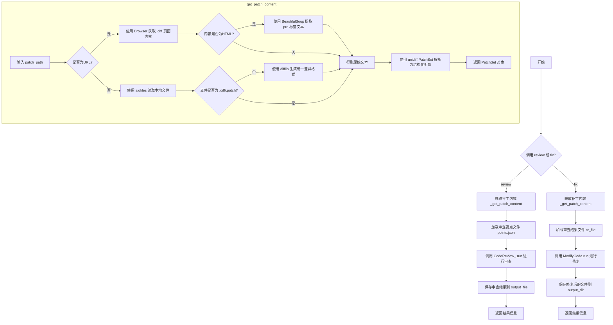
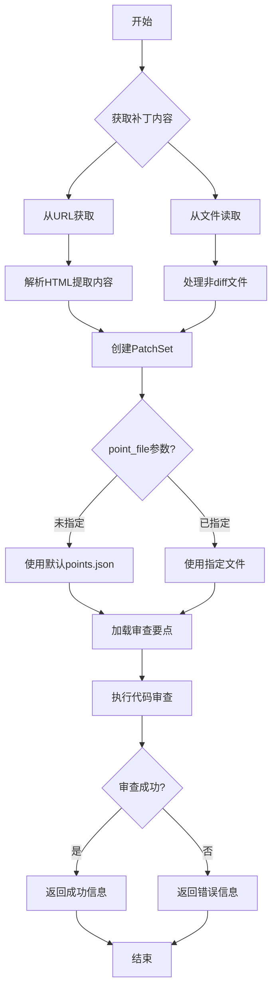
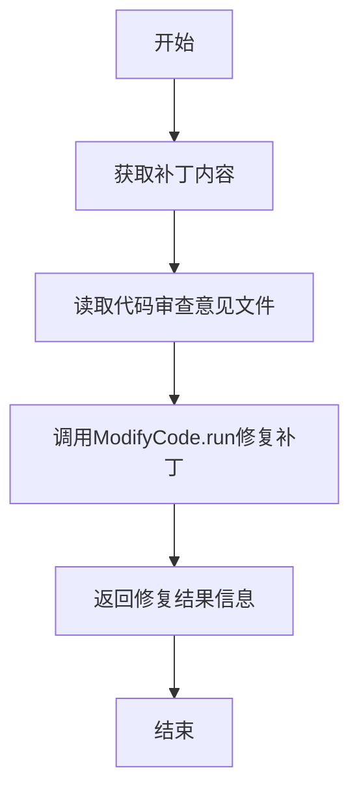

# `.\MetaGPT\metagpt\tools\libs\cr.py` 详细设计文档

该代码实现了一个代码审查工具类 `CodeReview`，它提供了两个核心功能：1) `review` 方法，用于分析给定的补丁文件或PR链接，根据预定义的审查要点生成代码审查意见并保存到JSON文件；2) `fix` 方法，根据已有的审查意见文件，自动修改源代码并生成修复后的补丁文件。它支持本地文件路径和远程PR URL作为输入，并能处理标准diff格式和单个源文件，通过集成MetaGPT框架的组件完成审查和修复流程。

## 整体流程



## 类结构

```
CodeReview (主工具类)
├── review (异步方法: 执行代码审查)
├── fix (异步方法: 执行代码修复)
└── _get_patch_content (私有异步方法: 获取并解析补丁内容)
```

## 全局变量及字段


    

## 全局函数及方法

### `CodeReview.review`

该方法用于审查一个补丁文件或Pull Request URL，生成代码审查评论，并将结果保存到指定文件中。

参数：

- `patch_path`：`str`，补丁文件的本地路径或Pull Request的URL
- `output_file`：`str`，保存代码审查评论的输出文件路径
- `point_file`：`Optional[str]`，指定代码审查要点的文件路径（可选）

返回值：`str`，返回一个描述性字符串，包含发现的缺陷数量、评论存储位置和检查点文件位置

#### 流程图



#### 带注释源码

```python
async def review(
    self,
    patch_path: str,
    output_file: str,
    point_file: Optional[str] = None,
) -> str:
    """Review a PR and save code review comments.

    Notes:
        If the user does not specify an output path, saved it using a relative path in the current working directory.

    Args:
        patch_path: The local path of the patch file or the URL of the pull request.
        output_file: Output file path where code review comments will be saved.
        point_file: File path for specifying code review points. If not specified, this parameter does not need to be passed.

    Examples:

        >>> cr = CodeReview()
        >>> await cr.review(patch_path="https://github.com/geekan/MetaGPT/pull/136", output_file="cr/MetaGPT_136.json")
        >>> await cr.review(patch_path="/data/uploads/dev-master.diff", output_file="cr/dev-master.json")
        >>> await cr.review(patch_path="/data/uploads/main.py", output_file="cr/main.json")
    """
    # 1. 获取补丁内容
    patch = await self._get_patch_content(patch_path)
    
    # 2. 确定审查要点文件路径（使用默认或指定文件）
    point_file = point_file if point_file else Path(metagpt.ext.cr.__file__).parent / "points.json"
    
    # 3. 报告审查要点文件路径
    await EditorReporter().async_report(str(point_file), "path")
    
    # 4. 加载审查要点
    async with aiofiles.open(point_file, "rb") as f:
        cr_point_content = await f.read()
        cr_points = [Point(**i) for i in json.loads(cr_point_content)]
    
    # 5. 执行代码审查
    try:
        comments = await CodeReview_().run(patch, cr_points, output_file)
    except ValueError as e:
        return str(e)
    
    # 6. 返回审查结果信息
    return f"The number of defects: {len(comments)}, the comments are stored in {output_file}, and the checkpoints are stored in {str(point_file)}"
```

### `CodeReview.fix`

根据代码审查意见修复补丁内容。

参数：

- `patch_path`：`str`，补丁文件的本地路径或拉取请求的URL。
- `cr_file`：`str`，存储代码审查意见的文件路径。
- `output_dir`：`str`，存储修复后补丁文件的输出目录路径。

返回值：`str`，返回一个字符串，指示修复后的补丁文件存储在哪个目录。

#### 流程图



#### 带注释源码

```python
async def fix(
    self,
    patch_path: str,
    cr_file: str,
    output_dir: str,
) -> str:
    """Fix the patch content based on code review comments.

    Args:
        patch_path: The local path of the patch file or the url of the pull request.
        cr_file: File path where code review comments are stored.
        output_dir: File path where code review comments are stored.
    """
    # 获取补丁内容，支持本地文件或URL
    patch = await self._get_patch_content(patch_path)
    # 异步读取代码审查意见文件
    async with aiofiles.open(cr_file, "r", encoding="utf-8") as f:
        comments = json.loads(await f.read())
    # 调用ModifyCode类的run方法，根据审查意见修复补丁
    await ModifyCode(pr="").run(patch, comments, output_dir)
    # 返回修复结果信息
    return f"The fixed patch files store in {output_dir}"
```

### `CodeReview._get_patch_content`

该方法用于根据提供的路径（可以是本地文件路径或远程PR的URL）获取并解析补丁内容。如果路径是URL，则通过浏览器获取`.diff`文件内容并解析HTML以提取纯文本补丁；如果是本地文件，则直接读取文件内容。对于非`.diff`或`.patch`后缀的本地文件，会使用`difflib`将其转换为统一的diff格式。最后，使用`unidiff`库将补丁文本解析为结构化的`PatchSet`对象。

参数：

- `patch_path`：`str`，补丁文件的本地路径或Pull Request的URL。

返回值：`PatchSet`，解析后的补丁对象，包含文件变更的详细信息。

#### 流程图

```mermaid
flowchart TD
    A[开始: _get_patch_content(patch_path)] --> B{判断路径类型};
    B -->|以 http/https 开头| C[远程URL路径];
    B -->|否则| D[本地文件路径];
    
    C --> E[使用Browser访问 URL.diff];
    E --> F[获取页面内容];
    F --> G{内容是否为HTML?};
    G -->|是| H[使用BeautifulSoup解析HTML<br>提取<pre>标签内文本];
    G -->|否| I[直接使用内容];
    H --> I;
    I --> J[得到 patch_file_content];
    
    D --> K[使用aiofiles异步读取文件];
    K --> L[得到 patch_file_content];
    L --> M{文件后缀是否为.diff/.patch?};
    M -->|否| N[使用difflib将文件内容<br>转换为统一diff格式];
    M -->|是| O[保持原内容];
    N --> O;
    O --> J;
    
    J --> P[使用PatchSet解析<br>patch_file_content];
    P --> Q[返回PatchSet对象];
```

#### 带注释源码

```python
async def _get_patch_content(self, patch_path):
    # 判断传入的路径是否为网络URL
    if patch_path.startswith(("https://", "http://")):
        # 使用Browser工具访问URL，并获取.diff文件内容
        async with Browser() as browser:
            await browser.goto(f"{patch_path}.diff")
            patch_file_content = await browser.page.content()
            # 如果返回的内容是HTML（例如GitHub的页面），则使用BeautifulSoup解析
            if patch_file_content.startswith("<html>"):
                soup = BeautifulSoup(patch_file_content, "html.parser")
                pre = soup.find("pre")
                if pre:
                    # 提取<pre>标签内的文本作为补丁内容
                    patch_file_content = pre.text
    else:
        # 如果是本地文件路径，则异步读取文件内容
        async with aiofiles.open(patch_path, encoding="utf-8") as f:
            patch_file_content = await f.read()
            # 记录文件读取操作（用于报告）
            await EditorReporter().async_report(patch_path)
        # 如果文件不是标准的.diff或.patch格式，则将其内容转换为统一的diff格式
        if not patch_path.endswith((".diff", ".patch")):
            name = Path(patch_path).name
            # 使用difflib生成一个虚拟的diff，将原文件内容作为新增文件处理
            patch_file_content = "".join(
                difflib.unified_diff([], patch_file_content.splitlines(keepends=True), "/dev/null", f"b/{name}"),
            )
            # 添加diff头部信息
            patch_file_content = f"diff --git a/{name} b/{name}\n{patch_file_content}"

    # 使用unidiff库的PatchSet解析最终的补丁文本，返回结构化的补丁对象
    patch: PatchSet = PatchSet(patch_file_content)
    return patch
```

## 关键组件


### 代码审查工具类 (CodeReview)

一个用于自动化代码审查和修复的工具类，它封装了从指定路径（本地文件或PR URL）获取补丁内容、根据审查要点进行审查、生成审查意见以及根据审查意见自动修复代码的核心功能。

### 补丁内容获取器 (_get_patch_content)

一个私有方法，负责从不同的来源（本地文件路径或远程PR URL）获取并解析补丁内容，统一返回为`PatchSet`对象，为后续的审查和修复操作提供标准化的输入。

### 审查要点加载器 (Point)

一个数据模型，用于定义和加载代码审查的检查点（如编码规范、安全规则等），为`CodeReview_`类的审查逻辑提供结构化的审查标准。

### 核心审查执行器 (CodeReview_)

一个外部依赖的审查动作类，接收补丁内容和审查要点，执行具体的代码分析，识别潜在缺陷并生成详细的审查意见。

### 代码修复执行器 (ModifyCode)

一个外部依赖的修复动作类，接收原始补丁和审查意见，执行自动化的代码修改，生成修复后的代码文件。

### 报告生成器 (EditorReporter)

一个工具类，用于在审查过程中生成和输出报告，例如记录审查要点的文件路径。

### 浏览器模拟器 (Browser)

一个工具类，用于模拟浏览器行为，当补丁路径是远程PR URL时，用于获取`.diff`格式的补丁内容。

### 工具注册装饰器 (register_tool)

一个装饰器，用于将`CodeReview`类及其指定方法注册到工具注册表中，使其能够被外部系统发现和调用。


## 问题及建议


### 已知问题

-   **网络请求逻辑脆弱且不标准**：`_get_patch_content` 方法中，对于 URL 的处理使用了 `Browser` 工具来模拟浏览器获取 `.diff` 文件。这种方式效率低下、不稳定，且依赖于页面 HTML 结构（如查找 `<pre>` 标签），极易因目标网站结构变化而失效。标准的做法应使用专门的 HTTP 客户端库（如 `aiohttp`）直接请求原始 diff 内容。
-   **错误处理不完善**：`review` 方法捕获了 `ValueError` 异常，但仅将其转换为字符串返回。这丢失了原始异常的上下文和堆栈信息，不利于调试和问题定位。其他潜在异常（如网络请求失败、文件 I/O 错误、JSON 解析错误）未被捕获，可能导致程序意外崩溃。
-   **代码重复与职责不清**：`_get_patch_content` 方法承担了过多职责，包括判断输入类型（URL/文件路径）、执行网络请求、解析 HTML、读取本地文件、以及将普通文件内容转换为 diff 格式。这违反了单一职责原则，使得方法冗长、难以测试和维护。
-   **硬编码的路径生成逻辑**：在 `review` 方法中，当 `point_file` 参数未提供时，默认路径通过拼接 `metagpt.ext.cr.__file__` 的父目录和 `"points.json"` 生成。这种硬编码方式降低了代码的灵活性，且依赖于特定的包结构。
-   **潜在的阻塞操作**：代码中混用了同步库（如 `difflib`, `unidiff`）和异步操作。虽然这些同步操作可能不耗时，但在高并发场景下，它们仍可能阻塞事件循环，影响整体性能。
-   **缺乏输入验证**：方法对输入参数（如 `patch_path`, `output_file`, `cr_file`）的有效性（如文件是否存在、URL 是否可达、目录是否可写）没有进行前置验证，可能导致后续操作失败并抛出难以理解的异常。

### 优化建议

-   **重构网络请求与内容获取逻辑**：将 `_get_patch_content` 方法拆分为更小的、职责单一的函数或类方法。例如，可以分离出 `_fetch_patch_from_url`（使用 `aiohttp`）和 `_read_patch_from_file` 函数。将 HTML 解析和 diff 格式转换也提取为独立的辅助函数。这能提高代码的可读性、可测试性和可维护性。
-   **增强错误处理与日志记录**：为所有可能失败的操作（网络请求、文件 I/O、JSON 序列化/反序列化、外部工具调用）添加更精细的异常捕获。使用结构化的日志记录（如 `logging` 模块）替代或补充 `EditorReporter`，记录错误详情、堆栈信息和操作上下文。考虑定义自定义异常类型来更清晰地表达业务逻辑错误。
-   **改进默认配置管理**：将默认的 `points.json` 文件路径作为类常量或通过配置文件管理，而不是在方法内部硬编码。这提高了配置的透明度和可修改性。
-   **明确异步与同步边界**：对于必须使用的同步库，考虑使用 `asyncio.to_thread` 或 `run_in_executor` 将其放入线程池中执行，避免阻塞主事件循环。评估这些操作的实际耗时，如果确实很轻量，可以保留现状但需在文档中说明。
-   **添加输入参数验证**：在方法开始处，对输入参数进行基本的验证和清理。例如，检查文件路径是否存在且可读，检查 URL 格式是否有效，确保输出目录存在或尝试创建它。可以使用 Pydantic 模型或简单的断言来实现。
-   **提高代码可测试性**：通过上述重构，将外部依赖（如网络请求、文件系统操作）抽象为接口，以便在单元测试中轻松模拟（mock）。为关键逻辑（如 diff 生成、评论生成）编写单元测试。
-   **优化依赖注入**：`CodeReview_()` 和 `ModifyCode(pr="")` 的实例化是硬编码的。考虑将它们作为 `CodeReview` 类的构造参数传入，以提高灵活性和可测试性。
-   **完善文档字符串**：当前文档字符串中的示例使用了 `>>>`，但这是同步交互式环境的风格，与异步方法不匹配。建议将示例改为展示如何在异步上下文中正确调用（例如，使用 `asyncio.run` 包装）。同时，在 `fix` 方法的文档中补充示例。


## 其它


### 设计目标与约束

本模块旨在提供一个代码审查与修复的自动化工具，核心设计目标包括：
1.  **自动化审查**：能够自动从指定的补丁文件或PR URL中提取代码变更，并根据预定义的审查要点进行缺陷检测。
2.  **可配置审查标准**：审查标准（`points.json`）与核心逻辑分离，允许用户自定义或扩展审查规则，而无需修改代码。
3.  **自动化修复**：在审查发现问题后，能够根据审查意见自动生成修复后的代码文件。
4.  **接口友好**：提供清晰的异步API（`review` 和 `fix`），并支持多种输入源（本地文件、网络URL），便于集成到CI/CD流程或作为独立工具使用。
5.  **可追溯性**：审查结果和修复后的代码均保存到指定文件或目录，便于后续验证和审计。

主要约束包括：
*   **依赖外部库**：功能实现依赖于 `unidiff` 解析diff格式、`BeautifulSoup` 解析HTML、`aiofiles` 进行异步文件操作以及 `metagpt` 框架内的其他组件。
*   **审查范围**：审查和修复主要针对代码变更（diff）部分，对于未变更的代码或复杂的架构问题可能无法覆盖。
*   **修复能力**：修复逻辑依赖于 `ModifyCode` 类的实现，其修复的准确性和范围是有限的，可能无法处理所有类型的代码缺陷。

### 错误处理与异常设计

模块中的错误处理策略如下：
1.  **输入验证**：`_get_patch_content` 方法通过检查路径前缀 (`https://`, `http://`) 来区分网络资源和本地文件，并相应地进行处理。对于本地非标准diff文件，会尝试将其转换为统一diff格式。
2.  **资源访问异常**：访问网络URL或本地文件时，使用了 `async with` 上下文管理器来确保资源的正确获取和释放。网络请求失败或文件不存在等异常会由底层库（如 `aiohttp` 或 `aiofiles`）抛出，并传播给调用者。
3.  **业务逻辑异常**：在 `review` 方法中，核心审查逻辑 `CodeReview_().run` 被包裹在 `try...except` 块中，捕获 `ValueError` 异常。当审查过程遇到无法处理的错误（如无效的diff格式）时，会抛出此异常，并被捕获后以字符串形式返回给用户，避免了程序崩溃。
4.  **数据格式异常**：加载JSON文件（如 `points.json` 和 `cr_file`）时，使用 `json.loads`，如果文件格式错误会抛出 `JSONDecodeError`，该异常会向上传播。
5.  **静默处理**：在 `_get_patch_content` 中，当从网页获取diff内容时，如果返回的是HTML，会尝试解析 `<pre>` 标签来提取文本内容。如果解析失败，原始的HTML内容可能会被传递给 `PatchSet`，可能导致后续解析失败。此处缺乏对解析失败的显式错误处理。

### 数据流与状态机

模块的数据流主要围绕两个核心操作：`review` 和 `fix`。

**`review` 数据流**：
1.  **输入**：`patch_path` (文件路径或URL), `output_file` (输出文件路径), `point_file` (审查要点文件路径，可选)。
2.  **处理**：
    a. 调用 `_get_patch_content` 获取并解析 `PatchSet` 对象。
    b. 加载 `point_file` 中的审查要点，构造 `Point` 对象列表。
    c. 将 `PatchSet` 和 `Point` 列表传递给 `CodeReview_().run` 进行审查。
    d. `CodeReview_().run` 内部执行审查逻辑，生成审查意见列表，并可能将结果保存到 `output_file`。
3.  **输出**：返回一个总结字符串，包含缺陷数量和文件存储位置。审查的详细结果（`comments`）被写入 `output_file` 指定的JSON文件。

**`fix` 数据流**：
1.  **输入**：`patch_path` (文件路径或URL), `cr_file` (包含审查意见的JSON文件路径), `output_dir` (修复后代码的输出目录)。
2.  **处理**：
    a. 调用 `_get_patch_content` 获取并解析 `PatchSet` 对象。
    b. 从 `cr_file` 加载审查意见 (`comments`)。
    c. 将 `PatchSet`、`comments` 和 `output_dir` 传递给 `ModifyCode().run` 进行代码修复。
3.  **输出**：返回一个字符串，指示修复后的文件存储位置。修复后的代码文件被写入 `output_dir` 目录。

**`_get_patch_content` 内部数据流**：
*   判断输入是URL还是本地路径。
*   **URL路径**：使用 `Browser` 获取 `.diff` 后缀的页面内容。如果是HTML，则用 `BeautifulSoup` 提取 `<pre>` 标签内的文本作为diff内容。
*   **本地路径**：读取文件内容。如果文件扩展名不是 `.diff` 或 `.patch`，则使用 `difflib` 将其模拟为对新文件的变更，并包装成标准diff格式头部。
*   **最终处理**：使用 `PatchSet` 解析最终的diff字符串，返回解析后的对象。

模块本身没有复杂的状态机，其状态主要体现在异步操作的执行流程中。

### 外部依赖与接口契约

**外部库依赖**：
*   `difflib` (Python标准库)：用于生成和操作差异信息，在本模块中用于将普通代码文件模拟成diff格式。
*   `json` (Python标准库)：用于解析和序列化JSON数据（审查要点和审查结果）。
*   `pathlib` (Python标准库)：用于面向对象的路径操作。
*   `aiofiles`：提供异步文件I/O支持，用于非阻塞地读取文件。
*   `bs4` (BeautifulSoup)：用于解析HTML内容，从GitHub等网页中提取纯文本diff。
*   `unidiff`：用于解析和操作统一diff格式 (`unified diff`) 的文件，是处理补丁文件的核心。
*   `metagpt.ext.cr`：MetaGPT框架的代码审查扩展模块，提供了 `CodeReview_` 和 `ModifyCode` 等核心业务逻辑类，以及 `Point` 数据模型。
*   `metagpt.tools.libs.browser`：提供了 `Browser` 类，用于模拟浏览器行为获取网页内容。
*   `metagpt.tools.tool_registry`：提供了 `register_tool` 装饰器，用于将本类注册为MetaGPT框架内的一个工具。
*   `metagpt.utils.report`：提供了 `EditorReporter` 类，用于报告操作路径信息（推测用于日志或UI显示）。

**接口契约**：
1.  **`CodeReview` 类**：作为主要对外接口，通过 `@register_tool` 装饰器暴露 `review` 和 `fix` 方法。调用者需遵守其异步调用约定。
2.  **`review` 方法契约**：
    *   **输入**：接受字符串类型的 `patch_path`, `output_file` 和可选的 `point_file`。
    *   **输出**：返回一个描述性的字符串。真正的审查结果（JSON格式）写入 `output_file`。
    *   **行为**：调用 `CodeReview_().run`，并处理其可能抛出的 `ValueError`。
3.  **`fix` 方法契约**：
    *   **输入**：接受字符串类型的 `patch_path`, `cr_file`, `output_dir`。
    *   **输出**：返回一个描述性的字符串。修复后的代码文件写入 `output_dir`。
    *   **行为**：调用 `ModifyCode().run` 执行修复。
4.  **`_get_patch_content` 方法契约（内部）**：
    *   **输入**：字符串类型的 `patch_path`。
    *   **输出**：返回一个 `unidiff.PatchSet` 对象。
    *   **行为**：根据输入路径类型（URL/本地文件）获取内容，并确保其能被 `PatchSet` 解析。
5.  **与 `CodeReview_` 和 `ModifyCode` 的契约**：
    *   `CodeReview_().run(patch, cr_points, output_file)`：期望接收 `PatchSet`、`List[Point]` 和输出文件路径，执行审查并可能写入文件。
    *   `ModifyCode(pr="").run(patch, comments, output_dir)`：期望接收 `PatchSet`、审查意见列表和输出目录，执行修复并写入文件。
    *   这些是模块与MetaGPT框架内部组件的关键交互点，其具体行为由这些内部类定义。
6.  **数据格式契约**：
    *   `point_file`：必须是有效的JSON文件，其内容可被反序列化为 `Point` 对象列表。
    *   `cr_file`：必须是有效的JSON文件，其内容为 `CodeReview_().run` 输出的审查意见列表格式。
    *   `patch_path` 指向的本地文件或URL返回的内容，最终必须能被 `unidiff.PatchSet` 成功解析。

    