# `.\MetaGPT\metagpt\tools\libs\data_preprocess.py` 详细设计文档

该代码定义了一个用于机器学习的通用数据预处理工具集。它提供了一个抽象基类 `MLProcess` 来定义数据处理流程（拟合、转换），并基于此实现了一个具体的工具基类 `DataPreprocessTool`。随后，通过继承 `DataPreprocessTool`，代码实现了多个具体的数据预处理工具类，如填充缺失值、多种特征缩放（最小-最大、标准化、最大绝对值、鲁棒）以及多种分类特征编码（序数、独热、标签）。这些工具类均通过 `@register_tool` 装饰器注册，便于在工具库中统一管理。此外，还提供了一个辅助函数 `get_column_info` 用于分析数据框的列类型。

## 整体流程

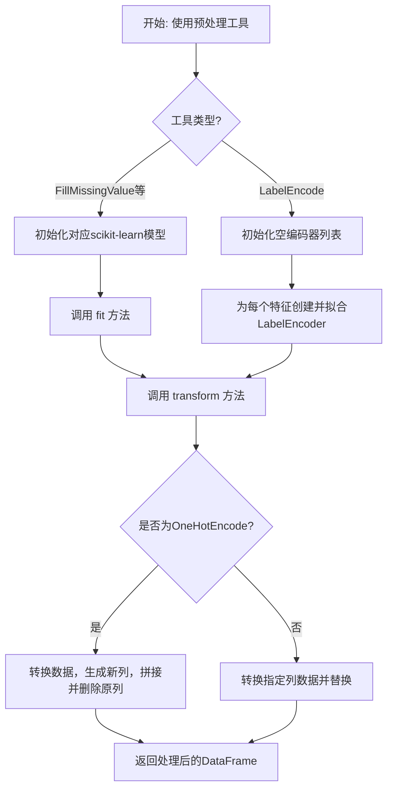

## 类结构

```
MLProcess (抽象基类)
└── DataPreprocessTool (数据处理工具基类)
    ├── FillMissingValue (填充缺失值)
    ├── MinMaxScale (最小-最大缩放)
    ├── StandardScale (标准化缩放)
    ├── MaxAbsScale (最大绝对值缩放)
    ├── RobustScale (鲁棒缩放)
    ├── OrdinalEncode (序数编码)
    ├── OneHotEncode (独热编码)
    └── LabelEncode (标签编码)
```

## 全局变量及字段


### `TAGS`
    
用于工具注册的标签列表，标识这些工具属于数据预处理和机器学习类别

类型：`list[str]`
    


### `DataPreprocessTool.features`
    
需要被预处理的数据列名列表

类型：`list[str]`
    


### `DataPreprocessTool.model`
    
用于数据预处理的scikit-learn模型实例，由具体子类初始化时填充

类型：`sklearn.base.BaseEstimator | None`
    


### `FillMissingValue.features`
    
需要填充缺失值的数据列名列表

类型：`list[str]`
    


### `FillMissingValue.model`
    
使用简单策略填充缺失值的scikit-learn SimpleImputer模型

类型：`sklearn.impute.SimpleImputer`
    


### `MinMaxScale.features`
    
需要进行最小-最大缩放的数据列名列表

类型：`list[str]`
    


### `MinMaxScale.model`
    
将特征缩放到(0,1)范围的scikit-learn MinMaxScaler模型

类型：`sklearn.preprocessing.MinMaxScaler`
    


### `StandardScale.features`
    
需要进行标准化缩放的数据列名列表

类型：`list[str]`
    


### `StandardScale.model`
    
通过移除均值并缩放到单位方差来标准化特征的scikit-learn StandardScaler模型

类型：`sklearn.preprocessing.StandardScaler`
    


### `MaxAbsScale.features`
    
需要进行最大绝对值缩放的数据列名列表

类型：`list[str]`
    


### `MaxAbsScale.model`
    
通过每个特征的最大绝对值进行缩放的scikit-learn MaxAbsScaler模型

类型：`sklearn.preprocessing.MaxAbsScaler`
    


### `RobustScale.features`
    
需要进行鲁棒缩放的数据列名列表

类型：`list[str]`
    


### `RobustScale.model`
    
使用对异常值鲁棒的统计量进行缩放的scikit-learn RobustScaler模型

类型：`sklearn.preprocessing.RobustScaler`
    


### `OrdinalEncode.features`
    
需要进行序数编码的分类数据列名列表

类型：`list[str]`
    


### `OrdinalEncode.model`
    
将分类特征编码为序数整数的scikit-learn OrdinalEncoder模型

类型：`sklearn.preprocessing.OrdinalEncoder`
    


### `OneHotEncode.features`
    
需要进行独热编码的分类数据列名列表

类型：`list[str]`
    


### `OneHotEncode.model`
    
将分类特征转换为独热编码的scikit-learn OneHotEncoder模型

类型：`sklearn.preprocessing.OneHotEncoder`
    


### `LabelEncode.features`
    
需要进行标签编码的分类数据列名列表

类型：`list[str]`
    


### `LabelEncode.le_encoders`
    
用于每个特征列的scikit-learn LabelEncoder实例列表

类型：`list[sklearn.preprocessing.LabelEncoder]`
    
    

## 全局函数及方法


### `get_column_info`

该函数用于分析一个Pandas DataFrame，并根据其列的数据类型将列名分类到不同的类别中。

参数：

-  `df`：`pd.DataFrame`，需要被分析的DataFrame。

返回值：`dict`，一个包含四个键（'Category', 'Numeric', 'Datetime', 'Others'）的字典。每个键对应一个属于该类别的列名列表。

#### 流程图

```mermaid
flowchart TD
    A[开始: get_column_info(df)] --> B[初始化结果字典 column_info]
    B --> C[遍历 df 的每一列 col]
    C --> D[获取列的数据类型 data_type]
    D --> E{判断 data_type 类型}
    E -- object --> F[将 col 加入 'Category' 列表]
    E -- int 或 float --> G[将 col 加入 'Numeric' 列表]
    E -- datetime --> H[将 col 加入 'Datetime' 列表]
    E -- 其他 --> I[将 col 加入 'Others' 列表]
    F --> J[继续下一列]
    G --> J
    H --> J
    I --> J
    J --> K{是否还有未处理的列?}
    K -- 是 --> C
    K -- 否 --> L{检查结果字典序列化后长度 > 2000?}
    L -- 是 --> M[截断 'Numeric' 列表，保留前5项并添加提示]
    L -- 否 --> N[返回 column_info]
    M --> N
    N --> O[结束]
```

#### 带注释源码

```python
def get_column_info(df: pd.DataFrame) -> dict:
    """
    Analyzes a DataFrame and categorizes its columns based on data types.

    Args:
        df (pd.DataFrame): The DataFrame to be analyzed.

    Returns:
        dict: A dictionary with four keys ('Category', 'Numeric', 'Datetime', 'Others').
              Each key corresponds to a list of column names belonging to that category.
    """
    # 初始化结果字典，包含四个预定义的类别
    column_info = {
        "Category": [],
        "Numeric": [],
        "Datetime": [],
        "Others": [],
    }
    # 遍历DataFrame的每一列
    for col in df.columns:
        # 获取列的数据类型字符串，并清理格式（移除 'dtype(' 和 ')'）
        data_type = str(df[col].dtype).replace("dtype('", "").replace("')", "")
        # 根据数据类型前缀将列名分配到对应的类别列表中
        if data_type.startswith("object"):
            column_info["Category"].append(col)
        elif data_type.startswith("int") or data_type.startswith("float"):
            column_info["Numeric"].append(col)
        elif data_type.startswith("datetime"):
            column_info["Datetime"].append(col)
        else:
            # 对于无法识别的数据类型，归入'Others'
            column_info["Others"].append(col)

    # 检查序列化后的字典长度是否超过2000字符（可能用于限制输出大小）
    if len(json.dumps(column_info)) > 2000:
        # 如果过长，则截断'Numeric'类别列表，只保留前5项并添加提示信息
        column_info["Numeric"] = column_info["Numeric"][0:5] + ["Too many cols, omission here..."]
    # 返回分类结果字典
    return column_info
```


### `MLProcess.fit`

`MLProcess.fit` 是机器学习预处理流程中的一个抽象方法，用于根据输入数据拟合（训练）一个模型或转换器，以便在后续的 `transform` 方法中使用。该方法定义了所有具体预处理工具（如填充缺失值、标准化等）必须实现的接口，确保它们遵循统一的“先拟合，后转换”模式。

参数：

-  `df`：`pd.DataFrame`，输入的待拟合数据。

返回值：`None`，该方法不返回任何值，其作用是将模型状态更新为已拟合状态。

#### 流程图

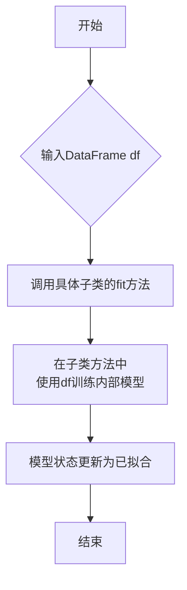

#### 带注释源码

```python
    def fit(self, df: pd.DataFrame):
        """
        Fit a model to be used in subsequent transform.

        Args:
            df (pd.DataFrame): The input DataFrame.
        """
        # 这是一个抽象方法，仅定义了接口。
        # 具体实现由继承MLProcess的子类（如DataPreprocessTool及其子类）提供。
        # 子类需要在此方法中，利用传入的DataFrame `df` 来训练其内部的`self.model`。
        raise NotImplementedError
```


### `MLProcess.transform`

`MLProcess.transform` 是机器学习预处理流程基类中的一个抽象方法，它定义了使用已拟合的模型对输入数据进行转换的接口。该方法旨在被具体的数据预处理工具子类（如 `FillMissingValue`、`OneHotEncode` 等）继承并实现，以执行特定的数据转换操作，如填充缺失值、特征缩放或编码等。其核心职责是接收一个 `DataFrame`，应用预训练好的转换逻辑，并返回一个新的、转换后的 `DataFrame`。

参数：

-  `df`：`pd.DataFrame`，需要进行转换的输入数据框。

返回值：`pd.DataFrame`，经过模型转换后的新数据框。

#### 流程图

```mermaid
flowchart TD
    A[开始: 调用 transform(df)] --> B{检查 features 列表是否为空?};
    B -- 是 --> C[直接返回输入 df];
    B -- 否 --> D[创建输入 df 的副本 new_df];
    D --> E[调用 self.model.transform<br/>对 new_df[features] 进行转换];
    E --> F[将转换结果赋值回 new_df[features]];
    F --> G[返回转换后的 new_df];
    C --> H[结束];
    G --> H;
```

#### 带注释源码

```python
def transform(self, df: pd.DataFrame) -> pd.DataFrame:
    """
    Transform the input DataFrame with the fitted model.

    Args:
        df (pd.DataFrame): The input DataFrame.

    Returns:
        pd.DataFrame: The transformed DataFrame.
    """
    # 检查待处理的特征列列表是否为空
    if len(self.features) == 0:
        # 如果为空，则无需处理，直接返回原始数据框
        return df
    # 创建输入数据框的副本，避免修改原始数据
    new_df = df.copy()
    # 使用已拟合的模型（self.model）对指定特征列（self.features）进行转换
    # 转换结果直接替换副本中对应的列数据
    new_df[self.features] = self.model.transform(new_df[self.features])
    # 返回经过转换处理后的新数据框
    return new_df
```


### `MLProcess.fit_transform`

该方法是一个模板方法，用于在单个操作中完成模型的拟合（`fit`）和转换（`transform`）。它首先调用 `fit` 方法在输入数据上训练模型，然后调用 `transform` 方法应用该模型转换数据，并返回转换后的结果。这是机器学习预处理流程中一个常见且高效的模式。

参数：
- `df`：`pd.DataFrame`，需要进行拟合和转换的输入数据。

返回值：`pd.DataFrame`，经过模型转换后的新DataFrame。

#### 流程图

```mermaid
flowchart TD
    A[开始] --> B[调用 self.fit(df) 拟合模型]
    B --> C[调用 self.transform(df) 转换数据]
    C --> D[返回转换后的 DataFrame]
    D --> E[结束]
```

#### 带注释源码

```python
def fit_transform(self, df: pd.DataFrame) -> pd.DataFrame:
    """
    Fit and transform the input DataFrame.

    Args:
        df (pd.DataFrame): The input DataFrame.

    Returns:
        pd.DataFrame: The transformed DataFrame.
    """
    # 步骤1：在输入数据 `df` 上调用 `fit` 方法，训练内部模型。
    self.fit(df)
    # 步骤2：使用训练好的模型对同一份数据 `df` 进行转换，并返回结果。
    return self.transform(df)
```

### `DataPreprocessTool.__init__`

初始化 `DataPreprocessTool` 实例，设置需要处理的特征列，并为后续的具体预处理模型预留存储位置。

参数：

- `features`：`list`，指定需要进行数据预处理的列名列表。

返回值：`None`，此方法为构造函数，不返回任何值。

#### 流程图

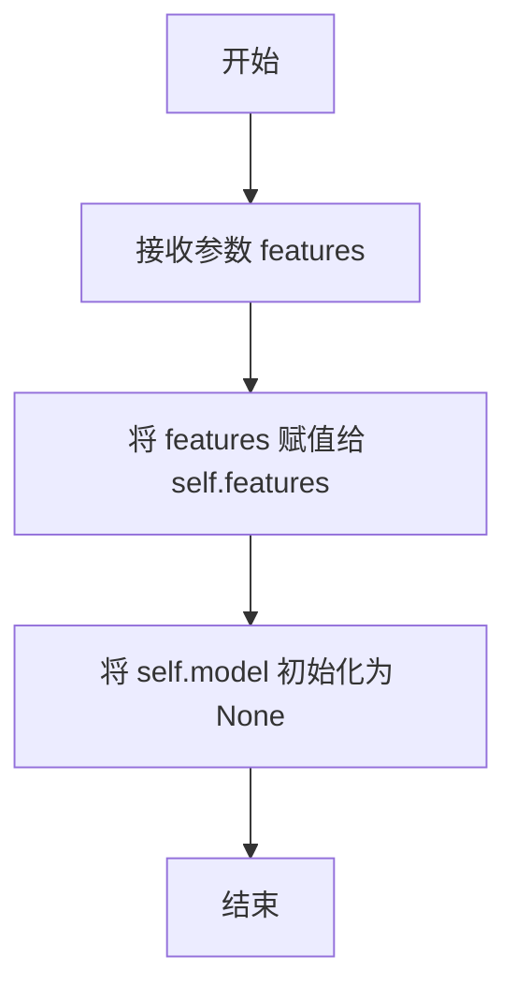

#### 带注释源码

```python
def __init__(self, features: list):
    """
    Initialize self.

    Args:
        features (list): Columns to be processed.
    """
    # 将传入的特征列列表存储为实例变量，供后续的 fit 和 transform 方法使用
    self.features = features
    # 初始化模型变量为 None，具体的预处理模型（如 SimpleImputer, MinMaxScaler 等）
    # 将在子类（如 FillMissingValue, MinMaxScale）的 __init__ 方法中被实例化和赋值
    self.model = None  # to be filled by specific subclass Tool
```


### `DataPreprocessTool.fit`

该方法用于拟合（训练）数据预处理工具的内部模型。它从输入的DataFrame中提取指定的特征列，并使用这些数据来训练（或计算）预处理模型（例如，计算均值、标准差、编码映射等），为后续的`transform`操作做准备。如果指定的特征列表为空，则直接返回，不执行任何操作。

参数：

-  `df`：`pd.DataFrame`，输入的原始数据，用于训练预处理模型。

返回值：`None`，该方法不返回任何值，其作用是将训练好的模型状态存储在类实例的`self.model`属性中。

#### 流程图

```mermaid
flowchart TD
    A[开始] --> B{特征列表<br>self.features 是否为空?}
    B -- 是 --> C[直接返回]
    B -- 否 --> D[使用 df[self.features] 数据<br>调用 self.model.fit 方法]
    D --> E[结束]
```

#### 带注释源码

```python
def fit(self, df: pd.DataFrame):
    # 检查需要处理的特征列列表是否为空
    if len(self.features) == 0:
        # 如果为空，则无需进行任何拟合操作，直接返回
        return
    # 如果特征列表不为空，则从输入的DataFrame `df` 中提取这些特征列
    # 然后调用内部模型 `self.model` 的 `fit` 方法，使用这些数据进行训练
    self.model.fit(df[self.features])
```


### `DataPreprocessTool.transform`

该方法属于`DataPreprocessTool`类，是数据预处理工具链中的一个通用转换方法。它负责使用在`fit`阶段训练好的模型（如缩放器、编码器、插补器等）对指定的特征列进行转换。该方法会创建一个输入DataFrame的副本，以避免修改原始数据，然后在副本上应用模型转换，最后返回转换后的新DataFrame。

参数：

- `df`：`pandas.DataFrame`，需要进行数据预处理的输入DataFrame。

返回值：`pandas.DataFrame`，返回一个经过模型转换后的新DataFrame。如果`self.features`列表为空，则直接返回输入的`df`。

#### 流程图

```mermaid
flowchart TD
    A[开始: transform(df)] --> B{特征列表<br>self.features是否为空?};
    B -- 是 --> C[直接返回输入df];
    B -- 否 --> D[创建df的副本 new_df];
    D --> E[使用self.model.transform<br>对new_df[self.features]进行转换];
    E --> F[返回转换后的new_df];
    C --> G[结束];
    F --> G;
```

#### 带注释源码

```python
def transform(self, df: pd.DataFrame) -> pd.DataFrame:
    # 检查需要处理的特征列表是否为空
    if len(self.features) == 0:
        # 如果为空，则无需处理，直接返回原始DataFrame
        return df
    # 创建输入DataFrame的副本，确保原始数据不被修改
    new_df = df.copy()
    # 使用在fit阶段训练好的模型（self.model）对指定的特征列进行转换
    # 转换结果直接替换副本中对应的列
    new_df[self.features] = self.model.transform(new_df[self.features])
    # 返回经过转换的新DataFrame
    return new_df
```


### `FillMissingValue.__init__`

该方法用于初始化 `FillMissingValue` 类的一个实例。`FillMissingValue` 是一个数据预处理工具，其核心功能是使用简单的策略（如均值、中位数、众数或常数）来填充指定特征列中的缺失值。初始化过程主要接收待处理的特征列列表、填充策略以及可选的填充常数值，并据此配置底层的 `SimpleImputer` 模型。

参数：

-  `features`：`list`，一个列表，指定需要进行缺失值填充的数据列名。
-  `strategy`：`Literal["mean", "median", "most_frequent", "constant"]`，指定填充缺失值所使用的策略。可选值为 "mean"（均值）、"median"（中位数）、"most_frequent"（众数）或 "constant"（常数）。默认值为 "mean"。注意，"mean" 和 "median" 策略仅适用于数值型特征。
-  `fill_value`：`int` 或 `None`，当 `strategy` 参数设置为 "constant" 时，此值将用于替换所有缺失值。默认值为 `None`。

返回值：`None`，此方法不返回任何值，仅用于初始化类实例。

#### 流程图

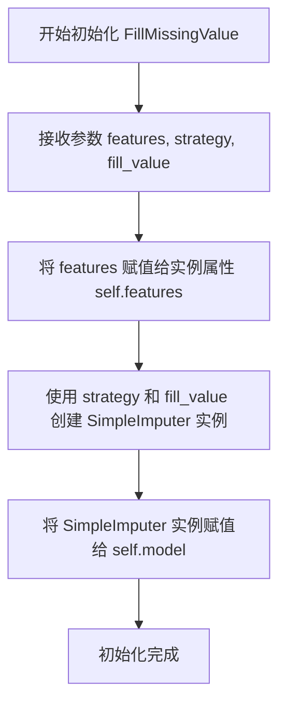

#### 带注释源码

```python
def __init__(
    self, features: list, strategy: Literal["mean", "median", "most_frequent", "constant"] = "mean", fill_value=None
):
    """
    Initialize self.

    Args:
        features (list): Columns to be processed.
        strategy (Literal["mean", "median", "most_frequent", "constant"], optional): The imputation strategy, notice 'mean' and 'median' can only
                              be used for numeric features. Defaults to 'mean'.
        fill_value (int, optional): Fill_value is used to replace all occurrences of missing_values.
                                    Defaults to None.
    """
    # 将传入的特征列列表赋值给实例变量 self.features。
    # 这个列表定义了后续 fit 和 transform 方法将作用于哪些数据列。
    self.features = features

    # 使用指定的策略（strategy）和可选的填充值（fill_value）创建一个 scikit-learn 的 SimpleImputer 实例。
    # 这个实例（self.model）是实际执行缺失值填充算法的核心组件。
    # 例如，strategy="mean" 会计算每列的均值用于填充该列的缺失值。
    self.model = SimpleImputer(strategy=strategy, fill_value=fill_value)
```


### `MinMaxScale.__init__`

初始化 MinMaxScale 工具类，用于将指定特征列的数据缩放到 (0, 1) 的范围。

参数：
- `features`：`list`，需要进行缩放处理的特征列名列表。

返回值：`None`，此方法不返回任何值，仅用于初始化对象。

#### 流程图

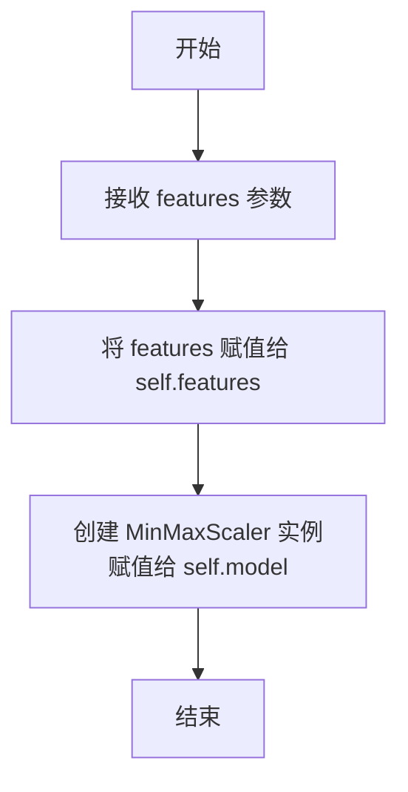

#### 带注释源码

```python
def __init__(self, features: list):
    # 将传入的特征列名列表保存到实例变量 self.features 中
    self.features = features
    # 创建一个 sklearn 的 MinMaxScaler 对象，并将其赋值给实例变量 self.model
    # 该对象将用于后续的 fit 和 transform 操作
    self.model = MinMaxScaler()
```


### `StandardScale.__init__`

`StandardScale` 类的构造函数，用于初始化一个标准化缩放工具。它继承自 `DataPreprocessTool`，其核心功能是创建一个 `StandardScaler` 模型，用于对指定的数值特征列进行标准化处理（即减去均值并缩放到单位方差）。

参数：

-  `features`：`list`，需要进行标准化处理的列名列表。

返回值：`None`，此方法不返回任何值。

#### 流程图

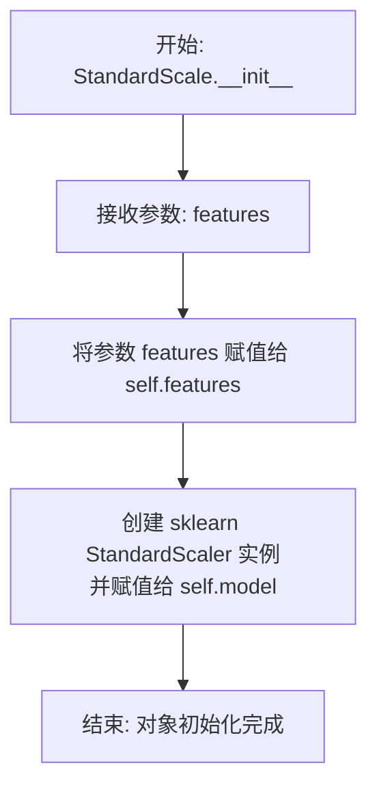

#### 带注释源码

```
def __init__(self, features: list):
    # 调用父类 DataPreprocessTool 的 __init__ 方法
    # 将用户指定的特征列列表保存到实例变量 self.features 中
    self.features = features
    # 创建 scikit-learn 的 StandardScaler 标准化器实例
    # 并将其赋值给实例变量 self.model，供后续的 fit 和 transform 方法使用
    self.model = StandardScaler()
```


### `MaxAbsScale.__init__`

初始化 `MaxAbsScale` 工具类，用于按特征的最大绝对值缩放指定特征列。

参数：

- `features`：`list`，需要被缩放的特征列名列表。

返回值：`None`，无返回值。

#### 流程图

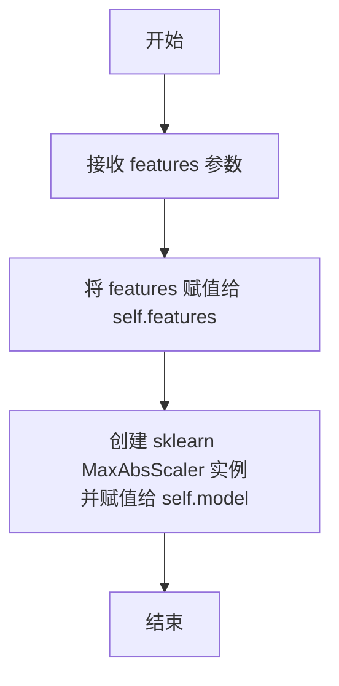

#### 带注释源码

```python
def __init__(self, features: list):
    # 将传入的特征列名列表保存到实例变量 self.features 中
    self.features = features
    # 创建一个 scikit-learn 的 MaxAbsScaler 缩放器实例，
    # 并将其赋值给实例变量 self.model，供后续的 fit 和 transform 方法使用
    self.model = MaxAbsScaler()
```

### `RobustScale.__init__`

初始化 RobustScale 工具类，用于对指定特征列应用鲁棒缩放（RobustScaler），该缩放方法使用对异常值稳健的统计量（如中位数和四分位距）来缩放特征。

参数：

- `features`：`list`，需要进行鲁棒缩放处理的特征列名列表。

返回值：`None`，此方法不返回任何值，仅用于初始化对象。

#### 流程图

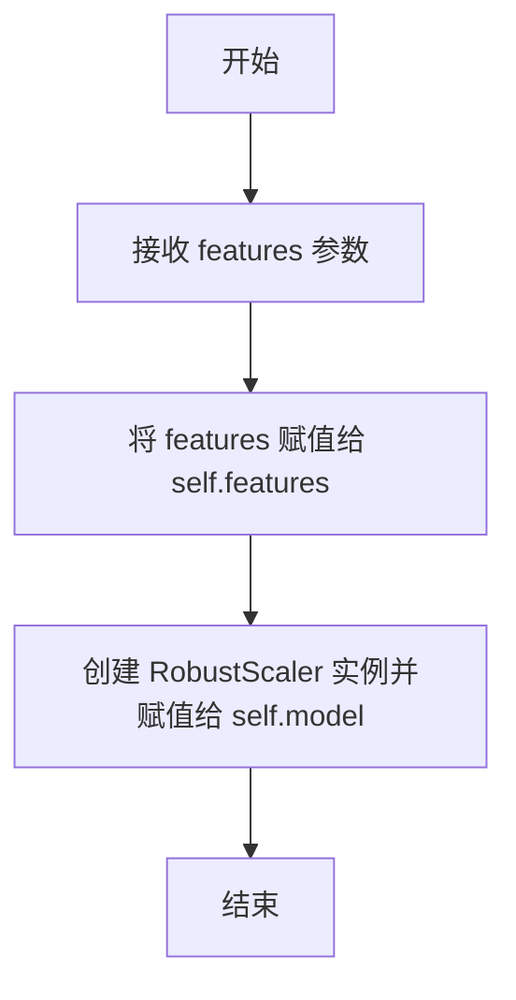

#### 带注释源码

```python
def __init__(self, features: list):
    # 调用父类 DataPreprocessTool 的初始化方法（如果存在显式调用，此处为隐式调用）
    # 将传入的特征列列表赋值给实例变量 self.features
    self.features = features
    # 创建一个 sklearn 的 RobustScaler 实例，并赋值给实例变量 self.model
    # RobustScaler 使用对异常值稳健的统计量（如中位数和四分位距）来缩放特征
    self.model = RobustScaler()
```

### `OrdinalEncode.__init__`

初始化 OrdinalEncode 工具类，用于将指定的分类特征列编码为序数整数。该工具继承自 DataPreprocessTool，并配置了 scikit-learn 的 OrdinalEncoder 作为内部处理模型。

参数：

- `features`：`list`，需要进行序数编码的特征列名列表。

返回值：`None`，此方法为构造函数，不返回任何值。

#### 流程图

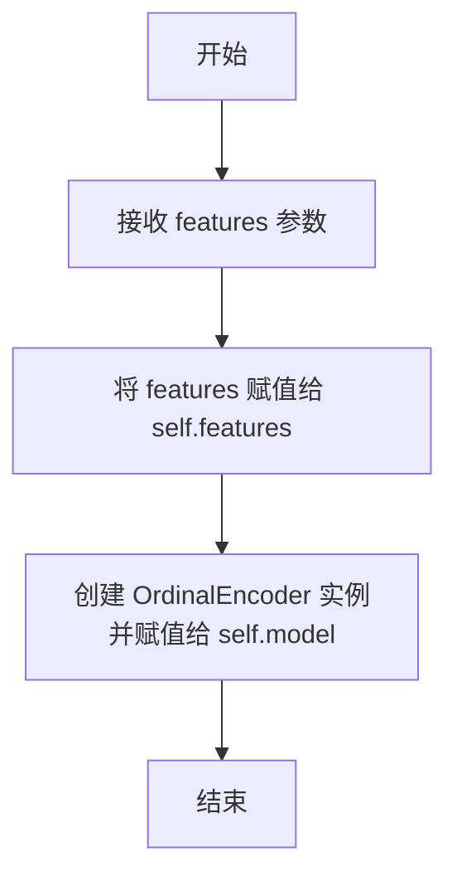

#### 带注释源码

```python
def __init__(self, features: list):
    # 调用父类 DataPreprocessTool 的构造函数
    # 将需要处理的特征列名列表赋值给实例变量 self.features
    self.features = features
    # 创建 scikit-learn 的 OrdinalEncoder 实例
    # 并将其赋值给实例变量 self.model，用于后续的拟合和转换操作
    self.model = OrdinalEncoder()
```

### `OneHotEncode.__init__`

初始化 `OneHotEncode` 工具类，用于对指定的分类特征列进行独热编码（One-Hot Encoding）。该方法继承自 `DataPreprocessTool`，并配置了一个 `sklearn.preprocessing.OneHotEncoder` 模型，该模型会忽略未知类别（`handle_unknown="ignore"`）并以密集数组形式输出结果（`sparse_output=False`）。

参数：

- `features`：`list`，需要进行独热编码处理的列名列表。

返回值：`None`，此方法为构造函数，不返回任何值。

#### 流程图

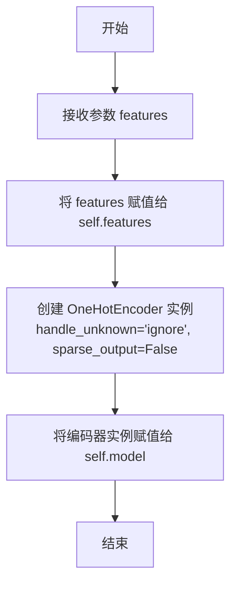

#### 带注释源码

```python
def __init__(self, features: list):
    # 调用父类 DataPreprocessTool 的 __init__ 方法
    # 将需要处理的特征列列表赋值给实例变量 self.features
    self.features = features
    # 初始化 sklearn 的 OneHotEncoder 模型
    # handle_unknown='ignore'：当遇到训练时未出现的类别时，忽略该类别（对应的独热编码列全为0）
    # sparse_output=False：确保输出为密集的 NumPy 数组，而非稀疏矩阵，便于后续与 DataFrame 整合
    self.model = OneHotEncoder(handle_unknown="ignore", sparse_output=False)
```

### `OneHotEncode.transform`

该方法对指定的分类特征列进行独热编码（One-Hot Encoding）转换。它会将原始的分类列转换为多个二进制列（每个类别对应一列），并将这些新列添加到数据框中，同时删除原始的分类列。该方法能够处理训练时未见过的类别（通过`handle_unknown='ignore'`参数）。

参数：

- `df`：`pd.DataFrame`，需要进行转换的输入数据框。

返回值：`pd.DataFrame`，转换后的数据框，其中指定的分类特征列已被替换为对应的独热编码列。

#### 流程图

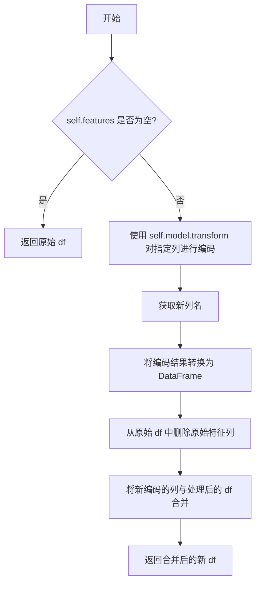

#### 带注释源码

```python
def transform(self, df: pd.DataFrame) -> pd.DataFrame:
    # 使用已拟合的 OneHotEncoder 模型对指定的特征列进行转换
    ts_data = self.model.transform(df[self.features])
    # 获取独热编码后生成的新列名
    new_columns = self.model.get_feature_names_out(self.features)
    # 将转换后的数据（numpy数组）转换为 DataFrame，并设置列名和索引
    ts_data = pd.DataFrame(ts_data, columns=new_columns, index=df.index)
    # 从原始数据框中删除原始的、已被编码的特征列
    new_df = df.drop(self.features, axis=1)
    # 将删除原始列后的数据框与新的独热编码列进行横向合并
    new_df = pd.concat([new_df, ts_data], axis=1)
    # 返回最终处理完成的数据框
    return new_df
```

### `LabelEncode.__init__`

初始化 `LabelEncode` 工具实例，用于对指定的分类列进行标签编码。该方法设置需要处理的特征列，并初始化一个空列表来存储每个特征对应的 `LabelEncoder` 实例。

参数：

- `features`：`list`，需要进行标签编码的分类列名列表。

返回值：`None`，此方法不返回任何值，仅初始化对象。

#### 流程图

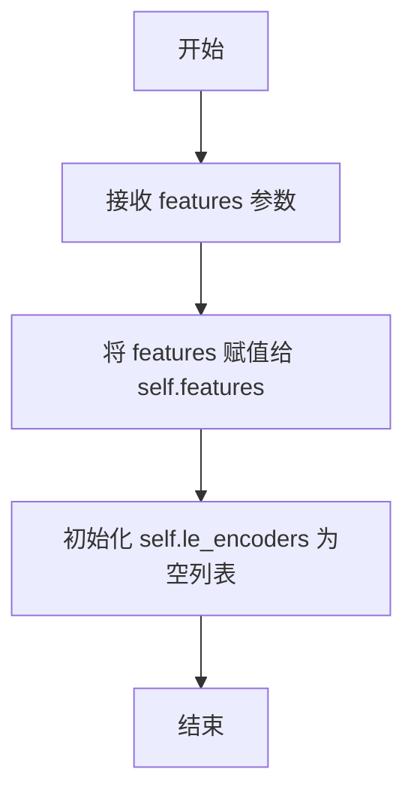

#### 带注释源码

```python
def __init__(self, features: list):
    """
    Initialize self.

    Args:
        features (list): Categorical columns to be label encoded.
    """
    # 将传入的特征列列表赋值给实例变量 self.features
    self.features = features
    # 初始化一个空列表，用于后续存储每个特征对应的 sklearn LabelEncoder 对象
    self.le_encoders = []
```

### `LabelEncode.fit`

该方法用于拟合标签编码器。它遍历指定的分类特征列，为每一列创建一个独立的 `sklearn.preprocessing.LabelEncoder` 实例，并使用该列的唯一值（转换为字符串）加上一个特殊的“unknown”标签来拟合编码器。拟合后的编码器存储在 `self.le_encoders` 列表中，供后续的 `transform` 方法使用。

参数：

- `df`：`pandas.DataFrame`，包含待拟合数据的输入DataFrame。

返回值：`None`，该方法不返回任何值，仅用于内部状态（`self.le_encoders`）的初始化。

#### 流程图

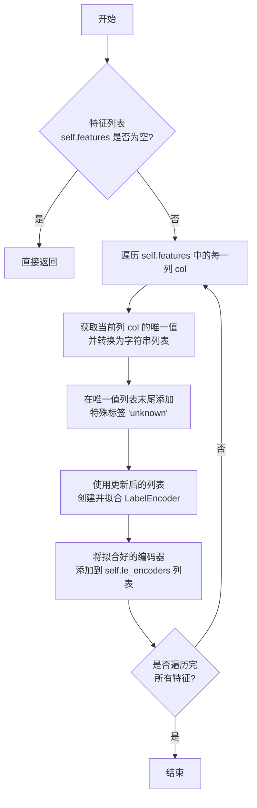

#### 带注释源码

```python
def fit(self, df: pd.DataFrame):
    # 检查是否有需要处理的特征列，如果没有则直接返回
    if len(self.features) == 0:
        return
    # 初始化存储编码器的列表
    self.le_encoders = []
    # 遍历每一个指定的分类特征列
    for col in self.features:
        # 为当前列创建一个 LabelEncoder
        # 使用该列的唯一值（转换为字符串）并加上 'unknown' 标签来拟合编码器
        # 这样做确保了在 transform 阶段遇到训练时未见过的值时，可以映射到 'unknown' 标签
        le = LabelEncoder().fit(df[col].astype(str).unique().tolist() + ["unknown"])
        # 将拟合好的编码器保存到列表中
        self.le_encoders.append(le)
```

### `LabelEncode.transform`

该方法用于对指定的分类列进行标签编码（Label Encoding）。它将每个分类值映射为一个唯一的整数。在转换过程中，如果遇到训练时未见过的类别，会将其统一映射为“unknown”标签。

参数：

- `df`：`pd.DataFrame`，需要进行标签编码的输入DataFrame。

返回值：`pd.DataFrame`，经过标签编码处理后的新DataFrame。

#### 流程图

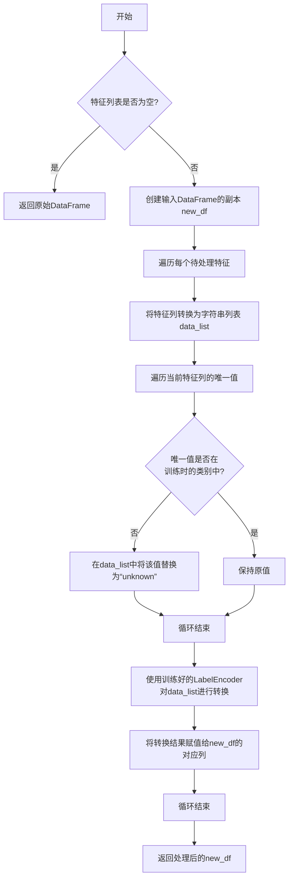

#### 带注释源码

```python
def transform(self, df: pd.DataFrame) -> pd.DataFrame:
    # 如果特征列表为空，则直接返回原始DataFrame，无需处理
    if len(self.features) == 0:
        return df
    # 创建输入DataFrame的副本，避免修改原始数据
    new_df = df.copy()
    # 遍历每个需要标签编码的特征列
    for i in range(len(self.features)):
        # 将当前特征列的值转换为字符串列表
        data_list = df[self.features[i]].astype(str).tolist()
        # 获取当前特征列的唯一值（字符串形式）
        for unique_item in np.unique(df[self.features[i]].astype(str)):
            # 检查该唯一值是否在训练时拟合的类别中
            if unique_item not in self.le_encoders[i].classes_:
                # 如果不在，则将该值在data_list中替换为“unknown”
                data_list = ["unknown" if x == unique_item else x for x in data_list]
        # 使用训练好的LabelEncoder对处理后的data_list进行转换（字符串->整数）
        new_df[self.features[i]] = self.le_encoders[i].transform(data_list)
    # 返回处理后的DataFrame
    return new_df
```

## 关键组件


### MLProcess 基类

定义了机器学习预处理流程的通用接口，包含 `fit`、`transform` 和 `fit_transform` 方法，为所有具体的数据预处理工具提供了统一的执行框架。

### DataPreprocessTool 工具基类

作为所有具体数据预处理工具的基类，封装了通用的 `fit` 和 `transform` 逻辑，管理需要处理的特征列 (`features`) 和底层的 scikit-learn 模型 (`model`)，实现了模板方法模式。

### FillMissingValue 缺失值填充工具

使用 `SimpleImputer` 对指定数值或分类特征列进行缺失值填充，支持均值 (`mean`)、中位数 (`median`)、众数 (`most_frequent`) 和常量 (`constant`) 等多种填充策略。

### MinMaxScale 最小-最大缩放工具

使用 `MinMaxScaler` 对指定数值特征列进行归一化处理，将每个特征的值线性缩放到 [0, 1] 区间。

### StandardScale 标准化缩放工具

使用 `StandardScaler` 对指定数值特征列进行标准化处理，通过移除均值并缩放到单位方差来使数据符合标准正态分布。

### MaxAbsScale 最大绝对值缩放工具

使用 `MaxAbsScaler` 对指定数值特征列进行缩放，将每个特征除以其最大绝对值，使数据范围落在 [-1, 1] 区间，且不破坏数据的稀疏性。

### RobustScale 鲁棒缩放工具

使用 `RobustScaler` 对指定数值特征列进行缩放，利用中位数和四分位数范围进行缩放，对数据中的异常值具有鲁棒性。

### OrdinalEncode 序数编码工具

使用 `OrdinalEncoder` 对指定的分类特征列进行序数编码，将类别转换为整数。

### OneHotEncode 独热编码工具

使用 `OneHotEncoder` 对指定的分类特征列进行独热编码，为每个类别创建新的二进制列，并自动处理训练时未见过的类别 (`handle_unknown='ignore'`)，同时会删除原始的特征列。

### LabelEncode 标签编码工具

使用 `LabelEncoder` 对指定的分类特征列进行标签编码（将类别映射为整数），并专门处理了训练集未出现的新类别，将其统一编码为 `"unknown"` 标签。

### get_column_info 列信息分析函数

分析输入 `DataFrame` 各列的数据类型，并将其自动分类为 `"Category"`（分类）、`"Numeric"`（数值）、`"Datetime"`（日期时间）和 `"Others"`（其他）四组，返回一个结构化的字典，用于指导后续的自动化预处理流程。


## 问题及建议


### 已知问题

-   **`LabelEncode` 类存在逻辑缺陷和潜在错误**：`fit` 方法使用 `df[col].astype(str).unique().tolist() + ["unknown"]` 来训练编码器，但在 `transform` 方法中，对于训练时未见过的类别，会将其替换为字符串 `"unknown"`。然而，`"unknown"` 字符串本身已被加入 `fit` 阶段的类别列表中，这会导致 `"unknown"` 被编码为一个特定的整数。如果原始数据中恰好包含 `"unknown"` 字符串，将引发混淆。此外，`transform` 中的循环逻辑（`for unique_item in np.unique(...)`）效率低下且可能出错，因为它试图在列表推导式中修改 `data_list`，但每次迭代都基于原始的 `df[self.features[i]]`，导致对 `data_list` 的修改在后续迭代中可能被覆盖。
-   **`get_column_info` 函数存在信息截断风险**：当列信息字典序列化后的 JSON 字符串长度超过 2000 字节时，会粗暴地截断 `Numeric` 列的列表（仅保留前5项并添加提示）。这会导致返回的信息不完整且不一致（只处理了数值列），可能影响依赖此函数进行自动化决策的上游逻辑。
-   **`DataPreprocessTool.fit` 和 `.transform` 方法对空特征列表的处理不一致**：`fit` 方法在 `self.features` 为空时直接返回，而 `transform` 方法返回原始 DataFrame 的副本。虽然结果看似一致，但这种实现上的差异可能在未来引入错误，且 `fit` 方法未设置 `self.model` 的状态，可能在某些场景下导致后续调用出错。
-   **`OneHotEncode.transform` 方法存在索引对齐隐患**：在创建转换后的 DataFrame (`ts_data`) 时，虽然指定了 `index=df.index`，但在与删除原特征列后的 `new_df` 进行 `pd.concat` 时，如果因某些原因（如之前的操作）导致索引不一致，仍可能引发错误。更稳健的做法是确保索引对齐或重置索引。
-   **类型提示不完整**：部分类（如 `MLProcess`, `DataPreprocessTool`）的 `model` 字段没有类型注解。`LabelEncode` 中的 `le_encoders` 字段也没有类型注解，这降低了代码的可读性和静态类型检查工具（如 mypy）的有效性。
-   **`DataPreprocessTool` 基类构造函数重复**：子类（如 `FillMissingValue`）重新定义了 `self.features = features`，而基类 `DataPreprocessTool.__init__` 已经做了同样的事情。这造成了冗余，且如果基类初始化逻辑变得更复杂，子类可能遗漏必要的初始化步骤。

### 优化建议

-   **重构 `LabelEncode` 类**：
    1.  修正 `fit` 逻辑：只基于训练数据中出现的唯一值（列表）来拟合 `LabelEncoder`。`"unknown"` 不应加入训练类别。
    2.  修正 `transform` 逻辑：使用 `pandas.Series.apply` 或向量化操作，对于不在 `encoder.classes_` 中的值，统一映射为一个特定的“未知”标识符（例如 `-1` 或 `len(encoder.classes_)`），而不是在列表上使用低效且易错的循环替换。确保处理逻辑清晰高效。
-   **改进 `get_column_info` 函数的信息截断策略**：
    1.  考虑更智能的截断方式，例如限制每个类别列表的长度，或计算并返回总列数、各类别列数等摘要信息，而不是直接截断列表内容。
    2.  如果必须截断以控制输出大小，应确保所有类别的列表都得到一致处理，并提供更明确的截断提示。
-   **统一空特征列表的处理逻辑**：考虑在 `DataPreprocessTool` 基类中，将 `self.features` 为空的情况作为特例，在 `fit` 和 `transform` 中采用更一致的处理方式（例如，`fit` 设为无操作，`transform` 返回副本），并确保 `self.model` 状态明确。
-   **增强 `OneHotEncode.transform` 的鲁棒性**：在连接 DataFrame 之前，可以显式检查或重置 `new_df` 和 `ts_data` 的索引，使用 `pd.concat(..., ignore_index=True)` 或确保它们来自同一原始索引，以避免潜在的索引对齐问题。
-   **补充类型注解**：为 `MLProcess.model`、`DataPreprocessTool.model` 以及 `LabelEncode.le_encoders` 等字段添加精确的类型注解（例如 `self.model: SimpleImputer | MinMaxScaler | ... | None = None`，或使用 `Union`/`|`）。这能显著提升代码的清晰度和可维护性。
-   **消除构造函数冗余**：移除子类中重复的 `self.features = features` 赋值语句，确保它们通过 `super().__init__(features)` 调用基类的初始化方法。这遵循了 DRY（Don‘t Repeat Yourself）原则，并使初始化逻辑集中在基类中。
-   **考虑增加输入验证**：在工具类的构造函数中，可以添加对 `features` 参数（如是否在提供的 DataFrame 中存在）和策略参数（如 `FillMissingValue.strategy` 与 `fill_value` 的兼容性）的验证，提前抛出有意义的错误信息。
-   **探索使用 `sklearn.compose.ColumnTransformer`**：对于涉及多个特征列且需要应用不同预处理器的复杂场景，可以考虑集成或借鉴 `ColumnTransformer` 的设计模式，以提供更灵活、更高效的列式处理管道。


## 其它


### 设计目标与约束

本模块的设计目标是提供一个统一、可扩展且易于使用的机器学习数据预处理工具集。其核心约束包括：
1.  **统一接口**：所有预处理工具继承自 `MLProcess` 基类，强制实现 `fit`, `transform`, `fit_transform` 方法，确保调用方式的一致性。
2.  **可扩展性**：通过 `DataPreprocessTool` 抽象基类封装通用逻辑（如特征列选择、模型适配），具体的预处理操作（如缩放、编码）通过继承并实现特定 `model` 来轻松扩展。
3.  **工具化集成**：所有具体工具类均使用 `@register_tool` 装饰器注册，旨在与更大的工具框架（如 `metagpt`）集成，便于自动发现和调用。
4.  **非侵入式操作**：`transform` 方法默认返回数据副本，避免修改原始输入数据，保证数据处理的纯净性。
5.  **轻量级与实用性**：封装 `scikit-learn` 的常用预处理组件，提供直接的、面向列的配置方式，降低使用门槛。

### 错误处理与异常设计

当前代码的错误处理策略较为基础，主要依赖底层库（如 `scikit-learn`, `pandas`）和Python解释器抛出的异常。存在以下设计点及潜在风险：
1.  **输入验证缺失**：工具类初始化时（如 `features` 列表为空或包含不存在的列名）及 `fit/transform` 时，缺乏对输入数据的有效性检查（如特征列是否存在、数据类型是否匹配策略）。
2.  **异常传播**：`fit` 和 `transform` 中的异常（如 `SimpleImputer` 对非数值列使用 `mean` 策略）会直接向上层抛出，由调用者处理。缺乏统一的、工具相关的异常类型。
3.  **`LabelEncode` 的特殊处理**：`LabelEncode.transform` 方法对未见过的类别进行了静默处理（替换为 `"unknown"` 并编码），这可能掩盖数据问题，且 `"unknown"` 标签的引入需要调用者知晓。
4.  **`OneHotEncode` 的潜在错误**：`handle_unknown='ignore'` 在 `transform` 时对未知类别会生成全零行，此行为需要文档明确说明。此外，拼接数据时依赖索引对齐，若索引混乱可能导致错误。
5.  **`get_column_info` 函数的容错**：该函数假设数据类型字符串格式固定，若 `pandas` 版本或特殊数据类型导致格式变化，解析可能失败。

### 数据流与状态机

模块的核心数据流围绕 `DataFrame` 的转换，并涉及对象的状态变化：
1.  **数据流**：
    *   **输入**：始终为 `pandas.DataFrame`。
    *   **处理**：根据 `features` 列表选择特定列，交由底层的 `scikit-learn` 模型（`model` 属性）进行处理。
    *   **输出**：返回一个新的、包含转换后列的 `pandas.DataFrame`。`OneHotEncode` 会删除原始列并添加新列，其他工具则原位替换。
2.  **对象状态机**：
    *   **未拟合状态**：初始化后，`model` 已实例化但未调用 `fit` 方法。此时调用 `transform` 会导致底层模型抛出异常（`sklearn` 惯例）。
    *   **已拟合状态**：成功调用 `fit` 方法后，`model` 内部存储了从训练数据中学到的参数（如均值、方差、类别映射）。`LabelEncode` 将编码器存储在 `le_encoders` 列表中。
    *   **转换状态**：在已拟合状态下，可反复调用 `transform` 方法对新的、具有相同特征结构的数据进行转换。
    *   **状态重置**：对象一旦拟合，其状态持续存在。目前没有提供 `reset` 或重新拟合的方法。要处理新数据集，需要创建新的工具实例。

### 外部依赖与接口契约

1.  **外部库依赖**：
    *   **`scikit-learn`**：核心依赖，提供了所有具体的预处理算法实现（`SimpleImputer`, 各种 `Scaler`, `Encoder`）。版本兼容性直接影响工具行为。
    *   **`pandas`**：用于数据容器和操作。工具接口强烈依赖于 `DataFrame` 的 API。
    *   **`numpy`**：被 `scikit-learn` 和部分工具（如 `LabelEncode`）间接使用。
    *   **`typing`**：用于类型注解，提高代码可读性和静态检查支持。
    *   **`metagpt.tools.tool_registry`**：提供了 `@register_tool` 装饰器，是本模块集成到外部框架的关键契约。工具必须符合其注册接口。

2.  **接口契约**：
    *   **`MLProcess` 抽象基类**：定义了所有预处理工具必须遵守的接口契约，即 `fit(df)`, `transform(df) -> df`, `fit_transform(df) -> df`。
    *   **`DataPreprocessTool` 基类**：定义了工具内部通用的字段（`features`, `model`）和 `fit`/`transform` 的默认流程，子类通过重写 `__init__` 来配置特定 `model`，或重写方法以改变行为（如 `OneHotEncode.transform`）。
    *   **`get_column_info` 函数**：提供了一个独立的、无状态的工具函数，其契约是接收一个 `DataFrame`，返回一个具有固定键（`Category`, `Numeric`, `Datetime`, `Others`）的字典。输出字典可能被截断以控制大小。

    