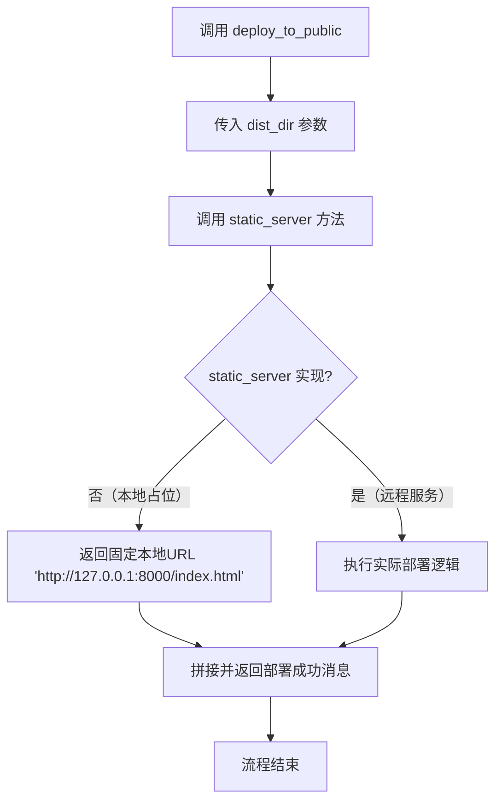
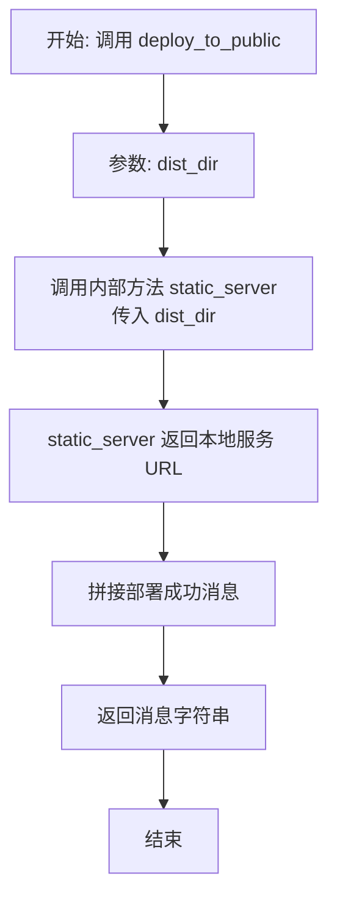
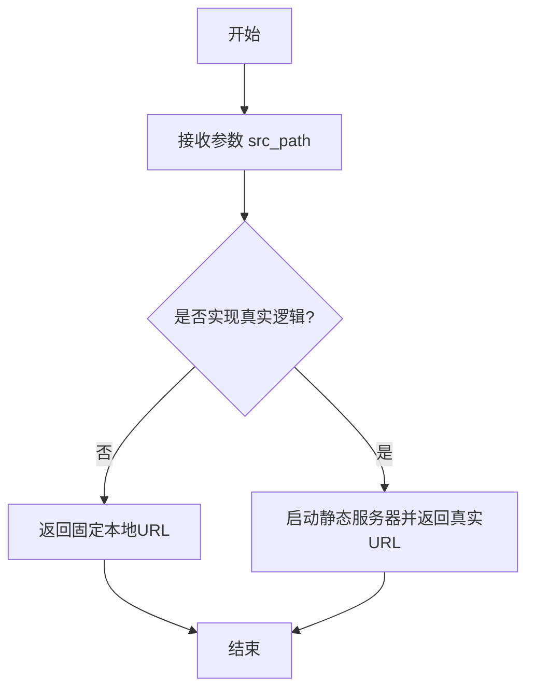

# `.\MetaGPT\metagpt\tools\libs\deployer.py` 详细设计文档

该代码定义了一个名为 Deployer 的工具类，其核心功能是提供一个占位符接口，用于将本地服务部署到公共环境。它通过装饰器注册为一个工具，包含一个占位符的静态服务器方法和一个主要的部署方法，后者调用前者并返回部署成功的消息。目前其核心功能（static_server）尚未实现，仅返回一个本地地址，表明这是一个为最终部署阶段预留的框架性组件。

## 整体流程



## 类结构

```
Deployer (部署工具类)
├── 字段: 无
└── 方法:
    ├── static_server (占位符静态服务器方法)
    └── deploy_to_public (主部署方法)
```

## 全局变量及字段


    

## 全局函数及方法

### `Deployer.deploy_to_public`

该方法用于将一个本地Web项目部署到公共环境。它通过调用内部的静态服务器方法，生成一个可公开访问的URL，并返回部署成功的消息。

参数：
- `dist_dir`：`str`，Web项目运行构建命令后生成的`dist`目录路径。

返回值：`str`，返回一个字符串，指示项目已成功部署到的URL。

#### 流程图



#### 带注释源码

```python
async def deploy_to_public(self, dist_dir: str):
    """
    将一个Web项目部署到公共环境。
    参数:
        dist_dir (str): Web项目运行构建命令后生成的dist目录路径。
    示例:
        >>> deployer = Deployer()
        >>> await deployer.deploy_to_public("2048_game/dist")
    """
    # 调用内部静态服务器方法，传入构建目录，获取一个可访问的URL
    url = await self.static_server(dist_dir)
    # 拼接并返回部署成功的消息
    return "The Project is deployed to: " + url + "\n Deployment successed!"
```

### `Deployer.static_server`

这是一个占位符方法，用于模拟将本地静态文件部署为一个可通过公共URL访问的静态服务器。在当前的实现中，它并未真正启动服务器，而是直接返回一个固定的本地回环地址。该方法被设计为在远程服务中实现其完整功能。

参数：
- `src_path`：`str`，本地静态文件或项目的源路径。

返回值：`str`，返回一个表示静态服务器访问地址的URL字符串。

#### 流程图



#### 带注释源码

```python
async def static_server(self, src_path: str) -> str:
    """此函数将在远程服务中实现其完整逻辑。
    当前版本仅返回一个固定的本地URL作为占位符。

    Args:
        src_path (str): 本地静态文件或项目的源路径。

    Returns:
        str: 静态服务器的访问URL。
    """
    # 占位符实现：直接返回一个固定的本地回环地址。
    # 在实际的远程服务中，这里应包含启动静态文件服务器（如使用nginx、Apache或Python的http.server）
    # 并返回生成的公共或内网可访问的URL的逻辑。
    return "http://127.0.0.1:8000/index.html"
```

### `Deployer.deploy_to_public`

该方法用于将一个本地构建完成的Web项目部署到公共环境。它通过调用一个内部方法启动一个静态文件服务器，并返回部署成功的消息及可访问的URL。

参数：

- `dist_dir`：`str`，Web项目构建完成后生成的`dist`目录的路径。

返回值：`str`，返回一个字符串，包含部署成功的消息和项目的公共访问URL。

#### 流程图

```mermaid
flowchart TD
    A[开始: deploy_to_public(dist_dir)] --> B[调用内部方法: self.static_server(dist_dir)]
    B --> C{等待异步调用结果}
    C --> D[获取服务器URL]
    D --> E[拼接成功消息与URL]
    E --> F[返回最终消息字符串]
    F --> G[结束]
```

#### 带注释源码

```python
async def deploy_to_public(self, dist_dir: str):
    """
    将一个Web项目部署到公共环境。
    参数:
        dist_dir (str): Web项目运行构建命令后生成的dist目录。
    示例:
        >>> deployer = Deployer()
        >>> await deployer.deploy_to_public("2048_game/dist")
    """
    # 调用内部静态服务器方法，传入构建目录路径，获取部署后的URL
    url = await self.static_server(dist_dir)
    # 拼接部署成功的提示信息与可访问的URL，并返回
    return "The Project is deployed to: " + url + "\n Deployment successed!"
```

## 关键组件


### 工具注册装饰器 (`register_tool`)

用于将 `Deployer` 类及其指定的方法注册到 MetaGPT 的工具注册表中，使其能够被系统发现和调用。

### 部署器类 (`Deployer`)

一个用于将本地服务部署到公共环境的工具类，其核心功能是通过一个静态文件服务器公开本地构建的 Web 项目。

### 静态服务器方法 (`static_server`)

一个占位符方法，旨在由远程服务实现，用于启动一个静态文件服务器并返回其访问 URL。

### 公共部署方法 (`deploy_to_public`)

部署流程的入口方法，它调用 `static_server` 方法来获取服务的公共访问地址，并返回部署成功的消息。


## 问题及建议


### 已知问题

-   **功能未实现**：`static_server` 方法明确注释为“将在远程服务中实现”，当前仅返回一个固定的本地地址，不具备实际的部署功能。
-   **硬编码返回值**：`static_server` 方法返回一个硬编码的本地 URL (`http://127.0.0.1:8000/index.html`)，这仅适用于演示或测试，无法反映真实的部署结果。
-   **缺乏错误处理**：代码中没有对输入参数（如 `dist_dir`）进行有效性验证，也没有处理部署过程中可能出现的异常（如目录不存在、权限不足、网络错误等）。
-   **同步/异步混用风险**：`deploy_to_public` 方法是异步的，但其实现依赖于另一个异步方法 `static_server`。虽然当前调用正确，但若未来修改或调用方使用不当，可能引发异步上下文问题。
-   **文档与实现不一致**：类文档字符串提到“仅用于最终部署，不应在开发和测试中使用”，但当前实现（返回本地地址）恰恰只适用于开发和测试场景，与设计目标矛盾。
-   **返回信息不明确**：`deploy_to_public` 方法返回的字符串拼接了部署 URL 和成功信息，但若 `static_server` 未来实现失败或返回错误，此格式可能无法清晰传达错误状态。

### 优化建议

-   **实现核心功能**：应实现 `static_server` 方法，或将其替换为调用真实部署服务（如云平台 API、容器编排工具、静态网站托管服务）的逻辑。
-   **移除硬编码**：部署生成的 URL 应基于实际部署结果动态生成，例如从部署服务的响应中提取公网访问地址。
-   **增强健壮性**：
    -   在 `deploy_to_public` 方法开始处验证 `dist_dir` 是否存在且是一个有效目录。
    -   使用 `try...except` 块捕获 `static_server` 调用及部署过程中可能抛出的异常，并转换为更有意义的错误信息或自定义异常向上抛出。
-   **明确异步设计**：确保整个异步调用链的完整性。考虑在 `deploy_to_public` 方法中添加更详细的异步操作日志，或在发生错误时正确清理可能已分配的资源。
-   **修正文档**：更新类和方法文档，以准确反映其当前（或计划中）的行为。如果它确实是一个占位符或适配器，应明确说明其预期用途和所需的后端服务。
-   **改进返回值**：考虑让 `deploy_to_public` 返回一个结构化的对象或字典，包含成功状态、部署的 URL、错误消息（如果有）等字段，以便调用方能更程序化地处理结果。
-   **考虑配置化**：部署目标（如服务器地址、认证信息）不应硬编码。建议通过构造函数参数、配置文件或环境变量传入，提高工具的灵活性和安全性。


## 其它


### 设计目标与约束

1.  **核心目标**：提供一个占位符/接口，用于将本地静态Web服务部署到公共环境。其核心价值在于定义一个标准化的部署操作入口，以便在工具链或自动化流程中集成。
2.  **主要约束**：
    *   **实现延迟**：`static_server` 方法的具体实现被推迟到远程服务中，当前代码库仅提供接口定义和调用框架。
    *   **使用阶段限制**：该工具明确设计用于最终部署阶段，禁止在开发与测试环境中使用，以避免产生不必要的公开服务或成本。
    *   **功能范围**：当前仅支持静态Web项目（通过`dist_dir`参数指定构建产物目录）的部署。

### 错误处理与异常设计

1.  **当前状态**：代码中未显式包含任何错误处理逻辑（如`try...except`块）或自定义异常。`deploy_to_public`方法假设其依赖的`static_server`调用总是成功。
2.  **潜在风险与改进**：
    *   **输入验证缺失**：未对`dist_dir`参数进行有效性检查（如路径是否存在、是否为目录、是否包含必要的静态文件）。
    *   **依赖调用失败**：当`static_server`方法（或其未来的远程实现）因网络、权限、资源不足等原因失败时，当前代码会直接抛出异常，导致部署流程中断，且无友好的错误信息反馈。
    *   **建议**：未来实现中应添加输入验证，并考虑在`deploy_to_public`方法中捕获`static_server`可能抛出的异常，将其转换为更具业务语义的异常或返回结构化的错误结果。

### 数据流与状态机

1.  **数据流**：
    *   **输入**：用户或调用者提供本地静态文件目录路径 (`dist_dir`)。
    *   **处理**：`Deployer.deploy_to_public` 接收路径，并调用 `Deployer.static_server`（占位方法，实际逻辑在远程）来启动服务并获取访问URL。
    *   **输出**：返回一个格式化的成功消息字符串，其中包含获取到的公共访问URL。
2.  **状态机**：该类本身不维护复杂的内部状态。其行为是**无状态的**，每次`deploy_to_public`调用都是独立的。部署动作触发的远程服务状态（如服务实例的创建、运行、停止）由未显示的远程实现管理，不在此组件的状态机范围内。

### 外部依赖与接口契约

1.  **外部依赖**：
    *   **`metagpt.tools.tool_registry.register_tool`**：这是一个框架级的装饰器，用于将此`Deployer`类注册到某个工具注册表中，使其能够被系统发现和调用。这是该代码运行的前提。
    *   **未来的远程服务**：`static_server` 方法的实际功能实现依赖于一个未在此代码库中定义的远程服务。这是最主要的、尚未实现的外部依赖。
2.  **接口契约**：
    *   **`deploy_to_public(dist_dir: str)`**：这是对外提供的主要服务契约。它承诺接收一个构建产物目录路径，并异步返回一个部署结果消息。调用者无需关心内部是通过`static_server`还是其他方式完成部署。
    *   **`static_server(src_path: str) -> str`**：这是一个内部/待实现的契约。它定义了`deploy_to_public`方法所依赖的子功能接口：接收一个源路径，返回一个可访问的URL。此契约的具体履行由“远程服务”负责。

### 安全与合规考虑

1.  **安全考虑**：
    *   **敏感信息暴露**：部署到公共网络可能暴露源代码、配置文件或敏感数据（如果`dist_dir`包含不应公开的文件）。当前代码未对目录内容做任何安全检查。
    *   **服务安全配置**：未来`static_server`的远程实现需要确保启动的服务具有适当的安全配置（如防火墙规则、HTTPS、访问控制），当前组件未涉及此方面。
2.  **合规考虑**：该工具可能用于部署面向公众的应用，因此最终实现必须考虑数据隐私法规（如GDPR）、内容审核等相关合规要求，这些均不在当前占位代码的考虑范围内。

### 部署与运维

1.  **部署模式**：`Deployer`类本身作为SDK或库的一部分被部署。其关键功能`static_server`的实际执行是远程的，意味着部署此代码无需部署后端服务，但调用它需要能访问到对应的远程服务端点。
2.  **运维监控**：当前设计未提供任何部署操作的日志、监控或度量指标。在生产环境中，需要远程服务实现或在此工具中添加日志记录，以跟踪部署请求的成功/失败、耗时等信息。
3.  **配置管理**：如何配置远程服务的连接信息（如端点URL、认证密钥）在当前代码中未体现。未来可能需要通过环境变量、配置文件或构造函数参数等方式注入。


    