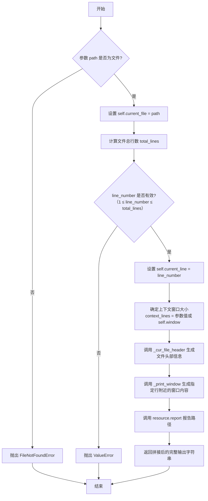
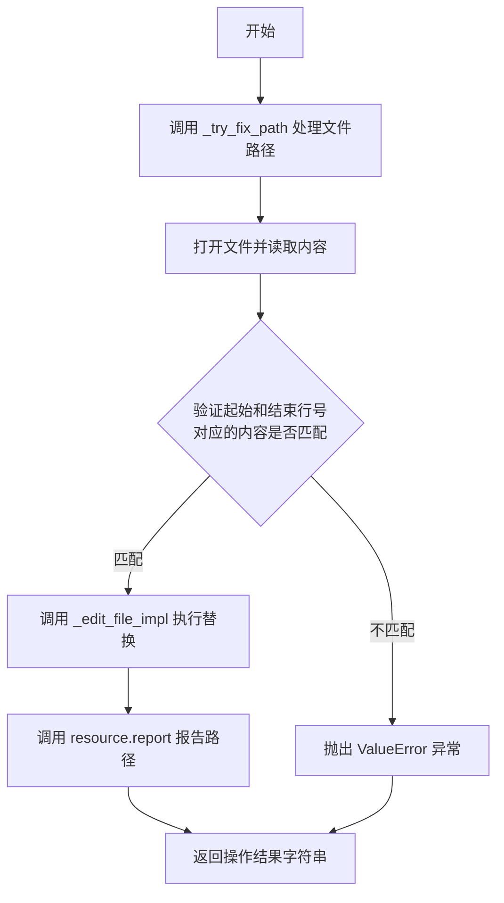
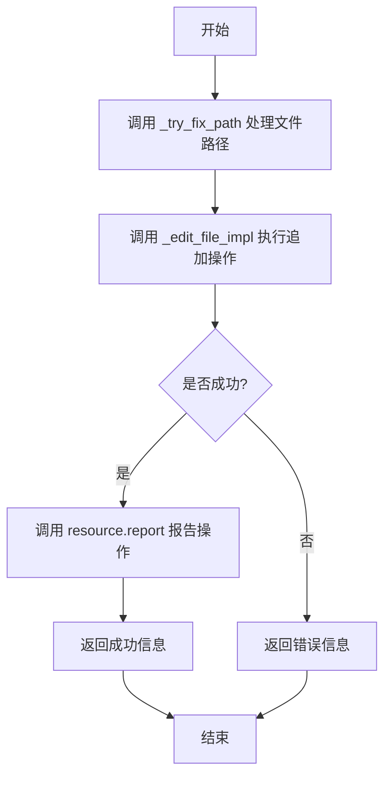
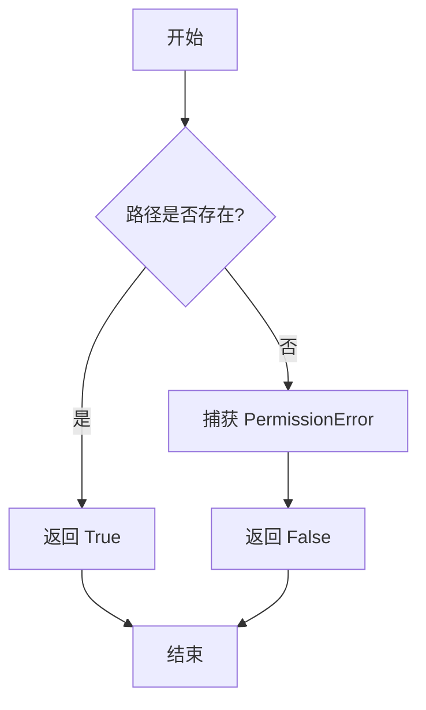

# `.\MetaGPT\metagpt\tools\libs\editor.py` 详细设计文档

该文件实现了一个功能完整的文件编辑器工具类（Editor），提供对本地文件的读取、写入、编辑、搜索等操作。它支持文本文件的打开、滚动浏览、行号定位、内容替换、插入、追加，以及基于正则表达式的搜索和模糊匹配。编辑器集成了语法检查（Linter）功能，可在编辑时自动检测语法错误，并提供详细的错误反馈和恢复机制。此外，它还支持大文件处理、路径修复、工作目录管理，并通过装饰器注册为可调用工具。

## 整体流程


## 类结构

```
BaseModel (Pydantic基类)
└── Editor (文件编辑器工具类)
独立类:
├── FileBlock (文件内容块数据模型)
└── LineNumberError (自定义异常类)
```

## 全局变量及字段


### `LINTER_ERROR_MSG`
    
用于在代码编辑引入语法错误时显示的通用错误消息模板。

类型：`str`
    


### `INDENTATION_INFO`
    
提供关于代码缩进错误的详细信息和建议修复方案的格式化字符串模板。

类型：`str`
    


### `ERROR_GUIDANCE`
    
在文件编辑失败时，用于向用户展示错误详情、修改前后代码对比以及修复指导的复合错误信息模板。

类型：`str`
    


### `LINE_NUMBER_AND_CONTENT_MISMATCH`
    
当用户提供的行号与对应行内容不匹配时，用于生成详细错误信息的格式化字符串模板。

类型：`str`
    


### `SUCCESS_EDIT_INFO`
    
文件编辑成功时，用于向用户展示更新后的文件片段和编辑位置的成功信息模板。

类型：`str`
    


### `FileBlock.file_path`
    
表示文件块所对应的文件系统路径。

类型：`str`
    


### `FileBlock.block_content`
    
表示从文件中读取的、带有行号前缀的文本内容块。

类型：`str`
    


### `Editor.resource`
    
用于报告编辑器操作（如打开文件、搜索）的辅助对象，负责记录和上报操作日志。

类型：`EditorReporter`
    


### `Editor.current_file`
    
当前在编辑器中打开并处于活动状态的文件路径，如果未打开文件则为None。

类型：`Optional[Path]`
    


### `Editor.current_line`
    
当前在编辑器视图中聚焦或光标所在的行号，用于导航和编辑操作。

类型：`int`
    


### `Editor.window`
    
定义在`open_file`、`goto_line`等操作中，围绕当前行显示的上下文行数（窗口大小）。

类型：`int`
    


### `Editor.enable_auto_lint`
    
控制是否在文件编辑操作后自动运行代码检查器（Linter）以检测语法错误的标志。

类型：`bool`
    


### `Editor.working_dir`
    
编辑器操作的基准工作目录，用于解析相对路径。

类型：`Path`
    
    

## 全局函数及方法

### `Editor.write`

将完整内容写入指定文件。此方法用于将整个文件内容一次性写入，确保`content`参数包含文件的完整内容。

参数：

- `path`：`str`，目标文件的路径（相对或绝对路径）
- `content`：`str`，要写入文件的完整内容

返回值：`str`，操作成功后的确认消息字符串

#### 流程图

```mermaid
flowchart TD
    A[开始: write(path, content)] --> B[调用 _try_fix_path 修正路径]
    B --> C{检查 content 中是否缺少实际换行符<br>但包含 '\\n'?}
    C -- 是 --> D[将 '\\n' 替换为 '\n']
    C -- 否 --> E
    D --> E[检查并创建目标目录]
    E --> F[以写入模式打开文件]
    F --> G[将 content 写入文件]
    G --> H[返回成功消息]
    H --> I[结束]
```

#### 带注释源码

```python
def write(self, path: str, content: str):
    """Write the whole content to a file. When used, make sure content arg contains the full content of the file."""

    # 1. 修正路径：如果路径是相对路径，则将其转换为相对于工作目录的绝对路径
    path = self._try_fix_path(path)

    # 2. 内容修正：一个原始规则，用于纠正内容中可能被错误表示的新行字符。
    #    如果 `content` 缺少实际的换行符 ('\n') 但包含 '\\n'，则将其替换为 '\n'。
    if "\n" not in content and "\\n" in content:
        content = content.replace("\\n", "\n")

    # 3. 目录处理：获取目标文件的目录路径，如果目录不存在则创建它。
    directory = os.path.dirname(path)
    if directory and not os.path.exists(directory):
        os.makedirs(directory)

    # 4. 文件写入：以 UTF-8 编码的写入模式打开文件，并将内容写入。
    with open(path, "w", encoding="utf-8") as f:
        f.write(content)

    # 5. 返回结果：返回一个确认消息，表明文件已成功创建/写入。
    return f"The writing/coding the of the file {os.path.basename(path)}' is now completed. The file '{os.path.basename(path)}' has been successfully created."
```

### `Editor.read`

异步读取指定文件的全部内容，并返回一个包含文件路径和格式化内容的`FileBlock`对象。如果文件过大（超过5倍默认最小令牌数），则返回错误提示信息，建议使用`similarity_search`方法替代。

参数：

- `path`：`str`，要读取的文件的路径（支持相对路径，会自动转换为基于工作目录的绝对路径）

返回值：`FileBlock`，包含文件路径和格式化后的内容（每行添加行号前缀）

#### 流程图

```mermaid
flowchart TD
    A[开始: read(path)] --> B[调用 _try_fix_path 标准化路径]
    B --> C{文件大小 > 5 * DEFAULT_MIN_TOKEN_COUNT?}
    C -- 是 --> D[返回错误 FileBlock<br>提示文件过大]
    C -- 否 --> E[异步读取文件内容]
    E --> F{内容为空?}
    F -- 是 --> G[返回空内容 FileBlock]
    F -- 否 --> H[调用 is_large_file 检查令牌数]
    H --> I{令牌数 >= DEFAULT_MIN_TOKEN_COUNT?}
    I -- 是 --> D
    I -- 否 --> J[调用 resource.report 报告路径]
    J --> K[为每行内容添加行号前缀]
    K --> L[构建并返回 FileBlock 对象]
    D --> M[结束]
    G --> M
    L --> M
```

#### 带注释源码

```python
async def read(self, path: str) -> FileBlock:
    """Read the whole content of a file. Using absolute paths as the argument for specifying the file location."""

    # 1. 标准化路径：将相对路径转换为基于工作目录的绝对路径
    path = self._try_fix_path(path)

    # 2. 预定义文件过大的错误返回对象
    error = FileBlock(
        file_path=str(path),
        block_content="The file is too large to read. Use `Editor.similarity_search` to read the file instead.",
    )
    path = Path(path)
    # 3. 基于文件物理大小进行初步判断
    if path.stat().st_size > 5 * DEFAULT_MIN_TOKEN_COUNT:
        return error
    # 4. 异步读取文件文本内容
    content = await File.read_text_file(path)
    # 5. 处理空内容情况
    if not content:
        return FileBlock(file_path=str(path), block_content="")
    # 6. 基于令牌数进行二次判断（更精确）
    if self.is_large_file(content=content):
        return error
    # 7. 向资源报告器报告文件路径（用于追踪或日志）
    self.resource.report(str(path), "path")

    # 8. 格式化内容：为每一行添加三位数的行号前缀（如 001|）
    lines = content.splitlines(keepends=True)
    lines_with_num = [f"{i + 1:03}|{line}" for i, line in enumerate(lines)]
    # 9. 构建并返回成功的 FileBlock 对象
    result = FileBlock(
        file_path=str(path),
        block_content="".join(lines_with_num),
    )
    return result
```

### `Editor.open_file`

打开指定路径的文件，并显示一个上下文窗口。如果提供了行号，窗口将移动到包含该行。默认显示前100行，最大支持2000行上下文行数，如需查看更多内容可使用 `scroll up/down` 方法。

参数：

- `path`：`Union[Path, str]`，要打开的文件的路径，建议使用绝对路径。
- `line_number`：`Optional[int]`，要移动到的行号，默认为1。
- `context_lines`：`Optional[int]`，在上下文窗口中显示的行数（通常从第1行开始），以 `line_number` 为中心（如果可能）。默认为100。

返回值：`str`，返回一个字符串，包含文件头部信息和指定行附近的上下文内容。

#### 流程图



#### 带注释源码

```python
def open_file(
    self, path: Union[Path, str], line_number: Optional[int] = 1, context_lines: Optional[int] = None
) -> str:
    """Opens the file at the given path in the editor. If line_number is provided, the window will be moved to include that line.
    It only shows the first 100 lines by default! Max `context_lines` supported is 2000, use `scroll up/down`
    to view the file if you want to see more.

    Args:
        path: str: The path to the file to open, preferred absolute path.
        line_number: int | None = 1: The line number to move to. Defaults to 1.
        context_lines: int | None = 100: Only shows this number of lines in the context window (usually from line 1), with line_number as the center (if possible). Defaults to 100.
    """
    # 如果未提供 context_lines，则使用实例的默认窗口大小
    if context_lines is None:
        context_lines = self.window

    # 尝试修正路径（例如，将相对路径转换为基于工作目录的绝对路径）
    path = self._try_fix_path(path)

    # 检查路径是否指向一个存在的文件
    if not path.is_file():
        raise FileNotFoundError(f"File {path} not found")

    # 设置当前打开的文件
    self.current_file = path
    # 计算文件的总行数
    with path.open() as file:
        total_lines = max(1, sum(1 for _ in file))

    # 验证行号参数的有效性
    if not isinstance(line_number, int) or line_number < 1 or line_number > total_lines:
        raise ValueError(f"Line number must be between 1 and {total_lines}")
    # 设置当前行号
    self.current_line = line_number

    # 确保 context_lines 是一个有效的正整数，否则使用默认窗口大小
    if context_lines is None or context_lines < 1:
        context_lines = self.window

    # 生成文件头部信息（如：[File: /path/to/file.py (150 lines total)]）
    output = self._cur_file_header(path, total_lines)
    # 生成并拼接指定行附近的窗口内容，限制最大显示行数为2000
    output += self._print_window(path, self.current_line, self._clamp(context_lines, 1, 2000))
    # 向资源报告器报告文件路径（可能用于日志或监控）
    self.resource.report(path, "path")
    # 返回完整的输出字符串
    return output
```

### `Editor.goto_line`

将编辑器窗口移动到指定行号，并显示该行及其上下文内容。

参数：

- `line_number`：`int`，要移动到的目标行号。

返回值：`str`，一个字符串，包含文件头信息和以目标行为中心的窗口内容。

#### 流程图


#### 带注释源码

```python
def goto_line(self, line_number: int) -> str:
    """Moves the window to show the specified line number.

    Args:
        line_number: int: The line number to move to.
    """
    # 1. 检查是否有文件已打开
    self._check_current_file()

    # 2. 读取当前打开文件的总行数
    with self.current_file.open() as file:
        total_lines = max(1, sum(1 for _ in file))
    # 3. 验证传入的行号参数是否在有效范围内（1 到 总行数）
    if not isinstance(line_number, int) or line_number < 1 or line_number > total_lines:
        raise ValueError(f"Line number must be between 1 and {total_lines}")

    # 4. 更新类的当前行号属性，确保其在有效范围内
    self.current_line = self._clamp(line_number, 1, total_lines)

    # 5. 生成包含文件路径和总行数的文件头信息
    output = self._cur_file_header(self.current_file, total_lines)
    # 6. 调用内部方法，生成以当前行为中心的窗口内容（行号+内容）
    output += self._print_window(self.current_file, self.current_line, self.window)
    # 7. 返回最终结果字符串
    return output
```

### `Editor.scroll_down`

将编辑器窗口向下滚动指定的行数（默认为200行），并返回滚动后窗口显示的内容。

参数：

- 无显式参数。该方法使用实例的 `current_line` 和 `window` 属性。

返回值：`str`，返回一个字符串，包含滚动后窗口的标题和内容预览。

#### 流程图


#### 带注释源码

```python
def scroll_down(self) -> str:
    """Moves the window down by 100 lines."""
    # 1. 检查是否有文件被打开
    self._check_current_file()

    # 2. 获取文件总行数
    with self.current_file.open() as file:
        total_lines = max(1, sum(1 for _ in file))
    # 3. 计算新的当前行号（向下滚动 window 行），并确保其在有效范围内（1 到 total_lines）
    self.current_line = self._clamp(self.current_line + self.window, 1, total_lines)
    # 4. 生成文件标题，格式为：[File: {文件路径} ({总行数} lines total)]
    output = self._cur_file_header(self.current_file, total_lines)
    # 5. 生成以新 current_line 为中心、大小为 window 的窗口内容，并拼接到输出
    output += self._print_window(self.current_file, self.current_line, self.window)
    # 6. 返回最终的字符串结果
    return output
```

### `Editor.scroll_up`

将编辑器窗口向上滚动100行，显示当前打开文件的前一部分内容。

参数：

- 无显式参数（方法使用实例的 `self` 参数）

返回值：`str`，返回一个字符串，包含滚动后窗口显示的文本内容，包括文件头信息和当前窗口范围内的行。

#### 流程图

```mermaid
flowchart TD
    A[开始] --> B{检查当前是否有文件打开?}
    B -- 否 --> C[抛出异常: 没有文件打开]
    B -- 是 --> D[读取文件总行数]
    D --> E[计算新的当前行号<br>self.current_line = max(1, self.current_line - self.window)]
    E --> F[生成文件头信息]
    F --> G[生成并返回包含新窗口内容的字符串]
    G --> H[结束]
```

#### 带注释源码

```python
def scroll_up(self) -> str:
    """Moves the window up by 100 lines."""
    # 1. 检查是否有文件被打开
    self._check_current_file()

    # 2. 读取当前打开文件的总行数
    with self.current_file.open() as file:
        total_lines = max(1, sum(1 for _ in file))
    # 3. 计算向上滚动后的新行号，确保在有效范围内（1 到 total_lines）
    self.current_line = self._clamp(self.current_line - self.window, 1, total_lines)
    # 4. 生成包含文件路径和总行数的头部信息
    output = self._cur_file_header(self.current_file, total_lines)
    # 5. 生成并拼接以新行号为中心、窗口大小为 self.window 的文本内容
    output += self._print_window(self.current_file, self.current_line, self.window)
    # 6. 返回最终的字符串
    return output
```

### `Editor.create_file`

该方法用于创建并打开一个新文件。如果文件已存在，则抛出异常；如果父目录不存在，则会自动创建。创建成功后，会调用 `open_file` 方法打开该文件。

参数：

- `filename`：`str`，要创建的文件名。可以是相对路径或绝对路径，如果是相对路径，会基于当前工作目录进行解析。

返回值：`str`，返回一个字符串消息，指示文件已成功创建。

#### 流程图

```mermaid
flowchart TD
    A[开始: create_file(filename)] --> B{文件是否存在?};
    B -- 是 --> C[抛出 FileExistsError];
    B -- 否 --> D[创建父目录<br>（如果需要）];
    D --> E[写入空内容到文件];
    E --> F[调用 open_file 打开文件];
    F --> G[返回成功消息];
    C --> H[结束];
    G --> H;
```

#### 带注释源码

```python
async def create_file(self, filename: str) -> str:
    """Creates and opens a new file with the given name.

    Args:
        filename: str: The name of the file to create. If the parent directory does not exist, it will be created.
    """
    # 1. 路径解析：将传入的文件名转换为绝对路径，基于当前工作目录。
    filename = self._try_fix_path(filename)

    # 2. 存在性检查：如果文件已存在，则抛出异常。
    if filename.exists():
        raise FileExistsError(f"File '{filename}' already exists.")
    
    # 3. 文件创建：使用异步写入函数创建一个包含单个换行符的空文件。
    await awrite(filename, "\n")

    # 4. 文件打开：调用 open_file 方法，将新创建的文件设置为当前文件。
    self.open_file(filename)
    
    # 5. 返回结果：返回一个确认文件已创建的消息。
    return f"[File {filename} created.]"
```

### `Editor.edit_file_by_replace`

该方法用于替换文件中指定行范围的内容。它首先验证提供的行号和内容是否与文件中的实际内容匹配，然后调用内部编辑实现来执行替换操作。如果启用了自动代码检查，还会在编辑后执行代码检查，并在发现语法错误时恢复原始文件。

参数：

- `file_name`：`str`，要编辑的文件名
- `first_replaced_line_number`：`int`，替换起始行号（从1开始）
- `first_replaced_line_content`：`str`，起始行应有的内容，用于验证
- `last_replaced_line_number`：`int`，替换结束行号（包含在内）
- `last_replaced_line_content`：`str`，结束行应有的内容，用于验证
- `new_content`：`str`，要替换成的新内容

返回值：`str`，编辑操作的执行结果信息，可能包含成功信息或错误提示

#### 流程图


#### 带注释源码

```python
def edit_file_by_replace(
    self,
    file_name: str,
    first_replaced_line_number: int,
    first_replaced_line_content: str,
    last_replaced_line_number: int,
    last_replaced_line_content: str,
    new_content: str,
) -> str:
    """
    Line numbers start from 1. Replace lines from start_line to end_line (inclusive) with the new_content in the open file.
    All of the new_content will be entered, so makesure your indentation is formatted properly.
    The new_content must be a complete block of code.

    Example 1:
    Given a file "/workspace/example.txt" with the following content:
    ```
    001|contain f
    002|contain g
    003|contain h
    004|contain i
    ```

    EDITING: If you want to replace line 2 and line 3

    edit_file_by_replace(
        "/workspace/example.txt",
        first_replaced_line_number=2,
        first_replaced_line_content="contain g",
        last_replaced_line_number=3,
        last_replaced_line_content="contain h",
        new_content="new content",
    )
    This will replace the second line 2 and line 3 with "new content".

    The resulting file will be:
    ```
    001|contain f
    002|new content
        003|contain i
    ```
    Example 2:
    Given a file "/workspace/example.txt" with the following content:
    ```
    001|contain f
    002|contain g
    003|contain h
    004|contain i
    ```
    EDITING: If you want to remove the line 2 and line 3.
    edit_file_by_replace(
        "/workspace/example.txt",
        first_replaced_line_number=2,
        first_replaced_line_content="contain g",
        last_replaced_line_number=3,
        last_replaced_line_content="contain h",
        new_content="",
    )
    This will remove line 2 and line 3.
    The resulting file will be:
    ```
    001|contain f
    002|
        003|contain i
    ```
    Args:
        file_name (str): The name of the file to edit.
        first_replaced_line_number (int): The line number to start the edit at, starting from 1.
        first_replaced_line_content (str): The content of the start replace line, according to the first_replaced_line_number.
        last_replaced_line_number (int): The line number to end the edit at (inclusive), starting from 1.
        last_replaced_line_content (str): The content of the end replace line, according to the last_replaced_line_number.
        new_content (str): The text to replace the current selection with, must conform to PEP8 standards. The content in the start line and end line will also be replaced.

    """

    file_name = self._try_fix_path(file_name)  # 修正文件路径，确保是绝对路径

    # Check if the first_replaced_line_number  and last_replaced_line_number  correspond to the appropriate content.
    mismatch_error = ""
    with file_name.open() as file:
        content = file.read()
        # Ensure the content ends with a newline character
        if not content.endswith("\n"):
            content += "\n"
        lines = content.splitlines(True)  # 按行分割，保留换行符
        total_lines = len(lines)
        check_list = [
            ("first", first_replaced_line_number, first_replaced_line_content),
            ("last", last_replaced_line_number, last_replaced_line_content),
        ]
        for position, line_number, line_content in check_list:
            # 验证提供的行号是否在文件范围内，且该行的内容是否与提供的匹配
            if line_number > len(lines) or lines[line_number - 1].rstrip() != line_content:
                start = max(1, line_number - 3)
                end = min(total_lines, line_number + 3)
                # 构建错误上下文信息，显示指定行号附近的几行内容
                context = "\n".join(
                    [
                        f'The {cur_line_number:03d} line is "{lines[cur_line_number-1].rstrip()}"'
                        for cur_line_number in range(start, end + 1)
                    ]
                )
                mismatch_error += LINE_NUMBER_AND_CONTENT_MISMATCH.format(
                    position=position,
                    line_number=line_number,
                    true_content=lines[line_number - 1].rstrip()
                    if line_number - 1 < len(lines)
                    else "OUT OF FILE RANGE!",
                    fake_content=line_content.replace("\n", "\\n"),
                    context=context.strip(),
                )
    if mismatch_error:
        raise ValueError(mismatch_error)  # 如果验证失败，抛出异常
    # 调用内部编辑实现执行实际的替换操作
    ret_str = self._edit_file_impl(
        file_name,
        start=first_replaced_line_number,
        end=last_replaced_line_number,
        content=new_content,
    )
    # TODO: automatically tries to fix linter error (maybe involve some static analysis tools on the location near the edit to figure out indentation)
    self.resource.report(file_name, "path")  # 报告文件操作
    return ret_str  # 返回编辑结果
```

### `Editor.edit_file_by_replace`

该方法用于替换文件中指定行范围内的内容。它首先验证提供的起始行号和结束行号对应的内容是否与参数中指定的内容匹配，以确保操作的准确性。如果验证通过，则调用内部方法 `_edit_file_impl` 执行实际的替换操作，并返回操作结果信息。

参数：

- `file_name`：`str`，要编辑的文件名。
- `first_replaced_line_number`：`int`，替换操作的起始行号（从1开始）。
- `first_replaced_line_content`：`str`，起始行号对应的预期内容。
- `last_replaced_line_number`：`int`，替换操作的结束行号（从1开始，包含该行）。
- `last_replaced_line_content`：`str`，结束行号对应的预期内容。
- `new_content`：`str`，用于替换指定行范围的新内容。

返回值：`str`，返回操作结果信息，可能包含成功编辑后的文件预览或错误提示。

#### 流程图



#### 带注释源码

```python
def edit_file_by_replace(
    self,
    file_name: str,
    first_replaced_line_number: int,
    first_replaced_line_content: str,
    last_replaced_line_number: int,
    last_replaced_line_content: str,
    new_content: str,
) -> str:
    """
    Line numbers start from 1. Replace lines from start_line to end_line (inclusive) with the new_content in the open file.
    All of the new_content will be entered, so makesure your indentation is formatted properly.
    The new_content must be a complete block of code.

    Example 1:
    Given a file "/workspace/example.txt" with the following content:
    ```
    001|contain f
    002|contain g
    003|contain h
    004|contain i
    ```

    EDITING: If you want to replace line 2 and line 3

    edit_file_by_replace(
        "/workspace/example.txt",
        first_replaced_line_number=2,
        first_replaced_line_content="contain g",
        last_replaced_line_number=3,
        last_replaced_line_content="contain h",
        new_content="new content",
    )
    This will replace the second line 2 and line 3 with "new content".

    The resulting file will be:
    ```
    001|contain f
    002|new content
        003|contain i
    ```
    Example 2:
    Given a file "/workspace/example.txt" with the following content:
    ```
    001|contain f
    002|contain g
    003|contain h
    004|contain i
    ```
    EDITING: If you want to remove the line 2 and line 3.
    edit_file_by_replace(
        "/workspace/example.txt",
        first_replaced_line_number=2,
        first_replaced_line_content="contain g",
        last_replaced_line_number=3,
        last_replaced_line_content="contain h",
        new_content="",
    )
    This will remove line 2 and line 3.
    The resulting file will be:
    ```
    001|contain f
    002|
        003|contain i
    ```
    Args:
        file_name (str): The name of the file to edit.
        first_replaced_line_number (int): The line number to start the edit at, starting from 1.
        first_replaced_line_content (str): The content of the start replace line, according to the first_replaced_line_number.
        last_replaced_line_number (int): The line number to end the edit at (inclusive), starting from 1.
        last_replaced_line_content (str): The content of the end replace line, according to the last_replaced_line_number.
        new_content (str): The text to replace the current selection with, must conform to PEP8 standards. The content in the start line and end line will also be replaced.

    """

    # 使用内部方法处理相对路径，转换为基于工作目录的绝对路径
    file_name = self._try_fix_path(file_name)

    # 检查 first_replaced_line_number 和 last_replaced_line_number 是否与相应的内容匹配。
    mismatch_error = ""
    with file_name.open() as file:
        content = file.read()
        # 确保内容以换行符结尾
        if not content.endswith("\n"):
            content += "\n"
        lines = content.splitlines(True)  # 保留行尾字符
        total_lines = len(lines)
        # 创建需要检查的（位置，行号，预期内容）元组列表
        check_list = [
            ("first", first_replaced_line_number, first_replaced_line_content),
            ("last", last_replaced_line_number, last_replaced_line_content),
        ]
        for position, line_number, line_content in check_list:
            # 检查行号是否超出文件范围，或者该行的实际内容（去除尾部空白）是否与预期内容不匹配
            if line_number > len(lines) or lines[line_number - 1].rstrip() != line_content:
                # 如果不匹配，则生成错误信息上下文，显示该行附近的内容
                start = max(1, line_number - 3)
                end = min(total_lines, line_number + 3)
                context = "\n".join(
                    [
                        f'The {cur_line_number:03d} line is "{lines[cur_line_number-1].rstrip()}"'
                        for cur_line_number in range(start, end + 1)
                    ]
                )
                # 构建错误信息字符串，指出哪个位置的行号和内容不匹配
                mismatch_error += LINE_NUMBER_AND_CONTENT_MISMATCH.format(
                    position=position,
                    line_number=line_number,
                    true_content=lines[line_number - 1].rstrip()
                    if line_number - 1 < len(lines)
                    else "OUT OF FILE RANGE!",
                    fake_content=line_content.replace("\n", "\\n"),
                    context=context.strip(),
                )
    # 如果存在任何不匹配的错误信息，则抛出 ValueError 异常
    if mismatch_error:
        raise ValueError(mismatch_error)
    # 所有验证通过，调用内部实现方法执行文件编辑
    ret_str = self._edit_file_impl(
        file_name,
        start=first_replaced_line_number,
        end=last_replaced_line_number,
        content=new_content,
    )
    # TODO: 自动尝试修复 linter 错误（可能涉及使用静态分析工具分析编辑位置附近的缩进）
    # 向资源报告器报告文件路径（可能用于日志或监控）
    self.resource.report(file_name, "path")
    # 返回编辑操作的结果字符串
    return ret_str
```

### `Editor.insert_content_at_line`

在指定文件的特定行号前插入一段完整代码块。新内容将从指定行的行首开始插入，该行原有的内容将向下移动。此操作不会修改指定行前后行的内容。此函数不能用于在文件末尾插入内容，如需在末尾添加内容，请使用 `append_file` 方法。

参数：

- `file_name`：`str`，要编辑的文件名。
- `line_number`：`int`，要插入内容的目标行号（从1开始计数）。新内容将插入在 `line_number-1` 行和 `line_number` 行之间。
- `insert_content`：`str`，要插入的代码内容。该内容必须是一个完整的代码块。

返回值：`str`，返回一个字符串，描述操作结果。如果成功，则包含更新后的文件窗口内容；如果失败，则包含详细的错误信息和指导。

#### 流程图


#### 带注释源码

```python
def insert_content_at_line(self, file_name: str, line_number: int, insert_content: str) -> str:
    """Insert a complete block of code before the given line number in a file. That is, the new content will start at the beginning of the specified line, and the existing content of that line will be moved down.
    This operation will NOT modify the content of the lines before or after the given line number.
    This function can not insert content the end of the file. Please use append_file instead,
    For example, if the file has the following content:
    ```
    001|contain g
    002|contain h
    003|contain i
    004|contain j
    ```
    and you call
    insert_content_at_line(
        file_name='file.txt',
        line_number=2,
        insert_content='new line'
    )
    the file will be updated to:
    ```
    001|contain g
    002|new line
        003|contain h
        004|contain i
        005|contain j
    ```

    Args:
        file_name: (str): The name of the file to edit.
        line_number (int): The line number (starting from 1) to insert the content after. The insert content will be add between the line of line_number-1 and line_number
        insert_content (str): The content to insert betweed the previous_line_content and current_line_content.The insert_content must be a complete block of code at.

    NOTE:
        This tool is exclusive. If you use this tool, you cannot use any other commands in the current response.
        If you need to use it multiple times, wait for the next turn.
    """
    # 修正文件路径，将相对路径转换为基于工作目录的绝对路径
    file_name = self._try_fix_path(file_name)
    # 调用内部编辑实现方法，指定操作为插入（is_insert=True）
    ret_str = self._edit_file_impl(
        file_name,
        start=line_number,      # 插入的起始行号
        end=line_number,        # 插入的结束行号（与起始相同，表示在单行前插入）
        content=insert_content, # 要插入的内容
        is_insert=True,         # 标志此为插入操作
        is_append=False,        # 非追加操作
    )
    # 向资源报告器报告此次操作的文件路径，用于可能的跟踪或日志记录
    self.resource.report(file_name, "path")
    # 返回操作结果字符串（成功信息或错误信息）
    return ret_str
```

### `Editor.append_file`

将指定内容追加到给定文件的末尾。

参数：

- `file_name`：`str`，要编辑的文件名
- `content`：`str`，要追加的内容

返回值：`str`，操作结果信息，包含成功信息或错误提示

#### 流程图



#### 带注释源码

```python
def append_file(self, file_name: str, content: str) -> str:
    """Append content to the given file.
    It appends text `content` to the end of the specified file.

    Args:
        file_name: str: The name of the file to edit.
        content: str: The content to insert.
    NOTE:
        This tool is exclusive. If you use this tool, you cannot use any other commands in the current response.
        If you need to use it multiple times, wait for the next turn.
    """
    # 处理文件路径，确保是绝对路径
    file_name = self._try_fix_path(file_name)
    # 调用内部编辑实现方法，设置 is_append=True 表示追加操作
    ret_str = self._edit_file_impl(
        file_name,
        start=None,
        end=None,
        content=content,
        is_insert=False,
        is_append=True,
    )
    # 报告文件操作路径
    self.resource.report(file_name, "path")
    # 返回操作结果
    return ret_str
```

### `Editor.search_dir`

在指定目录及其子目录的所有文件中搜索指定的字符串，并返回包含该字符串的文件路径、行号和行内容。

参数：

- `search_term`：`str`，要搜索的字符串
- `dir_path`：`str`，要搜索的目录路径，默认为当前目录（"./"）

返回值：`str`，包含搜索结果的格式化字符串。如果没有找到匹配项，返回提示信息；如果匹配的文件过多（超过100个），返回警告信息。

#### 流程图

```mermaid
flowchart TD
    A[开始: search_dir(search_term, dir_path)] --> B{dir_path 是否为有效目录?}
    B -- 否 --> C[抛出 FileNotFoundError]
    B -- 是 --> D[初始化 matches 列表]
    D --> E[遍历 dir_path 下所有文件<br>（使用 os.walk）]
    E --> F{文件是否以 '.' 开头?}
    F -- 是 --> G[跳过隐藏文件]
    F -- 否 --> H[打开文件并逐行读取]
    H --> I{当前行是否包含 search_term?}
    I -- 否 --> J[继续读取下一行]
    I -- 是 --> K[将 (文件路径, 行号, 行内容) 加入 matches]
    J --> H
    K --> H
    G --> E
    E --> L[遍历结束]
    L --> M{matches 列表是否为空?}
    M -- 是 --> N[返回“未找到匹配项”信息]
    M -- 否 --> O[计算匹配的文件数量]
    O --> P{匹配的文件数 > 100?}
    P -- 是 --> Q[返回“匹配文件过多”警告]
    P -- 否 --> R[格式化结果字符串]
    R --> S[返回结果字符串]
    C --> T[结束]
    N --> T
    Q --> T
    S --> T
```

#### 带注释源码

```python
def search_dir(self, search_term: str, dir_path: str = "./") -> str:
    """Searches for search_term in all files in dir. If dir is not provided, searches in the current directory.

    Args:
        search_term: str: The term to search for.
        dir_path: str: The path to the directory to search.
    """
    # 1. 路径处理：将相对路径转换为基于工作目录的绝对路径
    dir_path = self._try_fix_path(dir_path)
    # 2. 目录存在性检查
    if not dir_path.is_dir():
        raise FileNotFoundError(f"Directory {dir_path} not found")
    # 3. 初始化结果列表
    matches = []
    # 4. 递归遍历目录树
    for root, _, files in os.walk(dir_path):
        for file in files:
            # 4.1 跳过隐藏文件（以 '.' 开头的文件）
            if file.startswith("."):
                continue
            # 4.2 构建文件的完整路径
            file_path = Path(root) / file
            # 4.3 打开文件并逐行搜索（忽略编码错误）
            with file_path.open("r", errors="ignore") as f:
                for line_num, line in enumerate(f, 1):
                    # 4.4 检查搜索词是否在当前行中
                    if search_term in line:
                        # 4.5 记录匹配项：文件路径、行号、去除首尾空白的行内容
                        matches.append((file_path, line_num, line.strip()))
    # 5. 处理搜索结果
    if not matches:
        # 5.1 无匹配项：返回提示信息
        return f'No matches found for "{search_term}" in {dir_path}'
    # 5.2 计算统计信息：总匹配数和涉及的文件数
    num_matches = len(matches)
    num_files = len(set(match[0] for match in matches))
    # 5.3 匹配文件过多检查：如果超过100个文件，返回警告以避免输出过大
    if num_files > 100:
        return f'More than {num_files} files matched for "{search_term}" in {dir_path}. Please narrow your search.'
    # 5.4 构建格式化结果字符串
    # 5.4.1 添加结果头部信息
    res_list = [f'[Found {num_matches} matches for "{search_term}" in {dir_path}]']
    # 5.4.2 遍历所有匹配项，格式化为“文件路径 (行号): 行内容”
    for file_path, line_num, line in matches:
        res_list.append(f"{file_path} (Line {line_num}): {line}")
    # 5.4.3 添加结果尾部信息
    res_list.append(f'[End of matches for "{search_term}" in {dir_path}]')
    # 5.5 将结果列表连接为字符串并返回
    return "\n".join(res_list)
```

### `Editor.search_file`

在指定文件中搜索包含特定字符串的行。如果未提供文件路径，则在当前打开的文件中搜索。返回包含匹配行号及内容的格式化结果。

参数：

- `search_term`：`str`，要搜索的字符串
- `file_path`：`Optional[str]`，要搜索的文件路径。如果为None，则搜索当前打开的文件

返回值：`str`，包含搜索结果的格式化字符串

#### 流程图

```mermaid
flowchart TD
    A[开始] --> B{file_path是否为None?}
    B -->|是| C[使用self.current_file]
    B -->|否| D[使用_try_fix_path处理路径]
    C --> E{文件是否存在?}
    D --> E
    E -->|否| F[抛出FileNotFoundError]
    E -->|是| G[打开文件并逐行搜索]
    G --> H{是否找到匹配?}
    H -->|否| I[返回"未找到匹配"信息]
    H -->|是| J[收集所有匹配行<br>行号和内容]
    J --> K[格式化搜索结果]
    K --> L[调用self.resource.report报告]
    L --> M[返回格式化结果]
    I --> M
```

#### 带注释源码

```python
def search_file(self, search_term: str, file_path: Optional[str] = None) -> str:
    """Searches for search_term in file. If file is not provided, searches in the current open file.

    Args:
        search_term: str: The term to search for.
        file_path: str | None: The path to the file to search.
    """
    # 如果未提供文件路径，使用当前打开的文件
    if file_path is None:
        file_path = self.current_file
    else:
        # 处理相对路径，转换为绝对路径
        file_path = self._try_fix_path(file_path)
    
    # 检查文件是否存在
    if file_path is None:
        raise FileNotFoundError("No file specified or open. Use the open_file function first.")
    if not file_path.is_file():
        raise FileNotFoundError(f"File {file_path} not found")

    matches = []
    # 打开文件并逐行搜索
    with file_path.open() as file:
        for i, line in enumerate(file, 1):
            if search_term in line:
                # 收集匹配的行号和内容（去除首尾空白）
                matches.append((i, line.strip()))
    
    res_list = []
    if matches:
        # 如果有匹配，添加头部信息
        res_list.append(f'[Found {len(matches)} matches for "{search_term}" in {file_path}]')
        for match in matches:
            # 格式化每一条匹配结果
            res_list.append(f"Line {match[0]}: {match[1]}")
        # 添加尾部信息
        res_list.append(f'[End of matches for "{search_term}" in {file_path}]')
    else:
        # 如果没有匹配，返回相应信息
        res_list.append(f'[No matches found for "{search_term}" in {file_path}]')

    # 准备额外信息用于报告
    extra = {"type": "search", "symbol": search_term, "lines": [i[0] - 1 for i in matches]} if matches else None
    # 调用资源报告器记录搜索操作
    self.resource.report(file_path, "path", extra=extra)
    
    # 将结果列表连接为字符串返回
    return "\n".join(res_list)
```

### `Editor.find_file`

在指定目录及其子目录中递归搜索所有文件名包含给定字符串的文件，并返回匹配的文件路径列表。

参数：

- `file_name`：`str`，要查找的文件名（可以是部分匹配）
- `dir_path`：`str`，要搜索的目录路径，默认为当前目录（"./"）

返回值：`str`，包含匹配结果的格式化字符串，每行一个文件路径

#### 流程图

```mermaid
graph TD
    A[开始: find_file] --> B[路径标准化处理]
    B --> C{目录是否存在?}
    C -->|否| D[抛出FileNotFoundError]
    C -->|是| E[初始化匹配列表matches]
    E --> F[遍历目录树 os.walk]
    F --> G[遍历当前目录文件]
    G --> H{文件名是否包含目标字符串?}
    H -->|是| I[将完整路径加入matches]
    H -->|否| J[继续下一个文件]
    I --> J
    J --> K{是否遍历完所有文件?}
    K -->|否| G
    K -->|是| L{是否遍历完所有目录?}
    L -->|否| F
    L -->|是| M{是否有匹配结果?}
    M -->|是| N[构建结果字符串<br>包含匹配数量和路径列表]
    M -->|否| O[构建"未找到"结果字符串]
    N --> P[返回结果字符串]
    O --> P
    D --> P
```

#### 带注释源码

```python
def find_file(self, file_name: str, dir_path: str = "./") -> str:
    """Finds all files with the given name in the specified directory.

    Args:
        file_name: str: The name of the file to find.
        dir_path: str: The path to the directory to search.
    """
    # 使用_try_fix_path方法将相对路径转换为基于工作目录的绝对路径
    file_name = self._try_fix_path(file_name)
    dir_path = self._try_fix_path(dir_path)
    
    # 检查目标目录是否存在
    if not dir_path.is_dir():
        raise FileNotFoundError(f"Directory {dir_path} not found")

    # 初始化匹配结果列表
    matches = []
    # 使用os.walk递归遍历目录树
    for root, _, files in os.walk(dir_path):
        for file in files:
            # 检查文件名是否包含目标字符串（部分匹配）
            if str(file_name) in file:
                # 将完整路径添加到匹配列表
                matches.append(Path(root) / file)

    # 构建返回结果字符串
    res_list = []
    if matches:
        # 如果有匹配结果，添加头部信息
        res_list.append(f'[Found {len(matches)} matches for "{file_name}" in {dir_path}]')
        # 遍历所有匹配路径，每行一个
        for match in matches:
            res_list.append(f"{match}")
        # 添加尾部信息
        res_list.append(f'[End of matches for "{file_name}" in {dir_path}]')
    else:
        # 如果没有匹配结果
        res_list.append(f'[No matches found for "{file_name}" in {dir_path}]')
    
    # 将结果列表连接成字符串返回
    return "\n".join(res_list)
```

### `Editor.similarity_search`

这是一个静态方法，用于在指定的文件或路径中，对给定的查询字符串执行相似性搜索。它通过索引仓库进行搜索，处理文件簇，并合并来自结构化索引和非索引文件的搜索结果。

参数：

- `query`：`str`，要搜索的查询字符串。
- `path`：`Union[str, Path]`，要搜索的文件路径或目录路径。

返回值：`List[str]`，一个字符串列表，包含合并后的搜索结果文本。

#### 流程图

```mermaid
flowchart TD
    A[开始: Editor.similarity_search(query, path)] --> B{尝试导入 IndexRepo};
    B -- 成功 --> C[调用 IndexRepo.cross_repo_search(query, path)];
    C --> D[返回搜索结果列表];
    B -- 失败 --> E[抛出 ImportError];
    E --> F[结束];
    D --> F;
```

#### 带注释源码

```python
    @staticmethod
    async def similarity_search(query: str, path: Union[str, Path]) -> List[str]:
        """Given a filename or a pathname, performs a similarity search for a given query across the specified file or path.

        This method searches the index repository for the provided query, classifying the specified
        files or paths. It performs a search on each cluster of files and handles non-indexed files
        separately, merging results from structured indices with any direct results from non-indexed files.
        This function call does not depend on other functions.

        Args:
            query (str): The search query string to look for in the indexed files.
            path (Union[str, Path]): A pathname or filename to search within.

        Returns:
            List[str]: A list of results as strings, containing the text from the merged results
                        and any direct results from non-indexed files.

        Example:
            >>> query = "The problem to be analyzed from the document"
            >>> file_or_path = "The pathname or filename you want to search within"
            >>> texts: List[str] = await Editor.similarity_search(query=query, path=file_or_path)
            >>> print(texts)
        """
        try:
            # 尝试导入 IndexRepo 模块，该模块负责实际的索引和搜索逻辑
            from metagpt.tools.libs.index_repo import IndexRepo

            # 调用 IndexRepo 的跨仓库搜索方法，传入查询和路径参数
            return await IndexRepo.cross_repo_search(query=query, file_or_path=path)
        except ImportError:
            # 如果 IndexRepo 模块未安装，则抛出 ImportError 异常
            raise ImportError("To use the similarity search, you need to install the RAG module.")
```

### `Editor._is_valid_filename`

该方法用于验证给定的文件名是否有效，主要检查文件名是否为空或仅包含空白字符，以及是否包含操作系统特定的非法字符。

参数：

- `file_name`：`str`，待验证的文件名字符串。

返回值：`bool`，如果文件名有效则返回 `True`，否则返回 `False`。

#### 流程图


#### 带注释源码

```python
@staticmethod
def _is_valid_filename(file_name: str) -> bool:
    # 检查文件名是否为空或仅包含空白字符
    if not file_name or not file_name.strip():
        return False
    # 根据操作系统定义非法字符集
    invalid_chars = '<>:"/\\|?*'
    if os.name == "nt":  # Windows 系统
        invalid_chars = '<>:"/\\|?*'
    elif os.name == "posix":  # Unix-like 系统 (如 Linux, macOS)
        invalid_chars = "\0"
    # 遍历非法字符集，检查文件名中是否包含任何非法字符
    for char in invalid_chars:
        if char in file_name:
            return False
    # 如果通过所有检查，则文件名有效
    return True
```

### `Editor._is_valid_path`

该方法用于检查给定的路径是否有效。它通过验证路径是否存在来判断其有效性，并在遇到权限错误时返回 `False`。

参数：

- `path`：`Path`，需要验证的路径对象。

返回值：`bool`，如果路径存在且可访问则返回 `True`，否则返回 `False`。

#### 流程图



#### 带注释源码

```python
@staticmethod
def _is_valid_path(path: Path) -> bool:
    try:
        # 尝试检查路径是否存在
        return path.exists()
    except PermissionError:
        # 如果遇到权限错误，返回 False
        return False
```

### `Editor._create_paths`

该方法用于创建指定文件路径的父目录。如果父目录不存在，则递归创建；如果已存在，则不做任何操作。该方法主要用于在写入或编辑文件前确保目标路径的目录结构存在。

参数：

- `file_path`：`Path`，需要创建父目录的目标文件路径。

返回值：`bool`，如果目录创建成功或已存在，返回 `True`；如果因权限问题创建失败，返回 `False`。

#### 流程图


#### 带注释源码

```python
@staticmethod
def _create_paths(file_path: Path) -> bool:
    """
    静态方法，用于创建指定文件路径的父目录。
    如果父目录不存在，则递归创建；如果已存在，则不做任何操作。
    主要用于在写入或编辑文件前确保目标路径的目录结构存在。

    参数:
        file_path (Path): 需要创建父目录的目标文件路径。

    返回值:
        bool: 如果目录创建成功或已存在，返回 True；如果因权限问题创建失败，返回 False。
    """
    try:
        # 检查文件路径是否有父目录（即不是根目录）
        if file_path.parent:
            # 递归创建父目录，如果目录已存在则忽略（exist_ok=True）
            file_path.parent.mkdir(parents=True, exist_ok=True)
        # 目录创建成功或已存在，返回 True
        return True
    except PermissionError:
        # 如果因权限不足无法创建目录，捕获异常并返回 False
        return False
```

### `Editor._check_current_file`

该方法用于检查当前是否有文件在编辑器中打开。如果未指定文件路径，则检查 `self.current_file`；如果指定了文件路径，则检查该路径。如果文件不存在或未打开，则抛出 `ValueError` 异常。

参数：

- `file_path`：`Optional[Path]`，可选的文件路径。如果为 `None`，则检查 `self.current_file`。

返回值：`bool`，如果文件存在且为有效文件，则返回 `True`。

#### 流程图


#### 带注释源码

```python
def _check_current_file(self, file_path: Optional[Path] = None) -> bool:
    # 如果未提供 file_path 参数，则使用当前打开的文件（self.current_file）
    if file_path is None:
        file_path = self.current_file
    # 检查文件路径是否存在且指向一个文件（而非目录）
    if not file_path or not file_path.is_file():
        # 如果文件不存在或未打开，抛出 ValueError 异常
        raise ValueError("No file open. Use the open_file function first.")
    # 文件检查通过，返回 True
    return True
```

### `Editor._clamp`

一个通用的数值钳制（clamp）静态方法，用于确保给定的值落在指定的最小值和最大值范围内。

参数：

- `value`：`Any`，需要被钳制的原始数值
- `min_value`：`Any`，允许的最小值
- `max_value`：`Any`，允许的最大值

返回值：`Any`，钳制后的值，确保在 `min_value` 和 `max_value` 之间（包含边界）

#### 流程图

```mermaid
flowchart TD
    A[开始: 输入 value, min_value, max_value] --> B{value < min_value?}
    B -- 是 --> C[返回 min_value]
    B -- 否 --> D{value > max_value?}
    D -- 是 --> E[返回 max_value]
    D -- 否 --> F[返回 value]
    C --> G[结束]
    E --> G
    F --> G
```

#### 带注释源码

```python
    @staticmethod
    def _clamp(value, min_value, max_value):
        # 使用 max 和 min 函数确保 value 被限制在 [min_value, max_value] 区间内
        # 首先取 value 和 min_value 的较大者，再与 max_value 取较小者
        return max(min_value, min(value, max_value))
```

### `Editor._lint_file`

该方法用于对指定路径的文件进行代码检查（linting），并返回检查结果。如果文件存在语法错误，则返回错误信息和第一个错误的行号；如果检查通过，则返回 `None`。

参数：

- `file_path`：`Path`，需要检查的文件路径。

返回值：`tuple[Optional[str], Optional[int]]`，返回一个元组，第一个元素是错误信息字符串（如果没有错误则为 `None`），第二个元素是第一个错误的行号（如果没有错误则为 `None`）。

#### 流程图

```mermaid
flowchart TD
    A[开始] --> B[创建 Linter 实例]
    B --> C[调用 linter.lint 方法检查文件]
    C --> D{是否有错误？}
    D -->|是| E[返回错误信息和第一个错误行号]
    D -->|否| F[返回 None, None]
    E --> G[结束]
    F --> G
```

#### 带注释源码

```python
def _lint_file(self, file_path: Path) -> tuple[Optional[str], Optional[int]]:
    """Lint the file at the given path and return a tuple with a boolean indicating if there are errors,
    and the line number of the first error, if any.

    Returns:
        tuple[str | None, int | None]: (lint_error, first_error_line_number)
    """

    # 1. 创建 Linter 实例，并设置工作目录为当前 Editor 的工作目录
    linter = Linter(root=self.working_dir)
    # 2. 调用 linter.lint 方法对指定文件进行代码检查
    lint_error = linter.lint(str(file_path))
    # 3. 判断检查结果
    if not lint_error:
        # 3.1 如果没有错误，返回 (None, None)
        return None, None
    # 3.2 如果有错误，返回错误信息字符串和第一个错误的行号
    #     错误信息以 "ERRORS:\n" 开头，后面拼接 lint_error.text
    return "ERRORS:\n" + lint_error.text, lint_error.lines[0]
```

### `Editor._print_window`

该方法用于在编辑器中显示指定文件的一个窗口区域，围绕目标行号展示上下文内容。它会读取文件，计算并截取一个以目标行为中心的窗口（窗口大小由参数指定），然后格式化输出，包括行号、内容以及文件边界提示。

参数：

- `file_path`：`Path`，要显示的文件路径。
- `targeted_line`：`int`，目标行号，窗口将以此行为中心。
- `window`：`int`，窗口大小，即要显示的总行数。

返回值：`str`，格式化后的字符串，包含指定窗口内的文件内容、行号以及文件边界提示。

#### 流程图

```mermaid
flowchart TD
    A[开始: _print_window] --> B{检查文件是否已打开?}
    B -- 否 --> C[抛出异常]
    B -- 是 --> D[打开文件并读取全部内容]
    D --> E[确保内容以换行符结尾]
    E --> F[将内容分割为行列表]
    F --> G[计算总行数]
    G --> H[将目标行号钳制在1到总行数之间]
    H --> I[计算半窗口大小]
    I --> J[计算窗口起始和结束行号]
    J --> K[调整起始和结束行号<br>确保至少有一行上下文]
    K --> L[初始化输出字符串]
    L --> M{起始行 > 1?}
    M -- 是 --> N[添加“更多行在上方”提示]
    M -- 否 --> O[添加“这是文件开头”提示]
    N --> P
    O --> P[循环遍历起始到结束行]
    P --> Q[格式化行号与内容]
    Q --> R{结束行 < 总行数?}
    R -- 是 --> S[添加“更多行在下方”提示]
    R -- 否 --> T[添加“这是文件结尾”提示]
    S --> U[去除输出字符串末尾空白]
    T --> U
    U --> V[返回格式化后的字符串]
    C --> V
```

#### 带注释源码

```python
def _print_window(self, file_path: Path, targeted_line: int, window: int):
    # 1. 检查当前是否有文件打开
    self._check_current_file(file_path)
    # 2. 打开文件并读取全部内容
    with file_path.open() as file:
        content = file.read()

        # 3. 确保内容以换行符结尾，便于后续行分割
        if not content.endswith("\n"):
            content += "\n"

        # 4. 将内容分割为行列表，保留行尾字符
        lines = content.splitlines(True)  # Keep all line ending characters
        total_lines = len(lines)

        # 5. 将目标行号钳制在有效范围内（1 到 total_lines）
        self.current_line = self._clamp(targeted_line, 1, total_lines)
        # 6. 计算半窗口大小，至少为1
        half_window = max(1, window // 2)

        # 7. 计算窗口的起始和结束行号
        start = max(1, self.current_line - half_window)
        end = min(total_lines, self.current_line + half_window)

        # 8. 调整起始和结束行号，确保至少有一行上下文
        if start == 1:
            end = min(total_lines, start + window - 1)
        if end == total_lines:
            start = max(1, end - window + 1)

        output = ""

        # 9. 根据起始行位置添加文件边界提示
        if start > 1:
            output += f"({start - 1} more lines above)\n"
        else:
            output += "(this is the beginning of the file)\n"
        # 10. 遍历窗口内的每一行，格式化输出（行号: 内容）
        for i in range(start, end + 1):
            _new_line = f"{i:03d}|{lines[i - 1]}"
            if not _new_line.endswith("\n"):
                _new_line += "\n"
            output += _new_line
        # 11. 根据结束行位置添加文件边界提示
        if end < total_lines:
            output += f"({total_lines - end} more lines below)\n"
        else:
            output += "(this is the end of the file)\n"
        # 12. 去除输出字符串末尾的空白字符并返回
        output = output.rstrip()

        return output
```

### `Editor._cur_file_header`

这是一个静态方法，用于生成当前打开文件的头部信息字符串。它接收文件路径和总行数作为输入，返回一个格式化的字符串，用于在编辑器界面中显示文件的基本信息。

参数：

- `current_file`：`Path`，表示当前打开的文件的路径对象。
- `total_lines`：`int`，表示当前文件的总行数。

返回值：`str`，返回一个格式化的字符串，格式为 `[File: {文件绝对路径} ({总行数} lines total)]\n`。如果 `current_file` 为 `None` 或空，则返回空字符串。

#### 流程图

```mermaid
flowchart TD
    A[开始] --> B{current_file 是否有效?}
    B -- 否 --> C[返回空字符串]
    B -- 是 --> D[获取文件的绝对路径]
    D --> E[格式化字符串]
    E --> F[返回格式化后的字符串]
    F --> G[结束]
```

#### 带注释源码

```python
    @staticmethod
    def _cur_file_header(current_file: Path, total_lines: int) -> str:
        # 检查当前文件路径是否有效（非None且非空）
        if not current_file:
            # 如果无效，返回空字符串
            return ""
        # 使用文件的绝对路径和总行数，格式化生成文件头部信息字符串
        return f"[File: {current_file.resolve()} ({total_lines} lines total)]\n"
```

### `Editor._set_workdir`

该方法用于设置编辑器实例的当前工作目录。它接受一个路径字符串作为参数，并将其转换为 `Path` 对象后赋值给实例的 `working_dir` 属性。这是一个简单的设置器方法，主要用于在打开文件前配置基础工作路径。

参数：

- `path`：`str`，要设置为工作目录的路径字符串。

返回值：`None`，此方法不返回任何值。

#### 流程图

```mermaid
flowchart TD
    A[开始] --> B[接收路径参数 path]
    B --> C[将 path 转换为 Path 对象]
    C --> D[将 Path 对象赋值给 self.working_dir]
    D --> E[结束]
```

#### 带注释源码

```python
def _set_workdir(self, path: str) -> None:
    """
    Sets the working directory to the given path. eg: repo directory.
    You MUST to set it up before open the file.

    Args:
        path: str: The path to set as the working directory.
    """
    # 将传入的路径字符串转换为 Path 对象，并赋值给实例的 working_dir 属性
    self.working_dir = Path(path)
```

### `Editor._append_impl`

这是一个静态方法，用于处理向文件内容列表追加新内容的内部逻辑。它接收原始文件的行列表和要追加的内容字符串，返回合并后的新文件内容字符串以及实际添加的行数。该方法会智能地处理文件为空或末尾缺少换行符的情况，确保生成的内容格式正确。

参数：

- `lines`：`list[str]`，原始文件按行分割后的列表，每个元素为一行文本（可能包含换行符）。
- `content`：`str`，要追加到文件末尾的新内容字符串。

返回值：`tuple[str, int]`，返回一个元组，第一个元素是合并后的完整文件内容字符串，第二个元素是实际添加到文件中的新行数。

#### 流程图

```mermaid
flowchart TD
    A[开始: 输入 lines, content] --> B{文件是否为空或仅含空行?}
    B -- 是 --> C[将content作为新文件内容]
    B -- 否 --> D{最后一行是否以换行符结尾?}
    D -- 否 --> E[为最后一行添加换行符]
    D -- 是 --> F[保持lines不变]
    E --> F
    F --> G[将content_lines追加到lines后]
    C --> H[计算新增行数 n_added_lines]
    G --> H
    H --> I[拼接所有行生成最终内容]
    I --> J[返回 (content, n_added_lines)]
```

#### 带注释源码

```python
    @staticmethod
    def _append_impl(lines, content):
        """Internal method to handle appending to a file.

        Args:
            lines: list[str]: The lines in the original file.
            content: str: The content to append to the file.

        Returns:
            content: str: The new content of the file.
            n_added_lines: int: The number of lines added to the file.
        """
        # 将要追加的内容按行分割，保留行尾的换行符。
        content_lines = content.splitlines(keepends=True)
        # 计算新增的行数。
        n_added_lines = len(content_lines)
        # 检查原始文件是否非空（排除仅有一行且为空行的情况）。
        if lines and not (len(lines) == 1 and lines[0].strip() == ""):
            # file is not empty
            # 如果最后一行没有以换行符结尾，则为其添加一个换行符，确保格式正确。
            if not lines[-1].endswith("\n"):
                lines[-1] += "\n"
            # 将原始行与新内容行合并。
            new_lines = lines + content_lines
            # 将所有行拼接成一个字符串。
            content = "".join(new_lines)
        else:
            # file is empty
            # 如果文件为空，则新内容就是追加的内容。
            content = "".join(content_lines)

        # 返回合并后的内容和新增的行数。
        return content, n_added_lines
```

### `Editor._insert_impl`

这是一个静态方法，用于在文件的指定行号处插入内容。它接收原始文件的行列表、插入的起始行号和要插入的内容，返回新的文件内容字符串和插入的行数。如果起始行号无效，会抛出 `LineNumberError` 异常。

参数：

- `lines`：`list[str]`，原始文件按行分割后的列表。
- `start`：`int``，插入的起始行号（从1开始计数）。
- `content`：`str`，要插入的内容。

返回值：`tuple[str, int]`，返回一个元组，包含插入后的新文件内容字符串和插入的行数。

#### 流程图

```mermaid
flowchart TD
    A[开始: 输入 lines, start, content] --> B{文件是否为空?<br>len(lines) == 0}
    B -- 是 --> C[new_lines = ]
    B -- 否 --> D{文件是否仅有一行且为空?<br>len(lines)==1 and lines[0].strip()==''}
    D -- 是 --> E[lines = []]
    D -- 否 --> F
    E --> F{起始行号 start 是否有效?<br>start is not None}
    F -- 是 --> G[new_lines = lines[:start-1] +  + lines[start-1:]]
    F -- 否 --> H[抛出 LineNumberError 异常]
    C --> I[content = ''.join(new_lines)]
    G --> I
    I --> J[n_added_lines = len(inserted_lines)]
    J --> K[返回 (content, n_added_lines)]
    H --> L[结束]
    K --> L
```

#### 带注释源码

```python
    @staticmethod
    def _insert_impl(lines, start, content):
        """Internal method to handle inserting to a file.

        Args:
            lines: list[str]: The lines in the original file.
            start: int: The start line number for inserting.
            content: str: The content to insert to the file.

        Returns:
            content: str: The new content of the file.
            n_added_lines: int: The number of lines added to the file.

        Raises:
            LineNumberError: If the start line number is invalid.
        """
        # 将插入内容处理成列表，确保其以换行符结尾
        inserted_lines = [content + "\n" if not content.endswith("\n") else content]
        # 情况1: 文件内容为空
        if len(lines) == 0:
            new_lines = inserted_lines
        # 情况2: 提供了有效的起始行号
        elif start is not None:
            # 特殊情况: 文件只有一行且该行为空行，视为空文件处理
            if len(lines) == 1 and lines[0].strip() == "":
                lines = []

            # 再次检查，处理完特殊情况后文件是否为空
            if len(lines) == 0:
                new_lines = inserted_lines
            else:
                # 核心插入逻辑: 将内容插入到 start-1 索引的位置
                new_lines = lines[: start - 1] + inserted_lines + lines[start - 1 :]
        # 情况3: 起始行号无效
        else:
            raise LineNumberError(
                f"Invalid line number: {start}. Line numbers must be between 1 and {len(lines)} (inclusive)."
            )
        # 将新的行列表合并成字符串
        content = "".join(new_lines)
        # 计算插入的行数
        n_added_lines = len(inserted_lines)
        return content, n_added_lines
```

### `Editor._edit_impl`

`Editor._edit_impl` 是一个静态方法，用于处理文件编辑的核心逻辑。它接收原始文件内容（按行分割的列表）、要替换的起始行号、结束行号以及新的内容，然后执行替换操作，并返回更新后的文件内容字符串以及新增的行数。该方法假设调用者已经验证了输入参数的有效性（例如，行号在有效范围内，起始行号不大于结束行号）。

参数：

- `lines`：`List[str]`，原始文件按行分割后的列表，每行包含换行符。
- `start`：`int`，要替换的起始行号（从1开始计数）。
- `end`：`int`，要替换的结束行号（从1开始计数）。
- `content`：`str`，用于替换指定行范围的新内容。

返回值：`tuple[str, int]`，返回一个元组，第一个元素是更新后的完整文件内容字符串，第二个元素是新增的行数（即新内容分割后的行数）。

#### 流程图

```mermaid
flowchart TD
    A[开始: 接收 lines, start, end, content] --> B{参数检查<br>1 <= start <= len(lines)<br>1 <= end <= len(lines)<br>start <= end}
    B -- 检查通过 --> C[确保 content 以换行符结尾]
    C --> D[将 content 按行分割为 content_lines]
    D --> E[计算新增行数 n_added_lines = len(content_lines)]
    E --> F[构建新行列表 new_lines:<br>lines[:start-1] + content_lines + lines[end:]]
    F --> G[处理原始文件为空的情况]
    G --> H[将 new_lines 连接为字符串 content]
    H --> I[返回 (content, n_added_lines)]
    B -- 检查失败 --> J[抛出 LineNumberError 异常]
    J --> K[结束]
    I --> K
```

#### 带注释源码

```python
    @staticmethod
    def _edit_impl(lines, start, end, content):
        """Internal method to handle editing a file.

        REQUIRES (should be checked by caller):
            start <= end
            start and end are between 1 and len(lines) (inclusive)
            content ends with a newline

        Args:
            lines: list[str]: The lines in the original file.
            start: int: The start line number for editing.
            end: int: The end line number for editing.
            content: str: The content to replace the lines with.

        Returns:
            content: str: The new content of the file.
            n_added_lines: int: The number of lines added to the file.
        """
        # Handle cases where start or end are None
        if start is None:
            start = 1  # Default to the beginning
        if end is None:
            end = len(lines)  # Default to the end
        # Check arguments
        if not (1 <= start <= len(lines)):
            raise LineNumberError(
                f"Invalid start line number: {start}. Line numbers must be between 1 and {len(lines)} (inclusive)."
            )
        if not (1 <= end <= len(lines)):
            raise LineNumberError(
                f"Invalid end line number: {end}. Line numbers must be between 1 and {len(lines)} (inclusive)."
            )
        if start > end:
            raise LineNumberError(f"Invalid line range: {start}-{end}. Start must be less than or equal to end.")

        # Split content into lines and ensure it ends with a newline
        if not content.endswith("\n"):
            content += "\n"
        content_lines = content.splitlines(True)

        # Calculate the number of lines to be added
        n_added_lines = len(content_lines)

        # Remove the specified range of lines and insert the new content
        new_lines = lines[: start - 1] + content_lines + lines[end:]

        # Handle the case where the original lines are empty
        if len(lines) == 0:
            new_lines = content_lines

        # Join the lines to create the new content
        content = "".join(new_lines)
        return content, n_added_lines
```

### `Editor._get_indentation_info`

该方法用于分析并生成关于代码缩进的指导信息。它计算指定插入行及其前一行的缩进空格数，并生成一个格式化字符串，其中包含这些信息以及调整缩进的建议（例如，建议增加或减少4个空格），以帮助用户修正可能因缩进不当导致的语法错误。

参数：

- `content`：`str`，包含代码的完整字符串。
- `first_line`：`int`，要分析的插入行的行号（从1开始计数）。

返回值：`str`，一个格式化的字符串，包含前一行的内容及其缩进、插入行的内容及其缩进，以及调整缩进的建议。

#### 流程图

```mermaid
flowchart TD
    A[开始] --> B[将content按行分割为列表]
    B --> C{first_line - 2 >= 0?}
    C -- 是 --> D[获取前一行内容pre_line]
    C -- 否 --> E[设置pre_line为空字符串]
    D --> F[计算pre_line的缩进空格数pre_line_indent]
    E --> F
    F --> G[获取插入行内容insert_line]
    G --> H[计算insert_line的缩进空格数insert_line_indent]
    H --> I[使用INDENTATION_INFO模板格式化字符串]
    I --> J[返回格式化后的字符串]
    J --> K[结束]
```

#### 带注释源码

```python
def _get_indentation_info(self, content, first_line):
    """
    获取插入行及其前一行的缩进信息，并生成指导信息。
    
    Args:
        content (str): 包含代码的完整字符串。
        first_line (int): 插入行的行号（从1开始计数）。
    
    Returns:
        str: 格式化的缩进信息字符串，包含前后行内容、缩进空格数及调整建议。
    """
    # 将内容按行分割，便于按行号访问
    content_lines = content.split("\n")
    
    # 获取插入行的前一行内容，如果行号有效；否则设为空字符串
    pre_line = content_lines[first_line - 2] if first_line - 2 >= 0 else ""
    
    # 计算前一行的缩进空格数：总长度减去去除左侧空格后的长度
    pre_line_indent = len(pre_line) - len(pre_line.lstrip())
    
    # 获取插入行的内容
    insert_line = content_lines[first_line - 1]
    
    # 计算插入行的缩进空格数
    insert_line_indent = len(insert_line) - len(insert_line.lstrip())
    
    # 使用预定义的模板格式化返回字符串，包含前后行内容、缩进信息及调整建议
    ret_str = INDENTATION_INFO.format(
        pre_line=pre_line,
        pre_line_indent=pre_line_indent,
        insert_line=insert_line,
        insert_line_indent=insert_line_indent,
        sub_4_space=max(insert_line_indent - 4, 0),  # 建议减少的缩进（至少为0）
        add_4_space=insert_line_indent + 4,          # 建议增加的缩进
    )
    return ret_str
```

### `Editor._edit_file_impl`

`_edit_file_impl` 是 `Editor` 类的核心内部方法，负责执行文件编辑、插入和追加操作的通用逻辑。它通过原子操作（使用临时文件）确保文件修改的安全性，并在启用自动代码检查（linting）时验证修改后的代码语法。该方法处理了从参数验证、内容修改、临时文件写入、原子替换到错误处理和结果报告的全流程。

参数：

- `file_name`：`Path`，要编辑的目标文件的路径对象。
- `start`：`Optional[int]`，编辑操作的起始行号（从1开始）。对于插入操作，表示插入位置；对于编辑操作，表示替换范围的起始行。
- `end`：`Optional[int]`，编辑操作的结束行号（从1开始）。仅用于编辑操作，表示替换范围的结束行（包含）。
- `content`：`str`，要写入的新内容字符串。
- `is_insert`：`bool`，指示操作是否为插入（True）而非替换（False）。
- `is_append`：`bool`，指示操作是否为追加到文件末尾（True）。

返回值：`str`，返回一个字符串，描述操作结果。成功时包含文件更新后的预览窗口信息；失败时包含详细的错误信息、修改前后的代码对比以及修复指导。

#### 流程图

```mermaid
flowchart TD
    A[开始: _edit_file_impl] --> B{参数验证<br>文件名、路径、权限}
    B -->|无效| C[抛出异常<br>FileNotFoundError/PermissionError]
    B -->|有效| D{操作类型检查<br>is_insert 与 is_append}
    D -->|同时为True| E[抛出 ValueError]
    D -->|合法| F[创建临时备份文件]
    F --> G{是否启用自动Lint?<br>self.enable_auto_lint}
    G -->|是| H[Lint原始文件<br>记录原始错误]
    G -->|否| I[跳过Lint检查]
    H --> I
    I --> J[读取原始文件内容为行列表]
    J --> K{根据操作类型调用内部实现}
    K -->|is_append=True| L[调用 _append_impl]
    K -->|is_insert=True| M[调用 _insert_impl]
    K -->|默认编辑| N[调用 _edit_impl]
    L & M & N --> O[生成新内容<br>计算新增行数]
    O --> P[写入新内容到临时文件]
    P --> Q[原子操作: 移动临时文件覆盖原文件]
    Q --> R{是否启用自动Lint?}
    R -->|是| S[Lint修改后的文件]
    S --> T{存在新引入的语法错误?}
    T -->|是| U[生成错误对比信息与指导]
    U --> V[恢复备份文件到原路径]
    V --> W[返回错误信息]
    T -->|无新错误| X[清理备份文件]
    R -->|否| X
    X --> Y[计算并更新当前行号]
    Y --> Z[生成成功编辑信息与窗口预览]
    Z --> AA[返回成功信息]
    
    style A fill:#e1f5e1
    style AA fill:#e1f5e1
    style C fill:#ffcccb
    style E fill:#ffcccb
    style W fill:#ffcccb
```

#### 带注释源码

```python
    def _edit_file_impl(
        self,
        file_name: Path,
        start: Optional[int] = None,
        end: Optional[int] = None,
        content: str = "",
        is_insert: bool = False,
        is_append: bool = False,
    ) -> str:
        """Internal method to handle common logic for edit_/append_file methods.

        Args:
            file_name: Path: The name of the file to edit or append to.
            start: int | None = None: The start line number for editing. Ignored if is_append is True.
            end: int | None = None: The end line number for editing. Ignored if is_append is True.
            content: str: The content to replace the lines with or to append.
            is_insert: bool = False: Whether to insert content at the given line number instead of editing.
            is_append: bool = False: Whether to append content to the file instead of editing.
        """

        # 预定义的错误消息模板
        ERROR_MSG = f"[Error editing file {file_name}. Please confirm the file is correct.]"
        ERROR_MSG_SUFFIX = (
            "Your changes have NOT been applied. Please fix your edit command and try again.\n"
            "You either need to 1) Open the correct file and try again or 2) Specify the correct line number arguments.\n"
            "DO NOT re-run the same failed edit command. Running it again will lead to the same error."
        )

        # 1. 参数验证阶段
        if not self._is_valid_filename(file_name.name):
            raise FileNotFoundError("Invalid file name.")
        if not self._is_valid_path(file_name):
            raise FileNotFoundError("Invalid path or file name.")
        if not self._create_paths(file_name):
            raise PermissionError("Could not access or create directories.")
        if not file_name.is_file():
            raise FileNotFoundError(f"File {file_name} not found.")
        if is_insert and is_append:
            raise ValueError("Cannot insert and append at the same time.")

        # 初始化变量
        content = str(content or "")
        temp_file_path = ""
        src_abs_path = file_name.resolve()
        first_error_line = None
        # 创建临时备份文件，用于在Lint失败时恢复原内容
        temp_backup_file = tempfile.NamedTemporaryFile("w", delete=True)

        try:
            # 2. 预处理与Lint检查（如果启用）
            original_lint_error = None
            if self.enable_auto_lint:
                original_lint_error, _ = self._lint_file(file_name)

            # 3. 创建临时文件并执行编辑操作
            with tempfile.NamedTemporaryFile("w", delete=False) as temp_file:
                temp_file_path = temp_file.name
                # 读取原始文件内容
                with file_name.open() as original_file:
                    lines = original_file.readlines()

                # 根据操作类型调用不同的内部实现
                if is_append:
                    content, n_added_lines = self._append_impl(lines, content)
                elif is_insert:
                    try:
                        content, n_added_lines = self._insert_impl(lines, start, content)
                    except LineNumberError as e:
                        return (f"{ERROR_MSG}\n" f"{e}\n" f"{ERROR_MSG_SUFFIX}") + "\n"
                else:
                    try:
                        content, n_added_lines = self._edit_impl(lines, start, end, content)
                    except LineNumberError as e:
                        return (f"{ERROR_MSG}\n" f"{e}\n" f"{ERROR_MSG_SUFFIX}") + "\n"

                # 确保内容以换行符结尾
                if not content.endswith("\n"):
                    content += "\n"
                # 将新内容写入临时文件
                temp_file.write(content)

            # 4. 原子操作：用临时文件替换原文件
            shutil.move(temp_file_path, src_abs_path)

            # 5. 后处理与Lint验证（如果启用）
            if self.enable_auto_lint:
                # 将原始内容写入备份文件
                temp_backup_file.writelines(lines)
                temp_backup_file.flush()
                # Lint修改后的文件
                lint_error, first_error_line = self._lint_file(file_name)

                # 筛选出由本次修改新引入的语法错误
                if original_lint_error and lint_error:
                    lint_error = subtract_strings(original_lint_error, lint_error)
                    if lint_error == "":
                        lint_error = None
                        first_error_line = None

                # 如果存在新引入的错误，则回滚修改并报告错误
                if lint_error is not None:
                    # 确定在错误信息中展示的代码行范围
                    if is_append:
                        show_line = len(lines)  # 原文件末尾
                    elif start is not None and end is not None:
                        show_line = int((start + end) / 2)  # 编辑范围中间行
                    else:
                        raise ValueError("Invalid state. This should never happen.")

                    # 生成缩进指导和错误对比信息
                    guidance_message = self._get_indentation_info(content, start or len(lines))
                    guidance_message += (
                        "You either need to 1) Specify the correct start/end line arguments or 2) Correct your edit code.\n"
                        "DO NOT re-run the same failed edit command. Running it again will lead to the same error."
                    )
                    lint_error_info = ERROR_GUIDANCE.format(
                        linter_error_msg=LINTER_ERROR_MSG + lint_error,
                        window_after_applied=self._print_window(file_name, show_line, n_added_lines + 20),
                        window_before_applied=self._print_window(
                            Path(temp_backup_file.name), show_line, n_added_lines + 20
                        ),
                        guidance_message=guidance_message,
                    ).strip()

                    # 恢复原始文件
                    shutil.move(temp_backup_file.name, src_abs_path)
                    return lint_error_info

        # 6. 异常处理
        except FileNotFoundError as e:
            return f"File not found: {e}\n"
        except IOError as e:
            return f"An error occurred while handling the file: {e}\n"
        except ValueError as e:
            return f"Invalid input: {e}\n"
        except Exception as e:
            # 对于未预期的异常，生成通用错误报告并回滚
            guidance_message = self._get_indentation_info(content, start or len(lines))
            guidance_message += (
                "You either need to 1) Specify the correct start/end line arguments or 2) Enlarge the range of original code.\n"
                "DO NOT re-run the same failed edit command. Running it again will lead to the same error."
            )
            error_info = ERROR_GUIDANCE.format(
                linter_error_msg=LINTER_ERROR_MSG + str(e),
                window_after_applied=self._print_window(file_name, start or len(lines), 100),
                window_before_applied=self._print_window(Path(temp_backup_file.name), start or len(lines), 100),
                guidance_message=guidance_message,
            ).strip()
            # 恢复备份并清理临时文件
            shutil.move(temp_backup_file.name, src_abs_path)
            if temp_file_path and Path(temp_file_path).exists():
                Path(temp_file_path).unlink()
            raise Exception(f"{error_info}") from e

        # 7. 成功处理：更新状态并生成成功报告
        # 计算文件总行数
        with file_name.open("r", encoding="utf-8") as file:
            n_total_lines = max(1, len(file.readlines()))
        # 更新当前行指针
        if first_error_line is not None and int(first_error_line) > 0:
            self.current_line = first_error_line
        else:
            if is_append:
                self.current_line = max(1, len(lines))  # 指向原文件末尾
            else:
                self.current_line = start or n_total_lines or 1
        # 生成成功信息，包含文件更新后的预览
        success_edit_info = SUCCESS_EDIT_INFO.format(
            file_name=file_name.resolve(),
            n_total_lines=n_total_lines,
            window_after_applied=self._print_window(file_name, self.current_line, self.window),
            line_number=self.current_line,
        ).strip()
        return success_edit_info
```

### `Editor._try_fix_path`

该方法用于将相对路径转换为相对于当前工作目录的绝对路径。如果传入的路径已经是绝对路径，则直接返回；否则，将其与`working_dir`拼接后返回。

参数：

- `path`：`Union[Path, str]`，需要转换的路径，可以是字符串或`Path`对象。

返回值：`Path`，转换后的绝对路径对象。

#### 流程图

```mermaid
flowchart TD
    A[开始] --> B{path 是否为 Path 对象?}
    B -- 否 --> C[将 path 转换为 Path 对象]
    B -- 是 --> D[保持原样]
    C --> D
    D --> E{path 是否为绝对路径?}
    E -- 是 --> F[返回 path]
    E -- 否 --> G[拼接 working_dir 和 path]
    G --> H[返回拼接后的 Path 对象]
    F --> I[结束]
    H --> I
```

#### 带注释源码

```python
def _try_fix_path(self, path: Union[Path, str]) -> Path:
    """Tries to fix the path if it is not absolute."""
    # 如果传入的 path 不是 Path 对象，则将其转换为 Path 对象
    if not isinstance(path, Path):
        path = Path(path)
    # 检查转换后的 path 是否为绝对路径
    if not path.is_absolute():
        # 如果不是绝对路径，则将其与当前工作目录（working_dir）拼接
        path = self.working_dir / path
    # 返回最终的 Path 对象
    return path
```

### `Editor.is_large_file`

这是一个静态方法，用于判断给定的文本内容是否是一个“大文件”。它通过使用tiktoken编码器计算文本的token数量，并与一个阈值（`DEFAULT_MIN_TOKEN_COUNT` 或传入的 `mix_token_count`）进行比较。如果token数量大于或等于阈值，则判定为大文件。

参数：

- `content`：`str`，需要评估大小的文本内容。
- `mix_token_count`：`int`，可选参数，用于判断是否为“大文件”的token数量阈值。如果未提供，则使用默认的 `DEFAULT_MIN_TOKEN_COUNT`。

返回值：`bool`，如果文本内容的token数量大于或等于阈值，则返回 `True`，表示是大文件；否则返回 `False`。

#### 流程图

```mermaid
flowchart TD
    A[开始] --> B[获取编码器 cl100k_base]
    B --> C[计算 content 的 token 数量]
    C --> D{token_count >= mix_token_count?}
    D -- 是 --> E[返回 True]
    D -- 否 --> F[返回 False]
    E --> G[结束]
    F --> G
```

#### 带注释源码

```python
@staticmethod
def is_large_file(content: str, mix_token_count: int = 0) -> bool:
    # 获取 tiktoken 的 cl100k_base 编码器，这是 GPT 系列模型常用的编码方式。
    encoding = tiktoken.get_encoding("cl100k_base")
    # 使用编码器将文本内容编码为 token，并计算 token 的数量。
    token_count = len(encoding.encode(content))
    # 如果调用者没有提供自定义的阈值（mix_token_count 为 0），则使用模块中定义的默认阈值。
    mix_token_count = mix_token_count or DEFAULT_MIN_TOKEN_COUNT
    # 判断 token 数量是否达到或超过阈值，返回布尔值结果。
    return token_count >= mix_token_count
```

## 关键组件


### 文件操作核心类 (Editor)

一个用于读取、写入、编辑和管理本地文件的工具类，提供了完整的文件操作API，包括打开、滚动、搜索、创建、编辑（替换、插入、追加）等功能，并集成了语法检查和错误报告机制。

### 文件内容块模型 (FileBlock)

用于封装文件路径及其对应内容块的Pydantic数据模型，作为`read`等方法的返回值，便于结构化地传递文件信息。

### 语法检查与错误处理 (Linter Integration)

通过集成`Linter`类，在启用自动检查（`enable_auto_lint`）时，对编辑后的文件进行语法验证。当检测到新引入的语法错误时，会阻止编辑操作，并生成包含错误详情、编辑前后代码对比以及修正指导的详细错误信息，引导用户进行正确修改。

### 临时文件与原子操作 (Temporary File & Atomic Operations)

在文件编辑过程中，使用临时文件来写入修改后的内容。通过`shutil.move`实现原子性的文件替换，确保在操作过程中发生错误时，原始文件不会被破坏，从而保障数据完整性。

### 行号验证与内容匹配 (Line Number Validation & Content Matching)

在`edit_file_by_replace`等方法中，严格验证用户提供的行号参数是否与文件中的实际内容匹配。如果不匹配，会生成详细的错误上下文信息，防止因参数错误导致非预期的文件修改。

### 模糊搜索与替换 (Fuzzy Search & Replace)

在`_edit_file_by_replace`方法中，当精确匹配失败时，会尝试对搜索内容和文件内容进行模糊化处理（如移除空格），并进行二次匹配，以提高在格式差异情况下的替换成功率。

### 工作目录管理 (Working Directory Management)

通过`working_dir`属性和`_try_fix_path`方法，管理一个基准工作目录。当提供的文件路径为相对路径时，会自动将其解析为相对于工作目录的绝对路径，简化了在特定项目上下文中的文件操作。

### 资源报告器 (Resource Reporter)

通过`EditorReporter`实例（`resource`字段）记录文件操作的相关事件（如打开文件、搜索命中），可能用于审计、日志记录或向用户界面反馈操作历史。

### 大文件处理与相似性搜索 (Large File Handling & Similarity Search)

通过`is_large_file`静态方法（基于tiktoken进行Token计数）判断文件是否过大，避免直接读取。对于大文件，提供了`similarity_search`方法，通过`IndexRepo`进行基于向量的相似性搜索，以支持对大文档内容的有效查询。

### 路径与文件名验证 (Path & Filename Validation)

包含`_is_valid_filename`和`_is_valid_path`等静态方法，用于在创建或访问文件前，对文件名（检查非法字符）和路径（检查存在性与权限）进行基本的安全性和有效性验证。


## 问题及建议


### 已知问题

-   **路径处理逻辑不一致**：`_try_fix_path` 方法将相对路径转换为相对于 `working_dir` 的绝对路径。然而，在 `open_file`、`create_file` 等方法中，如果传入的路径是绝对路径，此方法会直接返回，但并未验证该绝对路径是否在 `working_dir` 或其子目录下。这可能导致安全风险，允许编辑器访问工作空间之外的任意文件。
-   **大文件处理逻辑存在缺陷**：`read` 方法通过文件大小（`st_size`）和 `is_large_file` 方法（基于 token 数量）双重判断文件是否过大。然而，`DEFAULT_MIN_TOKEN_COUNT` 的默认值未知，且文件大小（字节）与 token 数量之间没有直接的线性关系。这可能导致判断不准确，例如一个包含大量重复字符的小文件可能 token 数超标，而一个稀疏的大文件可能被误判为可读。
-   **错误处理与资源清理不完善**：在 `_edit_file_impl` 方法中，当发生异常时，代码尝试恢复原始文件并清理临时文件。然而，异常处理块 (`except Exception as e:`) 中的恢复逻辑 `shutil.move(temp_backup_file.name, src_abs_path)` 可能会失败（例如，权限问题），且后续的临时文件删除操作 `Path(temp_file_path).unlink()` 也可能因 `temp_file_path` 未定义或文件不存在而抛出异常，掩盖了原始错误。
-   **`_edit_file_by_replace` 方法已弃用但未移除**：代码中保留了 `_edit_file_by_replace` 方法（通过字符串匹配替换），但主要对外接口是 `edit_file_by_replace`（通过行号替换）。内部方法 `_edit_file_by_replace` 的逻辑复杂（包含模糊搜索），且注释提示“此工具是独占的”，但该方法并未被 `register_tool` 包含，可能是一个遗留的、未完全测试或已弃用的功能，增加了代码维护负担。
-   **`enable_auto_lint` 的默认值与环境变量冲突**：类属性 `enable_auto_lint: bool = False` 设置了默认值。但在 `_edit_file_impl` 方法中，有一行被注释掉的代码 `# enable_auto_lint = os.getenv("ENABLE_AUTO_LINT", "false").lower() == "true"`，表明最初设计可能希望通过环境变量控制。目前，实例化后的对象行为由实例属性决定，环境变量无法生效，造成配置方式混淆。
-   **`similarity_search` 静态方法的异常处理**：该方法在 `IndexRepo` 导入失败时直接抛出 `ImportError`。对于工具类方法，更友好的做法可能是返回一个明确的错误信息字符串，而不是抛出异常，以便调用方（如AI Agent）能够理解并处理该情况。
-   **`resource.report` 调用不一致**：部分方法（如 `write`, `read`）中调用了 `self.resource.report`，而其他类似操作的方法（如 `append_file`, `insert_content_at_line`）也在末尾调用了。但有些方法（如 `_edit_file_impl` 中的成功路径）没有调用，导致行为不一致，可能影响基于 `EditorReporter` 的监控或日志功能。

### 优化建议

-   **重构路径安全策略**：建议实现一个严格的路径安全校验方法。确保所有通过 `_try_fix_path` 解析出的路径，其规范形式（`resolve()`）必须以 `working_dir` 的规范形式开头。如果不是，则应抛出明确的 `ValueError` 或 `PermissionError`，防止目录遍历攻击。
-   **统一并优化大文件判断逻辑**：重新评估大文件的处理策略。建议优先使用 `is_large_file` 基于 token 的判断，因为它更贴近 LLM 上下文限制的本质。移除基于文件大小的初步筛选，或将其作为一个可配置的辅助预警。明确 `DEFAULT_MIN_TOKEN_COUNT` 的值并考虑使其可配置。
-   **强化异常处理与资源管理**：使用 `try...except...finally` 块确保临时文件和备份文件在任何情况下都能被正确清理。在 `finally` 块中执行清理操作，并确保清理操作本身不会抛出异常（例如使用 `try...except` 包裹 `unlink`）。考虑使用 `tempfile` 模块的上下文管理器来自动处理临时文件生命周期。
-   **清理废弃代码**：如果确认 `_edit_file_by_replace` 方法不再使用或已被新接口替代，应将其从类中移除，以减少代码复杂度和潜在的混淆。如果需要保留，应完善其文档，并明确其与 `edit_file_by_replace` 的适用场景区别。
-   **统一 lint 配置管理**：明确 `enable_auto_lint` 的配置来源。建议优先级为：实例化参数 > 环境变量 > 类默认值。可以在 `__init__` 方法或一个单独的配置方法中读取环境变量来覆盖默认值，消除注释中遗留的配置逻辑。
-   **改进工具方法的健壮性**：对于 `similarity_search` 这类依赖可选组件的工具方法，应捕获 `ImportError` 并返回一个对用户友好的错误信息字符串（例如：“相似性搜索功能需要安装 RAG 模块，请参考安装指南。”），而不是抛出异常，使工具链更鲁棒。
-   **标准化报告调用**：审查所有文件操作方法，确保在操作成功完成后都调用 `self.resource.report`（如果该功能是需要的）。或者，将报告逻辑集中到 `_edit_file_impl` 等核心内部方法中，确保无论通过哪个公共接口触发编辑，报告行为都是一致的。
-   **增强代码可测试性**：将某些静态方法（如 `_append_impl`, `_insert_impl`, `_edit_impl`）以及 `_lint_file` 的依赖（`Linter`）通过依赖注入的方式提供，以便在单元测试中更容易地模拟（mock）这些组件，提高测试覆盖率和质量。
-   **性能优化**：`search_dir` 和 `find_file` 方法在大型代码库中遍历文件可能较慢。可以考虑对于已知的大型项目或频繁搜索的场景，引入简单的缓存机制（如缓存目录列表），或提供异步版本的方法以避免阻塞主线程。


## 其它


### 设计目标与约束

该代码旨在提供一个功能完备、安全可靠的文件编辑器工具类，用于在AI代理（Agent）的上下文中进行文件操作。其核心设计目标包括：
1.  **原子性与安全性**：所有文件修改操作（如编辑、插入、追加）必须通过临时文件实现，确保在发生错误（如语法检查失败）时能够回滚到原始状态，避免文件损坏。
2.  **上下文感知**：维护当前打开的文件（`current_file`）和光标位置（`current_line`），支持基于行号的导航（`goto_line`, `scroll_up/down`）和查看（`open_file`, `_print_window`），模拟IDE的编辑体验。
3.  **智能辅助与验证**：集成代码语法检查（`_lint_file`），在启用自动检查（`enable_auto_lint`）时，能自动检测编辑引入的语法错误并提供详细的错误上下文和修复指导（`ERROR_GUIDANCE`, `INDENTATION_INFO`），防止无效修改。
4.  **健壮性与用户友好**：对用户输入进行严格验证，包括文件名有效性（`_is_valid_filename`）、路径存在性（`_is_valid_path`）、行号与内容匹配（`edit_file_by_replace`中的检查），并提供清晰、结构化的成功或错误信息。
5.  **工具集成**：通过`@register_tool`装饰器将类方法注册为可供AI代理调用的工具，并支持通过`EditorReporter`报告操作路径，便于上层系统追踪。
6.  **性能考虑**：对大文件（`is_large_file`）的读取进行限制，防止内存过载，并引导使用`similarity_search`进行检索。

主要约束：
*   操作基于本地文件系统，不支持远程或流式文件。
*   编辑功能主要面向文本文件（代码、文档），对二进制文件支持有限。
*   相似性搜索（`similarity_search`）功能依赖外部RAG模块（`IndexRepo`），为可选功能。

### 错误处理与异常设计

代码采用了多层级的错误处理策略，结合异常抛出、状态码返回和结构化错误信息：
1.  **输入验证与预防性错误**：在操作执行前，通过`_is_valid_filename`、`_is_valid_path`、`_check_current_file`等方法进行前置检查，发现问题时抛出`ValueError`、`FileNotFoundError`等标准异常，并附带描述性信息。
2.  **业务逻辑错误**：定义了自定义异常`LineNumberError`，用于处理编辑操作中行号参数无效的情况，使错误类型更具体。
3.  **操作过程错误处理**：
    *   **原子操作与回滚**：在`_edit_file_impl`方法中，使用临时文件进行写操作，并备份原文件。如果后续的语法检查（`_lint_file`）失败或发生其他异常，则利用`shutil.move`将备份文件移回，实现原子回滚。
    *   **结构化错误反馈**：当语法检查失败时，不直接抛出异常，而是构造一个包含详细对比信息的错误消息（`ERROR_GUIDANCE`），展示编辑前后代码的差异窗口、具体的错误信息以及修复指导（如缩进建议），然后通过返回值告知调用者。这允许AI代理理解错误并尝试修复。
    *   **异常捕获与转换**：在`_edit_file_impl`的`try-except`块中，捕获`FileNotFoundError`、`IOError`、`ValueError`等异常，并将其转换为用户友好的字符串信息返回。对于未预期的异常，则生成包含错误上下文的指导信息后重新抛出。
4.  **资源清理**：确保在发生错误时，清理创建的临时文件（`temp_file_path`）和临时备份文件（`temp_backup_file`）。

### 数据流与状态机

1.  **核心状态**：
    *   `current_file` (Path | None): 当前聚焦的文件路径。初始为`None`，通过`open_file`或`create_file`设置。
    *   `current_line` (int): 在当前文件中的焦点行号。初始为1，随`open_file`、`goto_line`、`scroll_up/down`以及成功的编辑操作而更新。
    *   `working_dir` (Path): 工作目录根路径，用于解析相对路径。默认为`DEFAULT_WORKSPACE_ROOT`，可通过`_set_workdir`（未暴露为工具方法）修改。
2.  **状态转换**：
    *   **打开/创建文件**：`open_file` -> 设置`current_file`和`current_line`。
    *   **导航**：`goto_line`、`scroll_up`、`scroll_down` -> 更新`current_line`。
    *   **编辑操作**：`write`、`edit_file_by_replace`、`insert_content_at_line`、`append_file` -> 成功执行后，根据操作类型更新`current_line`（例如，编辑后焦点停留在修改起始行，追加后焦点停留在文件末尾）。
    *   **路径解析**：几乎所有接受路径参数的方法都通过`_try_fix_path`将输入路径转换为相对于`working_dir`的绝对路径，确保操作位置准确。
3.  **数据流**：
    *   **读操作**：`read` -> 读取文件 -> 按行添加行号 -> 返回`FileBlock`。
    *   **写/编辑操作**：用户输入（路径、内容、行号） -> 验证 -> 读取原文件内容到内存（`lines`） -> 调用`_append_impl`/`_insert_impl`/`_edit_impl`生成新内容 -> 写入临时文件 -> （可选）语法检查 -> 检查通过则原子替换原文件，否则回滚 -> 生成成功/错误信息返回。
    *   **搜索操作**：`search_dir`/`search_file`/`find_file` -> 遍历文件系统或文件内容 -> 收集匹配项 -> 格式化返回。

### 外部依赖与接口契约

1.  **外部库依赖**：
    *   `tiktoken`: 用于估算文本的Token数量（`is_large_file`），以判断文件是否过大。
    *   `pydantic`: 用于定义数据模型（`FileBlock`, `Editor`）并提供配置。
    *   `metagpt.tools.libs.linter.Linter`: 用于对代码文件进行语法检查。
    *   `metagpt.tools.libs.index_repo.IndexRepo` (可选): 为`similarity_search`功能提供相似性搜索能力。
    *   `metagpt.utils`: 项目内部工具模块，提供文件读写（`File`）、异步写（`awrite`）、报告（`EditorReporter`）等功能。
2.  **接口契约（通过`@register_tool`暴露）**：
    *   该类通过装饰器明确声明了可供AI代理调用的方法列表。这些方法构成了编辑器工具对外的稳定API。
    *   每个工具方法都有明确的参数类型、描述和预期的行为。例如，`edit_file_by_replace`要求调用者精确提供起止行号和对应的行内容作为验证，确保了操作的准确性。
    *   返回值通常是字符串，包含操作结果、文件内容片段或详细的错误信息，格式规整，便于AI代理解析。
3.  **环境依赖**：
    *   `ENABLE_AUTO_LINT`环境变量（代码中已注释，但逻辑存在）：设计上可通过该环境变量全局控制是否启用自动语法检查。当前版本使用`enable_auto_lint`实例属性控制。
    *   文件系统权限：需要具有目标文件和目录的读写权限。
4.  **与`EditorReporter`的协作**：`Editor`持有一个`EditorReporter`实例（`resource`），并在多个方法（如`read`、`open_file`、编辑类方法、`search_file`）执行后调用`resource.report`，上报文件路径和可能的额外信息（如搜索匹配的行号）。这为上层系统提供了监控和记录编辑器活动的钩子。

### 安全与权限考虑

1.  **路径遍历防护**：`_try_fix_path`方法将相对路径解析为基于`working_dir`的绝对路径，这在一定程度上限制了操作范围，防止恶意路径（如`../../../etc/passwd`）逃逸工作区。但更严格的沙箱隔离应由调用`Editor`的上层系统（如工作空间管理）保证。
2.  **输入净化与验证**：
    *   `_is_valid_filename`方法过滤了操作系统不允许的文件名字符，防止创建非法文件。
    *   编辑操作前对行号进行范围检查（`_clamp`），防止越界访问。
    *   `edit_file_by_replace`中要求提供行内容进行二次校验，防止因行号漂移（例如文件在两次操作间被其他进程修改）导致的错误编辑。
3.  **资源限制**：
    *   `read`方法通过文件大小和`is_large_file`（基于Token数）双重判断，阻止读取可能消耗过多内存的大文件。
    *   `open_file`的`context_lines`参数有最大值（2000行）限制。
4.  **原子性与一致性**：如前所述，通过临时文件和备份机制确保文件在编辑过程中不会处于损坏状态，即使进程意外终止，原文件仍保持完整。
5.  **权限错误处理**：在`_is_valid_path`和`_create_paths`中捕获`PermissionError`，并返回`False`，使上层逻辑能相应处理权限不足的情况，而不是导致程序崩溃。


    