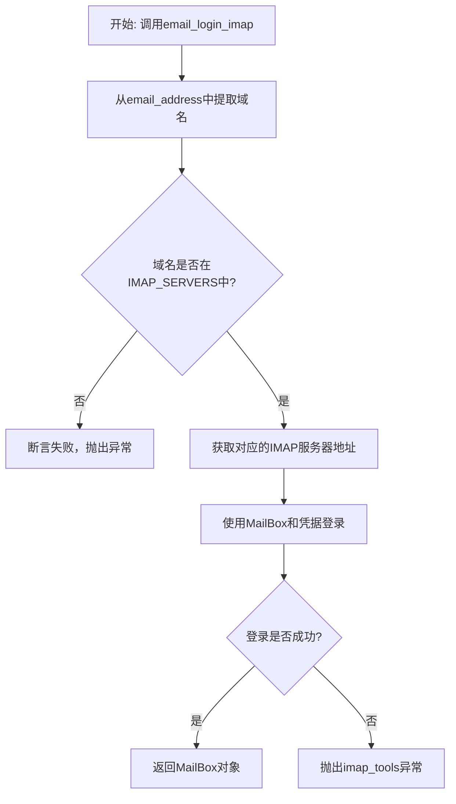
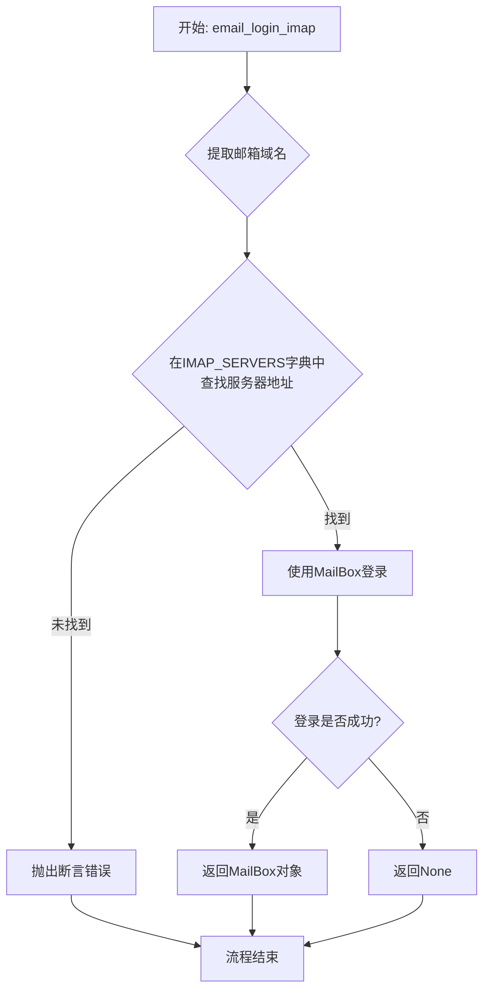

# `.\MetaGPT\metagpt\tools\libs\email_login.py` 详细设计文档

该代码提供了一个通过IMAP协议登录电子邮件的工具函数。它根据给定的邮箱地址和密码，通过查询预定义的IMAP服务器映射表，使用imap_tools库连接到对应的邮件服务器并完成登录验证，最终返回一个代表已连接邮箱的MailBox对象。

## 整体流程



## 类结构

```
全局作用域
├── 全局常量: IMAP_SERVERS
└── 全局函数: email_login_imap
```

## 全局变量及字段


### `IMAP_SERVERS`
    
一个字典，用于映射常见的电子邮件域名到其对应的IMAP服务器地址，以支持通过域名自动查找正确的IMAP服务器进行登录。

类型：`dict[str, str]`
    


    

## 全局函数及方法


### `email_login_imap`

该函数是一个用于通过IMAP协议登录电子邮箱的工具函数。它根据提供的邮箱地址自动查找对应的IMAP服务器地址，然后使用`imap_tools`库的`MailBox`类进行登录验证。如果登录成功，则返回包含账户信息的`MailBox`对象；如果登录失败或找不到对应的IMAP服务器，则返回`None`或抛出断言错误。

参数：

-  `email_address`：`str`，需要登录和关联的邮箱地址。
-  `email_password`：`str`，需要登录和关联的邮箱地址的密码。

返回值：`object`，通过`imap_tools`成功连接到邮箱后返回的`MailBox`对象，包含该账户的各种信息（如邮件等）。如果登录失败，则返回`None`。

#### 流程图



#### 带注释源码

```python
from imap_tools import MailBox

from metagpt.tools.tool_registry import register_tool

# 定义一个字典，将邮箱域名映射到其IMAP服务器地址
IMAP_SERVERS = {
    "outlook.com": "imap-mail.outlook.com",  # Outlook
    "163.com": "imap.163.com",  # 163 Mail
    "qq.com": "imap.qq.com",  # QQ Mail
    "gmail.com": "imap.gmail.com",  # Gmail
    "yahoo.com": "imap.mail.yahoo.com",  # Yahoo Mail
    "icloud.com": "imap.mail.me.com",  # iCloud Mail
    "hotmail.com": "imap-mail.outlook.com",  # Hotmail (同 Outlook)
    "live.com": "imap-mail.outlook.com",  # Live (同 Outlook)
    "sina.com": "imap.sina.com",  # Sina Mail
    "sohu.com": "imap.sohu.com",  # Sohu Mail
    "yahoo.co.jp": "imap.mail.yahoo.co.jp",  # Yahoo Mail Japan
    "yandex.com": "imap.yandex.com",  # Yandex Mail
    "mail.ru": "imap.mail.ru",  # Mail.ru
    "aol.com": "imap.aol.com",  # AOL Mail
    "gmx.com": "imap.gmx.com",  # GMX Mail
    "zoho.com": "imap.zoho.com",  # Zoho Mail
}

# 使用装饰器注册此函数为一个工具，并打上“email login”标签
@register_tool(tags=["email login"])
def email_login_imap(email_address, email_password):
    """
    使用 imap_tools 包登录您的邮箱（支持 IMAP 协议的邮箱）以验证并返回账户对象。

    Args:
        email_address (str): 需要登录和关联的邮箱地址。
        email_password (str): 需要登录和关联的邮箱地址的密码。

    Returns:
        object: 通过 imap_tools 成功连接到邮箱后返回的 imap_tools 的 MailBox 对象，包含该账户的各种信息（邮件等），如果登录失败则返回 None。
    """

    # 从邮箱地址中提取域名部分
    domain = email_address.split("@")[-1]

    # 根据域名在预设的字典中查找对应的IMAP服务器地址
    imap_server = IMAP_SERVERS.get(domain)

    # 断言：如果找不到对应域名的服务器地址，则抛出错误
    assert imap_server, f"IMAP server for {domain} not found."

    # 尝试使用提供的邮箱地址和密码登录到对应的IMAP服务器
    # 创建MailBox对象并调用login方法进行登录
    mailbox = MailBox(imap_server).login(email_address, email_password)
    # 返回登录成功后得到的MailBox对象
    return mailbox
```


## 关键组件


### IMAP_SERVERS 映射字典

一个预定义的字典，将常见的电子邮件域名映射到其对应的IMAP服务器地址，用于根据用户邮箱地址自动确定正确的IMAP服务器。

### `email_login_imap` 函数

一个使用 `imap_tools` 库实现IMAP协议邮箱登录的工具函数，它通过邮箱地址和密码进行身份验证，并返回一个已连接的 `MailBox` 对象以供后续邮件操作使用。


## 问题及建议


### 已知问题

-   **硬编码的服务器映射**：`IMAP_SERVERS` 字典将邮箱域名与IMAP服务器地址进行了硬编码绑定。当某个邮件服务商的IMAP服务器地址发生变更，或者需要支持新的邮件服务商时，必须手动修改代码并重新部署，缺乏灵活性和可扩展性。
-   **脆弱的域名提取逻辑**：使用 `email_address.split("@")[-1]` 来提取域名。如果传入的 `email_address` 格式不规范（例如，包含空格、没有`@`符号），此操作将引发 `IndexError` 或得到错误结果，导致后续流程失败。
-   **断言（assert）用于业务逻辑验证**：使用 `assert` 语句来检查是否找到对应的IMAP服务器。在Python中，如果使用 `-O`（优化）标志运行，`assert` 语句会被全局禁用，这将导致此关键检查失效，可能引发更隐蔽的错误。
-   **缺乏详细的错误处理与日志记录**：函数在登录失败（如密码错误、网络问题、服务器拒绝连接）时，`MailBox().login()` 会抛出异常。当前代码未捕获这些异常，也未提供任何日志输出，使得调试和问题定位困难，用户体验不友好。
-   **返回类型模糊**：函数文档说明返回 `imap_tools` 的 `MailBox` 对象或 `None`。但实际实现中，登录失败会抛出异常，并不会返回 `None`。文档与实现存在不一致，可能误导调用者。
-   **潜在的连接泄漏风险**：函数返回了 `MailBox` 对象，但未明确其生命周期管理责任。调用者如果忘记妥善关闭连接，可能会导致服务器端的连接资源未被释放。

### 优化建议

-   **外部化配置**：将 `IMAP_SERVERS` 映射关系移至配置文件（如JSON、YAML）或环境变量中。这样可以在不修改代码的情况下更新或扩展支持的邮箱服务商。
-   **增强输入验证与健壮性**：
    -   使用更安全的方法提取域名，例如 `email.utils.parseaddr` 或正则表达式，并在提取失败时返回明确的错误信息。
    -   将 `assert` 语句替换为明确的 `if` 判断，并在条件不满足时抛出具有明确类型的业务异常（如 `ValueError` 或自定义异常）。
-   **完善错误处理与日志**：
    -   使用 `try-except` 块捕获 `MailBox().login()` 可能抛出的各种异常（如 `MailboxLoginError`, `MailboxLogoutError` 等）。
    -   在捕获异常后，记录详细的日志（包括邮箱地址、错误类型、可能的原因），并向上层抛出封装后的、更友好的业务异常，或者返回一个包含错误信息的 `Result` 对象，而不是让原始异常直接暴露。
-   **明确接口契约**：
    -   更新函数文档，准确描述其行为：成功时返回 `MailBox` 对象，失败时抛出特定异常。或者修改实现，使其在内部处理异常并返回一个 `Union[MailBox, None]` 或一个 `Result` 类型。
    -   在文档中明确说明调用者在使用完返回的 `MailBox` 对象后，应负责调用 `logout()` 方法以关闭连接。
-   **考虑连接池或上下文管理器**：对于高频使用的场景，可以考虑引入轻量级的连接池管理。或者，将该函数改造为返回一个上下文管理器，确保连接在使用后自动安全关闭。
-   **添加单元测试**：为各种场景（成功登录、域名未支持、密码错误、网络超时）编写单元测试，确保代码的健壮性和行为符合预期。


## 其它


### 设计目标与约束

该模块的核心设计目标是提供一个通用的、基于IMAP协议的邮箱登录工具函数，能够根据用户提供的邮箱地址自动匹配对应的IMAP服务器，并返回一个已认证的邮箱连接对象。主要约束包括：1) 依赖外部`imap_tools`库处理底层IMAP协议通信；2) 仅支持预定义在`IMAP_SERVERS`字典中的邮箱服务商域名；3) 函数设计为无状态的工具函数，不管理连接生命周期；4) 登录失败时通过断言（assert）抛出异常，调用方需处理。

### 错误处理与异常设计

当前模块的错误处理机制较为简单。主要错误场景及处理方式如下：
1.  **不支持的邮箱域名**：当输入的邮箱地址域名不在`IMAP_SERVERS`字典中时，`imap_server`变量为`None`，随后`assert`语句会触发`AssertionError`异常，中断程序执行。
2.  **登录失败**：当`MailBox(...).login()`方法因密码错误、网络问题或服务器拒绝等原因失败时，`imap_tools`库会抛出其自定义的异常（如`MailboxLoginError`）。当前函数未捕获此异常，因此会直接向上层调用者传播。
**优化建议**：将断言（assert）改为更明确的`ValueError`或自定义异常，并考虑捕获`imap_tools`的登录异常，返回`None`或封装更友好的错误信息，以提高函数的健壮性和易用性。

### 数据流与状态机

该函数的数据流是线性的、无状态的：
1.  **输入**：函数接收两个字符串参数`email_address`和`email_password`。
2.  **处理**：
    a. 从`email_address`中解析出域名（`domain`）。
    b. 根据`domain`查询`IMAP_SERVERS`字典，获取对应的IMAP服务器地址（`imap_server`）。
    c. 使用获取到的`imap_server`、`email_address`和`email_password`，实例化`imap_tools.MailBox`对象并调用其`login`方法。
3.  **输出**：成功则返回`MailBox`对象；失败则抛出异常。
由于函数不保持任何状态（无类属性或全局变量修改），每次调用都是独立的，不构成复杂的状态机。

### 外部依赖与接口契约

1.  **外部库依赖**：
    *   `imap_tools`：核心依赖，用于建立IMAP连接和认证。函数返回的`MailBox`对象完全由该库定义。
2.  **接口契约（函数签名）**：
    *   **名称**: `email_login_imap`
    *   **输入**:
        *   `email_address (str)`: 必须为有效的邮箱地址字符串，且域名部分需在`IMAP_SERVERS`中有映射。
        *   `email_password (str)`: 对应邮箱账户的密码。
    *   **输出**:
        *   成功: 返回`imap_tools.MailBox`对象，该对象处于已登录状态，可供后续邮件操作使用。
        *   失败: 抛出异常（`AssertionError`或`imap_tools`库抛出的异常）。
    *   **装饰器**: 使用`@register_tool(tags=["email login"])`注册，表明该函数是一个工具，并打上“email login”标签，这暗示它可能被用于某个更大的工具框架或平台（如MetaGPT）。

### 安全与隐私考虑

1.  **敏感信息处理**：函数直接接收并传输明文密码（`email_password`）。在生产环境中，应考虑使用加密连接（IMAPS），并确保密码在传输和存储过程中的安全。`imap_tools.MailBox`默认使用SSL，但依赖调用环境配置。
2.  **凭据存储**：函数本身不存储凭据，但返回的`MailBox`对象持有活动会话。调用方负责安全地管理该对象及其生命周期，及时注销或销毁。
3.  **错误信息泄露**：当前实现中，登录失败时抛出的异常可能包含服务器地址、邮箱地址等信息，应避免将详细的错误信息直接暴露给最终用户，以防信息泄露。

    