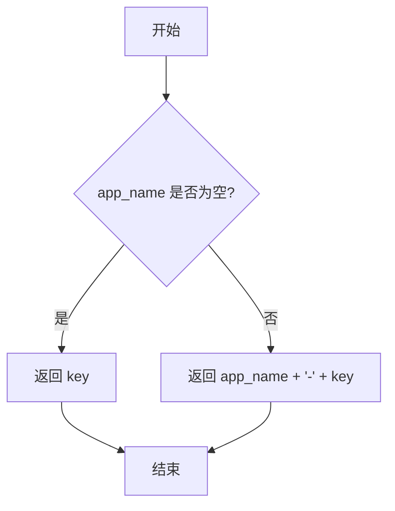
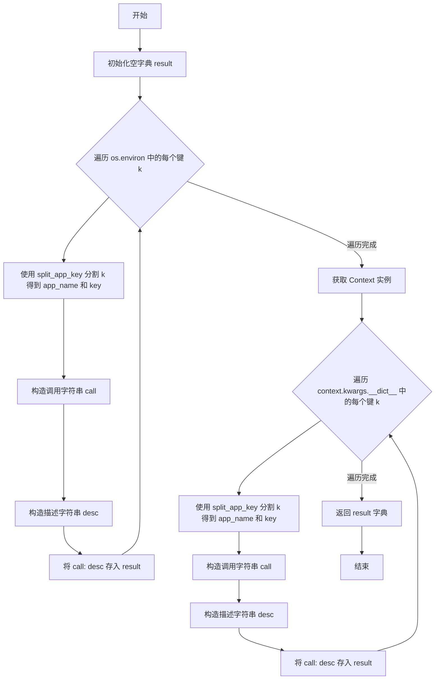
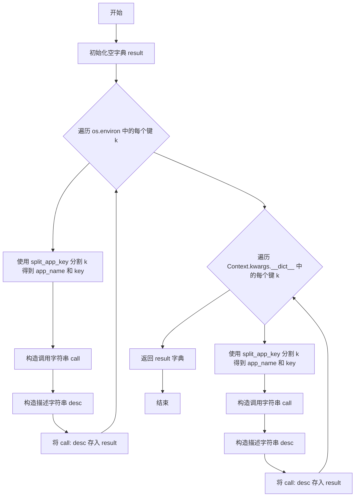

# `.\MetaGPT\metagpt\tools\libs\env.py` 详细设计文档

该代码实现了一个环境变量管理模块，核心功能是提供异步获取环境变量的统一接口。它支持通过应用名称前缀来区分不同应用的环境变量，并允许通过全局函数指针动态替换默认的获取逻辑。模块包含异常处理、默认值回退、环境变量描述生成以及获取逻辑的动态配置能力。

## 整体流程

```mermaid
graph TD
    A[调用 get_env] --> B[调用 _get_env_entry 指向的函数]
    B --> C{函数指针是否为默认函数?}
    C -- 是 --> D[调用 default_get_env]
    C -- 否 --> E[调用自定义函数]
    D --> F[构建 app_key: app_name-key]
    F --> G{检查 os.environ[app_key]?}
    G -- 存在 --> H[返回环境变量值]
    G -- 不存在 --> I[检查 os.environ[app_key.replace('-', '_')]?]
    I -- 存在 --> H
    I -- 不存在 --> J[检查 Context.kwargs[app_key]?]
    J -- 存在 --> H
    J -- 不存在 --> K[抛出 EnvKeyNotFoundError]
    E --> L[执行自定义逻辑]
    L --> M[返回结果]
```

## 类结构

```
EnvKeyNotFoundError (自定义异常类)
├── __init__
全局函数:
├── to_app_key
├── split_app_key
├── default_get_env
├── default_get_env_description
├── get_env
├── get_env_default
├── get_env_description
└── set_get_env_entry
```

## 全局变量及字段


### `_get_env_entry`
    
全局函数指针，指向当前用于获取环境变量的实现函数，默认为default_get_env，可通过set_get_env_entry修改。

类型：`function`
    


### `_get_env_description_entry`
    
全局函数指针，指向当前用于获取环境变量描述信息的实现函数，默认为default_get_env_description，可通过set_get_env_entry修改。

类型：`function`
    


    

## 全局函数及方法


### `to_app_key`

该函数用于根据给定的应用名称和键名，生成一个组合后的应用键。如果提供了应用名称，则返回格式为`{app_name}-{key}`的字符串；否则，直接返回原始的键名。

参数：

- `key`：`str`，原始的环境变量键名。
- `app_name`：`str`，可选的应用名称，用于区分不同应用的环境变量。

返回值：`str`，组合后的应用键字符串。

#### 流程图



#### 带注释源码

```python
def to_app_key(key: str, app_name: str = None) -> str:
    # 如果提供了应用名称，则返回格式为"{app_name}-{key}"的字符串
    # 否则，直接返回原始的键名
    return f"{app_name}-{key}" if app_name else key
```


### `split_app_key`

该函数用于将包含应用前缀的复合键（app_key）拆分为应用名称（app_name）和原始键（key）。它通过查找第一个连字符（"-"）来分割字符串，如果不存在连字符，则返回空字符串作为应用名称，整个字符串作为原始键。

参数：

- `app_key`：`str`，包含应用前缀和原始键的复合字符串，格式为"应用名称-原始键"。

返回值：`tuple[str, str]`，返回一个包含两个字符串的元组，第一个元素是应用名称（如果存在），第二个元素是原始键。

#### 流程图

```mermaid
flowchart TD
    A[开始: split_app_key(app_key)] --> B{app_key 中是否包含 '-'?}
    B -- 否 --> C[返回: "", app_key]
    B -- 是 --> D[使用 split 方法在第一个 '-' 处分割字符串]
    D --> E[返回: app_name, key]
```

#### 带注释源码

```python
def split_app_key(app_key: str) -> (str, str):
    # 检查 app_key 中是否包含连字符 "-"
    if "-" not in app_key:
        # 如果不包含，说明没有应用前缀，返回空字符串作为应用名称，整个 app_key 作为原始键
        return "", app_key
    # 如果包含连字符，则在第一个连字符处分割字符串
    # 分割结果的第一部分作为应用名称（app_name），剩余部分作为原始键（key）
    app_name, key = app_key.split("-", 1)
    # 返回包含应用名称和原始键的元组
    return app_name, key
```


### `default_get_env`

`default_get_env` 函数是环境变量获取机制的核心实现。它根据给定的键（`key`）和应用名称（`app_name`）尝试从多个来源（操作系统环境变量和应用的上下文对象）查找对应的值。如果找不到，则抛出 `EnvKeyNotFoundError` 异常。

参数：

-  `key`：`str`，要查找的环境变量的键名。
-  `app_name`：`str`，可选参数，应用名称。用于生成带命名空间前缀的复合键。

返回值：`str`，返回查找到的环境变量值。如果未找到，则抛出 `EnvKeyNotFoundError` 异常。

#### 流程图

```mermaid
flowchart TD
    A[开始: default_get_env(key, app_name)] --> B[生成应用键 app_key = to_app_key(key, app_name)]
    B --> C{app_key 是否在 os.environ 中?}
    C -- 是 --> D[返回 os.environ[app_key]]
    C -- 否 --> E[生成替代键 env_app_key = app_key.replace('-', '_')]
    E --> F{env_app_key 是否在 os.environ 中?}
    F -- 是 --> G[返回 os.environ[env_app_key]]
    F -- 否 --> H[获取 Context 对象 context]
    H --> I{app_key 是否在 context.kwargs 中?}
    I -- 是 --> J[返回 context.kwargs[app_key]]
    I -- 否 --> K[抛出 EnvKeyNotFoundError 异常]
```

#### 带注释源码

```python
async def default_get_env(key: str, app_name: str = None) -> str:
    # 1. 将应用名和键名组合成应用键（app_key），格式为 `{app_name}-{key}`，若无应用名则直接使用 key。
    app_key = to_app_key(key=key, app_name=app_name)
    # 2. 首先尝试从系统环境变量中直接查找 app_key。
    if app_key in os.environ:
        return os.environ[app_key]

    # 3. 由于 Linux 环境变量通常不支持 `-`，将其替换为 `_` 后再次尝试查找。
    env_app_key = app_key.replace("-", "_")  # "-" is not supported by linux environment variable
    if env_app_key in os.environ:
        return os.environ[env_app_key]

    # 4. 如果系统环境变量中未找到，则尝试从应用的上下文（Context）中查找。
    from metagpt.context import Context

    context = Context()
    val = context.kwargs.get(app_key, None)
    if val is not None:
        return val

    # 5. 所有来源均未找到，抛出特定异常。
    raise EnvKeyNotFoundError(f"EnvKeyNotFoundError: {key}, app_name:{app_name or ''}")
```


### `default_get_env_description`

该函数用于获取所有环境变量和上下文参数的描述信息，返回一个字典，其中键为调用 `get_env` 函数的示例代码字符串，值为对应的环境变量或上下文参数的描述。

参数：无

返回值：`Dict[str, str]`，一个字典，键是调用 `get_env` 函数的示例代码字符串，值是对应的环境变量或上下文参数的描述。

#### 流程图



#### 带注释源码

```python
async def default_get_env_description() -> Dict[str, str]:
    # 初始化一个空字典，用于存储结果
    result = {}
    # 遍历操作系统环境变量中的所有键
    for k in os.environ.keys():
        # 使用 split_app_key 函数将键分割为应用名和键名
        app_name, key = split_app_key(k)
        # 构造一个调用 get_env 函数的示例代码字符串
        call = f'await get_env(key="{key}", app_name="{app_name}")'
        # 构造描述字符串，说明该调用返回哪个环境变量的值
        result[call] = f"Return the value of environment variable `{k}`."

    # 导入 Context 类
    from metagpt.context import Context
    # 创建一个 Context 实例
    context = Context()
    # 遍历 context.kwargs.__dict__ 中的所有键
    for k in context.kwargs.__dict__.keys():
        # 使用 split_app_key 函数将键分割为应用名和键名
        app_name, key = split_app_key(k)
        # 构造一个调用 get_env 函数的示例代码字符串
        call = f'await get_env(key="{key}", app_name="{app_name}")'
        # 构造描述字符串，说明该调用获取哪个上下文参数的值
        result[call] = f"Get the value of environment variable `{k}`."
    # 返回包含所有调用示例和描述的字典
    return result
```


### `get_env`

`get_env` 函数是环境变量获取模块的核心入口点。它根据提供的 `key` 和可选的 `app_name`，通过一个可配置的入口函数（默认为 `default_get_env`）来检索对应的值。该函数支持异步调用，并提供了灵活的扩展机制，允许运行时替换其底层实现。

参数：

- `key`：`str`，需要获取的环境变量的键名。
- `app_name`：`str`，可选参数，应用程序或组件的名称，用于与其他应用的同名环境变量进行区分。默认为 `None`。

返回值：`str`，返回与给定键对应的环境变量值。如果未找到，则抛出 `EnvKeyNotFoundError` 异常。

#### 流程图

```mermaid
flowchart TD
    A[开始: 调用 get_env(key, app_name)] --> B{全局入口函数<br>_get_env_entry 是否设置?}
    B -- 是 --> C[调用 _get_env_entry(key, app_name)]
    B -- 否 --> D[调用 default_get_env(key, app_name)]
    C --> E[返回环境变量值]
    D --> E
    E --> F[结束]
```

#### 带注释源码

```python
async def get_env(key: str, app_name: str = None) -> str:
    """
    Retrieve the value of the environment variable for the specified key.

    Args:
        key (str): The key of the environment variable.
        app_name (str, optional): The name of the application. Defaults to None.

    Returns:
        str: The value corresponding to the given key in the environment variables.
             If no value is found for the given key, an empty string is returned.

    Example:
        This function can be used to retrieve environment variables asynchronously.
        It should be called using `await`.

        >>> from metagpt.tools.libs.env import get_env
        >>> api_key = await get_env("API_KEY")
        >>> print(api_key)
        <API_KEY>

        >>> from metagpt.tools.libs.env import get_env
        >>> api_key = await get_env(key="API_KEY", app_name="GITHUB")
        >>> print(api_key)
        <API_KEY>

    Note:
        This is an asynchronous function and must be called using `await`.
    """
    # 声明使用全局变量 `_get_env_entry`，该变量指向实际执行环境变量查找的函数。
    global _get_env_entry
    # 如果全局入口函数 `_get_env_entry` 已被设置（非默认值），则调用它。
    if _get_env_entry:
        return await _get_env_entry(key=key, app_name=app_name)

    # 否则，调用默认的环境变量获取函数 `default_get_env`。
    return await default_get_env(key=key, app_name=app_name)
```


### `get_env_default`

`get_env_default` 函数是环境变量获取功能的一个安全封装。它尝试通过调用核心的 `get_env` 函数来获取指定键（可能带有应用名前缀）的环境变量值。如果目标环境变量不存在（即 `get_env` 抛出 `EnvKeyNotFoundError` 异常），则函数不会让异常传播，而是优雅地返回调用者提供的默认值。这为环境变量的读取提供了容错机制，避免了因缺少配置而导致的程序中断。

参数：

- `key`：`str`，要检索的环境变量的名称。
- `app_name`：`str`，可选参数，用于关联环境变量的应用程序或组件名称。如果提供，会与 `key` 组合成 `{app_name}-{key}` 的形式进行查找。
- `default_value`：`str`，可选参数，当环境变量未找到时返回的默认值。

返回值：`Optional[str]`，如果找到环境变量，则返回其字符串值；如果未找到且提供了 `default_value`，则返回该默认值；如果未找到且未提供 `default_value`，则返回 `None`。

#### 流程图

```mermaid
flowchart TD
    A[开始: get_env_default(key, app_name, default_value)] --> B{调用 get_env};
    B --> C{是否抛出 EnvKeyNotFoundError?};
    C -- 否 --> D[返回 get_env 的结果];
    C -- 是 --> E[返回 default_value];
    D --> F[结束];
    E --> F;
```

#### 带注释源码

```python
async def get_env_default(key: str, app_name: str = None, default_value: str = None) -> Optional[str]:
    """
    检索指定环境变量键的值。如果未找到该键，则返回默认值。

    Args:
        key (str): 要检索的环境变量的名称。
        app_name (str, optional): 用于关联环境变量的应用程序或组件名称。
        default_value (str, optional): 如果未找到环境变量，则返回的默认值。

    Returns:
        str or None: 如果找到环境变量，则返回其值，否则返回默认值。

    Example:
        >>> from metagpt.tools.libs.env import get_env
        >>> api_key = await get_env_default(key="NOT_EXISTS_API_KEY", default_value="<API_KEY>")
        >>> print(api_key)
        <API_KEY>

        >>> from metagpt.tools.libs.env import get_env
        >>> api_key = await get_env_default(key="NOT_EXISTS_API_KEY", app_name="GITHUB", default_value="<API_KEY>")
        >>> print(api_key)
        <API_KEY>

    """
    try:
        # 尝试调用核心的 get_env 函数获取环境变量值
        return await get_env(key=key, app_name=app_name)
    except EnvKeyNotFoundError:
        # 如果 get_env 抛出 EnvKeyNotFoundError 异常，则捕获它并返回调用者提供的默认值
        return default_value
```


### `default_get_env_description`

该函数用于生成一个描述字典，其中键是调用 `get_env` 函数的示例字符串，值是对应的环境变量或上下文参数的描述。它扫描系统环境变量和项目上下文（`Context`）中的键，为每个键生成一个描述条目。

参数：
- 无

返回值：`Dict[str, str]`，返回一个字典，键为调用 `get_env` 函数的示例字符串（例如 `'await get_env(key="API_KEY", app_name="GITHUB")'`），值为对应的描述字符串（例如 `'Return the value of environment variable `GITHUB-API_KEY`.'`）。

#### 流程图



#### 带注释源码

```python
async def default_get_env_description() -> Dict[str, str]:
    # 初始化一个空字典用于存储结果
    result = {}
    # 遍历操作系统环境变量中的所有键
    for k in os.environ.keys():
        # 使用 split_app_key 函数将键分割为应用名和键名
        app_name, key = split_app_key(k)
        # 构造一个调用 get_env 函数的示例字符串
        call = f'await get_env(key="{key}", app_name="{app_name}")'
        # 构造描述字符串，说明该调用返回哪个环境变量的值
        result[call] = f"Return the value of environment variable `{k}`."

    # 导入 Context 类
    from metagpt.context import Context
    # 创建 Context 实例
    context = Context()
    # 遍历 Context 实例的 kwargs 属性（一个命名空间）中的所有键
    for k in context.kwargs.__dict__.keys():
        # 使用 split_app_key 函数将键分割为应用名和键名
        app_name, key = split_app_key(k)
        # 构造一个调用 get_env 函数的示例字符串
        call = f'await get_env(key="{key}", app_name="{app_name}")'
        # 构造描述字符串，说明该调用获取哪个上下文参数的值
        result[call] = f"Get the value of environment variable `{k}`."
    # 返回包含所有调用示例和描述的字典
    return result
```


### `set_get_env_entry`

该函数用于动态修改全局的 `get_env` 和 `get_env_description` 函数的入口点。它允许在运行时替换默认的环境变量获取逻辑及其描述生成逻辑，为系统提供了可插拔的扩展机制。

参数：

-  `value`：`function`，新的 `get_env` 函数入口点，必须是一个异步函数，其签名应与 `default_get_env` 一致。
-  `description`：`str`，新的 `get_env_description` 函数入口点，必须是一个异步函数，其签名应与 `default_get_env_description` 一致。

返回值：`None`，该函数不返回任何值，其作用是通过修改全局变量来改变系统行为。

#### 流程图

```mermaid
flowchart TD
    A[开始: set_get_env_entry(value, description)] --> B{参数value和description<br>是否为有效函数?}
    B -- 是 --> C[将全局变量_get_env_entry<br>赋值为value]
    C --> D[将全局变量_get_env_description_entry<br>赋值为description]
    D --> E[结束: 全局入口点已更新]
    B -- 否 --> F[结束: 参数无效，<br>但函数仍会执行赋值操作]
```

#### 带注释源码

```python
def set_get_env_entry(value, description):
    """Modify `get_env` entry and `get_description` entry.

    Args:
        value (function): New function entry.
        description (str): Description of the function.

    This function modifies the `get_env` entry by updating the function
    to the provided `value` and its description to the provided `description`.
    """
    # 声明使用全局变量 `_get_env_entry` 和 `_get_env_description_entry`
    global _get_env_entry
    global _get_env_description_entry
    # 将传入的新函数 `value` 赋值给全局入口点 `_get_env_entry`
    _get_env_entry = value
    # 将传入的新描述函数 `description` 赋值给全局入口点 `_get_env_description_entry`
    _get_env_description_entry = description
```


### `EnvKeyNotFoundError.__init__`

自定义异常类 `EnvKeyNotFoundError` 的构造函数，用于在环境变量查找失败时抛出异常。它继承自 Python 内置的 `Exception` 类，通过调用父类的构造函数来初始化异常信息。

参数：

-  `info`：`str`，描述异常原因的错误信息字符串。

返回值：`None`，构造函数不返回任何值。

#### 流程图

```mermaid
flowchart TD
    A[开始: EnvKeyNotFoundError.__init__(info)] --> B[调用父类 Exception.__init__(info)]
    B --> C[结束]
```

#### 带注释源码

```
class EnvKeyNotFoundError(Exception):
    def __init__(self, info):
        # 调用父类 Exception 的构造函数，传入错误信息 `info` 进行初始化。
        super().__init__(info)
```


## 关键组件


### 环境变量键名转换与解析

提供环境变量键名在应用特定命名空间（`app_name-key`）与系统环境变量命名（`app_name_key`）之间的转换功能，以及反向解析功能，用于支持多应用环境下的变量隔离与查找。

### 环境变量获取器（Getter）与入口点（Entry Point）机制

实现了一个可插拔的环境变量获取机制。通过全局入口点变量（`_get_env_entry`, `_get_env_description_entry`）和设置函数（`set_get_env_entry`），允许运行时动态替换默认的获取逻辑，提供了高度的灵活性和可扩展性。

### 多源环境变量查找策略

定义了从多个来源（系统环境变量、应用上下文）按优先级查找环境变量的策略。首先尝试查找应用特定格式的键，然后尝试查找下划线格式的键，最后在应用上下文中查找，实现了健壮的回退机制。

### 环境变量描述生成器

自动扫描系统环境变量和应用上下文，为每个可用的键生成对应的调用示例和描述文档，便于用户了解当前可用的环境变量配置。

### 带默认值的环境变量安全获取

提供了一个包装函数（`get_env_default`），在目标环境变量不存在时返回用户指定的默认值，而不是抛出异常，增强了代码的健壮性和易用性。


## 问题及建议


### 已知问题

-   **全局变量 `_get_env_entry` 和 `_get_env_description_entry` 存在线程安全问题**：代码使用全局变量 `_get_env_entry` 和 `_get_env_description_entry` 作为函数入口点的引用，并通过 `set_get_env_entry` 函数进行修改。在异步或多线程环境中，这可能导致竞态条件（race condition），即一个线程正在读取入口点函数时，另一个线程修改了它，从而导致不可预测的行为或错误。
-   **`split_app_key` 函数对键名格式的假设过于简单**：该函数通过查找第一个 `-` 字符来分割应用名和键名。如果键名本身包含 `-` 字符（例如 `my-app-config`），此逻辑会错误地将 `my` 识别为应用名，而将 `app-config` 识别为键名，导致后续查找失败或找到错误的变量。
-   **`default_get_env` 函数存在潜在的重复查找逻辑**：该函数在查找环境变量时，会先尝试查找原始 `app_key`，再尝试查找将 `-` 替换为 `_` 的 `env_app_key`。然而，`to_app_key` 函数生成 `app_key` 时并未考虑 `-` 到 `_` 的转换，这可能导致逻辑上的不一致和潜在的混淆。例如，如果用户设置了 `APP_NAME_KEY` 环境变量，但代码期望的是 `APP-NAME-KEY`，查找可能会失败。
-   **`default_get_env_description` 函数可能生成重复的描述**：该函数遍历 `os.environ` 和 `context.kwargs.__dict__` 来生成描述字典。如果同一个键（例如 `MY_KEY`）同时存在于环境变量和上下文中，或者以不同形式存在（如 `MY_KEY` 和 `MY-KEY`），生成的调用字符串（如 `await get_env(key="KEY", app_name="MY")`）会重复，导致字典中的条目被覆盖，最终描述信息可能不完整或丢失。
-   **`get_env_default` 函数的异常处理过于宽泛**：该函数仅捕获 `EnvKeyNotFoundError` 异常。如果 `get_env` 函数或其入口点函数在执行过程中抛出其他类型的异常（例如，由于 `Context()` 初始化失败或 `kwargs` 访问错误），这些异常将不会被捕获，导致程序意外终止，而不是返回默认值。

### 优化建议

-   **使用线程安全的机制管理入口点**：建议将全局入口点变量替换为线程安全的存储机制，例如使用 `threading.local()` 为每个线程维护独立的入口点，或者使用一个小的类来封装入口点及其修改方法，并通过锁（如 `threading.Lock`）来确保修改操作的原子性。
-   **改进 `split_app_key` 的分割逻辑**：可以引入一个分隔符转义机制或使用更明确的分隔符（如 `::`）。更简单的方法是，规定应用名本身不能包含分隔符，并在文档中明确说明。或者，提供一个配置项来指定分隔符。
-   **统一键名转换规则**：重构 `to_app_key` 和 `default_get_env` 中的查找逻辑，确保键名生成和查找的规则一致。例如，可以在 `to_app_key` 中就将 `-` 转换为 `_` 以生成最终用于查找的键，或者提供一个明确的、可配置的转换函数，并在所有相关地方使用它。
-   **优化 `default_get_env_description` 的描述生成逻辑**：在生成描述字典前，可以对键进行归一化处理（例如，统一转换为某种标准形式），然后基于归一化后的键来生成唯一的调用字符串和描述。或者，使用集合（set）来跟踪已处理的键，避免重复。
-   **增强 `get_env_default` 的异常处理**：考虑捕获更广泛的异常类型（例如 `Exception`），并在捕获后记录警告日志，然后返回默认值。这可以提高函数的健壮性。同时，应确保 `EnvKeyNotFoundError` 是 `get_env` 函数找不到键时抛出的唯一预期异常。
-   **考虑添加缓存机制**：环境变量和上下文值通常不会频繁改变。可以为 `get_env` 函数添加一个简单的缓存（例如，使用 `functools.lru_cache` 装饰异步函数，注意处理异步兼容性），以避免对相同键的重复查找，提高性能，尤其是在高频调用的场景下。
-   **增加类型注解的完整性**：例如，`set_get_env_entry` 函数的 `value` 和 `description` 参数缺乏详细的类型注解（`value` 应该是一个 `Callable`，`description` 可能也是一个 `Callable` 返回 `Dict[str, str]`）。完善类型注解有助于静态类型检查工具（如 mypy）发现潜在问题，并提高代码的可读性。


## 其它


### 设计目标与约束

1. **设计目标**：
   - 提供一个统一、可扩展的环境变量获取接口，支持按应用名称隔离环境变量。
   - 支持从系统环境变量和项目特定的 `Context` 对象中获取配置值。
   - 提供获取环境变量描述信息的能力，便于生成文档或帮助信息。
   - 允许运行时动态替换核心的获取逻辑（`get_env` 和 `get_env_description`），以支持测试或不同的配置源。

2. **设计约束**：
   - 核心函数 `get_env` 和 `get_env_description` 必须是异步的，以兼容异步框架。
   - 环境变量键名支持两种格式：`{app_name}-{key}` 和 `{app_name}_{key}`（后者用于兼容不支持连字符的系统环境变量）。
   - 当请求的键不存在时，必须抛出特定的 `EnvKeyNotFoundError` 异常。
   - 提供 `get_env_default` 函数作为安全获取的便捷方法，避免异常传播。

### 错误处理与异常设计

1. **自定义异常**：
   - `EnvKeyNotFoundError`：当通过 `get_env` 函数无法找到指定的环境变量键时抛出。这提供了明确的错误类型，便于调用者进行捕获和处理。

2. **错误处理策略**：
   - `get_env` 函数：严格遵循“找不到即报错”的原则，通过抛出 `EnvKeyNotFoundError` 通知调用者配置缺失。
   - `get_env_default` 函数：作为 `get_env` 的安全封装，捕获 `EnvKeyNotFoundError` 并返回调用者提供的默认值，简化了常见的使用场景。
   - 其他函数（如 `to_app_key`, `split_app_key`）为纯工具函数，不涉及错误处理。

### 数据流与状态机

1. **数据流**：
   - **输入**：用户调用 `get_env(key, app_name)`。
   - **处理**：
     a. 通过 `to_app_key` 生成完整的应用键 `app_key`。
     b. 依次在以下位置查找 `app_key` 对应的值：
        i. 系统环境变量（`os.environ`），使用原始 `app_key`。
        ii. 系统环境变量，使用将 `-` 替换为 `_` 的 `env_app_key`（兼容性处理）。
        iii. 项目 `Context` 对象的 `kwargs` 属性中。
     c. 若找到则返回值，否则抛出 `EnvKeyNotFoundError`。
   - **输出**：环境变量的字符串值或异常。

2. **状态**：
   - 模块级变量 `_get_env_entry` 和 `_get_env_description_entry` 存储了当前生效的获取函数入口点。初始状态指向 `default_get_env` 和 `default_get_env_description`。
   - 通过 `set_get_env_entry` 函数可以动态修改这两个入口点，改变整个模块的行为。这是一个简单的“策略模式”实现，模块状态因此可变。

### 外部依赖与接口契约

1. **外部依赖**：
   - `os` 模块：用于访问系统环境变量 (`os.environ`)。
   - `metagpt.context.Context` 类：一个项目内部的上下文对象，作为备用的配置存储源。这是一个强依赖，如果 `Context` 类不存在或接口变化，会导致运行时错误。

2. **接口契约**：
   - `get_env(key: str, app_name: Optional[str] = None) -> str`：主接口。调用者必须使用 `await` 调用。承诺返回字符串值或抛出 `EnvKeyNotFoundError`。
   - `get_env_default(key: str, app_name: Optional[str] = None, default_value: Optional[str] = None) -> Optional[str]`：安全接口。承诺返回找到的值或提供的默认值，永不抛出 `EnvKeyNotFoundError`。
   - `get_env_description() -> Dict[str, str]`：描述信息接口。返回一个字典，键为示例调用字符串，值为描述。
   - `set_get_env_entry(value: Callable, description: Callable) -> None`：配置接口。用于注入新的获取逻辑，`value` 和 `description` 必须是可异步调用的函数，其签名需与 `default_get_env` 和 `default_get_env_description` 一致。

### 安全与合规考虑

1. **信息泄露**：`get_env_description` 函数会返回所有系统环境变量和 `Context.kwargs` 中键名的描述。在调试或日志记录时，需注意避免将完整的输出记录到不安全的日志中，以防敏感信息（如密码、密钥）泄露。
2. **动态代码执行风险**：虽然当前实现没有直接执行动态代码，但 `set_get_env_entry` 允许注入任意函数。应确保此函数仅在受信任的环境（如测试、明确的插件加载）中被调用，避免注入恶意代码。

### 测试策略建议

1. **单元测试**：
   - 测试 `to_app_key` 和 `split_app_key` 在各种输入下的正确性。
   - 模拟 `os.environ` 和 `Context` 对象，测试 `default_get_env` 在键存在、不存在（应抛异常）时的行为。
   - 测试 `get_env_default` 在键不存在时是否正确返回默认值。
   - 测试 `set_get_env_entry` 能否正确切换获取逻辑，以及 `get_env` 和 `get_env_description` 是否使用了新的入口点。

2. **集成测试**：
   - 在真实异步环境中测试 `get_env` 和 `get_env_default` 的调用。
   - 测试与 `metagpt.context.Context` 集成的场景。

3. **模拟与桩**：建议使用 `unittest.mock` 来模拟 `os.environ` 和 `Context` 类，以隔离测试环境。

    