# `.\MetaGPT\metagpt\tools\libs\feature_engineering.py` 详细设计文档

该文件是一个特征工程工具库，提供了多种用于机器学习数据预处理的特征工程方法。所有工具都继承自MLProcess基类，遵循fit-transform模式，并可通过装饰器注册到工具注册表中。主要功能包括多项式特征扩展、分类特征编码（计数编码、目标均值编码、K折目标均值编码）、分类特征交叉、分组统计、连续特征分箱、时间特征提取以及多种特征选择方法（通用选择、方差选择等）。

## 整体流程

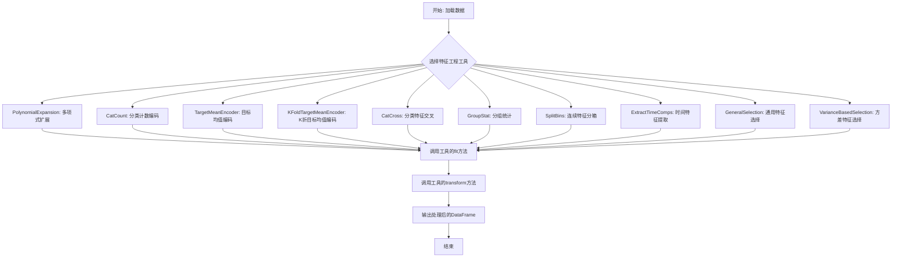

## 类结构

```
MLProcess (抽象基类，来自metagpt.tools.libs.data_preprocess)
├── PolynomialExpansion (多项式特征扩展)
├── CatCount (分类计数编码)
├── TargetMeanEncoder (目标均值编码)
├── KFoldTargetMeanEncoder (K折目标均值编码)
├── CatCross (分类特征交叉)
├── GroupStat (分组统计)
├── SplitBins (连续特征分箱)
├── ExtractTimeComps (时间特征提取)
├── GeneralSelection (通用特征选择)
├── TreeBasedSelection (基于树模型的特征选择) - 已注释
└── VarianceBasedSelection (基于方差的特征选择)
```

## 全局变量及字段


### `TAGS`
    
用于工具注册的标签列表，标识该模块属于特征工程和机器学习领域

类型：`list[str]`
    


### `PolynomialExpansion.cols`
    
用于多项式展开的数值列名列表

类型：`list[str]`
    


### `PolynomialExpansion.degree`
    
多项式展开的阶数

类型：`int`
    


### `PolynomialExpansion.label_col`
    
目标标签列的名称

类型：`str`
    


### `PolynomialExpansion.poly`
    
用于生成多项式特征的scikit-learn转换器对象

类型：`PolynomialFeatures`
    


### `CatCount.col`
    
需要进行值计数编码的分类列名

类型：`str`
    


### `CatCount.encoder_dict`
    
存储分类列值到其出现次数的映射字典

类型：`dict`
    


### `TargetMeanEncoder.col`
    
需要进行目标均值编码的分类列名

类型：`str`
    


### `TargetMeanEncoder.label`
    
用于计算目标均值的标签列名

类型：`str`
    


### `TargetMeanEncoder.encoder_dict`
    
存储分类列值到其对应标签均值的映射字典

类型：`dict`
    


### `KFoldTargetMeanEncoder.col`
    
需要进行K折目标均值编码的分类列名

类型：`str`
    


### `KFoldTargetMeanEncoder.label`
    
用于计算目标均值的标签列名

类型：`str`
    


### `KFoldTargetMeanEncoder.n_splits`
    
K折交叉验证的折数

类型：`int`
    


### `KFoldTargetMeanEncoder.random_state`
    
控制K折划分随机性的种子值

类型：`int`
    


### `KFoldTargetMeanEncoder.encoder_dict`
    
存储分类列值到其K折目标均值的映射字典

类型：`dict`
    


### `CatCross.cols`
    
需要进行两两交叉的分类列名列表

类型：`list[str]`
    


### `CatCross.max_cat_num`
    
每个交叉特征允许的最大唯一类别数

类型：`int`
    


### `CatCross.combs`
    
存储所有两两列组合的列表

类型：`list[tuple]`
    


### `CatCross.combs_map`
    
存储交叉特征名到其值映射字典的映射

类型：`dict`
    


### `GroupStat.group_col`
    
用于分组的列名

类型：`str`
    


### `GroupStat.agg_col`
    
需要进行聚合计算的列名

类型：`str`
    


### `GroupStat.agg_funcs`
    
要应用的聚合函数列表（如['mean', 'std']）

类型：`list[str]`
    


### `GroupStat.group_df`
    
存储分组聚合结果的DataFrame

类型：`pd.DataFrame`
    


### `SplitBins.cols`
    
需要进行分箱处理的数值列名列表

类型：`list[str]`
    


### `SplitBins.strategy`
    
分箱策略（'quantile'、'uniform'、'kmeans'）

类型：`str`
    


### `SplitBins.encoder`
    
用于执行分箱的scikit-learn转换器对象

类型：`KBinsDiscretizer`
    


### `ExtractTimeComps.time_col`
    
包含时间数据的原始列名

类型：`str`
    


### `ExtractTimeComps.time_comps`
    
要提取的时间组件列表（如['year', 'month']）

类型：`list[str]`
    


### `GeneralSelection.label_col`
    
目标标签列的名称

类型：`str`
    


### `GeneralSelection.feats`
    
通过通用选择后保留的特征列名列表

类型：`list[str]`
    


### `TreeBasedSelection.label_col`
    
目标标签列的名称

类型：`str`
    


### `TreeBasedSelection.task_type`
    
任务类型（'cls'、'mcls'、'reg'）

类型：`str`
    


### `TreeBasedSelection.feats`
    
通过树模型特征选择后保留的特征列名列表

类型：`list[str]`
    


### `VarianceBasedSelection.label_col`
    
目标标签列的名称

类型：`str`
    


### `VarianceBasedSelection.threshold`
    
方差阈值，低于此值的特征将被移除

类型：`float`
    


### `VarianceBasedSelection.feats`
    
通过方差选择后保留的特征列名列表

类型：`list[str]`
    


### `VarianceBasedSelection.selector`
    
用于执行方差选择的scikit-learn转换器对象

类型：`VarianceThreshold`
    
    

## 全局函数及方法


### `PolynomialExpansion.__init__`

初始化多项式特征扩展工具，设置用于生成多项式特征和交互特征的数值列、标签列以及多项式度数。

参数：

- `cols`：`list`，需要进行多项式扩展的列名列表。
- `label_col`：`str`，数据集中标签列的名称。
- `degree`：`int`，可选，默认为2。生成的多项式特征的最高次数。

返回值：`None`，此方法为构造函数，不返回任何值。

#### 流程图

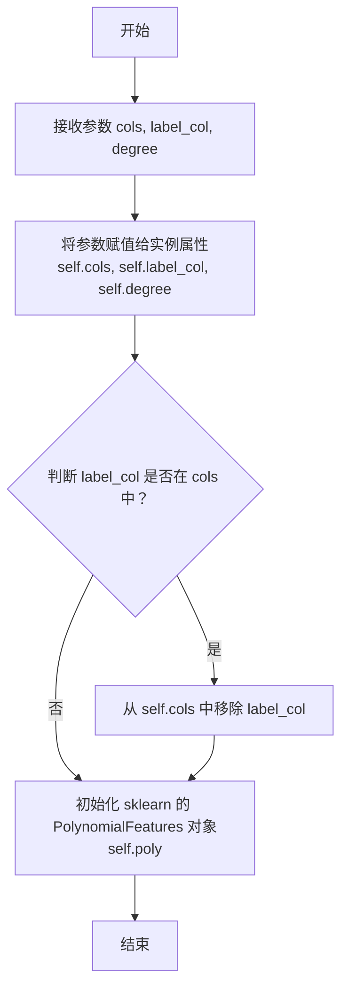

#### 带注释源码

```python
def __init__(self, cols: list, label_col: str, degree: int = 2):
    """
    Initialize self.

    Args:
        cols (list): Columns for polynomial expansion.
        label_col (str): Label column name.
        degree (int, optional): The degree of the polynomial features. Defaults to 2.
    """
    # 存储传入的参数到实例变量
    self.cols = cols
    self.degree = degree
    self.label_col = label_col
    # 如果标签列被错误地包含在特征列列表中，则将其移除，避免对标签进行变换
    if self.label_col in self.cols:
        self.cols.remove(self.label_col)
    # 初始化 sklearn 的 PolynomialFeatures 转换器，用于后续生成多项式特征
    # include_bias=False 表示不生成常数项（即全为1的列）
    self.poly = PolynomialFeatures(degree=degree, include_bias=False)
```


### `PolynomialExpansion.fit`

该方法用于拟合多项式特征扩展器。它首先检查指定的列数，如果超过10列，则根据与标签列的绝对相关性选择前10个最重要的列。然后，使用这些列的数据（缺失值填充为0）来拟合一个多项式特征生成器。

参数：

- `df`：`pd.DataFrame`，输入的数据框，包含用于多项式扩展的列和标签列。

返回值：`None`，该方法不返回任何值，但会更新实例的内部状态（如`self.cols`和`self.poly`）。

#### 流程图

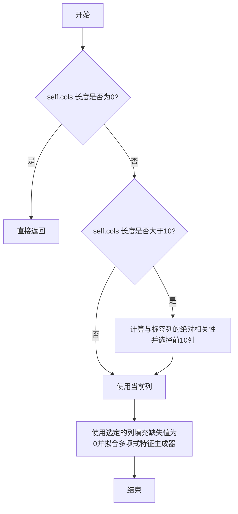

#### 带注释源码

```python
def fit(self, df: pd.DataFrame):
    # 如果指定的列数为0，则直接返回，无需进行任何操作
    if len(self.cols) == 0:
        return
    # 如果指定的列数超过10列，则根据与标签列的绝对相关性选择前10个最重要的列
    if len(self.cols) > 10:
        # 计算指定列与标签列的相关系数矩阵
        corr = df[self.cols + [self.label_col]].corr()
        # 获取与标签列的绝对相关性并降序排序
        corr = corr[self.label_col].abs().sort_values(ascending=False)
        # 选择前10个相关性最高的列（排除标签列本身）
        self.cols = corr.index.tolist()[1:11]

    # 使用选定的列（缺失值填充为0）来拟合多项式特征生成器
    self.poly.fit(df[self.cols].fillna(0))
```

### `PolynomialExpansion.transform`

该方法用于对输入DataFrame中指定的数值列进行多项式特征扩展（包括交互项），生成新的多项式特征列，并替换原始数值列。

参数：

- `df`：`pd.DataFrame`，输入的DataFrame，包含需要进行多项式扩展的数值列。

返回值：`pd.DataFrame`，处理后的新DataFrame，原始数值列被替换为多项式特征列。

#### 流程图

```mermaid
flowchart TD
    A[开始] --> B{self.cols长度是否为0?}
    B -- 是 --> C[直接返回原始df]
    B -- 否 --> D[使用self.poly.transform<br>对df[self.cols]进行多项式转换]
    D --> E[获取多项式特征列名]
    E --> F[将转换结果转换为DataFrame<br>并保持原始索引]
    F --> G[从原始df中删除self.cols列]
    G --> H[将多项式特征DataFrame<br>与删除后的df合并]
    H --> I[返回新DataFrame]
    C --> I
```

#### 带注释源码

```python
def transform(self, df: pd.DataFrame) -> pd.DataFrame:
    # 检查是否有需要处理的列
    if len(self.cols) == 0:
        return df  # 如果没有列需要处理，直接返回原始DataFrame

    # 对指定列进行多项式转换，缺失值用0填充
    ts_data = self.poly.transform(df[self.cols].fillna(0))
    # 获取多项式特征的列名
    column_name = self.poly.get_feature_names_out(self.cols)
    # 将转换结果转换为DataFrame，保持原始索引
    ts_data = pd.DataFrame(ts_data, index=df.index, columns=column_name)
    # 从原始DataFrame中删除原始数值列
    new_df = df.drop(self.cols, axis=1)
    # 将多项式特征DataFrame与删除原始列后的DataFrame合并
    new_df = pd.concat([new_df, ts_data], axis=1)
    # 返回处理后的新DataFrame
    return new_df
```

### `CatCount.__init__`

初始化 `CatCount` 类实例，用于为指定的分类列添加值计数作为新特征。

参数：

- `col`：`str`，需要进行值计数的分类列名。

返回值：`None`，此方法不返回任何值，仅用于初始化类实例。

#### 流程图

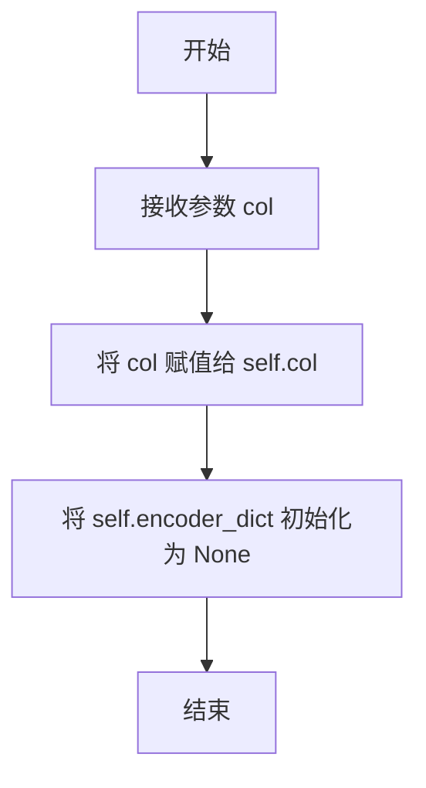

#### 带注释源码

```python
def __init__(self, col: str):
    """
    Initialize self.

    Args:
        col (str): Column for value counts.
    """
    self.col = col  # 存储需要进行值计数的列名
    self.encoder_dict = None  # 初始化编码字典，将在 fit 方法中填充
```


### `CatCount.fit`

该方法用于拟合（训练）`CatCount` 特征工程工具。其核心功能是计算指定分类列中每个唯一值的出现次数，并将结果存储为一个字典，以便在后续的`transform`阶段用于映射和生成新的计数特征。

参数：

-  `df`：`pd.DataFrame`，输入的训练数据集，用于计算指定分类列的值计数。

返回值：`None`，该方法不返回任何值，其作用是将计算得到的值计数字典存储在实例变量`self.encoder_dict`中。

#### 流程图

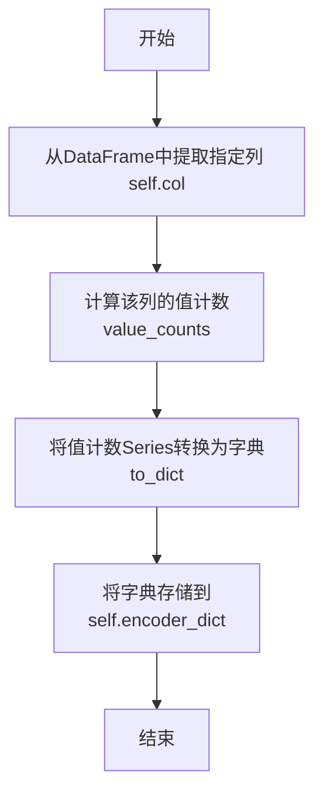

#### 带注释源码

```python
def fit(self, df: pd.DataFrame):
    # 计算输入DataFrame中指定列`self.col`的每个唯一值的出现次数
    # 结果是一个pandas Series，索引为唯一值，值为对应的计数
    self.encoder_dict = df[self.col].value_counts().to_dict()
    # 将上一步得到的Series转换为Python字典，并赋值给实例变量`self.encoder_dict`
    # 这个字典将在`transform`方法中用于将原始分类值映射为其出现次数
```


### `CatCount.transform`

该方法用于为输入DataFrame添加一个新特征列，该列的值是原始DataFrame中指定分类列（`self.col`）每个类别的出现次数（即频次）。它通过一个在`fit`阶段构建的编码字典（`self.encoder_dict`）进行映射，将频次信息作为新列添加到数据副本中。

参数：
- `df`：`pandas.DataFrame`，输入的原始数据框。

返回值：`pandas.DataFrame`，一个新的数据框，包含原始数据的所有列以及一个名为`{self.col}_cnt`的新列，该列存储了对应分类值的频次。

#### 流程图

```mermaid
flowchart TD
    A[开始: CatCount.transform(df)] --> B[创建输入DataFrame的副本 new_df]
    B --> C[使用self.encoder_dict映射self.col列<br>生成新列 {self.col}_cnt]
    C --> D[返回添加了新列的new_df]
    D --> E[结束]
```

#### 带注释源码

```python
def transform(self, df: pd.DataFrame) -> pd.DataFrame:
    # 1. 创建输入DataFrame的副本，避免修改原始数据
    new_df = df.copy()
    # 2. 使用在fit阶段构建的编码字典(self.encoder_dict)，
    #    对self.col列中的每个值进行映射，得到其对应的出现次数。
    #    映射结果作为一个新列添加到new_df中，列名为"{self.col}_cnt"。
    new_df[f"{self.col}_cnt"] = new_df[self.col].map(self.encoder_dict)
    # 3. 返回添加了新特征列的数据框
    return new_df
```

### `TargetMeanEncoder.__init__`

初始化目标均值编码器，用于将分类列编码为目标列的均值，并将结果作为新特征添加到数据框中。

参数：

- `col`：`str`，需要进行均值编码的分类列名
- `label`：`str`，预测目标列名

返回值：`None`，无返回值

#### 流程图

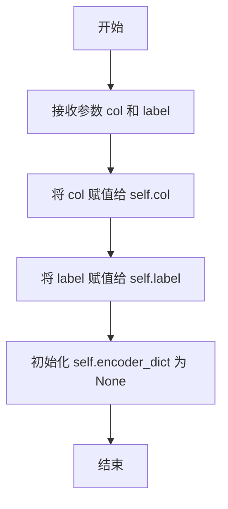

#### 带注释源码

```python
def __init__(self, col: str, label: str):
    """
    Initialize self.

    Args:
        col (str): Column to be mean encoded.  # 需要进行均值编码的列
        label (str): Predicted label column.   # 预测目标列
    """
    self.col = col          # 存储待编码的分类列名
    self.label = label      # 存储目标列名
    self.encoder_dict = None  # 初始化编码字典，将在fit方法中填充
```

### `TargetMeanEncoder.fit`

该方法用于计算并存储指定分类列（`col`）基于目标标签列（`label`）的均值编码映射。它通过按分类列分组并计算目标列的平均值来实现，生成一个字典，其中键是分类列的唯一值，值是对应的目标均值。该映射随后在 `transform` 方法中用于将分类值转换为数值特征。

参数：

- `df`：`pandas.DataFrame`，包含用于拟合编码器的训练数据。必须包含 `self.col` 和 `self.label` 指定的列。

返回值：`None`，该方法不返回任何值，但会更新实例的 `self.encoder_dict` 属性。

#### 流程图

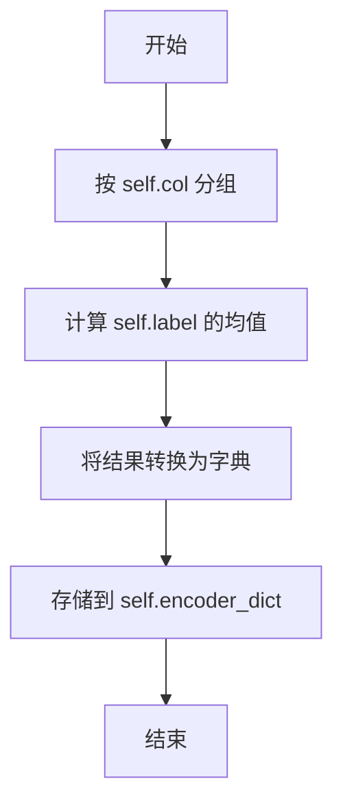

#### 带注释源码

```python
def fit(self, df: pd.DataFrame):
    # 按 self.col 指定的列对 DataFrame 进行分组
    # 对每个分组，计算 self.label 列的平均值
    # 将分组和均值的结果转换为 Python 字典
    # 将生成的编码字典存储在实例变量 self.encoder_dict 中，供后续的 transform 方法使用
    self.encoder_dict = df.groupby(self.col)[self.label].mean().to_dict()
```

### `TargetMeanEncoder.transform`

该方法用于对输入DataFrame中的指定分类列进行目标均值编码，并将编码结果作为新特征添加到DataFrame中。编码过程基于在`fit`阶段计算好的类别到目标变量均值的映射字典。

参数：

- `df`：`pd.DataFrame`，需要进行特征转换的输入DataFrame。

返回值：`pd.DataFrame`，一个新的DataFrame，其中包含了原始数据以及新增的目标均值编码特征列。

#### 流程图

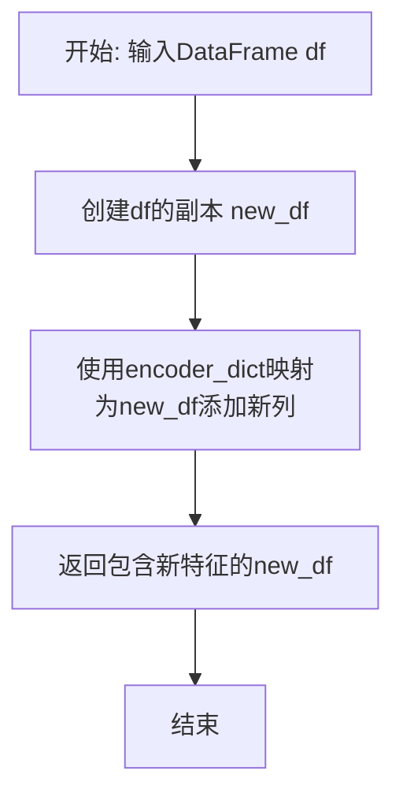

#### 带注释源码

```python
def transform(self, df: pd.DataFrame) -> pd.DataFrame:
    # 1. 创建输入DataFrame的副本，避免修改原始数据
    new_df = df.copy()
    # 2. 使用在fit阶段计算好的编码字典(self.encoder_dict)，
    #    对指定列(self.col)进行映射，生成新特征列。
    #    新列名为原列名加上后缀'_target_mean'。
    new_df[f"{self.col}_target_mean"] = new_df[self.col].map(self.encoder_dict)
    # 3. 返回包含新特征列的DataFrame
    return new_df
```

### `KFoldTargetMeanEncoder.__init__`

初始化 KFoldTargetMeanEncoder 类的实例，用于配置 K 折目标均值编码的参数。该方法设置要进行编码的列、目标标签列、K 折交叉验证的折数以及随机种子，为后续的 `fit` 和 `transform` 方法提供必要的配置。

参数：

- `col`：`str`，要进行 K 折目标均值编码的列名。
- `label`：`str`，预测目标标签的列名。
- `n_splits`：`int`，K 折交叉验证的折数，默认为 5。
- `random_state`：`int`，随机种子，用于确保 K 折划分的可重复性，默认为 2021。

返回值：`None`，该方法不返回任何值，仅用于初始化类的实例属性。

#### 流程图

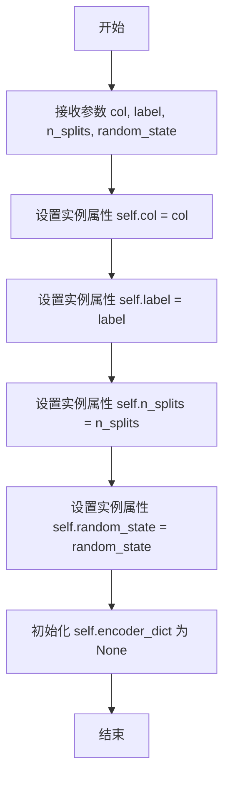

#### 带注释源码

```python
def __init__(self, col: str, label: str, n_splits: int = 5, random_state: int = 2021):
    """
    初始化 KFoldTargetMeanEncoder 实例。

    参数:
        col (str): 要进行 K 折目标均值编码的列名。
        label (str): 预测目标标签的列名。
        n_splits (int, optional): K 折交叉验证的折数，默认为 5。
        random_state (int, optional): 随机种子，用于确保 K 折划分的可重复性，默认为 2021。
    """
    # 存储要进行编码的列名
    self.col = col
    # 存储目标标签列名
    self.label = label
    # 存储 K 折交叉验证的折数
    self.n_splits = n_splits
    # 存储随机种子
    self.random_state = random_state
    # 初始化编码字典，将在 fit 方法中填充
    self.encoder_dict = None
```

### `KFoldTargetMeanEncoder.fit`

KFoldTargetMeanEncoder.fit 方法实现了K折目标均值编码的核心逻辑。它通过K折交叉验证的方式，计算每个类别在训练集上的目标变量均值，并使用该均值对验证集进行编码，最终生成一个全局的编码字典，以避免目标泄露并提高模型的泛化能力。

参数：

- `df`：`pd.DataFrame`，输入的训练数据集，包含待编码的类别列和目标列。

返回值：`None`，该方法不返回任何值，但会更新实例的`encoder_dict`属性，存储每个类别的K折目标均值编码映射。

#### 流程图

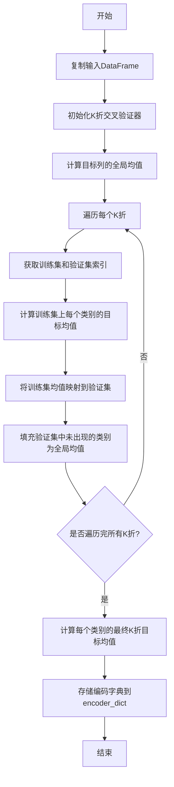

#### 带注释源码

```python
def fit(self, df: pd.DataFrame):
    # 复制输入DataFrame，避免修改原始数据
    tmp = df.copy()
    # 初始化K折交叉验证器，设置折数、是否打乱和随机种子
    kf = KFold(n_splits=self.n_splits, shuffle=True, random_state=self.random_state)

    # 计算目标列的全局均值，用于填充验证集中未出现的类别
    global_mean = tmp[self.label].mean()
    # 定义新特征列的名称
    col_name = f"{self.col}_kf_target_mean"
    # 遍历K折交叉验证的每一折
    for trn_idx, val_idx in kf.split(tmp, tmp[self.label]):
        # 根据索引划分训练集和验证集
        _trn, _val = tmp.iloc[trn_idx], tmp.iloc[val_idx]
        # 计算训练集上每个类别的目标均值，并映射到验证集
        tmp.loc[tmp.index[val_idx], col_name] = _val[self.col].map(_trn.groupby(self.col)[self.label].mean())
    # 将验证集中未出现的类别（NaN值）填充为全局均值
    tmp[col_name].fillna(global_mean, inplace=True)
    # 计算每个类别的最终K折目标均值（即所有折的平均值），并存储为字典
    self.encoder_dict = tmp.groupby(self.col)[col_name].mean().to_dict()
```

### `KFoldTargetMeanEncoder.transform`

该方法用于对输入的DataFrame应用已拟合的K折目标均值编码。它通过映射在`fit`阶段计算出的编码字典，为指定的分类列创建一个新的特征列，该列包含基于目标变量均值的编码值。

参数：

- `df`：`pd.DataFrame`，需要应用K折目标均值编码的输入DataFrame。

返回值：`pd.DataFrame`，一个新的DataFrame，包含原始数据以及新增的K折目标均值编码特征列。

#### 流程图

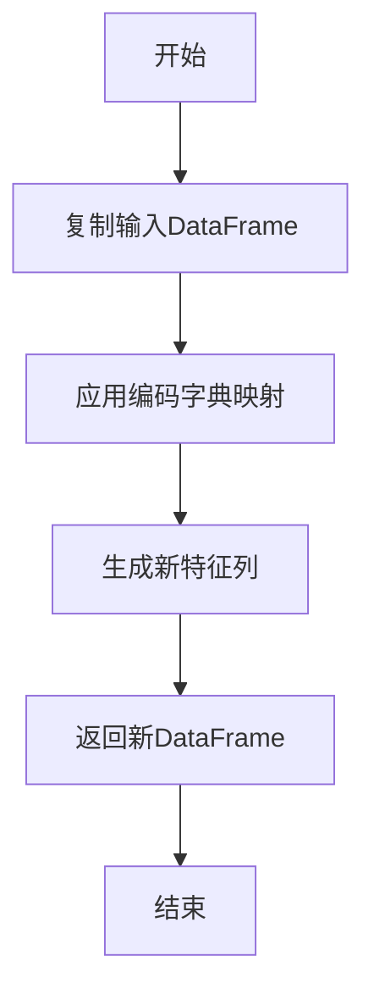

#### 带注释源码

```python
def transform(self, df: pd.DataFrame) -> pd.DataFrame:
    # 复制输入DataFrame以避免修改原始数据
    new_df = df.copy()
    # 使用在fit阶段计算出的编码字典，将分类列的值映射为目标均值
    # 新列名格式为：{原始列名}_kf_target_mean
    new_df[f"{self.col}_kf_target_mean"] = new_df[self.col].map(self.encoder_dict)
    # 返回包含新特征列的DataFrame
    return new_df
```

### `CatCross.__init__`

初始化 `CatCross` 类，用于创建两两交叉的分类特征并将其转换为数值特征。

参数：

- `cols`：`list`，需要进行两两交叉的列名列表，至少需要2列。
- `max_cat_num`：`int`，可选，每个交叉特征的最大唯一类别数，默认为100。

返回值：`None`，此方法不返回任何值，仅用于初始化类的实例。

#### 流程图

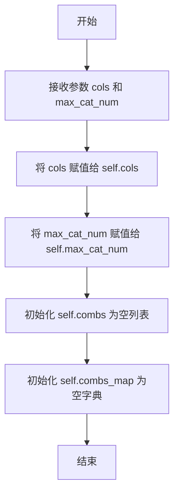

#### 带注释源码

```python
def __init__(self, cols: list, max_cat_num: int = 100):
    """
    Initialize self.

    Args:
        cols (list): Columns to be pairwise crossed, at least 2 columns.
        max_cat_num (int, optional): Maximum unique categories per crossed feature. Defaults to 100.
    """
    # 存储需要进行两两交叉的列名列表
    self.cols = cols
    # 存储每个交叉特征的最大唯一类别数
    self.max_cat_num = max_cat_num
    # 初始化用于存储两两列组合的列表
    self.combs = []
    # 初始化用于存储交叉特征映射关系的字典
    self.combs_map = {}
```

### `CatCross._cross_two`

该方法用于交叉两个分类列，生成一个新的组合列，并将每个唯一的组合映射为一个整数编码。

参数：

- `comb`：`tuple`，包含两个要交叉的列名的元组
- `df`：`pd.DataFrame`，输入的DataFrame，包含要交叉的列

返回值：`tuple`，返回一个元组，包含新列名和组合映射字典

#### 流程图

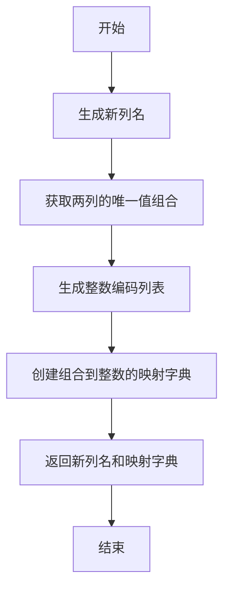

#### 带注释源码

```python
@staticmethod
def _cross_two(comb, df):
    """
    交叉两个列并将它们转换为数值特征。

    Args:
        comb (tuple): 要交叉的列对。
        df (pd.DataFrame): 输入的DataFrame。

    Returns:
        tuple: 新列名和交叉特征映射。
    """
    # 生成新列名，格式为"列1_列2"
    new_col = f"{comb[0]}_{comb[1]}"
    
    # 获取两列所有唯一值的笛卡尔积组合
    new_col_combs = list(itertools.product(df[comb[0]].unique(), df[comb[1]].unique()))
    
    # 生成从0开始的连续整数编码列表
    ll = list(range(len(new_col_combs)))
    
    # 创建组合到整数的映射字典
    comb_map = dict(zip(new_col_combs, ll))
    
    # 返回新列名和映射字典
    return new_col, comb_map
```

### `CatCross.fit`

该方法用于拟合CatCross特征交叉转换器。它首先根据最大类别数阈值过滤掉类别数过多的列，然后生成所有可能的列对组合，并使用并行计算为每个组合创建交叉特征映射字典，最终存储这些映射以供后续转换使用。

参数：

- `df`：`pd.DataFrame`，输入的DataFrame，包含需要进行特征交叉的列

返回值：`None`，该方法不返回任何值，但会更新实例的内部状态（`self.cols`、`self.combs`、`self.combs_map`）

#### 流程图

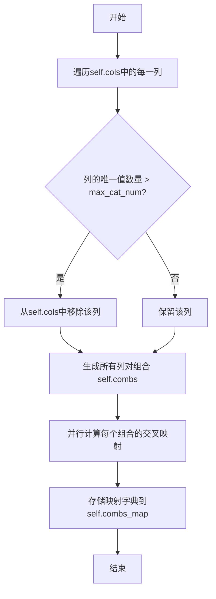

#### 带注释源码

```python
def fit(self, df: pd.DataFrame):
    # 遍历初始化时指定的列列表
    for col in self.cols:
        # 如果某列的唯一值数量超过设定的最大类别数阈值
        if df[col].nunique() > self.max_cat_num:
            # 则从待处理的列列表中移除该列，避免生成过于稀疏的交叉特征
            self.cols.remove(col)
    # 使用itertools.combinations生成所有可能的列对组合（长度为2）
    self.combs = list(itertools.combinations(self.cols, 2))
    # 使用Joblib进行并行计算，对每个列对组合调用静态方法_cross_two
    # 生成交叉特征的新列名和映射字典
    res = Parallel(n_jobs=4, require="sharedmem")(delayed(self._cross_two)(comb, df) for comb in self.combs)
    # 将并行计算的结果（列表 of (new_col, comb_map) 元组）转换为字典
    # 键为新列名，值为交叉映射字典
    self.combs_map = dict(res)
```

### `CatCross.transform`

该方法用于将数据集中指定的分类列进行两两组合交叉，生成新的交叉特征列，并将这些交叉特征映射为数值型数据。

参数：

- `df`：`pd.DataFrame`，输入的原始数据集，包含需要进行交叉的特征列。

返回值：`pd.DataFrame`，处理后的数据集，新增了交叉特征列，并移除了原始的分类列。

#### 流程图

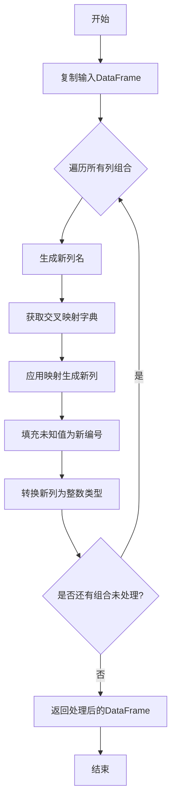

#### 带注释源码

```python
def transform(self, df: pd.DataFrame) -> pd.DataFrame:
    # 复制输入DataFrame，避免修改原始数据
    new_df = df.copy()
    # 遍历所有在fit阶段确定的两两列组合
    for comb in self.combs:
        # 根据组合的两列生成新列名，格式为“列1_列2”
        new_col = f"{comb[0]}_{comb[1]}"
        # 从combs_map中获取该组合对应的交叉映射字典
        _map = self.combs_map[new_col]
        # 将两列的值组合成元组，并根据映射字典转换为数值
        new_df[new_col] = pd.Series(zip(new_df[comb[0]], new_df[comb[1]])).map(_map)
        # 将映射中不存在的值（未知组合）填充为最大映射值加1
        new_df[new_col].fillna(max(_map.values()) + 1, inplace=True)
        # 将新列的数据类型转换为整数
        new_df[new_col] = new_df[new_col].astype(int)
    # 返回处理后的DataFrame
    return new_df
```

### `GroupStat.__init__`

初始化 `GroupStat` 类实例，用于配置基于分组列的聚合统计特征生成。该类通过指定分组列、待聚合列以及聚合函数列表，在后续的 `fit` 和 `transform` 方法中计算并添加新的聚合特征列。

参数：

- `group_col`：`str`，用于分组的列名。
- `agg_col`：`str`，待进行聚合计算的列名。
- `agg_funcs`：`list`，聚合函数列表，例如 `['mean', 'std']`。列表中的每个函数必须是 pandas 支持的聚合函数。

返回值：`None`，此方法为构造函数，不返回任何值。

#### 流程图

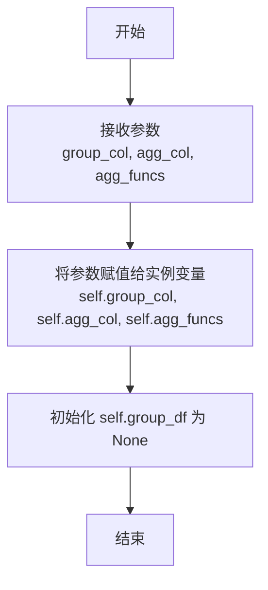

#### 带注释源码

```python
def __init__(self, group_col: str, agg_col: str, agg_funcs: list):
    """
    Initialize self.

    Args:
        group_col (str): Column used for grouping.
        agg_col (str): Column on which aggregation is performed.
        agg_funcs (list): List of aggregation functions to apply, such as ['mean', 'std']. Each function must be supported by pandas.
    """
    # 将传入的分组列名赋值给实例变量 self.group_col
    self.group_col = group_col
    # 将传入的待聚合列名赋值给实例变量 self.agg_col
    self.agg_col = agg_col
    # 将传入的聚合函数列表赋值给实例变量 self.agg_funcs
    self.agg_funcs = agg_funcs
    # 初始化 self.group_df 为 None，该变量将在 fit 方法中被填充为聚合结果
    self.group_df = None
```

### `GroupStat.fit`

该方法用于计算指定列在按另一列分组后的聚合统计量，并将结果存储在实例变量中，供后续的`transform`方法使用。

参数：
- `df`：`pandas.DataFrame`，输入的DataFrame，包含用于分组和聚合的列。

返回值：`None`，该方法不返回任何值，但会更新实例变量`self.group_df`。

#### 流程图

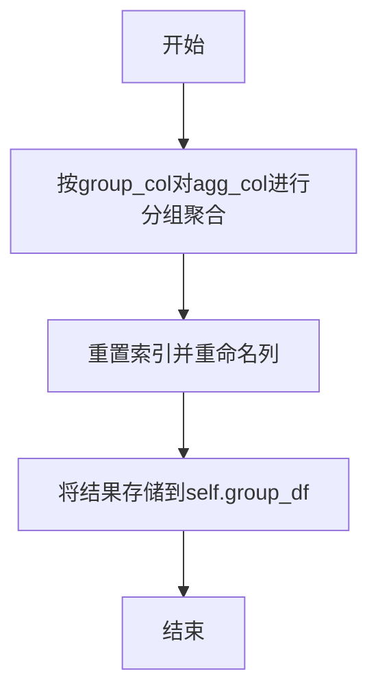

#### 带注释源码

```python
def fit(self, df: pd.DataFrame):
    # 按group_col分组，并对agg_col应用agg_funcs中指定的聚合函数
    group_df = df.groupby(self.group_col)[self.agg_col].agg(self.agg_funcs).reset_index()
    # 重命名聚合结果列，格式为：agg_col_agg_func_by_group_col
    group_df.columns = [self.group_col] + [
        f"{self.agg_col}_{agg_func}_by_{self.group_col}" for agg_func in self.agg_funcs
    ]
    # 将聚合结果存储在实例变量group_df中，供transform方法使用
    self.group_df = group_df
```

### `GroupStat.transform`

该方法基于在`fit`阶段计算好的分组聚合统计信息，将新的聚合特征列合并到输入的DataFrame中。它通过左连接（left join）的方式，将原始数据与预先计算好的分组统计表（`self.group_df`）进行合并，从而为每一行数据添加其所属分组在指定列上的聚合统计值（如均值、标准差等）。

参数：

- `df`：`pd.DataFrame`，输入的待转换的DataFrame。

返回值：`pd.DataFrame`，一个新的DataFrame，包含了原始数据以及新增的聚合统计特征列。

#### 流程图

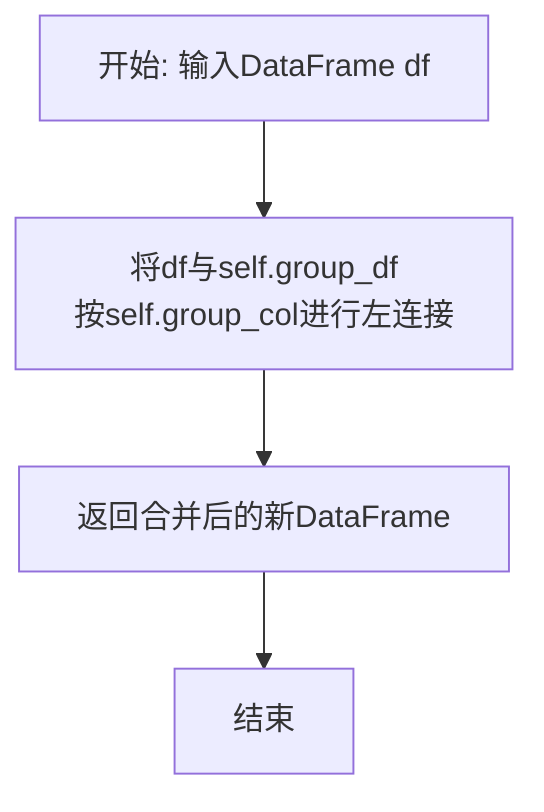

#### 带注释源码

```python
def transform(self, df: pd.DataFrame) -> pd.DataFrame:
    # 将输入的DataFrame `df` 与在fit阶段计算好的分组统计DataFrame `self.group_df` 进行合并。
    # 合并方式为左连接（how="left"），连接键为分组列 `self.group_col`。
    # 这将为df中的每一行，根据其`self.group_col`的值，添加对应的聚合统计特征。
    new_df = df.merge(self.group_df, on=self.group_col, how="left")
    # 返回合并后的新DataFrame。
    return new_df
```

### `SplitBins.__init__`

初始化 `SplitBins` 类，用于将指定的连续数据列进行分箱处理，并直接返回整数编码的箱标识符。

参数：

- `cols`：`list`，需要进行分箱处理的列名列表。
- `strategy`：`str`，定义分箱宽度的策略，可选值为 `'quantile'`（分位数）、`'uniform'`（均匀）或 `'kmeans'`（K均值），默认为 `'quantile'`。

返回值：`None`，无返回值。

#### 流程图

```mermaid
flowchart TD
    A[开始] --> B[接收参数 cols 和 strategy]
    B --> C[将 cols 赋值给 self.cols]
    C --> D[将 strategy 赋值给 self.strategy]
    D --> E[初始化 self.encoder 为 None]
    E --> F[结束]
```

#### 带注释源码

```python
def __init__(self, cols: list, strategy: str = "quantile"):
    """
    Initialize self.

    Args:
        cols (list): Columns to be binned inplace.
        strategy (str, optional): Strategy used to define the widths of the bins. Enum: ['quantile', 'uniform', 'kmeans']. Defaults to 'quantile'.
    """
    self.cols = cols          # 存储需要进行分箱处理的列名列表
    self.strategy = strategy  # 存储分箱策略，默认为 'quantile'
    self.encoder = None       # 初始化分箱编码器为 None，将在 fit 方法中设置
```

### `SplitBins.fit`

该方法用于拟合一个分箱器（KBinsDiscretizer），将指定的连续数值列（`self.cols`）根据预设的策略（如分位数、均匀、K均值）划分为多个区间（bins）。拟合过程会计算每个列的边界值，以便在后续的`transform`方法中将原始数据转换为对应的整数分箱标识符。

参数：

- `df`：`pandas.DataFrame`，用于拟合分箱器的训练数据集。该数据应包含`self.cols`中指定的所有列。

返回值：`None`，该方法不返回任何值，但会更新实例的`self.encoder`属性，使其成为一个已拟合的`KBinsDiscretizer`对象。

#### 流程图

```mermaid
flowchart TD
    A[开始] --> B{检查 self.cols 是否为空?}
    B -- 是 --> C[直接返回]
    B -- 否 --> D[使用 KBinsDiscretizer 初始化 self.encoder]
    D --> E[用 df[self.cols] 填充缺失值后拟合分箱器]
    E --> F[结束]
```

#### 带注释源码

```python
def fit(self, df: pd.DataFrame):
    # 初始化一个 KBinsDiscretizer 对象，使用预设的分箱策略，并将编码方式设置为序数编码（返回整数）
    self.encoder = KBinsDiscretizer(strategy=self.strategy, encode="ordinal")
    # 使用输入数据框 df 中指定的列（self.cols）进行拟合。在拟合前，先用 0 填充缺失值。
    self.encoder.fit(df[self.cols].fillna(0))
```

### `SplitBins.transform`

该方法用于对指定的连续数值列进行分箱处理，将连续数据转换为离散的整数编码区间标识符，并直接替换原始列。

参数：

- `df`：`pd.DataFrame`，输入的DataFrame，包含需要进行分箱处理的列。

返回值：`pd.DataFrame`，处理后的新DataFrame，其中指定的连续列已被替换为分箱后的整数编码。

#### 流程图

```mermaid
flowchart TD
    A[开始] --> B[复制输入DataFrame]
    B --> C[用0填充指定列的缺失值]
    C --> D[使用预训练的KBinsDiscretizer<br>进行分箱转换]
    D --> E[将转换结果赋值回<br>新DataFrame的对应列]
    E --> F[返回新DataFrame]
    F --> G[结束]
```

#### 带注释源码

```python
def transform(self, df: pd.DataFrame) -> pd.DataFrame:
    # 1. 创建输入DataFrame的副本，避免修改原始数据
    new_df = df.copy()
    # 2. 使用预训练好的KBinsDiscretizer模型（self.encoder）对指定列（self.cols）进行转换。
    #    转换前，先使用0填充这些列的缺失值（NaN）。
    #    转换结果直接赋值回新DataFrame的对应列，完成原地替换。
    new_df[self.cols] = self.encoder.transform(new_df[self.cols].fillna(0))
    # 3. 返回处理后的新DataFrame
    return new_df
```

### `ExtractTimeComps.__init__`

初始化 `ExtractTimeComps` 类，用于从指定的时间列中提取时间组件（如年、月、日等）并作为新特征添加到数据集中。

参数：

- `time_col`：`str`，包含时间数据的列名。
- `time_comps`：`list`，要提取的时间组件列表，每个组件必须是 `['year', 'month', 'day', 'hour', 'dayofweek', 'is_weekend']` 中的一个。

返回值：`None`，无返回值。

#### 流程图

```mermaid
graph TD
    A[开始] --> B[接收参数 time_col 和 time_comps]
    B --> C[将 time_col 赋值给 self.time_col]
    C --> D[将 time_comps 赋值给 self.time_comps]
    D --> E[结束]
```

#### 带注释源码

```python
def __init__(self, time_col: str, time_comps: list):
    """
    初始化 ExtractTimeComps 类。

    Args:
        time_col (str): 包含时间数据的列名。
        time_comps (list): 要提取的时间组件列表，每个组件必须是 ['year', 'month', 'day', 'hour', 'dayofweek', 'is_weekend'] 中的一个。
    """
    self.time_col = time_col  # 存储时间列名
    self.time_comps = time_comps  # 存储要提取的时间组件列表
```

### `ExtractTimeComps.fit`

该方法用于拟合时间特征提取器，但由于时间特征提取不依赖于训练数据（仅依赖于固定的时间组件列表），因此该方法为空实现，不执行任何操作。

参数：

- `df`：`pd.DataFrame`，输入的数据框，包含时间列。

返回值：`None`，无返回值。

#### 流程图

```mermaid
flowchart TD
    A[开始] --> B[空实现<br>不执行任何操作]
    B --> C[结束]
```

#### 带注释源码

```python
def fit(self, df: pd.DataFrame):
    pass  # 时间特征提取不依赖于训练数据，因此空实现
```


### `ExtractTimeComps.transform`

该方法从指定的日期时间列中提取预定义的时间组件（如年、月、日等），并将这些组件作为新的特征列添加到原始DataFrame中。

参数：

-  `df`：`pd.DataFrame`，输入的原始数据DataFrame，必须包含`self.time_col`指定的列。

返回值：`pd.DataFrame`，一个新的DataFrame，包含了原始数据以及新增的时间组件特征列。

#### 流程图

```mermaid
flowchart TD
    A[开始: 输入DataFrame df] --> B[将time_col列转换为pandas datetime格式<br/>错误强制转换为NaT]
    B --> C{检查time_comps列表<br/>包含'year'?}
    C -- 是 --> D[提取年份到新DataFrame]
    C -- 否 --> E{检查time_comps列表<br/>包含'month'?}
    D --> E
    E -- 是 --> F[提取月份到新DataFrame]
    E -- 否 --> G{检查time_comps列表<br/>包含'day'?}
    F --> G
    G -- 是 --> H[提取日到新DataFrame]
    G -- 否 --> I{检查time_comps列表<br/>包含'hour'?}
    H --> I
    I -- 是 --> J[提取小时到新DataFrame]
    I -- 否 --> K{检查time_comps列表<br/>包含'dayofweek'?}
    J --> K
    K -- 是 --> L[提取星期几到新DataFrame<br/>（转换为1-7）]
    K -- 否 --> M{检查time_comps列表<br/>包含'is_weekend'?}
    L --> M
    M -- 是 --> N[提取是否为周末到新DataFrame<br/>（周末为1，否则为0）]
    M -- 否 --> O[将提取的时间组件DataFrame<br/>与原始df按行拼接]
    N --> O
    O --> P[返回新的DataFrame]
```

#### 带注释源码

```python
    def transform(self, df: pd.DataFrame) -> pd.DataFrame:
        # 1. 将指定的时间列转换为pandas的datetime类型，转换错误时强制设为NaT（Not a Time）
        time_s = pd.to_datetime(df[self.time_col], errors="coerce")
        # 2. 创建一个空的DataFrame，用于存放提取出的时间组件
        time_comps_df = pd.DataFrame()

        # 3. 根据初始化时指定的time_comps列表，逐一提取对应的时间组件
        if "year" in self.time_comps:
            # 提取年份
            time_comps_df["year"] = time_s.dt.year
        if "month" in self.time_comps:
            # 提取月份（1-12）
            time_comps_df["month"] = time_s.dt.month
        if "day" in self.time_comps:
            # 提取日（1-31）
            time_comps_df["day"] = time_s.dt.day
        if "hour" in self.time_comps:
            # 提取小时（0-23）
            time_comps_df["hour"] = time_s.dt.hour
        if "dayofweek" in self.time_comps:
            # 提取星期几，pandas默认0=Monday，这里+1转换为1=Monday, ..., 7=Sunday
            time_comps_df["dayofweek"] = time_s.dt.dayofweek + 1
        if "is_weekend" in self.time_comps:
            # 判断是否为周末（周六=5，周日=6），是则标记为1，否则为0
            time_comps_df["is_weekend"] = time_s.dt.dayofweek.isin([5, 6]).astype(int)
        # 4. 将原始DataFrame与提取出的时间组件DataFrame按列（axis=1）拼接
        new_df = pd.concat([df, time_comps_df], axis=1)
        # 5. 返回包含新特征列的DataFrame
        return new_df
```


### `GeneralSelection.__init__`

初始化 `GeneralSelection` 类实例，用于特征选择，主要功能是移除全为 NaN、只有一个唯一值、包含无穷值或为对象类型且唯一值等于样本数的特征。

参数：

- `label_col`：`str`，标签列的名称，用于在特征选择过程中区分特征列和标签列。

返回值：`None`，初始化方法不返回任何值。

#### 流程图

```mermaid
flowchart TD
    A[开始] --> B[接收参数 label_col]
    B --> C[将 label_col 赋值给 self.label_col]
    C --> D[初始化 self.feats 为空列表]
    D --> E[结束]
```

#### 带注释源码

```python
def __init__(self, label_col: str):
    # 初始化方法，设置标签列并准备特征列表
    self.label_col = label_col  # 存储标签列名称
    self.feats = []  # 初始化特征列表为空，将在 fit 方法中填充
```

### `GeneralSelection.fit`

该方法用于在特征工程过程中进行通用特征选择。它通过一系列规则（如移除全为NaN的列、唯一值列、包含无穷值的列以及高基数分类列）来筛选特征，最终确定一个特征列表用于后续的数据转换。

参数：

- `df`：`pd.DataFrame`，输入的Data框，包含待筛选的特征列和标签列。

返回值：`None`，该方法不返回任何值，但会更新实例的`feats`属性，存储筛选后的特征列表。

#### 流程图

```mermaid
flowchart TD
    A[开始] --> B[初始化特征列表feats<br>排除标签列]
    B --> C[遍历df的每一列]
    C --> D{列是否全为NaN?}
    D -- 是 --> E[从feats中移除该列]
    D -- 否 --> F{列的唯一值数是否为1?}
    F -- 是 --> G[从feats中移除该列]
    F -- 否 --> H{列是否包含无穷值?}
    H -- 是 --> I[从feats中移除该列]
    H -- 否 --> J{列是否为对象类型且<br>唯一值数等于总行数?}
    J -- 是 --> K[从feats中移除该列]
    J -- 否 --> L[保留该列]
    E --> M[继续下一列]
    G --> M
    I --> M
    K --> M
    L --> M
    M --> N{是否遍历完所有列?}
    N -- 否 --> C
    N -- 是 --> O[将最终特征列表<br>保存到self.feats]
    O --> P[结束]
```

#### 带注释源码

```python
def fit(self, df: pd.DataFrame):
    # 初始化特征列表，包含除标签列外的所有列
    feats = [f for f in df.columns if f != self.label_col]
    
    # 遍历DataFrame的每一列
    for col in df.columns:
        # 规则1：如果该列全部为NaN，则从特征列表中移除
        if df[col].isnull().sum() / df.shape[0] == 1:
            feats.remove(col)

        # 规则2：如果该列只有一个唯一值，则从特征列表中移除
        if df[col].nunique() == 1:
            feats.remove(col)

        # 规则3：如果该列包含无穷大或无穷小值，则从特征列表中移除
        # 注意：原代码有笔误，第二个条件应为 `df.loc[df[col] == -np.inf].shape[0] != 0`
        if df.loc[df[col] == np.inf].shape[0] != 0 or df.loc[df[col] == np.inf].shape[0] != 0:
            feats.remove(col)

        # 规则4：如果该列为对象类型（如字符串）且唯一值数等于总行数（高基数），则从特征列表中移除
        if is_object_dtype(df[col]) and df[col].nunique() == df.shape[0]:
            feats.remove(col)

    # 将筛选后的特征列表保存到实例变量中
    self.feats = feats
```

### `GeneralSelection.transform`

该方法用于对输入的数据框进行特征选择，仅保留在`fit`阶段筛选出的有效特征列以及标签列，并返回一个新的数据框。

参数：

- `df`：`pd.DataFrame`，输入的数据框，包含原始特征和标签列。

返回值：`pd.DataFrame`，一个新的数据框，仅包含筛选后的特征列和标签列。

#### 流程图

```mermaid
flowchart TD
    A[开始] --> B[从实例属性获取筛选后的特征列表 self.feats]
    B --> C[将标签列 self.label_col 加入特征列表]
    C --> D[使用特征列表从输入数据框 df 中选取对应列]
    D --> E[返回新的数据框 new_df]
    E --> F[结束]
```

#### 带注释源码

```python
def transform(self, df: pd.DataFrame) -> pd.DataFrame:
    # 创建一个新的数据框，仅包含在fit阶段筛选出的特征列（self.feats）和标签列（self.label_col）
    new_df = df[self.feats + [self.label_col]]
    # 返回处理后的新数据框
    return new_df
```

### `TreeBasedSelection.__init__`

初始化 `TreeBasedSelection` 类，用于基于树模型的特征选择。该方法设置标签列和任务类型，为后续的特征重要性计算和特征筛选做准备。

参数：

- `label_col`：`str`，标签列的名称，用于区分特征和目标变量。
- `task_type`：`str`，任务类型，指定机器学习任务的类型，如分类（'cls'）、多分类（'mcls'）或回归（'reg'）。

返回值：`None`，该方法不返回任何值，仅初始化类的实例属性。

#### 流程图

```mermaid
flowchart TD
    A[开始] --> B[接收参数 label_col 和 task_type]
    B --> C[将 label_col 赋值给 self.label_col]
    C --> D[将 task_type 赋值给 self.task_type]
    D --> E[将 self.feats 初始化为 None]
    E --> F[结束]
```

#### 带注释源码

```python
def __init__(self, label_col: str, task_type: str):
    """
    Initialize self.

    Args:
        label_col (str): Label column name.
        task_type (str): Task type, 'cls' for classification, 'mcls' for multi-class classification, 'reg' for regression.
    """
    self.label_col = label_col  # 存储标签列名
    self.task_type = task_type  # 存储任务类型
    self.feats = None  # 初始化特征列表为 None，将在 fit 方法中填充
```

### `TreeBasedSelection.fit`

该方法用于基于树模型的特征选择。它使用LightGBM模型训练数据，计算特征的重要性（基于增益），并筛选出重要性大于0的特征。最终，这些选中的特征（连同标签列）被存储在实例变量中，供后续的`transform`方法使用。

参数：

- `df`：`pd.DataFrame`，输入的DataFrame，包含特征列和标签列。

返回值：`None`，该方法不返回任何值，但会更新实例变量`self.feats`。

#### 流程图

```mermaid
graph TD
    A[开始] --> B[设置LightGBM参数]
    B --> C[筛选数值型特征列]
    C --> D[创建LightGBM数据集]
    D --> E[训练LightGBM模型]
    E --> F[计算特征重要性]
    F --> G[筛选重要性大于0的特征]
    G --> H[存储选中的特征]
    H --> I[结束]
```

#### 带注释源码

```python
def fit(self, df: pd.DataFrame):
    # 设置LightGBM模型的参数，根据任务类型调整目标函数和评估指标
    params = {
        "boosting_type": "gbdt",
        "objective": "binary",
        "learning_rate": 0.1,
        "num_leaves": 31,
    }

    if self.task_type == "cls":
        params["objective"] = "binary"
        params["metric"] = "auc"
    elif self.task_type == "mcls":
        params["objective"] = "multiclass"
        params["num_class"] = df[self.label_col].nunique()
        params["metric"] = "auc_mu"
    elif self.task_type == "reg":
        params["objective"] = "regression"
        params["metric"] = "rmse"

    # 筛选数值型特征列，排除标签列
    num_cols = df.select_dtypes(include=np.number).columns.tolist()
    cols = [f for f in num_cols if f not in [self.label_col]]

    # 创建LightGBM数据集
    dtrain = lgb.Dataset(df[cols], df[self.label_col])
    # 训练LightGBM模型，迭代100轮
    model = lgb.train(params, dtrain, num_boost_round=100)
    # 计算特征重要性（基于增益）
    df_imp = pd.DataFrame({"feature_name": dtrain.feature_name, "importance": model.feature_importance("gain")})

    # 按重要性降序排序
    df_imp.sort_values("importance", ascending=False, inplace=True)
    # 筛选重要性大于0的特征
    df_imp = df_imp[df_imp["importance"] > 0]
    # 存储选中的特征列名，并添加标签列
    self.feats = df_imp["feature_name"].tolist()
    self.feats.append(self.label_col)
```

### `TreeBasedSelection.transform`

该方法基于训练好的树模型特征重要性，从输入DataFrame中筛选出重要性大于0的特征列，并返回仅包含这些特征列的新DataFrame。

参数：

- `df`：`pd.DataFrame`，输入的待转换数据，应包含在`fit`阶段计算出的重要特征列。

返回值：`pd.DataFrame`，仅包含重要特征列（包括标签列）的新DataFrame。

#### 流程图

```mermaid
graph TD
    A[开始] --> B{self.feats 是否已定义?};
    B -- 是 --> C[从df中选取self.feats列];
    C --> D[返回新DataFrame];
    B -- 否 --> E[抛出异常或返回空DataFrame];
    E --> F[结束];
    D --> F;
```

#### 带注释源码

```python
def transform(self, df: pd.DataFrame) -> pd.DataFrame:
    # 使用在fit阶段计算出的重要特征列表self.feats
    # 从输入DataFrame df中选取这些列，生成新的DataFrame
    new_df = df[self.feats]
    return new_df
```

### `VarianceBasedSelection.__init__`

初始化方差选择器，用于基于方差阈值筛选数值特征。

参数：

- `label_col`：`str`，标签列的名称，用于在特征选择过程中排除该列。
- `threshold`：`float`，方差阈值，默认值为0。方差低于此阈值的特征将被移除。

返回值：`None`，此方法不返回任何值，仅用于初始化类的实例。

#### 流程图

```mermaid
flowchart TD
    A[开始] --> B[接收参数 label_col 和 threshold]
    B --> C[将参数赋值给实例属性]
    C --> D[初始化 VarianceThreshold 选择器]
    D --> E[结束]
```

#### 带注释源码

```python
def __init__(self, label_col: str, threshold: float = 0):
    """
    初始化方差选择器。

    Args:
        label_col (str): 标签列的名称，用于在特征选择过程中排除该列。
        threshold (float, optional): 方差阈值，默认值为0。方差低于此阈值的特征将被移除。
    """
    # 将标签列名称保存为实例属性
    self.label_col = label_col
    # 将方差阈值保存为实例属性
    self.threshold = threshold
    # 初始化特征列表为 None，将在 fit 方法中填充
    self.feats = None
    # 使用给定的阈值初始化 sklearn 的 VarianceThreshold 选择器
    self.selector = VarianceThreshold(threshold=self.threshold)
```

### `VarianceBasedSelection.fit`

该方法用于基于方差进行特征选择，移除方差低于指定阈值的数值型特征。它首先从输入DataFrame中提取数值型列（排除标签列），然后使用`VarianceThreshold`选择器拟合这些特征，保留方差大于等于阈值的特征，并更新内部特征列表。

参数：

- `df`：`pd.DataFrame`，输入的DataFrame，包含待处理的数值型特征和标签列。

返回值：`None`，该方法不返回任何值，但会更新内部状态（`self.feats`和`self.selector`）。

#### 流程图

```mermaid
flowchart TD
    A[开始] --> B[提取数值型列]
    B --> C[排除标签列]
    C --> D[使用VarianceThreshold拟合特征]
    D --> E[获取被选中的特征索引]
    E --> F[更新内部特征列表]
    F --> G[结束]
```

#### 带注释源码

```python
def fit(self, df: pd.DataFrame):
    # 提取所有数值型列
    num_cols = df.select_dtypes(include=np.number).columns.tolist()
    # 从数值型列中移除标签列，得到待处理的特征列
    cols = [f for f in num_cols if f not in [self.label_col]]

    # 使用VarianceThreshold选择器拟合特征，阈值在初始化时设置
    self.selector.fit(df[cols])
    # 获取被选中特征的列索引，并转换为列名列表
    self.feats = df[cols].columns[self.selector.get_support(indices=True)].tolist()
    # 将标签列添加回特征列表中，确保最终DataFrame包含标签
    self.feats.append(self.label_col)
```

### `VarianceBasedSelection.transform`

该方法基于方差阈值对数值型特征进行选择，移除方差低于指定阈值的特征，并返回仅包含选定特征及标签列的DataFrame。

参数：

- `df`：`pd.DataFrame`，输入的DataFrame，包含待处理的数值型特征和标签列。

返回值：`pd.DataFrame`，处理后的DataFrame，仅包含方差高于阈值的数值型特征及标签列。

#### 流程图

```mermaid
graph TD
    A[开始] --> B[从self.feats获取选定特征列]
    B --> C[从df中选取self.feats对应的列]
    C --> D[返回新DataFrame]
    D --> E[结束]
```

#### 带注释源码

```python
def transform(self, df: pd.DataFrame) -> pd.DataFrame:
    # 从DataFrame中选取在fit阶段确定的特征列（self.feats）
    # self.feats包含方差高于阈值的数值型特征及标签列
    new_df = df[self.feats]
    # 返回仅包含选定特征的新DataFrame
    return new_df
```

## 关键组件


### 多项式特征扩展 (PolynomialExpansion)

通过 `sklearn.preprocessing.PolynomialFeatures` 为选定的数值列生成多项式特征和交互特征，以捕捉特征间的非线性关系。

### 类别计数编码 (CatCount)

为指定的分类列添加一个新的特征，该特征表示该列中每个类别在训练集中的出现次数。

### 目标均值编码 (TargetMeanEncoder)

为指定的分类列添加一个新的特征，该特征表示该列中每个类别对应的目标变量（标签）在训练集中的平均值。

### K折目标均值编码 (KFoldTargetMeanEncoder)

使用K折交叉验证策略进行目标均值编码，以减少过拟合风险，为指定的分类列添加一个新的编码特征。

### 类别交叉编码 (CatCross)

对指定的多个分类列进行两两组合，生成新的交叉特征，并将其映射为数值型特征，以捕捉类别间的交互关系。

### 分组统计特征 (GroupStat)

根据一个分组列对另一个聚合列进行分组统计（如均值、标准差等），并将统计结果作为新特征添加到原始数据中。

### 分箱处理 (SplitBins)

使用 `sklearn.preprocessing.KBinsDiscretizer` 将连续的数值特征进行分箱（离散化），并直接返回整数编码的箱标识符。

### 时间特征提取 (ExtractTimeComps)

从指定的日期时间列中提取时间成分（如年、月、日、小时、星期几、是否为周末等），并将其作为新特征添加到数据中。

### 通用特征选择 (GeneralSelection)

基于简单的规则（如全为NaN、唯一值、无穷值、高基数分类特征）进行特征筛选，移除低质量特征。

### 方差特征选择 (VarianceBasedSelection)

使用 `sklearn.feature_selection.VarianceThreshold` 移除方差低于指定阈值的数值特征，以过滤掉变化较小的特征。

### 基于树模型的特征选择 (TreeBasedSelection)

使用LightGBM模型训练并计算特征重要性，根据重要性分数（增益）筛选特征，移除重要性低的特征。


## 问题及建议


### 已知问题

-   **`PolynomialExpansion.fit` 方法中的副作用**：在 `fit` 方法中，当 `self.cols` 数量超过10时，会直接修改 `self.cols` 列表，将其替换为与标签列相关性最高的前10个特征。这导致 `fit` 方法具有副作用，改变了对象的状态，使得后续调用 `transform` 时使用的特征列与初始传入的 `cols` 参数不一致，可能引发混淆和错误。
-   **`CatCross.fit` 方法中的副作用**：在 `fit` 方法中，会遍历 `self.cols` 列表，如果某个列的唯一种类数超过 `max_cat_num`，则直接从 `self.cols` 列表中移除该列。这同样是一个具有副作用的操作，改变了对象的初始状态，可能导致后续逻辑与预期不符。
-   **`GeneralSelection.fit` 方法中的潜在错误**：在检查无穷大值时，代码 `df.loc[df[col] == np.inf].shape[0] != 0 or df.loc[df[col] == np.inf].shape[0] != 0` 存在笔误，第二个条件重复了 `np.inf` 的检查，而漏掉了对 `-np.inf` 的检查。正确的逻辑应为 `df.loc[df[col] == np.inf].shape[0] != 0 or df.loc[df[col] == -np.inf].shape[0] != 0`。
-   **`CatCross.transform` 方法中的潜在错误**：在填充未知交叉值时，使用 `max(_map.values()) + 1` 作为新值。如果 `_map` 的值为空（例如，当 `_cross_two` 生成的组合映射为空时），`max(_map.values())` 会抛出 `ValueError`。此外，对于未知值，统一赋予同一个新值可能不是最优策略。
-   **`ExtractTimeComps` 和 `TreeBasedSelection` 类未被注册**：这两个类被注释掉了 `@register_tool` 装饰器，导致它们无法作为工具被外部系统发现和使用，可能是开发过程中的遗漏或临时禁用。
-   **硬编码的并行作业数**：`CatCross.fit` 方法中使用了 `Parallel(n_jobs=4, ...)`，将并行作业数硬编码为4。这在不同配置的机器上可能不是最优选择，可能造成资源利用不足或过度竞争。
-   **`PolynomialExpansion` 特征选择逻辑简单**：仅基于与标签的绝对相关性选择前10个特征进行多项式展开，忽略了特征间的多重共线性等问题，且阈值10是硬编码的，缺乏灵活性。
-   **`KFoldTargetMeanEncoder.fit` 中的潜在数据泄露**：在 `fit` 方法中，虽然使用了 KFold 来避免目标编码时的数据泄露，但最终 `self.encoder_dict` 是通过对整个 `tmp` DataFrame（包含所有 KFold 生成的编码值）进行分组平均得到的。严格来说，在计算每个类别的最终编码值时，应避免使用该类别在测试折中的信息。更严谨的做法是使用训练折的编码字典，或者使用整个训练集的全局统计量进行平滑处理。

### 优化建议

-   **避免在 `fit` 方法中修改输入参数**：对于 `PolynomialExpansion` 和 `CatCross` 类，建议在 `fit` 方法内部使用局部变量来存储处理后的列列表（例如 `self._cols_to_use`），而不是直接修改 `self.cols`。这样保持了初始参数的不可变性，使对象行为更可预测。
-   **修复 `GeneralSelection` 中的逻辑错误**：更正检查无穷大值的条件，确保同时检查 `np.inf` 和 `-np.inf`。
-   **增强 `CatCross.transform` 的鲁棒性**：在填充未知交叉值前，检查 `_map` 是否为空。考虑对未知值使用更安全的填充策略，例如使用一个特定的、在映射范围外的常量（如 `-1`），或者在 `fit` 阶段就预留一个“未知”类别。
-   **启用或明确注释未注册的类**：审查 `ExtractTimeComps` 和 `TreeBasedSelection` 类的代码，如果功能完整且稳定，应移除注释以启用 `@register_tool` 装饰器。如果仍在开发或存在已知问题，应添加更明确的注释说明原因。
-   **使并行作业数可配置**：将 `CatCross.fit` 中的 `n_jobs` 参数化，例如作为 `__init__` 的一个可选参数，默认为 `-1`（使用所有CPU核心）或由环境决定，提高代码的适应性和可配置性。
-   **改进特征选择策略**：为 `PolynomialExpansion` 的特征选择逻辑提供可配置参数，如 `max_features`（替换硬编码的10）和特征选择方法（如基于方差、基于模型等），增加灵活性。
-   **优化 `KFoldTargetMeanEncoder` 的编码计算**：考虑实现更严谨的 KFold 目标编码方案，例如，在 `fit` 阶段仅计算并存储每个 KFold 的编码字典，在 `transform` 阶段根据样本所属的类别，从对应的训练折字典中获取编码值，或者使用加性平滑（Additive Smoothing）将折内均值与全局均值结合，以更好地防止过拟合和数据泄露。
-   **增加输入验证**：在各个类的 `__init__` 和 `fit` 方法中增加对输入参数的验证（如检查 `cols` 列表是否为空、`label_col` 是否存在、数据类型是否正确等），并提供清晰的错误信息，提高代码的健壮性。
-   **统一缺失值处理策略**：目前不同类对缺失值的处理方式不一致（如 `PolynomialExpansion` 和 `SplitBins` 使用 `fillna(0)`，其他类可能未处理）。建议明确缺失值处理策略，或在文档中说明每个类对缺失值的假设和处理方式。
-   **性能优化**：对于 `GroupStat` 等类，如果 `group_df` 很大，多次 `merge` 操作可能成为瓶颈。可以考虑在需要频繁调用的场景下，将分组统计结果持久化或使用更高效的数据结构。


## 其它


### 设计目标与约束

本模块旨在提供一个可扩展、模块化的特征工程工具集，用于机器学习数据预处理。其核心设计目标包括：
1.  **功能独立性**：每个特征工程类（如`PolynomialExpansion`、`TargetMeanEncoder`）应封装单一、明确的功能，遵循“单一职责原则”，便于单独使用和组合。
2.  **接口一致性**：所有工具类均继承自`MLProcess`基类，强制实现`fit`和`transform`方法，确保与scikit-learn等库的`Pipeline`机制兼容，支持顺序执行和交叉验证。
3.  **可配置性**：通过构造函数的参数（如`degree`、`n_splits`、`threshold`）提供灵活的配置选项，以适应不同的数据和任务需求。
4.  **性能考量**：对于可能耗时的操作（如`CatCross`中的特征交叉），使用`joblib.Parallel`进行并行化处理以提高效率。
5.  **注册机制**：通过`@register_tool`装饰器将工具注册到元工具库中，实现动态发现和调用，这是集成到更大系统（如MetaGPT）的关键约束。

### 错误处理与异常设计

当前代码的错误处理较为隐式，主要依赖Pandas和scikit-learn等底层库的异常抛出。潜在改进点包括：
1.  **输入验证**：在`fit`和`transform`方法开始时，缺乏对输入`DataFrame`结构、列存在性、数据类型（如`CatCount`要求分类列）的显式检查。应添加验证并抛出清晰的`ValueError`。
2.  **参数验证**：构造函数中对参数合法性的检查不足。例如，`PolynomialExpansion.degree`应为正整数，`SplitBins.strategy`应为指定枚举值。应在`__init__`中进行验证。
3.  **空值处理策略不一致**：不同类对缺失值的处理方式不同（如`PolynomialExpansion`用0填充，`GeneralSelection`直接删除全NaN列），缺乏统一策略和文档说明。应明确每个工具对NaN的处理逻辑，或提供`handle_na`参数。
4.  **健壮性**：`CatCross.transform`中，使用`.map(_map)`后对未知值填充为`max(_map.values()) + 1`，这假设了映射值为连续整数。若映射值非连续或非整数，此逻辑可能出错。应使用更健壮的方法，如填充为一个特定的“未知”标识符。
5.  **异常传播**：当底层库（如`sklearn`）抛出异常时，当前代码直接让异常向上传播。对于用户而言，错误信息可能不够友好。可考虑捕获常见异常并包装成更具上下文信息的自定义异常。

### 数据流与状态机

1.  **标准数据流**：每个`MLProcess`子类的典型数据流遵循“拟合-转换”模式：
    *   **`fit(df)`阶段**：基于训练数据`df`计算并存储转换所需的内部状态（如`encoder_dict`、`poly`对象、`group_df`）。此阶段不修改输入数据。
    *   **`transform(df)`阶段**：利用`fit`阶段存储的状态，对新的数据`df`（可以是训练集或测试集）应用转换，生成并返回包含新特征或修改后特征的`DataFrame`。测试集应使用训练集拟合的状态，以确保一致性。
2.  **状态管理**：每个工具类的实例在`fit`后成为一个带有状态的转换器。关键状态包括：
    *   `PolynomialExpansion.poly`: 拟合好的多项式特征生成器。
    *   `CatCount.encoder_dict`: 类别到计数的映射。
    *   `TargetMeanEncoder.encoder_dict`: 类别到目标均值的映射。
    *   `GroupStat.group_df`: 聚合统计结果表。
    *   `SplitBins.encoder`: 拟合好的分箱器。
    *   `GeneralSelection.feats` / `VarianceBasedSelection.feats`: 被选中的特征列名列表。
3.  **无状态工具**：`ExtractTimeComps`是一个例外，其`fit`方法为空(`pass`)，因为时间成分提取不依赖于训练数据分布，是无状态的纯转换。
4.  **状态机约束**：`transform`方法应在`fit`方法被成功调用后才能正确执行。当前代码未强制此顺序，调用未拟合的`transform`可能导致`AttributeError`（如访问`self.encoder_dict`）。理想情况下，应添加状态检查。

### 外部依赖与接口契约

1.  **核心外部库**：
    *   `pandas` (`pd`): 用于数据表操作的核心依赖。
    *   `numpy` (`np`): 用于数值计算。
    *   `scikit-learn` (`sklearn`): 提供了`PolynomialFeatures`、`KBinsDiscretizer`、`VarianceThreshold`等基础转换器，以及`KFold`用于交叉验证。
    *   `joblib`: 用于`CatCross`中的并行计算。
    *   （注释掉的）`lightgbm` (`lgb`): 为`TreeBasedSelection`功能所需，当前被禁用。
2.  **项目内部依赖**：
    *   `from metagpt.tools.libs.data_preprocess import MLProcess`: 所有工具类的基类，定义了`fit`和`transform`的接口契约。
    *   `from metagpt.tools.tool_registry import register_tool`: 装饰器，用于将工具注册到MetaGPT的工具注册表中，这是工具能被系统发现和调用的关键。
3.  **接口契约**：
    *   **与`MLProcess`的契约**：必须实现`fit(df: pd.DataFrame) -> None`和`transform(df: pd.DataFrame) -> pd.DataFrame`方法。
    *   **与`register_tool`的契约**：类必须用`@register_tool(tags=...)`装饰，并通常（非强制）包含一个清晰的文档字符串（`__doc__`），用于工具描述。
    *   **与使用者的契约**：通过构造函数参数配置工具行为；`fit`/`transform`方法接受并返回`pd.DataFrame`；转换通常不修改输入`DataFrame`，而是返回一个新对象（尽管`SplitBins`是部分就地修改副本）。
4.  **版本兼容性**：代码应与其依赖库的特定版本范围兼容。例如，`sklearn.feature_selection.VarianceThreshold`的行为可能随版本变化。

    