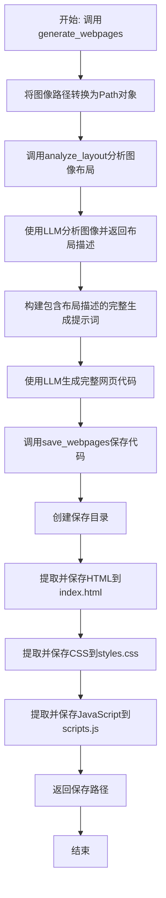
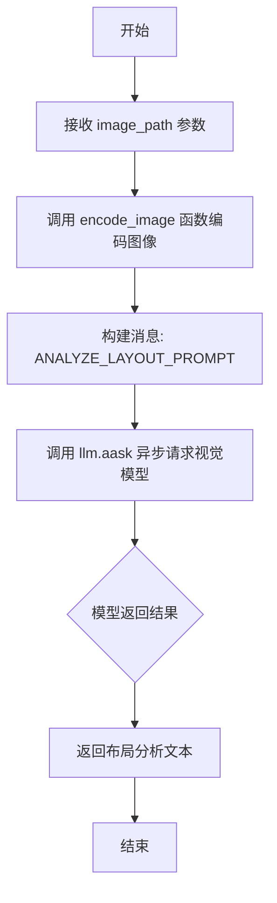
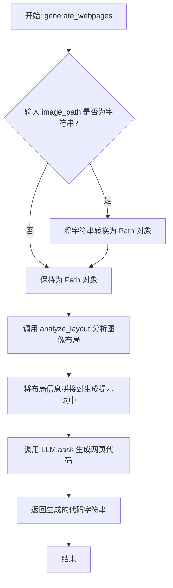

# `.\MetaGPT\metagpt\tools\libs\gpt_v_generator.py` 详细设计文档

该代码实现了一个基于GPT-4 Vision模型的网页代码生成器，能够从网页设计草图图像中分析布局信息，并生成包含HTML、CSS和JavaScript的完整网页代码，最后将生成的代码保存到指定目录中。

## 整体流程



## 类结构

```
GPTvGenerator (主类)
├── __init__ (初始化方法)
├── analyze_layout (布局分析方法)
├── generate_webpages (网页生成方法)
└── save_webpages (代码保存方法)
全局函数
└── extract_and_save_code (代码提取保存函数)
```

## 全局变量及字段


### `ANALYZE_LAYOUT_PROMPT`
    
用于指导视觉模型分析图像布局的系统提示词模板。

类型：`str`
    


### `GENERATE_PROMPT`
    
用于指导视觉模型根据图像和布局信息生成完整网页代码的系统提示词模板。

类型：`str`
    


### `GPTvGenerator.llm`
    
用于与OpenAI GPT-4 Vision模型进行交互的大语言模型实例。

类型：`metagpt.llm.LLM`
    
    

## 全局函数及方法

### `extract_and_save_code`

该函数用于从给定的文本中提取特定语言（如CSS或JavaScript）的代码块，并将其保存到指定文件夹下的文件中。它通过正则表达式匹配文件名模式，然后使用`CodeParser`解析出对应语言的代码，最后写入文件。

参数：

-  `folder`：`Path`，目标文件夹的路径，用于存放提取出的代码文件。
-  `text`：`str`，包含代码的原始文本，通常是从LLM生成的网页代码中获取。
-  `pattern`：`str`，用于匹配代码块文件名的正则表达式模式（例如`"styles?.css"`或`"scripts?.js"`）。
-  `language`：`str`，代码的语言类型（例如`"css"`或`"javascript"`），用于指导`CodeParser`正确解析代码。

返回值：`None`，该函数没有返回值，其主要作用是执行文件写入操作。

#### 流程图

```mermaid
flowchart TD
    A[开始: extract_and_save_code<br>folder, text, pattern, language] --> B{使用正则表达式<br>在text中搜索pattern}
    B -->|未找到匹配| C[结束: 不执行任何操作]
    B -->|找到匹配| D[构造文件路径<br>path = folder / word.group(0)]
    D --> E[使用CodeParser解析代码<br>code = CodeParser.parse_code(text, lang=language)]
    E --> F[将代码写入文件<br>path.write_text(code, encoding='utf-8')]
    F --> G[结束]
```

#### 带注释源码

```python
def extract_and_save_code(folder, text, pattern, language):
    # 使用正则表达式在text中搜索指定的文件名模式（如"styles?.css"）
    word = re.search(pattern, text)
    # 如果找到了匹配的模式
    if word:
        # 构造完整的文件路径：目标文件夹 + 匹配到的文件名
        path = folder / word.group(0)
        # 使用CodeParser从text中解析出指定语言（如css, javascript）的代码块
        code = CodeParser.parse_code(text=text, lang=language)
        # 将解析出的代码以UTF-8编码写入到构造的文件路径中
        path.write_text(code, encoding="utf-8")
    # 如果没有找到匹配的模式，函数将不执行任何操作，直接结束
```

### `GPTvGenerator.__init__`

初始化 `GPTvGenerator` 类，根据传入的配置或默认配置，设置用于生成网页代码的视觉语言模型（LLM）实例。

参数：

- `config`：`Optional[Config]`，可选的配置对象。如果未提供，则使用默认配置。

返回值：`None`，此方法不返回任何值。

#### 流程图

```mermaid
flowchart TD
    A[开始] --> B{config 参数是否为 None?}
    B -- 是 --> C[使用 Config.default() 获取默认配置]
    B -- 否 --> D[使用传入的 config]
    C --> E[从配置中获取 OpenAI LLM 配置<br>并创建 LLM 实例]
    D --> E
    E --> F[将 LLM 模型设置为 'gpt-4-vision-preview']
    F --> G[结束]
```

#### 带注释源码

```python
def __init__(self, config: Optional[Config] = None):
    """Initialize GPTvGenerator class with default values from the configuration."""
    # 导入 LLM 类，用于创建语言模型实例
    from metagpt.llm import LLM

    # 如果未提供 config 参数，则使用默认配置
    config = config if config else Config.default()
    # 从配置中获取 OpenAI LLM 的配置，并创建 LLM 实例
    self.llm = LLM(llm_config=config.get_openai_llm())
    # 将 LLM 实例的模型指定为支持视觉输入的 'gpt-4-vision-preview'
    self.llm.model = "gpt-4-vision-preview"
```

### `GPTvGenerator.analyze_layout`

该方法是一个异步辅助方法，用于分析给定图像（通常是网页设计草图）的布局，并返回一个描述该布局的文本结果。它通过调用配置的视觉语言模型（LLM）来实现。

参数：
- `image_path`：`Path`，要分析的图像文件的路径。

返回值：`str`，布局分析的结果文本。

#### 流程图



#### 带注释源码

```python
async def analyze_layout(self, image_path: Path) -> str:
    """Asynchronously analyze the layout of the given image and return the result.

    This is a helper method to generate a layout description based on the image.

    Args:
        image_path (Path): Path of the image to analyze.

    Returns:
        str: The layout analysis result.
    """
    # 调用 encode_image 函数将指定路径的图像文件进行 Base64 编码，以便发送给视觉模型
    # 使用预定义的 ANALYZE_LAYOUT_PROMPT 作为系统提示词，指导模型进行布局分析
    # 调用 llm 实例的 aask 方法，异步地向配置的视觉模型（如 GPT-4-Vision）发送请求
    # 该方法返回模型生成的布局描述文本
    return await self.llm.aask(msg=ANALYZE_LAYOUT_PROMPT, images=[encode_image(image_path)])
```

### `GPTvGenerator.generate_webpages`

该方法是一个异步方法，用于根据输入的图像文件路径，生成包含完整前端代码（HTML、CSS、JavaScript）的网页内容。它首先通过一个辅助方法分析图像的布局，然后将布局信息与生成提示词结合，调用视觉语言模型一次性生成所有网页代码。

参数：

- `image_path`：`str`，输入图像文件的路径字符串。

返回值：`str`，生成的网页代码内容，包含HTML、CSS和JavaScript。

#### 流程图



#### 带注释源码

```python
async def generate_webpages(self, image_path: str) -> str:
    """Asynchronously generate webpages including all code (HTML, CSS, and JavaScript) in one go based on the image.

    Args:
        image_path (str): The path of the image file.

    Returns:
        str: Generated webpages content.
    """
    # 1. 参数标准化：确保 image_path 是 Path 对象，便于后续文件操作
    if isinstance(image_path, str):
        image_path = Path(image_path)
    # 2. 布局分析：调用内部方法分析图像，获取布局描述文本
    layout = await self.analyze_layout(image_path)
    # 3. 构建提示词：将布局信息作为上下文，与基础生成提示词结合
    prompt = GENERATE_PROMPT + "\n\n # Context\n The layout information of the sketch image is: \n" + layout
    # 4. 代码生成：调用配置好的视觉语言模型，传入提示词和编码后的图像，生成完整网页代码
    return await self.llm.aask(msg=prompt, images=[encode_image(image_path)])
```

### `GPTvGenerator.save_webpages`

这是一个静态方法，用于将生成的网页代码（包含HTML、CSS和JavaScript）保存到指定的文件夹中。它会解析传入的代码字符串，提取出HTML、CSS和JavaScript部分，并分别保存为`index.html`、`styles.css`（或`style.css`）和`scripts.js`（或`script.js`）文件。

参数：

- `webpages`：`str`，包含HTML、CSS和JavaScript代码的字符串。
- `save_folder_name`：`str`，可选，指定保存网页文件的子文件夹名称，默认为`'example'`。

返回值：`Path`，返回保存网页文件的文件夹路径。

#### 流程图

```mermaid
flowchart TD
    A[开始: save_webpages(webpages, save_folder_name)] --> B[构建保存路径<br>webpages_path = workspace/webpages/save_folder_name]
    B --> C[创建文件夹<br>webpages_path.mkdir(parents=True, exist_ok=True)]
    C --> D[保存HTML<br>将解析出的HTML写入 index.html]
    D --> E[提取并保存CSS<br>调用 extract_and_save_code 处理CSS]
    E --> F[提取并保存JavaScript<br>调用 extract_and_save_code 处理JS]
    F --> G[返回保存路径<br>return webpages_path]
```

#### 带注释源码

```python
@staticmethod
def save_webpages(webpages: str, save_folder_name: str = "example") -> Path:
    """Save webpages including all code (HTML, CSS, and JavaScript) at once.

    Args:
        webpages (str): The generated webpages content.
        save_folder_name (str, optional): The name of the folder to save the webpages. Defaults to 'example'.

    Returns:
        Path: The path of the saved webpages.
    """
    # 1. 构建保存路径：在默认配置的工作空间下的 `webpages` 文件夹内，创建以 `save_folder_name` 命名的子文件夹。
    webpages_path = Config.default().workspace.path / "webpages" / save_folder_name
    logger.info(f"code will be saved at {webpages_path}")
    # 2. 确保目标文件夹存在，如果不存在则创建。
    webpages_path.mkdir(parents=True, exist_ok=True)

    # 3. 保存HTML文件：从 `webpages` 字符串中解析出HTML代码，并写入 `index.html` 文件。
    index_path = webpages_path / "index.html"
    index_path.write_text(CodeParser.parse_code(text=webpages, lang="html"))

    # 4. 提取并保存CSS文件：调用辅助函数，从 `webpages` 字符串中查找并解析CSS代码，保存为 `styles.css` 或 `style.css`。
    extract_and_save_code(folder=webpages_path, text=webpages, pattern="styles?.css", language="css")

    # 5. 提取并保存JavaScript文件：调用辅助函数，从 `webpages` 字符串中查找并解析JavaScript代码，保存为 `scripts.js` 或 `script.js`。
    extract_and_save_code(folder=webpages_path, text=webpages, pattern="scripts?.js", language="javascript")

    # 6. 返回保存网页文件的文件夹路径。
    return webpages_path
```

## 关键组件


### GPTvGenerator 类

一个基于视觉模型（GPT-4-Vision）的网页代码生成器，能够分析设计草图图像的布局，并生成包含HTML、CSS和JavaScript的完整网页代码。

### 视觉模型集成 (LLM)

通过 `metagpt.llm.LLM` 类集成 OpenAI 的 GPT-4-Vision 模型，用于处理图像输入并生成文本（布局分析、代码生成）输出。

### 布局分析提示词 (ANALYZE_LAYOUT_PROMPT)

一个预定义的提示词模板，指导视觉模型分析输入图像并生成其布局描述信息。

### 代码生成提示词 (GENERATE_PROMPT)

一个预定义的提示词模板，结合布局分析结果，指导视觉模型生成完整的网页代码（HTML、CSS、JavaScript）。

### 代码解析与提取 (CodeParser)

`metagpt.utils.common.CodeParser` 工具，用于从模型生成的混合文本中，根据指定语言（如 `html`, `css`, `javascript`）解析和提取出格式化的代码块。

### 正则表达式代码提取 (extract_and_save_code)

一个辅助函数，使用正则表达式在生成的网页代码文本中搜索特定文件名模式（如 `style.css`, `script.js`），并调用 `CodeParser` 提取对应语言的代码块，保存到指定路径。


## 问题及建议


### 已知问题

-   **硬编码模型名称**：`__init__` 方法中直接将 `self.llm.model` 设置为 `"gpt-4-vision-preview"`，这降低了代码的灵活性和可配置性。如果未来需要更换模型（例如升级到 `gpt-4o` 或使用其他供应商的模型），必须修改源代码。
-   **脆弱的代码提取逻辑**：`extract_and_save_code` 函数和 `save_webpages` 方法依赖于正则表达式匹配特定的文件名（如 `styles?.css`, `scripts?.js`）来从生成的代码文本中提取 CSS 和 JavaScript。如果大语言模型生成的代码中文件名不符合预期模式（例如，使用 `style.css` 而非 `styles.css`），或者代码结构发生变化，此逻辑将失效，导致文件无法正确保存。
-   **同步与异步方法混合**：`save_webpages` 是一个静态同步方法，而核心的 `generate_webpages` 和 `analyze_layout` 是异步方法。在异步上下文中调用 `save_webpages` 可能会阻塞事件循环，特别是当文件写入操作耗时较长时，影响整体性能。
-   **错误处理不完善**：代码中缺乏对关键操作（如图像编码失败、LLM API 调用异常、文件读写错误）的显式错误处理（try-except）。这可能导致程序在遇到意外情况时直接崩溃，而非提供有意义的错误信息或进行降级处理。
-   **路径处理不一致**：`generate_webpages` 方法接受 `image_path` 为 `str` 类型，并在内部转换为 `Path` 对象。而 `analyze_layout` 方法直接接受 `Path` 对象。这种不一致性可能给调用者带来困惑。此外，`save_webpages` 中构建的保存路径依赖于 `Config.default().workspace.path`，其默认值可能不符合所有使用场景。

### 优化建议

-   **将模型名称配置化**：建议将模型名称（如 `"gpt-4-vision-preview"`）作为 `Config` 类中的一个可配置项，或者在 `GPTvGenerator.__init__` 中通过参数传入。这样可以在不修改代码的情况下，通过配置文件或运行时参数灵活指定使用的模型。
-   **增强代码解析与提取的鲁棒性**：改进 `extract_and_save_code` 函数的逻辑。可以尝试使用更通用的代码块解析方式（例如，寻找 `<style>`/`</style>` 和 `<script>`/`</script>` 标签内的内联代码，或使用更灵活的正则表达式/解析库来识别外部文件链接），而不是依赖固定的文件名模式。同时，可以为提取失败的情况提供回退机制（例如，将整个代码块保存为一个 HTML 文件，或记录警告日志）。
-   **统一异步设计或提供异步版本**：考虑将 `save_webpages` 方法也改为异步方法（例如，使用 `aiofiles` 库进行异步文件操作），以保持整个类操作模式的一致性，避免在异步流程中阻塞。如果保持同步，应在文档中明确说明，并考虑在调用时使用 `asyncio.to_thread` 将其放入线程池执行，以减少对主事件循环的影响。
-   **增加全面的错误处理**：在 `encode_image`、`llm.aask`、文件读写等可能抛出异常的操作周围添加 `try-except` 块。捕获特定异常（如 `FileNotFoundError`, `PermissionError`, `APIError` 等），并记录详细的错误日志，或向上抛出封装后的业务异常，以便调用者能够妥善处理。
-   **规范路径输入与配置**：统一 `generate_webpages` 方法的参数类型为 `Union[str, Path, bytes]` 或强制使用 `Path`。考虑让 `save_webpages` 方法接受一个可选的 `base_save_path` 参数，允许调用者指定保存的根目录，而不是硬依赖默认的 workspace 配置，提高模块的独立性和可测试性。


## 其它


### 设计目标与约束

本模块的核心设计目标是将设计草图图像（非商业版权图片）自动转换为包含HTML、CSS和JavaScript的完整网页代码。主要约束包括：1) 依赖特定的视觉模型（GPT-4 Vision）进行图像理解和代码生成；2) 生成的代码需遵循特定模式（如包含`index.html`、`style.css`、`script.js`等文件）以便于后续提取和保存；3) 处理流程为异步操作，以适应网络I/O和模型推理的延迟；4) 作为工具类集成到更大的MetaGPT框架中，需遵循其配置管理和工具注册规范。

### 错误处理与异常设计

当前代码中的错误处理较为隐式，主要依赖上层调用或LLM库的异常抛出。潜在异常点包括：1) `image_path`路径不存在或无法读取；2) `encode_image`函数处理图像失败；3) LLM API调用失败（如网络错误、认证失败、额度不足）；4) `CodeParser.parse_code`解析生成的代码失败。代码未显式捕获和处理这些异常，意味着错误将向上传播，由调用者负责处理。`save_webpages`方法中的文件操作（`mkdir`, `write_text`）可能因权限或磁盘空间问题失败。

### 数据流与状态机

模块的数据流是线性的、无状态的：输入一个图像文件路径，经过`generate_webpages`方法触发流程。流程内部：首先调用`analyze_layout`方法，将图像编码后连同`ANALYZE_LAYOUT_PROMPT`发送给LLM，获取布局描述文本。然后将此布局描述与`GENERATE_PROMPT`组合，再次将（同一）图像和组合提示词发送给LLM，获取完整的网页代码字符串。最后，通过`save_webpages`方法（可同步调用）解析该字符串，分离出HTML、CSS、JS代码并保存到文件系统中指定的目录。整个过程不维护内部状态，每个调用相互独立。

### 外部依赖与接口契约

1.  **外部依赖**：
    *   `metagpt.llm.LLM`: 核心依赖，用于与OpenAI GPT-4 Vision API交互。通过`aask`方法进行异步请求。
    *   `metagpt.tools.tool_registry.register_tool`: 用于将本类注册为MetaGPT框架内的一个工具，定义了工具的标签和暴露的方法。
    *   `metagpt.utils.common.CodeParser`: 用于从LLM返回的文本中解析出特定语言（HTML, CSS, JavaScript）的代码块。
    *   `metagpt.utils.common.encode_image`: 用于将图像文件编码为Base64字符串，以满足GPT-4 Vision API的输入要求。
    *   `metagpt.config2.Config`: 提供应用配置，用于初始化LLM客户端。
    *   `pathlib.Path`, `re`, `logging`: Python标准库，用于路径操作、正则匹配和日志记录。

2.  **接口契约**：
    *   `__init__(config: Optional[Config] = None)`: 初始化契约。接受一个可选的`Config`对象，用于配置LLM。内部会设置LLM模型为`"gpt-4-vision-preview"`。
    *   `async generate_webpages(image_path: str) -> str`: 主功能契约。异步方法，接受图像路径字符串，返回生成的网页代码字符串。内部会处理路径转换和布局分析。
    *   `static save_webpages(webpages: str, save_folder_name: str = "example") -> Path`: 保存功能契约。静态方法，接受网页代码字符串和文件夹名，将代码解析并保存到文件系统，返回保存目录的Path对象。它依赖于生成的代码字符串中包含特定的文件名模式（如`style.css`）以便用正则表达式提取。
    *   `async analyze_layout(image_path: Path) -> str`: 内部辅助方法契约。异步方法，接受Path对象，返回布局分析文本。

    