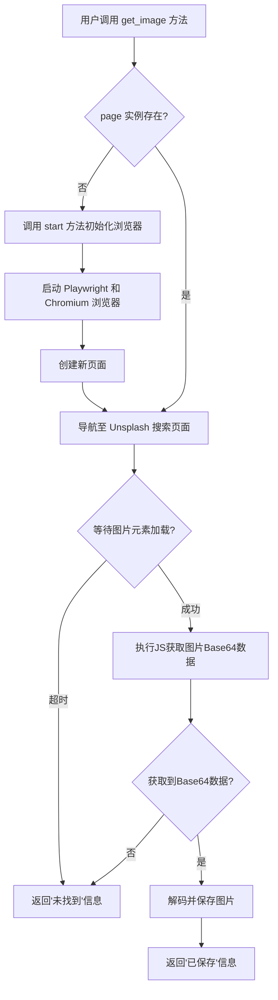
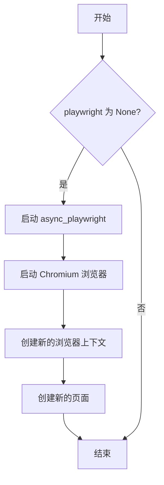
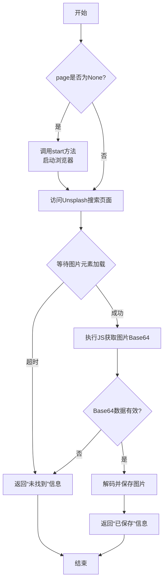

# `.\MetaGPT\metagpt\tools\libs\image_getter.py` 详细设计文档

该代码定义了一个名为 `ImageGetter` 的工具类，其核心功能是利用 Playwright 自动化浏览器，访问 Unsplash 图片网站，根据用户提供的英文搜索词获取相关的图片，并将第一张匹配的图片下载并保存到本地指定路径。

## 整体流程



## 类结构

```
BaseModel (Pydantic基类)
└── ImageGetter (图片获取工具类)
```

## 全局变量及字段


### `DOWNLOAD_PICTURE_JAVASCRIPT`
    
JavaScript代码字符串，用于在浏览器页面中执行以获取指定选择器图片的Base64编码数据。

类型：`str`
    


### `ImageGetter.playwright`
    
Playwright异步API的主入口点，用于管理浏览器自动化流程。

类型：`Optional[Playwright]`
    


### `ImageGetter.browser_instance`
    
由Playwright启动的浏览器实例，代表一个可操作的浏览器进程。

类型：`Optional[Browser_]`
    


### `ImageGetter.browser_ctx`
    
浏览器上下文，提供独立的会话（如cookies、本地存储），用于隔离不同的浏览任务。

类型：`Optional[BrowserContext]`
    


### `ImageGetter.page`
    
浏览器标签页对象，代表一个网页，是与网页内容交互的主要接口。

类型：`Optional[Page]`
    


### `ImageGetter.headless`
    
布尔标志，控制浏览器是否以无头模式（无图形界面）运行，默认为True以提高性能。

类型：`bool`
    


### `ImageGetter.proxy`
    
代理服务器配置字典，用于通过代理进行网络请求，默认从环境变量获取。

类型：`Optional[dict]`
    


### `ImageGetter.reporter`
    
浏览器操作报告器，用于记录和报告浏览器自动化过程中的事件和状态。

类型：`BrowserReporter`
    


### `ImageGetter.url`
    
用于搜索图片的目标URL模板，其中包含一个占位符 `{search_term}` 以插入搜索关键词。

类型：`str`
    


### `ImageGetter.img_element_selector`
    
CSS选择器字符串，用于在目标网页上定位要下载的图片元素。

类型：`str`
    
    

## 全局函数及方法

### `ImageGetter.start`

启动 Playwright 并启动一个浏览器实例。如果 `playwright`、`browser_instance`、`browser_ctx` 或 `page` 属性尚未初始化，此方法将依次创建它们。

参数：
-  `self`：`ImageGetter`，`ImageGetter` 类的实例

返回值：`None`，此方法不返回任何值，但会初始化实例的 `playwright`、`browser_instance`、`browser_ctx` 和 `page` 属性。

#### 流程图



#### 带注释源码

```python
async def start(self) -> None:
    """Starts Playwright and launches a browser"""
    # 检查 playwright 属性是否已初始化
    if self.playwright is None:
        # 启动 Playwright 异步实例
        self.playwright = playwright = await async_playwright().start()
        # 使用 Playwright 启动一个 Chromium 浏览器实例
        # headless 参数控制是否以无头模式运行
        # proxy 参数用于配置代理
        browser = self.browser_instance = await playwright.chromium.launch(headless=self.headless, proxy=self.proxy)
        # 在浏览器实例上创建一个新的上下文
        browser_ctx = self.browser_ctx = await browser.new_context()
        # 在浏览器上下文中创建一个新的页面，并赋值给实例的 page 属性
        self.page = await browser_ctx.new_page()
```


### `ImageGetter.get_image`

该方法用于根据搜索词获取相关图片，并将其保存到指定路径。它通过启动浏览器、访问Unsplash图片搜索页面、等待并选择特定图片元素、获取图片的Base64编码数据，最后解码并保存图片文件。

参数：

-  `search_term`：`str`，用于搜索图片的术语。必须使用英文，使用其他语言可能导致不匹配。
-  `image_save_path`：`str`，图片保存的文件路径。

返回值：`str`，返回操作结果信息。成功时返回图片已保存的提示信息，失败时返回未找到图片的提示信息。

#### 流程图



#### 带注释源码

```python
async def get_image(self, search_term, image_save_path):
    """
    Get an image related to the search term.

    Args:
        search_term (str): The term to search for the image. The search term must be in English. Using any other language may lead to a mismatch.
        image_save_path (str): The file path where the image will be saved.
    """
    # 1. 检查浏览器页面是否已初始化，若未初始化则启动浏览器
    if self.page is None:
        await self.start()
    # 2. 导航到根据搜索词格式化后的Unsplash图片搜索URL
    await self.page.goto(self.url.format(search_term=search_term), wait_until="domcontentloaded")
    # 3. 等待指定的图片元素选择器出现在页面上
    try:
        await self.page.wait_for_selector(self.img_element_selector)
    except TimeoutError:
        # 4. 如果等待超时，说明未找到图片，返回提示信息
        return f"{search_term} not found. Please broaden the search term."
    # 5. 在浏览器页面上下文中执行JavaScript代码，获取目标图片的Base64编码数据
    image_base64 = await self.page.evaluate(
        DOWNLOAD_PICTURE_JAVASCRIPT.format(img_element_selector=self.img_element_selector)
    )
    # 6. 判断是否成功获取到Base64数据
    if image_base64:
        # 7. 解码Base64数据为图片对象
        image = decode_image(image_base64)
        # 8. 将图片对象保存到指定路径
        image.save(image_save_path)
        # 9. 返回成功保存的提示信息
        return f"{search_term} found. The image is saved in {image_save_path}."
    # 10. 如果未获取到Base64数据，返回未找到的提示信息
    return f"{search_term} not found. Please broaden the search term."
```


## 关键组件


### Playwright 浏览器自动化框架

用于启动和控制无头浏览器，实现网页导航、元素等待和JavaScript脚本执行，以模拟用户操作获取网页内容。

### Pydantic 数据模型与配置管理

通过定义 `ImageGetter` 类作为数据模型，管理工具的配置（如URL模板、CSS选择器、代理设置）和运行时状态（如浏览器实例、页面对象），并利用 `Field` 和 `ConfigDict` 进行字段控制和类型验证。

### 异步 JavaScript 脚本执行

通过 `page.evaluate` 方法注入并执行预定义的 `DOWNLOAD_PICTURE_JAVASCRIPT` 脚本，该脚本在浏览器环境中获取指定图片元素的 `src` 属性，并通过 `fetch` API 下载图片数据，最终将其转换为 Base64 格式返回。

### 图像解码与保存工具

利用 `metagpt.utils.common.decode_image` 函数将获取到的 Base64 格式图片数据解码为 PIL Image 对象，并调用其 `save` 方法将图片保存到指定的本地文件路径。

### 工具注册机制

通过 `@register_tool` 装饰器将 `ImageGetter` 类及其 `get_image` 方法注册到 `metagpt.tools.tool_registry` 中，使其能够被系统的其他部分发现和调用。

### 代理环境配置

通过 `metagpt.utils.proxy_env.get_proxy_from_env` 函数从环境变量中读取代理配置，并将其作为默认值提供给 `ImageGetter` 的 `proxy` 字段，以支持在需要代理的网络环境下运行。

### 浏览器操作报告器

使用 `BrowserReporter` 类（作为 `reporter` 字段）来记录和报告浏览器操作过程中的事件、状态或错误信息，用于监控和调试。


## 问题及建议


### 已知问题

-   **资源泄漏风险**：`ImageGetter` 类提供了 `start` 方法用于初始化 Playwright 资源（浏览器、上下文、页面），但未提供对应的 `stop` 或 `close` 方法来释放这些资源。如果工具被多次调用或长期运行，可能导致浏览器进程和内存泄漏。
-   **硬编码的 URL 和选择器**：`url` 和 `img_element_selector` 作为类字段被硬编码为特定网站（Unsplash）和特定 CSS 选择器。这使得工具的功能高度耦合于该网站的当前页面结构，一旦网站改版，工具将立即失效。
-   **脆弱的错误处理**：`get_image` 方法在等待选择器时仅捕获 `TimeoutError`，并将其他所有潜在异常（如导航错误、JavaScript 执行错误、网络错误）直接抛出。这可能导致工具在非预期错误下崩溃，而非优雅地报告失败。
-   **同步与异步混合使用的潜在风险**：类继承自 `BaseModel` 并使用了 `async` 方法。虽然 Pydantic 的 `ConfigDict(arbitrary_types_allowed=True)` 允许了异步字段，但在某些同步上下文或序列化/反序列化场景中，管理这些异步资源（如 `playwright`, `browser_instance`）的生命周期可能变得复杂且容易出错。
-   **单例页面限制**：该类使用单个 `page` 实例。如果 `get_image` 被并发调用，由于共享同一个页面和上下文，可能会导致页面状态混乱、请求冲突或竞争条件。
-   **代理配置的默认工厂**：`proxy` 字段使用 `default_factory=get_proxy_from_env`。如果环境变量中的代理配置无效或格式错误，可能会在启动浏览器时导致难以诊断的连接失败，且错误信息可能不够清晰。

### 优化建议

-   **实现资源生命周期管理**：在类中增加一个 `async def stop(self)` 方法，用于关闭页面、浏览器上下文、浏览器实例并停止 Playwright。同时，考虑实现 `__aenter__` 和 `__aexit__` 或使用上下文管理器模式，确保资源在使用后能被自动清理。
-   **提高可配置性与解耦**：将 `url` 和 `img_element_selector` 作为 `get_image` 方法的参数，或至少作为可配置的初始化参数。这样可以使工具适配不同的图片来源和页面结构，提高其通用性和可维护性。
-   **增强错误处理与健壮性**：在 `get_image` 方法中使用更广泛的异常捕获（例如，捕获 `playwright._impl._errors.Error` 或通用的 `Exception`），并为不同类型的失败（网络错误、元素未找到、图片下载失败）提供更具体、更有帮助的错误信息。同时，确保在发生错误时，工具状态（如页面URL）能够被重置或清理。
-   **明确异步资源的管理策略**：考虑将异步资源（Playwright, Browser等）的初始化完全移至 `__aenter__` 中，并在 `__aexit__` 中清理。或者，提供一个清晰的文档，说明该工具类必须在异步上下文中使用，并建议用户使用 `async with` 语句。
-   **支持并发与隔离**：为每个 `get_image` 调用或每个用户会话创建独立的浏览器上下文（Context）和页面（Page），而不是共享全局实例。这可以通过在 `get_image` 内部临时创建或使用连接池模式来实现，以避免状态污染并支持并行操作。
-   **验证代理配置并提供更佳反馈**：在 `start` 方法或初始化阶段，可以增加对 `proxy` 配置的简单验证（例如，检查必要的键是否存在）。当代理连接失败时，应抛出或返回更具描述性的错误，帮助用户定位网络配置问题。
-   **考虑增加重试机制**：对于网络请求或图片加载等可能因临时网络波动而失败的操作，可以引入指数退避等重试逻辑，提高工具在不稳定环境下的成功率。


## 其它


### 设计目标与约束

1.  **核心目标**：提供一个简单、可复用的工具，用于自动化地从特定网站（Unsplash）搜索并下载与给定英文关键词相关的图片。
2.  **主要约束**：
    *   **语言约束**：搜索关键词必须为英文，否则可能导致搜索结果不匹配。
    *   **网站依赖**：工具功能高度依赖于 Unsplash 网站的特定 URL 结构和 CSS 选择器，网站结构变更可能导致工具失效。
    *   **浏览器自动化**：依赖 Playwright 进行浏览器自动化，需要安装相应的浏览器驱动。
    *   **异步操作**：所有主要操作均为异步，要求调用环境支持异步 I/O。
    *   **代理支持**：支持通过环境变量配置代理，以适应不同的网络环境。

### 错误处理与异常设计

1.  **显式错误处理**：
    *   `get_image` 方法中使用了 `try-except` 块捕获 `TimeoutError`，当页面在指定时间内未加载出目标图片元素时，返回友好的错误信息，而非抛出异常。
    *   对 `page.evaluate` 返回的 `image_base64` 进行空值检查，处理图片下载失败的情况。
2.  **隐式错误处理**：
    *   依赖 Playwright 自身的错误传播机制。例如，`page.goto` 可能因网络问题失败并抛出异常，该异常会向上传递给调用者。
    *   `decode_image` 和 `image.save` 可能因数据格式错误或文件路径问题抛出异常，这些异常同样会向上传递。
3.  **设计原则**：对于工具预期的、可恢复的失败（如图片未找到），通过返回描述性字符串进行处理。对于意外的、不可恢复的错误（如网络中断、浏览器崩溃），允许异常向上抛出，由调用方决定如何处理。

### 数据流与状态机

1.  **数据流**：
    *   **输入**：`search_term` (str) -> `image_save_path` (str)。
    *   **处理**：
        1.  格式化 URL。
        2.  导航至目标页面。
        3.  等待并定位图片元素。
        4.  执行 JavaScript 提取图片 Base64 数据。
        5.  解码 Base64 数据为图像对象。
        6.  保存图像对象至指定路径。
    *   **输出**：成功时返回保存成功的提示字符串；失败时（未找到图片）返回相应的错误提示字符串。
2.  **状态机（工具生命周期）**：
    *   **未初始化状态**：`playwright`, `browser_instance`, `browser_ctx`, `page` 字段均为 `None`。
    *   **初始化状态**：调用 `start()` 或首次调用 `get_image()` 时，依次创建 Playwright 实例、浏览器实例、上下文和页面对象，状态转移至“就绪”。
    *   **就绪状态**：`page` 对象可用，可执行 `get_image` 操作。
    *   **结束状态**：代码未显式提供关闭方法。理想情况下，应提供 `stop()` 或 `__aexit__` 方法来异步关闭浏览器和 Playwright 资源，避免资源泄漏。当前状态转移依赖于外部（如进程结束）来释放资源。

### 外部依赖与接口契约

1.  **外部库依赖**：
    *   `playwright`：用于浏览器自动化和网页交互的核心库。
    *   `pydantic`：用于数据验证和设置管理（`BaseModel`）。
    *   `PIL` (Pillow)：通过 `metagpt.utils.common.decode_image` 间接使用，用于 Base64 图像数据的解码和保存。
2.  **内部模块依赖**：
    *   `metagpt.tools.tool_registry.register_tool`：用于将此工具注册到某个工具注册表中。
    *   `metagpt.utils.common.decode_image`：提供 Base64 字符串到 PIL Image 对象的解码功能。
    *   `metagpt.utils.proxy_env.get_proxy_from_env`：从环境变量中获取代理配置。
    *   `metagpt.utils.report.BrowserReporter`：用于报告浏览器操作（当前代码中未使用，但作为字段存在）。
3.  **接口契约**：
    *   **`get_image` 方法**：
        *   **输入契约**：接受两个字符串参数 `search_term` 和 `image_save_path`。
        *   **输出契约**：返回一个字符串，描述操作结果（成功或失败）。
        *   **行为契约**：执行一次完整的图片搜索、下载和保存流程。首次调用时会初始化浏览器环境。
    *   **`start` 方法**：
        *   **行为契约**：初始化 Playwright 和浏览器实例。如果已经初始化，则不会重复创建。

    