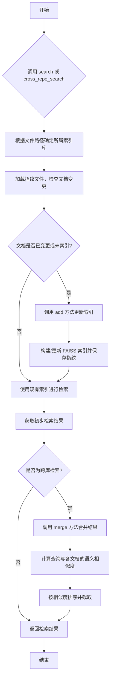
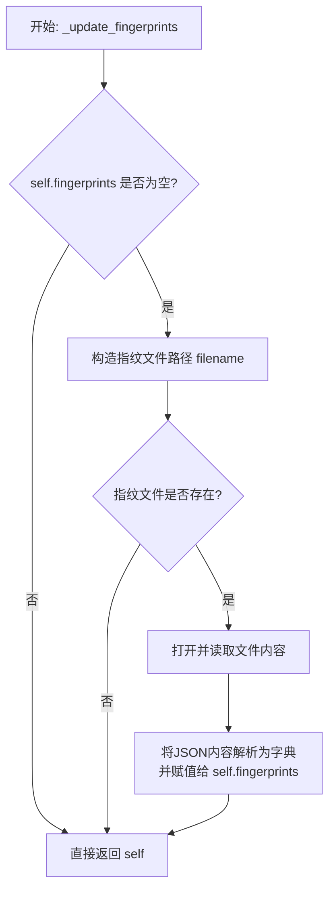
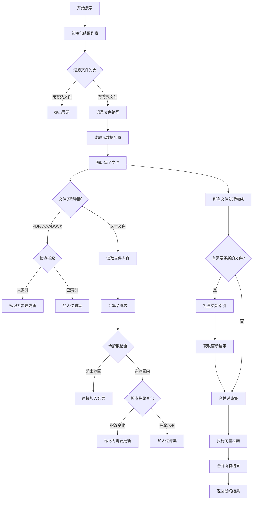
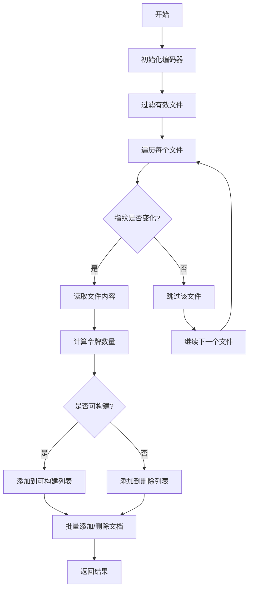
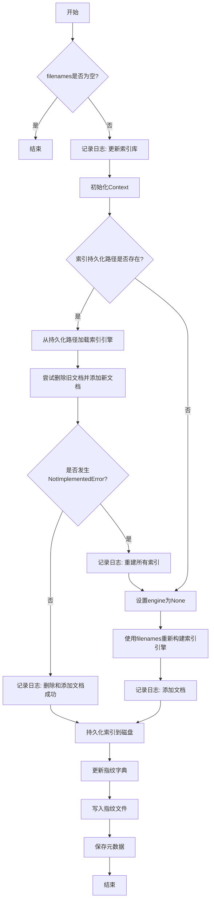
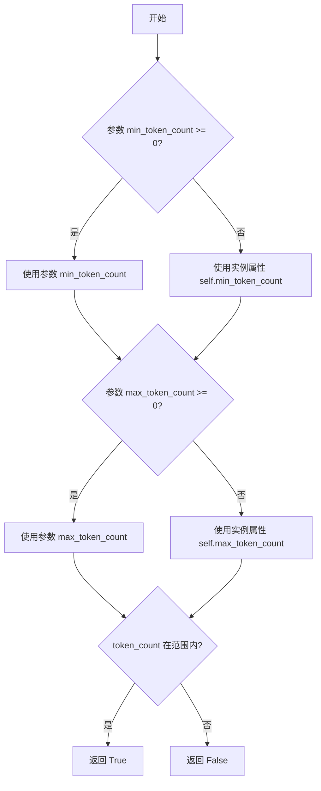
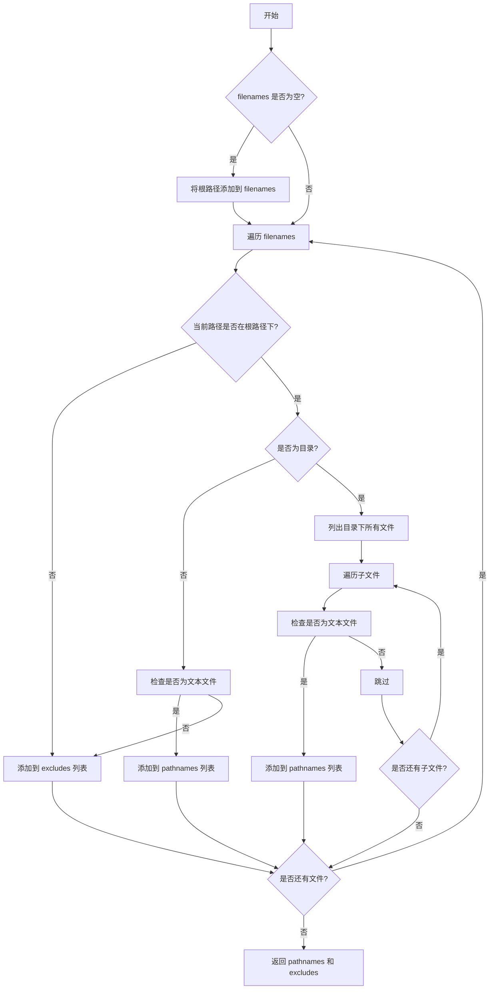
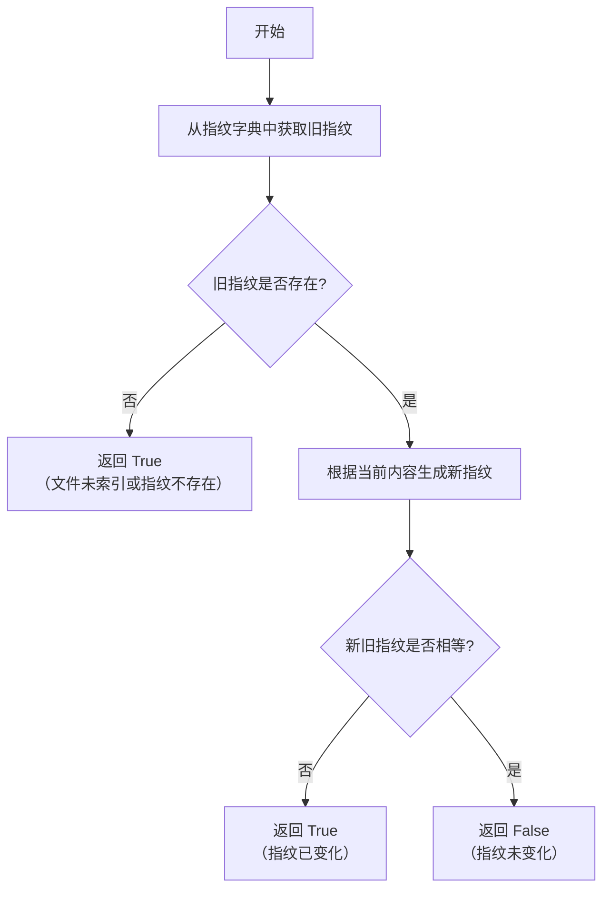
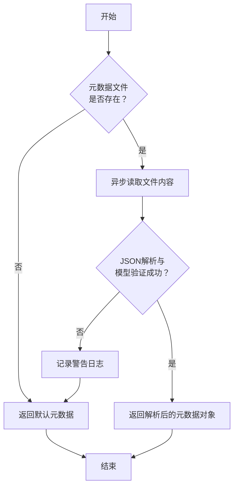
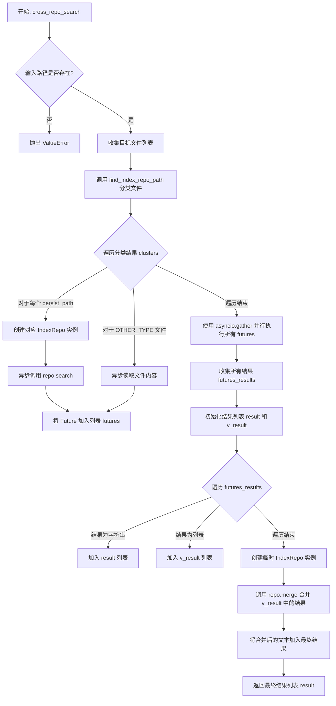

# `.\MetaGPT\metagpt\tools\libs\index_repo.py` 详细设计文档

该代码实现了一个基于RAG（检索增强生成）的文档索引与检索系统。核心功能是管理文档索引库（IndexRepo），支持文档的添加、更新、删除和检索。系统能够根据文档内容的变化（通过指纹校验）自动重建索引，支持跨多个索引库进行联合检索，并根据查询与文档的语义相似度对结果进行排序和合并。

## 整体流程



## 类结构

```
BaseModel (Pydantic基类)
├── IndexRepoMeta (索引库元数据模型)
├── TextScore (文本评分模型)
└── IndexRepo (核心索引库类)
```

## 全局变量及字段


### `UPLOADS_INDEX_ROOT`
    
上传文件索引的根目录路径，用于存储上传文件的向量索引。

类型：`str`
    


### `DEFAULT_INDEX_ROOT`
    
默认的索引根目录路径，指向上传文件索引根目录。

类型：`str`
    


### `UPLOAD_ROOT`
    
上传文件的根目录路径，用于存储原始上传文件。

类型：`str`
    


### `DEFAULT_ROOT`
    
默认的根目录路径，指向上传文件根目录。

类型：`str`
    


### `CHATS_INDEX_ROOT`
    
聊天记录索引的根目录路径，用于存储聊天记录的向量索引。

类型：`str`
    


### `CHATS_ROOT`
    
聊天记录的根目录路径，用于存储原始聊天记录文件。

类型：`str`
    


### `OTHER_TYPE`
    
表示不属于预定义索引类型的文件分类标识符。

类型：`str`
    


### `DEFAULT_MIN_TOKEN_COUNT`
    
默认的最小令牌数阈值，用于判断文档是否适合构建索引。

类型：`int`
    


### `DEFAULT_MAX_TOKEN_COUNT`
    
默认的最大令牌数阈值，用于判断文档是否适合构建索引。

类型：`int`
    


### `IndexRepoMeta.min_token_count`
    
索引构建的最小令牌数阈值，低于此值的文档将被排除。

类型：`int`
    


### `IndexRepoMeta.max_token_count`
    
索引构建的最大令牌数阈值，高于此值的文档将被排除。

类型：`int`
    


### `TextScore.filename`
    
文档的文件名或路径。

类型：`str`
    


### `TextScore.text`
    
文档的文本内容。

类型：`str`
    


### `TextScore.score`
    
文档的相似度得分，可能为空。

类型：`Optional[float]`
    


### `IndexRepo.persist_path`
    
索引持久化存储的目录路径。

类型：`str`
    


### `IndexRepo.root_path`
    
索引所覆盖的原始文件的根目录路径。

类型：`str`
    


### `IndexRepo.fingerprint_filename`
    
存储文件指纹信息的JSON文件名。

类型：`str`
    


### `IndexRepo.meta_filename`
    
存储索引元数据信息的JSON文件名。

类型：`str`
    


### `IndexRepo.model`
    
用于生成嵌入向量的模型名称，如果为空则使用配置中的默认模型。

类型：`Optional[str]`
    


### `IndexRepo.min_token_count`
    
当前索引实例的最小令牌数阈值，用于判断文档是否适合构建索引。

类型：`int`
    


### `IndexRepo.max_token_count`
    
当前索引实例的最大令牌数阈值，用于判断文档是否适合构建索引。

类型：`int`
    


### `IndexRepo.recall_count`
    
搜索时返回的最相关结果数量。

类型：`int`
    


### `IndexRepo.embedding`
    
用于计算文本嵌入向量的嵌入模型实例。

类型：`Optional[BaseEmbedding]`
    


### `IndexRepo.fingerprints`
    
存储文件名到其内容指纹的映射，用于检测文件变更。

类型：`Dict[str, str]`
    
    

## 全局函数及方法

### `IndexRepo._update_fingerprints`

该方法是一个Pydantic模型验证器，在模型实例化后自动调用。其核心功能是检查当前实例的`fingerprints`字段是否为空，如果为空，则尝试从持久化存储路径下的`fingerprint.json`文件中加载指纹数据。如果文件不存在，则保持`fingerprints`为空字典。此方法确保了`IndexRepo`实例在初始化后，其`fingerprints`字段总是包含最新的（或从文件加载的）文件指纹映射，用于后续的文件变更检测。

参数：
-  `self`：`IndexRepo`，当前`IndexRepo`类的实例。

返回值：`IndexRepo`，更新了`fingerprints`字段后的`IndexRepo`实例自身。

#### 流程图



#### 带注释源码

```python
    @model_validator(mode="after")
    def _update_fingerprints(self) -> "IndexRepo":
        """Load fingerprints from the fingerprint file if not already loaded.

        Returns:
            IndexRepo: The updated IndexRepo instance.
        """
        # 检查当前实例的指纹字典是否为空
        if not self.fingerprints:
            # 构造指纹文件的完整路径：持久化路径 + 指纹文件名
            filename = Path(self.persist_path) / self.fingerprint_filename
            # 如果指纹文件不存在，则直接返回当前实例（fingerprints保持为空字典）
            if not filename.exists():
                return self
            # 打开指纹文件并读取内容
            with open(str(filename), "r") as reader:
                # 将JSON格式的文件内容解析为Python字典，并赋值给self.fingerprints
                self.fingerprints = json.load(reader)
        # 返回更新后的实例自身
        return self
```

### `IndexRepo.search`

该方法用于在索引库中搜索与给定查询相关的文档。它会根据文件类型、指纹变化和令牌数量过滤文件，对于符合条件的文件使用RAG引擎进行向量检索，对于不符合条件的文件则直接返回文本内容。如果发现文件未索引或已更改，会触发索引更新流程。

参数：

- `query`：`str`，搜索查询字符串
- `filenames`：`Optional[List[Path]]`，可选的文件路径列表，用于限制搜索范围

返回值：`Optional[List[Union[NodeWithScore, TextScore]]]`，返回包含NodeWithScore（带分数的检索节点）或TextScore（带分数的文本）的列表，如果无结果则返回None

#### 流程图



#### 带注释源码

```python
async def search(
    self, query: str, filenames: Optional[List[Path]] = None
) -> Optional[List[Union[NodeWithScore, TextScore]]]:
    """Search for documents related to the given query.

    Args:
        query (str): The search query.
        filenames (Optional[List[Path]]): A list of filenames to filter the search.

    Returns:
        Optional[List[Union[NodeWithScore, TextScore]]]: A list of search results containing NodeWithScore or TextScore.
    """
    # 初始化tiktoken编码器和结果列表
    encoding = tiktoken.get_encoding("cl100k_base")
    result: List[Union[NodeWithScore, TextScore]] = []
    
    # 过滤文件，排除不支持的类型
    filenames, excludes = await self._filter(filenames)
    if not filenames:
        raise ValueError(f"Unsupported file types: {[str(i) for i in excludes]}")
    
    # 记录文件路径用于报告
    resource = EditorReporter()
    for i in filenames:
        await resource.async_report(str(i), "path")
    
    # 初始化过滤文件集和需要更新的文件字典
    filter_filenames = set()
    meta = await self._read_meta()
    new_files = {}
    
    # 遍历所有文件进行处理
    for i in filenames:
        # 处理PDF/DOC/DOCX文件
        if Path(i).suffix.lower() in {".pdf", ".doc", ".docx"}:
            if str(i) not in self.fingerprints:
                new_files[i] = ""
                logger.warning(f'file: "{i}" not indexed')
            filter_filenames.add(str(i))
            continue
        
        # 读取文本文件内容
        content = await File.read_text_file(i)
        token_count = len(encoding.encode(content))
        
        # 检查令牌数是否在可构建范围内
        if not self._is_buildable(
            token_count, min_token_count=meta.min_token_count, max_token_count=meta.max_token_count
        ):
            # 超出范围，直接加入结果
            result.append(TextScore(filename=str(i), text=content))
            continue
        
        # 生成文件指纹并检查是否变化
        file_fingerprint = generate_fingerprint(content)
        if str(i) not in self.fingerprints or (self.fingerprints.get(str(i)) != file_fingerprint):
            new_files[i] = content
            logger.warning(f'file: "{i}" changed but not indexed')
            continue
        
        # 文件未变化，加入过滤集
        filter_filenames.add(str(i))
    
    # 处理需要更新的文件
    if new_files:
        added, others = await self.add(paths=list(new_files.keys()), file_datas=new_files)
        filter_filenames.update([str(i) for i in added])
        for i in others:
            result.append(TextScore(filename=str(i), text=new_files.get(i)))
            filter_filenames.discard(str(i))
    
    # 执行向量检索
    nodes = await self._search(query=query, filters=filter_filenames)
    
    # 合并所有结果并返回
    return result + nodes
```

### `IndexRepo.merge`

该方法用于合并来自多个索引的搜索结果。它接收一个查询字符串和一个包含多个结果列表的列表，每个结果列表可能包含 `NodeWithScore` 或 `TextScore` 对象。方法首先将所有结果扁平化，如果结果总数不超过预设的召回数量（`recall_count`），则直接返回所有结果。否则，它会使用嵌入模型计算查询与每个结果文本的相似度，根据相似度对结果进行排序，并返回前 `recall_count` 个最相关的结果。对于超长文本，它会尝试分段计算相似度并取最大值。

参数：

- `query`：`str`，搜索查询字符串。
- `indices_list`：`List[List[Union[NodeWithScore, TextScore]]]`，一个列表，其元素是来自不同索引的搜索结果列表。

返回值：`List[Union[NodeWithScore, TextScore]]`，一个按相似度降序排序的合并后结果列表，长度不超过 `self.recall_count`。

#### 流程图

```mermaid
flowchart TD
    A[开始: merge(query, indices_list)] --> B[扁平化所有结果到 flat_nodes]
    B --> C{flat_nodes 数量 <= recall_count?}
    C -- 是 --> D[直接返回 flat_nodes]
    C -- 否 --> E[初始化 embedding 对象]
    E --> F[获取查询的向量表示 query_embedding]
    F --> G[遍历 flat_nodes 中的每个节点 i]
    G --> H[尝试获取节点 i 文本的完整向量 text_embedding]
    H --> I{获取成功?}
    I -- 是 --> J[计算 query_embedding 与 text_embedding 的相似度]
    I -- 否 --> K[将文本分为前60%和后40%两段]
    K --> L[分别计算两段文本的向量]
    L --> M[计算 query_embedding 与两段向量的相似度]
    M --> N[取两个相似度中的最大值作为最终相似度]
    J --> O[将 (相似度, 节点i) 加入 scores 列表]
    N --> O
    O --> P{遍历完成?}
    P -- 否 --> G
    P -- 是 --> Q[根据相似度对 scores 列表降序排序]
    Q --> R[取前 recall_count 个节点返回]
    R --> S[结束]
```

#### 带注释源码

```python
async def merge(
    self, query: str, indices_list: List[List[Union[NodeWithScore, TextScore]]]
) -> List[Union[NodeWithScore, TextScore]]:
    """Merge results from multiple indices based on the query.

    Args:
        query (str): The search query.
        indices_list (List[List[Union[NodeWithScore, TextScore]]]): A list of result lists from different indices.

    Returns:
        List[Union[NodeWithScore, TextScore]]: A list of merged results sorted by similarity.
    """
    # 1. 扁平化处理：将所有索引的结果列表合并成一个单一的列表。
    flat_nodes = [node for indices in indices_list if indices for node in indices if node]
    # 2. 如果结果总数不超过预设的召回数量，直接返回所有结果，避免不必要的计算。
    if len(flat_nodes) <= self.recall_count:
        return flat_nodes

    # 3. 懒加载嵌入模型：如果实例的 embedding 属性为空，则根据配置创建。
    if not self.embedding:
        if self.model:
            config.embedding.model = self.model
        factory = RAGEmbeddingFactory(config)
        self.embedding = factory.get_rag_embedding()

    scores = []
    # 4. 获取查询文本的向量表示。
    query_embedding = await self.embedding.aget_text_embedding(query)
    # 5. 遍历每个结果节点，计算其与查询的相似度。
    for i in flat_nodes:
        try:
            # 5.1 尝试获取节点完整文本的向量。
            text_embedding = await self.embedding.aget_text_embedding(i.text)
        except Exception as e:  # 超过最大长度
            # 5.2 如果文本过长导致嵌入失败，将文本分为前60%和后40%两段。
            tenth = int(len(i.text) / 10)  # DEFAULT_MIN_TOKEN_COUNT = 10000
            logger.warning(
                f"{e}, tenth len={tenth}, pre_part_len={len(i.text[: tenth * 6])}, post_part_len={len(i.text[tenth * 4:])}"
            )
            # 5.3 分别计算两段文本的向量。
            pre_win_part = await self.embedding.aget_text_embedding(i.text[: tenth * 6])
            post_win_part = await self.embedding.aget_text_embedding(i.text[tenth * 4 :])
            # 5.4 计算查询向量与两段文本向量的相似度，取最大值作为该节点的相似度。
            similarity = max(
                self.embedding.similarity(query_embedding, pre_win_part),
                self.embedding.similarity(query_embedding, post_win_part),
            )
            scores.append((similarity, i))
            continue
        # 5.5 如果文本长度正常，直接计算相似度。
        similarity = self.embedding.similarity(query_embedding, text_embedding)
        scores.append((similarity, i))
    # 6. 根据相似度对结果进行降序排序。
    scores.sort(key=lambda x: x[0], reverse=True)
    # 7. 返回前 recall_count 个最相关的结果。
    return [i[1] for i in scores][: self.recall_count]
```

### `IndexRepo.add`

该方法用于向索引仓库中添加新的文档。它会检查每个文档的指纹是否发生变化，并根据文档的令牌数量判断是否可构建索引。对于可构建的文档，会将其添加到索引中；对于不可构建的文档，则将其标记为删除。最终返回成功添加的文档列表和未添加的文档列表。

参数：

- `paths`：`List[Path]`，要添加的文档路径列表。
- `file_datas`：`Dict[Union[str, Path], str]`，文档内容字典，键为文档路径，值为文档内容。如果未提供，则会从文件中读取内容。

返回值：`Tuple[List[str], List[str]]`，一个包含两个列表的元组：
  1. 成功添加到索引的文档路径列表。
  2. 未添加到索引的文档路径列表（因为不可构建）。

#### 流程图



#### 带注释源码

```python
async def add(
    self, paths: List[Path], file_datas: Dict[Union[str, Path], str] = None
) -> Tuple[List[str], List[str]]:
    """Add new documents to the index.

    Args:
        paths (List[Path]): A list of paths to the documents to be added.
        file_datas (Dict[Union[str, Path], str]): A list of file content.

    Returns:
    Tuple[List[str], List[str]]: A tuple containing two lists:
        1. The list of filenames that were successfully added to the index.
        2. The list of filenames that were not added to the index because they were not buildable.
    """
    # 初始化编码器，用于计算令牌数量
    encoding = tiktoken.get_encoding("cl100k_base")
    # 过滤出有效的文本文件
    filenames, _ = await self._filter(paths)
    filter_filenames = []  # 可构建的文档列表
    delete_filenames = []  # 不可构建的文档列表
    file_datas = file_datas or {}  # 如果未提供内容字典，则初始化为空字典
    for i in filenames:
        # 读取文档内容，如果未提供则从文件中读取
        content = file_datas.get(i) or await File.read_text_file(i)
        file_datas[i] = content  # 将内容存入字典，以备后续使用
        # 检查文档指纹是否发生变化，如果未变化则跳过
        if not self._is_fingerprint_changed(filename=i, content=content):
            continue
        # 计算文档的令牌数量
        token_count = len(encoding.encode(content))
        # 判断文档是否可构建索引
        if self._is_buildable(token_count):
            filter_filenames.append(i)  # 可构建，添加到可构建列表
            logger.debug(f"{i} is_buildable: {token_count}, {self.min_token_count}~{self.max_token_count}")
        else:
            delete_filenames.append(i)  # 不可构建，添加到删除列表
            logger.debug(f"{i} not is_buildable: {token_count}, {self.min_token_count}~{self.max_token_count}")
    # 批量处理可构建和不可构建的文档
    await self._add_batch(filenames=filter_filenames, delete_filenames=delete_filenames, file_datas=file_datas)
    # 返回结果：成功添加的文档列表和未添加的文档列表
    return filter_filenames, delete_filenames
```

### `IndexRepo._add_batch`

该方法用于批量向索引库中添加和删除文档。它首先尝试加载现有的索引引擎，如果存在则删除旧文档并添加新文档；如果索引不存在或操作失败，则重新构建整个索引。最后，它会更新指纹文件和元数据文件。

参数：

- `filenames`：`List[Union[str, Path]]`，需要添加到索引中的文件名列表。
- `delete_filenames`：`List[Union[str, Path]]`，需要从索引中删除的文件名列表。
- `file_datas`：`Dict[Union[str, Path], str]`，文件名到文件内容的映射字典，用于生成指纹。

返回值：`None`，该方法不返回任何值，但会更新索引库的持久化文件、指纹文件和元数据文件。

#### 流程图



#### 带注释源码

```python
async def _add_batch(
    self,
    filenames: List[Union[str, Path]],
    delete_filenames: List[Union[str, Path]],
    file_datas: Dict[Union[str, Path], str],
):
    """Add and remove documents in a batch operation.

    Args:
        filenames (List[Union[str, Path]]): List of filenames to add.
        delete_filenames (List[Union[str, Path]]): List of filenames to delete.
    """
    # 如果待添加的文件名列表为空，则直接返回，不执行任何操作
    if not filenames:
        return
    # 记录开始批量更新索引的日志，包含要添加和删除的文件名
    logger.info(f"update index repo, add {filenames}, remove {delete_filenames}")
    engine = None
    # 初始化上下文，可能用于配置或环境设置
    Context()
    # 检查索引的持久化路径是否存在
    if Path(self.persist_path).exists():
        # 如果存在，则从该路径加载FAISS索引引擎
        logger.debug(f"load index from {self.persist_path}")
        engine = SimpleEngine.from_index(
            index_config=FAISSIndexConfig(persist_path=self.persist_path),
            retriever_configs=[FAISSRetrieverConfig()],
        )
        try:
            # 尝试从引擎中删除所有指定的文件（包括要添加和删除的）
            engine.delete_docs(filenames + delete_filenames)
            logger.info(f"delete docs {filenames + delete_filenames}")
            # 然后添加新的文件到索引中
            engine.add_docs(input_files=filenames)
            logger.info(f"add docs {filenames}")
        except NotImplementedError as e:
            # 如果引擎不支持批量操作（如delete_docs），则捕获异常
            logger.debug(f"{e}")
            # 将当前所有指纹中的文件和新文件合并，准备重建整个索引
            filenames = list(set([str(i) for i in filenames] + list(self.fingerprints.keys())))
            engine = None
            logger.info(f"{e}. Rebuild all.")
    # 如果引擎不存在（路径不存在或重建情况），则从头开始构建索引
    if not engine:
        engine = SimpleEngine.from_docs(
            input_files=[str(i) for i in filenames],
            retriever_configs=[FAISSRetrieverConfig()],
            ranker_configs=[LLMRankerConfig()],
        )
        logger.info(f"add docs {filenames}")
    # 将构建或更新后的索引持久化到指定的路径
    engine.persist(persist_dir=self.persist_path)
    # 更新指纹字典：为每个新添加的文件生成指纹并存储
    for i in filenames:
        content = file_datas.get(i) or await File.read_text_file(i)
        fp = generate_fingerprint(content)
        self.fingerprints[str(i)] = fp
    # 将更新后的指纹字典写入到指纹文件
    await awrite(filename=Path(self.persist_path) / self.fingerprint_filename, data=json.dumps(self.fingerprints))
    # 保存当前的元数据（如token数量范围）到元数据文件
    await self._save_meta()
```

### `IndexRepo.__str__`

该方法返回 `IndexRepo` 实例的字符串表示形式，主要用于日志记录、调试或显示索引库的持久化路径。

参数：
- `self`：`IndexRepo`，当前 `IndexRepo` 实例。

返回值：`str`，返回索引库的持久化路径字符串。

#### 流程图

```mermaid
flowchart TD
    A[开始] --> B[获取 self.persist_path]
    B --> C[返回 f"{self.persist_path}"]
    C --> D[结束]
```

#### 带注释源码

```python
def __str__(self):
    """Return a string representation of the IndexRepo.

    Returns:
        str: The filename of the index repository.
    """
    return f"{self.persist_path}"
```

### `IndexRepo._is_buildable`

该方法用于判断给定文档的令牌（token）数量是否在可构建索引的范围内。它通过比较令牌数量与预设的最小和最大令牌阈值来决定文档是否适合被索引。

参数：

- `token_count`：`int`，文档内容的令牌数量。
- `min_token_count`：`int`，可选参数，用于判断的最小令牌数量阈值。如果提供负值，则使用实例的`min_token_count`属性。
- `max_token_count`：`int`，可选参数，用于判断的最大令牌数量阈值。如果提供负值，则使用实例的`max_token_count`属性。

返回值：`bool`，如果令牌数量在指定范围内则返回`True`，否则返回`False`。

#### 流程图



#### 带注释源码

```python
def _is_buildable(self, token_count: int, min_token_count: int = -1, max_token_count=-1) -> bool:
    """Check if the token count is within the buildable range.

    Args:
        token_count (int): The number of tokens in the content.
        min_token_count (int): The minimum token count threshold. If negative, uses instance's min_token_count.
        max_token_count (int): The maximum token count threshold. If negative, uses instance's max_token_count.

    Returns:
        bool: True if buildable, False otherwise.
    """
    # 确定使用哪个最小令牌阈值：如果传入的参数大于等于0，则使用参数值，否则使用实例属性。
    min_token_count = min_token_count if min_token_count >= 0 else self.min_token_count
    # 确定使用哪个最大令牌阈值：如果传入的参数大于等于0，则使用参数值，否则使用实例属性。
    max_token_count = max_token_count if max_token_count >= 0 else self.max_token_count
    # 判断令牌数量是否在指定范围内。如果小于最小值或大于最大值，则返回False。
    if token_count < min_token_count or token_count > max_token_count:
        return False
    # 令牌数量在范围内，返回True。
    return True
```

### `IndexRepo._filter`

该方法用于过滤提供的文件名列表，仅保留有效的文本文件。它会检查每个文件是否位于指定的根路径下，并且是否为文本文件。如果是目录，则会递归地列出目录下的所有文本文件。

参数：

- `filenames`：`Optional[List[Union[str, Path]]]`，可选的文件名列表。如果为None或空，则使用根路径作为起始点。

返回值：`Tuple[List[Path], List[Path]]`，一个包含两个列表的元组。第一个列表是有效的文本文件路径，第二个列表是被排除的路径（例如，不在根路径下的文件）。

#### 流程图



#### 带注释源码

```python
async def _filter(self, filenames: Optional[List[Union[str, Path]]] = None) -> (List[Path], List[Path]):
    """Filter the provided filenames to only include valid text files.

    Args:
        filenames (Optional[List[Union[str, Path]]]): List of filenames to filter.

    Returns:
        Tuple[List[Path], List[Path]]: A tuple containing a list of valid pathnames and a list of excluded paths.
    """
    # 获取根路径的绝对路径
    root_path = Path(self.root_path).absolute()
    # 如果未提供文件名列表，则使用根路径作为起始点
    if not filenames:
        filenames = [root_path]
    # 初始化有效路径列表和排除路径列表
    pathnames = []
    excludes = []
    # 遍历提供的每个文件或路径
    for i in filenames:
        # 获取当前路径的绝对路径
        path = Path(i).absolute()
        # 检查当前路径是否在根路径下
        if not path.is_relative_to(root_path):
            # 如果不在根路径下，添加到排除列表并记录日志
            excludes.append(path)
            logger.debug(f"{path} not is_relative_to {root_path})")
            continue
        # 如果当前路径不是目录
        if not path.is_dir():
            # 检查是否为文本文件
            is_text = await File.is_textual_file(path)
            if is_text:
                # 如果是文本文件，添加到有效路径列表
                pathnames.append(path)
            continue
        # 如果当前路径是目录，列出目录下的所有文件
        subfiles = list_files(path)
        # 遍历目录下的每个文件
        for j in subfiles:
            # 检查是否为文本文件
            is_text = await File.is_textual_file(j)
            if is_text:
                # 如果是文本文件，添加到有效路径列表
                pathnames.append(j)

    # 记录有效路径和排除路径的日志
    logger.debug(f"{pathnames}, excludes:{excludes})")
    # 返回有效路径列表和排除路径列表
    return pathnames, excludes
```

### `IndexRepo._search`

该方法用于在已构建的索引中执行搜索查询，并根据提供的文件名过滤器筛选结果。它首先检查索引是否存在，然后加载索引引擎，执行异步检索，最后根据过滤器返回匹配的节点。

参数：

- `query`：`str`，搜索查询字符串。
- `filters`：`Set[str]`，用于筛选搜索结果的文件名集合。

返回值：`List[NodeWithScore]`，一个包含匹配查询的节点及其相似性分数的列表。

#### 流程图

```mermaid
flowchart TD
    A[开始] --> B{索引路径是否存在?}
    B -- 否 --> C[抛出 ValueError 异常]
    B -- 是 --> D[初始化 Context]
    D --> E[从持久化路径加载索引引擎]
    E --> F[执行异步检索<br>engine.aretrieve(query)]
    F --> G[遍历检索结果]
    G --> H{节点元数据中的<br>file_path 是否在 filters 中?}
    H -- 是 --> I[将节点加入结果列表]
    H -- 否 --> J[跳过该节点]
    I --> K[继续遍历]
    J --> K
    K --> L{是否遍历完所有结果?}
    L -- 否 --> G
    L -- 是 --> M[返回结果列表]
    C --> N[结束]
    M --> N
```

#### 带注释源码

```python
async def _search(self, query: str, filters: Set[str]) -> List[NodeWithScore]:
    """Perform a search for the given query using the index.

    Args:
        query (str): The search query.
        filters (Set[str]): A set of filenames to filter the search results.

    Returns:
        List[NodeWithScore]: A list of nodes with scores matching the query.
    """
    # 1. 检查过滤器是否为空，为空则直接返回空列表
    if not filters:
        return []
    # 2. 检查索引持久化路径是否存在，不存在则抛出异常
    if not Path(self.persist_path).exists():
        raise ValueError(f"IndexRepo {Path(self.persist_path).name} not exists.")
    # 3. 初始化上下文（可能用于配置或资源管理）
    Context()
    # 4. 从持久化路径加载 FAISS 索引并配置检索器，创建搜索引擎实例
    engine = SimpleEngine.from_index(
        index_config=FAISSIndexConfig(persist_path=self.persist_path),
        retriever_configs=[FAISSRetrieverConfig()],
    )
    # 5. 使用引擎异步检索与查询相关的节点
    rsp = await engine.aretrieve(query)
    # 6. 过滤检索结果：仅保留元数据中 `file_path` 在 `filters` 集合中的节点
    return [i for i in rsp if i.metadata.get("file_path") in filters]
```

### `IndexRepo._is_fingerprint_changed`

该方法用于检查给定文档内容的指纹是否已发生变化。它通过比较存储的旧指纹与根据当前内容生成的新指纹来判断文件内容是否被修改。

参数：

- `filename`：`Union[str, Path]`，文档的文件名或路径。
- `content`：`str`，文档的当前内容。

返回值：`bool`，如果指纹已发生变化（即文件内容已修改）则返回 `True`，否则返回 `False`。

#### 流程图



#### 带注释源码

```python
def _is_fingerprint_changed(self, filename: Union[str, Path], content: str) -> bool:
    """Check if the fingerprint of the given document content has changed.

    Args:
        filename (Union[str, Path]): The filename of the document.
        content (str): The content of the document.

    Returns:
        bool: True if the fingerprint has changed, False otherwise.
    """
    # 从实例的指纹字典中获取该文件对应的旧指纹
    old_fp = self.fingerprints.get(str(filename))
    # 如果旧指纹不存在（例如文件是首次被索引），则认为指纹已变化，需要更新索引
    if not old_fp:
        return True
    # 根据传入的当前文档内容生成新的指纹
    fp = generate_fingerprint(content)
    # 比较新旧指纹，不相等则说明内容已变化
    return old_fp != fp
```

### `IndexRepo.find_index_repo_path`

这是一个静态方法，用于将给定的文件路径列表分类并映射到对应的索引仓库（Index Repository）路径。它根据预定义的路径模式（如上传文件路径和聊天文件路径）对输入文件进行分组，并返回每个索引仓库对应的文件集合以及索引仓库路径到其根目录的映射。

参数：

- `files`：`List[Union[str, Path]]`，一个包含文件路径（字符串或Path对象）的列表，这些路径将被分类到不同的索引仓库。

返回值：`Tuple[Dict[str, Set[Path]], Dict[str, str]]`，返回一个元组，包含两个字典：
    1. 第一个字典将索引仓库路径映射到属于该仓库的文件集合（Set[Path]）。
    2. 第二个字典将索引仓库路径映射到其对应的根目录路径（字符串）。

#### 流程图

```mermaid
graph TD
    A[开始: 输入文件路径列表 files] --> B[初始化 mappings 字典<br/>定义路径模式];
    B --> C[初始化 clusters 和 roots 字典];
    C --> D[遍历 files 中的每个路径 i];
    D --> E[将路径 i 转换为绝对路径 path];
    E --> F[初始化 path_type 为 OTHER_TYPE];
    F --> G[遍历 mappings 中的每个模式];
    G --> H{路径 i 是否匹配当前模式?};
    H -- 是 --> I[设置 path_type 为对应的索引仓库路径];
    I --> J;
    H -- 否 --> G;
    G --> J{是否遍历完所有模式?};
    J -- 是 --> K{path_type 是否为 CHATS_INDEX_ROOT?};
    K -- 是 --> L[从路径中提取 chat_id<br/>更新 path_type 和 roots];
    L --> M;
    K -- 否 --> N{path_type 是否为 UPLOADS_INDEX_ROOT?};
    N -- 是 --> O[更新 roots 字典];
    O --> M;
    N -- 否 --> M;
    M --> P{path_type 是否已在 clusters 中?};
    P -- 是 --> Q[将 path 添加到 clusters[path_type] 集合];
    Q --> R;
    P -- 否 --> S[在 clusters 中创建新键 path_type<br/>并初始化为包含 path 的集合];
    S --> R;
    R --> T{是否遍历完所有文件?};
    T -- 否 --> D;
    T -- 是 --> U[返回 clusters 和 roots 字典];
    U --> V[结束];
```

#### 带注释源码

```python
    @staticmethod
    def find_index_repo_path(files: List[Union[str, Path]]) -> Tuple[Dict[str, Set[Path]], Dict[str, str]]:
        """Map the file path to the corresponding index repo.

        Args:
            files (List[Union[str, Path]]): A list of file paths or Path objects to be classified.

        Returns:
            Tuple[Dict[str, Set[Path]], Dict[str, str]]:
                - A dictionary mapping the index repo path to the files.
                - A dictionary mapping the index repo path to their corresponding root directories.
        """
        # 定义路径模式映射：索引仓库路径 -> 正则表达式模式
        mappings = {
            UPLOADS_INDEX_ROOT: re.compile(r"^/data/uploads($|/.*)"),
            CHATS_INDEX_ROOT: re.compile(r"^/data/chats/[a-z0-9]+($|/.*)"),
        }

        clusters = {}  # 存储分类结果：{索引仓库路径: {文件路径集合}}
        roots = {}     # 存储根目录映射：{索引仓库路径: 根目录路径}
        for i in files:
            path = Path(i).absolute()  # 将输入路径转换为绝对路径
            path_type = OTHER_TYPE     # 默认类型为“其他”
            # 遍历模式映射，检查当前路径匹配哪个模式
            for type_, pattern in mappings.items():
                if re.match(pattern, str(i)):
                    path_type = type_  # 找到匹配，设置对应的索引仓库路径
                    break
            # 特殊处理聊天文件路径：从路径中提取 chat_id，并构建子索引仓库路径
            if path_type == CHATS_INDEX_ROOT:
                chat_id = path.parts[3]  # 假设路径格式为 /data/chats/{chat_id}/...
                path_type = str(Path(path_type) / chat_id)  # 更新为子路径，如 /data/.index/chats/{chat_id}
                roots[path_type] = str(Path(CHATS_ROOT) / chat_id)  # 记录对应的根目录
            elif path_type == UPLOADS_INDEX_ROOT:
                # 上传文件路径的根目录固定
                roots[path_type] = UPLOAD_ROOT

            # 将当前文件路径添加到对应的分类集合中
            if path_type in clusters:
                clusters[path_type].add(path)
            else:
                clusters[path_type] = {path}

        # 返回分类结果和根目录映射
        return clusters, roots
```

### `IndexRepo._save_meta`

该方法用于将当前`IndexRepo`实例的元数据（最小和最大令牌数）序列化为JSON格式，并异步写入到持久化存储路径下的`meta.json`文件中。

参数：
-  `self`：`IndexRepo`，当前`IndexRepo`实例。

返回值：`None`，该方法不返回任何值。

#### 流程图

```mermaid
flowchart TD
    A[开始] --> B[创建IndexRepoMeta对象<br/>包含min_token_count和max_token_count]
    B --> C[调用awrite异步写入文件<br/>路径: persist_path/meta_filename<br/>数据: meta.model_dump_json()]
    C --> D[结束]
```

#### 带注释源码

```python
async def _save_meta(self):
    # 1. 根据当前实例的配置，创建一个IndexRepoMeta数据模型对象。
    meta = IndexRepoMeta(min_token_count=self.min_token_count, max_token_count=self.max_token_count)
    # 2. 异步地将该元数据对象序列化为JSON字符串，并写入到指定的文件路径。
    await awrite(filename=Path(self.persist_path) / self.meta_filename, data=meta.model_dump_json())
```

### `IndexRepo._read_meta`

该方法用于从索引仓库的持久化路径中读取元数据配置文件（`meta.json`）。如果文件不存在或读取/解析失败，则返回一个使用类默认值（`min_token_count` 和 `max_token_count`）构造的默认元数据对象。

参数：
-  `self`：`IndexRepo`，`IndexRepo` 类的实例，用于访问其持久化路径和默认配置。

返回值：`IndexRepoMeta`，一个包含 `min_token_count` 和 `max_token_count` 的 Pydantic 模型对象，表示构建索引时对文档内容长度的最小和最大令牌数约束。

#### 流程图



#### 带注释源码

```python
async def _read_meta(self) -> IndexRepoMeta:
    # 1. 创建默认的元数据对象，使用当前实例的默认配置值
    default_meta = IndexRepoMeta(min_token_count=self.min_token_count, max_token_count=self.max_token_count)

    # 2. 构造元数据文件的完整路径
    filename = Path(self.persist_path) / self.meta_filename
    # 3. 检查文件是否存在，若不存在则直接返回默认元数据
    if not filename.exists():
        return default_meta
    # 4. 异步读取文件内容
    meta_data = await aread(filename=filename)
    try:
        # 5. 尝试将读取的JSON字符串解析并验证为IndexRepoMeta模型
        meta = IndexRepoMeta.model_validate_json(meta_data)
        return meta
    except Exception as e:
        # 6. 如果解析或验证失败，记录警告日志，并返回默认元数据
        logger.warning(f"Load meta error: {e}")
    return default_meta
```

### `IndexRepo.cross_repo_search`

这是一个静态异步方法，用于跨多个索引仓库进行搜索。它接收一个查询字符串和一个文件或目录路径，首先根据路径将文件分类到不同的索引仓库（如上传区或聊天区），然后并行地在每个相关仓库中执行搜索。对于不属于任何已知索引仓库的文件，则直接读取其文本内容。最后，它合并所有搜索结果，并根据嵌入相似度对结果进行排序和筛选，返回一个包含相关文本的列表。

参数：
- `query`：`str`，要在文件中查找的搜索词。
- `file_or_path`：`Union[str, Path]`，搜索的目标文件或目录路径，可以是字符串或Path对象。

返回值：`List[str]`，一个字符串列表，包含与查询相关的文本内容。

#### 流程图



#### 带注释源码

```python
    @staticmethod
    async def cross_repo_search(query: str, file_or_path: Union[str, Path]) -> List[str]:
        """Search for a query across multiple repositories.

        This asynchronous function searches for the specified query in files
        located at the given path or file.

        Args:
            query (str): The search term to look for in the files.
            file_or_path (Union[str, Path]): The path to the file or directory
                where the search should be conducted. This can be a string path
                or a Path object.

        Returns:
            List[str]: A list of strings containing the paths of files that
            contain the query results.

        Raises:
            ValueError: If the query string is empty.
        """
        # 1. 输入验证：检查路径是否存在
        if not file_or_path or not Path(file_or_path).exists():
            raise ValueError(f'"{str(file_or_path)}" not exists')
        # 2. 收集目标文件：如果是单个文件，放入列表；如果是目录，列出所有文件
        files = [file_or_path] if not Path(file_or_path).is_dir() else list_files(file_or_path)
        # 3. 文件分类：调用静态方法，将文件按所属索引仓库（uploads/chats）分组
        clusters, roots = IndexRepo.find_index_repo_path(files)
        futures = []  # 用于存储所有异步任务的Future对象
        others = set()  # 用于存储不属于任何已知索引仓库的文件
        # 4. 为每个索引仓库创建搜索任务
        for persist_path, filenames in clusters.items():
            if persist_path == OTHER_TYPE:
                # 不属于已知仓库的文件，直接读取内容
                others.update(filenames)
                continue
            # 获取该索引仓库对应的根目录
            root = roots[persist_path]
            # 创建对应的IndexRepo实例
            repo = IndexRepo(persist_path=persist_path, root_path=root)
            # 异步调用search方法，并将返回的协程加入任务列表
            futures.append(repo.search(query=query, filenames=list(filenames)))
        # 5. 为“其他”文件创建读取任务
        for i in others:
            futures.append(File.read_text_file(i))
        # 6. 并行执行所有异步任务
        futures_results = []
        if futures:
            futures_results = await asyncio.gather(*futures)
        # 7. 处理并合并结果
        result = []  # 存储直接读取的文本内容（来自others）
        v_result = []  # 存储来自各索引仓库的搜索结果列表
        for i in futures_results:
            if not i:
                continue
            if isinstance(i, str):
                # 直接读取的文件内容
                result.append(i)
            else:
                # 索引仓库返回的搜索结果列表
                v_result.append(i)
        # 8. 合并来自不同索引仓库的搜索结果
        repo = IndexRepo()  # 创建一个临时实例用于调用merge方法
        merged = await repo.merge(query=query, indices_list=v_result)
        # 9. 返回最终合并后的文本列表
        return [i.text for i in merged] + result
```

## 关键组件


### 索引仓库 (IndexRepo)

管理文档索引的核心组件，负责文档的添加、删除、检索以及索引的持久化。它封装了与FAISS向量索引的交互逻辑，并维护文件指纹以支持增量更新。

### 指纹与变更检测 (Fingerprint & Change Detection)

通过计算文档内容的哈希指纹（`generate_fingerprint`）来检测文件内容是否发生变更，从而决定是否需要重新构建索引，实现高效的增量索引更新。

### 文档过滤与构建条件 (Document Filtering & Buildability)

根据文件类型（文本文件）和内容长度（Token数量）过滤文档，并依据预设的最小和最大Token阈值（`min_token_count`, `max_token_count`）判断文档是否适合被索引（`_is_buildable`）。

### 跨仓库搜索 (Cross-Repository Search)

支持在多个独立的索引仓库（如上传文件索引和不同聊天会话的索引）中并行执行搜索，并能够将来自不同仓库的搜索结果进行合并与重排序。

### 检索与排序引擎集成 (Retrieval & Ranking Engine Integration)

集成并封装了LlamaIndex的`SimpleEngine`，用于构建FAISS向量索引、执行基于向量的相似性检索，并可配置LLM重排序器（`LLMRankerConfig`）对初步检索结果进行精排。

### 异步文件操作与工具 (Asynchronous File Operations & Utilities)

提供异步的文件读写（`aread`, `awrite`）、文本文件判断（`File.is_textual_file`）和目录遍历（`list_files`）等工具函数，支撑整个索引流程的异步高效执行。

### 路径映射与分类 (Path Mapping & Classification)

根据文件路径的规则（正则表达式匹配），将文件自动分类到对应的索引仓库（如`/data/uploads` 或 `/data/chats/{chat_id}`），实现多租户或场景化的索引隔离与管理。


## 问题及建议


### 已知问题

-   **硬编码路径和配置**：代码中多处使用了硬编码的路径常量（如`UPLOADS_INDEX_ROOT`, `DEFAULT_ROOT`）和默认值（如`DEFAULT_MIN_TOKEN_COUNT`）。这使得代码难以在不同环境（如开发、测试、生产）或不同配置下复用和部署。
-   **错误处理不充分**：在`merge`方法中，当处理长文本嵌入时，捕获了通用的`Exception`，并采用了一种启发式方法（取前60%和后40%的文本）来近似计算相似度。这种处理方式可能掩盖了其他潜在错误，且近似方法的有效性未经严格验证。
-   **潜在的资源泄漏和性能问题**：在`_add_batch`方法中，当索引已存在时，会先尝试删除文档再添加。如果`delete_docs`或`add_docs`操作失败（例如，由于`NotImplementedError`），代码会回退到重建整个索引。这个过程可能涉及大量I/O和计算，效率低下，且在失败时可能留下不一致的索引状态。
-   **指纹校验逻辑可能不完整**：`_is_fingerprint_changed`方法仅比较指纹字符串。如果指纹生成算法（`generate_fingerprint`）发生变化，或者文件内容未变但元数据（如修改时间）变化导致重新读取，可能会触发不必要的索引重建。
-   **`cross_repo_search`方法设计耦合**：该方法同时负责协调多个`IndexRepo`的搜索和合并结果，职责过重。它直接实例化`IndexRepo`并调用其方法，使得测试和替换`IndexRepo`的行为变得困难。
-   **日志级别不一致**：代码中混合使用了`logger.info`, `logger.warning`, `logger.debug`。例如，在`search`方法中，文件未索引或已更改但未索引的情况使用了`warning`级别，而在`_add_batch`中，加载索引和删除文档也使用了`info`或`debug`级别，可能导致日志信息过载或重要信息被淹没。

### 优化建议

-   **外部化配置**：将路径常量、默认的token数量限制等配置项移出代码，改为从配置文件或环境变量中读取。这提高了代码的可配置性和可移植性。
-   **细化异常处理**：在`merge`方法中，应更精确地捕获嵌入模型可能抛出的特定异常（如`openai.BadRequestError`，提示上下文过长）。对于长文本，可以考虑更健壮的分块策略，而不是简单的固定比例截断。同时，记录更详细的上下文信息以便调试。
-   **优化索引更新策略**：重构`_add_batch`方法，实现更细粒度的增量更新。避免在部分操作失败时回退到全量重建。可以考虑引入事务性操作或检查点机制，确保索引状态的一致性。对于`NotImplementedError`，应明确其触发条件，并考虑在引擎层面提供更可靠的实现。
-   **增强指纹机制**：考虑将文件指纹与文件的其他元数据（如最后修改时间、大小）结合使用，以提高变更检测的准确性。或者，为指纹算法提供版本管理，以兼容未来的变更。
-   **重构`cross_repo_search`以降低耦合**：将跨仓库搜索的逻辑提取到一个单独的协调器类或函数中。该协调器应依赖于`IndexRepo`的接口而非具体实现，便于进行单元测试和未来扩展（例如支持其他类型的存储库）。
-   **规范日志记录**：制定统一的日志记录策略。例如，将操作流程信息（如“开始构建索引”）设为`INFO`级别，将调试细节（如每个文件的token数）设为`DEBUG`级别，将需要关注但非错误的状态（如“文件已更改但未索引”）设为`WARNING`级别。避免在循环或高频操作中记录`INFO`级别日志。
-   **引入异步上下文管理**：对于`SimpleEngine`这类可能持有资源（如文件句柄、网络连接）的对象，考虑使用异步上下文管理器（`async with`）来确保资源的正确获取和释放。
-   **添加更全面的单元测试和集成测试**：当前代码逻辑复杂，尤其是涉及文件I/O、异步操作和外部依赖（FAISS, LLM）。应增加测试用例覆盖正常流程、边界条件（如空文件、超长文件）和异常情况（如文件不存在、索引损坏），以保障代码质量和重构的安全性。


## 其它


### 设计目标与约束

本模块的核心设计目标是构建一个支持增量更新、多源文件检索的智能文档索引与检索系统。主要约束包括：1) 支持多种文本文件格式（如.txt, .pdf, .docx），并能过滤非文本文件；2) 通过指纹机制实现增量索引，避免重复处理未变更文档；3) 根据文档的Token数量（通过tiktoken计算）进行智能筛选，过短或过长的文档不纳入向量索引，而是直接返回全文；4) 支持跨多个独立的索引仓库（如`/data/uploads`和`/data/chats/{chat_id}`）进行统一查询和结果融合；5) 依赖外部向量数据库（FAISS）和嵌入模型进行语义检索，同时支持基于LLM的排序器（LLMRanker）对结果进行重排。

### 错误处理与异常设计

模块采用了分层的错误处理策略。在顶层异步方法（如`search`, `add`）中，使用`try-except`捕获特定操作（如嵌入生成）可能抛出的异常（例如文本过长导致的嵌入模型错误），并进行降级处理（例如，将长文本分段计算相似度）。对于关键的系统错误（如索引文件不存在），会抛出`ValueError`。文件读取和写入操作依赖`metagpt.utils.common`中的`aread`/`awrite`，它们内部应处理IO异常。`SimpleEngine`的操作（如`delete_docs`）可能抛出`NotImplementedError`，此时模块会捕获该异常并触发索引重建流程。所有警告和错误信息均通过`logger`记录，便于监控和调试。

### 数据流与状态机

数据流始于用户查询或文件添加请求。对于搜索：1) 输入查询字符串和可选文件过滤器；2) 系统根据文件路径映射到对应的`IndexRepo`实例；3) 每个`IndexRepo`检查目标文件的指纹和Token长度，决定是使用现有向量索引检索，还是直接返回文件内容（`TextScore`），或触发增量索引更新；4) 各仓库的检索结果（`NodeWithScore`列表和`TextScore`列表）被收集；5) 通过`merge`方法，使用查询嵌入向量与所有`NodeWithScore`的嵌入向量计算相似度，进行跨仓库的重新排序和截断。对于文件添加：1) 输入文件路径和可选内容；2) 计算指纹和Token数；3) 若指纹变化且Token数在可建索引范围内，则调用`_add_batch`更新FAISS索引和指纹文件；否则标记为不可建索引文件。`IndexRepo`实例的状态主要由内存中的`fingerprints`字典和磁盘上的索引文件、指纹文件、元数据文件共同维护。

### 外部依赖与接口契约

1.  **向量存储与检索引擎**：依赖`llama_index`的`SimpleEngine`，通过`FAISSIndexConfig`和`FAISSRetrieverConfig`配置FAISS向量数据库。契约包括：`from_index`、`from_docs`、`aretrieve`、`add_docs`、`delete_docs`、`persist`等方法。
2.  **嵌入模型**：依赖`llama_index.core.base.embeddings.base.BaseEmbedding`抽象接口。通过`RAGEmbeddingFactory`从配置生成实例。契约包括：`aget_text_embedding`（异步获取文本嵌入向量）和`similarity`（计算两个向量的相似度）。
3.  **分词器**：依赖`tiktoken`，使用`cl100k_base`编码来计算文本的Token数量，用于判断文档是否适合构建索引。
4.  **配置系统**：依赖`metagpt.config2.config`全局配置对象，用于获取嵌入模型等设置。
5.  **文件工具**：依赖`metagpt.utils.file.File`的`read_text_file`和`is_textual_file`方法，以及`metagpt.utils.common`的`aread`、`awrite`、`list_files`、`generate_fingerprint`。
6.  **上下文与日志**：依赖`metagpt.context.Context`（可能用于资源管理）和`metagpt.logs.logger`进行结构化日志记录。
7.  **报告器**：依赖`metagpt.utils.report.EditorReporter`，用于在搜索过程中报告文件路径（具体用途在代码中未完全展开）。

### 性能考量

1.  **索引构建性能**：`_add_batch`方法在添加文件时，会先尝试从磁盘加载现有索引并进行增量删除和添加。如果引擎不支持增量操作（抛出`NotImplementedError`），则会回退到重建整个索引，这对于大型索引库是昂贵的操作。需要确保`SimpleEngine`的实现支持高效的增量更新。
2.  **搜索性能**：`_search`方法每次查询都会从磁盘加载索引和引擎实例，这可能成为性能瓶颈，尤其在高并发场景下。考虑引入索引缓存机制。
3.  **嵌入计算与合并性能**：`merge`方法会为查询和每个候选结果计算嵌入向量并计算相似度，当跨仓库合并的结果集很大时（`flat_nodes`数量多），计算开销大。`recall_count`参数用于限制最终返回数量，但计算过程仍需遍历所有节点。对于超长文本的降级处理（分段计算）增加了额外的嵌入计算开销。
4.  **内存使用**：`file_datas`字典在`add`和`_add_batch`中用于缓存文件内容，如果批量添加的文件很大或很多，可能导致高内存占用。
5.  **并发与异步**：模块广泛使用`async/await`，`cross_repo_search`中使用`asyncio.gather`并发查询多个仓库，有利于IO密集型操作的性能。但需要确保底层依赖（如嵌入模型调用、文件读取）也是异步友好的，以避免阻塞事件循环。

### 安全与权限

1.  **路径安全**：`_filter`方法使用`is_relative_to`确保所有待处理文件路径都在指定的`root_path`之下，防止目录遍历攻击。
2.  **数据持久化**：索引、指纹和元数据以JSON格式存储在磁盘。需确保序列化/反序列化过程安全，避免注入攻击（尽管风险较低）。写入文件时使用了`awrite`，应确保其实现是原子性的或具有适当的错误恢复机制，防止指纹文件损坏导致索引状态不一致。
3.  **模型与配置**：嵌入模型等配置来自全局`config`，需要确保配置来源可信，特别是当模型可能从网络加载时。
4.  **文件内容处理**：模块处理用户上传的任意文件（通过`File.is_textual_file`判断）。需要确保`File.read_text_file`能够安全地处理各种文本编码，并防范潜在的恶意文件内容（虽然主要风险在更上游的文件上传和解析环节）。

### 测试策略建议

1.  **单元测试**：
    *   `_is_buildable`：测试不同Token数量下的判断逻辑。
    *   `_is_fingerprint_changed`：测试指纹变更检测。
    *   `_filter`：测试路径过滤和文件类型判断逻辑。
    *   `find_index_repo_path`：测试文件路径到索引仓库的映射逻辑。
2.  **集成测试**：
    *   `add` 和 `search` 流程：模拟真实文件，测试完整的“添加-索引-检索”流程，包括指纹更新和Token过滤。
    *   `cross_repo_search`：测试跨多个仓库（uploads, chats）的搜索和合并流程。
    *   错误处理：测试当索引文件不存在、嵌入模型出错、文件不可读等情况下的系统行为。
3.  **性能测试**：针对大批量文件添加、大规模索引检索、高并发查询场景进行压力测试，评估响应时间和资源消耗。
4.  **Mock依赖**：在单元测试中，需要Mock `BaseEmbedding`、`SimpleEngine`、`File`工具类以及`logger`，以隔离测试目标代码逻辑。

    