# `.\MetaGPT\metagpt\tools\libs\linter.py` 详细设计文档

该代码实现了一个多语言语法检查器（Linter），支持通过外部命令（如flake8）或内置的语法树解析（tree-sitter）来检测代码文件中的语法错误，并返回错误信息和行号。

## 整体流程

```mermaid
graph TD
    A[开始: 调用linter.lint()] --> B{是否指定了检查命令?}
    B -- 是 --> C[执行指定命令检查]
    B -- 否 --> D{根据文件扩展名确定语言}
    D -- 不支持的语言 --> E[返回None]
    D -- 支持的语言 --> F{是否有全局检查命令?}
    F -- 是 --> G[执行全局命令检查]
    F -- 否 --> H{是否为可调用函数?}
    H -- 是 --> I[调用语言特定检查函数]
    H -- 否 --> J[执行基础语法树检查]
    I --> K[返回LintResult或None]
    J --> K
    G --> K
    C --> K
```

## 类结构

```
Linter (主检查器类)
├── __init__ (初始化方法)
├── set_linter (设置检查器方法)
├── get_rel_fname (获取相对路径)
├── run_cmd (执行外部命令)
├── get_abs_fname (获取绝对路径)
├── lint (主检查方法)
├── flake_lint (Python Flake8检查)
├── py_lint (Python综合检查)
└── fake_lint (空检查，用于跳过)
LintResult (数据类，存储检查结果)
全局函数:
├── lint_python_compile (Python编译检查)
├── basic_lint (基础语法树检查)
├── extract_error_line_from (提取错误行号)
├── tree_context (生成错误上下文)
├── traverse_tree (遍历语法树找错误)
└── main (命令行入口)
```

## 全局变量及字段


### `LintResult.text`
    
存储代码检查结果的文本信息，通常包含错误或警告的详细信息。

类型：`str`
    


### `LintResult.lines`
    
存储代码检查结果中涉及的行号列表，用于定位问题所在的行。

类型：`list[int]`
    


### `Linter.encoding`
    
指定读取和解析文件时使用的字符编码，默认为UTF-8。

类型：`str`
    


### `Linter.root`
    
指定代码检查的根目录路径，用于计算文件的相对路径。

类型：`Optional[str]`
    


### `Linter.languages`
    
存储不同编程语言对应的代码检查函数或命令的映射字典。

类型：`dict[str, Callable]`
    


### `Linter.all_lint_cmd`
    
存储全局的代码检查命令，当设置时会覆盖特定语言的检查方法。

类型：`Optional[str]`
    


### `Linter.returncode`
    
存储最近一次运行外部代码检查命令的返回码，用于判断检查是否成功。

类型：`int`
    
    

## 全局函数及方法

### `lint_python_compile`

该函数用于对给定的Python代码进行编译检查，以捕获语法错误和缩进错误。如果编译成功，则返回`None`；如果编译失败，则捕获异常，提取错误信息，并返回一个`LintResult`对象，其中包含错误信息和相关的行号。

参数：

- `fname`：`str`，文件名，用于在编译错误信息中标识文件。
- `code`：`str`，要检查的Python源代码字符串。

返回值：`Optional[LintResult]`，如果编译成功则返回`None`，否则返回包含错误信息和行号的`LintResult`对象。

#### 流程图

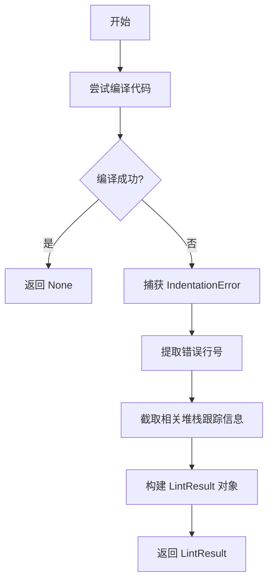

#### 带注释源码

```python
def lint_python_compile(fname, code):
    try:
        # 尝试编译给定的代码字符串。
        # fname 参数用于在错误信息中标识文件。
        # "exec" 模式表示代码可以包含多个语句。
        compile(code, fname, "exec")  # USE TRACEBACK BELOW HERE
        # 如果编译成功，没有语法错误，则直接返回 None。
        return
    except IndentationError as err:
        # 如果捕获到缩进错误，提取错误的结束行号。
        # 如果 err 对象有 end_lineno 属性，则使用它；否则使用 lineno。
        end_lineno = getattr(err, "end_lineno", err.lineno)
        # 如果 end_lineno 是整数，则错误行号范围是从 end_lineno-1 到 end_lineno。
        # 否则，行号列表为空。
        if isinstance(end_lineno, int):
            line_numbers = list(range(end_lineno - 1, end_lineno))
        else:
            line_numbers = []

        # 获取完整的异常堆栈跟踪信息。
        tb_lines = traceback.format_exception(type(err), err, err.__traceback__)
        last_file_i = 0

        # 在堆栈跟踪信息中查找标记 "# USE TRACEBACK BELOW HERE"，
        # 以定位到与当前文件相关的错误信息部分。
        target = "# USE TRACEBACK"
        target += " BELOW HERE"
        for i in range(len(tb_lines)):
            if target in tb_lines[i]:
                last_file_i = i
                break
        # 截取堆栈跟踪信息，只保留与当前文件相关的部分。
        tb_lines = tb_lines[:1] + tb_lines[last_file_i + 1 :]

    # 将截取后的堆栈跟踪信息连接成字符串。
    res = "".join(tb_lines)
    # 返回一个 LintResult 对象，包含错误信息和相关的行号。
    return LintResult(text=res, lines=line_numbers)
```

### `basic_lint`

`basic_lint` 函数是一个语法检查器，它使用 `tree-sitter` 库来解析给定文件名的代码，并遍历生成的抽象语法树（AST）以查找语法错误节点（类型为 `"ERROR"` 或标记为缺失的节点）。如果发现错误，它会收集这些错误发生的行号，并返回一个包含错误信息和行号列表的 `LintResult` 对象。如果未发现错误，则返回 `None`。

参数：

- `fname`：`str`，要检查的文件的路径或名称。
- `code`：`str`，文件中的代码内容。

返回值：`Optional[LintResult]`，如果发现语法错误，则返回一个包含错误文本和错误行号的 `LintResult` 对象；否则返回 `None`。

#### 流程图

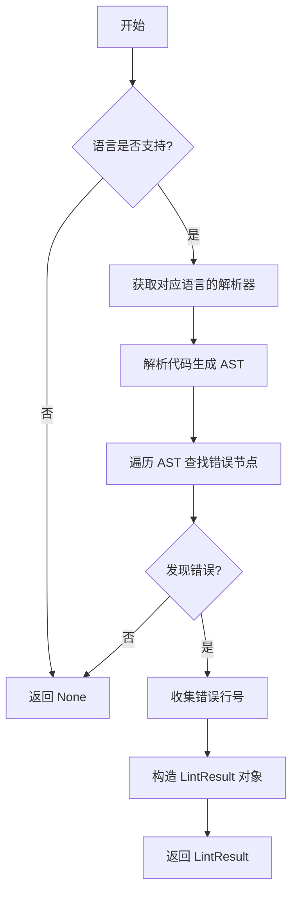

#### 带注释源码

```python
def basic_lint(fname, code):
    """
    Use tree-sitter to look for syntax errors, display them with tree context.
    """

    # 根据文件名确定编程语言
    lang = filename_to_lang(fname)
    # 如果不支持该语言，则直接返回 None
    if not lang:
        return

    # 获取对应语言的 tree-sitter 解析器
    parser = get_parser(lang)
    # 使用解析器解析代码，生成抽象语法树（AST）
    tree = parser.parse(bytes(code, "utf-8"))

    # 遍历 AST，查找语法错误节点并收集其行号
    errors = traverse_tree(tree.root_node)
    # 如果没有发现错误，返回 None
    if not errors:
        return
    # 如果发现错误，构造并返回一个 LintResult 对象
    # 错误文本格式为 "文件名:第一个错误行号"
    # lines 参数包含所有错误行号的列表
    return LintResult(text=f"{fname}:{errors[0]}", lines=errors)
```

### `extract_error_line_from`

从 linter 错误输出中提取第一个错误行号。

参数：

- `lint_error`：`str`，linter 工具输出的错误信息字符串

返回值：`int`，提取到的第一个错误行号，如果未找到则返回 `None`

#### 流程图

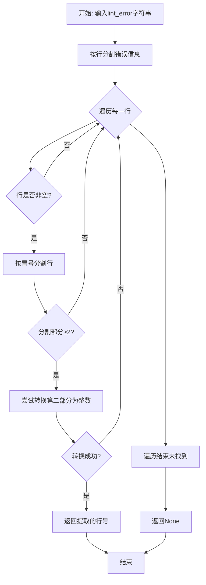

#### 带注释源码

```python
def extract_error_line_from(lint_error):
    # 从 openhands.agentskills#_lint_file 迁移而来
    # 遍历错误信息的每一行
    for line in lint_error.splitlines(True):
        # 跳过空行
        if line.strip():
            # 错误信息格式通常为: <文件名>:<行号>:<列号>: <错误代码> <错误信息>
            parts = line.split(":")
            # 确保有足够的部分（至少包含文件名和行号）
            if len(parts) >= 2:
                try:
                    # 尝试将第二部分（行号）转换为整数
                    first_error_line = int(parts[1])
                    # 找到第一个有效行号后立即返回
                    break
                except ValueError:
                    # 如果转换失败（不是数字），继续检查下一行
                    continue
    # 返回提取到的行号（如果未找到则为None）
    return first_error_line
```

### `tree_context`

`tree_context` 函数用于生成指定代码文件中特定行号的上下文信息。它通过 `grep_ast` 库的 `TreeContext` 类来解析代码文件，并高亮显示感兴趣的行（lines of interest, LOIs），最终返回格式化后的上下文字符串。

参数：

- `fname`：`str`，代码文件的路径。
- `code`：`str`，代码文件的内容。
- `line_nums`：`list[int]` 或 `set[int]`，需要高亮显示的行号列表。

返回值：`str`，格式化后的代码上下文字符串，包含行号和高亮标记。

#### 流程图

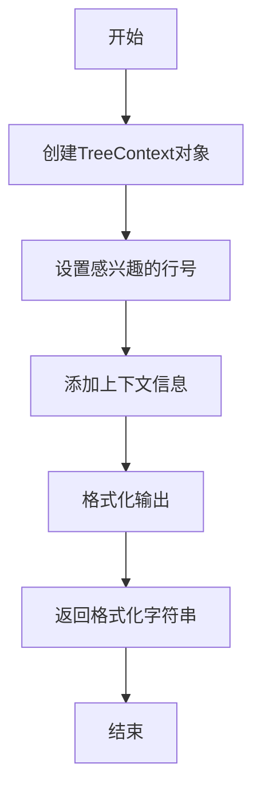

#### 带注释源码

```python
def tree_context(fname, code, line_nums):
    # 创建TreeContext对象，用于解析代码文件并生成上下文信息
    context = TreeContext(
        fname,  # 代码文件路径
        code,  # 代码内容
        color=False,  # 禁用颜色输出
        line_number=True,  # 显示行号
        child_context=False,  # 不显示子上下文
        last_line=False,  # 不显示最后一行
        margin=0,  # 上下文边距为0
        mark_lois=True,  # 高亮感兴趣的行
        loi_pad=3,  # 感兴趣行周围的行数
        # header_max=30,  # 注释掉的参数，限制头部显示的最大行数
        show_top_of_file_parent_scope=False,  # 不显示文件顶部的父作用域
    )
    # 将行号列表转换为集合，确保唯一性
    line_nums = set(line_nums)
    # 将感兴趣的行号添加到TreeContext对象中
    context.add_lines_of_interest(line_nums)
    # 添加上下文信息（如函数定义、类定义等）
    context.add_context()
    # 格式化输出，生成最终的上下文字符串
    output = context.format()

    # 返回格式化后的上下文字符串
    return output
```

### `traverse_tree`

该函数递归遍历抽象语法树（AST）的节点，收集所有语法错误节点对应的行号。

参数：

- `node`：`tree_sitter.Node`，表示当前遍历的AST节点。

返回值：`list[int]`，返回一个包含所有错误行号的列表。

#### 流程图

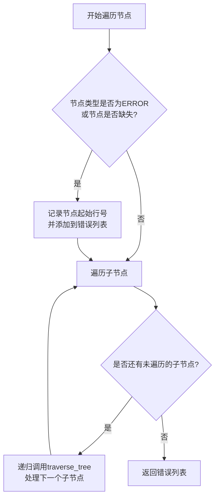

#### 带注释源码

```python
# Traverse the tree to find errors
def traverse_tree(node):
    # 初始化错误列表，用于存储所有语法错误对应的行号
    errors = []
    # 检查当前节点是否为语法错误节点或缺失节点
    if node.type == "ERROR" or node.is_missing:
        # 计算错误行号（tree-sitter的行号从0开始，因此需要+1）
        line_no = node.start_point[0] + 1
        # 将错误行号添加到列表中
        errors.append(line_no)

    # 递归遍历当前节点的所有子节点
    for child in node.children:
        # 收集子节点中的错误行号，并合并到当前错误列表中
        errors += traverse_tree(child)

    # 返回当前节点及其子节点中的所有错误行号
    return errors
```

### `main`

`main` 函数是脚本的入口点，负责解析命令行参数，对每个指定的文件运行 linter 检查，并打印出发现的任何错误。

参数：

-  `sys.argv`：`list`，包含命令行参数的列表。第一个参数是脚本名称，后续参数是需要检查的文件路径。

返回值：`None`，无返回值。

#### 流程图

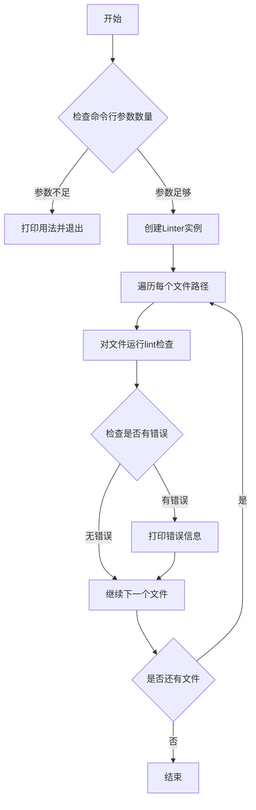

#### 带注释源码

```python
def main():
    """
    Main function to parse files provided as command line arguments.
    """
    # 检查命令行参数数量，如果少于2（即没有提供文件路径），则打印用法并退出。
    if len(sys.argv) < 2:
        print("Usage: python linter.py <file1> <file2> ...")
        sys.exit(1)

    # 创建一个Linter实例，设置其根目录为当前工作目录。
    linter = Linter(root=os.getcwd())
    # 遍历从命令行参数中获取的每个文件路径（跳过第一个参数，即脚本名）。
    for file_path in sys.argv[1:]:
        # 对当前文件运行lint检查。
        errors = linter.lint(file_path)
        # 如果检查返回了错误结果（即errors不为None），则打印错误信息。
        if errors:
            print(errors)
```

### `Linter.__init__`

`Linter` 类的构造函数，用于初始化一个代码检查器实例。它设置了默认的编码和根目录，并预定义了一个语言到检查命令/方法的映射字典。该映射允许为不同编程语言指定不同的语法检查策略。

参数：

- `encoding`：`str`，可选参数，默认为 `"utf-8"`。指定读取源代码文件时使用的字符编码。
- `root`：`str` 或 `None`，可选参数，默认为 `None`。指定一个根目录路径。当提供此路径时，后续的文件路径操作（如获取相对路径）将基于此根目录。

返回值：`None`，构造函数不返回任何值。

#### 流程图

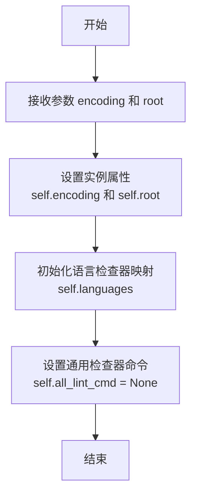

#### 带注释源码

```python
def __init__(self, encoding="utf-8", root=None):
    # 设置实例的默认编码，用于读取文件
    self.encoding = encoding
    # 设置根目录，用于计算文件的相对路径
    self.root = root

    # 初始化一个字典，将语言名称映射到对应的检查方法
    # 这是Linter的核心配置，决定了如何处理不同语言的代码
    self.languages = dict(
        python=self.py_lint,  # Python 使用专门的 py_lint 方法
        sql=self.fake_lint,   # SQL 暂时使用 fake_lint 绕过检查
        css=self.fake_lint,   # CSS 暂时使用 fake_lint 绕过检查
        js=self.fake_lint,    # JavaScript 暂时使用 fake_lint 绕过检查
        javascript=self.fake_lint, # JavaScript 别名
    )
    # 初始化一个可选的通用检查命令，如果设置，将覆盖所有语言的检查
    self.all_lint_cmd = None
```

### `Linter.set_linter`

该方法用于动态设置或更新 `Linter` 实例的语法检查（lint）命令。它允许为特定的编程语言指定一个自定义的 lint 命令（可以是可调用对象或命令行字符串），或者为所有语言设置一个全局的默认 lint 命令。

参数：

- `lang`：`str`，要为其设置 lint 命令的编程语言名称（例如 `"python"`）。如果为 `None`，则设置一个适用于所有语言的全局 lint 命令。
- `cmd`：`Union[Callable, str]`，要设置的 lint 命令。可以是一个可调用对象（如函数），也可以是一个命令行字符串。如果 `lang` 为 `None`，此命令将作为所有语言的默认检查器。

返回值：`None`，该方法不返回任何值，仅修改 `Linter` 实例的内部状态。

#### 流程图

```mermaid
flowchart TD
    A[开始: set_linter(lang, cmd)] --> B{lang 是否为 None?}
    B -- 是 --> C[将 all_lint_cmd 设置为 cmd]
    B -- 否 --> D[将 languages[lang] 设置为 cmd]
    C --> E[结束]
    D --> E
```

#### 带注释源码

```python
def set_linter(self, lang, cmd):
    # 如果 lang 参数不为 None，则为指定的语言设置 lint 命令
    if lang:
        # 将 cmd（可以是函数或字符串）赋值给 self.languages 字典中对应的语言键
        self.languages[lang] = cmd
        return

    # 如果 lang 参数为 None，则设置一个适用于所有语言的全局 lint 命令
    self.all_lint_cmd = cmd
```

### `Linter.get_rel_fname`

该方法用于获取给定文件路径相对于 `Linter` 实例根目录的相对路径。如果实例未设置根目录（`root` 为 `None`），则直接返回原始文件路径。

参数：

- `fname`：`str`，需要计算相对路径的原始文件路径。

返回值：`str`，相对于 `Linter` 实例根目录的文件路径。如果未设置根目录，则返回原始路径。

#### 流程图

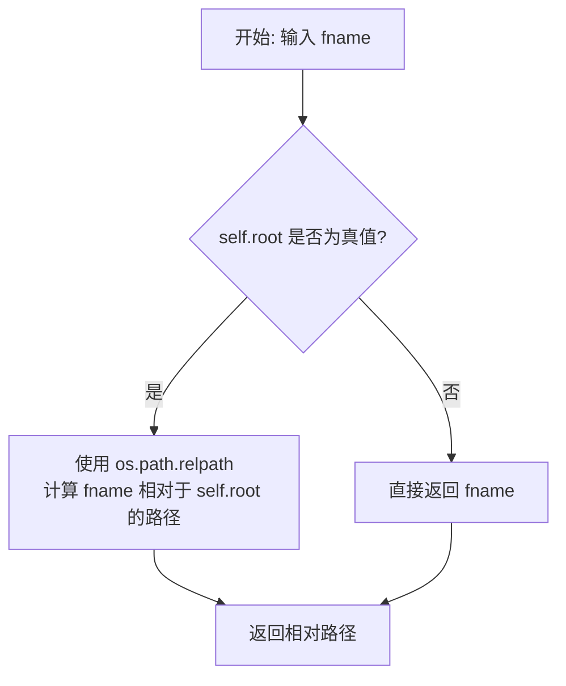

#### 带注释源码

```python
def get_rel_fname(self, fname):
    # 检查当前 Linter 实例是否设置了根目录 (self.root)
    if self.root:
        # 如果设置了根目录，使用 os.path.relpath 计算 fname 相对于 self.root 的相对路径
        return os.path.relpath(fname, self.root)
    else:
        # 如果没有设置根目录，则直接返回原始的文件路径 fname
        return fname
```

### `Linter.run_cmd`

该方法用于执行一个外部命令行工具（通常是代码检查工具，如 linter），并处理其输出。它通过 `subprocess.Popen` 运行命令，捕获标准输出和标准错误，然后根据命令的退出状态码决定是否返回一个 `LintResult` 对象。如果命令成功（退出码为 0），则返回 `None`；如果命令失败（非零退出码），则解析输出中的错误信息，提取错误行号，并返回一个包含错误文本和行号列表的 `LintResult` 对象。

参数：

- `cmd`：`str`，要执行的命令行字符串，通常包含 linter 命令及其参数。
- `rel_fname`：`str`，相对于 `Linter` 实例根目录的文件路径，该文件将被传递给 linter 命令进行检查。
- `code`：`str`，文件的代码内容。此参数在方法中未被使用，可能是为了保持接口一致性或未来扩展。

返回值：`Optional[LintResult]`，如果命令执行成功（退出码为 0），则返回 `None`；如果命令执行失败（非零退出码），则返回一个 `LintResult` 对象，其中包含错误信息和错误行号列表。

#### 流程图

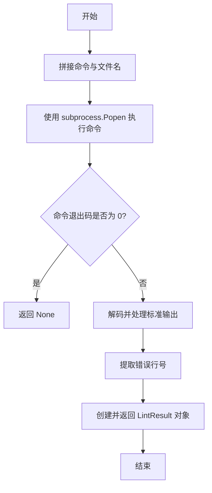

#### 带注释源码

```python
def run_cmd(self, cmd, rel_fname, code):
    # 将文件名拼接到命令字符串末尾，形成完整的命令行
    cmd += " " + rel_fname
    # 将命令字符串分割成列表，以便传递给 subprocess.Popen
    cmd = cmd.split()
    # 使用 subprocess.Popen 执行命令，设置工作目录为 self.root，捕获标准输出和标准错误
    process = subprocess.Popen(cmd, cwd=self.root, stdout=subprocess.PIPE, stderr=subprocess.STDOUT)
    # 等待命令执行完成，并获取输出
    stdout, _ = process.communicate()
    # 解码输出为字符串，并去除首尾空白字符
    errors = stdout.decode().strip()
    # 保存命令的退出状态码
    self.returncode = process.returncode
    # 如果退出码为 0，表示命令执行成功，没有错误，直接返回 None
    if self.returncode == 0:
        return  # zero exit status

    # 如果退出码非零，表示命令执行失败或有错误
    # 重新组合命令字符串，用于可能的错误信息展示
    cmd = " ".join(cmd)
    res = ""
    # 将错误输出添加到结果字符串中
    res += errors
    # 从错误信息中提取第一个错误行号
    line_num = extract_error_line_from(res)
    # 创建并返回 LintResult 对象，包含错误文本和错误行号列表
    return LintResult(text=res, lines=[line_num])
```

### `Linter.get_abs_fname`

该方法用于将给定的文件名转换为绝对路径。它首先检查文件名是否为绝对路径，如果是则直接返回；否则，它会根据文件的相对路径或临时文件状态，结合类实例的根目录（`self.root`）信息，计算出并返回对应的绝对路径或相对路径。

参数：

- `fname`：`str`，输入的文件名，可以是绝对路径、相对路径或临时文件名。

返回值：`str`，转换后的绝对路径或相对路径。

#### 流程图

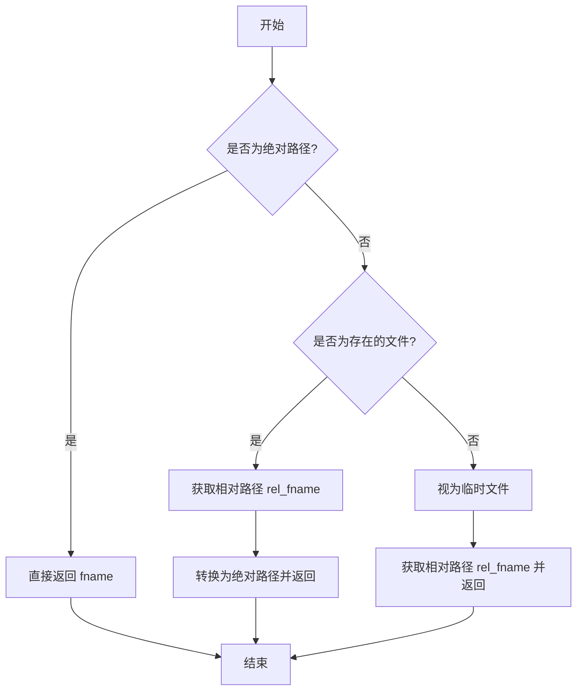

#### 带注释源码

```python
def get_abs_fname(self, fname):
    # 如果输入的文件名已经是绝对路径，直接返回
    if os.path.isabs(fname):
        return fname
    # 如果文件名是一个存在的文件（相对路径）
    elif os.path.isfile(fname):
        # 获取相对于类实例根目录（self.root）的相对路径
        rel_fname = self.get_rel_fname(fname)
        # 将相对路径转换为绝对路径并返回
        return os.path.abspath(rel_fname)
    else:  # 如果是一个临时文件（可能不存在于文件系统中）
        # 直接获取相对于类实例根目录的相对路径并返回
        return self.get_rel_fname(fname)
```

### `Linter.lint`

该方法用于对指定文件进行代码检查（linting），根据文件类型选择合适的检查器（如特定语言的检查器、自定义命令或基础语法检查），并返回检查结果。

参数：

- `fname`：`str`，待检查文件的路径（可以是绝对路径、相对路径或临时文件）。
- `cmd`：`Optional[str]`，可选参数，指定用于检查的自定义命令字符串。如果未提供，则根据文件扩展名自动选择检查器。

返回值：`Optional[LintResult]`，返回一个`LintResult`对象，其中包含检查错误的文本描述和涉及的行号列表；如果未发现错误或文件类型不支持检查，则返回`None`。

#### 流程图

```mermaid
flowchart TD
    A[开始: lint(fname, cmd)] --> B[读取文件内容 code]
    B --> C{cmd 是否提供?}
    C -- 是 --> D[使用提供的 cmd]
    C -- 否 --> E[根据文件扩展名确定语言 lang]
    E --> F{是否存在全局检查命令 all_lint_cmd?}
    F -- 是 --> G[使用 all_lint_cmd]
    F -- 否 --> H[从 languages 字典获取对应语言的检查器]
    H --> I{检查器是否为可调用对象?}
    I -- 是 --> J[调用检查器函数]
    I -- 否 --> K{检查器命令是否存在?}
    K -- 是 --> L[执行 run_cmd 运行外部命令]
    K -- 否 --> M[执行 basic_lint 进行基础语法检查]
    D --> N[执行 run_cmd 运行外部命令]
    J --> O[获取检查结果 linkres]
    L --> O
    M --> O
    G --> O
    O --> P[返回 linkres]
```

#### 带注释源码

```python
def lint(self, fname, cmd=None) -> Optional[LintResult]:
    # 读取指定文件的内容，使用对象初始化时指定的编码
    code = Path(fname).read_text(self.encoding)
    # 获取文件的绝对路径，用于后续处理
    absolute_fname = self.get_abs_fname(fname)
    # 如果提供了自定义命令，去除首尾空格
    if cmd:
        cmd = cmd.strip()
    # 如果没有提供自定义命令
    if not cmd:
        # 根据文件名推断编程语言
        lang = filename_to_lang(fname)
        # 如果无法推断语言，则直接返回None
        if not lang:
            return None
        # 如果设置了全局检查命令，则使用它
        if self.all_lint_cmd:
            cmd = self.all_lint_cmd
        else:
            # 否则从语言-检查器映射字典中获取对应语言的检查器
            cmd = self.languages.get(lang)
    # 判断获取到的检查器类型
    if callable(cmd):
        # 如果检查器是一个可调用对象（如方法），则直接调用
        linkres = cmd(fname, absolute_fname, code)
    elif cmd:
        # 如果检查器是一个命令字符串，则通过run_cmd方法执行外部命令
        linkres = self.run_cmd(cmd, absolute_fname, code)
    else:
        # 如果既没有自定义命令，也没有找到对应的检查器，则执行基础语法检查
        linkres = basic_lint(absolute_fname, code)
    # 返回检查结果
    return linkres
```

### `Linter.flake_lint`

该方法使用 `flake8` 工具对指定的 Python 代码文件进行静态代码分析，主要检查一些致命的语法和未定义变量等错误。

参数：

- `rel_fname`：`str`，相对于 `Linter` 实例根目录的文件路径。
- `code`：`str`，要检查的代码内容字符串。

返回值：`Optional[LintResult]`，如果 `flake8` 命令执行成功并发现错误，则返回一个包含错误信息和行号的 `LintResult` 对象；如果命令执行成功但未发现错误，则返回 `None`；如果 `flake8` 命令未找到（`FileNotFoundError`），也返回 `None`。

#### 流程图

```mermaid
flowchart TD
    A[开始: flake_lint(rel_fname, code)] --> B[构造flake8命令字符串]
    B --> C[尝试执行命令]
    C --> D{命令执行成功?}
    D -- 是 --> E{命令返回码为0?}
    E -- 是 --> F[返回 None]
    E -- 否 --> G[解析输出，提取错误行号]
    G --> H[构造并返回 LintResult]
    D -- 否<br>（FileNotFoundError） --> I[返回 None]
```

#### 带注释源码

```python
def flake_lint(self, rel_fname, code):
    # 定义要检查的 flake8 错误代码，这些通常是致命的语法或运行时错误
    fatal = "F821,F822,F831,E112,E113,E999,E902"
    # 构造 flake8 命令字符串，--isolated 选项忽略配置文件
    flake8 = f"flake8 --select={fatal} --isolated"

    try:
        # 调用 run_cmd 方法执行 flake8 命令
        flake_res = self.run_cmd(flake8, rel_fname, code)
    except FileNotFoundError:
        # 如果系统中未安装 flake8 命令，捕获异常并返回 None
        flake_res = None
    # 返回执行结果（LintResult 或 None）
    return flake_res
```

### `Linter.py_lint`

`py_lint` 方法是 `Linter` 类中用于对 Python 文件进行语法和代码风格检查的核心方法。它通过组合多种检查工具（如 `flake8`、Python 编译器和基础语法检查）来确保代码质量，并返回一个包含错误信息和行号的 `LintResult` 对象。

参数：

- `self`：`Linter` 类实例，包含配置信息和检查方法。
- `fname`：`str`，待检查文件的原始路径（可能是相对路径或临时文件路径）。
- `rel_fname`：`str`，相对于 `Linter` 实例根目录的绝对路径或处理后的相对路径。
- `code`：`str`，从文件中读取的代码内容。

返回值：`Optional[LintResult]`，如果检查到错误，则返回包含错误文本和行号列表的 `LintResult` 对象；如果未发现错误，则返回 `None`。

#### 流程图

```mermaid
flowchart TD
    A[开始: py_lint(fname, rel_fname, code)] --> B[调用 flake_lint 进行<br>静态代码风格检查]
    B --> C{是否有错误?}
    C -- 是 --> D[返回 flake_lint 结果]
    C -- 否 --> E[调用 lint_python_compile<br>进行编译检查]
    E --> F{是否有编译错误?}
    F -- 是 --> G[返回编译错误结果]
    F -- 否 --> H[调用 basic_lint<br>进行基础语法检查]
    H --> I{是否有语法错误?}
    I -- 是 --> J[返回语法错误结果]
    I -- 否 --> K[返回 None]
    D --> L[结束]
    G --> L
    J --> L
    K --> L
```

#### 带注释源码

```python
def py_lint(self, fname, rel_fname, code):
    # 1. 首先使用 flake8 进行静态代码风格检查，主要关注致命错误（如未定义变量、语法错误等）
    error = self.flake_lint(rel_fname, code)
    # 如果 flake8 检查出错误，直接返回错误结果
    if not error:
        # 2. 如果 flake8 没有错误，使用 Python 内置的 compile 函数进行编译检查
        error = lint_python_compile(fname, code)
    if not error:
        # 3. 如果编译检查也没有错误，最后使用 tree-sitter 进行基础语法检查
        error = basic_lint(rel_fname, code)
    # 返回最终的检查结果（可能是错误信息或 None）
    return error
```

### `Linter.fake_lint`

该方法是一个占位符或“假”的代码检查方法，用于绕过对特定编程语言（如 SQL、CSS、JavaScript）的语法检查。当 `Linter` 类被配置为对某些语言使用 `fake_lint` 时，调用此方法将始终返回 `None`，表示没有发现任何语法错误，从而有效地跳过对这些文件的代码检查。

参数：

- `fname`：`str`，原始的文件路径或名称。
- `rel_fname`：`str`，相对于 `Linter` 实例根目录的文件路径。
- `code`：`str`，文件中的代码内容。

返回值：`None`，表示没有发现任何语法错误或问题。

#### 流程图

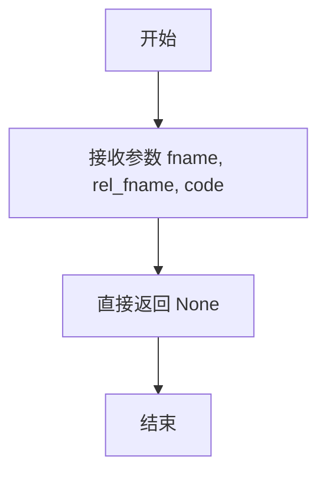

#### 带注释源码

```python
def fake_lint(self, fname, rel_fname, code):
    # 这是一个占位符方法，用于绕过对特定语言的语法检查。
    # 它不执行任何实际的代码分析，总是返回 None。
    return None
```

## 关键组件


### Linter 类

Linter 类是代码的核心组件，负责根据文件类型选择合适的语法检查策略，并执行具体的检查操作。它支持多种编程语言，并允许自定义检查命令。

### LintResult 数据类

LintResult 是一个数据类，用于封装语法检查的结果，包含错误文本信息和相关的行号列表。

### 语法检查策略函数

这是一组函数，作为 `Linter.languages` 字典的值，定义了针对不同编程语言（如 Python、SQL、CSS、JavaScript）的具体检查逻辑。例如，`py_lint` 函数组合了 Flake8、Python 编译检查和基础语法检查。

### 基础语法检查函数 (basic_lint)

`basic_lint` 函数是通用的语法检查器，它使用 `tree-sitter` 库解析代码并遍历语法树，以检测语法错误节点。

### Python 编译检查函数 (lint_python_compile)

`lint_python_compile` 函数专门用于 Python 代码，它通过 `compile` 函数尝试编译代码，并捕获和处理编译时异常（特别是缩进错误），以生成详细的错误信息。

### 错误行号提取函数 (extract_error_line_from)

`extract_error_line_from` 函数用于从工具（如 Flake8）输出的错误信息字符串中，提取出第一个错误的行号。

### 语法树遍历函数 (traverse_tree)

`traverse_tree` 是一个递归函数，用于遍历 `tree-sitter` 生成的语法树，收集所有标记为 `ERROR` 或缺失的节点所在的行号。

### 上下文格式化函数 (tree_context)

`tree_context` 函数利用 `grep_ast` 库，根据给定的行号列表，生成代码片段的上下文信息，用于更清晰地展示错误位置。


## 问题及建议


### 已知问题

-   **硬编码的语言映射与命令**：`Linter` 类的 `__init__` 方法中硬编码了特定语言（如 `python`, `sql`, `css`, `js`）的 lint 函数映射。这导致代码扩展性差，添加对新语言的支持需要修改源代码，违反了开闭原则。
-   **脆弱的错误行号提取**：`extract_error_line_from` 函数通过解析错误信息字符串来提取行号，其逻辑依赖于外部 linter（如 `flake8`）输出格式的稳定性。如果外部工具的输出格式发生变化，此函数可能无法正确提取行号，导致功能失效。
-   **潜在的资源泄漏**：`run_cmd` 方法中使用 `subprocess.Popen` 执行外部命令，但未显式管理子进程的生命周期（例如，未使用 `with` 语句或确保在所有路径上调用 `wait`/`terminate`）。虽然 `communicate()` 通常会等待进程结束，但在异常情况下可能无法妥善清理。
-   **`get_abs_fname` 方法逻辑存在歧义**：该方法在 `os.path.isfile(fname)` 为真时，会先计算相对路径 `rel_fname`，再获取其绝对路径。如果 `fname` 本身是相对于当前工作目录的文件，而 `self.root` 又不同，此逻辑可能产生非预期的路径。对于临时文件（`else` 分支），直接返回相对路径也可能不符合调用者预期。
-   **`basic_lint` 函数错误信息不完整**：当 `traverse_tree` 发现语法错误时，`basic_lint` 仅返回第一个错误的行号（`errors[0]`）和文件名。这丢失了其他错误信息，对于存在多个语法错误的文件，诊断信息不足。
-   **`lint_python_compile` 函数异常处理不全面**：该函数仅捕获 `IndentationError`，对于其他编译错误（如 `SyntaxError`, `NameError` 等）会直接抛出，未被 `py_lint` 方法处理，可能导致程序崩溃。
-   **全局状态管理**：`Linter` 实例的 `returncode` 属性在 `run_cmd` 中被设置，但这个状态可能被后续的调用覆盖，且对类外部不可见。这种隐式的状态传递方式容易引发错误，且不利于测试和调试。

### 优化建议

-   **将语言映射配置化**：建议将语言到 lint 命令/函数的映射设计为可配置的，例如通过构造函数参数传入字典，或从配置文件加载。这样可以不修改核心代码即可支持新语言或覆盖现有配置。
-   **增强错误行号提取的鲁棒性**：改进 `extract_error_line_from` 函数，使其能处理更多 linter 的输出格式，或为不同的 linter 提供不同的解析器。可以考虑使用正则表达式进行更精确的匹配，并对解析失败的情况提供回退机制或更清晰的错误提示。
-   **使用更安全的子进程管理**：建议使用 `subprocess.run` 替代 `subprocess.Popen`，因为它提供了更简洁的接口并自动等待进程完成。如果需要更细粒度的控制，应确保在 `try...finally` 块或上下文管理器中妥善处理进程对象。
-   **重构路径处理逻辑**：重新审视 `get_abs_fname` 和 `get_rel_fname` 方法的目标，明确其在不同场景（绝对路径、相对于 `root` 的路径、临时文件）下的行为。考虑统一使用 `pathlib.Path` 对象进行路径操作，以提高可读性和跨平台兼容性。
-   **完善 `basic_lint` 的错误报告**：修改 `basic_lint` 函数，使其能够收集并报告所有检测到的语法错误行号，而不仅仅是第一个。可以修改返回的 `LintResult` 的 `text` 字段以包含所有错误信息，或至少将 `lines` 列表填充完整。
-   **扩展 `lint_python_compile` 的异常捕获**：在 `lint_python_compile` 函数中，应捕获 `SyntaxError` 等更常见的编译错误，并提供类似 `IndentationError` 的详细错误信息提取和格式化逻辑，确保所有 Python 编译错误都能被友好地处理并返回。
-   **移除或显式化类状态**：考虑移除 `self.returncode` 这个类字段，或者将其作为 `run_cmd` 方法的返回值的一部分（例如，返回一个包含结果和返回码的元组或数据类）。避免使用隐式的实例属性来传递方法结果。
-   **增加单元测试**：为 `Linter` 类及其关键函数（如 `extract_error_line_from`, `basic_lint`, `lint_python_compile`）编写全面的单元测试，覆盖各种边界情况和错误场景，以确保代码的稳定性和可维护性。
-   **优化导入与依赖管理**：检查是否所有导入都是必要的。例如，`tree_sitter_languages` 仅在 `basic_lint` 中使用，可以考虑延迟导入或在无法导入时提供优雅降级。同时，确保在文档或 `requirements.txt` 中明确声明这些依赖。


## 其它


### 设计目标与约束

本模块的核心设计目标是提供一个可扩展、多语言支持的轻量级代码语法检查（Linting）工具。其主要约束包括：1) 运行时依赖外部命令行工具（如flake8）和Python库（tree-sitter-languages, grep-ast），需确保环境配置正确；2) 为保持轻量，默认仅对Python进行较严格的检查（编译检查、flake8子集检查、基础语法检查），对其他语言（SQL, CSS, JS）仅进行基础语法检查或跳过检查；3) 输出结果需包含错误信息和具体的行号，以便集成到其他工具中进行高亮或快速定位。

### 错误处理与异常设计

模块的错误处理策略主要分为两类：1) **预期内的检查错误**：如语法错误、编译错误、风格违规等，这些错误被封装为`LintResult`对象返回，包含错误文本和行号列表，不抛出异常，由调用方决定如何处理。2) **运行时异常**：如文件未找到、子进程执行失败、外部命令不存在等。对于子进程调用（`run_cmd`），通过检查`returncode`并解析`stdout`来捕获错误；对于外部命令缺失（如`flake8`），在`flake_lint`方法中通过`try-except FileNotFoundError`进行捕获并静默处理（返回`None`）；对于其他未捕获的异常（如`compile`失败），在`lint_python_compile`中通过`try-except`捕获并格式化为`LintResult`。整体设计倾向于内部消化异常，尽可能为调用方返回一个有意义的`LintResult`或`None`。

### 数据流与状态机

模块的核心数据流始于`Linter.lint()`方法调用。输入为文件路径和可选的检查命令。数据流路径根据文件语言和配置决定：1) 若指定了`cmd`参数，则直接运行该命令；2) 否则，根据文件扩展名映射到`self.languages`字典中的处理方法（如`py_lint`）；3) 若配置了`self.all_lint_cmd`，则对所有语言使用该命令。`py_lint`方法的数据流是串联的：先执行`flake_lint`（子进程调用`flake8`），若无错误则执行`lint_python_compile`（Python编译检查），最后执行`basic_lint`（基于tree-sitter的通用语法检查）。`basic_lint`是其他语言（如SQL）的默认检查路径。整个流程无复杂的状态机，是一个线性的、带条件分支的检查链，最终汇聚为返回一个`LintResult`或`None`。

### 外部依赖与接口契约

**外部依赖**：
1.  **库依赖**：`tree_sitter_languages`（用于获取语言解析器）、`grep_ast`（用于生成错误上下文，但当前代码中`tree_context`函数未被调用，可能为预留功能）。
2.  **命令行工具依赖**：`flake8`（用于Python代码的特定静态检查）。若未安装，对应检查会静默跳过。
3.  **系统依赖**：`subprocess`模块所需的系统Shell环境。

**接口契约**：
1.  **`Linter`类构造函数**：接受`encoding`（文件编码）和`root`（工作根目录）参数。
2.  **`Linter.lint(fname, cmd=None)`方法**：核心公共接口。契约：输入一个文件路径`fname`，返回一个`Optional[LintResult]`。`cmd`参数允许覆盖默认的检查逻辑。
3.  **`Linter.set_linter(lang, cmd)`方法**：扩展接口。契约：允许为特定语言（`lang`）注册自定义的检查函数或命令字符串（`cmd`），或通过设置`lang`为`None`来为所有语言设置默认命令（`self.all_lint_cmd`）。
4.  **`LintResult`数据类**：输出契约。包含`text`（错误信息文本）和`lines`（错误行号列表）两个字段，为调用方提供标准化的错误数据。

### 安全考虑

1.  **命令注入**：在`run_cmd`方法中，通过`cmd.split()`将命令字符串分割成参数列表再传递给`subprocess.Popen`，这比直接使用`shell=True`更安全，可以有效防止因输入内容包含Shell元字符（如`;`, `&`, `|`）而导致的命令注入攻击。然而，如果`cmd`参数来自不可信的输入，且其中包含由空格分隔的多个命令，此方法仍可能存在问题。在当前上下文中，`cmd`主要来自内部配置或可信的调用方，风险较低。
2.  **文件路径处理**：`get_abs_fname`和`get_rel_fname`方法处理相对路径和绝对路径，并尝试将路径规范化为相对于`root`目录的形式。这有助于防止因路径遍历（如`../../../etc/passwd`）而意外访问或检查系统文件。但代码未显式地对路径进行净化或白名单检查，如果`fname`完全来自不可信输入，仍存在风险。
3.  **资源消耗**：`basic_lint`函数会使用`tree_sitter`解析整个文件内容。对于非常大的文件，可能存在内存和CPU消耗问题。当前设计未做文件大小或解析深度的限制。

### 测试策略建议

1.  **单元测试**：
    *   `Linter`类：测试`lint`方法对不同语言文件（`.py`, `.sql`, `.js`等）的调用路径是否正确。模拟`run_cmd`的返回值和异常。
    *   `py_lint`方法：测试其串联检查逻辑（flake8 -> 编译检查 -> 基础检查）。需要模拟`flake8`存在和不存在的情况。
    *   `basic_lint`与`traverse_tree`函数：使用包含语法错误和正确语法的代码片段，验证其能否准确检测出错误行号。
    *   `lint_python_compile`与`extract_error_line_from`函数：测试其对各种Python编译错误（如SyntaxError, IndentationError）的捕获和行号提取是否正确。
2.  **集成测试**：
    *   在安装了`flake8`和`tree_sitter_languages`的环境中，对真实的代码文件运行`linter`，验证其输出是否符合预期。
    *   测试`set_linter`方法，验证自定义检查命令或函数能否正确生效。
3.  **异常与边界测试**：
    *   测试不存在的文件路径。
    *   测试无权限读取的文件。
    *   测试空文件。
    *   测试包含特殊字符或非常长路径的文件名。
    *   测试`root`参数设置为不同目录时，相对路径解析的正确性。

### 配置管理

模块的配置主要通过`Linter`类的实例化参数和内部状态管理：
1.  **初始化配置**：通过`__init__`方法设置`encoding`和`root`。`root`用于将绝对路径转换为相对于该根目录的路径，影响错误报告中的文件名显示和子进程的工作目录。
2.  **语言与检查器映射配置**：通过`self.languages`字典硬编码了默认的映射（如`python` -> `py_lint`方法）。这是模块的核心配置，决定了不同文件类型的处理方式。
3.  **运行时配置**：
    *   `set_linter`方法：提供了运行时动态修改语言映射或设置全局默认检查命令的能力，是主要的扩展点。
    *   `all_lint_cmd`属性：若设置，将覆盖`self.languages`映射，对所有文件使用同一条检查命令。
4.  **外部工具配置**：`flake_lint`方法中使用的`flake8`命令参数（`--select=F821,F822,F831,E112,E113,E999,E902 --isolated`）是硬编码的，用于检查特定的致命错误。这构成了对Python检查的细粒度配置，但当前无法通过外部参数修改。

配置缺乏从文件（如JSON、YAML）或环境变量加载的机制，所有配置均需通过代码完成。

    