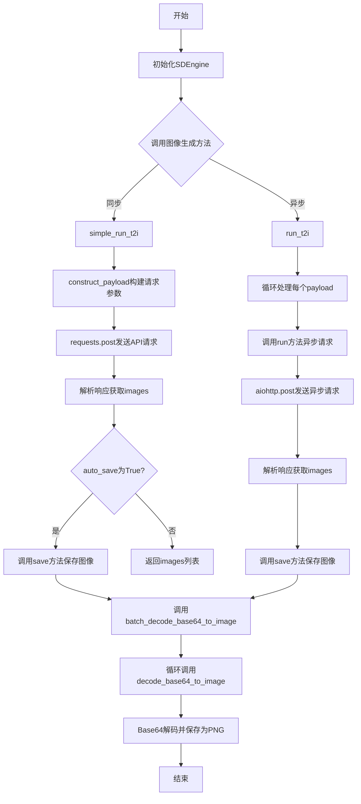
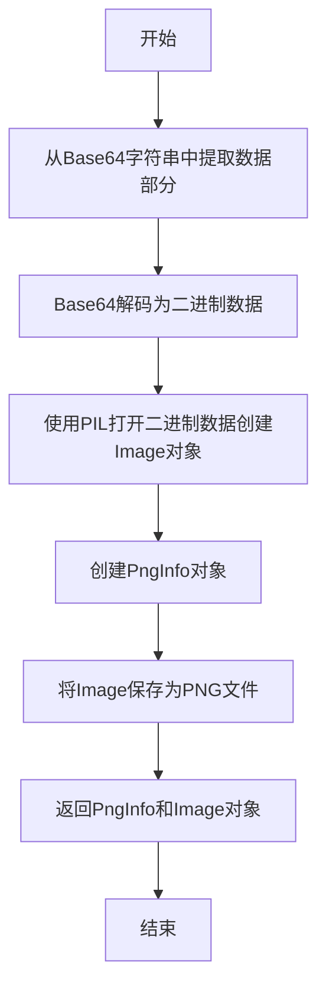
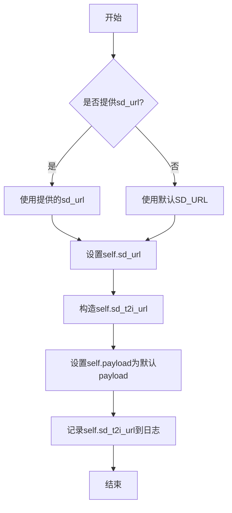
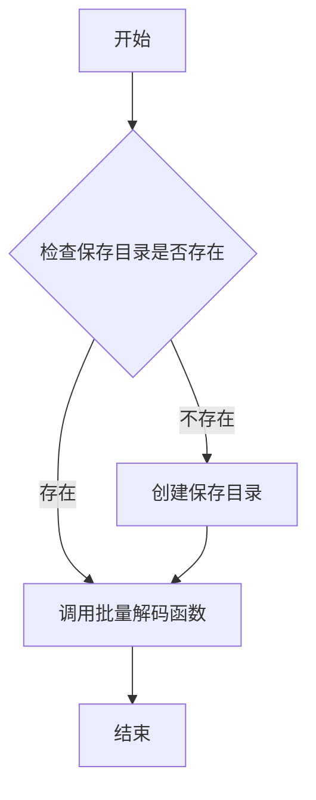
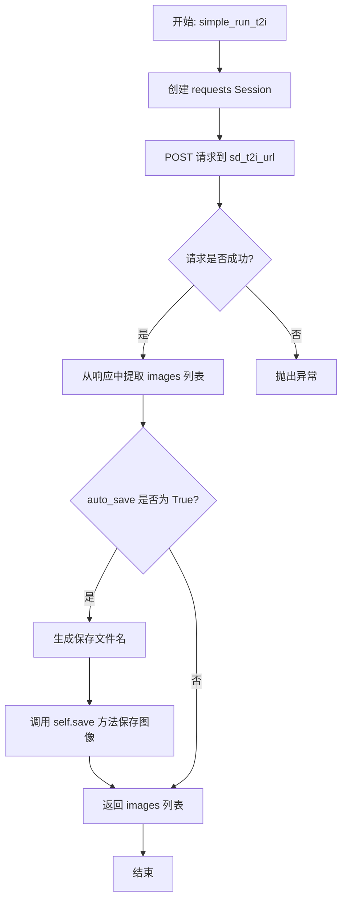
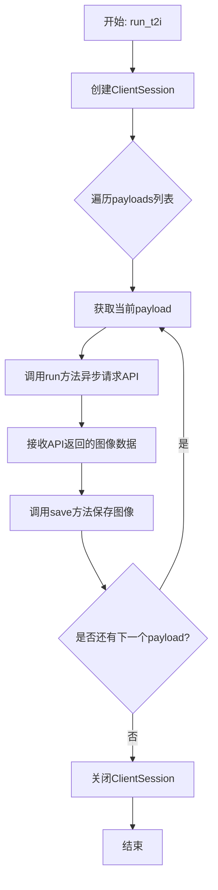
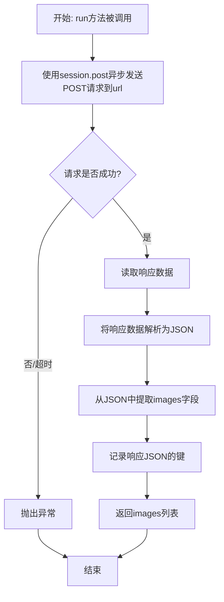

# `.\MetaGPT\metagpt\tools\libs\sd_engine.py` 详细设计文档

该代码实现了一个基于Stable Diffusion模型的文本到图像生成工具类（SDEngine），它封装了与Stable Diffusion WebUI API的交互逻辑，支持同步和异步方式调用API生成图像，并将生成的Base64编码图像解码保存为PNG文件。

## 整体流程



## 类结构

```
SDEngine (Stable Diffusion 引擎类)
├── __init__ (初始化方法)
├── construct_payload (构建API请求参数)
├── save (保存生成的图像)
├── simple_run_t2i (同步文本到图像生成)
├── run_t2i (异步批量文本到图像生成)
└── run (执行异步HTTP请求)
```

## 全局变量及字段


### `payload`
    
默认的稳定扩散API请求参数配置字典，包含图像生成的各种设置如提示词、尺寸、采样器等。

类型：`dict`
    


### `default_negative_prompt`
    
默认的负面提示词字符串，用于在图像生成中排除不需要的元素或风格。

类型：`str`
    


### `SDEngine.sd_url`
    
稳定扩散服务的根URL地址，用于构建完整的API端点。

类型：`str`
    


### `SDEngine.sd_t2i_url`
    
文本到图像生成API的完整URL，由sd_url和固定路径拼接而成。

类型：`str`
    


### `SDEngine.payload`
    
SDEngine实例内部使用的API请求参数配置字典，可通过construct_payload方法动态修改。

类型：`dict`
    
    

## 全局函数及方法


### `decode_base64_to_image`

该函数用于将Base64编码的图片字符串解码并保存为PNG格式的图片文件。它首先将Base64字符串解码为二进制数据，然后使用PIL库打开该数据并创建一个图像对象。接着，它创建一个PNG信息对象（用于存储元数据），最后将图像保存到指定路径，并返回PNG信息对象和图像对象。

参数：

-  `img`：`str`，包含Base64编码的图片数据字符串，可能以“data:image/png;base64,”等前缀开头。
-  `save_name`：`str`，保存图片的文件名（不包含扩展名），函数会自动添加“.png”扩展名。

返回值：`tuple`，一个包含两个元素的元组，第一个元素是`PngImagePlugin.PngInfo`对象（PNG图片的元数据信息），第二个元素是`PIL.Image.Image`对象（解码后的图片对象）。

#### 流程图



#### 带注释源码

```python
def decode_base64_to_image(img, save_name):
    # 1. 处理Base64字符串：如果包含逗号（如“data:image/png;base64,xxxx”），则取逗号后的部分作为纯Base64数据。
    #    使用base64.b64decode进行解码，得到图片的二进制数据。
    #    使用io.BytesIO将二进制数据包装成文件-like对象，以便PIL.Image.open可以读取。
    image = Image.open(io.BytesIO(base64.b64decode(img.split(",", 1)[0])))
    
    # 2. 创建一个PngImagePlugin.PngInfo对象。
    #    这个对象可以用来存储PNG格式的元数据（如文本信息）。
    #    当前函数没有向其中添加任何数据，但保留了扩展性。
    pnginfo = PngImagePlugin.PngInfo()
    
    # 3. 记录日志，输出保存的文件名。
    logger.info(save_name)
    
    # 4. 将解码得到的Image对象保存为PNG文件。
    #    文件名由传入的`save_name`参数加上“.png”扩展名构成。
    #    `pnginfo=pnginfo`参数将上面创建的PngInfo对象（即使为空）写入文件，确保文件结构符合PNG规范。
    image.save(f"{save_name}.png", pnginfo=pnginfo)
    
    # 5. 返回创建的PngInfo对象和Image对象。
    #    调用者可以进一步使用Image对象（如显示、处理），或利用PngInfo对象读取/写入元数据。
    return pnginfo, image
```


### `batch_decode_base64_to_image`

该函数用于批量解码Base64编码的图片数据，并将其保存为PNG格式的图片文件。它遍历输入的图片列表，对每张图片调用`decode_base64_to_image`函数进行解码和保存。

参数：

- `imgs`：`list`，包含Base64编码图片数据的列表。
- `save_dir`：`str`，保存图片的目录路径，默认为空字符串。
- `save_name`：`str`，保存图片的基础文件名，默认为空字符串。

返回值：`None`，该函数没有返回值，主要执行图片解码和保存操作。

#### 流程图

```mermaid
graph TD
    A[开始] --> B[遍历imgs列表]
    B --> C{是否还有图片未处理?}
    C -->|是| D[获取当前图片数据]
    D --> E[拼接保存路径: join(save_dir, save_name)]
    E --> F[调用decode_base64_to_image解码并保存图片]
    F --> B
    C -->|否| G[结束]
```

#### 带注释源码

```python
def batch_decode_base64_to_image(imgs, save_dir="", save_name=""):
    # 遍历输入的Base64编码图片列表
    for idx, _img in enumerate(imgs):
        # 拼接保存路径，将目录和基础文件名组合
        save_name = join(save_dir, save_name)
        # 调用decode_base64_to_image函数解码当前图片并保存
        decode_base64_to_image(_img, save_name=save_name)
```

### `SDEngine.__init__`

初始化SDEngine实例，配置稳定扩散服务的URL和默认API请求参数。

参数：

- `sd_url`：`str`，稳定扩散服务的URL。如果未提供，则使用默认的SD_URL。

返回值：`None`，无返回值。

#### 流程图



#### 带注释源码

```python
def __init__(self, sd_url=""):
    """Initialize the SDEngine instance with configuration.

    Args:
        sd_url (str, optional): URL of the stable diffusion service. Defaults to "".
    """
    # 如果提供了sd_url，则使用提供的URL；否则使用默认的SD_URL
    self.sd_url = SD_URL if not sd_url else sd_url
    # 构造文本到图像的API URL
    self.sd_t2i_url = f"{self.sd_url}/sdapi/v1/txt2img"
    # 设置默认的API请求参数
    self.payload = payload
    # 记录API URL到日志
    logger.info(self.sd_t2i_url)
```

### `SDEngine.construct_payload`

该方法用于修改和设置 Stable Diffusion API 的图像生成参数。它接收用户指定的提示词、负面提示词、图像尺寸和模型等参数，更新内部 `payload` 字典，并返回更新后的参数字典以供后续 API 调用。

参数：

- `prompt`：`str`，用于图像生成的正向文本提示词。
- `negtive_prompt`：`str`，用于图像生成的负面文本提示词，默认为 `"(easynegative:0.8),black, dark,Low resolution"`。
- `width`：`int`，生成图像的宽度（像素），默认为 512。
- `height`：`int`，生成图像的高度（像素），默认为 512。
- `sd_model`：`str`，用于图像生成的 Stable Diffusion 模型名称，默认为 `"galaxytimemachinesGTM_photoV20"`。

返回值：`dict`，更新后的 Stable Diffusion API 参数字典。

#### 流程图

```mermaid
graph TD
    A[开始] --> B[接收参数: prompt, negtive_prompt, width, height, sd_model]
    B --> C[更新 self.payload['prompt']]
    C --> D[更新 self.payload['negative_prompt']]
    D --> E[更新 self.payload['width']]
    E --> F[更新 self.payload['height']]
    F --> G[更新 self.payload['override_settings']['sd_model_checkpoint']]
    G --> H[记录日志]
    H --> I[返回更新后的 self.payload]
    I --> J[结束]
```

#### 带注释源码

```python
def construct_payload(
    self,
    prompt: object,  # 正向提示词，用于描述期望生成的图像内容
    negtive_prompt: object = default_negative_prompt,  # 负面提示词，用于排除不希望出现的图像元素
    width: object = 512,  # 生成图像的宽度，单位为像素
    height: object = 512,  # 生成图像的高度，单位为像素
    sd_model: object = "galaxytimemachinesGTM_photoV20",  # 指定使用的 Stable Diffusion 模型
) -> object:
    """Modify and set the API parameters for image generation.

    Args:
        prompt (str): Text input for image generation.
        negtive_prompt (str, optional): Text input for negative prompts. Defaults to None.
        width (int, optional): Width of the generated image in pixels. Defaults to 512.
        height (int, optional): Height of the generated image in pixels. Defaults to 512.
        sd_model (str, optional): The model to use for image generation. Defaults to "galaxytimemachinesGTM_photoV20".

    Returns:
        dict: Updated parameters for the stable diffusion API.
    """
    # 将传入的正向提示词赋值给 payload 字典的 'prompt' 键
    self.payload["prompt"] = prompt
    # 将传入的负面提示词赋值给 payload 字典的 'negative_prompt' 键
    self.payload["negative_prompt"] = negtive_prompt
    # 将传入的图像宽度赋值给 payload 字典的 'width' 键
    self.payload["width"] = width
    # 将传入的图像高度赋值给 payload 字典的 'height' 键
    self.payload["height"] = height
    # 将传入的模型名称赋值给 payload 字典中 'override_settings' 下的 'sd_model_checkpoint' 键
    self.payload["override_settings"]["sd_model_checkpoint"] = sd_model
    # 记录更新后的 payload 内容到日志，便于调试和追踪
    logger.info(f"call sd payload is {self.payload}")
    # 返回更新后的 payload 字典，供后续 API 调用使用
    return self.payload
```

### `SDEngine.save`

该方法用于将生成的图像保存到指定的输出目录。它接收一个图像列表和可选的保存名称，然后调用批量解码函数将Base64编码的图像数据解码并保存为PNG文件。

参数：

- `imgs`：`str`，生成的图像数据，以Base64编码的字符串形式提供。
- `save_name`：`str`，可选参数，指定输出图像的名称，默认为空字符串。

返回值：`None`，该方法没有返回值。

#### 流程图



#### 带注释源码

```python
def save(self, imgs, save_name=""):
    """Save generated images to the output directory.

    Args:
        imgs (str): Generated images.
        save_name (str, optional): Output image name. Default is empty.
    """
    # 定义保存目录，基于项目根目录和配置的输出文件仓库路径
    save_dir = SOURCE_ROOT / SD_OUTPUT_FILE_REPO
    # 检查保存目录是否存在，如果不存在则创建
    if not save_dir.exists():
        save_dir.mkdir(parents=True, exist_ok=True)
    # 调用批量解码函数，将Base64编码的图像数据解码并保存到指定目录
    batch_decode_base64_to_image(imgs, str(save_dir), save_name=save_name)
```

### `SDEngine.simple_run_t2i`

该方法用于执行一次文本到图像的生成任务。它通过向配置的稳定扩散（Stable Diffusion）API发送HTTP POST请求，使用提供的参数生成图像。如果启用了自动保存，生成的图像会被保存到本地文件系统中。

参数：

- `payload`：`dict`，包含调用稳定扩散API所需的所有参数，如提示词（prompt）、负向提示词（negative_prompt）、图像尺寸、模型选择等。
- `auto_save`：`bool`，可选参数，指示是否自动将生成的图像保存到文件。默认为`True`。

返回值：`list`，返回一个列表，其中包含由API生成的图像的Base64编码字符串。

#### 流程图



#### 带注释源码

```python
def simple_run_t2i(self, payload: dict, auto_save: bool = True):
    """运行稳定扩散API以生成图像。

    该方法通过同步HTTP请求调用稳定扩散API，根据提供的参数生成图像。
    如果启用了自动保存，生成的图像将被保存到本地目录。

    Args:
        payload (dict): 包含稳定扩散API输入参数的字典。
        auto_save (bool, optional): 是否自动保存生成的图像。默认为True。

    Returns:
        list: API调用生成的图像结果列表（Base64编码字符串）。
    """
    # 使用 requests 库的 Session 对象来管理HTTP连接，提高效率
    with requests.Session() as session:
        # 记录调试日志，输出API端点URL
        logger.debug(self.sd_t2i_url)
        # 发送POST请求到稳定扩散API，超时时间设置为600秒
        rsp = session.post(self.sd_t2i_url, json=payload, timeout=600)

    # 从JSON响应中提取生成的图像列表
    results = rsp.json()["images"]
    # 检查是否启用了自动保存功能
    if auto_save:
        # 基于提示词的前10个字符生成一个简短的哈希值作为文件名的一部分，以避免冲突
        save_name = hashlib.sha256(payload["prompt"][:10].encode()).hexdigest()[:6]
        # 调用实例的save方法保存图像，文件名前缀为"output_"
        self.save(results, save_name=f"output_{save_name}")
    # 返回生成的图像列表
    return results
```

### `SDEngine.run_t2i`

该方法用于异步批量调用稳定扩散（Stable Diffusion）API，根据提供的多个提示词（payload）列表生成图像，并自动保存生成的图像。

参数：

- `payloads`：`list`，一个包含多个字典的列表，每个字典代表一组用于调用稳定扩散API的输入参数。

返回值：`None`，该方法不返回任何值，但会异步执行图像生成和保存操作。

#### 流程图



#### 带注释源码

```python
async def run_t2i(self, payloads: list):
    """Run the stable diffusion API for multiple prompts asynchronously.

    Args:
        payloads (list): list of payload, each payload is a dictionary of input parameters for the stable diffusion API.
    """
    # 创建一个异步HTTP会话
    session = ClientSession()
    # 遍历传入的payloads列表
    for payload_idx, payload in enumerate(payloads):
        # 对每个payload，异步调用run方法发送请求并获取生成的图像
        results = await self.run(url=self.sd_t2i_url, payload=payload, session=session)
        # 将生成的图像保存到本地，文件名包含payload的索引
        self.save(results, save_name=f"output_{payload_idx}")
    # 所有请求完成后，关闭HTTP会话
    await session.close()
```

### `SDEngine.run`

该方法是一个异步方法，用于向指定的稳定扩散（Stable Diffusion）API端点发送HTTP POST请求，以生成图像。它接收API URL、请求负载和一个HTTP客户端会话作为参数，处理响应并返回生成的图像列表。

参数：

- `url`：`str`，稳定扩散API的端点URL。
- `payload`：`dict`，包含图像生成参数（如提示词、尺寸、模型等）的字典。
- `session`：`ClientSession`，用于发起异步HTTP请求的aiohttp客户端会话对象。

返回值：`list`，一个包含由API返回的、经过Base64编码的图像字符串的列表。

#### 流程图



#### 带注释源码

```python
async def run(self, url, payload, session):
    """Perform the HTTP POST request to the SD API.

    Args:
        url (str): The API URL.
        payload (dict): The payload for the request.
        session (ClientSession): The session for making HTTP requests.

    Returns:
        list: Images generated by the stable diffusion API.
    """
    # 使用提供的会话对象，向指定的URL发送一个异步POST请求，请求体为JSON格式的payload，设置超时时间为600秒。
    async with session.post(url, json=payload, timeout=600) as rsp:
        # 异步读取整个响应体。
        data = await rsp.read()

    # 将响应体（字节数据）解析为JSON格式的字典。
    rsp_json = json.loads(data)
    # 从解析后的JSON字典中，提取出包含生成的Base64编码图像的列表。
    imgs = rsp_json["images"]

    # 记录响应JSON中包含的键，用于调试或日志记录。
    logger.info(f"callback rsp json is {rsp_json.keys()}")
    # 返回生成的图像列表。
    return imgs
```

## 关键组件


### SDEngine类

SDEngine类是稳定扩散图像生成工具的核心组件，它封装了与远程稳定扩散API交互的逻辑，提供了同步和异步两种调用方式，并集成了图像保存功能。

### 稳定扩散API交互器

这是一个通过HTTP协议与远程稳定扩散服务（如Automatic1111 WebUI）进行通信的组件，负责构造请求参数、发送`/sdapi/v1/txt2img`请求并解析返回的Base64编码图像数据。

### 图像解码与保存器

这是一个负责处理API响应的组件，其功能是将Base64编码的字符串解码为PIL Image对象，并添加PNG元数据信息，最终将生成的图像保存到本地文件系统中。

### 工具注册装饰器

这是一个用于将SDEngine类及其指定方法注册到元工具（MetaGPT）框架中的组件，通过`@register_tool`装饰器实现，使得该图像生成能力能够被框架内的其他智能体发现和调用。

### 配置与常量管理器

这是一个管理代码运行所需配置和常量的组件，包括稳定扩散服务的URL（`SD_URL`）、输出文件存储路径（`SD_OUTPUT_FILE_REPO`）以及API请求的默认参数模板（`payload`）。


## 问题及建议


### 已知问题

-   **同步与异步方法设计不一致**：`simple_run_t2i` 是同步方法，而 `run_t2i` 和 `run` 是异步方法。这种混合模式增加了使用者的认知负担，需要根据场景选择不同的调用方式，容易导致混淆和错误。
-   **异步方法 `run_t2i` 存在逻辑缺陷**：`run_t2i` 方法接收一个 `payloads` 列表，但在循环中依次调用 `self.run` 时，并没有实现真正的并发。它只是顺序执行异步请求，没有利用 `asyncio.gather` 或类似机制来并行处理，失去了异步编程的主要优势。
-   **错误处理机制缺失**：代码中没有对网络请求失败（如连接超时、服务端错误）、API响应格式异常（如缺少 `"images"` 字段）或图像解码失败等情况进行捕获和处理。这可能导致程序在遇到异常时直接崩溃。
-   **硬编码的默认配置**：`payload` 字典和 `default_negative_prompt` 作为全局变量硬编码在模块中，缺乏灵活性。当需要调整默认参数（如模型、采样器、尺寸）时，需要直接修改源代码，不利于维护和不同环境下的配置管理。
-   **`construct_payload` 方法参数类型标注不明确**：方法签名中所有参数的类型标注均为 `object`，这失去了类型提示的意义，不利于静态类型检查工具（如mypy）的使用和开发者理解。
-   **`save` 方法参数命名易混淆**：`save` 方法的 `imgs` 参数描述为 `str` 类型，但实际上在 `simple_run_t2i` 中传入的是 `list` 类型（`results`），这会导致文档与实际使用不符，产生误导。
-   **资源管理潜在风险**：在 `simple_run_t2i` 中，虽然使用了 `requests.Session` 的上下文管理器，但在异步方法 `run_t2i` 中，`ClientSession` 的创建和关闭是手动管理的。如果在异步请求过程中发生异常，可能导致 `session` 未能正确关闭，造成资源泄漏。

### 优化建议

-   **统一接口设计**：考虑将 `simple_run_t2i` 和 `run_t2i` 的功能合并，提供一个统一的公共方法（例如 `generate`），内部根据输入是单个 `payload` 还是 `payload` 列表，以及调用者是否在异步上下文中，来决定使用同步请求还是利用 `asyncio` 进行并发请求。或者明确区分同步和异步客户端类。
-   **修复异步并发逻辑**：在 `run_t2i` 方法中，应使用 `asyncio.gather(*tasks)` 来并发执行所有的 `self.run` 调用，以真正实现并行请求，提高处理多个生成任务的效率。
-   **增强错误处理**：
    -   在 `requests.post` 和 `session.post` 调用周围添加 `try-except` 块，捕获 `requests.exceptions.RequestException` 或 `aiohttp.ClientError`。
    -   检查API响应状态码（如 `rsp.status_code`），对于非200状态码进行相应处理。
    -   在解析JSON响应和访问 `rsp_json["images"]` 之前，验证响应结构。
    -   在 `decode_base64_to_image` 函数中添加对Base64解码和图像打开失败的异常处理。
-   **将配置参数化**：
    -   将 `payload` 中的默认配置（如模型、采样器、默认尺寸、负面提示词等）提取为类属性或通过 `__init__` 方法参数传入，允许在实例化 `SDEngine` 时进行覆盖。
    -   考虑使用配置文件（如YAML、JSON）或环境变量来管理这些默认值，提高可配置性。
-   **修正类型标注**：将 `construct_payload` 方法的参数类型标注修正为具体的类型，如 `prompt: str`, `negtive_prompt: str = default_negative_prompt`, `width: int = 512` 等。
-   **修正文档和参数命名**：修正 `save` 方法中 `imgs` 参数的描述，明确其应为 `List[str]` 类型。同时，考虑将 `imgs` 重命名为更准确的名称，如 `image_data_list`。
-   **改进异步资源管理**：在 `run_t2i` 方法中使用 `async with ClientSession() as session:` 上下文管理器来确保 `session` 在任何情况下都能被正确关闭。或者，将 `session` 作为 `SDEngine` 实例的一个属性，在 `__aenter__` 和 `__aexit__` 中管理其生命周期。
-   **增加日志和监控点**：在关键步骤（如开始请求、收到响应、开始保存）增加更详细的日志记录，便于调试和监控。可以考虑对请求耗时进行记录。
-   **考虑功能扩展**：当前类主要处理文生图（txt2img）。可以评估是否需要扩展以支持图生图（img2img）等其他Stable Diffusion API功能，通过增加相应的方法来实现。


## 其它


### 设计目标与约束

1.  **核心目标**：提供一个稳定、易用的Python接口，用于与远程Stable Diffusion API服务进行交互，实现文本到图像的生成功能。
2.  **功能目标**：
    *   支持同步 (`simple_run_t2i`) 和异步 (`run_t2i`) 两种调用模式。
    *   支持自定义生成参数（如提示词、负向提示词、尺寸、模型等）。
    *   提供自动保存生成图像的功能，并支持自定义保存路径和文件名。
    *   作为工具被集成到更大的AI智能体框架（如MetaGPT）中，通过 `register_tool` 装饰器注册。
3.  **非功能目标/约束**：
    *   **可用性**：提供默认配置和简化的调用方法 (`simple_run_t2i`) 以降低使用门槛。
    *   **可维护性**：代码结构清晰，职责分离（如参数构造、API调用、结果保存）。
    *   **性能**：异步接口 (`run_t2i`) 旨在处理批量任务，避免阻塞。
    *   **依赖约束**：依赖于外部Stable Diffusion API服务，其可用性和性能直接影响本模块。

### 错误处理与异常设计

1.  **显式错误处理**：
    *   `requests` 库和 `aiohttp` 库的网络请求可能抛出连接超时、连接错误、HTTP错误（如4xx，5xx）等异常。当前代码未捕获这些异常，调用方需自行处理。
    *   `json.loads` 在解析无效JSON时可能抛出 `JSONDecodeError`。
    *   `Image.open` 和 `base64.b64decode` 在处理无效图像数据时可能抛出相应异常。
2.  **隐式错误处理/假设**：
    *   假设API响应格式固定，直接通过 `rsp.json()["images"]` 和 `rsp_json["images"]` 访问，若响应结构变化会导致 `KeyError`。
    *   假设 `SOURCE_ROOT` 和 `SD_OUTPUT_FILE_REPO` 配置的路径是可访问的。
3.  **日志记录**：使用 `logger` 记录了关键步骤（如URL、请求负载）和回调信息，有助于调试，但未记录错误。

### 数据流与状态机

1.  **主要数据流**：
    *   **输入**：用户提供的文本提示词 (`prompt`) 及可选参数。
    *   **处理**：
        *   `construct_payload`：将输入参数与默认配置合并，形成API请求负载 (`payload`)。
        *   `simple_run_t2i` / `run`：将 `payload` 通过HTTP POST发送至 `sd_t2i_url`。
    *   **输出**：
        *   **API响应**：包含Base64编码图像字符串的JSON。
        *   **内部处理**：`save` -> `batch_decode_base64_to_image` -> `decode_base64_to_image`：将Base64字符串解码为 `PIL.Image` 对象并保存为PNG文件。
        *   **最终输出**：返回图像数据列表（Base64字符串）和/或保存到磁盘的PNG文件。
2.  **状态**：`SDEngine` 实例的核心状态是 `self.payload` 字典，它保存了当前用于API调用的所有参数。`construct_payload` 方法会修改此状态。

### 外部依赖与接口契约

1.  **外部服务依赖**：
    *   **Stable Diffusion API**：通过 `SD_URL` 配置的HTTP服务。本模块严格依赖于其 `/sdapi/v1/txt2img` 端点的接口契约（请求方法为POST，请求体为特定JSON格式，响应为包含 `images` 字段的JSON）。
2.  **第三方库依赖**：
    *   `requests`：用于同步HTTP请求。
    *   `aiohttp`：用于异步HTTP请求。
    *   `PIL` (Pillow)：用于图像解码和保存。
    *   `hashlib`：用于生成默认保存文件名。
3.  **项目内部依赖**：
    *   `metagpt.const`：从中导入 `SD_OUTPUT_FILE_REPO`, `SD_URL`, `SOURCE_ROOT` 等配置常量。
    *   `metagpt.logs`：从中导入 `logger` 用于日志记录。
    *   `metagpt.tools.tool_registry`：依赖 `register_tool` 装饰器将本类注册为框架可用工具。
4.  **接口契约**：
    *   **对调用方**：提供 `SDEngine` 类的 `__init__`, `construct_payload`, `simple_run_t2i`, `run_t2i`, `save` 等方法。
    *   **对框架**：通过 `@register_tool` 暴露指定的方法，供框架在需要文本生成图像功能时调用。

    