# `.\MetaGPT\metagpt\tools\libs\software_development.py` 详细设计文档

该代码是MetaGPT项目中的一个需求分析工具模块，提供了从Git仓库导入项目、提取外部接口信息、编写技术需求文档（TRD）以及生成软件框架的核心功能。它通过一系列异步操作，将用户需求、用例参与者描述和预算作为输入，经过多轮迭代评估和优化，最终输出结构化的技术文档和项目框架代码。

## 整体流程

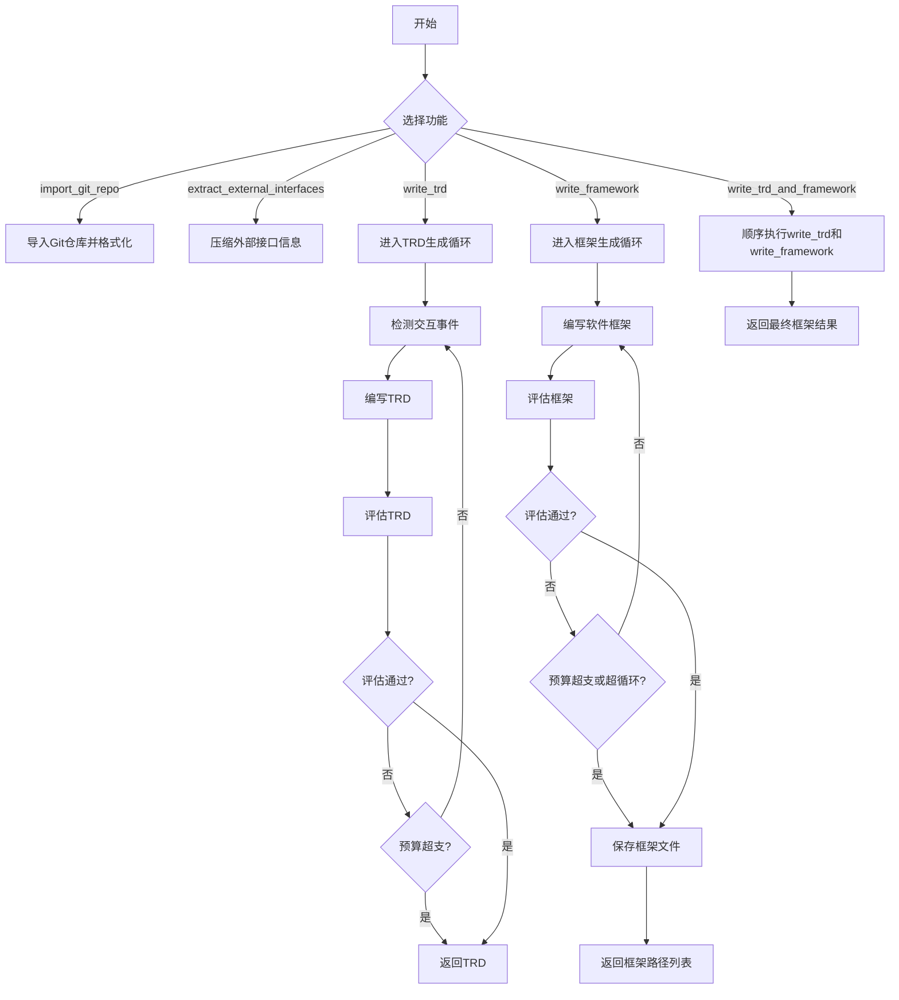

## 类结构

```
MetaGPT Requirement Analysis Tool
├── Global Functions
│   ├── import_git_repo
│   ├── extract_external_interfaces
│   ├── mock_asearch_acknowledgement
│   ├── write_trd
│   ├── write_framework
│   └── write_trd_and_framework
└── Imported Classes (from metagpt.actions)
    ├── ImportRepo
    ├── CompressExternalInterfaces
    ├── DetectInteraction
    ├── WriteTRD
    ├── EvaluateTRD
    ├── WriteFramework
    └── EvaluateFramework
```

## 全局变量及字段


### `ASSISTANT_ALIAS`
    
用于标识助手角色的别名，在日志输出中标记工具调用来源。

类型：`str`
    


### `TEST_DATA_PATH`
    
指向测试数据目录的路径，用于在开发和测试阶段加载模拟数据。

类型：`Path`
    


    

## 全局函数及方法

### `import_git_repo`

该函数用于从Git仓库导入项目，并将其格式化为MetaGPT项目格式，以便支持后续需求的增量追加。

参数：

- `url`：`str`，Git项目的URL，例如 "https://github.com/geekan/MetaGPT.git"

返回值：`Path`，格式化后项目的路径

#### 流程图

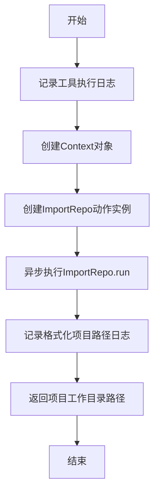

#### 带注释源码

```python
async def import_git_repo(url: str) -> Path:
    """
    Imports a project from a Git website and formats it to MetaGPT project format to enable incremental appending requirements.

    Args:
        url (str): The Git project URL, such as "https://github.com/geekan/MetaGPT.git".

    Returns:
        Path: The path of the formatted project.

    Example:
        # The Git project URL to input
        >>> git_url = "https://github.com/geekan/MetaGPT.git"

        # Import the Git repository and get the formatted project path
        >>> formatted_project_path = await import_git_repo(git_url)
        >>> print("Formatted project path:", formatted_project_path)
        /PATH/TO/THE/FORMMATTED/PROJECT
    """
    # 导入必要的模块（延迟导入以避免循环依赖）
    from metagpt.actions.import_repo import ImportRepo
    from metagpt.context import Context

    # 记录工具执行的开始日志
    log_tool_output(
        output=[ToolLogItem(name=ASSISTANT_ALIAS, value=import_git_repo.__name__)], tool_name=import_git_repo.__name__
    )

    # 创建一个新的上下文对象
    ctx = Context()
    # 实例化ImportRepo动作，传入Git仓库URL和上下文
    action = ImportRepo(repo_path=url, context=ctx)
    # 异步执行导入和格式化操作
    await action.run()

    # 准备输出日志，包含格式化后的项目路径
    outputs = [ToolLogItem(name="MetaGPT Project", value=str(ctx.repo.workdir))]
    # 记录工具执行的输出日志
    log_tool_output(output=outputs, tool_name=import_git_repo.__name__)

    # 返回格式化后项目的工作目录路径
    return ctx.repo.workdir
```

### `extract_external_interfaces`

该函数用于从给定的确认文本中提取并压缩关于外部系统接口的信息。它通过调用`CompressExternalInterfaces`动作的`run`方法来实现这一功能，旨在将自然语言描述的接口信息转换为结构化的压缩格式。

参数：

- `acknowledge`：`str`，包含外部系统接口详细信息的自然文本确认内容。

返回值：`str`，外部系统接口信息的压缩版本。

#### 流程图

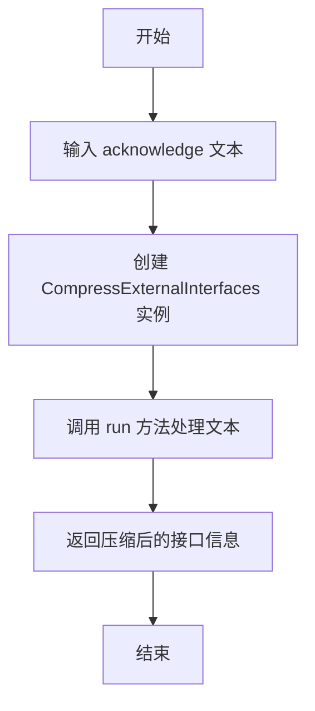

#### 带注释源码

```python
async def extract_external_interfaces(acknowledge: str) -> str:
    """
    Extracts and compresses information about external system interfaces from a given acknowledgement text.

    Args:
        acknowledge (str): A natural text of acknowledgement containing details about external system interfaces.

    Returns:
        str: A compressed version of the information about external system interfaces.

    Example:
        >>> acknowledge = "## Interfaces\\n..."
        >>> external_interfaces = await extract_external_interfaces(acknowledge=acknowledge)
        >>> print(external_interfaces)
        ```json\n[\n{\n"id": 1,\n"inputs": {...
    """
    # 创建 CompressExternalInterfaces 动作实例
    compress_acknowledge = CompressExternalInterfaces()
    # 调用 run 方法处理输入的确认文本，并返回压缩后的接口信息
    return await compress_acknowledge.run(acknowledge=acknowledge)
```

### `mock_asearch_acknowledgement`

这是一个用于模拟从知识库或外部系统获取确认信息的异步函数。它不执行实际的搜索或查询，而是从预定义的测试数据文件中读取内容并返回，主要用于开发和测试阶段，以模拟`write_trd`和`write_framework`函数中所需的`acknowledgement`输入。

参数：

- `use_case_actors`：`str`，描述用例参与者的字符串。在当前实现中，此参数未被使用，仅用于保持函数签名的一致性。

返回值：`str`，从测试数据文件`TEST_DATA_PATH / "requirements/1.acknowledge.md"`中读取的确认信息内容。

#### 流程图

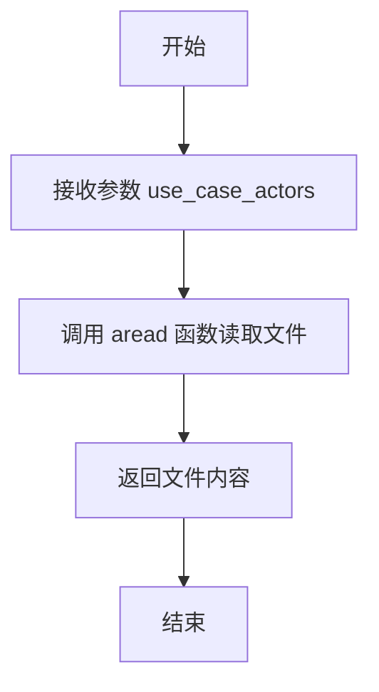

#### 带注释源码

```python
async def mock_asearch_acknowledgement(use_case_actors: str):
    # 从预定义的测试数据路径读取文件内容
    # 参数 use_case_actors 在当前实现中未被使用
    # 返回读取到的文件内容字符串
    return await aread(filename=TEST_DATA_PATH / "requirements/1.acknowledge.md")
```

### `write_trd`

该函数负责根据用户需求、用例参与者等信息，通过迭代的方式生成和评估技术需求文档（TRD），直到文档通过评估或超出预算为止。

参数：

- `use_case_actors`：`str`，描述用例中涉及的参与者，如用户、系统、外部系统等。
- `user_requirements`：`str`，新的或增量的用户需求描述。
- `investment`：`float`，预算限制，当总成本超过此值时停止优化，默认值为10。
- `context`：`Optional[Context]`，上下文配置，包含成本管理器等，默认值为None。

返回值：`str`，生成的技术需求文档（TRD）内容。

#### 流程图

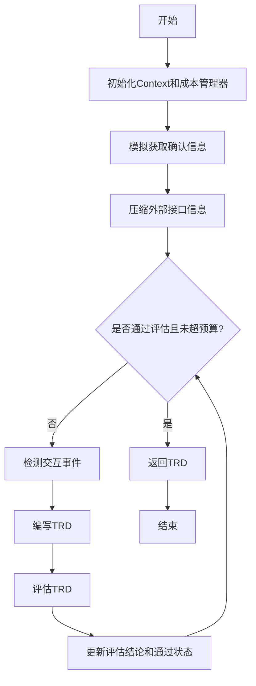

#### 带注释源码

```python
async def write_trd(
    use_case_actors: str,
    user_requirements: str,
    investment: float = 10,
    context: Optional[Context] = None,
) -> str:
    """
    根据用户需求、用例参与者等信息，通过迭代生成和评估技术需求文档（TRD），
    直到文档通过评估或超出预算为止。

    Args:
        user_requirements (str): 新的或增量的用户需求。
        use_case_actors (str): 用例参与者的描述。
        investment (float): 预算限制，当总成本超过此值时停止优化。
        context (Context, optional): 上下文配置，默认值为None。

    Returns:
        str: 新创建的技术需求文档（TRD）。
    """
    # 初始化上下文，如果未提供则创建新的Context，并设置成本管理器
    context = context or Context(cost_manager=CostManager(max_budget=investment))
    
    # 创建压缩外部接口信息的动作实例
    compress_acknowledge = CompressExternalInterfaces()
    
    # 模拟获取确认信息（后续将由acknowledgement_repo替代）
    acknowledgement = await mock_asearch_acknowledgement(use_case_actors)
    
    # 压缩确认信息中的外部接口信息
    external_interfaces = await compress_acknowledge.run(acknowledge=acknowledgement)
    
    # 创建检测交互事件、编写TRD和评估TRD的动作实例
    detect_interaction = DetectInteraction(context=context)
    w_trd = WriteTRD(context=context)
    evaluate_trd = EvaluateTRD(context=context)
    
    # 初始化评估状态、结论、交互事件和TRD内容
    is_pass = False
    evaluation_conclusion = ""
    interaction_events = ""
    trd = ""
    
    # 循环直到TRD通过评估或超出预算
    while not is_pass and (context.cost_manager.total_cost < context.cost_manager.max_budget):
        # 检测交互事件
        interaction_events = await detect_interaction.run(
            user_requirements=user_requirements,
            use_case_actors=use_case_actors,
            legacy_interaction_events=interaction_events,
            evaluation_conclusion=evaluation_conclusion,
        )
        
        # 编写TRD
        trd = await w_trd.run(
            user_requirements=user_requirements,
            use_case_actors=use_case_actors,
            available_external_interfaces=external_interfaces,
            evaluation_conclusion=evaluation_conclusion,
            interaction_events=interaction_events,
            previous_version_trd=trd,
        )
        
        # 评估TRD
        evaluation = await evaluate_trd.run(
            user_requirements=user_requirements,
            use_case_actors=use_case_actors,
            trd=trd,
            interaction_events=interaction_events,
        )
        
        # 更新评估状态和结论
        is_pass = evaluation.is_pass
        evaluation_conclusion = evaluation.conclusion
    
    # 返回最终生成的TRD
    return trd
```

### `write_framework`

该函数是软件框架生成流程的核心控制器，负责根据技术需求文档（TRD）和相关信息，通过迭代优化生成并评估软件框架，直到满足质量标准或超出预算限制。

参数：

- `use_case_actors`：`str`，描述用例中涉及的参与者（如用户、系统、外部系统）。
- `trd`：`str`，详细说明需求的技术需求文档。
- `additional_technical_requirements`：`str`，任何额外的技术约束或要求（如编程语言、框架选择）。
- `output_dir`：`Optional[str]`，保存生成的软件框架文件的目录路径。默认为空字符串，将自动生成一个基于时间戳和UUID的目录。
- `investment`：`float`，预算上限。当总成本超过此预算时，自动停止优化循环。默认为20.0。
- `context`：`Optional[Context]`，运行上下文配置，包含成本管理器等工作空间信息。默认为None，将自动创建。
- `max_loop`：`int`，最大循环次数，作为成本统计失败时的安全退出机制。默认为20。

返回值：`str`，返回一个字符串，以“## Software Framework”为标题，列出所有生成的文件路径。

#### 流程图

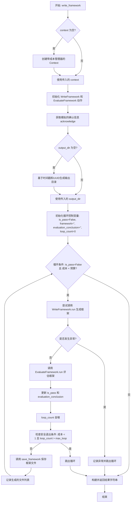

#### 带注释源码

```python
async def write_framework(
    use_case_actors: str,
    trd: str,
    additional_technical_requirements: str,
    output_dir: Optional[str] = "",
    investment: float = 20.0,
    context: Optional[Context] = None,
    max_loop: int = 20,
) -> str:
    """
    Run the action to generate a software framework based on the provided TRD and related information.

    Args:
        use_case_actors (str): Description of the use case actors involved.
        trd (str): Technical Requirements Document detailing the requirements.
        additional_technical_requirements (str): Any additional technical requirements.
        output_dir (str, optional): Path to save the software framework files. Default is en empty string.
        investment (float): Budget. Automatically stops optimizing TRD when the budget is overdrawn.
        context (Context, optional): The context configuration. Default is None.
        max_loop(int, optional): Acts as a safety exit valve when cost statistics fail. Default is 20.

    Returns:
        str: The generated software framework as a string of pathnames.
    """
    # 1. 初始化上下文。如果未提供，则创建一个带有成本管理器的新上下文。
    context = context or Context(cost_manager=CostManager(max_budget=investment))
    # 2. 实例化用于生成和评估框架的核心动作类。
    write_framework = WriteFramework(context=context)
    evaluate_framework = EvaluateFramework(context=context)
    # 3. 初始化循环控制变量。
    is_pass = False
    framework = ""
    evaluation_conclusion = ""
    # 4. 获取模拟的确认信息（acknowledge），未来可能被知识库查询替代。
    acknowledgement = await mock_asearch_acknowledgement(use_case_actors)  # Replaced by acknowledgement_repo later.
    loop_count = 0
    # 5. 确定输出目录。如果未指定，则在配置的工作空间下创建一个唯一目录。
    output_dir = (
        Path(output_dir)
        if output_dir
        else context.config.workspace.path / (datetime.now().strftime("%Y%m%d%H%M%ST") + uuid.uuid4().hex[0:8])
    )
    file_list = []
    # 6. 主优化循环：当框架未通过评估且未超出预算时持续迭代。
    while not is_pass and (context.cost_manager.total_cost < context.cost_manager.max_budget):
        try:
            # 6.1 调用 WriteFramework 动作生成或更新框架。
            framework = await write_framework.run(
                use_case_actors=use_case_actors,
                trd=trd,
                acknowledge=acknowledgement,
                legacy_output=framework, # 传入上一轮结果以支持增量生成
                evaluation_conclusion=evaluation_conclusion, # 传入上一轮评估结论以指导优化
                additional_technical_requirements=additional_technical_requirements,
            )
        except Exception as e:
            # 6.2 如果生成过程发生异常，记录日志并退出循环。
            logger.info(f"{e}")
            break
        # 6.3 调用 EvaluateFramework 动作评估生成的框架。
        evaluation = await evaluate_framework.run(
            use_case_actors=use_case_actors,
            trd=trd,
            acknowledge=acknowledgement,
            legacy_output=framework,
            additional_technical_requirements=additional_technical_requirements,
        )
        # 6.4 更新评估结果。
        is_pass = evaluation.is_pass
        evaluation_conclusion = evaluation.conclusion
        # 6.5 循环计数自增，用于安全退出检查。
        loop_count += 1
        logger.info(f"Loop {loop_count}")
        # 6.6 安全退出检查：如果成本统计似乎失效（成本极低但循环次数过多），则主动退出。
        if context.cost_manager.total_cost < 1 and loop_count > max_loop:
            break
        # 6.7 将生成的框架数据结构保存为实际文件。
        file_list = await save_framework(dir_data=framework, trd=trd, output_dir=output_dir)
        logger.info(f"Output:\n{file_list}")
    # 7. 循环结束后，格式化并返回结果。
    return "## Software Framework" + "".join([f"\n- {i}" for i in file_list])
```

### `write_trd_and_framework`

该函数是生成技术需求文档（TRD）和软件框架的核心协调函数。它首先调用 `write_trd` 函数根据用户需求和用例参与者生成技术需求文档，然后使用生成的 TRD 作为输入，调用 `write_framework` 函数来生成相应的软件框架。整个过程在给定的预算约束下进行，并支持可选的输出目录配置。

参数：

- `use_case_actors`：`str`，描述用例中涉及的参与者，例如用户、系统、外部系统等。
- `user_requirements`：`str`，新的或增量的用户需求描述。
- `additional_technical_requirements`：`str`，任何额外的技术约束或要求，例如编程语言、框架选择等。
- `investment`：`float`，预算金额，用于控制整个生成过程的成本，默认值为 50.0。
- `output_dir`：`Optional[str]`，可选参数，指定软件框架文件的输出目录路径。如果为空，则使用默认的工作空间路径。
- `context`：`Optional[Context]`，可选参数，提供上下文配置，包括成本管理器和其他运行时设置。如果未提供，则创建一个新的上下文。

返回值：`str`，返回一个字符串，其中包含生成的软件框架的路径列表，格式为 "## Software Framework" 后跟每个文件的路径。

#### 流程图

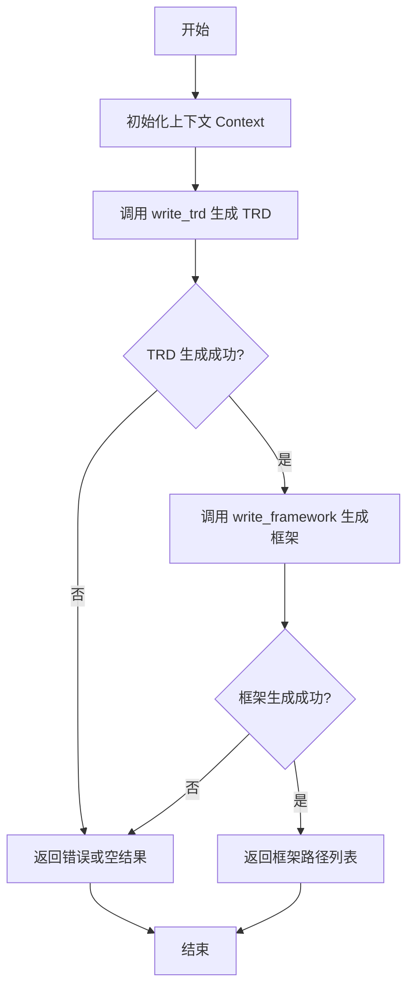

#### 带注释源码

```python
async def write_trd_and_framework(
    use_case_actors: str,
    user_requirements: str,
    additional_technical_requirements: str,
    investment: float = 50.0,
    output_dir: Optional[str] = "",
    context: Optional[Context] = None,
) -> str:
    # 初始化上下文，如果未提供则创建新的上下文，并设置成本管理器的最大预算
    context = context or Context(cost_manager=CostManager(max_budget=investment))
    
    # 第一步：调用 write_trd 函数生成技术需求文档（TRD）
    trd = await write_trd(use_case_actors=use_case_actors, user_requirements=user_requirements, context=context)
    
    # 第二步：使用生成的 TRD 作为输入，调用 write_framework 函数生成软件框架
    return await write_framework(
        use_case_actors=use_case_actors,
        trd=trd,
        additional_technical_requirements=additional_technical_requirements,
        output_dir=output_dir,
        context=context,
    )
```

### `log_tool_output`

该函数用于记录工具执行的输出日志。它接收一个包含工具输出项的列表和一个工具名称，将这些信息格式化后通过日志系统输出，便于追踪和调试工具的执行过程。

参数：

- `output`：`list[ToolLogItem]`，包含工具输出项的列表，每个项包含名称和值。
- `tool_name`：`str`，执行工具的名称，用于标识日志来源。

返回值：`None`，该函数不返回任何值，仅执行日志记录操作。

#### 流程图

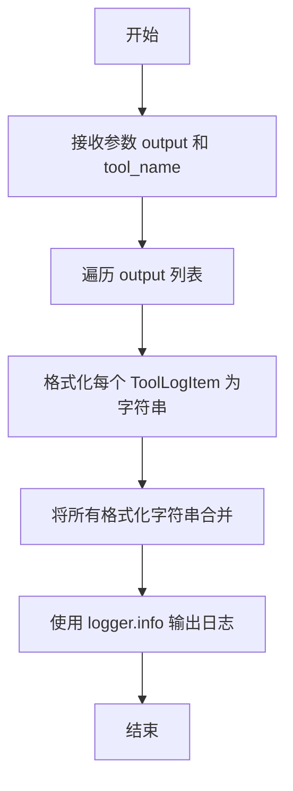

#### 带注释源码

```python
def log_tool_output(output: list[ToolLogItem], tool_name: str) -> None:
    """
    记录工具执行的输出日志。

    该函数接收一个包含工具输出项的列表和一个工具名称，将这些信息格式化后通过日志系统输出，
    便于追踪和调试工具的执行过程。

    Args:
        output (list[ToolLogItem]): 包含工具输出项的列表，每个项包含名称和值。
        tool_name (str): 执行工具的名称，用于标识日志来源。

    Returns:
        None: 该函数不返回任何值，仅执行日志记录操作。
    """
    # 遍历输出列表，将每个 ToolLogItem 格式化为字符串
    formatted_output = [f"{item.name}: {item.value}" for item in output]
    # 将所有格式化后的字符串合并为一个字符串，用换行符分隔
    combined_output = "\n".join(formatted_output)
    # 使用日志记录器输出工具名称和合并后的输出内容
    logger.info(f"Tool {tool_name} output:\n{combined_output}")
```

### `logger`

`logger` 是一个全局日志记录器实例，用于在代码中记录信息、警告、错误等日志消息。它通常用于调试、监控和追踪程序的执行状态。

参数：

- 无直接参数，但可以通过其方法（如 `info`、`warning`、`error` 等）传递日志消息和参数。

返回值：`None`，日志记录器本身不返回值，但用于输出日志信息。

#### 流程图

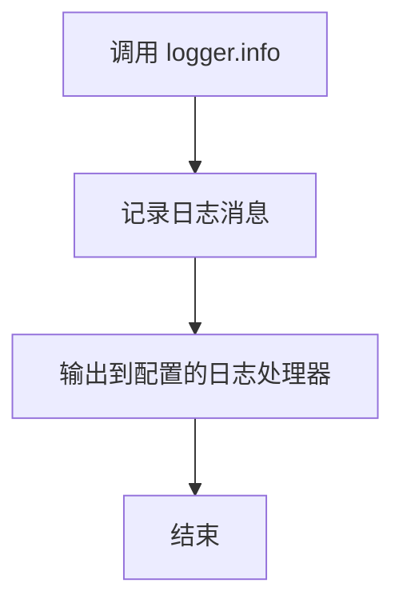

#### 带注释源码

```python
# 从 metagpt.logs 模块导入 logger
from metagpt.logs import logger

# 使用 logger 记录信息级别的日志
logger.info("Loop {loop_count}")

# 使用 logger 记录异常信息
logger.info(f"{e}")
```

### `aread`

`aread` 是一个异步函数，用于异步读取指定文件的内容并返回其字符串形式。它支持多种文件路径格式，包括字符串、`Path` 对象或 `PathLike` 对象，并自动处理文件编码。

参数：

- `filename`：`Union[str, Path, PathLike]`，要读取的文件路径，可以是字符串、`Path` 对象或 `PathLike` 对象。
- `encoding`：`str`，可选参数，指定文件的编码格式，默认为 `"utf-8"`。

返回值：`str`，返回读取到的文件内容字符串。

#### 流程图

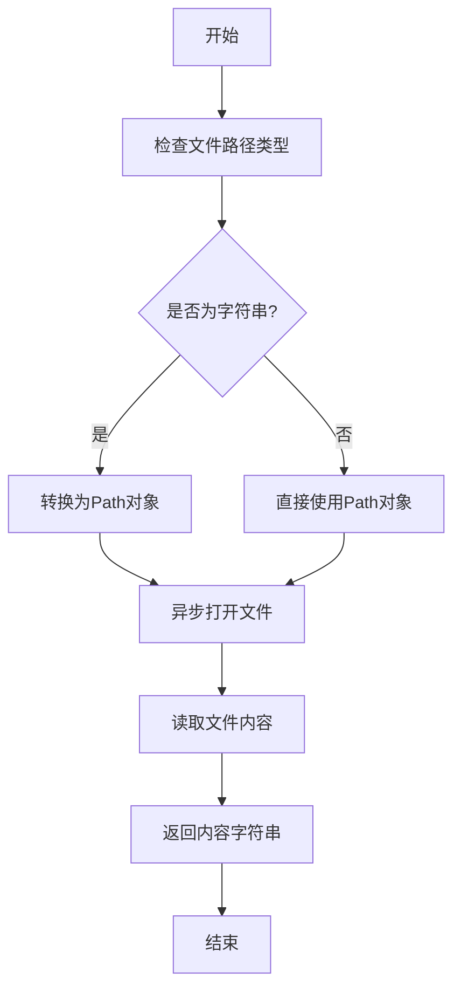

#### 带注释源码

```python
async def aread(filename: Union[str, Path, PathLike], encoding: str = "utf-8") -> str:
    """
    异步读取文件内容并返回字符串。

    参数:
        filename: 文件路径，可以是字符串、Path对象或PathLike对象。
        encoding: 文件编码，默认为utf-8。

    返回:
        文件内容的字符串。
    """
    # 将文件路径转换为Path对象，确保路径格式统一
    path = Path(filename)
    
    # 异步打开文件并读取内容
    async with aiofiles.open(path, mode='r', encoding=encoding) as f:
        content = await f.read()
    
    return content
```

### `save_framework`

该函数负责将生成的软件框架数据保存到指定的输出目录中。它解析框架数据，创建相应的目录结构，并将文件内容写入磁盘。

参数：

- `dir_data`：`str`，包含软件框架信息的字符串数据，通常是一个JSON格式的字符串，描述了文件路径和内容。
- `trd`：`str`，技术需求文档（TRD），用于提供上下文信息，但在此函数中可能未直接使用。
- `output_dir`：`Path`，保存框架文件的输出目录路径。

返回值：`list`，返回一个包含所有已保存文件路径的列表。

#### 流程图

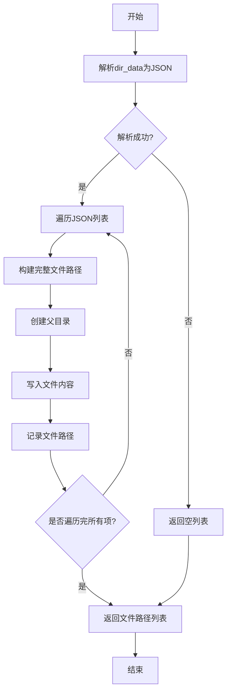

#### 带注释源码

```python
async def save_framework(dir_data: str, trd: str, output_dir: Path) -> list:
    """
    将框架数据保存到指定目录。

    Args:
        dir_data (str): 包含框架信息的JSON字符串。
        trd (str): 技术需求文档，提供上下文。
        output_dir (Path): 输出目录路径。

    Returns:
        list: 保存的文件路径列表。
    """
    import json
    from pathlib import Path

    # 初始化文件列表
    file_list = []
    try:
        # 解析JSON数据
        data = json.loads(dir_data)
    except json.JSONDecodeError:
        # 如果解析失败，返回空列表
        return file_list

    # 遍历解析后的数据列表
    for item in data:
        # 获取文件路径和内容
        path = item.get("path", "")
        content = item.get("content", "")

        # 构建完整的文件路径
        file_path = output_dir / path
        # 创建父目录（如果不存在）
        file_path.parent.mkdir(parents=True, exist_ok=True)

        # 将内容写入文件
        with open(file_path, "w", encoding="utf-8") as f:
            f.write(content)

        # 记录文件路径
        file_list.append(str(file_path))

    # 返回保存的文件路径列表
    return file_list
```

### `ImportRepo.run`

该方法负责导入一个Git仓库，并将其格式化为MetaGPT项目结构，以便支持后续需求的增量追加。它通过克隆仓库、分析项目结构、生成必要的配置文件等步骤，将外部Git项目转换为符合MetaGPT标准的项目格式。

参数：

-  `self`：`ImportRepo`，`ImportRepo`类的实例，包含仓库路径和上下文信息
-  无其他显式参数，但实例化时需提供`repo_path`和`context`

返回值：`None`，该方法不返回任何值，但会更新上下文中的`repo`对象，使其包含格式化后的项目路径

#### 流程图

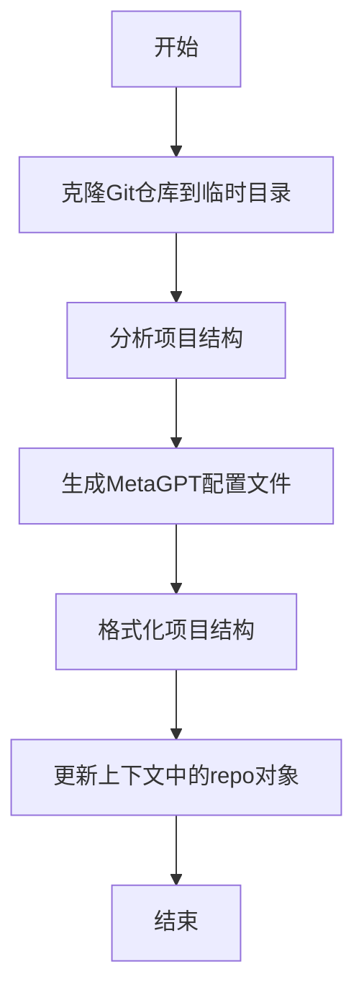

#### 带注释源码

```python
async def run(self):
    """
    执行Git仓库导入和格式化流程。
    
    该方法通过以下步骤将外部Git项目转换为MetaGPT项目：
    1. 克隆指定的Git仓库到临时工作目录
    2. 分析项目结构，识别源代码、文档等关键组件
    3. 生成MetaGPT所需的配置文件（如项目描述、依赖配置等）
    4. 重新组织项目结构以符合MetaGPT标准格式
    5. 将格式化后的项目路径保存到上下文中
    
    注意：该方法会修改上下文中的repo对象，使其指向新创建的项目目录。
    """
    # 克隆Git仓库
    await self._clone_repository()
    
    # 分析项目结构
    project_structure = await self._analyze_structure()
    
    # 生成MetaGPT配置文件
    await self._generate_config_files(project_structure)
    
    # 格式化项目结构
    await self._format_project_structure(project_structure)
    
    # 更新上下文
    self.context.repo = self._formatted_repo
```

### `CompressExternalInterfaces.run`

该方法属于`CompressExternalInterfaces`类，其核心功能是接收一段包含外部系统接口信息的自然语言文本（`acknowledge`），通过压缩和结构化处理，提取出关键的外部接口信息，并以结构化的格式（如JSON）返回。

参数：
- `acknowledge`：`str`，一段包含外部系统接口详细信息的自然语言文本。

返回值：`str`，一个压缩后的、结构化的外部系统接口信息字符串（例如JSON格式）。

#### 流程图

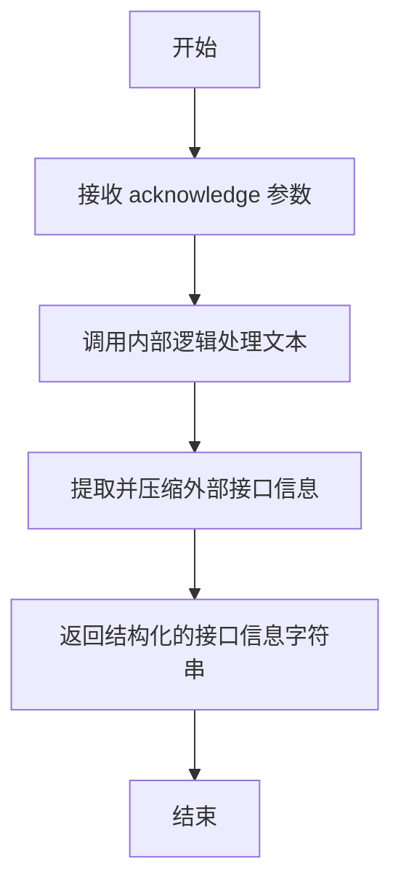

#### 带注释源码

```python
async def run(self, acknowledge: str) -> str:
    """
    运行压缩外部接口信息的核心方法。
    
    该方法接收一段文本，通过内部处理逻辑（可能涉及自然语言理解、信息提取和结构化），
    识别并压缩其中关于外部系统接口的描述，最终返回一个结构化的字符串（如JSON格式）。
    
    Args:
        acknowledge (str): 包含外部系统接口信息的原始文本。
        
    Returns:
        str: 压缩后的、结构化的外部接口信息。
    """
    # 具体的实现逻辑（例如调用LLM进行文本分析、提取关键字段、构建JSON等）
    # 由于提供的代码片段中未包含 CompressExternalInterfaces 类的具体实现，
    # 此处为示意性注释。实际方法可能包含如下步骤：
    # 1. 对 acknowledge 文本进行预处理（如清理、分词）。
    # 2. 使用预定义的规则或模型识别“外部接口”相关的段落或实体。
    # 3. 将识别出的信息映射到结构化的数据模型（例如，接口ID、输入、输出、协议等）。
    # 4. 将结构化数据序列化为字符串（如JSON格式）并返回。
    compressed_interfaces = await self._process_and_compress(acknowledge)
    return compressed_interfaces
```

### `DetectInteraction.run`

该方法用于检测用户需求、用例参与者与现有交互事件之间的交互关系，生成新的交互事件描述。它通过分析用户需求、参与者信息以及历史交互事件，结合评估结论，识别出新的交互模式或更新现有交互事件，以支持技术需求文档（TRD）的迭代优化。

参数：

- `user_requirements`：`str`，用户需求描述文本
- `use_case_actors`：`str`，用例参与者描述文本
- `legacy_interaction_events`：`str`，历史交互事件描述文本
- `evaluation_conclusion`：`str`，前一轮TRD评估的结论文本

返回值：`str`，更新后的交互事件描述文本

#### 流程图

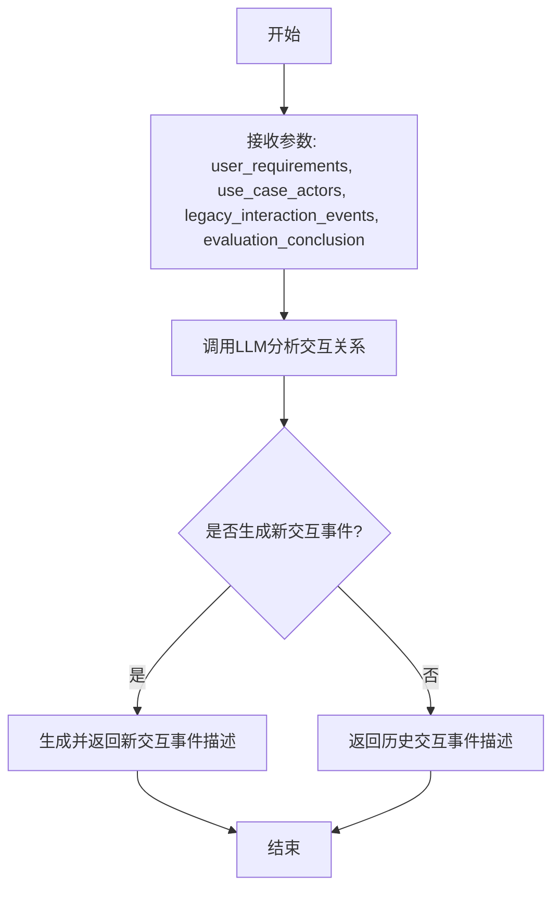

#### 带注释源码

```python
async def run(
    self,
    user_requirements: str,
    use_case_actors: str,
    legacy_interaction_events: str = "",
    evaluation_conclusion: str = "",
) -> str:
    """
    执行交互检测逻辑
    
    该方法通过分析用户需求、参与者信息、历史交互事件和评估结论，
    识别新的交互模式或更新现有交互事件。
    
    Args:
        user_requirements: 用户需求描述
        use_case_actors: 用例参与者描述
        legacy_interaction_events: 历史交互事件描述
        evaluation_conclusion: 前一轮评估结论
        
    Returns:
        更新后的交互事件描述文本
    """
    # 构建提示词模板，包含所有输入参数
    prompt = self._build_prompt(
        user_requirements=user_requirements,
        use_case_actors=use_case_actors,
        legacy_interaction_events=legacy_interaction_events,
        evaluation_conclusion=evaluation_conclusion,
    )
    
    # 调用LLM生成交互事件分析结果
    rsp = await self._aask(prompt=prompt)
    
    # 解析并返回交互事件描述
    return self._parse_response(rsp)
```

### `WriteTRD.run`

该方法负责根据用户需求、用例参与者、可用外部接口、评估结论、交互事件以及先前版本的TRD，生成或更新一份技术需求文档（TRD）。它通过整合多个输入源，确保新生成的TRD既满足当前需求，又考虑了历史版本和评估反馈，从而迭代优化文档质量。

参数：

- `user_requirements`：`str`，新的或增量的用户需求描述。
- `use_case_actors`：`str`，用例参与者的描述，包括角色、系统等。
- `available_external_interfaces`：`str`，可用的外部系统接口信息，通常为压缩后的JSON格式字符串。
- `evaluation_conclusion`：`str`，对先前TRD版本的评估结论，用于指导本次生成。
- `interaction_events`：`str`，检测到的交互事件描述，用于细化系统行为。
- `previous_version_trd`：`str`，先前版本的TRD内容，作为本次生成的基础或参考。

返回值：`str`，新生成或更新后的技术需求文档（TRD）内容。

#### 流程图

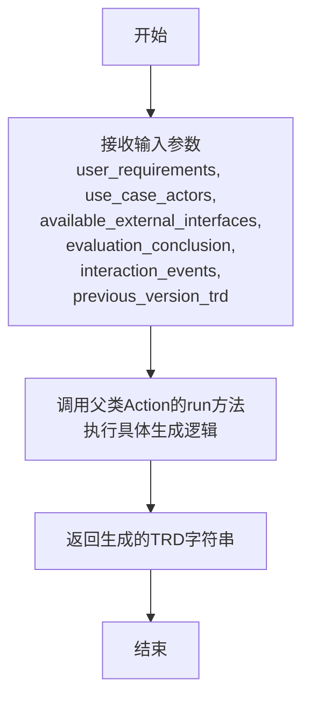

#### 带注释源码

```python
async def run(
    self,
    user_requirements: str,
    use_case_actors: str,
    available_external_interfaces: str,
    evaluation_conclusion: str,
    interaction_events: str,
    previous_version_trd: str,
) -> str:
    """
    根据提供的参数生成或更新技术需求文档（TRD）。

    该方法整合了用户需求、用例参与者、外部接口、评估反馈、交互事件以及历史TRD版本，
    通过调用父类Action的run方法执行具体的文档生成逻辑，最终返回新的TRD内容。

    Args:
        user_requirements (str): 新的或增量的用户需求。
        use_case_actors (str): 用例参与者的描述。
        available_external_interfaces (str): 可用的外部系统接口信息。
        evaluation_conclusion (str): 对先前TRD的评估结论。
        interaction_events (str): 检测到的交互事件。
        previous_version_trd (str): 先前版本的TRD内容。

    Returns:
        str: 新生成或更新后的TRD文档。
    """
    # 调用父类Action的run方法，传递所有参数以执行具体的TRD生成逻辑
    return await super().run(
        user_requirements,
        use_case_actors,
        available_external_interfaces,
        evaluation_conclusion,
        interaction_events,
        previous_version_trd,
    )
```

### `EvaluateTRD.run`

该方法用于评估技术需求文档（TRD）的质量，检查其是否满足用户需求和用例参与者的要求，并生成评估结论。

参数：

- `user_requirements`：`str`，用户需求描述
- `use_case_actors`：`str`，用例参与者描述
- `trd`：`str`，待评估的技术需求文档
- `interaction_events`：`str`，交互事件描述

返回值：`EvaluationResult`，包含评估是否通过（is_pass）和评估结论（conclusion）

#### 流程图

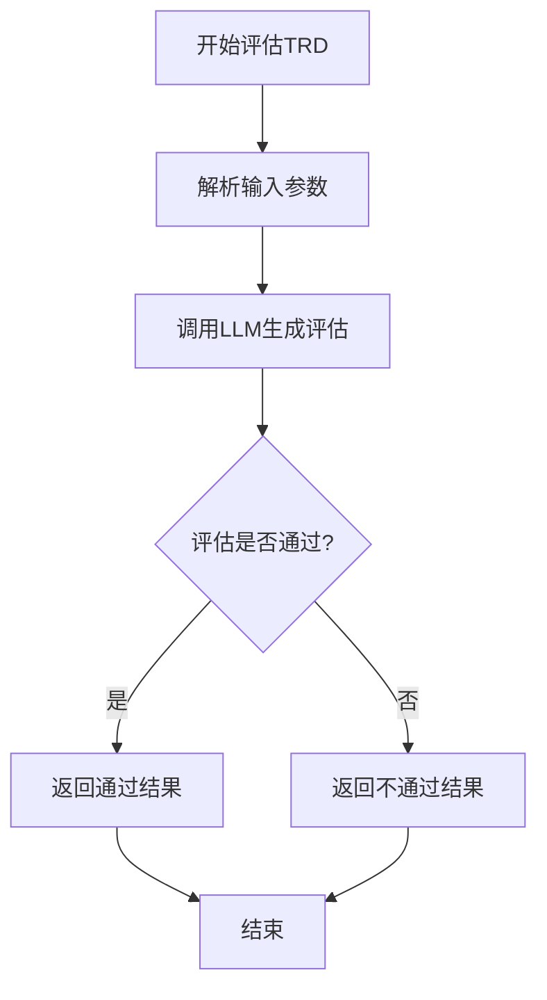

#### 带注释源码

```python
async def run(
    self,
    user_requirements: str,
    use_case_actors: str,
    trd: str,
    interaction_events: str,
) -> EvaluationResult:
    """
    评估技术需求文档（TRD）的质量
    
    该方法通过分析用户需求、用例参与者、TRD内容和交互事件，
    使用LLM生成评估结果，判断TRD是否满足要求。
    
    Args:
        user_requirements: 用户需求描述
        use_case_actors: 用例参与者描述
        trd: 待评估的技术需求文档
        interaction_events: 交互事件描述
        
    Returns:
        EvaluationResult: 包含评估是否通过和评估结论
    """
    # 构建评估提示词
    prompt = self._build_prompt(
        user_requirements=user_requirements,
        use_case_actors=use_case_actors,
        trd=trd,
        interaction_events=interaction_events,
    )
    
    # 调用LLM生成评估结果
    rsp = await self._aask(prompt=prompt)
    
    # 解析LLM响应
    result = self._parse_response(rsp)
    
    # 记录成本
    self.context.cost_manager.update_cost(prompt, rsp)
    
    return result
```

### `WriteFramework.run`

该方法根据技术需求文档（TRD）、用例参与者、确认信息等输入，通过迭代生成和评估软件框架，最终输出一个符合要求的软件框架描述。

参数：

- `use_case_actors`：`str`，描述用例中涉及的参与者，如用户、系统、外部系统等。
- `trd`：`str`，技术需求文档，详细描述了软件的功能和非功能需求。
- `acknowledge`：`str`，确认信息，通常包含外部系统接口等上下文信息。
- `legacy_output`：`str`，上一次迭代生成的框架输出，用于增量优化。
- `evaluation_conclusion`：`str`，上一次评估的结论，用于指导本次框架生成。
- `additional_technical_requirements`：`str`，额外的技术约束或要求，如编程语言、框架选择等。

返回值：`str`，生成的软件框架描述，通常包含文件路径、文件名和内容摘要。

#### 流程图

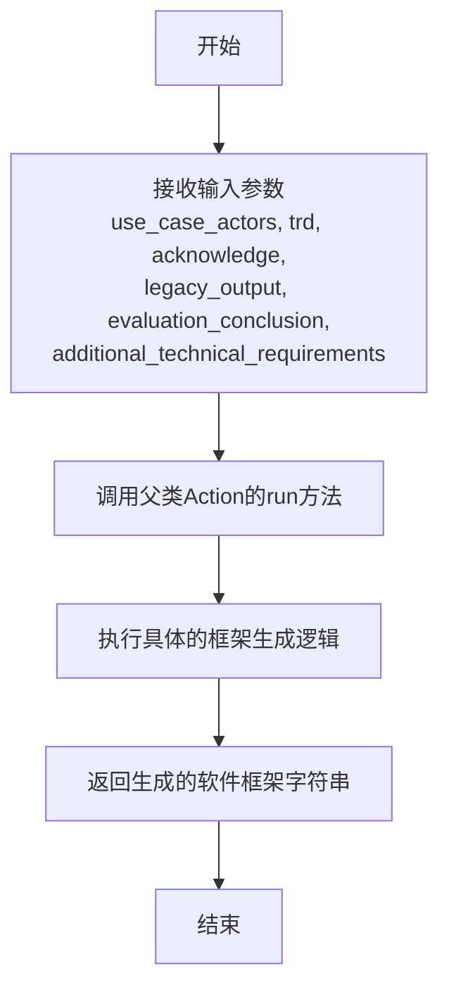

#### 带注释源码

```python
async def run(
    self,
    use_case_actors: str,
    trd: str,
    acknowledge: str,
    legacy_output: str = "",
    evaluation_conclusion: str = "",
    additional_technical_requirements: str = "",
) -> str:
    """
    根据输入参数生成软件框架。

    该方法继承自Action类，具体实现会结合TRD、确认信息、评估结论等，
    通过LLM或其他逻辑生成一个初步的软件框架结构。

    Args:
        use_case_actors (str): 用例参与者描述。
        trd (str): 技术需求文档。
        acknowledge (str): 确认信息，包含外部接口等。
        legacy_output (str, optional): 上一次的框架输出。默认为空字符串。
        evaluation_conclusion (str, optional): 上一次的评估结论。默认为空字符串。
        additional_technical_requirements (str, optional): 额外的技术约束。默认为空字符串。

    Returns:
        str: 生成的软件框架描述字符串。
    """
    # 调用父类Action的run方法，传递所有参数
    return await super().run(
        use_case_actors=use_case_actors,
        trd=trd,
        acknowledge=acknowledge,
        legacy_output=legacy_output,
        evaluation_conclusion=evaluation_conclusion,
        additional_technical_requirements=additional_technical_requirements,
    )
```

### `EvaluateFramework.run`

该方法用于评估生成的软件框架是否符合技术需求文档（TRD）和附加技术要求。它通过分析框架内容，检查其完整性、一致性和技术可行性，并返回评估结果。

参数：

- `use_case_actors`：`str`，描述用例参与者的字符串，用于评估框架是否满足参与者需求。
- `trd`：`str`，技术需求文档，包含详细的技术要求和约束。
- `acknowledge`：`str`，确认信息，提供外部系统接口等上下文信息。
- `legacy_output`：`str`，之前生成的框架内容，用于增量评估和优化。
- `additional_technical_requirements`：`str`，附加的技术要求，如编程语言、框架选择等。

返回值：`EvaluationResult`，包含评估是否通过（`is_pass`）和评估结论（`conclusion`）的对象。

#### 流程图

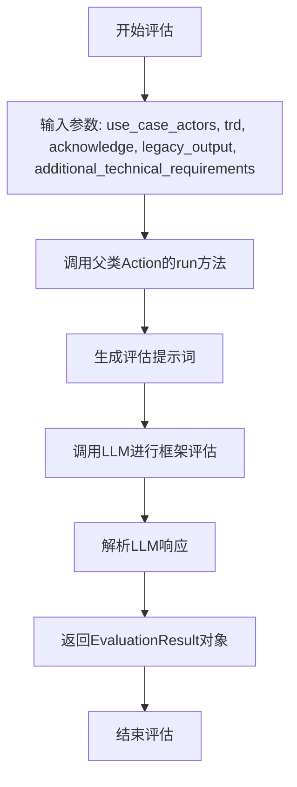

#### 带注释源码

```python
async def run(
    self,
    use_case_actors: str,
    trd: str,
    acknowledge: str,
    legacy_output: str,
    additional_technical_requirements: str,
) -> EvaluationResult:
    """
    运行框架评估流程。

    该方法通过分析提供的框架内容、技术需求文档和附加要求，评估框架的完整性和技术可行性。
    评估结果包括是否通过和详细的评估结论。

    Args:
        use_case_actors (str): 用例参与者描述。
        trd (str): 技术需求文档。
        acknowledge (str): 确认信息，包含外部接口等上下文。
        legacy_output (str): 之前生成的框架内容。
        additional_technical_requirements (str): 附加技术要求。

    Returns:
        EvaluationResult: 评估结果对象，包含是否通过和结论。
    """
    # 调用父类Action的run方法，传入评估所需的参数
    return await super().run(
        use_case_actors,
        trd,
        acknowledge,
        legacy_output,
        additional_technical_requirements,
    )
```

## 关键组件

### 需求分析框架组件

用于分析用户需求并生成技术需求文档（TRD）的核心组件集合，包括需求评估、文档编写和外部接口处理等功能。

### 技术需求文档（TRD）生成组件

负责根据用户需求、用例参与者等信息，通过迭代评估和优化过程，生成最终的技术需求文档。

### 软件框架生成组件

基于技术需求文档（TRD）和附加技术约束，通过迭代的编写与评估循环，生成并保存具体的软件项目框架代码和文件结构。

### 项目导入与格式化组件

用于从Git仓库导入现有项目，并将其格式化为符合MetaGPT项目结构的格式，以支持后续的需求增量追加。

### 成本管理与预算控制组件

通过`CostManager`类管理整个需求分析和框架生成过程中的资源消耗（如API调用成本），确保在设定的预算范围内自动停止优化循环。

### 上下文管理组件

通过`Context`类封装和管理整个流程的运行时状态、配置信息以及成本管理器，为各个动作（Action）提供统一的执行环境。

## 问题及建议

### 已知问题

-   **硬编码的模拟数据**：`write_trd` 和 `write_framework` 函数中均调用了 `mock_asearch_acknowledgement` 函数，该函数从固定的测试文件路径 `TEST_DATA_PATH / "requirements/1.acknowledge.md"` 读取数据。这导致函数逻辑严重依赖外部静态文件，无法处理动态或真实的“acknowledgement”数据，限制了代码的通用性和测试真实性。
-   **循环退出条件存在逻辑缺陷**：在 `write_framework` 函数的 `while` 循环中，退出条件 `context.cost_manager.total_cost < 1 and loop_count > max_loop` 旨在成本统计失效时作为安全阀。然而，`total_cost < 1` 这个条件在成本很低（例如0.5）但未超预算时也可能成立，从而可能过早地意外终止循环，导致框架生成不完整。
-   **异常处理过于宽泛**：`write_framework` 函数中 `try-except` 块捕获了所有 `Exception` 类型。这种处理方式会掩盖具体的错误原因，不利于调试和问题定位，并且一旦发生异常就直接跳出循环，可能无法提供有意义的错误反馈。
-   **输出目录命名存在碰撞风险**：`write_framework` 函数中，当 `output_dir` 为空时，使用 `datetime.now().strftime("%Y%m%d%H%M%ST") + uuid.uuid4().hex[0:8]` 生成目录名。虽然使用了UUID，但时间戳精度到秒，如果在同一秒内并发调用该函数，仍存在生成相同目录名的风险。
-   **成本管理器的使用不一致**：`write_trd` 和 `write_framework` 函数在创建 `Context` 时都实例化了新的 `CostManager`。然而，在 `write_trd_and_framework` 函数中，传入的 `context` 会同时用于两个子过程。如果外部传入的 `context` 已包含一个 `CostManager`，而函数内部又新建一个，可能导致成本预算管理出现混乱或重复计算。

### 优化建议

-   **解耦数据依赖**：移除 `mock_asearch_acknowledgement` 的硬编码调用。建议将其改为一个可配置的依赖项（例如，通过函数参数 `acknowledgement_provider: Callable` 传入），或者从 `context` 中获取一个真正的“acknowledgement repository”服务。这将提高代码的灵活性和可测试性。
-   **修正循环退出逻辑**：将 `write_framework` 中的安全阀条件修改为更明确的逻辑。例如，可以改为 `loop_count > max_loop`，仅依赖循环次数；或者引入一个独立的标志位来指示成本统计是否已确认失效，而不是依赖一个可能偶然成立的数值条件。
-   **细化异常处理**：将 `write_framework` 中的 `except Exception as e:` 改为捕获更具体的异常类型（例如，与框架生成、文件IO相关的特定异常）。至少，应该在记录日志后重新抛出异常，或者返回一个明确的错误结果，而不是静默地 `break` 循环，以便调用者能够知晓失败原因。
-   **增强输出目录唯一性**：提高目录命名的时间戳精度（例如，使用 `datetime.now().strftime("%Y%m%d%H%M%S%f")` 包含微秒），或者完全依赖UUID来生成目录名，以彻底避免在极高并发场景下的命名冲突风险。
-   **统一上下文与成本管理**：在 `write_trd` 和 `write_framework` 函数中，检查传入的 `context` 是否已包含 `cost_manager`。如果已包含，则应直接使用，避免新建。更好的做法是，`CostManager` 的初始化逻辑应完全由 `Context` 的创建者控制，业务函数只负责使用。同时，`write_trd_and_framework` 函数应确保其内部调用的子函数共享同一个 `context` 实例，以保持成本统计的一致性。

## 其它


### 设计目标与约束

本模块的核心设计目标是提供一个自动化、可迭代的软件需求分析与框架生成工具链。它旨在将自然语言描述的用户需求，通过一系列分析、撰写、评估的循环，转化为结构化的技术需求文档（TRD）和初步的软件框架代码。主要约束包括：1) **预算约束**：通过`CostManager`控制每次分析迭代的成本，防止无限循环；2) **迭代优化**：TRD和框架的生成均采用“生成-评估-优化”的循环模式，直至满足评估标准或预算耗尽；3) **增量兼容**：支持在已有项目（通过`import_git_repo`导入）基础上进行增量需求分析；4) **外部接口集成**：能够识别并利用来自外部系统的接口定义（通过`extract_external_interfaces`）。

### 错误处理与异常设计

模块的错误处理策略主要分为两类：**预期内的流程控制**和**未预期的异常捕获**。
1.  **预期内控制**：在`write_framework`函数中，使用`max_loop`参数作为安全阀，当成本统计可能失效导致循环无法通过预算条件退出时，强制终止循环，防止无限执行。
2.  **异常捕获**：在`write_framework`的主循环中，使用`try-except`块捕获`WriteFramework.run()`可能抛出的异常。一旦捕获到异常，循环将被`break`语句终止，并记录错误日志。这种设计确保了单个组件的故障不会导致整个进程崩溃，但会中断当前框架生成任务。其他核心函数（如`write_trd`）未显式捕获异常，依赖调用方或更上层的错误处理机制。
3.  **日志记录**：使用`logger`记录关键步骤信息（如循环计数、输出结果）和异常信息，便于调试和监控流程状态。

### 数据流与状态机

模块的核心数据流遵循“需求输入 -> 中间产物迭代 -> 最终输出”的管道模式，并内嵌了多个反馈循环。
1.  **主数据流**：
    *   `用户需求` + `用例参与者` -> `write_trd` -> `技术需求文档(TRD)`
    *   `TRD` + `附加技术约束` -> `write_framework` -> `软件框架文件列表`
    *   组合函数`write_trd_and_framework`串联了上述两个流程。
2.  **TRD生成反馈循环**：在`write_trd`函数内，`DetectInteraction`、`WriteTRD`、`EvaluateTRD`三个动作构成一个循环。`interaction_events`（交互事件）和`evaluation_conclusion`（评估结论）作为状态在循环间传递，用于指导下一轮的生成，直到评估通过(`is_pass`)或预算超支。
3.  **框架生成反馈循环**：在`write_framework`函数内，`WriteFramework`和`EvaluateFramework`构成另一个循环。`framework`（框架描述）和`evaluation_conclusion`作为状态在循环间传递，同样受评估结果和预算控制。
4.  **状态机**：每个循环可视为一个简单的两状态机：【生成/优化】->【评估】。根据评估结果（`is_pass`）决定是退出（转到【完成】状态）还是再次进入【生成/优化】状态。退出条件由评估结果、预算和（仅对框架）最大循环次数共同决定。

### 外部依赖与接口契约

本模块严重依赖外部组件和定义良好的内部接口契约。
1.  **外部依赖**：
    *   **`metagpt.actions` 包**：核心功能委托给多个Action类执行，如`ImportRepo`、`WriteTRD`、`EvaluateTRD`、`WriteFramework`、`EvaluateFramework`、`CompressExternalInterfaces`、`DetectInteraction`。这些类的具体实现和稳定性直接影响本模块的功能。
    *   **`metagpt.context.Context`**：作为运行时环境、配置和共享资源（如成本管理器、项目仓库）的容器。
    *   **`metagpt.utils.cost_manager.CostManager`**：提供成本核算与预算控制能力。
    *   **文件系统**：`import_git_repo`和`write_framework`（通过`save_framework`）涉及项目文件的读写操作。
2.  **接口契约**：
    *   **函数参数契约**：所有异步函数均明确定义了输入参数的类型和期望内容（如`user_requirements`为自然语言字符串，`investment`为浮点数预算）。
    *   **Action 调用契约**：调用如`WriteTRD.run()`等方法时，需传入特定命名和类型的参数（如`user_requirements`, `interaction_events`等），并期望返回特定类型的结果（如字符串格式的TRD）。
    *   **模拟数据接口**：`mock_asearch_acknowledgement`函数是一个占位符，其契约是返回一个字符串格式的确认文档。注释明确指出它未来将被一个真正的“acknowledgement_repo”所取代。
    *   **配置契约**：依赖于`Context`中的配置项，例如`context.config.workspace.path`用于确定默认输出目录。

    