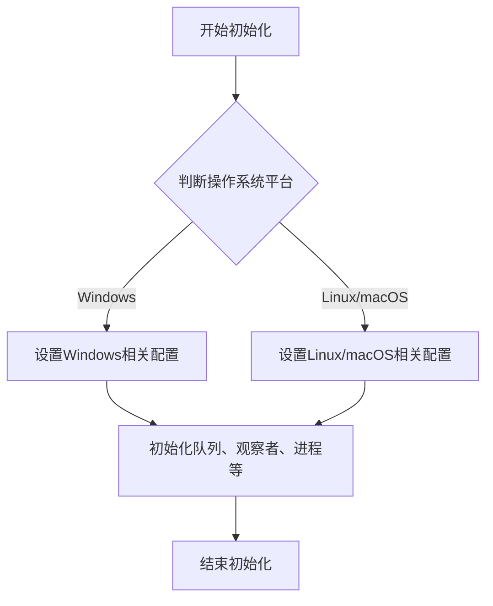
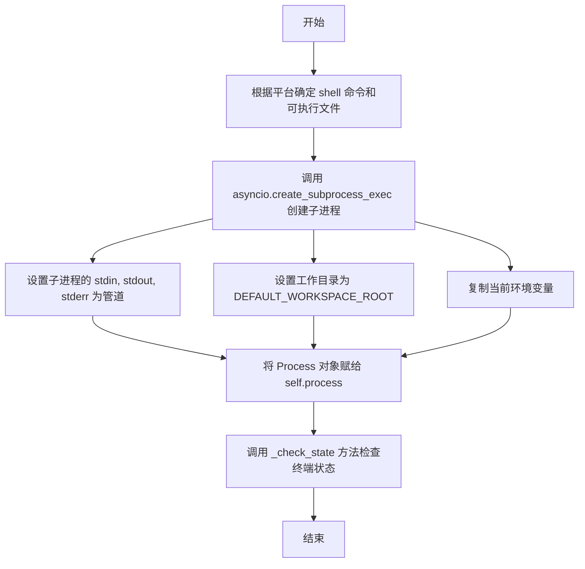
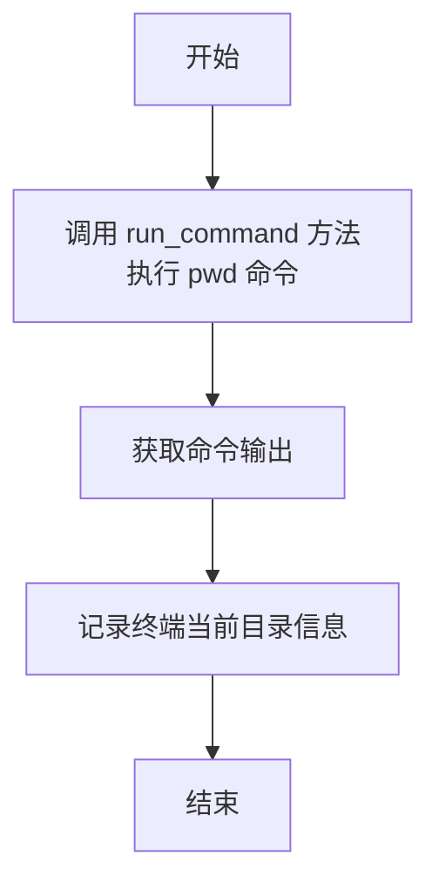
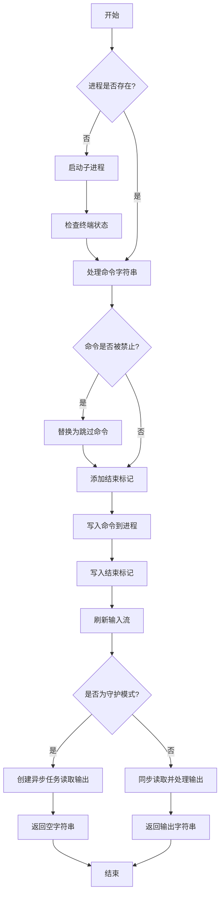
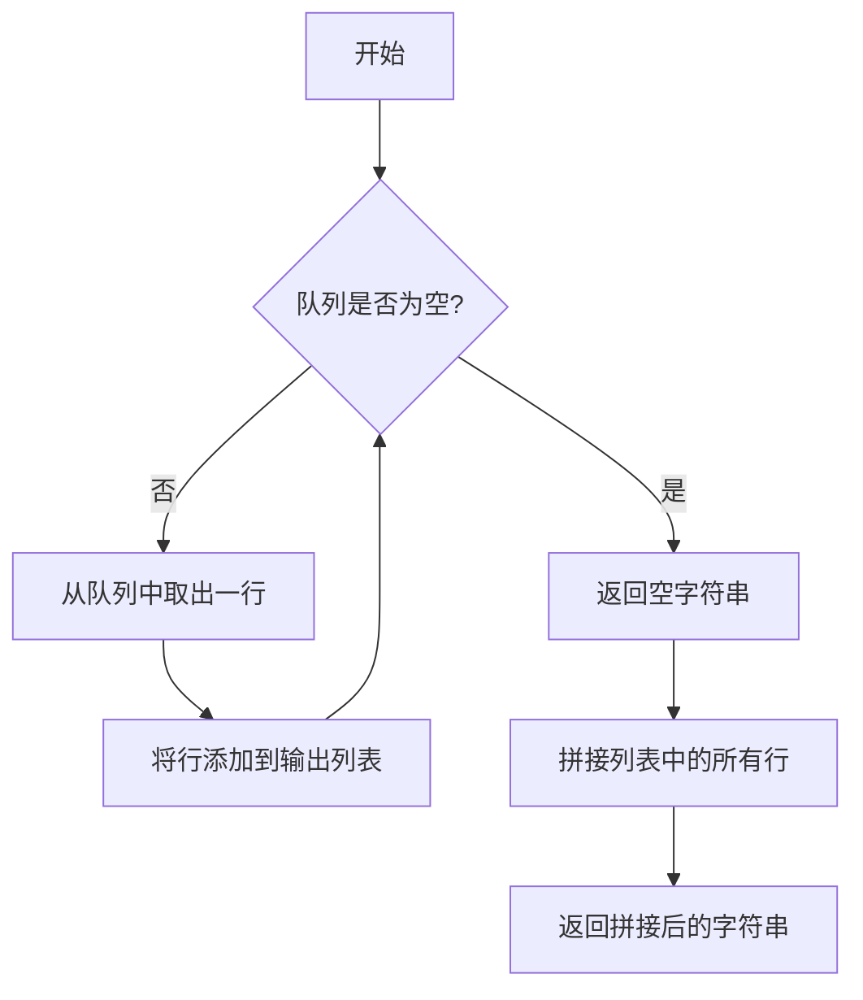
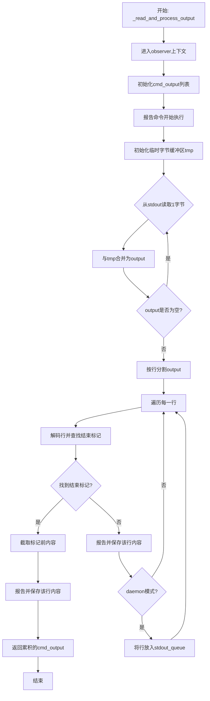
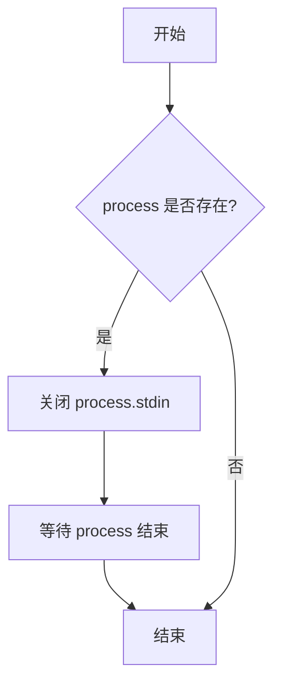
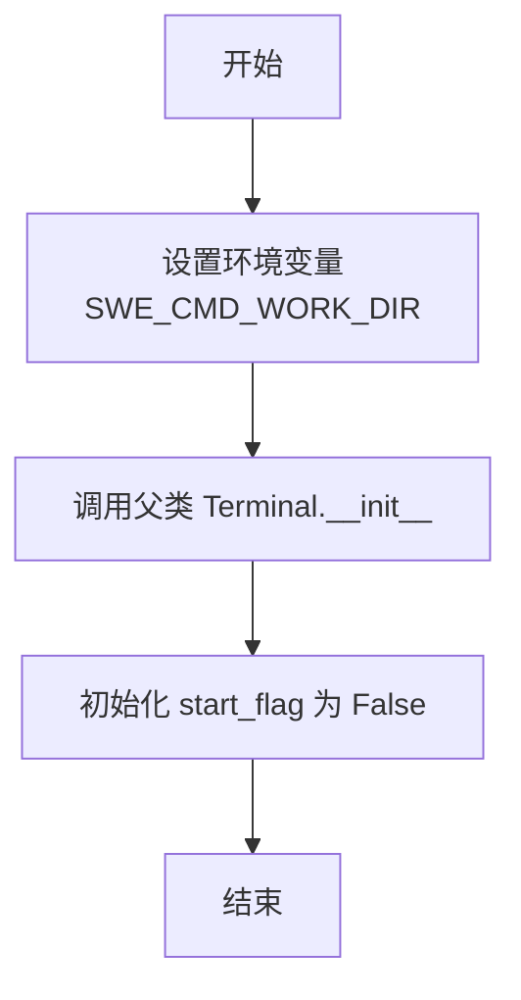
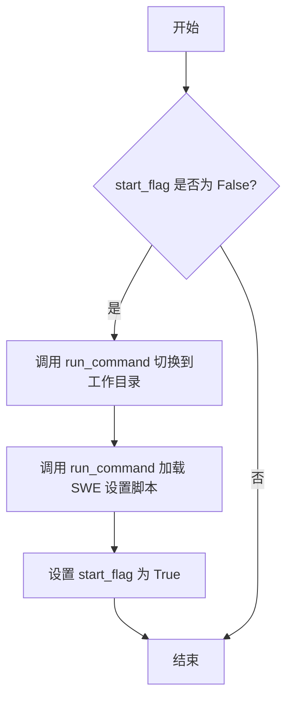
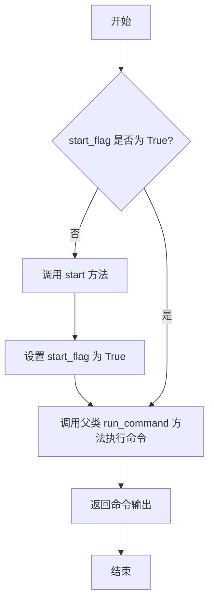

# `.\MetaGPT\metagpt\tools\libs\terminal.py` 详细设计文档

该代码实现了一个异步终端工具类，用于在MetaGPT框架中执行命令行操作。核心功能包括：1) 启动并维护一个持久的shell子进程（Windows为cmd.exe，Linux/macOS为bash）；2) 提供`run_command`方法执行任意命令并实时流式返回输出；3) 支持在指定Conda环境中执行命令；4) 通过`Bash`子类封装了特定的工作空间初始化逻辑和一组自定义的shell函数（如文件编辑、搜索等），专用于软件开发环境（SWE）任务。工具通过装饰器注册到框架，并实现了命令过滤、输出标记、异步队列处理等机制。

## 整体流程

```mermaid
graph TD
    A[用户调用Terminal.run_command或Bash.run] --> B{进程已启动?};
    B -- 否 --> C[调用_start_process启动子进程];
    C --> D[调用_check_state验证状态];
    D --> E;
    B -- 是 --> E[检查并过滤命令中的禁用命令];
    E --> F[向子进程stdin写入命令和结束标记];
    F --> G{是否为守护模式(daemon)?};
    G -- 是 --> H[创建异步任务_read_and_process_output];
    H --> I[立即返回空字符串];
    I --> J[用户后续可通过get_stdout_output获取输出];
    G -- 否 --> K[同步等待_read_and_process_output完成];
    K --> L[返回完整的命令输出字符串];
    subgraph _read_and_process_output [输出读取与处理子流程];
        M[开始读取子进程stdout] --> N{读取到结束标记?};
        N -- 否 --> O[解码行并实时报告给观察者];
        O --> P{是否为守护模式?};
        P -- 是 --> Q[将行放入stdout_queue];
        Q --> N;
        P -- 否 --> R[将行追加到cmd_output];
        R --> N;
        N -- 是 --> S[返回累积的cmd_output];
    end
    L --> T[流程结束];
    J --> T;
    U[用户调用execute_in_conda_env] --> V[包装命令，添加conda激活前缀];
    V --> A;
```

## 类结构

```
Terminal (主工具类，通过@register_tool()注册)
└── Bash (继承自Terminal，通过@register_tool(include_functions=["run"])注册，添加SWE特定功能)
```

## 全局变量及字段


### `Terminal.shell_command`
    
用于启动子进程shell的命令行参数列表，根据操作系统平台（Windows或Linux/macOS）初始化。

类型：`List[str]`
    


### `Terminal.executable`
    
子进程shell的可执行文件路径，在Windows上为None，在Linux/macOS上为'bash'。

类型：`Optional[str]`
    


### `Terminal.command_terminator`
    
用于终止发送给子进程shell的命令的字符串，Windows上为'\r\n'，Linux/macOS上为'\n'。

类型：`str`
    


### `Terminal.pwd_command`
    
用于检查当前工作目录的命令，Windows上为'cd'，Linux/macOS上为'pwd'。

类型：`str`
    


### `Terminal.stdout_queue`
    
一个异步队列，用于存储后台（守护进程模式）运行命令时产生的标准输出行。

类型：`Queue`
    


### `Terminal.observer`
    
一个报告器实例，用于实时报告命令执行状态和输出。

类型：`TerminalReporter`
    


### `Terminal.process`
    
表示当前活动的持久化shell子进程的实例，初始为None，在首次运行命令时启动。

类型：`Optional[asyncio.subprocess.Process]`
    


### `Terminal.forbidden_commands`
    
一个字典，键为被禁止的命令（或命令片段），值为禁止原因或替代建议，用于在命令执行前进行过滤和替换。

类型：`Dict[str, str]`
    


### `Bash.start_flag`
    
一个布尔标志，指示Bash工具是否已执行初始化步骤（如切换到工作目录和加载环境脚本）。

类型：`bool`
    
    

## 全局函数及方法

### `Terminal.__init__`

初始化 Terminal 类的实例，根据操作系统类型设置 shell 命令、可执行文件、命令终止符和当前目录命令，并初始化输出队列、观察者、进程对象以及禁止执行的命令列表。

参数：

- 无显式参数（`self` 为实例自身引用）

返回值：`None`，无返回值

#### 流程图



#### 带注释源码

```python
def __init__(self):
    # 根据操作系统平台初始化不同的 shell 命令和配置
    if sys.platform.startswith("win"):
        self.shell_command = ["cmd.exe"]  # Windows 使用 cmd.exe
        self.executable = None  # Windows 下无需指定可执行文件
        self.command_terminator = "\r\n"  # Windows 命令终止符为回车换行
        self.pwd_command = "cd"  # Windows 查看当前目录命令为 cd
    else:
        self.shell_command = ["bash"]  # Linux / macOS 使用 bash
        self.executable = "bash"  # 指定可执行文件为 bash
        self.command_terminator = "\n"  # Linux/macOS 命令终止符为换行
        self.pwd_command = "pwd"  # Linux/macOS 查看当前目录命令为 pwd

    # 初始化输出队列，最大容量为 1000
    self.stdout_queue = Queue(maxsize=1000)
    # 初始化终端报告观察者
    self.observer = TerminalReporter()
    # 初始化进程对象，初始为 None
    self.process: Optional[asyncio.subprocess.Process] = None
    # 定义禁止执行的命令及其原因/建议
    self.forbidden_commands = {
        "run dev": "Use Deployer.deploy_to_public instead.",
        "serve ": "Use Deployer.deploy_to_public instead.",  # serve 命令后带空格
    }
```

### `Terminal._start_process`

该方法用于启动一个持久的 shell 子进程，作为后续执行终端命令的交互环境。它根据操作系统平台（Windows 或 Linux/macOS）配置相应的 shell 命令和参数，并初始化一个异步子进程。该进程的标准输入、输出和错误流将被重定向以供程序控制。

参数：
-  `self`：`Terminal`，`Terminal` 类的实例，用于访问实例属性如 `shell_command` 和 `executable`。

返回值：`None`，该方法不直接返回值，但会设置 `self.process` 属性为启动的 `asyncio.subprocess.Process` 对象。

#### 流程图



#### 带注释源码

```python
async def _start_process(self):
    # Start a persistent shell process
    # 使用 asyncio.create_subprocess_exec 异步创建一个子进程
    # *self.shell_command 解包列表作为可执行文件及其参数
    # stdin=PIPE: 将子进程的标准输入重定向到管道，以便程序可以向其写入命令
    # stdout=PIPE: 将子进程的标准输出重定向到管道，以便程序可以读取命令输出
    # stderr=STDOUT: 将子进程的标准错误重定向到标准输出，便于统一处理
    # executable=self.executable: 指定可执行文件的路径（在非Windows平台为'bash'）
    # env=os.environ.copy(): 复制当前进程的环境变量给子进程
    # cwd=...: 设置子进程的初始工作目录。Windows下需要转换为字符串。
    self.process = await asyncio.create_subprocess_exec(
        *self.shell_command,
        stdin=PIPE,
        stdout=PIPE,
        stderr=STDOUT,
        executable=self.executable,
        env=os.environ.copy(),
        cwd=str(DEFAULT_WORKSPACE_ROOT) if sys.platform.startswith("win") else DEFAULT_WORKSPACE_ROOT,  # Windows
    )
    # 进程启动后，调用 _check_state 方法（例如，执行 pwd 命令）来验证终端状态并记录日志
    await self._check_state()
```

### `Terminal._check_state`

该方法用于检查终端的状态，例如当前工作目录。它通过执行一个特定的命令（如 `pwd` 或 `cd`）来获取并记录终端的当前状态。

参数：
-  `self`：`Terminal`，`Terminal` 类的实例，用于访问类属性和其他方法。

返回值：`None`，该方法不返回任何值，仅用于记录信息。

#### 流程图



#### 带注释源码

```python
async def _check_state(self):
    """
    Check the state of the terminal, e.g. the current directory.
    """
    # 调用 run_command 方法执行 pwd 命令（或 Windows 下的 cd 命令），获取当前工作目录
    output = await self.run_command(self.pwd_command)
    # 使用 logger 记录终端的当前目录信息
    logger.info("The terminal is at:", output)
```

### `Terminal.run_command`

该方法用于在终端中执行指定的命令，并实时流式传输输出。它维护跨执行的状态（如当前工作目录），使得顺序执行的命令能够保持上下文感知。

参数：

- `cmd`：`str`，要在终端中执行的命令字符串。
- `daemon`：`bool`，如果为 `True`，则在异步任务中执行命令，允许主程序继续执行；否则同步执行并等待输出。

返回值：`str`，命令的输出结果。如果 `daemon` 参数为 `True`，则返回空字符串（此时应使用 `get_stdout_output` 方法获取输出）。

#### 流程图



#### 带注释源码

```python
async def run_command(self, cmd: str, daemon=False) -> str:
    """
    在终端中执行指定命令并实时流式传输输出。
    此命令跨执行维护状态，例如当前目录，使得顺序命令能够保持上下文感知。

    参数:
        cmd (str): 要在终端中执行的命令。
        daemon (bool): 如果为 True，则在异步任务中执行命令，允许主程序继续执行。
    返回:
        str: 命令的输出，如果 `daemon` 为 True 则返回空字符串。注意当 `daemon` 为 True 时，
             应使用 `get_stdout_output` 方法获取输出。
    """
    # 如果子进程尚未启动，则启动一个持久的 shell 进程
    if self.process is None:
        await self._start_process()

    output = ""
    # 分割命令字符串，处理可能存在的 '&&' 连接符
    commands = re.split(r"\s*&&\s*", cmd)
    # 根据操作系统定义跳过命令（Windows 用 echo Skipped，Linux/macOS 用 true）
    skip_cmd = "echo Skipped" if sys.platform.startswith("win") else "true"
    # 检查命令是否在禁止列表中，如果是则替换为跳过命令并记录原因
    for cmd_name, reason in self.forbidden_commands.items():
        for index, command in enumerate(commands):
            if cmd_name in command:
                output += f"Failed to execute {command}. {reason}\n"
                commands[index] = skip_cmd
    # 重新组合命令字符串
    cmd = " && ".join(commands)
    # 将命令写入子进程的标准输入，并添加命令终止符（如换行符）
    self.process.stdin.write((cmd + self.command_terminator).encode())

    # 添加一个唯一的结束标记命令，用于标识命令执行结束
    marker_cmd = f"echo {END_MARKER_VALUE}"
    self.process.stdin.write((marker_cmd + self.command_terminator).encode())
    # 确保所有数据都已写入
    await self.process.stdin.drain()

    # 根据 daemon 参数决定是异步还是同步读取输出
    if daemon:
        asyncio.create_task(self._read_and_process_output(cmd))
    else:
        output += await self._read_and_process_output(cmd)

    return output
```

### `Terminal.execute_in_conda_env`

该方法用于在指定的 Conda 环境中执行给定的命令，无需手动激活环境。用户只需提供 Conda 环境名称和要执行的命令，方法会自动处理环境激活逻辑。

参数：

- `cmd`：`str`，要在 Conda 环境中执行的命令。
- `env`：`str`，要在其中执行命令的 Conda 环境的名称。如果未指定，命令将在当前激活的环境中运行。
- `daemon`：`bool`，如果为 `True`，命令将在异步任务中运行，类似于 `run_command` 方法，以相同的方式影响错误日志记录和处理。

返回值：`str`，命令的输出。如果 `daemon` 参数为 `True`，则返回空字符串，输出将异步处理。

#### 流程图

```mermaid
flowchart TD
    A[开始] --> B{判断平台是否为Windows?}
    B -- 是 --> C[构建Windows命令<br>conda activate {env} && {cmd}]
    B -- 否 --> D[构建Linux/macOS命令<br>conda run -n {env} {cmd}]
    C --> E[调用 run_command<br>传入构建的命令和 daemon 参数]
    D --> E
    E --> F[返回 run_command 的结果]
    F --> G[结束]
```

#### 带注释源码

```python
async def execute_in_conda_env(self, cmd: str, env, daemon=False) -> str:
    """
    在指定的 Conda 环境中自动执行给定命令，无需手动激活。
    用户只需提供 Conda 环境名称和要执行的命令。

    Args:
        cmd (str): 要在 Conda 环境中执行的命令。
        env (str, optional): 执行命令前要激活的 Conda 环境的名称。
                             如果未指定，命令将在当前激活的环境中运行。
        daemon (bool): 如果为 True，命令将在异步任务中运行，类似于 `run_command`，
                       以相同的方式影响错误日志记录和处理。

    Returns:
        str: 命令的输出，如果 `daemon` 为 True，则返回空字符串，输出将异步处理。

    Note:
        此函数包装了 `run_command`，预先添加了必要的 Conda 激活命令，
        以确保指定的环境在命令执行期间处于活动状态。
    """
    # 根据操作系统平台，构建不同的 Conda 命令前缀
    # Windows 使用 `conda activate`
    # Linux/macOS 使用 `conda run -n`
    cmd = f"conda activate {env} && {cmd}" if sys.platform.startswith("win") else f"conda run -n {env} {cmd}"
    # 调用底层的 `run_command` 方法执行构建好的完整命令
    return await self.run_command(cmd, daemon=daemon)
```

### `Terminal.get_stdout_output`

该方法用于从后台运行的命令中收集所有已缓存的输出，并将其作为字符串返回。它从类内部的异步队列中取出所有累积的输出行，拼接后返回。

参数：
- 无

返回值：`str`，从后台运行命令中收集到的输出字符串。

#### 流程图



#### 带注释源码

```python
async def get_stdout_output(self) -> str:
    """
    检索从后台运行命令收集的所有输出，并将其作为字符串返回。

    Returns:
        str: 从后台运行命令收集的输出，以字符串形式返回。
    """
    # 初始化一个空列表来存储输出行
    output_lines = []
    # 循环检查队列是否为空
    while not self.stdout_queue.empty():
        # 从队列中异步获取一行输出
        line = await self.stdout_queue.get()
        # 将获取的行添加到列表中
        output_lines.append(line)
    # 使用换行符连接列表中的所有行，形成一个完整的输出字符串并返回
    return "\n".join(output_lines)
```

### `Terminal._read_and_process_output`

该方法负责从终端子进程的标准输出中持续读取数据，处理并返回命令的执行结果。它通过逐字节读取来避免文本模式下的换行符转换问题，并实时报告输出内容。当检测到预定义的结束标记时，方法停止读取并返回累积的输出字符串。如果命令以守护进程模式运行，输出行还会被放入队列供后续检索。

参数：

- `cmd`：`str`，正在执行的命令字符串，用于报告。
- `daemon`：`bool`，指示命令是否以守护进程模式运行。若为True，输出行将被放入`stdout_queue`队列。

返回值：`str`，返回从标准输出读取并处理后的命令输出字符串。

#### 流程图



#### 带注释源码

```python
async def _read_and_process_output(self, cmd, daemon=False) -> str:
    # 使用TerminalReporter上下文管理器，确保报告过程的资源正确管理
    async with self.observer as observer:
        # 初始化列表，用于累积命令的输出行
        cmd_output = []
        # 报告命令开始执行，标记类型为"cmd"
        await observer.async_report(cmd + self.command_terminator, "cmd")
        # 初始化临时字节缓冲区，用于处理跨读取操作的字节行
        tmp = b""
        # 进入循环，持续读取输出直到检测到结束标记
        while True:
            # 从子进程的标准输出中读取1个字节，并与之前的缓冲区合并
            output = tmp + await self.process.stdout.read(1)
            # 如果当前没有读取到数据，则继续下一次读取尝试
            if not output:
                continue
            # 将字节流按行分割，保留行尾字符。最后一部分可能是不完整的行，存回tmp
            *lines, tmp = output.splitlines(True)
            # 遍历每个完整的行
            for line in lines:
                # 将字节解码为字符串，忽略解码错误
                line = line.decode(errors="ignore")
                # 在当前行中从右向左查找结束标记END_MARKER_VALUE
                ix = line.rfind(END_MARKER_VALUE)
                # 如果找到了结束标记
                if ix >= 0:
                    # 截取结束标记之前的内容作为有效输出
                    line = line[:ix]
                    # 如果截取后内容非空，则报告并保存
                    if line:
                        await observer.async_report(line, "output")
                        cmd_output.append(line)
                    # 返回所有累积的输出字符串
                    return "".join(cmd_output)
                # 如果没有找到结束标记，则报告整行输出
                await observer.async_report(line, "output")
                # 将当前行保存到累积列表中
                cmd_output.append(line)
                # 如果命令以守护进程模式运行，则将输出行放入队列供后续检索
                if daemon:
                    await self.stdout_queue.put(line)
```

### `Terminal.close`

关闭持久化的 shell 进程。如果 `process` 字段存在，则关闭其标准输入流并等待进程结束。

参数：
- 无

返回值：`None`，无返回值

#### 流程图



#### 带注释源码

```python
async def close(self):
    """Close the persistent shell process."""
    # 检查 self.process 是否存在（即子进程是否已启动）
    if self.process:
        # 关闭子进程的标准输入流，发送 EOF 信号
        self.process.stdin.close()
        # 等待子进程完全结束
        await self.process.wait()
```

### `Bash.__init__`

`Bash.__init__` 是 `Bash` 类的构造函数，用于初始化 `Bash` 实例。它首先设置环境变量 `SWE_CMD_WORK_DIR`，然后调用父类 `Terminal` 的构造函数，最后初始化 `start_flag` 标志。

参数：

-  `self`：`Bash` 实例，表示当前对象。

返回值：`None`，构造函数不返回任何值。

#### 流程图



#### 带注释源码

```python
def __init__(self):
    """init"""
    # 设置环境变量 SWE_CMD_WORK_DIR 为默认工作空间的路径
    os.environ["SWE_CMD_WORK_DIR"] = str(Config.default().workspace.path)
    # 调用父类 Terminal 的构造函数，初始化终端相关属性
    super().__init__()
    # 初始化 start_flag 标志，用于标记是否已执行 start 方法
    self.start_flag = False
```

### `Bash.start`

该方法用于初始化Bash环境，包括切换到默认工作目录并加载SWE设置脚本。

参数：无

返回值：`None`，无返回值

#### 流程图



#### 带注释源码

```python
async def start(self):
    # 切换到配置中指定的默认工作空间路径
    await self.run_command(f"cd {Config.default().workspace.path}")
    # 加载 SWE 设置脚本，初始化环境变量或函数
    await self.run_command(f"source {SWE_SETUP_PATH}")
```

### `Bash.run`

该方法用于执行Bash命令，支持标准Bash命令以及一系列自定义的Shell函数。如果尚未初始化，它会先启动终端进程并设置工作目录和环境。

参数：

- `cmd`：`str`，要执行的Bash命令字符串。

返回值：`str`，命令执行后的输出结果。

#### 流程图



#### 带注释源码

```python
async def run(self, cmd) -> str:
    """
    Executes a bash command.

    Args:
        cmd (str): The bash command to execute.

    Returns:
        str: The output of the command.

    This method allows for executing standard bash commands as well as
    utilizing several custom shell functions defined in the environment.

    Custom Shell Functions:

    - open <path> [<line_number>]
      Opens the file at the given path in the editor. If line_number is provided,
      the window will move to include that line.
      Arguments:
          path (str): The path to the file to open.
          line_number (int, optional): The line number to move the window to.
          If not provided, the window will start at the top of the file.

    - goto <line_number>
      Moves the window to show <line_number>.
      Arguments:
          line_number (int): The line number to move the window to.

    - scroll_down
      Moves the window down {WINDOW} lines.

    - scroll_up
      Moves the window up {WINDOW} lines.

    - create <filename>
      Creates and opens a new file with the given name.
      Arguments:
          filename (str): The name of the file to create.

    - search_dir_and_preview <search_term> [<dir>]
      Searches for search_term in all files in dir and gives their code preview
      with line numbers. If dir is not provided, searches in the current directory.
      Arguments:
          search_term (str): The term to search for.
          dir (str, optional): The directory to search in. Defaults to the current directory.

    - search_file <search_term> [<file>]
      Searches for search_term in file. If file is not provided, searches in the current open file.
      Arguments:
          search_term (str): The term to search for.
          file (str, optional): The file to search in. Defaults to the current open file.

    - find_file <file_name> [<dir>]
      Finds all files with the given name in dir. If dir is not provided, searches in the current directory.
      Arguments:
          file_name (str): The name of the file to search for.
          dir (str, optional): The directory to search in. Defaults to the current directory.

    - edit <start_line>:<end_line> <<EOF
      <replacement_text>
      EOF
      Line numbers start from 1. Replaces lines <start_line> through <end_line> (inclusive) with the given text in the open file.
      The replacement text is terminated by a line with only EOF on it. All of the <replacement text> will be entered, so make
      sure your indentation is formatted properly. Python files will be checked for syntax errors after the edit. If the system
      detects a syntax error, the edit will not be executed. Simply try to edit the file again, but make sure to read the error
      message and modify the edit command you issue accordingly. Issuing the same command a second time will just lead to the same
      error message again. All code modifications made via the 'edit' command must strictly follow the PEP8 standard.
      Arguments:
          start_line (int): The line number to start the edit at, starting from 1.
          end_line (int): The line number to end the edit at (inclusive), starting from 1.
          replacement_text (str): The text to replace the current selection with, must conform to PEP8 standards.

    - submit
      Submits your current code locally. it can only be executed once, the last action before the `end`.

    Note: Make sure to use these functions as per their defined arguments and behaviors.
    """
    # 检查是否已经初始化
    if not self.start_flag:
        # 如果未初始化，则调用 start 方法进行初始化
        await self.start()
        # 设置标志位为 True，表示已初始化
        self.start_flag = True

    # 调用父类 Terminal 的 run_command 方法执行命令
    return await self.run_command(cmd)
```

## 关键组件


### 终端命令执行器 (Terminal)

一个用于在持久化子进程中执行终端命令的工具类，支持跨平台（Windows/Linux/macOS），提供命令执行、输出流式读取、后台任务执行以及特定命令过滤等功能。

### Conda环境执行器 (execute_in_conda_env)

`Terminal`类的一个方法，用于在指定的Conda环境中自动执行命令，无需手动激活环境，通过包装`run_command`方法实现。

### 自定义Bash命令执行器 (Bash)

继承自`Terminal`类，专门用于执行Bash命令，并预定义了一系列自定义Shell函数（如`open`, `goto`, `edit`, `submit`等），这些函数通过`run`方法调用，用于代码编辑、文件搜索等开发任务。

### 命令输出观察器与报告器 (TerminalReporter)

通过`observer`字段集成，用于实时报告命令执行状态和输出，支持异步报告，增强了命令执行过程的可观测性。

### 命令过滤与安全机制 (forbidden_commands)

一个字典结构，用于定义和过滤禁止执行的命令（如`run dev`, `serve `），当检测到这些命令时，会将其替换为无害命令（如`echo Skipped`或`true`）并返回建议信息，增加了工具的安全性。

### 异步输出处理与队列 (_read_and_process_output, stdout_queue)

通过异步协程`_read_and_process_output`处理子进程的标准输出，使用`asyncio.Queue`（`stdout_queue`）缓存后台任务（`daemon=True`）的输出，实现了非阻塞的流式输出读取和后台输出收集。


## 问题及建议

### 已知问题

1.  **命令过滤逻辑存在缺陷**：`run_command`方法中使用`cmd_name in command`进行命令匹配，这可能导致误判。例如，禁止的命令是`"serve "`，但用户输入`"serve --help"`或`"nano server.py"`也会被匹配并阻止，这可能并非预期行为。
2.  **Windows平台路径处理不一致**：在`_start_process`方法中，为Windows平台设置`cwd`参数时，对`DEFAULT_WORKSPACE_ROOT`进行了`str()`转换，而在其他平台则直接使用。如果`DEFAULT_WORKSPACE_ROOT`本身不是字符串（例如是一个`Path`对象），这可能导致跨平台行为不一致或潜在错误。
3.  **`Bash`类的初始化与启动逻辑耦合**：`Bash`类的`run`方法在首次调用时会自动执行`start`方法。这种隐式的启动逻辑可能导致状态不一致，如果用户在调用`run`之前尝试进行其他操作（如直接调用父类的`run_command`），可能会遇到未初始化的状态。
4.  **`daemon`模式输出处理可能丢失数据**：在`_read_and_process_output`方法中，当`daemon=True`时，输出行被放入`stdout_queue`。然而，如果消费者（`get_stdout_output`）读取速度慢于生产者，且队列已满（`maxsize=1000`），后续的输出行将被丢弃，导致数据丢失。
5.  **错误处理不完善**：代码中缺乏对子进程启动失败、命令执行超时、进程异常终止等情况的错误处理。例如，`_start_process`或`run_command`中的`process.stdin.write`可能抛出异常，但当前代码没有捕获或处理这些异常。
6.  **资源泄漏风险**：`close`方法关闭了`stdin`并等待进程结束，但如果进程因为某些原因挂起，`wait()`可能永远不会返回。此外，没有确保在对象销毁或异常发生时`close`方法被调用。
7.  **`execute_in_conda_env`方法平台命令拼接逻辑不严谨**：Windows平台使用`conda activate`，而Linux/macOS使用`conda run`。`conda run`命令的格式是`conda run -n env_name -- command`，当前代码拼接为`conda run -n {env} {cmd}`，如果`cmd`本身包含需要shell解析的特殊字符（如`&&`, `|`），可能会因为缺少shell上下文而导致命令执行失败或行为异常。
8.  **`_read_and_process_output`方法解码错误处理过于宽松**：使用`errors="ignore"`参数解码字节流，这意味着遇到无法解码的字节序列时会直接忽略，可能导致输出信息不完整或难以调试。

### 优化建议

1.  **改进命令过滤策略**：将简单的字符串包含匹配改为更精确的匹配方式，例如使用正则表达式匹配命令开头（如`^serve\s`），或者将命令按空格分割后比较第一个单词。同时，考虑提供一个配置选项或方法，允许动态更新禁止的命令列表。
2.  **统一路径处理**：确保所有平台对`DEFAULT_WORKSPACE_ROOT`的处理方式一致。可以在类初始化时或`_start_process`方法中，统一将其转换为字符串类型。
3.  **解耦`Bash`类的初始化和启动**：将`start`方法的调用从`run`方法中移除，改为要求用户在首次使用`Bash`实例前显式调用`start`。或者，在`__init__`中完成所有必要的初始化，避免惰性初始化带来的状态问题。
4.  **增强`daemon`模式的健壮性**：考虑使用无界队列（`Queue()`）或一个更大的容量来避免数据丢失。更好的做法是引入背压机制或让调用者能够处理队列满的情况。同时，确保在`daemon`任务完成或取消时，队列能被正确清理。
5.  **完善错误处理机制**：
    *   在`_start_process`、`run_command`等可能失败的操作周围添加`try-except`块，捕获`OSError`, `asyncio.TimeoutError`等异常，并记录日志或向上抛出更清晰的异常。
    *   为`run_command`方法增加可选的超时参数。
    *   在`close`方法中，考虑添加超时逻辑，并尝试发送终止信号（如`SIGTERM`）来结束挂起的子进程。
6.  **使用上下文管理器管理资源**：让`Terminal`类实现`__aenter__`和`__aexit__`方法，支持`async with`语法。在`__aexit__`中自动调用`close`方法，确保资源在任何情况下都能被正确释放。
7.  **重构`execute_in_conda_env`的命令构造**：对于非Windows平台，考虑使用`conda run -n env_name bash -c "cmd"`的形式，将整个命令交给一个shell子进程执行，以正确处理shell元字符。或者，提供一个更通用的`run_shell_command`方法，让用户明确指定是否需要在shell中运行。
8.  **调整解码错误策略**：将`errors="ignore"`改为`errors="replace"`，用替换字符（如`�`）标记无法解码的部分，这样既能保留输出的大致结构，又能提示存在编码问题，便于调试。
9.  **增加日志和监控点**：在关键步骤（如进程启动、命令发送、输出开始/结束读取）添加更详细的日志记录，有助于调试复杂问题。
10. **考虑安全性**：当前设计允许执行任意终端命令。虽然已有禁止命令列表，但作为一个通用工具，应考虑增加更严格的安全沙箱机制，例如限制可执行的命令范围、设置资源限制（CPU、内存）、或运行在隔离的容器环境中，特别是在接受不可信用户输入的场景下。

## 其它


### 设计目标与约束

该模块的核心设计目标是提供一个安全、可控、跨平台的命令行执行工具，作为AI智能体与底层操作系统交互的桥梁。主要约束包括：1) **安全性**：必须拦截并替换潜在的危险命令（如`run dev`, `serve`），防止AI直接执行部署或服务启动命令。2) **状态保持**：需要维护一个持久的Shell进程，以确保连续执行的命令能共享上下文（如工作目录）。3) **实时反馈**：支持以守护进程（daemon）模式运行命令，并允许主程序异步获取其输出流。4) **环境隔离**：提供便捷的方法在指定的Conda环境中执行命令，简化环境管理。5) **向后兼容与扩展**：通过`Bash`子类继承`Terminal`，并封装特定于项目的自定义Shell函数（如`open`, `edit`, `search`等），为特定工作流（如代码编辑任务）提供高级抽象。

### 错误处理与异常设计

模块采用防御性编程和静默处理策略，而非主动抛出异常，以确保AI智能体的执行流程不被中断。具体设计包括：1) **命令拦截**：通过`forbidden_commands`字典定义黑名单，匹配到的命令会被替换为无害命令（Windows下为`echo Skipped`，Linux下为`true`），并在返回信息中给出建议。2) **进程状态管理**：`run_command`方法在首次调用时会自动初始化Shell进程（`_start_process`）。如果进程意外终止，后续命令会因`self.process`为`None`而触发重新启动，实现了简单的容错。3) **输出解码容错**：在`_read_and_process_output`中读取进程输出时，使用`errors="ignore"`参数，避免因非UTF-8字符导致解码失败。4) **资源清理**：提供了`close`方法用于显式关闭Shell进程和标准输入流，但模块本身未实现自动清理或`__del__`，存在资源泄漏风险，需由调用者管理生命周期。

### 数据流与状态机

模块的核心数据流围绕异步子进程的`stdin`和`stdout`展开，并引入队列机制处理守护进程的输出。1) **命令执行流**：用户调用`run_command(cmd)` -> 命令经安全检查（替换禁用命令） -> 命令与结束标记（`END_MARKER_VALUE`）被写入进程`stdin` -> 方法同步或异步地调用`_read_and_process_output` -> 该方法从`stdout`循环读取字节流，按行分割，实时通过`TerminalReporter`报告，并持续读取直到检测到结束标记 -> 收集的输出被返回或放入`stdout_queue`。2) **状态机**：`Terminal`对象有两种主要状态：**未初始化**（`self.process is None`）和**运行中**（`process`存在）。`Bash`对象增加了`start_flag`状态，确保其自定义环境（`cd`, `source`）仅初始化一次。3) **输出分流**：当`daemon=True`时，输出行在实时报告的同时，会被存入`self.stdout_queue`，供后续通过`get_stdout_output`获取，实现了输出流的缓冲与异步消费。

### 外部依赖与接口契约

1)  **外部依赖**：
    *   **asyncio**：核心依赖，用于管理异步子进程和队列。
    *   **metagpt.config2.Config**：用于获取工作空间路径等配置信息。
    *   **metagpt.const**：依赖`DEFAULT_WORKSPACE_ROOT`和`SWE_SETUP_PATH`常量。
    *   **metagpt.tools.tool_registry.register_tool**：装饰器，将此工具注册到MetaGPT的框架中，使其能被智能体发现和调用。
    *   **metagpt.utils.report.TerminalReporter**：用于实时报告命令执行状态和输出。
    *   **操作系统Shell**：依赖`cmd.exe`（Windows）或`bash`（Linux/macOS）来执行命令。
    *   **Conda**：`execute_in_conda_env`方法依赖系统已安装并配置好Conda。

2)  **接口契约**：
    *   `Terminal.run_command(cmd: str, daemon=False) -> str`：主执行接口。调用者需知悉`daemon=True`时返回空字符串，实际输出需通过`get_stdout_output()`获取。
    *   `Terminal.execute_in_conda_env(cmd: str, env, daemon=False) -> str`：环境执行接口。契约要求`env`参数为已存在的Conda环境名。
    *   `Bash.run(cmd) -> str`：高级执行接口。契约约定`cmd`可以是标准Bash命令或类文档中列出的特定自定义函数（如`open`, `edit`）。调用`Bash.run`前无需手动调用`start()`，方法内部会确保初始化。
    *   `register_tool`装饰器：隐式契约，被装饰的类将成为MetaGPT框架中的一个工具，其公有方法（或`include_functions`指定的方法）将成为工具的可调用动作。

    