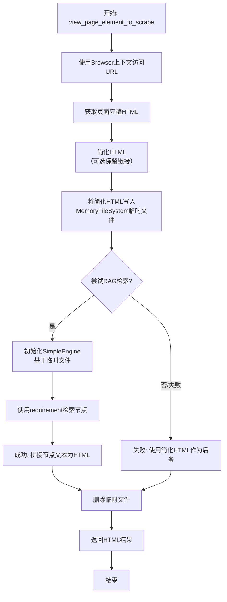

# `.\MetaGPT\metagpt\tools\libs\web_scraping.py` 详细设计文档

该代码定义了一个用于网页抓取的工具函数，其核心功能是访问指定URL，获取并简化其HTML内容，可选地使用RAG（检索增强生成）技术根据用户需求对内容进行智能筛选和提取，最终返回处理后的HTML文本。

## 整体流程

```mermaid
graph TD
    A[开始: 调用 view_page_element_to_scrape] --> B[启动浏览器并导航至目标URL]
    B --> C[获取页面完整HTML内容]
    C --> D[简化HTML (移除脚本/样式, 可选保留链接)]
    D --> E[将简化后的HTML写入内存文件系统]
    E --> F{尝试RAG检索?}
    F -- 是 --> G[初始化RAG引擎并基于需求检索相关节点]
    G --> H[成功: 用检索到的节点文本重构HTML]
    F -- 否/失败 --> I[使用简化HTML作为后备]
    H --> J[清理临时文件]
    I --> J
    J --> K[返回处理后的HTML字符串]
```

## 类结构

```
外部依赖与函数
├── 全局函数: view_page_element_to_scrape (主工具函数)
├── 外部类: Browser (来自 metagpt.tools.libs.browser)
├── 外部类: MemoryFileSystem (来自 metagpt.utils.file)
└── 外部函数/类:
    ├── register_tool (装饰器，来自 metagpt.tools.tool_registry)
    ├── simplify_html (函数，来自 metagpt.utils.parse_html)
    └── SimpleEngine (类，来自 metagpt.rag.engines，可选依赖)
```

## 全局变量及字段


    

## 全局函数及方法


### `view_page_element_to_scrape`

该函数是一个用于网页抓取的工具函数。其核心功能是访问指定的URL，获取并简化其HTML内容，然后根据用户提供的需求（`requirement`）尝试使用RAG（检索增强生成）引擎检索最相关的HTML片段。如果RAG检索失败，则返回整个简化后的HTML作为后备方案。最终结果是一个包含相关页面结构信息的HTML字符串。

参数：

-  `url`：`str`，需要抓取的网页URL。
-  `requirement`：`str`，清晰详细的需求描述，用于指导RAG引擎聚焦于目标元素。
-  `keep_links`：`bool`，是否在简化的HTML中保留超链接。默认为`False`。

返回值：`str`，返回页面的HTML内容。如果RAG检索成功，则返回与需求最相关的HTML片段；否则返回整个简化后的HTML。

#### 流程图



#### 带注释源码

```python
# 注册此函数为一个工具，标签为“web scraping”，便于在工具系统中发现和管理。
@register_tool(tags=["web scraping"])
async def view_page_element_to_scrape(url: str, requirement: str, keep_links: bool = False) -> str:
    """view the HTML content of current page to understand the structure.

    Args:
        url (str): The URL of the web page to scrape.
        requirement (str): Providing a clear and detailed requirement helps in focusing the inspection on the desired elements.
        keep_links (bool): Whether to keep the hyperlinks in the HTML content. Set to True if links are required
    Returns:
        str: The HTML content of the page.
    """
    # 1. 使用异步上下文管理器启动浏览器，确保资源正确释放。
    async with Browser() as browser:
        # 导航到指定URL
        await browser.goto(url)
        # 获取浏览器页面对象
        page = browser.page
        # 获取页面的完整HTML内容
        html = await page.content()
        # 对HTML进行简化处理（如去除脚本、样式等），并根据参数决定是否保留链接
        html = simplify_html(html, url=page.url, keep_links=keep_links)
    
    # 2. 创建一个内存文件系统，用于临时存储HTML文件，供后续RAG引擎使用。
    mem_fs = MemoryFileSystem()
    # 生成一个唯一的文件名
    filename = f"{uuid4().hex}.html"
    # 将简化后的HTML写入内存文件系统中的临时文件
    with mem_fs.open(filename, "w") as f:
        f.write(html)

    # 3. RAG检索阶段（作为可选优化）。
    # 使用contextlib.suppress抑制此块内的所有异常，确保即使RAG失败，流程也能继续。
    with contextlib.suppress(Exception):
        # 动态导入SimpleEngine，避免可能的循环导入问题。
        from metagpt.rag.engines import SimpleEngine  # avoid circular import

        # TODO: 使`from_docs`方法支持异步调用。
        # 基于临时文件创建RAG引擎。
        engine = SimpleEngine.from_docs(input_files=[filename], fs=mem_fs)
        # 使用用户提供的`requirement`从引擎中异步检索相关节点。
        nodes = await engine.aretrieve(requirement)
        # 将检索到的所有节点的文本内容用换行符连接，形成新的HTML字符串。
        html = "\n".join(i.text for i in nodes)

    # 4. 清理阶段：无论RAG是否成功，都删除临时文件。
    mem_fs.rm_file(filename)
    # 5. 返回最终的HTML字符串。
    #    如果RAG成功，`html`变量在第3步已被覆盖为检索结果。
    #    如果RAG失败（被suppress捕获），`html`变量仍为第1步得到的简化HTML。
    return html
```


## 关键组件


### 浏览器自动化与页面获取

通过 `Browser` 上下文管理器启动浏览器，导航至指定URL，并获取页面的完整HTML内容。

### HTML内容简化与处理

使用 `simplify_html` 函数对获取的原始HTML进行清理和简化，例如移除脚本、样式等非内容标签，并可选择性地保留或移除超链接。

### 内存文件系统与临时存储

利用 `MemoryFileSystem` 在内存中创建一个临时文件系统，用于存储简化后的HTML内容，避免磁盘I/O，并生成唯一的文件名以防止冲突。

### 检索增强生成（RAG）集成

尝试使用 `SimpleEngine` 从临时存储的HTML文件中创建RAG引擎，并根据用户提供的 `requirement` 进行异步检索，以获取与需求最相关的文本节点，实现内容的智能提取与聚焦。

### 错误处理与回退机制

通过 `contextlib.suppress(Exception)` 包裹RAG处理逻辑，确保当RAG引擎初始化或检索失败时，函数能够优雅地回退到使用完整的简化HTML内容，保证功能的鲁棒性。

### 资源清理

在函数返回最终结果前，显式删除内存文件系统中创建的临时HTML文件，确保不会留下无用的内存占用。


## 问题及建议


### 已知问题

-   **潜在的循环导入风险**：代码中在`contextlib.suppress(Exception)`块内动态导入`SimpleEngine`，并注释了`# avoid circular import`。这表明`metagpt.rag.engines`模块可能依赖于当前模块或其所在包，形成了循环依赖。虽然通过延迟导入暂时规避了启动时的导入错误，但这是一种不稳定的设计，可能导致运行时错误或使代码结构难以理解和维护。
-   **阻塞的同步调用**：代码中使用了`SimpleEngine.from_docs(input_files=[filename], fs=mem_fs)`，这是一个同步方法（由注释`# TODO make `from_docs` asynchronous`指出）。在异步函数`view_page_element_to_scrape`中调用同步的I/O密集型操作（如读取文件、处理文档）会阻塞整个事件循环，降低并发性能，违背了异步编程的最佳实践。
-   **异常处理过于宽泛**：使用`contextlib.suppress(Exception)`捕获所有异常。虽然意图是让RAG功能作为可选的优化，失败后回退到简化HTML，但捕获`Exception`会隐藏所有潜在的错误，包括编程错误（如`ImportError`、`AttributeError`）和运行时环境问题，使得调试变得困难，且可能掩盖了`SimpleEngine`自身代码中的严重问题。
-   **临时文件管理可能不完善**：代码创建了一个临时HTML文件用于RAG处理，并在最后删除。虽然使用了`uuid4`生成唯一文件名，但在异常发生（特别是RAG处理过程中的异常）时，`mem_fs.rm_file(filename)`可能不会被执行，导致临时文件残留。虽然`MemoryFileSystem`可能只在内存中操作，但此模式若切换到真实文件系统则存在问题。

### 优化建议

-   **重构以消除循环依赖**：重新设计模块间的依赖关系。可以将`register_tool`装饰的函数移至一个不直接或间接依赖`metagpt.rag`的工具专用模块中。或者，考虑使用依赖注入或接口抽象来解耦工具函数与RAG引擎的具体实现。将`SimpleEngine`作为可选参数传入函数，而不是在函数内部导入，是更清晰的设计。
-   **将`from_docs`方法异步化或使用执行器**：推动`SimpleEngine.from_docs`方法改为异步方法（`async def from_docs`）以匹配调用上下文。如果修改上游代码不可行，应将同步调用包装到`asyncio.to_thread`或`run_in_executor`中，将其转移到单独的线程中执行，避免阻塞主事件循环。例如：`engine = await asyncio.to_thread(SimpleEngine.from_docs, input_files=[filename], fs=mem_fs)`。
-   **细化异常处理**：将`contextlib.suppress(Exception)`替换为更具体的异常捕获。至少应捕获`SimpleEngine`相关操作可能抛出的预期异常（例如`ValueError`, `IOError`等），并记录警告日志。同时，确保`ImportError`被单独处理或允许其抛出，以明确指示RAG功能不可用。例如：
    ```python
    try:
        from metagpt.rag.engines import SimpleEngine
        engine = SimpleEngine.from_docs(...) # 或异步版本
        nodes = await engine.aretrieve(requirement)
        html = "\n".join(i.text for i in nodes)
    except ImportError:
        logger.warning("RAG module not available, using simplified HTML.")
    except (SomeSpecificEngineError, OSError) as e:
        logger.warning(f"RAG processing failed: {e}, using simplified HTML.")
    ```
-   **使用上下文管理器确保资源清理**：为确保临时文件在任何情况下都被清理，可以使用`try...finally`块或创建一个自定义的上下文管理器来管理文件生命周期。即使当前是内存文件系统，养成良好习惯对未来的可维护性有益。例如：
    ```python
    try:
        # ... 创建文件和RAG处理 ...
    finally:
        mem_fs.rm_file(filename)
    ```
    或者，如果`MemoryFileSystem`支持，使用`with`语句创建临时文件区域。
-   **考虑移除注释掉的代码**：文件末尾有一段被注释掉的`get_elements_outerhtml`函数代码。如果该代码已废弃且无计划使用，应将其删除以保持代码库的整洁。如果需要保留作为参考或未来开发，应添加明确的注释说明其状态（如`# DEPRECATED`或`# TODO: To be implemented`）。


## 其它


### 设计目标与约束

本模块的核心设计目标是提供一个专注于网页内容抓取与结构理解的工具函数。它旨在通过浏览器自动化获取指定URL的HTML内容，并根据用户需求（`requirement`）进行智能筛选和简化，最终返回一个便于后续处理（如信息提取、分析）的文本表示。设计上遵循了以下约束：1) 作为工具函数，需通过`@register_tool`装饰器注册，以集成到更大的工具生态中；2) 必须处理网页抓取的异步特性；3) 需要优雅地处理可选的RAG（检索增强生成）功能，即使其失败也不影响核心功能的可用性；4) 使用临时文件系统管理中间生成的HTML文件，确保资源清理。

### 错误处理与异常设计

本函数的错误处理策略主要分为两个层面：
1.  **核心流程错误**：浏览器操作（如`browser.goto`、`page.content`）和文件系统操作（如`mem_fs.open`）中发生的异常会直接向上抛出，由调用者处理。这确保了核心功能的失败能够被及时感知。
2.  **可选功能降级**：对于可选的RAG处理部分，使用了`contextlib.suppress(Exception)`来捕获其执行过程中可能发生的任何异常（例如`SimpleEngine`导入失败、`from_docs`或`aretrieve`执行错误）。当RAG处理失败时，函数会静默忽略异常，并回退到使用原始的简化HTML内容作为返回值。这种设计保证了函数在RAG功能不可用或出错时，依然能提供基础可用的输出，实现了功能的鲁棒性。

### 数据流与状态机

函数的数据流遵循清晰的线性流程，不涉及复杂的状态机：
1.  **输入**：接收`url`（目标网页地址）、`requirement`（内容筛选需求描述）和`keep_links`（链接保留标志）作为输入参数。
2.  **处理阶段1 - 网页获取与简化**：启动浏览器实例，导航至目标URL，获取完整HTML。随后调用`simplify_html`函数对HTML进行清理和简化，生成一个更干净、结构更清晰的HTML字符串。此阶段的结果被写入内存文件系统的一个临时文件中。
3.  **处理阶段2 - 可选内容精炼**：尝试导入并使用`SimpleEngine`（RAG引擎）基于临时HTML文件和`requirement`进行检索，旨在从简化后的HTML中提取与需求最相关的文本节点。此阶段成功则用检索结果覆盖之前的HTML内容；失败则跳过，保留阶段1的结果。
4.  **清理与输出**：删除内存文件系统中的临时文件。将最终处理得到的HTML文本内容（无论是简化后的完整HTML还是RAG检索出的片段）作为字符串返回。

### 外部依赖与接口契约

本函数依赖于以下外部组件，并遵循相应的接口契约：
1.  **`metagpt.tools.libs.browser.Browser`**：提供浏览器自动化能力。契约：作为异步上下文管理器使用，确保浏览器的正确初始化和清理。`browser.goto`用于导航，`browser.page`提供页面操作接口。
2.  **`metagpt.utils.parse_html.simplify_html`**：用于HTML内容的清洗和简化。契约：接收原始HTML字符串、URL等参数，返回简化后的HTML字符串。
3.  **`metagpt.utils.file.MemoryFileSystem`**：提供内存中的文件系统操作。契约：支持`open`（读写文件）、`rm_file`（删除文件）等操作，用于管理临时文件。
4.  **`metagpt.rag.engines.SimpleEngine` (可选)**：提供基于检索的内容精炼能力。契约：`from_docs`方法用于从文档创建引擎实例，`aretrieve`方法用于异步检索相关节点。此依赖被设计为可选的，其导入和使用被异常处理块包裹。
5.  **`register_tool`装饰器**：用于将本函数注册到工具注册表。契约：接收`tags`等参数，将函数包装并纳入统一的管理和发现机制。

    