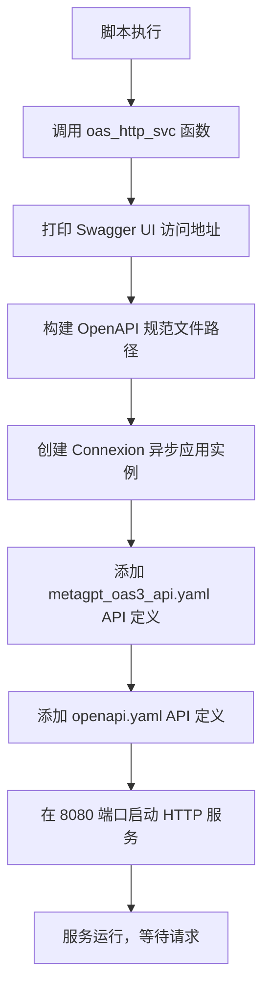
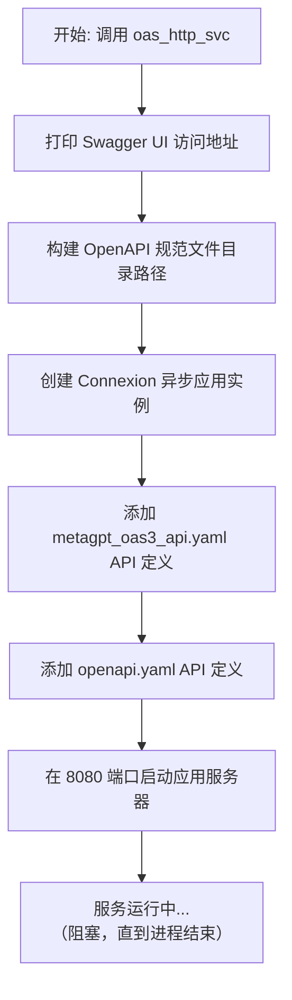

# `.\MetaGPT\metagpt\tools\metagpt_oas3_api_svc.py` 详细设计文档

该代码是一个基于 Connexion 框架的 OpenAPI Specification 3.0 REST API 服务启动脚本。其核心功能是启动一个异步 HTTP 服务，加载指定的 OpenAPI 规范文件（YAML 格式），并在本地 8080 端口提供符合 OAS 3.0 标准的 API 接口及其交互式文档界面（Swagger UI）。

## 整体流程



## 类结构

```
无显式类定义
├── 全局函数: oas_http_svc
└── 脚本入口: __name__ == '__main__'
```

## 全局变量及字段


### `specification_dir`
    
指向包含OpenAPI规范文件的目录路径对象。

类型：`pathlib.Path`
    


### `app`
    
Connexion异步应用实例，用于托管和运行OpenAPI服务。

类型：`connexion.AsyncApp`
    


    

## 全局函数及方法


### `oas_http_svc`

启动一个基于 OpenAPI Specification 3.0 (OAS 3.0) 规范的 HTTP REST API 服务。该函数使用 `connexion` 库，通过读取指定的 YAML 文件来定义 API 端点，并在本地 8080 端口启动一个异步 Web 应用服务器。启动后，用户可以通过访问 `/oas3/ui/` 路径来使用集成的 Swagger UI 界面与 API 进行交互。

参数：
-  `无`：此函数不接受任何参数。

返回值：`None`，此函数不返回任何值，它会持续运行 Web 服务器直到进程被终止。

#### 流程图



#### 带注释源码

```python
def oas_http_svc():
    """Start the OAS 3.0 OpenAPI HTTP service"""
    # 1. 在控制台输出 Swagger UI 的访问地址，方便开发者快速打开 API 文档和测试界面。
    print("http://localhost:8080/oas3/ui/")

    # 2. 计算 OpenAPI 规范文件（YAML）所在的目录路径。
    #    Path(__file__) 获取当前脚本文件的路径，然后通过 .parent 向上回溯三级目录，
    #    最终定位到项目根目录下的 `docs/.well-known` 文件夹。
    specification_dir = Path(__file__).parent.parent.parent / "docs/.well-known"

    # 3. 创建一个 Connexion 异步应用实例。
    #    - __name__: 使用当前模块的名称。
    #    - specification_dir: 指定包含 OpenAPI YAML 文件的目录。
    app = connexion.AsyncApp(__name__, specification_dir=str(specification_dir))

    # 4. 将指定的 OpenAPI 规范文件添加到应用中。
    #    - `metagpt_oas3_api.yaml`: 可能包含 MetaGPT 项目特定的 API 定义。
    #    - `openapi.yaml`: 可能包含更通用或基础的 API 定义。
    #    Connexion 会解析这些 YAML 文件，并自动注册其中定义的路由和请求处理器。
    app.add_api("metagpt_oas3_api.yaml")
    app.add_api("openapi.yaml")

    # 5. 启动开发服务器，监听本地的 8080 端口。
    #    这是一个阻塞调用，函数会一直运行，直到服务器进程被外部中断（如 Ctrl+C）。
    app.run(port=8080)
```


## 关键组件


### Connexion 异步应用框架

基于 Connexion 库构建的异步 Web 应用框架，用于根据 OpenAPI Specification 3.0 规范文件自动生成并提供 RESTful API 服务。

### OpenAPI 规范文件加载器

从项目指定的 `docs/.well-known` 目录加载 `metagpt_oas3_api.yaml` 和 `openapi.yaml` 两个 OpenAPI 3.0 规范文件，并据此注册 API 路由和生成交互式 API 文档界面。

### HTTP 服务启动器

启动一个运行在本地 8080 端口的 HTTP 服务，并打印出交互式 API 文档界面的访问地址 (`http://localhost:8080/oas3/ui/`)，方便开发者进行 API 测试和探索。


## 问题及建议


### 已知问题

-   **硬编码配置**：服务端口（8080）和API规范文件路径（`docs/.well-known`）在代码中硬编码，缺乏灵活性，难以在不同环境（如开发、测试、生产）中配置。
-   **缺乏生产级部署特性**：代码直接使用 `app.run()` 启动开发服务器，未考虑生产环境所需的特性，如多进程/多线程管理、反向代理集成、优雅关机、日志配置、性能监控和安全加固。
-   **潜在的路径解析问题**：API规范文件路径通过 `Path(__file__).parent.parent.parent` 进行相对路径推导，这种方式在项目结构变更或代码被移动到其他位置时可能失效，导致服务启动失败。
-   **缺少错误处理与日志记录**：启动服务时没有对关键步骤（如读取YAML文件、启动服务器）进行异常捕获和日志记录，不利于问题排查和系统监控。
-   **单一入口点**：服务启动函数 `oas_http_svc` 直接作为主程序入口，没有提供通过其他方式（如命令行参数、配置文件）启动或集成到更大应用中的灵活性。

### 优化建议

-   **外部化配置**：将端口号、API规范文件目录、服务器绑定地址等配置项移至外部配置文件（如YAML、JSON、.env文件）或支持通过命令行参数传入，提高部署灵活性。
-   **使用生产级WSGI/ASGI服务器**：建议使用 `uvicorn`、`gunicorn` 或 `hypercorn` 等生产级ASGI服务器来运行Connexion应用，以支持更好的并发处理、性能优化和生命周期管理。例如：`uvicorn.run(app, host="0.0.0.0", port=8080)`。
-   **改进路径管理**：使用更稳健的方式定位API规范文件。例如，可以定义一个项目根目录的环境变量，或者使用 `pkg_resources` 等工具来获取包内资源路径，避免硬编码的目录层级跳转。
-   **增强健壮性与可观测性**：
    -   在 `oas_http_svc` 函数中添加异常处理逻辑，捕获并记录启动过程中的错误。
    -   集成结构化日志库（如 `logging` 或 `structlog`），为服务启动、请求处理等关键事件提供不同级别的日志输出。
    -   考虑添加健康检查端点（如 `/health`），便于容器编排系统（如Kubernetes）进行探活。
-   **重构为可调用模块**：将服务启动逻辑封装在一个类或可配置的函数中，使其可以通过编程方式调用，并支持从不同入口（如另一个主模块、测试脚本）启动，而不仅仅是 `if __name__ == "__main__":` 块。
-   **考虑API版本管理**：当前代码同时添加了两个API定义文件（`metagpt_oas3_api.yaml` 和 `openapi.yaml`）。应明确这两个文件的关系，并考虑未来如何优雅地管理不同版本的API，例如通过URL路径前缀进行版本区分。
-   **安全加固**：在生产部署前，应审查OpenAPI规范文件，确保已配置适当的安全方案（如API密钥、OAuth2），并在服务器层面考虑HTTPS、CORS、速率限制等安全措施。


## 其它


### 设计目标与约束

本模块的核心设计目标是提供一个基于 OpenAPI Specification 3.0 的轻量级 REST API 服务，用于暴露 MetaGPT 的相关功能。主要约束包括：1) 使用 `connexion` 库作为 HTTP 框架，以实现 API 定义（YAML 文件）与实现代码的解耦；2) 服务端口固定为 8080；3) API 规范文件（YAML）的路径硬编码在源码中，位于项目根目录下的 `docs/.well-known` 目录。

### 错误处理与异常设计

当前代码未显式定义错误处理逻辑。错误处理完全委托给底层的 `connexion` 框架和其集成的 Web 框架（如 Flask）。`connexion` 会根据 `metagpt_oas3_api.yaml` 和 `openapi.yaml` 文件中定义的响应模式（如 400, 404, 500 等）自动生成相应的错误响应。开发者需要在对应的 YAML 文件中明确定义各种错误情况的响应格式和状态码，并在具体的 API 端点实现函数中抛出适当的异常，由 `connexion` 进行捕获和转换。

### 数据流与状态机

本服务作为无状态的 HTTP 服务，不维护客户端会话状态。数据流遵循典型的请求-响应模型：
1.  **请求流入**：客户端 HTTP 请求到达 `connexion` 应用。
2.  **路由与验证**：`connexion` 根据 `metagpt_oas3_api.yaml` 或 `openapi.yaml` 中的 `paths` 定义，将请求路由到对应的 Python 处理函数，并依据 `parameters` 和 `requestBody` 模式对请求参数和体进行验证。
3.  **业务逻辑执行**：请求被转发至由开发者实现的、与 YAML 文件中 `operationId` 同名的 Python 函数。该函数执行具体的业务逻辑（当前代码片段中未展示这些实现）。
4.  **响应返回**：业务逻辑函数返回结果，`connexion` 根据 YAML 文件中定义的响应模式对结果进行序列化，并发送 HTTP 响应给客户端。
服务本身没有复杂的状态机，其生命周期由 `app.run()` 启动，直到进程终止。

### 外部依赖与接口契约

1.  **外部依赖**：
    *   **Python 库**：`connexion` (核心 HTTP API 框架)，`pathlib` (路径操作)。
    *   **接口契约文件**：`metagpt_oas3_api.yaml` 和 `openapi.yaml`。这两个 YAML 文件是本服务与 API 消费者（客户端）以及 API 实现者（后端开发者）之间的核心契约。它们必须符合 OpenAPI 3.0 规范，定义了所有可用的端点、请求/响应格式、认证方式等。

2.  **接口契约**：
    *   服务承诺按照 `metagpt_oas3_api.yaml` 和 `openapi.yaml` 中声明的规范提供 HTTP API。
    *   所有 API 的输入验证、输出序列化以及路由都严格遵循这两个 YAML 文件的定义。任何对 API 的修改（如添加端点、更改参数）都必须首先更新对应的 YAML 文件。

### 配置管理

当前配置是硬编码的：
*   **服务端口**：固定为 `8080`。
*   **API 规范文件路径**：固定为 `Path(__file__).parent.parent.parent / "docs/.well-known"`。
*   **Swagger UI 路径**：固定为 `/oas3/ui/`（由 `connexion` 默认提供）。
缺乏动态配置能力（如通过环境变量、配置文件读取端口和路径），这限制了部署的灵活性。

### 部署与运行

1.  **启动方式**：通过直接运行 `python metagpt_oas3_api_svc.py` 脚本启动。
2.  **运行模式**：使用 `connexion` 内置的开发服务器 (`app.run()`)，该服务器适用于开发和测试环境，不建议用于生产环境。生产部署通常需要使用 ASGI 服务器（如 `uvicorn`、`hypercorn`）或 WSGI 服务器（如 `gunicorn`）来运行 `connexion` 应用。
3.  **前提条件**：需要确保 `docs/.well-known/metagpt_oas3_api.yaml` 和 `docs/.well-known/openapi.yaml` 文件存在且格式正确。

### 安全考虑

1.  **认证与授权**：当前代码片段未体现任何认证（Authentication）或授权（Authorization）机制。安全策略需要在 `metagpt_oas3_api.yaml` 或 `openapi.yaml` 文件中通过 `securitySchemes` 和 `security` 字段进行定义，并在 `connexion` 应用中配置相应的处理逻辑。
2.  **CORS**：未配置跨域资源共享，默认情况下可能不允许跨域请求。
3.  **输入验证**：基础验证由 `connexion` 根据 YAML 模式自动执行，但复杂的业务逻辑验证需要在具体的端点函数中实现。
4.  **生产服务器**：如前所述，内置开发服务器不安全，生产环境必须更换。

    