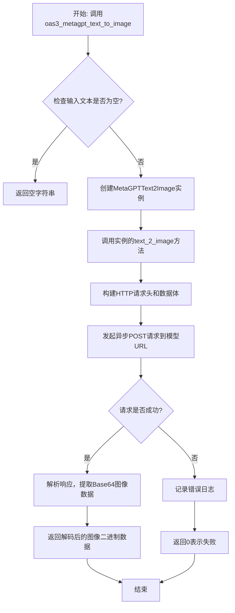
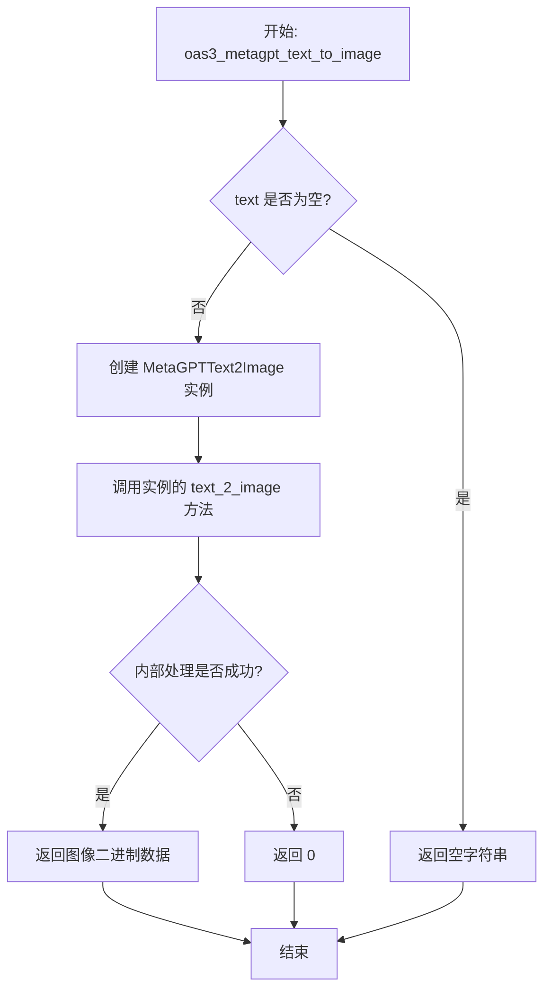
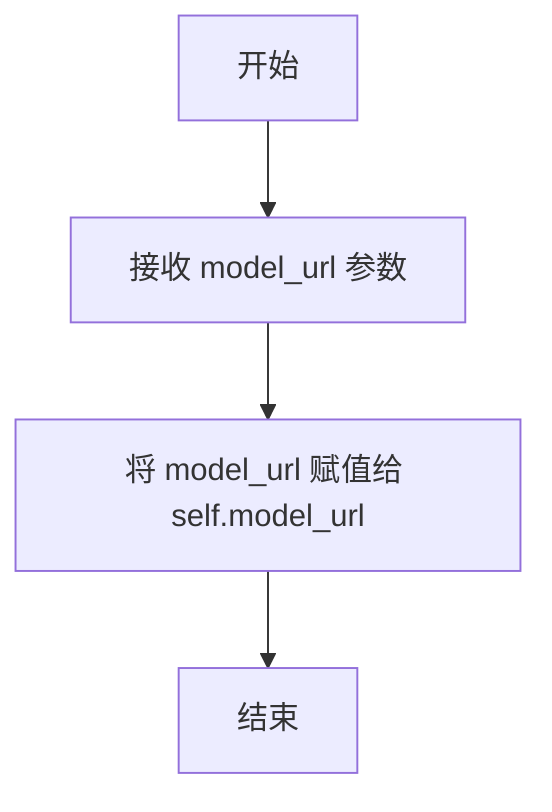
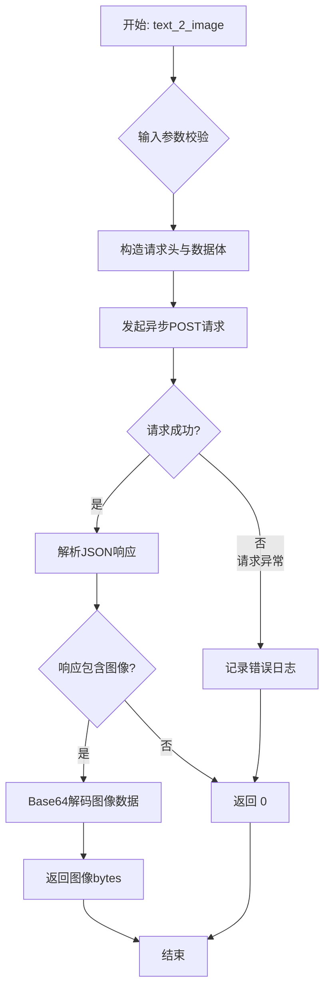

# `.\MetaGPT\metagpt\tools\metagpt_text_to_image.py` 详细设计文档

该文件实现了一个基于OAS3规范的文本转图像API，通过调用外部AI绘画模型服务（如Stable Diffusion WebUI），将输入的文本描述转换为指定尺寸的图像，并以Base64编码格式返回图像数据。

## 整体流程



## 类结构

```
MetaGPTText2Image (文本转图像服务类)
├── __init__ (构造函数)
└── text_2_image (核心转换方法)

全局函数
└── oas3_metagpt_text_to_image (对外暴露的异步API接口)
```

## 全局变量及字段


### `MetaGPTText2Image.model_url`
    
文本转图像模型API的URL地址

类型：`str`
    


### `ImageResult.images`
    
包含Base64编码图像数据的列表

类型：`List[str]`
    


### `ImageResult.parameters`
    
图像生成请求的参数配置信息

类型：`Dict`
    
    

## 全局函数及方法


### `oas3_metagpt_text_to_image`

这是一个异步函数，作为MetaGPT文本转图像功能的OAS3 API入口点。它接收文本描述、图像尺寸和模型URL，通过调用`MetaGPTText2Image`类的方法，将文本转换为图像数据并返回。如果输入文本为空，则直接返回空字符串。

参数：

-  `text`：`str`，用于图像转换的文本描述。
-  `size_type`：`str`，指定生成图像的尺寸，可选值为`'512x512'`或`'512x768'`，默认为`'512x512'`。
-  `model_url`：`str`，文本转图像模型服务的API URL。

返回值：`bytes`，返回Base64解码后的原始图像二进制数据。如果转换失败或输入文本为空，则返回空字节串`b""`。

#### 流程图



#### 带注释源码

```python
async def oas3_metagpt_text_to_image(text, size_type: str = "512x512", model_url=""):
    """Text to image

    :param text: The text used for image conversion.
    :param model_url: Model reset api
    :param size_type: One of ['512x512', '512x768']
    :return: The image data is returned in Base64 encoding.
    """
    # 1. 参数校验：如果输入文本为空，直接返回空字符串，避免不必要的网络请求。
    if not text:
        return ""
    # 2. 实例化业务逻辑类 `MetaGPTText2Image`，并调用其核心方法 `text_2_image` 执行文本转图像操作。
    # 3. 将 `text_2_image` 方法的返回值（图像数据或0）直接作为本函数的返回值。
    return await MetaGPTText2Image(model_url).text_2_image(text, size_type=size_type)
```


### `MetaGPTText2Image.__init__`

该方法用于初始化 `MetaGPTText2Image` 类的实例，设置用于文本到图像转换的模型 API URL。

参数：

- `model_url`：`str`，模型重置 API 的 URL 地址。

返回值：`None`，无返回值。

#### 流程图



#### 带注释源码

```python
def __init__(self, model_url):
    """
    :param model_url: Model reset api url
    """
    self.model_url = model_url  # 将传入的 model_url 参数赋值给实例变量 self.model_url
```


### `MetaGPTText2Image.text_2_image`

该方法是一个异步函数，其核心功能是调用一个外部的文本到图像生成API（例如Stable Diffusion WebUI的API），根据输入的文本提示词生成对应的图像，并将生成的图像数据以二进制字节流的形式返回。

参数：

-  `text`：`str`，用于生成图像的文本描述或提示词。
-  `size_type`：`str`，指定生成图像的尺寸。必须是预定义的字符串之一，例如 `'512x512'` 或 `'512x768'`。

返回值：`bytes`，成功时返回解码后的图像二进制数据；发生网络请求异常或API返回无图像时返回整数 `0`。

#### 流程图



#### 带注释源码

```python
async def text_2_image(self, text, size_type="512x512"):
    """Text to image

    :param text: The text used for image conversion.
    :param size_type: One of ['512x512', '512x768']
    :return: The image data is returned in Base64 encoding.
    """

    # 1. 设置请求头，指定内容类型为JSON
    headers = {"Content-Type": "application/json"}
    # 2. 解析尺寸参数，例如将"512x512"拆分为['512', '512']
    dims = size_type.split("x")
    # 3. 构造发送给图像生成API的请求数据体
    data = {
        "prompt": text,  # 核心：用户输入的文本提示
        "negative_prompt": "(easynegative:0.8),black, dark,Low resolution", # 负面提示词，引导模型避免生成某些内容
        "override_settings": {"sd_model_checkpoint": "galaxytimemachinesGTM_photoV20"}, # 指定使用的模型检查点
        "seed": -1, # 随机种子，-1表示随机
        "batch_size": 1, # 批次大小，每次生成1张图
        "n_iter": 1, # 迭代次数，生成1次
        "steps": 20, # 采样步数
        "cfg_scale": 11, # 提示词相关性系数，值越高越遵循提示词
        "width": int(dims[0]), # 图像宽度，从size_type解析
        "height": int(dims[1]), # 图像高度，从size_type解析
        "restore_faces": False, # 是否进行面部修复
        "tiling": False, # 是否生成可平铺图像
        "do_not_save_samples": False,
        "do_not_save_grid": False,
        "enable_hr": False, # 是否启用高分辨率修复
        "hr_scale": 2,
        "hr_upscaler": "Latent",
        "hr_second_pass_steps": 0,
        "hr_resize_x": 0,
        "hr_resize_y": 0,
        "hr_upscale_to_x": 0,
        "hr_upscale_to_y": 0,
        "truncate_x": 0,
        "truncate_y": 0,
        "applied_old_hires_behavior_to": None,
        "eta": None,
        "sampler_index": "DPM++ SDE Karras", # 指定采样器
        "alwayson_scripts": {},
    }

    # 4. 定义用于解析API响应的Pydantic数据模型
    class ImageResult(BaseModel):
        images: List # 响应中的图像数据列表（Base64编码字符串）
        parameters: Dict # 响应中的参数信息

    try:
        # 5. 创建异步HTTP会话并发送POST请求
        async with aiohttp.ClientSession() as session:
            async with session.post(self.model_url, headers=headers, json=data) as response:
                # 6. 将响应JSON解析为ImageResult对象
                result = ImageResult(**await response.json())
        # 7. 检查响应中是否包含图像数据
        if len(result.images) == 0:
            return 0 # API未返回图像，返回0
        # 8. 对Base64编码的图像字符串进行解码，得到二进制图像数据
        data = base64.b64decode(result.images[0])
        return data # 返回解码后的图像字节数据
    except requests.exceptions.RequestException as e:
        # 9. 捕获并记录网络请求相关的异常
        logger.error(f"An error occurred:{e}")
    # 10. 如果发生异常或之前返回0，最终返回0
    return 0
```


## 关键组件


### 文本到图像转换核心类 (MetaGPTText2Image)

该类封装了与远程文本到图像生成模型API交互的核心逻辑，负责构建请求参数、发送异步HTTP请求、处理响应并将返回的图像数据解码为二进制格式。

### 异步HTTP客户端会话管理

代码使用`aiohttp.ClientSession`进行异步HTTP通信，确保在高并发场景下的非阻塞网络I/O操作，提高了接口的响应能力和资源利用率。

### 请求参数构造器

根据输入的文本和尺寸类型，动态构建符合目标API规范的复杂JSON请求体，包含提示词、负面提示、模型检查点、图像尺寸、采样器、步数等大量生成参数。

### 响应数据模型 (ImageResult)

使用Pydantic的`BaseModel`定义了一个轻量级的数据验证模型，用于结构化解析API返回的JSON响应，确保`images`和`parameters`字段的类型安全。

### 全局异步接口函数 (oas3_metagpt_text_to_image)

作为模块的导出函数，提供了对`MetaGPTText2Image`类的简化调用入口，并包含了输入验证（如检查文本是否为空）和默认参数处理逻辑。


## 问题及建议


### 已知问题

-   **硬编码的模型参数**：`text_2_image` 方法中大部分参数（如 `negative_prompt`, `sd_model_checkpoint`, `steps`, `sampler_index` 等）都是硬编码的。这使得用户无法根据不同的生成需求（如风格、质量）灵活调整这些关键参数，降低了代码的通用性和可配置性。
-   **错误处理不完整**：`text_2_image` 方法仅捕获了 `requests.exceptions.RequestException` 异常。当使用 `aiohttp` 进行异步请求时，可能还会抛出 `aiohttp.ClientError` 或其子类异常（如连接超时、服务器错误等），这些异常未被捕获，可能导致程序意外终止。此外，对于 API 返回的非预期状态码（如 4xx, 5xx）或数据结构错误，没有进行充分的检查和处理。
-   **返回类型不一致**：`text_2_image` 方法在成功时返回 `bytes` 类型的图像数据，但在失败（如图像列表为空或发生异常）时返回整数 `0`。调用方需要额外判断返回值的类型，这违反了接口设计的一致性原则，容易引发调用错误。
-   **全局函数参数设计不合理**：`oas3_metagpt_text_to_image` 函数的 `model_url` 参数默认为空字符串 `""`。当调用者未提供此参数时，会将其传递给 `MetaGPTText2Image` 的构造函数，可能导致后续网络请求失败，且错误信息不直观。
-   **潜在的同步与异步混用风险**：代码中导入了 `requests` 库（同步）但主要使用 `aiohttp`（异步）进行网络请求。虽然当前只在异常处理中使用了 `requests.exceptions.RequestException`，但这种混用可能在未来引入同步阻塞调用，破坏异步架构的性能优势。

### 优化建议

-   **参数化配置**：将 `text_2_image` 方法中的硬编码参数（如 `negative_prompt`, `steps`, `sampler_index` 等）提取为类构造函数的参数或方法的可选参数（使用 `**kwargs` 或一个独立的配置字典/`Pydantic`模型）。这样可以为不同的使用场景提供定制化能力。
-   **增强错误处理**：
    1.  将异常捕获范围扩大到 `aiohttp.ClientError` 和更通用的 `Exception`，并记录详细的错误日志。
    2.  检查 HTTP 响应状态码（如 `response.status`），对于非 200 状态码抛出更具描述性的异常或返回错误标识。
    3.  对 `response.json()` 的解析结果进行更严格的验证，确保其符合 `ImageResult` 模型的预期，防止因 API 响应格式变化导致程序崩溃。
-   **统一返回类型**：重新设计 `text_2_image` 方法的返回值。建议在成功时返回 `bytes`，在失败时抛出明确的异常（如 `ImageGenerationError`），或者返回一个包含状态码、错误信息和可能的数据的 `Result` 对象。这能使接口契约更清晰。
-   **改进全局函数接口**：为 `oas3_metagpt_text_to_image` 函数的 `model_url` 参数设置一个更有意义的默认值（例如从环境变量读取），或者将其改为必需参数，并在文档中明确说明。同时，可以增加对 `text` 和 `model_url` 等输入参数的更早、更严格的验证。
-   **明确依赖与架构**：如果项目完全采用异步架构，考虑移除对 `requests` 库的依赖，以简化项目依赖并避免潜在的同步调用。将异常处理中的 `requests.exceptions.RequestException` 替换为 `aiohttp.ClientError` 或自定义的异常类。
-   **增加单元测试**：为 `MetaGPTText2Image` 类和 `oas3_metagpt_text_to_image` 函数编写单元测试，模拟不同的网络响应（成功、失败、超时）和输入情况，以确保代码的健壮性和重构的安全性。


## 其它


### 设计目标与约束

1. **功能目标**：提供一个异步的文本到图像生成API，能够根据输入的文本描述和指定的尺寸生成对应的图像，并以Base64解码后的二进制数据形式返回。
2. **性能目标**：通过异步HTTP客户端（aiohttp）实现非阻塞的网络请求，以提高在高并发场景下的响应能力和资源利用率。
3. **兼容性约束**：接口设计需遵循OAS3（OpenAPI Specification 3）规范，确保与标准API工具链的兼容性。输入参数`size_type`目前仅支持'512x512'和'512x768'两种预设尺寸。
4. **模型约束**：代码硬编码指定了使用的Stable Diffusion模型检查点为`galaxytimemachinesGTM_photoV20`，以及特定的采样器`DPM++ SDE Karras`等生成参数，这构成了与特定后端AI服务的强耦合。

### 错误处理与异常设计

1. **网络与请求异常**：使用`try-except`块捕获`requests.exceptions.RequestException`（注意：此处使用了同步requests库的异常，与异步的aiohttp不匹配，这是一个缺陷）。当HTTP请求失败时，记录错误日志并返回整数`0`作为错误标识。
2. **业务逻辑错误**：当后端服务成功响应但返回的`images`列表为空时，方法同样返回整数`0`。这用于处理模型生成失败或无输出等情况。
3. **输入验证**：在入口函数`oas3_metagpt_text_to_image`中，对必填参数`text`进行了非空检查，若为空则直接返回空字符串`""`。对于`size_type`和`model_url`，依赖调用方传入有效值，缺乏服务端或类内部的进一步验证。
4. **返回值歧义**：方法通过返回`0`或二进制图像数据来混合表示错误和成功，类型不统一（`int` vs `bytes`），调用方需要根据类型或值进行判断，增加了使用复杂度，不符合Python的“请求宽恕”风格，建议使用异常或明确的Result对象。

### 数据流与状态机

1. **主数据流**：
   * **输入**：用户调用`oas3_metagpt_text_to_image(text, size_type, model_url)`。
   * **处理**：函数实例化`MetaGPTText2Image`类，并调用其`text_2_image`方法。该方法构造包含提示词、尺寸及固定生成参数的JSON负载。
   * **网络交互**：通过aiohttp异步发送POST请求到指定的`model_url`。
   * **响应处理**：接收JSON响应，使用Pydantic模型`ImageResult`进行解析和验证。
   * **输出转换**：从响应中提取第一个图像的Base64字符串，解码为二进制数据。
   * **返回**：二进制图像数据（成功）或`0`（失败）。
2. **状态**：本模块基本无状态，`MetaGPTText2Image`类仅保存`model_url`。每次调用都是独立的，不涉及复杂的多步骤状态迁移。

### 外部依赖与接口契约

1. **外部服务依赖**：强依赖于一个提供Stable Diffusion WebUI兼容API的外部HTTP服务（由`model_url`指定）。该服务需支持特定的请求格式和参数。
2. **接口契约（下游服务）**：
   * **端点**：`POST {model_url}`
   * **请求头**：`Content-Type: application/json`
   * **请求体**：如代码中`data`字典所示，包含`prompt`, `negative_prompt`, `override_settings`, `width`, `height`, `sampler_index`等字段。
   * **响应体**：预期为JSON格式，包含一个`images`字段（值为Base64编码字符串的列表）和一个`parameters`字段。
3. **上游依赖（库）**：
   * `aiohttp`：用于发起异步HTTP请求。
   * `pydantic`：用于响应数据的模型验证和序列化。
   * `requests`：仅用于异常类型引用（存在不一致问题）。
   * `base64`：用于解码图像数据。
   * `metagpt.logs.logger`：用于项目内部日志记录。
4. **接口契约（提供给上游调用方）**：
   * **函数**：`async def oas3_metagpt_text_to_image(text, size_type: str = "512x512", model_url="")`
   * **返回值**：成功时返回`bytes`类型的图像数据；失败或输入无效时返回`0`（`int`）或空字符串`""`（`str`）。此契约不清晰。

    