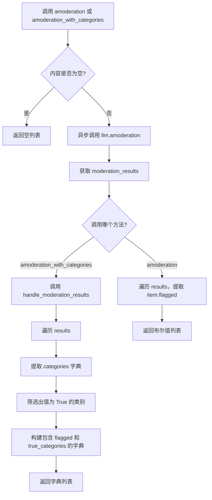
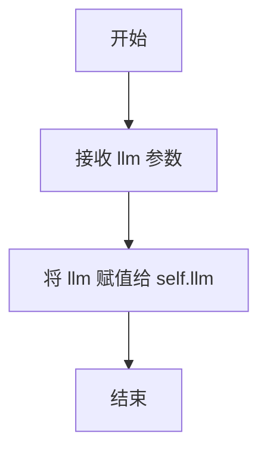
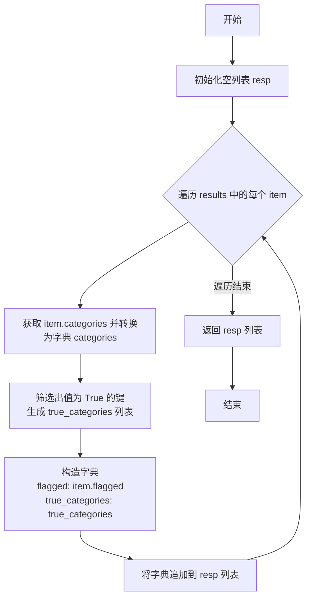
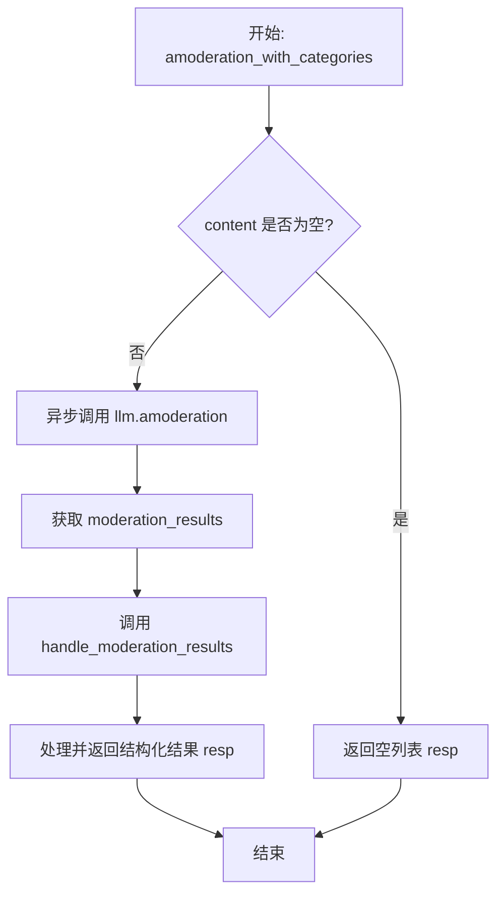

# `.\MetaGPT\metagpt\tools\moderation.py` 详细设计文档

该代码定义了一个内容审核类 `Moderation`，它封装了与大语言模型（LLM）提供的内容审核功能进行交互的逻辑。核心功能是异步调用LLM的审核接口，对输入的文本内容进行安全性和合规性检查，并处理返回的审核结果，可以返回详细的违规类别信息或简单的标记状态。

## 整体流程



## 类结构

```
Moderation
├── 字段: llm
├── 方法: __init__
├── 方法: handle_moderation_results
├── 方法: amoderation_with_categories
└── 方法: amoderation
```

## 全局变量及字段


### `Moderation.llm`
    
用于执行内容审核请求的大语言模型提供者实例。

类型：`BaseLLM`
    
    

## 全局函数及方法

### `Moderation.__init__`

初始化 `Moderation` 类的实例，用于内容审核。该方法接收一个 `BaseLLM` 实例作为参数，并将其存储在实例变量中，以便后续的审核方法调用。

参数：

- `llm`：`BaseLLM`，一个实现了 `BaseLLM` 接口的实例，用于执行内容审核的异步调用。

返回值：`None`，此方法为构造函数，不返回任何值。

#### 流程图



#### 带注释源码

```python
def __init__(self, llm: BaseLLM):
    # 初始化 Moderation 实例，存储一个 BaseLLM 实例以供后续使用
    self.llm = llm
```

### `Moderation.handle_moderation_results`

该方法用于处理内容审核（Moderation）API返回的原始结果，将其转换为一个更简洁、结构化的列表。它遍历每个审核结果项，提取出被标记为违规（flagged）的类别（categories），并生成一个包含是否违规标志和具体违规类别列表的字典。

参数：

- `results`：`list`，内容审核API返回的原始结果列表。列表中的每个元素应包含`flagged`（布尔值，表示是否违规）和`categories`（一个包含多个类别及其是否违规标志的对象）属性。

返回值：`list`，一个字典列表。每个字典包含两个键：`"flagged"`（布尔值，表示该项内容是否被标记为违规）和`"true_categories"`（列表，包含所有被标记为违规的具体类别名称）。

#### 流程图



#### 带注释源码

```python
def handle_moderation_results(self, results):
    # 初始化一个空列表，用于存储处理后的结果
    resp = []
    # 遍历输入的原始审核结果列表
    for item in results:
        # 将 item.categories 对象转换为字典形式，便于处理
        categories = item.categories.dict()
        # 使用列表推导式，筛选出 categories 字典中值为 True 的键（即被标记违规的类别）
        true_categories = [category for category, item_flagged in categories.items() if item_flagged]
        # 构造一个新的字典，包含原始的是否违规标志和筛选出的违规类别列表
        resp.append({"flagged": item.flagged, "true_categories": true_categories})
    # 返回处理后的结果列表
    return resp
```

### `Moderation.amoderation_with_categories`

该方法是一个异步方法，用于对输入的文本内容进行内容审核，并返回详细的审核结果。它调用底层大语言模型（LLM）的异步审核接口，获取原始的审核结果后，通过`handle_moderation_results`方法进行处理，提取出每条内容是否被标记（`flagged`）以及具体触发了哪些违规类别（`true_categories`），最终返回一个结构化的结果列表。

参数：

- `content`：`Union[str, list[str]]`，需要进行内容审核的文本。可以是单个字符串，也可以是一个字符串列表。

返回值：`list`，返回一个列表，列表中的每个元素是一个字典。每个字典包含两个键：`"flagged"`（布尔值，表示该条内容是否被标记为违规）和`"true_categories"`（列表，包含该条内容触发的具体违规类别名称）。

#### 流程图



#### 带注释源码

```python
async def amoderation_with_categories(self, content: Union[str, list[str]]):
    # 初始化返回结果列表
    resp = []
    # 检查输入内容是否为空
    if content:
        # 异步调用底层LLM的审核接口
        moderation_results = await self.llm.amoderation(content=content)
        # 调用内部方法处理原始审核结果，提取关键信息
        resp = self.handle_moderation_results(moderation_results.results)
    # 返回处理后的结果列表
    return resp
```

### `Moderation.amoderation`

该方法是一个异步方法，用于对输入的文本内容进行内容审核。它调用底层大语言模型（LLM）的异步审核接口，并返回一个布尔值列表，指示每段输入内容是否被标记为违规。

参数：

- `content`：`Union[str, list[str]]`，需要进行内容审核的文本。可以是单个字符串，也可以是一个字符串列表。

返回值：`list[bool]`，返回一个布尔值列表。列表中的每个布尔值对应输入内容列表中的每一项（如果输入是单个字符串，则返回一个单元素列表），`True` 表示该内容被标记为违规，`False` 表示未违规。

#### 流程图

```mermaid
flowchart TD
    A[开始: amoderation(content)] --> B{content 是否为空?}
    B -- 是 --> C[返回空列表 resp = []]
    B -- 否 --> D[异步调用 llm.amoderation(content)]
    D --> E[获取审核结果 moderation_results]
    E --> F[遍历 results 中的每一项 item]
    F --> G[将 item.flagged 添加到 resp 列表]
    G --> H{遍历完成?}
    H -- 否 --> F
    H -- 是 --> I[返回 resp 列表]
    C --> I
```

#### 带注释源码

```python
async def amoderation(self, content: Union[str, list[str]]):
    # 初始化一个空列表，用于存储最终的审核结果（布尔值）
    resp = []
    # 检查输入内容是否为空，如果为空则直接返回空列表
    if content:
        # 异步调用底层LLM的审核接口，传入待审核的内容
        moderation_results = await self.llm.amoderation(content=content)
        # 从返回结果中提取详细的审核结果列表
        results = moderation_results.results
        # 遍历审核结果列表中的每一项
        for item in results:
            # 将每一项的 `flagged` 属性（布尔值，表示是否违规）添加到结果列表中
            resp.append(item.flagged)
    # 返回包含所有内容审核标记的布尔值列表
    return resp
```

## 关键组件

### Moderation 类

封装了内容审核的核心逻辑，通过调用底层大语言模型（LLM）的审核接口，对输入内容进行安全审查，并提供了两种不同粒度的结果处理方法。

### BaseLLM 依赖

作为外部依赖注入的底层大语言模型提供者，负责实际调用内容审核的API，`Moderation` 类通过调用其 `amoderation` 方法获取原始的审核结果。

### 审核结果处理器 (`handle_moderation_results`)

一个内部工具方法，用于将底层LLM返回的原始、结构化的审核结果（包含多个分类及其是否触发的布尔值）转换并提炼为更简洁的格式，仅提取被标记为违规的分类名称列表。

### 异步审核方法 (`amoderation_with_categories` 与 `amoderation`)

两个面向外部的核心异步方法。`amoderation_with_categories` 返回详细的审核结果，包括是否违规及具体的违规分类；`amoderation` 则仅返回一个布尔值列表，指示每条输入内容是否违规。两者都依赖于底层的 `BaseLLM.amoderation` 调用。

## 问题及建议


### 已知问题

-   **方法功能重叠与代码重复**：`amoderation` 和 `amoderation_with_categories` 两个方法的核心逻辑高度相似，都调用了 `self.llm.amoderation` 并处理结果，这违反了 DRY（Don‘t Repeat Yourself）原则，增加了维护成本。
-   **同步与异步方法混合**：`handle_moderation_results` 是一个同步方法，但在 `amoderation_with_categories` 中被异步方法调用。虽然这在Python中允许，但在一个设计上主要处理异步操作的类中，混合使用同步方法可能带来不必要的上下文切换或潜在的阻塞风险，尤其是在处理大量数据时。
-   **错误处理缺失**：代码中没有对 `self.llm.amoderation` 调用可能抛出的异常（如网络错误、API错误）进行捕获和处理。这可能导致上层调用者收到未处理的异常，影响程序的健壮性。
-   **空内容处理逻辑不一致**：`amoderation` 和 `amoderation_with_categories` 方法对空 `content` 的处理是直接返回空列表 `[]`。虽然这是一种处理方式，但可能掩盖了调用者传入无效数据的错误。更严谨的做法可能是抛出 `ValueError` 或返回一个明确的错误标识。

### 优化建议

-   **重构以消除重复代码**：可以创建一个私有的异步辅助方法（如 `_fetch_moderation_results`）来封装调用 `self.llm.amoderation` 和检查 `content` 是否为空的逻辑。然后让 `amoderation` 和 `amoderation_with_categories` 调用这个辅助方法，并分别进行结果提取。这样核心逻辑只在一处维护。
-   **统一异步处理**：考虑将 `handle_moderation_results` 方法也改为异步方法（`async def`），使其与类的整体异步风格保持一致。或者，如果其逻辑简单且确定不会成为性能瓶颈，保持同步并明确其职责为纯数据转换也是可接受的，但需在文档中说明。
-   **增加异常处理**：在 `amoderation` 和 `amoderation_with_categories` 方法中，使用 `try-except` 块捕获 `self.llm.amoderation` 可能抛出的异常。可以记录日志，并根据业务需求决定是重新抛出异常、返回一个表示错误的结果，还是进行降级处理。
-   **明确空内容策略**：重新评估空 `content` 的处理策略。如果业务上不允许空内容，应在方法开始处进行参数校验并抛出 `ValueError`。如果允许，应明确返回一个有意义的值（例如，对于列表输入，返回一个与输入长度相同的、所有元素为 `False` 或对应空分类的列表），以保持输入输出的一致性。当前直接返回空列表 `[]` 对于列表输入可能不够直观。
-   **增强类型提示**：`handle_moderation_results` 方法的 `results` 参数和返回值可以添加更精确的类型提示（例如使用 `from openai.types import ModerationCreateResponse` 或定义自己的 `TypedDict`/`dataclass`），以提高代码的可读性和 IDE 支持。


## 其它


### 设计目标与约束

本模块的设计目标是提供一个轻量级、可扩展的内容审核接口，封装底层大语言模型（LLM）的审核能力，并向调用者提供两种不同粒度的审核结果：一种是简单的布尔值标记（是否违规），另一种是包含具体违规类别的详细信息。其核心约束包括：1）依赖抽象的 `BaseLLM` 接口，确保与具体 LLM 供应商解耦；2）支持同步和异步操作（当前主要为异步）；3）输入支持单条字符串或字符串列表，以批量处理内容。

### 错误处理与异常设计

当前代码中的错误处理较为简单。主要依赖 `BaseLLM.amoderation` 方法可能抛出的异常（如网络错误、API调用失败等），这些异常会直接向上层传播。`handle_moderation_results` 方法假设输入数据格式符合预期，未对 `item.categories` 的结构做防御性检查。建议的增强包括：1）在 `amoderation_with_categories` 和 `amoderation` 方法中增加 `try-except` 块，捕获 `llm.amoderation` 调用异常，并可能返回包含错误信息的结构化结果或重试；2）在 `handle_moderation_results` 中增加对输入数据 `results` 和 `item.categories` 的验证，防止因数据格式不符导致的运行时错误。

### 数据流与状态机

模块的数据流清晰且线性：1）**输入**：用户调用 `amoderation` 或 `amoderation_with_categories` 方法，传入待审核的文本内容（`content`）。2）**处理**：方法内部检查 `content` 有效性，然后通过 `self.llm.amoderation` 异步调用底层 LLM 服务。3）**转换**：获取 LLM 返回的原始结果后，`amoderation` 方法直接提取 `flagged` 布尔值列表；`amoderation_with_categories` 则调用 `handle_moderation_results` 方法，将原始的分类标记字典转换为仅包含被标记为真的分类名称列表。4）**输出**：返回处理后的结果列表。整个模块是无状态的，不维护任何内部状态机，每次调用都是独立的。

### 外部依赖与接口契约

1.  **外部依赖**：
    *   **`BaseLLM` 抽象类**：定义在 `metagpt.provider.base_llm` 模块中。这是本模块的核心依赖，要求其实现必须提供一个返回审核结果的异步方法 `amoderation`。该方法的返回对象应包含一个 `results` 属性，该属性是一个列表，列表中的每个元素都应包含 `flagged`（布尔值）和 `categories`（一个可通过 `.dict()` 方法转换为字典的对象，字典键为分类名，值为布尔值）属性。
2.  **接口契约**：
    *   **`Moderation.amoderation(content: Union[str, List[str]]) -> Awaitable[List[bool]]`**：契约规定，输入内容后，返回一个异步可等待对象，其最终结果为与输入内容顺序对应的布尔值列表，表示每条内容是否被标记为违规。
    *   **`Moderation.amoderation_with_categories(content: Union[str, List[str]]) -> Awaitable[List[Dict]]`**：契约规定，输入内容后，返回一个异步可等待对象，其最终结果为字典列表。每个字典包含 `"flagged"`（布尔值）和 `"true_categories"`（字符串列表）两个键，分别表示是否违规及具体的违规分类。
    *   **`Moderation.handle_moderation_results(results) -> List[Dict]`**：这是一个内部方法，但其契约是接收符合 `BaseLLM.amoderation` 返回格式的 `results` 列表，并返回上述格式的字典列表。它不处理空输入或格式错误。

### 性能考量与扩展性

1.  **性能**：性能主要受限于底层 `BaseLLM.amoderation` 的网络 I/O 和 LLM 服务端的处理时间。模块本身逻辑简单，开销可忽略。批量处理（传入列表）通常比多次调用单条处理更高效。
2.  **扩展性**：
    *   **审核策略扩展**：当前直接传递所有内容给 LLM。未来可以扩展前置过滤（如基于关键词的简单过滤）、后置处理（如根据 `true_categories` 应用不同动作）或自定义分类映射/聚合逻辑。这些可以通过在 `handle_moderation_results` 前后添加钩子函数或策略类来实现。
    *   **结果缓存**：对于重复或相似的内容，可以引入缓存机制（如基于内容哈希）来减少对 LLM 服务的调用，提升响应速度并降低成本。
    *   **异步并发**：虽然方法本身是异步的，但模块未提供对大量内容进行分片并发调用的机制。对于超长列表，可以考虑在模块内部实现分片并发调用 `llm.amoderation`。
    *   **多 LLM 供应商降级/择优**：当前强依赖一个 `BaseLLM` 实例。可以扩展为接受多个 LLM 实例，在主服务失败时自动降级到备用服务，或根据成本、速度、准确率择优选择。

    