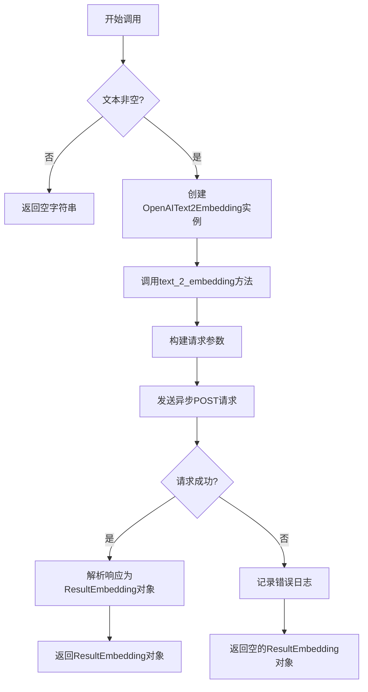
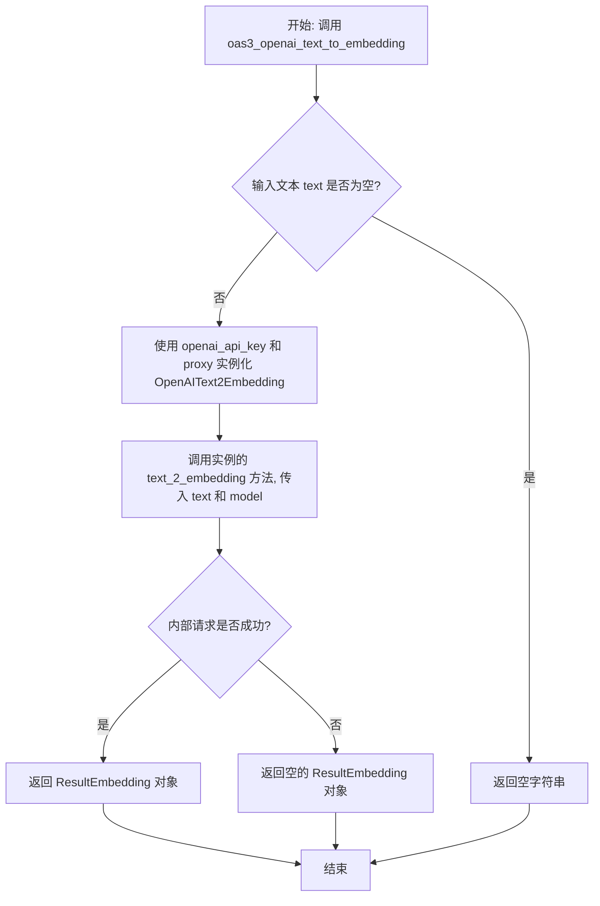
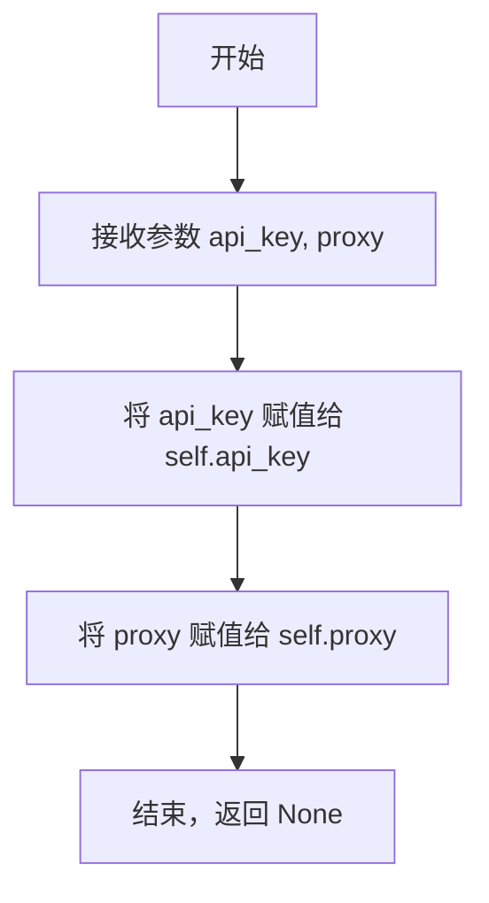

# `.\MetaGPT\metagpt\tools\openai_text_to_embedding.py` 详细设计文档

该代码实现了一个基于OpenAI API的文本转嵌入向量功能，通过封装OpenAI的Embeddings API，提供异步调用接口将文本转换为向量表示，并支持代理配置和错误处理。

## 整体流程



## 类结构

```
BaseModel (Pydantic基类)
├── Embedding (嵌入向量模型)
├── Usage (令牌使用统计模型)
└── ResultEmbedding (API响应模型)
OpenAIText2Embedding (业务逻辑类)
```

## 全局变量及字段


### `Embedding.object`
    
表示嵌入对象的类型，固定为'embedding'。

类型：`str`
    


### `Embedding.embedding`
    
嵌入向量，由浮点数列表组成，其长度取决于所使用的模型。

类型：`List[float]`
    


### `Embedding.index`
    
嵌入向量在返回列表中的索引位置。

类型：`int`
    


### `Usage.prompt_tokens`
    
提示文本消耗的令牌数量。

类型：`int`
    


### `Usage.total_tokens`
    
总消耗的令牌数量。

类型：`int`
    


### `ResultEmbedding.object_`
    
响应对象的类型，通常为'list'。

类型：`str`
    


### `ResultEmbedding.data`
    
包含多个嵌入向量的列表。

类型：`List[Embedding]`
    


### `ResultEmbedding.model`
    
用于生成嵌入向量的模型名称。

类型：`str`
    


### `ResultEmbedding.usage`
    
令牌使用情况的统计信息。

类型：`Usage`
    


### `OpenAIText2Embedding.api_key`
    
用于访问OpenAI API的密钥。

类型：`str`
    


### `OpenAIText2Embedding.proxy`
    
可选的代理服务器地址，用于网络请求。

类型：`str`
    
    

## 全局函数及方法


### `oas3_openai_text_to_embedding`

这是一个异步全局函数，作为OpenAI文本转嵌入向量API的便捷入口。它接收文本、API密钥等参数，创建一个`OpenAIText2Embedding`类的实例，并调用其`text_2_embedding`方法来获取文本的向量表示。如果输入文本为空，则直接返回空字符串。

参数：

-  `text`：`str`，需要进行向量化处理的文本内容。
-  `openai_api_key`：`str`，用于访问OpenAI API的密钥。
-  `model`：`str`，可选，默认为`"text-embedding-ada-002"`。指定用于生成嵌入向量的模型。
-  `proxy`：`str`，可选，默认为空字符串。指定网络请求使用的代理服务器地址。

返回值：`ResultEmbedding`，一个包含嵌入向量数据、模型信息和令牌使用情况的Pydantic模型对象。如果输入文本为空，则返回空字符串`""`。

#### 流程图



#### 带注释源码

```python
async def oas3_openai_text_to_embedding(text, openai_api_key: str, model="text-embedding-ada-002", proxy: str = ""):
    """Text to embedding

    :param text: The text used for embedding.
    :param model: One of ['text-embedding-ada-002'], ID of the model to use. For more details, checkout: `https://api.openai.com/v1/models`.
    :param config: OpenAI config with API key, For more details, checkout: `https://platform.openai.com/account/api-keys`
    :return: A json object of :class:`ResultEmbedding` class if successful, otherwise `{}`.
    """
    # 1. 参数校验：如果输入文本为空，直接返回空字符串，避免不必要的API调用。
    if not text:
        return ""
    # 2. 创建业务逻辑对象：使用传入的API密钥和代理配置实例化 OpenAIText2Embedding 类。
    # 3. 委托调用：调用实例的 text_2_embedding 方法执行具体的向量化请求，并返回其结果。
    return await OpenAIText2Embedding(api_key=openai_api_key, proxy=proxy).text_2_embedding(text, model=model)
```


### `OpenAIText2Embedding.__init__`

`OpenAIText2Embedding` 类的构造函数，用于初始化一个 OpenAI 文本转嵌入向量的客户端实例。它接收必要的认证和网络配置参数，为后续的 API 调用做好准备。

参数：

-  `api_key`：`str`，用于访问 OpenAI API 的密钥。详情请查看：`https://platform.openai.com/account/api-keys`
-  `proxy`：`str`，可选的代理服务器地址，用于配置网络请求的代理。

返回值：`None`，此构造函数不返回任何值。

#### 流程图



#### 带注释源码

```python
def __init__(self, api_key: str, proxy: str):
    """
    :param openai_api_key: OpenAI API key, For more details, checkout: `https://platform.openai.com/account/api-keys`
    """
    # 将传入的 API 密钥保存到实例变量中，供后续 API 调用时使用。
    self.api_key = api_key
    # 将传入的代理地址保存到实例变量中，用于配置网络请求的代理。
    self.proxy = proxy
```


### `OpenAIText2Embedding.text_2_embedding`

该方法通过调用OpenAI的Embeddings API，将输入的文本转换为对应的向量表示（embedding）。它异步地发送HTTP POST请求到OpenAI端点，处理响应并返回结构化的结果。如果请求失败，它会记录错误并返回一个空的`ResultEmbedding`对象。

参数：

-  `text`：`str`，需要进行向量化的文本内容。
-  `model`：`str`，指定使用的模型ID，默认为`"text-embedding-ada-002"`。

返回值：`ResultEmbedding`，一个包含向量化结果、模型信息和token使用情况的结构化对象。如果请求过程中发生异常，则返回一个空的`ResultEmbedding`对象。

#### 流程图

```mermaid
flowchart TD
    A[开始: text_2_embedding] --> B[准备请求参数<br>headers, data, url, proxies]
    B --> C{代理proxy存在?}
    C -- 是 --> D[proxies = {'proxy': proxy}]
    C -- 否 --> E[proxies = {}]
    D --> F
    E --> F[发起异步POST请求]
    F --> G{请求成功?}
    G -- 是 --> H[解析响应JSON数据]
    H --> I[构造并返回ResultEmbedding对象]
    G -- 否<br>发生异常 --> J[记录错误日志]
    J --> K[返回空的ResultEmbedding对象]
    I --> L[结束]
    K --> L
```

#### 带注释源码

```python
async def text_2_embedding(self, text, model="text-embedding-ada-002"):
    """Text to embedding

    :param text: The text used for embedding.
    :param model: One of ['text-embedding-ada-002'], ID of the model to use. For more details, checkout: `https://api.openai.com/v1/models`.
    :return: A json object of :class:`ResultEmbedding` class if successful, otherwise `{}`.
    """

    # 1. 准备请求参数
    # 如果设置了代理，则配置代理字典，否则为空字典
    proxies = {"proxy": self.proxy} if self.proxy else {}
    # 设置HTTP请求头，包含内容类型和认证信息
    headers = {"Content-Type": "application/json", "Authorization": f"Bearer {self.api_key}"}
    # 构造请求体数据
    data = {"input": text, "model": model}
    # OpenAI Embeddings API 端点URL
    url = "https://api.openai.com/v1/embeddings"
    
    try:
        # 2. 发起异步HTTP请求
        # 创建异步HTTP会话
        async with aiohttp.ClientSession() as session:
            # 发送POST请求，包含headers、json数据和代理设置
            async with session.post(url, headers=headers, json=data, **proxies) as response:
                # 3. 处理响应
                # 将响应内容解析为JSON格式
                data = await response.json()
                # 4. 构造并返回结果对象
                # 使用解析后的数据实例化ResultEmbedding Pydantic模型并返回
                return ResultEmbedding(**data)
    except requests.exceptions.RequestException as e:
        # 5. 异常处理
        # 如果发生网络请求异常，记录错误日志
        logger.error(f"An error occurred:{e}")
    # 6. 默认返回
    # 如果发生异常或请求失败，返回一个空的ResultEmbedding对象
    return ResultEmbedding()
```


## 关键组件


### OpenAI API 客户端封装 (`OpenAIText2Embedding`)

封装了调用 OpenAI Embeddings API 的核心逻辑，负责处理认证、请求构造、代理设置以及异步网络通信，将文本输入转换为向量表示。

### 数据模型 (`Embedding`, `Usage`, `ResultEmbedding`)

使用 Pydantic 定义了与 OpenAI Embeddings API 响应数据结构严格对应的数据模型，用于类型安全的请求结果解析和验证，包括嵌入向量本身、使用量统计和完整的响应体。

### 异步网络请求处理

基于 `aiohttp` 库实现了非阻塞的异步 HTTP POST 请求，用于高效地向 `https://api.openai.com/v1/embeddings` 端点发送数据并接收响应，支持通过代理进行连接。

### 全局便捷函数 (`oas3_openai_text_to_embedding`)

提供了一个顶层的异步函数接口，简化了 `OpenAIText2Embedding` 类的实例化和方法调用过程，是模块的主要对外使用入口。

### 错误处理与日志记录

通过 `try-except` 块捕获网络请求异常（`requests.exceptions.RequestException`），并使用 `metagpt.logs.logger` 记录错误信息，确保在 API 调用失败时程序能优雅降级并返回一个空的 `ResultEmbedding` 对象。


## 问题及建议


### 已知问题

-   **混合使用同步和异步HTTP库**：`OpenAIText2Embedding.text_2_embedding` 方法内部使用了异步的 `aiohttp` 库进行网络请求，但在异常处理块中却捕获了同步库 `requests` 的 `RequestException` 异常。由于 `aiohttp` 引发的异常类型（如 `aiohttp.ClientError`）与 `requests.exceptions.RequestException` 不同，此处的异常处理逻辑可能无法正确捕获到实际的网络请求错误，导致错误被静默忽略或日志记录不准确。
-   **错误处理不完整**：当发生异常时，方法直接返回一个空的 `ResultEmbedding()` 对象。这丢失了错误上下文（如HTTP状态码、错误信息），使得调用方难以区分“成功但无数据”和“请求失败”这两种情况，不利于调试和构建健壮的上层逻辑。
-   **代理配置参数名错误**：在构造 `aiohttp` 请求时，使用了 `proxies = {"proxy": self.proxy}`。然而，`aiohttp` 的 `session.post` 方法接受的是 `proxy` 参数（一个字符串形式的代理URL），而不是一个字典。当前的写法会导致代理配置无效。
-   **全局函数参数命名不一致**：全局函数 `oas3_openai_text_to_embedding` 的文档字符串中提到了 `config` 参数，但函数签名中实际使用的是 `openai_api_key` 参数，这会造成文档与实际代码的混淆。
-   **输入验证过于简单**：全局函数 `oas3_openai_text_to_embedding` 仅检查 `text` 是否为空，若为空则返回空字符串 `""`。这与函数声明的返回值类型（应为 `ResultEmbedding` 对象）不符，破坏了接口契约的一致性。

### 优化建议

-   **统一HTTP异常处理**：将 `try-except` 块中捕获的异常类型从 `requests.exceptions.RequestException` 改为 `aiohttp.ClientError` 或其更具体的子类（如 `aiohttp.ClientConnectionError`, `aiohttp.ClientResponseError`），以确保能正确捕获 `aiohttp` 库引发的网络异常。
-   **改进错误处理与返回机制**：在发生异常时，不应简单地返回一个空对象。建议可以重新抛出异常，或者返回一个包含错误信息的特定对象（例如，在 `ResultEmbedding` 中增加一个 `error` 字段）。至少，应该在日志中记录更详细的错误信息（如响应状态码和内容）。
-   **修正代理配置**：将 `proxies = {"proxy": self.proxy}` 修改为 `proxy=self.proxy`（如果 `self.proxy` 是有效的代理URL字符串），以确保代理设置能正确传递给 `aiohttp`。
-   **修正文档与代码一致性**：更新全局函数 `oas3_openai_text_to_embedding` 的文档字符串，使其参数描述与函数签名保持一致，将 `:param config:` 的描述更正为 `:param openai_api_key:`。
-   **增强输入验证与错误返回**：在全局函数 `oas3_openai_text_to_embedding` 中，如果 `text` 为空，应返回一个空的 `ResultEmbedding` 对象（或一个表示无效输入的特定结果），而不是返回一个字符串 `""`，以保持函数返回值类型的一致性。同时，应考虑验证 `openai_api_key` 等必要参数。
-   **考虑配置管理**：建议将 `api_key` 和 `proxy` 等配置信息通过一个统一的配置对象或环境变量进行管理，而不是在每次调用时传递，以提高代码的可维护性和安全性。
-   **增加模型参数验证**：`text_2_embedding` 方法的 `model` 参数目前没有进行有效性验证。虽然注释中提到了可用模型，但代码层面可以增加一个检查，如果传入不支持的模型名称，可以提前给出更友好的错误提示。


## 其它


### 设计目标与约束

本模块的核心设计目标是提供一个简洁、异步的接口，用于调用OpenAI的文本嵌入（Text-to-Embedding）API。主要约束包括：
1.  **功能单一性**：模块专注于将文本转换为嵌入向量，不处理其他AI任务。
2.  **异步支持**：为适应现代异步应用架构，核心功能使用`aiohttp`实现异步HTTP请求。
3.  **数据模型化**：使用Pydantic模型严格定义请求和响应的数据结构，确保类型安全并便于序列化/反序列化。
4.  **配置外部化**：API密钥、代理等配置信息通过构造函数参数传入，而非硬编码，提高了模块的可配置性和安全性。
5.  **向后兼容性**：提供了同步请求异常处理（`requests.exceptions.RequestException`）的捕获，作为错误处理的一部分，但核心流程是异步的。

### 错误处理与异常设计

模块的错误处理策略如下：
1.  **网络与API请求异常**：在`OpenAIText2Embedding.text_2_embedding`方法中，使用`try-except`块捕获`requests.exceptions.RequestException`异常（尽管使用了`aiohttp`，此处可能意在捕获更广泛的请求相关错误，或为历史代码遗留）。当发生此类异常时，记录错误日志并返回一个空的`ResultEmbedding`对象。
2.  **输入验证**：在导出的全局函数`oas3_openai_text_to_embedding`中，对输入参数`text`进行了非空检查。如果`text`为空字符串，则直接返回空字符串`""`。这是一种前置的输入验证，防止无效请求。
3.  **静默失败**：无论是网络异常还是空输入，当前设计都倾向于返回一个“空”结果（空对象或空字符串），而不是抛出异常。这要求调用者检查返回结果的有效性。
4.  **日志记录**：使用项目内的`logger`记录错误信息，便于问题追踪。

### 数据流与状态机

本模块的数据流相对简单线性，不涉及复杂的状态机：
1.  **初始化**：用户创建`OpenAIText2Embedding`实例，提供`api_key`和`proxy`。
2.  **请求发起**：调用`text_2_embedding`方法（或通过包装函数`oas3_openai_text_to_embedding`），传入`text`和可选的`model`参数。
3.  **请求构建**：方法内部构建HTTP请求所需的URL、Headers和JSON Body。
4.  **网络交互**：通过`aiohttp`异步发送POST请求到OpenAI API端点。
5.  **响应处理**：接收JSON响应，通过Pydantic模型`ResultEmbedding`解析并验证数据结构。
6.  **结果返回**：将解析后的`ResultEmbedding`对象返回给调用者。若过程中发生错误，则返回一个默认构造的空`ResultEmbedding`对象。

### 外部依赖与接口契约

1.  **外部服务依赖**：
    *   **OpenAI Embeddings API**：强依赖此外部HTTP API。模块的行为和返回结果完全由该API的接口契约决定。代码中硬编码了API端点URL（`https://api.openai.com/v1/embeddings`）和默认模型（`text-embedding-ada-002`）。

2.  **第三方库依赖**：
    *   `aiohttp`：用于执行异步HTTP请求。
    *   `requests`：虽然核心逻辑使用`aiohttp`，但代码中导入了`requests`库并用于异常捕获，构成了间接依赖。
    *   `pydantic`：用于定义和验证数据模型（`Embedding`, `Usage`, `ResultEmbedding`）。
    *   `metagpt.logs`：项目内部日志模块，用于记录错误信息。

3.  **接口契约（导出函数）**：
    *   `async def oas3_openai_text_to_embedding(text, openai_api_key: str, model="text-embedding-ada-002", proxy: str = "")`：这是模块对外提供的主要服务接口。它接受文本、API密钥等参数，并返回一个`ResultEmbedding`对象或空字符串。其行为契约包括输入验证和内部`OpenAIText2Embedding`类的调用封装。

    