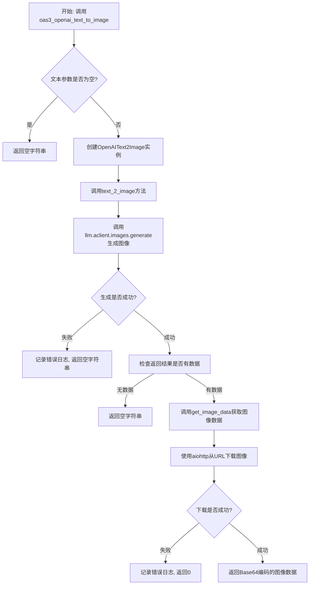
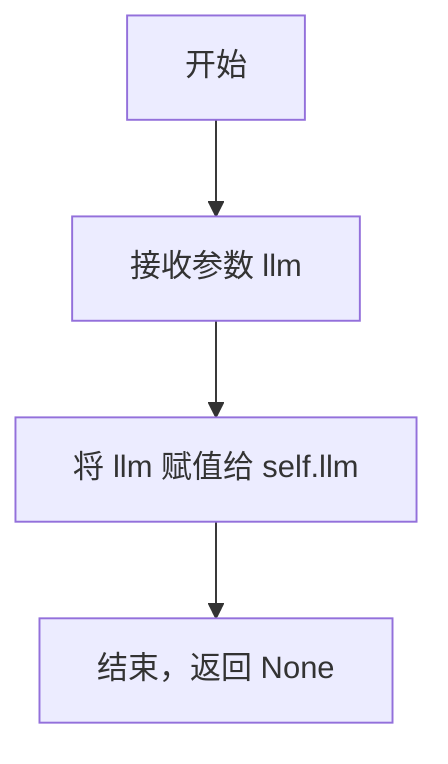
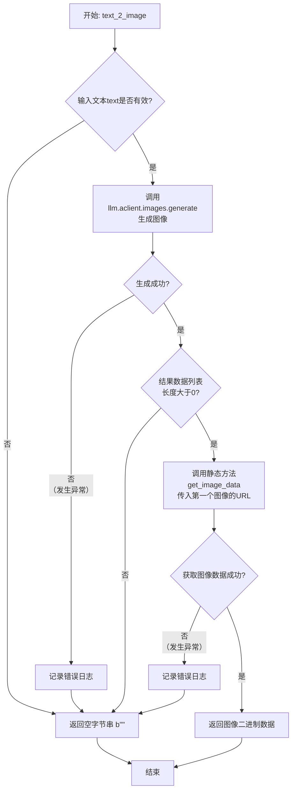

# `.\MetaGPT\metagpt\tools\openai_text_to_image.py` 详细设计文档

该代码实现了一个基于OpenAI API的文本转图像功能，通过封装OpenAI的图像生成接口，将文本描述转换为指定尺寸的图像，并以Base64编码格式返回图像数据。

## 整体流程



## 类结构

```
OpenAIText2Image
├── 字段: llm
├── 方法: __init__
├── 方法: text_2_image
└── 静态方法: get_image_data
```

## 全局变量及字段


### `OpenAIText2Image.llm`
    
用于访问OpenAI图像生成API的LLM客户端实例。

类型：`BaseLLM`
    
    

## 全局函数及方法


### `oas3_openai_text_to_image`

这是一个异步的全局函数，作为OpenAI文本转图像功能的对外接口。它接收一段描述性文本，通过指定的OpenAI模型生成对应图像，并最终返回图像的二进制数据。

参数：

-  `text`：`str`，用于生成图像的描述性文本。
-  `size_type`：`str`，指定生成图像的尺寸，可选值为 `'256x256'`、`'512x512'` 或 `'1024x1024'`，默认为 `'1024x1024'`。
-  `llm`：`BaseLLM`，一个封装了OpenAI客户端等配置的LLM实例，用于发起图像生成请求。

返回值：`bytes`，成功时返回图像的二进制数据；如果输入文本为空或处理过程中发生错误，则返回空字节串 `b""`。

#### 流程图

```mermaid
flowchart TD
    A[开始: 调用 oas3_openai_text_to_image] --> B{text 参数是否为空?}
    B -- 是 --> C[返回空字符串 ""]
    B -- 否 --> D[创建 OpenAIText2Image(llm) 实例]
    D --> E[调用实例的 text_2_image 方法]
    E --> F{调用 OpenAI API 生成图像}
    F -- 成功 --> G{结果中是否有图像URL?}
    G -- 是 --> H[调用 get_image_data 获取图像数据]
    H --> I[返回图像二进制数据]
    G -- 否 --> J[返回空字符串 ""]
    F -- 失败 --> K[记录错误日志]
    K --> J
    C --> L[结束]
    I --> L
    J --> L
```

#### 带注释源码

```
async def oas3_openai_text_to_image(text, size_type: str = "1024x1024", llm: BaseLLM = None):
    """Text to image

    :param text: The text used for image conversion.
    :param size_type: One of ['256x256', '512x512', '1024x1024']
    :param llm: LLM instance
    :return: The image data is returned in Base64 encoding.
    """
    # 1. 参数校验：如果输入文本为空，直接返回空结果，避免不必要的资源消耗。
    if not text:
        return ""
    # 2. 功能委托：将核心逻辑委托给 `OpenAIText2Image` 类的实例方法，遵循单一职责原则。
    #    传入 `llm` 参数和 `size_type` 参数。
    return await OpenAIText2Image(llm).text_2_image(text, size_type=size_type)
```


### `OpenAIText2Image.__init__`

`OpenAIText2Image` 类的构造函数，用于初始化一个文本转图像的工具实例。它接收一个 `BaseLLM` 类型的参数，并将其存储为实例的 `llm` 属性，以便后续的 `text_2_image` 方法能够使用该 LLM 实例来调用 OpenAI 的图像生成 API。

参数：

-  `llm`：`BaseLLM`，一个实现了 `BaseLLM` 接口的 LLM 实例，用于提供与 OpenAI API 交互的能力。

返回值：`None`，构造函数不返回任何值。

#### 流程图



#### 带注释源码

```python
def __init__(self, llm: BaseLLM):
    # 构造函数，初始化 OpenAIText2Image 实例。
    # :param llm: 一个 BaseLLM 实例，用于后续调用 OpenAI 的图像生成 API。
    self.llm = llm  # 将传入的 llm 参数存储为实例变量，供类内其他方法使用。
```


### `OpenAIText2Image.text_2_image`

该方法通过调用OpenAI的图像生成API，将输入的文本描述转换为对应的图像。它首先尝试生成图像URL，然后从该URL下载图像数据并返回。

参数：

-  `text`：`str`，用于生成图像的文本描述。
-  `size_type`：`str`，指定生成图像的尺寸，可选值为 `'256x256'`、`'512x512'` 或 `'1024x1024'`，默认为 `'1024x1024'`。

返回值：`bytes`，成功时返回图像的二进制数据（Base64编码的原始字节流），失败时返回空字节串 `b""`。

#### 流程图



#### 带注释源码

```python
async def text_2_image(self, text, size_type="1024x1024"):
    """Text to image

    :param text: The text used for image conversion.
    :param size_type: One of ['256x256', '512x512', '1024x1024']
    :return: The image data is returned in Base64 encoding.
    """
    try:
        # 调用底层LLM客户端的图像生成接口，传入提示词、生成数量（1）和尺寸
        result = await self.llm.aclient.images.generate(prompt=text, n=1, size=size_type)
    except Exception as e:
        # 如果生成过程中发生任何异常，记录错误并返回空结果
        logger.error(f"An error occurred:{e}")
        return ""
    # 检查生成结果是否有效且包含至少一张图像的数据
    if result and len(result.data) > 0:
        # 获取第一张图像的URL，并调用静态方法下载图像数据
        return await OpenAIText2Image.get_image_data(result.data[0].url)
    # 如果结果无效或为空，返回空结果
    return ""
```


### `OpenAIText2Image.get_image_data`

这是一个静态异步方法，用于从指定的URL异步获取图像数据。它通过HTTP GET请求获取图像，如果请求成功，则返回图像的原始二进制数据；如果请求过程中发生网络或HTTP错误，则记录错误并返回一个表示失败的整数值0。

参数：

-  `url`：`str`，需要获取图像数据的URL地址。

返回值：`bytes | int`，如果成功获取图像，则返回图像的二进制数据（bytes类型）；如果发生请求异常，则返回整数0。

#### 流程图

```mermaid
flowchart TD
    A[开始: get_image_data(url)] --> B{尝试发起异步HTTP GET请求};
    B --> C[请求成功?];
    C -- 是 --> D[读取响应数据为bytes];
    D --> E[返回图像数据];
    C -- 否 --> F[捕获RequestException异常];
    F --> G[记录错误日志];
    G --> H[返回整数0];
    E --> I[结束];
    H --> I;
```

#### 带注释源码

```python
    @staticmethod
    async def get_image_data(url):
        """Fetch image data from a URL and encode it as Base64

        :param url: Image url
        :return: Base64-encoded image data.
        """
        try:
            # 创建一个异步HTTP客户端会话
            async with aiohttp.ClientSession() as session:
                # 异步发起GET请求到指定的URL
                async with session.get(url) as response:
                    # 检查HTTP响应状态，如果是4xx或5xx，会抛出aiohttp.ClientResponseError
                    response.raise_for_status()
                    # 异步读取响应的全部内容，得到图像的二进制数据
                    image_data = await response.read()
            # 返回获取到的图像二进制数据
            return image_data

        except requests.exceptions.RequestException as e:
            # 捕获requests库的异常（注意：这里使用aiohttp时通常应捕获aiohttp.ClientError）
            # 记录错误信息到日志
            logger.error(f"An error occurred:{e}")
            # 发生异常时，返回整数0作为错误标识
            return 0
```


## 关键组件


### OpenAIText2Image 类

封装了调用 OpenAI DALL-E API 进行文生图的核心逻辑，包括初始化 LLM 客户端、发送生成请求以及处理响应。

### BaseLLM 依赖

作为外部依赖注入的 LLM 客户端，提供了与 OpenAI API 交互的底层能力（如 `aclient.images.generate` 方法），是实现文生图功能的基础。

### 异步图像数据获取 (`get_image_data` 静态方法)

负责从 OpenAI 返回的图片 URL 异步下载图片数据，是完成文生图流程中获取最终二进制数据的关键步骤。

### 全局包装函数 (`oas3_openai_text_to_image`)

提供了一个便捷的、模块级别的异步函数接口，用于直接调用文生图功能，简化了外部使用流程。


## 问题及建议


### 已知问题

-   **异常处理不一致且不完整**：`get_image_data` 方法捕获的是 `requests.exceptions.RequestException`，但该方法内部使用的是 `aiohttp` 库进行异步请求。`aiohttp` 的异常是 `aiohttp.ClientError` 或其子类，因此当前的异常捕获逻辑可能无法捕获到实际的网络请求错误，导致错误被忽略或程序崩溃。
-   **缺少输入验证**：`text_2_image` 方法对 `size_type` 参数没有进行有效性验证。虽然文档注释说明了可选值，但代码并未检查传入的值是否在允许的列表 `['256x256', '512x512', '1024x1024']` 中，如果传入非法值，可能导致 API 调用失败。
-   **错误返回值不一致**：`text_2_image` 方法在异常时返回空字符串 `""`，而 `get_image_data` 方法在异常时返回整数 `0`。这导致调用者难以通过返回值类型或值来统一判断是否发生错误，降低了接口的健壮性和易用性。
-   **资源管理潜在风险**：`get_image_data` 方法中创建的 `aiohttp.ClientSession` 没有显式关闭。虽然使用 `async with` 上下文管理器会在块结束时自动关闭，但如果在网络请求过程中发生未捕获的异常，可能导致连接未正确释放。虽然 `aiohttp` 通常能较好处理，但在复杂或长时间运行的应用中，显式的最佳实践是确保会话被清理。
-   **全局函数 `oas3_openai_text_to_image` 的默认参数问题**：`llm` 参数的默认值为 `None`，但在函数体内没有对 `llm` 为 `None` 的情况进行处理。当调用者不传入 `llm` 时，`OpenAIText2Image(llm)` 会尝试用 `None` 初始化，这可能导致 `AttributeError`（当访问 `self.llm.aclient` 时）。

### 优化建议

-   **统一并修正异常处理**：将 `get_image_data` 方法中的异常捕获改为 `aiohttp.ClientError` 以匹配实际使用的库。同时，考虑将更具体的异常（如超时、连接错误）向上抛出或记录，以便调用者能区分错误类型。建议为整个类定义一个自定义异常，使错误处理更清晰。
-   **增加参数验证**：在 `text_2_image` 方法开始时，验证 `size_type` 参数是否在预定义的合法列表中。如果不在，可以抛出一个 `ValueError` 或返回一个明确的错误标识，避免无效的 API 调用。
-   **统一错误返回值或使用异常**：建议重构错误处理策略。更好的做法是让方法在遇到错误时抛出明确的异常（如 `ImageGenerationError` 或 `NetworkError`），而不是返回特殊值（如 `""` 或 `0`）。这样可以利用语言的异常处理机制，使错误传播更清晰，调用方必须处理潜在的错误。如果必须返回特殊值，应统一返回同一类型（如 `None` 或一个包含状态和数据的 `Result` 对象）。
-   **确保资源清理**：虽然当前 `get_image_data` 方法使用了上下文管理器，是相对安全的，但可以添加更详细的日志来记录会话的创建和关闭，便于调试。对于更复杂的场景，考虑使用一个共享的、应用级别的 `ClientSession` 以提高性能，但需要妥善管理其生命周期。
-   **修复全局函数的默认参数**：为 `oas3_openai_text_to_image` 函数的 `llm` 参数提供一个有效的默认值，或者在函数体内检查 `llm` 是否为 `None`，如果是则抛出一个有意义的异常（如 `ValueError("llm instance is required")`）或尝试从配置中获取一个默认的 LLM 实例。
-   **增强日志信息**：当前的错误日志仅记录了异常对象 `e`。建议记录更详细的上下文信息，例如在 `text_2_image` 中记录生成图像的文本提示词，在 `get_image_data` 中记录请求的 URL，这将极大有助于问题排查。
-   **考虑添加重试机制**：网络请求和远程 API 调用可能因临时性故障（如网络抖动、服务端限流）而失败。可以考虑为 `get_image_data` 甚至 `llm.aclient.images.generate` 调用添加指数退避的重试逻辑，以提高整体服务的鲁棒性。
-   **类型注解完善**：为方法（尤其是 `get_image_data`）添加更精确的返回类型注解。例如，`get_image_data` 目前返回 `image_data` 或 `0`，类型提示应为 `Union[bytes, int]` 或更好的设计是返回 `Optional[bytes]`。完善类型注解有助于静态类型检查工具（如 mypy）提前发现潜在的类型错误。


## 其它


### 设计目标与约束

1. **功能目标**：提供一个基于OpenAI OAS3 API的文本转图像功能，支持指定图像尺寸，并返回Base64编码的图像数据。
2. **性能目标**：异步执行图像生成和下载，避免阻塞主线程，提高响应速度。
3. **可用性目标**：通过封装类和方法，提供简洁的接口供外部调用，隐藏底层实现细节。
4. **约束条件**：
   - 依赖OpenAI的文本转图像API，需确保API密钥有效且配额充足。
   - 图像尺寸仅支持预定义的三种类型：'256x256'、'512x512'、'1024x1024'。
   - 返回的图像数据为Base64编码格式，需确保编码正确性。

### 错误处理与异常设计

1. **异常捕获**：
   - 在`text_2_image`方法中，捕获所有异常并记录错误日志，返回空字符串表示失败。
   - 在`get_image_data`静态方法中，捕获`requests.exceptions.RequestException`异常并记录错误日志，返回0表示失败。
2. **错误日志**：使用`metagpt.logs.logger`记录错误信息，便于问题排查。
3. **返回值设计**：
   - 成功时返回Base64编码的图像数据。
   - 失败时返回空字符串或0，调用方需根据返回值判断处理结果。

### 数据流与状态机

1. **数据流**：
   - 输入：文本描述和图像尺寸类型。
   - 处理：通过OpenAI API生成图像URL，然后异步下载图像数据并编码为Base64。
   - 输出：Base64编码的图像数据或空字符串（失败时）。
2. **状态机**：
   - 初始状态：等待输入文本和尺寸参数。
   - 处理状态：调用OpenAI API生成图像，下载图像数据。
   - 完成状态：返回Base64编码的图像数据或错误状态。

### 外部依赖与接口契约

1. **外部依赖**：
   - OpenAI API：用于文本转图像功能，需确保API可用且密钥有效。
   - `aiohttp`库：用于异步HTTP请求，下载图像数据。
   - `requests`库：用于异常处理（尽管代码中未直接使用，但异常捕获依赖此库）。
   - `metagpt.provider.base_llm.BaseLLM`：提供OpenAI客户端实例，用于调用API。
2. **接口契约**：
   - `OpenAIText2Image`类：初始化需传入`BaseLLM`实例，提供`text_2_image`方法。
   - `oas3_openai_text_to_image`函数：对外提供的异步接口，参数包括文本、尺寸类型和`BaseLLM`实例，返回Base64编码的图像数据。
   - 尺寸参数必须为预定义值之一，否则可能导致API调用失败。

### 安全与合规性

1. **API密钥管理**：依赖`BaseLLM`实例管理OpenAI API密钥，需确保密钥安全存储和传输。
2. **数据隐私**：文本输入可能包含敏感信息，需确保通过安全通道传输，并符合OpenAI的数据使用政策。
3. **合规性**：使用OpenAI API需遵守其使用条款，包括内容审核和用途限制。

### 测试策略

1. **单元测试**：
   - 测试`text_2_image`方法在不同输入文本和尺寸下的行为。
   - 测试`get_image_data`方法在有效和无效URL下的响应。
2. **集成测试**：
   - 测试整个流程，包括OpenAI API调用和图像下载。
   - 模拟API失败或网络异常，验证错误处理逻辑。
3. **性能测试**：验证异步处理的性能，确保在高并发场景下的稳定性。

### 部署与运维

1. **环境依赖**：确保Python环境安装`aiohttp`、`requests`和`metagpt`库。
2. **监控与日志**：通过`metagpt.logs.logger`记录关键操作和错误，便于运维监控。
3. **扩展性**：当前设计支持通过替换`BaseLLM`实例适配其他LLM提供商，未来可扩展更多图像生成API。

### 文档与示例

1. **使用示例**：提供代码示例，展示如何调用`oas3_openai_text_to_image`函数。
2. **API文档**：详细说明函数和方法的参数、返回值及异常情况。
3. **注意事项**：提醒用户遵守OpenAI API的使用限制，并处理可能的网络异常。

    