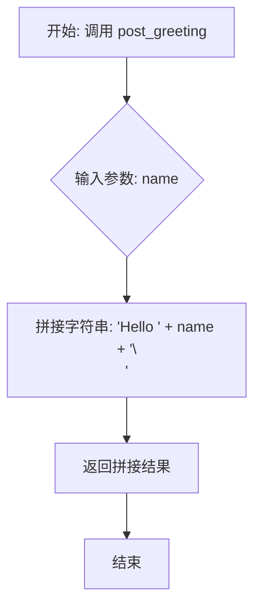

# `.\MetaGPT\metagpt\tools\openapi_v3_hello.py` 详细设计文档

该代码实现了一个基于 OpenAPI Specification 3.0 的简单 HTTP 服务演示。它使用 Connexion 框架创建一个异步 Web 应用，提供了一个 POST 接口 `/openapi/greeting/{name}`，当接收到请求时，会返回一个包含请求路径中名字的问候语 "Hello {name}"。

## 整体流程

```mermaid
graph TD
    A[启动脚本] --> B[创建 Connexion AsyncApp 实例]
    B --> C[添加 openapi.yaml 定义的 API]
    C --> D[在端口 8082 启动服务]
    D --> E{等待 HTTP 请求}
    E --> F[收到 POST /openapi/greeting/{name} 请求]
    F --> G[调用 post_greeting 函数]
    G --> H[返回 'Hello {name}' 字符串]
    H --> E
```

## 类结构

```
openapi_v3_hello.py
├── 全局函数: post_greeting
└── 主程序入口
```

## 全局变量及字段


### `specification_dir`
    
指向包含OpenAPI规范文件（openapi.yaml）的目录路径对象。

类型：`pathlib.Path`
    


### `app`
    
Connexion异步应用实例，用于托管和运行OpenAPI服务。

类型：`connexion.AsyncApp`
    


    

## 全局函数及方法


### `post_greeting`

这是一个异步函数，实现了OpenAPI规范中定义的一个端点。其核心功能是接收一个名字作为参数，并返回一个格式化的问候字符串。

参数：
- `name`：`str`，需要被问候的人的名字。

返回值：`str`，返回一个格式化的字符串，内容为 "Hello {name}\n"。

#### 流程图



#### 带注释源码

```python
# 这是一个异步函数，用于处理POST请求并返回问候语。
async def post_greeting(name: str) -> str:
    # 使用传入的name参数，拼接成"Hello {name}\n"的字符串格式。
    return f"Hello {name}\n"
```


## 关键组件


### OpenAPI 3.0 规范实现

该组件基于 `connexion` 库，实现了 OpenAPI 3.0 规范，用于定义和提供符合 RESTful 标准的 HTTP API 服务。它通过解析 `openapi.yaml` 文件自动路由 HTTP 请求到对应的 Python 异步处理函数。

### 异步 HTTP 服务器

该组件使用 `connexion.AsyncApp` 创建了一个异步 HTTP 服务器，负责监听指定端口（8082），接收并分发符合 OpenAPI 规范定义的 HTTP 请求，然后将对应的异步处理函数的响应返回给客户端。

### 请求处理函数 (`post_greeting`)

这是一个具体的 API 端点实现函数。它遵循 OpenAPI 规范中定义的路径和操作，接收一个路径参数 `name`，并返回一个格式化的问候字符串。该函数展示了业务逻辑与 HTTP 层之间的接口契约。

### 配置文件 (`openapi.yaml`)

该 YAML 文件是 OpenAPI 3.0 规范的声明式配置文件。它定义了 API 的元信息（如标题）、服务器地址、可用的路径（如 `/openapi/greeting/{name}`）、每个路径支持的 HTTP 方法（如 POST）、请求参数以及响应格式。`connexion` 框架依赖此文件来构建路由和验证请求/响应。

### 路径与规范目录管理

该组件通过 `Path(__file__).parent.parent.parent / "docs/.well-known"` 动态定位 OpenAPI 规范文件 (`openapi.yaml`) 所在的目录。这确保了应用程序能够正确找到其 API 定义，是服务启动的关键配置步骤。


## 问题及建议


### 已知问题

-   **硬编码配置**：服务器端口号（8082）和OpenAPI规范文件路径（`specification_dir`）在代码中硬编码。这使得在不同环境（如开发、测试、生产）中部署或更改配置时不够灵活，需要直接修改源代码。
-   **缺乏错误处理**：`post_greeting` 函数和主应用启动逻辑没有包含任何错误处理机制。例如，如果指定的OpenAPI规范文件不存在或格式错误，应用将直接崩溃，无法提供有意义的错误信息。
-   **单线程运行**：代码使用 `app.run()` 启动服务，这通常以单线程模式运行，可能无法有效处理高并发请求，性能存在瓶颈。
-   **缺少日志记录**：代码中没有集成任何日志记录功能，使得在运行时难以监控应用状态、调试问题或追踪请求。
-   **路径构造依赖父目录结构**：`specification_dir` 的构建依赖于固定的父目录结构（`.../docs/.well-known`）。如果项目目录结构发生变化，或者从不同位置运行脚本，可能导致找不到规范文件。

### 优化建议

-   **外部化配置**：将端口号、OpenAPI规范文件路径等配置项移至外部配置文件（如YAML、JSON文件）或环境变量中。使用配置管理库（如`pydantic-settings`）来加载和验证配置，提高部署灵活性。
-   **增强错误处理与日志**：
    -   在 `post_greeting` 函数中添加 `try-except` 块，捕获可能的异常并返回适当的HTTP错误响应。
    -   在主应用启动逻辑中，捕获并记录启动失败的原因。
    -   集成结构化日志库（如 `structlog` 或 `logging` 模块），在关键节点（如请求开始/结束、错误发生）记录日志。
-   **使用生产级服务器**：将 `app.run()` 替换为使用ASGI服务器（如 `uvicorn` 或 `hypercorn`）来运行应用。例如：`uvicorn.run(app, host="0.0.0.0", port=8082)`。这支持多工作进程/线程，提升并发处理能力。
-   **改进路径解析**：使用更稳健的方法定位规范文件。可以考虑将规范文件路径作为配置项，或者使用 `importlib.resources` 来访问打包在应用内的资源文件，减少对文件系统布局的依赖。
-   **添加健康检查端点**：在OpenAPI规范中添加一个简单的健康检查端点（如 `/health`），用于监控服务状态，这对于容器化部署和运维至关重要。
-   **考虑异步性能**：虽然使用了 `connexion.AsyncApp`，但 `post_greeting` 函数是纯CPU操作，没有真正的I/O等待。如果未来需要调用数据库或外部API，应确保使用异步客户端库以避免阻塞事件循环。


## 其它


### 设计目标与约束

本代码的设计目标是实现一个符合 OpenAPI Specification 3.0 规范的简单 HTTP 服务演示程序。其主要约束包括：
1.  **技术栈约束**：必须使用 Python 语言，并基于 `connexion` 库来解析和执行 OpenAPI 规范，以简化 HTTP 路由和请求验证的实现。
2.  **规范约束**：服务的行为（如端点、请求/响应格式）必须严格遵循同目录下 `openapi.yaml` 文件中的定义。
3.  **功能约束**：核心功能单一，仅提供一个问候端点，接收一个路径参数并返回文本响应。
4.  **部署约束**：作为演示程序，通常运行在本地开发环境，端口固定为 8082。

### 错误处理与异常设计

代码本身未显式定义复杂的错误处理逻辑，其错误处理机制主要依赖于 `connexion` 框架和底层 HTTP 服务器（如 `aiohttp`）的默认行为：
1.  **框架级验证**：`connexion` 会根据 `openapi.yaml` 自动验证请求参数（如 `name` 的类型、必填项）和请求体格式。验证失败会返回符合 OpenAPI 规范的 400 Bad Request 等错误响应。
2.  **运行时异常**：在 `post_greeting` 函数执行过程中，如果发生未捕获的异常，`connexion`/底层服务器会将其转换为 500 Internal Server Error 响应。
3.  **设计缺陷**：当前实现缺乏应用层的自定义错误处理。例如，无法优雅地处理业务逻辑错误（虽然本例无复杂业务），也无法统一格式化非框架捕获的异常响应体。这是潜在的优化点。

### 数据流与状态机

本服务的数据流和状态非常简单，无复杂的状态机：
1.  **请求数据流**：
    *   客户端发送 HTTP POST 请求到 `/openapi/greeting/{name}`。
    *   `connexion` 框架接收请求，根据 `openapi.yaml` 解析路径参数 `name`。
    *   解析后的参数被传递给 `post_greeting(name: str)` 函数。
2.  **处理与响应数据流**：
    *   `post_greeting` 函数使用 `name` 参数拼接字符串 `f"Hello {name}\n"`。
    *   该字符串作为 HTTP 响应体返回，状态码为 200 OK，Content-Type 为 `text/plain`（由 OpenAPI 规范定义）。
3.  **状态**：此服务是无状态的，不保存任何客户端或会话信息。每个请求相互独立。

### 外部依赖与接口契约

1.  **外部依赖**：
    *   **Python 3.7+**：支持 `async/await` 语法。
    *   **connexion 库**：核心框架，用于将 OpenAPI 规范映射到 Python 代码。版本需支持异步应用 (`AsyncApp`)。
    *   **底层 ASGI 服务器**：`app.run()` 默认使用 `aiohttp`，但 `connexion` 也支持其他 ASGI 服务器（如 `uvicorn`）。这是隐式依赖。
    *   **Path 类 (pathlib)**：Python 标准库，用于构建规范文件路径。
2.  **接口契约**：
    *   服务的**对外接口契约**完全由 `docs/.well-known/openapi.yaml` 文件定义。任何对端点、参数、响应的修改都必须首先更新此 YAML 文件。
    *   **内部接口契约**：`post_greeting` 函数是 `connexion` 框架与业务逻辑之间的约定。其函数签名（名称、参数、返回类型）必须与 `openapi.yaml` 中 `post` 操作的 `operationId` 及定义相匹配，否则框架无法正确路由和调用。

    