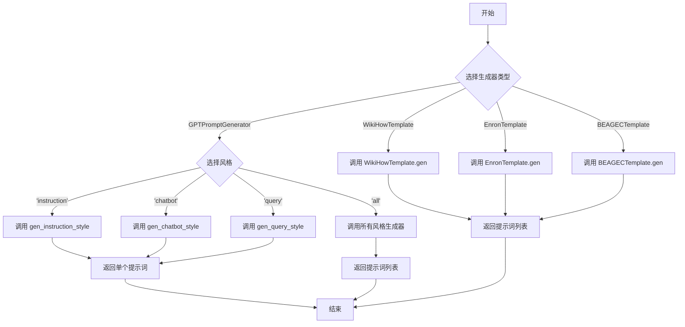
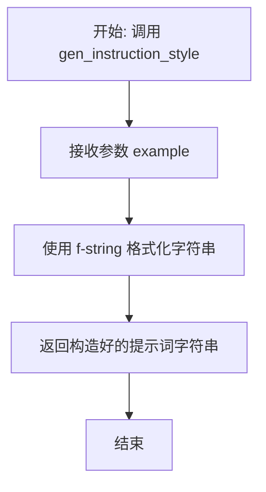
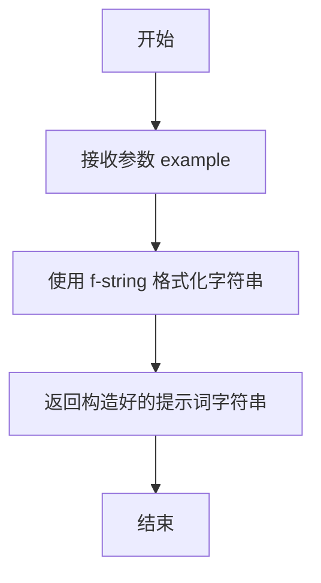
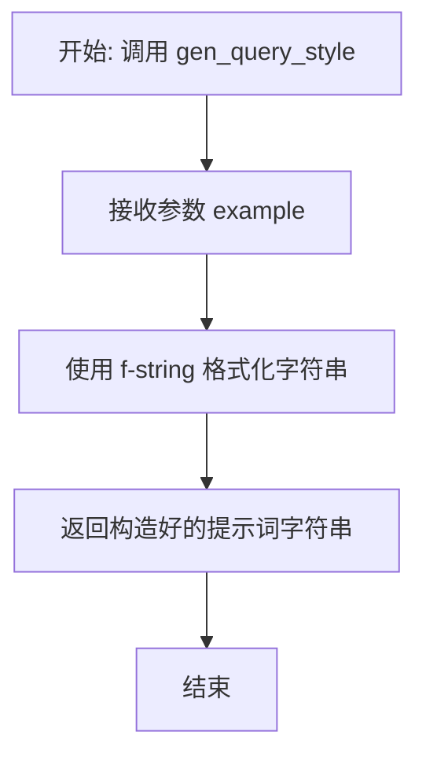
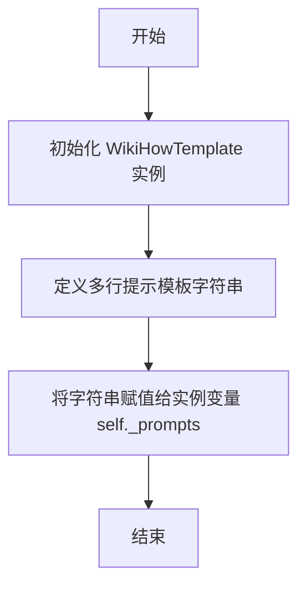
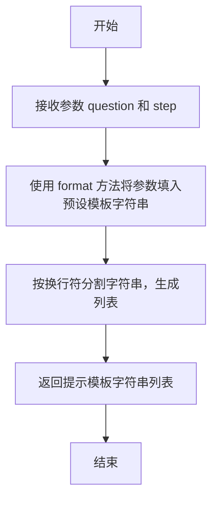
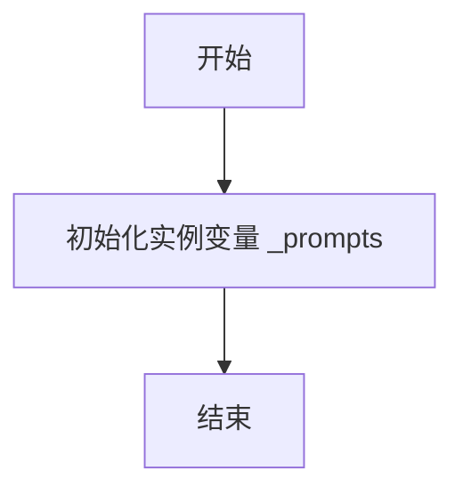
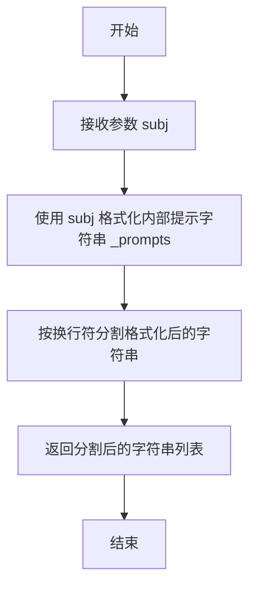
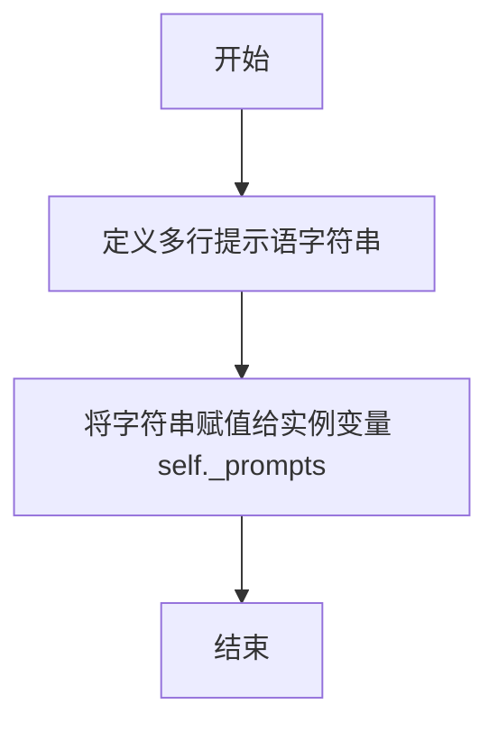
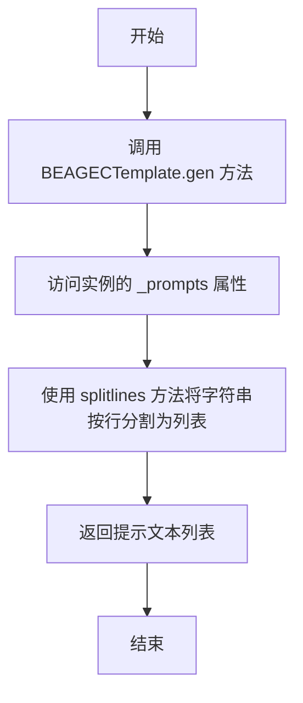

# `.\MetaGPT\metagpt\tools\prompt_writer.py` 详细设计文档

该代码文件定义了一个用于生成不同风格提示词（Prompt）的工具集，核心功能是根据给定的输出示例或主题，为大型语言模型（LLM）生成对应的输入提示。它支持多种生成风格（指令、聊天机器人、查询）和多个特定领域的模板（WikiHow、Enron、BEAGEC），旨在辅助构建用于训练或评估LLM的数据集。

## 整体流程



## 类结构

```
GPTPromptGenerator (通用提示词生成器)
WikiHowTemplate (WikiHow风格提示词模板)
EnronTemplate (Enron邮件风格提示词模板)
BEAGECTemplate (BEAGEC文本修订风格提示词模板)
```

## 全局变量及字段


### `GPTPromptGenerator._generators`
    
一个字典，将样式名称（'instruction', 'chatbot', 'query'）映射到对应的提示生成方法。

类型：`dict[str, Callable[[str], str]]`
    


### `WikiHowTemplate._prompts`
    
一个包含多种用于生成'如何做某事'（WikiHow风格）提示模板的字符串。

类型：`str`
    


### `EnronTemplate._prompts`
    
一个包含多种用于生成电子邮件主题（Enron风格）提示模板的字符串。

类型：`str`
    


### `BEAGECTemplate._prompts`
    
一个包含多种用于生成文档修订（BEAGEC风格）提示模板的字符串。

类型：`str`
    
    

## 全局函数及方法

### `GPTPromptGenerator.__init__`

该方法用于初始化`GPTPromptGenerator`类的实例。它不接收任何外部参数，其核心功能是初始化一个内部字典`_generators`，该字典将不同的提示生成风格（如“instruction”、“chatbot”、“query”）映射到对应的生成方法上，为后续的提示生成提供支持。

参数：
- 无

返回值：`None`，无返回值

#### 流程图

```mermaid
flowchart TD
    A[开始初始化] --> B[定义风格列表<br>["instruction", "chatbot", "query"]]
    B --> C[遍历风格列表]
    C --> D{是否遍历完成？}
    D -- 否 --> E[获取当前风格名称 i]
    E --> F[通过getattr获取实例方法<br>self.gen_{i}_style]
    F --> G[将键值对 i: method 存入字典 _generators]
    G --> C
    D -- 是 --> H[初始化完成]
```

#### 带注释源码

```python
def __init__(self):
    # 初始化一个字典 `_generators`，用于存储不同风格的提示生成函数。
    # 键为风格名称（字符串），值为对应的实例方法。
    # 通过遍历风格列表，利用 `getattr` 动态获取 `self.gen_{风格名}_style` 方法。
    self._generators = {i: getattr(self, f"gen_{i}_style") for i in ["instruction", "chatbot", "query"]}
```

### `GPTPromptGenerator.gen_instruction_style`

该方法用于生成“指令风格”的提示词模板。其核心功能是：给定一个期望的LLM输出示例（`example`），构造一个提示词，该提示词要求LLM推断出能够产生该输出的可能输入指令（X）。

参数：
- `example`：`str`，期望的LLM输出示例文本。

返回值：`str`，一个格式化后的字符串，该字符串是一个完整的提示词，用于引导LLM根据给定的`Output`（输出）来推测对应的`Instruction`（指令）。

#### 流程图



#### 带注释源码

```python
def gen_instruction_style(self, example):
    """Instruction style: Given an output, request LLM to provide input"""
    # 使用 f-string 将传入的 `example` 参数嵌入到预设的提示词模板中。
    # 模板结构为：先声明一个未知的指令“X”，然后给出输出“{example}”，
    # 最后提出问题“What kind of instruction might this output come from?”，
    # 并以“X:”结尾，引导LLM在此后生成答案。
    return f"""Instruction: X
Output: {example}
What kind of instruction might this output come from?
X:"""
```

### `GPTPromptGenerator.gen_chatbot_style`

该方法用于生成一个“聊天机器人风格”的提示词模板。给定一个期望的聊天机器人回复（`example`），该方法会构造一个提示词，引导大型语言模型（LLM）去推测用户可能发送的原始、非正式消息（`X`）。

参数：
- `example`：`str`，一个期望的聊天机器人回复示例，用于构建提示词。

返回值：`str`，一个格式化的字符串，该字符串是一个完整的提示词，旨在引导LLM根据给定的回复（`example`）来生成或推测用户的原始消息（`X`）。

#### 流程图



#### 带注释源码

```python
def gen_chatbot_style(self, example):
    """Chatbot style: Given an output, request LLM to provide input"""
    # 返回一个格式化的字符串，该字符串描述了一个场景：
    # 用户是一个聊天机器人，收到了用户的一条非正式消息 X，并给出了回复（example）。
    # 提示词要求LLM推测消息 X 可能是什么。
    return f"""You are a chatbot. A user sent you an informal message, and you replied as follows.
Message: X
Reply: {example}
What could the informal message X be?
X:"""
```

### `GPTPromptGenerator.gen_query_style`

该方法用于生成“查询风格”的提示词。给定一个期望的LLM输出示例（例如一段文档），该方法会构造一个提示词，引导LLM推断出可能产生该输出的详细查询。

参数：
- `example`：`str`，期望的LLM输出示例，通常是一段文本或文档内容。

返回值：`str`，一个格式化的字符串，该字符串是一个完整的提示词，用于引导LLM根据给定的`example`（文档）反推出原始的详细查询`X`。

#### 流程图



#### 带注释源码

```python
def gen_query_style(self, example):
    """Query style: Given an output, request LLM to provide input"""
    # 返回一个格式化的字符串，该字符串模拟了一个搜索场景。
    # 它告诉LLM：“你是一个搜索引擎。有人做了一个详细的查询，以下是与该查询最相关的文档。”
    # 然后提供文档内容（即参数 `example`），最后要求LLM回答：“详细的查询X是什么？”
    # 这旨在引导LLM根据输出（文档）逆向生成输入（查询）。
    return f"""You are a search engine. Someone made a detailed query, and the most relevant document to this query is as follows.
Query: X
Document: {example} What is the detailed query X?
X:"""
```

### `GPTPromptGenerator.gen`

该方法根据给定的示例输出和指定的风格，生成一个或多个提示字符串，用于引导大型语言模型（LLM）生成对应的输入。它支持三种预定义的风格（指令、聊天机器人、查询），并可以一次性生成所有风格的提示。

参数：

- `example`：`str`，期望的LLM输出示例，将作为生成提示的基础。
- `style`：`str`，指定生成提示的风格。可选值为 `"all"`、`"instruction"`、`"chatbot"` 或 `"query"`。默认为 `"all"`。

返回值：`Union[list[str], str]`，当 `style` 为 `"all"` 时，返回一个包含三种风格提示字符串的列表；否则，返回单个指定风格的提示字符串。

#### 流程图

```mermaid
flowchart TD
    A[开始: gen(example, style)] --> B{style == 'all'?};
    B -- 是 --> C[遍历所有生成器函数];
    C --> D[调用每个函数 f(example)];
    D --> E[收集结果到列表];
    E --> F[返回列表];
    B -- 否 --> G[从字典获取对应函数];
    G --> H[调用函数 f(example)];
    H --> I[返回单个字符串];
```

#### 带注释源码

```python
def gen(self, example: str, style: str = "all") -> Union[list[str], str]:
    """
    根据示例和风格，生成一个或多个提示字符串，用于引导LLM生成对应的输入。

    :param example: 期望的LLM输出示例
    :param style: 生成提示的风格 (all|instruction|chatbot|query)
    :return: 期望的LLM输入示例（一个或多个）
    """
    # 如果风格不是“all”，则从内部生成器字典中获取对应的生成函数并调用
    if style != "all":
        return self._generators[style](example)
    # 如果风格是“all”，则遍历所有生成器函数，对每个函数传入example参数，并将结果收集到一个列表中返回
    return [f(example) for f in self._generators.values()]
```

### `WikiHowTemplate.__init__`

该方法初始化 `WikiHowTemplate` 类，为其 `_prompts` 字段设置一个包含多种用于生成“如何做某事”提示模板的字符串。

参数：
-  `self`：`WikiHowTemplate`，表示 `WikiHowTemplate` 类的当前实例。

返回值：`None`，此方法不返回任何值。

#### 流程图



#### 带注释源码

```python
def __init__(self):
    # 初始化一个名为 `_prompts` 的实例变量，它是一个多行字符串。
    # 该字符串包含多个用于生成“如何做某事”提示的模板。
    # 模板中包含 `{question}` 和 `{step}` 两个占位符，后续可通过 `format` 方法替换。
    self._prompts = """Give me {step} steps to {question}.
How to {question}?
Do you know how can I {question}?
List {step} instructions to {question}.
What are some tips to {question}?
What are some steps to {question}?
Can you provide {step} clear and concise instructions on how to {question}?
I'm interested in learning how to {question}. Could you break it down into {step} easy-to-follow steps?
For someone who is new to {question}, what would be {step} key steps to get started?
What is the most efficient way to {question}? Could you provide a list of {step} steps?
Do you have any advice on how to {question} successfully? Maybe a step-by-step guide with {step} steps?
I'm trying to accomplish {question}. Could you walk me through the process with {step} detailed instructions?
What are the essential {step} steps to {question}?
I need to {question}, but I'm not sure where to start. Can you give me {step} actionable steps?
As a beginner in {question}, what are the {step} basic steps I should take?
I'm looking for a comprehensive guide on how to {question}. Can you provide {step} detailed steps?
Could you outline {step} practical steps to achieve {question}?
What are the {step} fundamental steps to consider when attempting to {question}?"""
```

### `WikiHowTemplate.gen`

该方法根据给定的问题（`question`）和步骤数（`step`），生成一系列用于询问“如何做某事”的提示模板字符串列表。这些模板旨在引导大型语言模型（LLM）生成分步指南。

参数：

- `question`：`str`，需要生成步骤指南的核心问题或主题，例如“学习Python”或“烤蛋糕”。
- `step`：`str`，期望的步骤数量，通常以数字字符串形式传入，例如“5”。

返回值：`list[str]`，返回一个字符串列表，其中每个字符串都是一个格式化后的提示模板，用于向LLM提问。

#### 流程图



#### 带注释源码

```python
def gen(self, question: str, step: str) -> list[str]:
    # 使用传入的 question 和 step 参数，格式化类中预定义的模板字符串 `self._prompts`。
    # `self._prompts` 是一个包含多个换行符分隔的提示模板的字符串。
    # `format` 方法将 `{question}` 和 `{step}` 占位符替换为实际参数值。
    formatted_prompts = self._prompts.format(question=question, step=step)
    
    # 将格式化后的长字符串按换行符 `\n` 分割，得到一个提示模板列表。
    # 每个列表元素都是一个独立的、可用于提问的完整句子。
    prompt_list = formatted_prompts.splitlines()
    
    # 返回生成的提示模板列表。
    return prompt_list
```

### `EnronTemplate.__init__`

该方法初始化 `EnronTemplate` 类，用于生成与电子邮件主题相关的提示模板。

参数：
- 无显式参数。该方法是一个类的构造函数，用于初始化实例。

返回值：`None`，构造函数不返回任何值。

#### 流程图



#### 带注释源码

```python
def __init__(self):
    # 初始化一个包含多个电子邮件主题提示模板的字符串。
    # 这些模板使用 {subj} 作为占位符，后续可以通过 format 方法替换为具体的主题。
    self._prompts = """Write an email with the subject "{subj}".
Can you craft an email with the subject {subj}?
Would you be able to compose an email and use {subj} as the subject?
Create an email about {subj}.
Draft an email and include the subject "{subj}".
Generate an email about {subj}.
Hey, can you shoot me an email about {subj}?
Do you mind crafting an email for me with {subj} as the subject?
Can you whip up an email with the subject of "{subj}"?
Hey, can you write an email and use "{subj}" as the subject?
Can you send me an email about {subj}?"""
```

### `EnronTemplate.gen`

该方法根据给定的邮件主题（`subj`）生成一系列用于提示语言模型撰写邮件的模板字符串。

参数：
- `subj`：`str`，邮件的主题，将用于填充到预设的邮件撰写提示模板中。

返回值：`list[str]`，返回一个字符串列表，列表中的每个字符串都是一个完整的、已填充了主题的邮件撰写提示。

#### 流程图



#### 带注释源码

```python
    def gen(self, subj):
        # 使用传入的邮件主题 `subj` 来格式化类中预定义的提示模板字符串 `_prompts`。
        # `_prompts` 是一个包含多个邮件撰写提示的字符串，每个提示占一行，其中包含一个 `{subj}` 占位符。
        return self._prompts.format(subj=subj).splitlines()
```

### `BEAGECTemplate.__init__`

该方法初始化 `BEAGECTemplate` 类，用于生成与文档编辑、修订和润色相关的提示语模板。它定义了一个包含多种请求方式的字符串，这些请求都旨在引导对文档进行语法、词汇、拼写和风格上的改进。

参数：
-  `self`：`BEAGECTemplate` 实例，表示当前对象本身。

返回值：`None`，此方法不返回任何值，仅用于初始化类的内部状态。

#### 流程图



#### 带注释源码

```python
def __init__(self):
    # 初始化方法，用于设置 BEAGECTemplate 类的实例。
    # 定义一个多行字符串 `self._prompts`，其中包含了多种请求LLM编辑、修订和润色文档的提示语模板。
    # 这些提示语涵盖了从正式到非正式的各种表达方式，但核心目标都是请求改进文档的语法、词汇、拼写和风格。
    self._prompts = """Edit and revise this document to improve its grammar, vocabulary, spelling, and style.
Revise this document to correct all the errors related to grammar, spelling, and style.
Refine this document by eliminating all grammatical, lexical, and orthographic errors and improving its writing style.
Polish this document by rectifying all errors related to grammar, vocabulary, and writing style.
Enhance this document by correcting all the grammar errors and style issues, and improving its overall quality.
Rewrite this document by fixing all grammatical, lexical and orthographic errors.
Fix all grammar errors and style issues and rewrite this document.
Take a stab at fixing all the mistakes in this document and make it sound better.
Give this document a once-over and clean up any grammar or spelling errors.
Tweak this document to make it read smoother and fix any mistakes you see.
Make this document sound better by fixing all the grammar, spelling, and style issues.
Proofread this document and fix any errors that make it sound weird or confusing."""
```

### `BEAGECTemplate.gen`

该方法用于生成一组关于文档编辑和修订的提示文本。它返回一个列表，其中每一行都是一个独立的、用于指导语言模型进行文档校对和润色的指令。

参数：
- 无参数。

返回值：`list[str]`，返回一个字符串列表，每个字符串是一条关于文档编辑和修订的提示文本。

#### 流程图



#### 带注释源码

```python
def gen(self):
    # 返回实例变量 `_prompts` 中的字符串按行分割后的列表。
    # `_prompts` 是一个包含多条文档编辑和修订指令的多行字符串。
    # `splitlines()` 方法将字符串按换行符分割，返回一个由各行组成的列表。
    return self._prompts.splitlines()
```

## 关键组件

### GPTPromptGenerator

一个用于根据给定的输出示例，生成对应输入提示的类。它支持三种风格（指令、聊天机器人、查询），旨在引导大型语言模型（LLM）根据输出反推出可能的输入。

### WikiHowTemplate

一个用于生成“如何做某事”类问题的多样化提示模板的类。它通过填充占位符（如步骤数和具体问题）来生成一系列结构相似但表达不同的提示。

### EnronTemplate

一个用于生成以特定主题（subject）为核心的电子邮件撰写提示模板的类。它通过填充主题占位符来生成一系列请求撰写电子邮件的不同表达方式。

### BEAGECTemplate

一个用于生成文档校对与修订任务提示模板的类。它提供了一系列请求改进文档语法、词汇、拼写和风格的固定提示语，无需参数即可生成。

## 问题及建议


### 已知问题

-   **硬编码的提示词模板**：`WikiHowTemplate`、`EnronTemplate`、`BEAGECTemplate` 类中的提示词模板字符串直接硬编码在类定义中。这使得模板难以维护、扩展和国际化。如果需要修改或添加新的模板，必须直接修改源代码。
-   **模板类职责单一性不足**：`WikiHowTemplate` 和 `EnronTemplate` 的 `gen` 方法除了生成提示词列表，还负责了字符串格式化 (`format`) 和分割 (`splitlines`)。这使得类同时承担了“模板定义”和“模板渲染”的职责，违反了单一职责原则，降低了内聚性。
-   **`GPTPromptGenerator.gen` 方法返回类型不一致**：当 `style` 参数为 `"all"` 时，返回 `list[str]`；当 `style` 为其他值时，返回 `str`。这种不一致的返回类型会增加调用方的处理复杂度，容易引发错误，不符合接口设计的清晰性原则。
-   **缺乏输入验证与错误处理**：代码中没有对输入参数（如 `style`、`step` 等）进行有效性验证。例如，向 `GPTPromptGenerator.gen` 传入一个不支持的 `style` 值会引发 `KeyError`；向 `WikiHowTemplate.gen` 传入非字符串的 `step` 会导致 `format` 方法出错。这降低了代码的健壮性。
-   **模板内容可读性与可维护性差**：`_prompts` 字符串中包含大量换行和长句，在代码中直接阅读和编辑困难，容易出错。特别是 `BEAGECTemplate` 的提示词之间仅用换行分隔，缺乏明确的列表结构。
-   **`BEAGECTemplate` 类设计不一致**：`WikiHowTemplate` 和 `EnronTemplate` 的 `gen` 方法需要参数，而 `BEAGECTemplate.gen` 方法不需要参数。这种设计上的不一致性可能导致使用时的困惑，并使得通过统一接口调用不同模板变得复杂。

### 优化建议

-   **将模板外部化**：将硬编码的提示词模板移至外部配置文件（如 JSON、YAML）或数据库中。这样可以在不修改代码的情况下轻松管理、更新和扩展模板，也便于进行多语言支持。
-   **重构模板类，分离关注点**：创建清晰的职责划分。可以设计一个 `Template` 基类或接口，定义 `render(**kwargs)` 方法。具体的模板类（如 `WikiHowTemplate`）只负责存储模板标识和参数定义，而将字符串格式化和分割逻辑移至一个独立的 `TemplateRenderer` 或工具函数中。这提高了代码的可测试性和可复用性。
-   **统一 `GPTPromptGenerator.gen` 方法的返回类型**：修改 `gen` 方法，使其始终返回列表 (`list[str]`)。当 `style != "all"` 时，返回一个只包含单个元素的列表。这能提供一致、可预测的接口，简化调用方的逻辑。
-   **增加输入验证与健壮的错误处理**：
    -   在 `GPTPromptGenerator.gen` 中检查 `style` 参数是否在 `_generators` 的键中，若不在则抛出清晰的 `ValueError`。
    -   在 `WikiHowTemplate.gen` 和 `EnronTemplate.gen` 中验证输入参数的类型和有效性（例如，`step` 是否可以转换为整数）。
    -   考虑使用 `try-except` 块捕获 `format` 等方法可能抛出的异常，并转换为更有意义的业务异常。
-   **优化模板内容的代码表示**：对于多行模板字符串，考虑使用三重引号的多行字符串，并利用 Python 的隐式字符串连接或 `textwrap.dedent` 来保持代码的整洁和可读性。或者，在将模板外部化后，此问题自然得到解决。
-   **重新设计 `BEAGECTemplate` 或建立统一接口**：如果这些模板类需要被统一调用，应定义一个所有模板类都必须实现的通用接口（例如，一个接收字典参数 `**kwargs` 的 `generate_prompts` 方法）。对于 `BEAGECTemplate`，可以将其设计为接收一个可选的、未来可能用到的参数，或者明确其无参数的特性，并在接口文档中清晰说明。
-   **考虑使用枚举或常量定义 `style`**：将 `"instruction"`、`"chatbot"`、`"query"` 等字符串定义为类常量或枚举 (`PromptStyle`)，以避免在代码中直接使用魔法字符串，提高类型安全性和代码可维护性。


## 其它


### 设计目标与约束

本模块的核心设计目标是提供一个灵活、可扩展的提示词生成器，用于为大语言模型（LLM）生成多样化的输入提示。其设计遵循以下约束：
1.  **单一职责**：每个类专注于一种特定类型的提示生成（如逆向生成、模板填充），确保代码结构清晰。
2.  **开闭原则**：`GPTPromptGenerator` 类通过内部字典 `_generators` 管理不同风格的生成函数，易于扩展新的提示风格而无需修改现有代码。
3.  **配置化**：模板类（`WikiHowTemplate`, `EnronTemplate`, `BEAGECTemplate`）将提示模板硬编码在类内部，旨在提供开箱即用的预设，但牺牲了运行时动态修改模板的能力。
4.  **轻量级**：模块不依赖外部配置或数据库，所有逻辑自包含，便于集成。

### 错误处理与异常设计

当前代码的错误处理机制较为薄弱，主要依赖 Python 解释器的默认行为：
1.  **参数验证缺失**：`GPTPromptGenerator.gen` 方法的 `style` 参数未进行有效性检查。如果传入非 `"all"` 且不在 `_generators` 字典中的键值，将引发 `KeyError`。
2.  **模板格式化风险**：`WikiHowTemplate.gen` 和 `EnronTemplate.gen` 方法使用 `str.format()`，若传入的 `question` 或 `subj` 字符串包含与格式说明符冲突的字符（如花括号 `{}`），可能引发 `KeyError` 或 `ValueError`。
3.  **异常传播**：模块本身未定义自定义异常，也未对潜在异常进行捕获和处理，错误将直接向上层调用者传播，由调用方决定如何处理。

### 数据流与状态机

模块内的数据流是单向且无状态的：
1.  **初始化流程**：各类的 `__init__` 方法在实例化时设置内部状态（如 `_generators` 字典、`_prompts` 字符串）。这些状态在对象生命周期内是只读的。
2.  **生成流程**：
    *   **输入**：用户调用 `gen` 方法，提供必要的参数（如 `example`, `question`, `step`, `subj`）。
    *   **处理**：方法根据内部逻辑（选择生成函数或格式化模板字符串）处理输入参数。
    *   **输出**：生成并返回一个字符串或字符串列表作为提示词。
3.  **无状态性**：所有 `gen` 方法是纯函数，其输出仅依赖于输入参数和对象的固定内部模板，不依赖于任何可变实例状态或外部输入。因此，不存在复杂的状态转换或状态机。

### 外部依赖与接口契约

1.  **外部依赖**：该模块仅依赖 Python 标准库（`typing`），无第三方库依赖，具有很好的可移植性。
2.  **导入接口**：模块暴露三个主要类供外部调用：`GPTPromptGenerator`、`WikiHowTemplate`、`EnronTemplate`、`BEAGECTemplate`。
3.  **类接口契约**：
    *   `GPTPromptGenerator`：提供 `gen(example: str, style: str = "all") -> Union[list[str], str]` 方法。
    *   `WikiHowTemplate`：提供 `gen(question: str, step: str) -> list[str]` 方法。
    *   `EnronTemplate`：提供 `gen(subj: str) -> list[str]` 方法。
    *   `BEAGECTemplate`：提供 `gen() -> list[str]` 方法。
4.  **使用约定**：调用者需确保传入 `gen` 方法的参数类型符合预期，并自行处理可能由无效参数或模板格式化引起的异常。

### 配置管理与扩展性

1.  **当前配置方式**：所有提示模板均以硬编码字符串形式存在于各个类的 `__init__` 方法中。`GPTPromptGenerator` 的生成逻辑也以硬编码函数形式存在。
2.  **扩展性**：
    *   **`GPTPromptGenerator`**：扩展性较好。可通过在类定义中添加新的 `gen_{new_style}_style` 方法，并确保 `__init__` 中的 `_generators` 字典能包含它（当前实现需手动添加，或改为自动发现）来支持新风格。
    *   **模板类**：扩展性较差。要添加或修改模板，必须直接修改类的源代码。缺乏从外部文件（如 JSON、YAML）或数据库加载模板的机制。
3.  **配置管理建议**：为提升灵活性，可考虑将模板内容外置到配置文件，并在类初始化时读取。`GPTPromptGenerator` 的生成器映射也可通过配置来管理。

### 性能考量

1.  **时间复杂度**：所有 `gen` 方法操作均为字符串格式化或列表构建，时间复杂度为 O(n)，其中 n 为输出字符串的长度或数量，对于预期使用场景（生成少量提示词）性能开销极低。
2.  **空间复杂度**：每个模板类实例在内存中存储完整的模板字符串。如果模板数量极大或字符串非常长，可能占用较多内存。但当前模板规模适中，无需担忧。
3.  **实例化开销**：类实例化过程简单，仅赋值操作，开销很小。适合在需要时创建，也可作为单例复用。
4.  **无 I/O 操作**：模块不涉及文件读写或网络请求，性能稳定可预测。

    