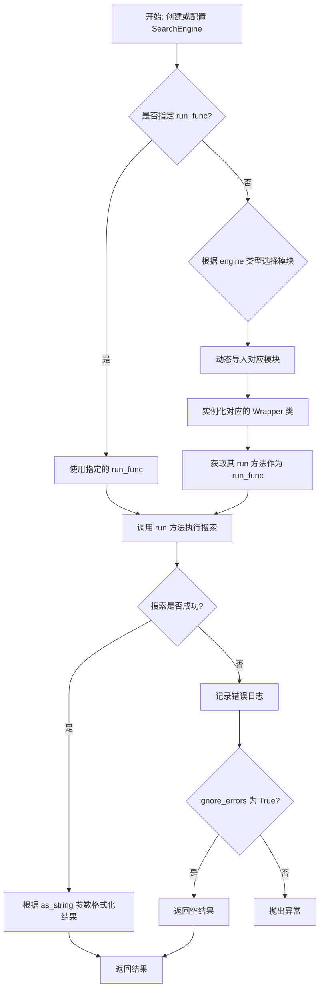
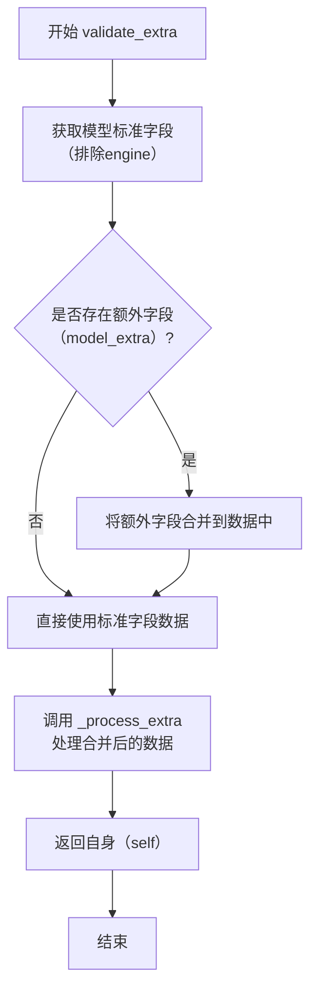
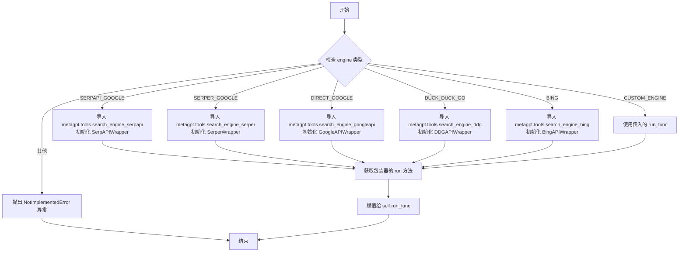
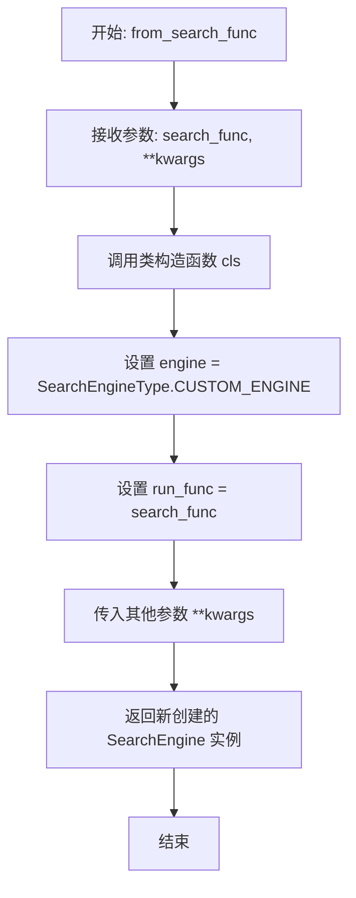

# `.\MetaGPT\metagpt\tools\search_engine.py` 详细设计文档

该代码定义了一个名为 SearchEngine 的 Pydantic 模型，用于配置和执行不同搜索引擎的搜索操作。它支持多种搜索引擎类型（如 Google、Bing、DuckDuckGo 等），并能根据配置动态加载对应的搜索函数。核心功能是提供一个统一的异步接口来执行搜索查询，并处理错误和结果格式化。

## 整体流程



## 类结构

```
SearchEngine (Pydantic 模型)
├── 字段: engine, run_func, api_key, proxy
├── 方法: validate_extra, _process_extra, from_search_config, from_search_func, run
└── 依赖: SearchEngineType (枚举), SearchConfig (配置类)
```

## 全局变量及字段


### `SearchEngine.engine`
    
要使用的搜索引擎类型，默认为 SERPER_GOOGLE。

类型：`SearchEngineType`
    


### `SearchEngine.run_func`
    
执行搜索的可调用对象；如果未提供，将根据 engine 字段自动确定。

类型：`Optional[Callable[[str, int, bool], Coroutine[None, None, Union[str, list[str]]]]]`
    


### `SearchEngine.api_key`
    
搜索引擎的可选 API 密钥。

类型：`Optional[str]`
    


### `SearchEngine.proxy`
    
搜索引擎请求的可选代理。

类型：`Optional[str]`
    
    

## 全局函数及方法

### `SearchEngine.validate_extra`

该方法是一个Pydantic模型验证器，在模型实例化后运行。它的核心功能是处理模型初始化时传入的额外字段（`model_extra`），并根据配置的搜索引擎类型（`engine`）动态加载并设置对应的搜索执行函数（`run_func`）。它通过整合模型的标准字段和额外字段，调用内部处理逻辑来确保`run_func`被正确初始化。

参数：
-  `self`：`SearchEngine`，`SearchEngine`模型实例自身。

返回值：`SearchEngine`，返回经过验证和处理后的`SearchEngine`模型实例自身。

#### 流程图



#### 带注释源码

```python
    @model_validator(mode="after")
    def validate_extra(self):
        """Validates extra fields provided to the model and updates the run function accordingly."""
        # 1. 获取模型的标准字段数据，排除'engine'字段，并忽略值为None或默认值的字段。
        data = self.model_dump(exclude={"engine"}, exclude_none=True, exclude_defaults=True)
        # 2. 如果存在通过`__init__`传入但未被定义的额外字段（存储在`model_extra`中），将其合并到数据字典中。
        if self.model_extra:
            data.update(self.model_extra)
        # 3. 调用内部方法`_process_extra`，传入合并后的数据，以根据`engine`类型设置`run_func`。
        self._process_extra(**data)
        # 4. 返回模型实例自身，这是Pydantic验证器的要求。
        return self
```

### `SearchEngine._process_extra`

该方法根据`SearchEngine`实例的`engine`类型，动态导入对应的搜索引擎模块，并初始化相应的包装器（Wrapper）类，最终将包装器的`run`方法赋值给实例的`run_func`字段。如果引擎类型为`CUSTOM_ENGINE`，则直接使用传入的`run_func`参数。

参数：
- `run_func`：`Optional[Callable[[str, int, bool], Coroutine[None, None, Union[str, list[str]]]]]`，一个可选的、用于执行搜索的可调用对象。如果未提供，将根据`engine`类型自动确定。
- `**kwargs`：`Any`，额外的关键字参数，用于传递给搜索引擎包装器的构造函数。

返回值：`None`，该方法不返回任何值，其作用是为实例的`run_func`字段赋值。

#### 流程图



#### 带注释源码

```python
def _process_extra(
    self,
    run_func: Optional[Callable[[str, int, bool], Coroutine[None, None, Union[str, list[str]]]]] = None,
    **kwargs,
):
    """Processes extra configuration and updates the run function based on the search engine type.

    Args:
        run_func: An optional callable for running the search. If not provided, it will be determined based on the engine.
    """
    # 根据 engine 枚举类型，选择对应的搜索引擎实现模块和包装器类
    if self.engine == SearchEngineType.SERPAPI_GOOGLE:
        module = "metagpt.tools.search_engine_serpapi"
        # 动态导入模块，初始化包装器，并获取其 run 方法
        run_func = importlib.import_module(module).SerpAPIWrapper(**kwargs).run
    elif self.engine == SearchEngineType.SERPER_GOOGLE:
        module = "metagpt.tools.search_engine_serper"
        run_func = importlib.import_module(module).SerperWrapper(**kwargs).run
    elif self.engine == SearchEngineType.DIRECT_GOOGLE:
        module = "metagpt.tools.search_engine_googleapi"
        run_func = importlib.import_module(module).GoogleAPIWrapper(**kwargs).run
    elif self.engine == SearchEngineType.DUCK_DUCK_GO:
        module = "metagpt.tools.search_engine_ddg"
        run_func = importlib.import_module(module).DDGAPIWrapper(**kwargs).run
    elif self.engine == SearchEngineType.CUSTOM_ENGINE:
        # 对于自定义引擎，直接使用传入的 run_func
        run_func = self.run_func
    elif self.engine == SearchEngineType.BING:
        module = "metagpt.tools.search_engine_bing"
        run_func = importlib.import_module(module).BingAPIWrapper(**kwargs).run
    else:
        # 如果 engine 类型未实现，抛出异常
        raise NotImplementedError
    # 将最终确定的 run 方法赋值给实例的 run_func 字段
    self.run_func = run_func
```

### `SearchEngine.from_search_config`

这是一个类方法，用于根据提供的 `SearchConfig` 配置对象创建一个 `SearchEngine` 实例。它负责将配置信息（如API类型、密钥、代理等）以及一个可选的搜索函数适配并传递给 `SearchEngine` 的构造函数。

参数：
- `config`：`SearchConfig`，包含搜索引擎配置信息的对象，如API类型、密钥、代理等。
- `**kwargs`：`Any`，额外的关键字参数，将直接传递给 `SearchEngine` 的构造函数。

返回值：`SearchEngine`，一个根据给定配置初始化的 `SearchEngine` 实例。

#### 流程图

```mermaid
flowchart TD
    A[开始: from_search_config] --> B[从config提取数据<br>排除'api_type'和'search_func']
    B --> C{config.search_func<br>是否不为None?}
    C -- 是 --> D[将config.search_func<br>赋值给data['run_func']]
    C -- 否 --> E[保持data不变]
    D --> F
    E --> F[调用SearchEngine构造函数<br>engine=config.api_type, **data, **kwargs]
    F --> G[返回SearchEngine实例]
    G --> H[结束]
```

#### 带注释源码

```python
    @classmethod
    def from_search_config(cls, config: SearchConfig, **kwargs):
        """Creates a SearchEngine instance from a SearchConfig.

        Args:
            config: The search configuration to use for creating the SearchEngine instance.
        """
        # 1. 将SearchConfig对象转换为字典，但排除'api_type'和'search_func'字段。
        #    因为这些字段需要特殊处理。
        data = config.model_dump(exclude={"api_type", "search_func"})
        
        # 2. 如果配置中提供了自定义的搜索函数(search_func)，则将其添加到data字典中，
        #    键为'run_func'，以便后续传递给SearchEngine构造函数。
        if config.search_func is not None:
            data["run_func"] = config.search_func

        # 3. 调用SearchEngine类的构造函数来创建实例。
        #    - `engine=config.api_type`: 使用配置中的API类型。
        #    - `**data`: 传入处理后的配置数据（可能包含run_func）。
        #    - `**kwargs`: 传入任何额外的关键字参数。
        return cls(engine=config.api_type, **data, **kwargs)
```

### `SearchEngine.from_search_func`

这是一个类方法，用于根据一个自定义的搜索函数创建一个 `SearchEngine` 实例。它简化了使用自定义搜索逻辑（而非预定义的搜索引擎）来配置 `SearchEngine` 的过程。

参数：
- `search_func`：`Callable[[str, int, bool], Coroutine[None, None, Union[str, list[str]]]]`，一个可调用对象（通常是异步函数），用于执行搜索。它接受查询字符串、最大结果数和是否以字符串形式返回结果作为参数，并返回一个协程，该协程最终解析为字符串或字符串列表。
- `**kwargs`：`Any`，其他关键字参数，这些参数将被传递给 `SearchEngine` 类的构造函数，用于设置额外的配置（如 `api_key`, `proxy` 等）。

返回值：`SearchEngine`，返回一个配置好的 `SearchEngine` 实例，其引擎类型被设置为 `SearchEngineType.CUSTOM_ENGINE`，并且 `run_func` 字段被设置为传入的 `search_func`。

#### 流程图



#### 带注释源码

```python
    @classmethod
    def from_search_func(
        cls, search_func: Callable[[str, int, bool], Coroutine[None, None, Union[str, list[str]]]], **kwargs
    ):
        """Creates a SearchEngine instance from a custom search function.

        Args:
            search_func: A callable that executes the search.
        """
        # 调用类自身的构造函数 `cls(...)` 来创建实例。
        # 将引擎类型明确指定为 CUSTOM_ENGINE。
        # 将传入的自定义搜索函数赋值给 `run_func` 字段。
        # 其他所有通过 `**kwargs` 传入的参数也一并传递给构造函数。
        return cls(engine=SearchEngineType.CUSTOM_ENGINE, run_func=search_func, **kwargs)
```

### `SearchEngine.run`

`SearchEngine.run` 是 `SearchEngine` 类的核心异步方法，用于执行搜索查询。它根据实例化时配置的搜索引擎（如 Google、Bing、DuckDuckGo 或自定义引擎）调用相应的底层 `run_func` 来获取结果。该方法提供了灵活的返回格式（字符串或字典列表）和错误处理选项，是统一不同搜索引擎接口的关键入口点。

参数：

- `query`：`str`，要执行的搜索查询字符串。
- `max_results`：`int`，默认值为 8，指定返回的最大结果数量。
- `as_string`：`bool`，默认值为 `True`，控制返回结果的格式。为 `True` 时返回格式化字符串，为 `False` 时返回字典列表。
- `ignore_errors`：`bool`，默认值为 `False`，决定是否忽略搜索过程中发生的异常。若为 `True`，发生错误时返回空值（空字符串或空列表）而不抛出异常。

返回值：`Union[str, list[dict[str, str]]]`，根据 `as_string` 参数的值，返回搜索结果的格式化字符串或包含结果详情（标题、链接、摘要等）的字典列表。

#### 流程图

```mermaid
flowchart TD
    A[开始: 调用 run 方法] --> B{参数 as_string 为 True?}
    B -- 是 --> C[设置期望返回类型为 str]
    B -- 否 --> D[设置期望返回类型为 list[dict]]
    C --> E
    D --> E
    subgraph E [执行搜索与错误处理]
        F[调用 self.run_func<br>传入 query, max_results, as_string] --> G{执行成功？}
        G -- 是 --> H[返回结果]
        G -- 否<br>捕获异常 --> I[记录错误日志]
        I --> J{ignore_errors 为 True?}
        J -- 是 --> K[根据 as_string 返回空值<br>'' 或 []]
        J -- 否 --> L[重新抛出异常]
    end
    H --> M[结束: 返回结果]
    K --> M
    L --> M
```

#### 带注释源码

```python
    async def run(
        self,
        query: str,
        max_results: int = 8,
        as_string: bool = True,
        ignore_errors: bool = False,
    ) -> Union[str, list[dict[str, str]]]:
        """Run a search query.

        Args:
            query: The search query.
            max_results: The maximum number of results to return. Defaults to 8.
            as_string: Whether to return the results as a string or a list of dictionaries. Defaults to True.
            ignore_errors: Whether to ignore errors during the search. Defaults to False.

        Returns:
            The search results as a string or a list of dictionaries.
        """
        try:
            # 核心操作：调用在类初始化时根据 engine 类型确定的实际搜索函数。
            # run_func 是一个协程，接受查询、最大结果数和格式标志。
            return await self.run_func(query, max_results=max_results, as_string=as_string)
        except Exception as e:
            # 错误处理：记录详细的异常信息到日志。
            logger.exception(f"fail to search {query} for {e}")
            if not ignore_errors:
                # 如果调用方要求不忽略错误，则重新抛出异常。
                raise e
            # 如果调用方要求忽略错误，则根据 as_string 参数返回一个安全的空值。
            return "" if as_string else []
```

## 关键组件


### 搜索引擎抽象与配置管理

`SearchEngine` 类作为搜索功能的统一抽象层，通过 Pydantic 模型管理不同搜索引擎（如 Google API、Serper、SerpAPI、DuckDuckGo、Bing）的配置和运行时行为。它支持通过配置对象或自定义函数进行初始化，并提供了一个统一的异步 `run` 方法接口。

### 动态引擎加载与适配器模式

`_process_extra` 方法实现了动态加载机制，根据 `engine` 字段指定的类型，在运行时导入对应的第三方搜索引擎包装器模块（如 `SerperWrapper`、`GoogleAPIWrapper`），并将其 `run` 方法适配为 `SearchEngine` 自身的 `run_func`。这遵循了适配器模式，将不同引擎的接口统一化。

### 类型化异步执行接口

`run` 方法使用了 `@overload` 装饰器，提供了强类型的异步执行接口。它根据 `as_string` 参数的不同值，清晰地定义了返回类型为 `str` 或 `list[dict[str, str]]`，增强了代码的可读性和类型安全性。

### 配置驱动的对象构建

提供了 `from_search_config` 和 `from_search_func` 两个类方法作为工厂方法，允许从统一的 `SearchConfig` 配置对象或直接从一个自定义的异步搜索函数来构建 `SearchEngine` 实例，提高了灵活性和可配置性。

### 统一的错误处理

在 `run` 方法中集成了统一的异常处理逻辑，通过 `ignore_errors` 参数控制是否抛出异常或返回空结果，并利用日志记录器记录错误详情，增强了系统的健壮性。


## 问题及建议


### 已知问题

-   **动态导入与紧耦合**：`_process_extra` 方法通过硬编码的模块路径字符串动态导入具体的搜索引擎包装类。这导致了 `SearchEngine` 类与这些具体实现类之间的紧耦合，违反了依赖倒置原则。如果模块路径、类名或接口发生变化，`SearchEngine` 类也需要同步修改，降低了代码的可维护性和可扩展性。
-   **异常处理粒度较粗**：`run` 方法在捕获异常时，仅通过 `ignore_errors` 参数决定是抛出异常还是返回空结果。这种处理方式较为单一，无法根据不同的异常类型（如网络错误、认证错误、API限制错误等）进行更精细化的处理或重试策略。
-   **配置验证逻辑可能重复**：`validate_extra` 验证器在模型初始化后执行，用于处理额外字段并调用 `_process_extra`。然而，`_process_extra` 的逻辑（特别是根据 `engine` 类型初始化 `run_func`）也可能在对象构造时就需要。如果通过 `__init__` 直接创建对象，`validate_extra` 的逻辑可能被绕过，导致 `run_func` 未正确初始化，存在状态不一致的风险。
-   **类型注解与运行时行为可能不符**：`run` 方法的返回值类型注解为 `Union[str, list[dict[str, str]]]`，但根据重载签名，当 `as_string=False` 时，应返回 `list[dict[str, str]]`。然而，在异常情况下（`ignore_errors=True`），方法会返回空列表 `[]`，这与 `as_string=True` 时返回空字符串 `""` 的约定不一致，且当 `as_string=False` 时返回空列表是符合类型注解的，但调用者可能需要区分“无结果”和“出错”两种情况，当前设计无法区分。
-   **`run_func` 的默认值问题**：`run_func` 字段被标记为 `Field(exclude=True)` 且默认值为 `None`。在 `_process_extra` 中，除了 `CUSTOM_ENGINE` 外，其他引擎类型都会重新赋值。如果用户创建 `SearchEngine` 实例时未提供 `run_func` 且 `engine` 为 `CUSTOM_ENGINE`，则 `run_func` 将保持为 `None`，导致后续 `run` 方法调用失败。

### 优化建议

-   **引入工厂模式或依赖注入**：建议将具体搜索引擎包装类的创建逻辑抽象到一个独立的工厂类中。`SearchEngine` 类应依赖于一个抽象的搜索引擎接口，并通过工厂或依赖注入容器获取具体的实现实例。这样可以解耦 `SearchEngine` 与具体实现，提高代码的模块化和可测试性。
-   **细化异常处理策略**：在 `run` 方法中，可以定义更具体的异常类（或使用现有库的异常），并实现不同的处理策略。例如，对于网络超时异常可以加入指数退避重试机制；对于认证失败异常可以记录日志并提示用户检查配置；对于API限额异常可以等待后重试或直接失败。可以提供一个可配置的异常处理器。
-   **统一初始化路径**：确保无论通过 `__init__`、`model_validator` 还是类方法（如 `from_search_config`）创建对象，`run_func` 的初始化逻辑都能被执行且仅执行一次。可以考虑将 `_process_extra` 的核心逻辑移至 `__init__` 中，或确保所有构造路径最终都调用一个统一的初始化方法。
-   **明确错误返回值契约**：重新审视 `run` 方法的返回值设计。考虑引入一个 `Result` 类或使用 `Union` 包含一个表示错误的状态，例如 `Union[str, list[dict], SearchError]`。或者，在 `ignore_errors=True` 时，统一返回一个具有 `is_error` 标志和 `data`/`error_message` 字段的对象，使调用者能清晰区分成功、无结果和错误状态。
-   **增强配置验证**：在 `_process_extra` 或初始化逻辑中，增加对 `engine` 和 `run_func` 组合的有效性检查。特别是当 `engine == SearchEngineType.CUSTOM_ENGINE` 时，应强制要求 `run_func` 不为 `None`，并在验证失败时抛出清晰的 `ValueError`。同时，可以为其他引擎类型提供默认的、合理的 `run_func` 初始化失败回退策略（如使用日志警告并禁用该引擎）。
-   **考虑异步上下文管理**：如果底层的搜索引擎包装器（如 `SerperWrapper`）持有需要清理的资源（如网络会话），建议让 `SearchEngine` 实现异步上下文管理器协议（`__aenter__`, `__aexit__`），或在 `run` 方法内部更妥善地管理这些资源的生命周期，避免资源泄漏。


## 其它


### 设计目标与约束

该代码的设计目标是提供一个统一、可配置、可扩展的搜索引擎抽象层，允许用户通过简单的配置或函数注入，使用不同的后端搜索引擎（如 Google Serper、SerpAPI、Bing、DuckDuckGo 或自定义引擎）执行搜索。核心约束包括：1) 保持接口的简洁性和一致性，无论底层引擎如何变化；2) 支持运行时动态配置和引擎切换；3) 与 Pydantic 模型集成，以利用其数据验证和序列化能力；4) 提供异步执行能力以支持现代异步应用架构。

### 错误处理与异常设计

错误处理主要分为两个层面：
1.  **配置与初始化错误**：在 `_process_extra` 方法中，如果传入的 `engine` 枚举值未实现，会抛出 `NotImplementedError`。在 `validate_extra` 验证器中，如果处理额外参数失败，会由 Pydantic 抛出验证错误。
2.  **运行时搜索错误**：在 `run` 方法中，通过 `try...except` 块捕获执行 `run_func` 时可能抛出的任何 `Exception`。错误处理策略由 `ignore_errors` 参数控制：若为 `False`，则记录异常日志后重新抛出异常，通知调用方；若为 `True`，则记录异常日志并返回一个安全的默认值（空字符串或空列表），保证调用链不会因搜索失败而中断。这种设计提供了灵活性，允许调用者根据场景决定是严格处理错误还是优雅降级。

### 数据流与状态机

1.  **数据流**：
    *   **输入**：主要输入是 `SearchConfig` 配置对象、或直接的 `engine` 枚举与 `run_func` 函数。运行时输入是 `query`、`max_results` 等参数。
    *   **处理**：`SearchEngine` 实例根据 `engine` 类型，在初始化或验证阶段通过 `_process_extra` 方法动态加载对应的模块并绑定具体的 `run_func`。`run` 方法作为统一入口，将参数委托给绑定的 `run_func` 执行。
    *   **输出**：输出由 `as_string` 参数决定，可以是格式化的字符串摘要，或是结构化的字典列表。
2.  **状态机**：`SearchEngine` 对象本身状态简单。关键状态是 `run_func` 属性的绑定。其生命周期为：**初始化/配置** -> **验证并绑定 `run_func`** -> **就绪（`run_func` 已绑定）** -> **执行搜索（`run`）**。一旦 `run_func` 在 `_process_extra` 中绑定完成，对象即进入稳定的“就绪”状态，后续 `run` 调用均使用此函数。

### 外部依赖与接口契约

1.  **外部依赖**：
    *   **Pydantic**：用于数据模型定义、验证、序列化/反序列化。
    *   **搜索引擎包装模块**：`metagpt.tools.search_engine_serpapi`, `metagpt.tools.search_engine_serper` 等。这些是可选运行时依赖，根据 `engine` 类型动态导入。
    *   **日志系统**：`metagpt.logs.logger`，用于记录错误信息。
2.  **接口契约**：
    *   **`run_func` 调用签名**：必须符合 `Callable[[str, int, bool], Coroutine[None, None, Union[str, list[str]]]]`。这是 `SearchEngine` 与具体搜索引擎实现之间的核心契约。
    *   **搜索引擎包装类契约**：各个 `*Wrapper` 类（如 `SerperWrapper`）必须提供一个 `run` 方法，其签名与上述 `run_func` 一致。`_process_extra` 方法假设这些模块和类存在且符合约定。
    *   **配置契约**：`SearchConfig` 类必须提供 `model_dump` 方法并能转换为与 `SearchEngine` 字段兼容的字典。

    