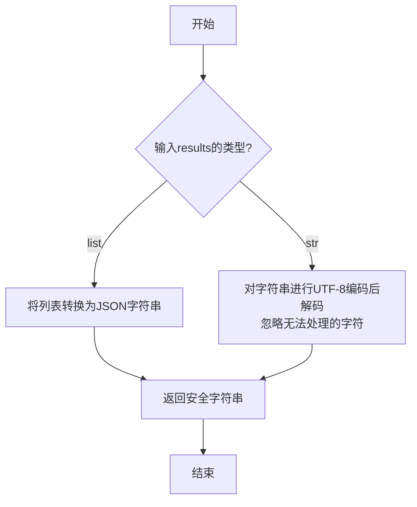
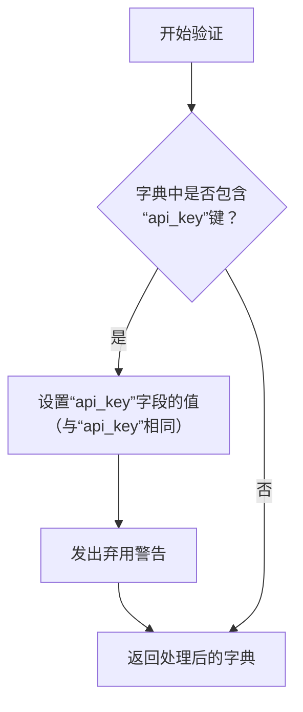
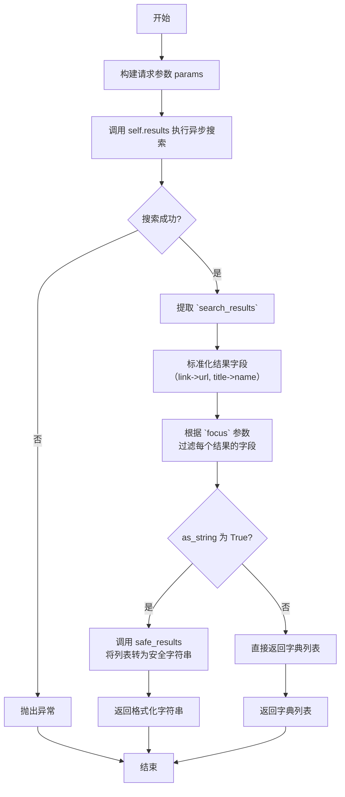

# `.\MetaGPT\metagpt\tools\search_engine_bing.py` 详细设计文档

该代码实现了一个异步的 Bing 搜索 API 封装类 `BingAPIWrapper`，它基于 Pydantic 模型构建，用于通过官方 Bing API 执行搜索查询。核心功能包括：通过 `run` 方法发起异步搜索请求，支持自定义返回结果数量、返回格式（字符串或字典列表）以及指定关注的字段；内部通过 `results` 方法使用 aiohttp 进行 HTTP 调用；包含一个全局工具函数 `safe_results` 用于安全地格式化搜索结果。代码结构清晰，利用 Pydantic 进行数据验证和配置管理，并支持通过外部传入的 aiohttp 会话或代理进行网络请求。

## 整体流程

```mermaid
graph TD
    A[用户调用 BingAPIWrapper.run] --> B[构建请求参数 params]
    B --> C[调用内部方法 results]
    C --> D{是否存在外部 aiosession?}
    D -- 是 --> E[使用外部 aiosession 发起 GET 请求]
    D -- 否 --> F[创建临时 aiohttp.ClientSession 发起 GET 请求]
    E --> G[解析 JSON 响应]
    F --> G
    G --> H[提取并转换搜索结果 (webPages.value)]
    H --> I{as_string 参数为 True?}
    I -- 是 --> J[调用 safe_results 函数格式化为字符串]
    I -- 否 --> K[返回字典列表]
    J --> L[返回格式化后的字符串]
```

## 类结构

```
BingAPIWrapper (Pydantic BaseModel)
├── 类字段: api_key, bing_url, aiosession, proxy
├── 类方法: validate_api_key (验证器), header (属性), run (主方法), results (内部请求方法)
└── 全局函数: safe_results
```

## 全局变量及字段


### `BingAPIWrapper.api_key`
    
用于访问Bing搜索API的订阅密钥，是API身份验证的必要凭证。

类型：`str`
    


### `BingAPIWrapper.bing_url`
    
Bing搜索API的端点URL，默认指向官方v7.0版本，用于发送搜索请求。

类型：`str`
    


### `BingAPIWrapper.aiosession`
    
可选的aiohttp客户端会话对象，用于复用HTTP连接以提高性能，若未提供则每次请求创建新会话。

类型：`Optional[aiohttp.ClientSession]`
    


### `BingAPIWrapper.proxy`
    
可选的代理服务器地址，用于通过代理发送HTTP请求，支持网络环境配置。

类型：`Optional[str]`
    
    

## 全局函数及方法


### `safe_results`

该函数用于将必应搜索的结果转换为安全的字符串格式。如果输入是列表，则将其转换为JSON字符串；如果输入是字符串，则进行UTF-8编码和解码以忽略无法处理的字符，确保输出字符串的安全性。

参数：

-  `results`：`str | list`，搜索的结果，可以是字符串或字典列表。

返回值：`str`，转换后的安全字符串格式的搜索结果。

#### 流程图



#### 带注释源码

```python
def safe_results(results: str | list) -> str:
    """Return the results of a bing search in a safe format.

    Args:
        results: The search results.

    Returns:
        The results of the search.
    """
    # 判断输入结果的类型
    if isinstance(results, list):
        # 如果是列表，使用json.dumps将其序列化为JSON格式的字符串
        safe_message = json.dumps([result for result in results])
    else:
        # 如果是字符串，先进行UTF-8编码，忽略无法编码的字符，
        # 然后再解码回UTF-8字符串，确保输出字符串不包含非法字符
        safe_message = results.encode("utf-8", "ignore").decode("utf-8")
    # 返回处理后的安全字符串
    return safe_message
```


### `BingAPIWrapper.validate_api_key`

这是一个 Pydantic 模型验证器，用于在类实例化前处理传入的字典数据。其主要功能是处理 `api_key` 字段的向后兼容性：如果传入的字典中包含 `api_key` 键，它会发出一个弃用警告，提示用户应使用 `api_key` 字段，并确保 `api_key` 字段被正确设置。

参数：

- `cls`：`type[BingAPIWrapper]`，指向 `BingAPIWrapper` 类本身的引用。
- `values`：`dict`，包含待验证和初始化的字段值的字典。

返回值：`dict`，返回处理后的字段值字典，供后续的模型验证和实例化使用。

#### 流程图



#### 带注释源码

```python
    @model_validator(mode="before")
    @classmethod
    def validate_api_key(cls, values: dict) -> dict:
        # 检查传入的字典中是否包含旧的 'api_key' 键
        if "api_key" in values:
            # 如果存在，则确保新的 'api_key' 字段被设置为相同的值
            values.setdefault("api_key", values["api_key"])
            # 发出弃用警告，提示用户应使用新的 'api_key' 字段
            warnings.warn("`api_key` is deprecated, use `api_key` instead", DeprecationWarning, stacklevel=2)
        # 返回处理后的字典，供后续的模型验证和实例化使用
        return values
```

### `BingAPIWrapper.header`

`BingAPIWrapper.header` 是一个属性（property），用于生成调用 Bing API 所需的 HTTP 请求头。它返回一个包含认证密钥的字典，该密钥用于授权对 Bing 搜索服务的访问。

参数：
- 无显式参数。该属性通过 `self` 访问类的实例属性 `api_key`。

返回值：`dict`，返回一个字典，其键为 `"Ocp-Apim-Subscription-Key"`，值为 `BingAPIWrapper` 实例的 `api_key` 字段值。此字典可直接用作 `aiohttp` 请求的 `headers` 参数。

#### 流程图

```mermaid
flowchart TD
    A[开始] --> B[访问实例属性 self.api_key]
    B --> C[构造字典<br>{'Ocp-Apim-Subscription-Key': self.api_key}]
    C --> D[返回字典]
    D --> E[结束]
```

#### 带注释源码

```python
    @property
    def header(self):
        # 定义一个只读属性 `header`
        # 当访问此属性时，返回一个包含 Bing API 订阅密钥的字典
        return {"Ocp-Apim-Subscription-Key": self.api_key}
        # 字典的键是固定的，值为当前实例的 `api_key` 字段
```


### `BingAPIWrapper.run`

该方法执行一次 Bing 搜索，并根据参数将结果格式化为字符串或字典列表返回。

参数：

-  `query`：`str`，搜索查询字符串。
-  `max_results`：`int`，要返回的最大结果数量，默认为 8。
-  `as_string`：`bool`，一个布尔标志，用于确定结果的返回类型。如果为 `True`，则返回格式化的字符串；如果为 `False`，则返回包含每个搜索结果详细信息的字典列表。
-  `focus`：`list[str] | None`，指定要从每个搜索结果中提取的特定字段列表。如果为 `None`，则默认聚焦于 `["snippet", "link", "title"]`。

返回值：`str | list[dict]`，搜索的结果。如果 `as_string` 为 `True`，则返回一个格式化的字符串；否则返回一个字典列表。

#### 流程图



#### 带注释源码

```python
async def run(
    self,
    query: str,
    max_results: int = 8,
    as_string: bool = True,
    focus: list[str] | None = None,
) -> str | list[dict]:
    """Return the results of a Google search using the official Bing API.

    Args:
        query: The search query.
        max_results: The number of results to return.
        as_string: A boolean flag to determine the return type of the results. If True, the function will
            return a formatted string with the search results. If False, it will return a list of dictionaries
            containing detailed information about each search result.
        focus: Specific information to be focused on from each search result.

    Returns:
        The results of the search.
    """
    # 1. 构建请求参数
    params = {
        "q": query,
        "count": max_results,
        "textFormat": "HTML",
    }
    # 2. 执行异步搜索，获取原始结果
    result = await self.results(params)
    # 3. 从原始结果中提取网页搜索列表
    search_results = result["webPages"]["value"]
    # 4. 设置默认聚焦字段
    focus = focus or ["snippet", "link", "title"]
    # 5. 标准化结果字典中的字段名，使其接口更通用
    for item_dict in search_results:
        item_dict["link"] = item_dict["url"]
        item_dict["title"] = item_dict["name"]
    # 6. 根据 `focus` 列表过滤每个结果，只保留指定的字段
    details = [{i: j for i, j in item_dict.items() if i in focus} for item_dict in search_results]
    # 7. 根据 `as_string` 标志决定返回格式
    if as_string:
        # 将字典列表转换为安全的JSON格式字符串
        return safe_results(details)
    # 直接返回字典列表
    return details
```


### `BingAPIWrapper.results`

该方法是一个异步方法，用于执行对Bing搜索API的HTTP GET请求，并返回JSON格式的响应结果。它处理了会话管理（支持传入外部会话或创建临时会话）、代理设置以及HTTP状态码检查。

参数：

-  `params`：`dict`，包含要发送给Bing API的查询参数，例如搜索关键词(`q`)、结果数量(`count`)等。

返回值：`dict`，Bing API返回的原始JSON响应数据，已转换为Python字典。

#### 流程图

```mermaid
flowchart TD
    A[开始: results(params)] --> B{aiosession 是否存在?};
    B -- 否 --> C[创建新的 aiohttp.ClientSession];
    C --> D[使用新会话发起GET请求];
    B -- 是 --> E[使用现有 aiosession 发起GET请求];
    D --> F[检查HTTP响应状态 response.raise_for_status];
    E --> F;
    F --> G[读取并解析JSON响应体 await response.json];
    G --> H[返回解析后的字典结果 res];
    H --> I[结束];
```

#### 带注释源码

```python
async def results(self, params: dict) -> dict:
    """Use aiohttp to run query and return the results async."""

    # 检查实例是否已持有aiohttp客户端会话对象
    if not self.aiosession:
        # 如果没有，则创建一个新的临时会话
        async with aiohttp.ClientSession() as session:
            # 使用`with`语句确保会话在使用后被正确关闭
            # 发起异步GET请求，传入URL、查询参数、请求头和代理设置
            async with session.get(self.bing_url, params=params, headers=self.header, proxy=self.proxy) as response:
                # 如果HTTP响应状态码不是2xx，此方法将抛出aiohttp.ClientResponseError异常
                response.raise_for_status()
                # 异步读取响应体并将其从JSON格式解析为Python字典
                res = await response.json()
    else:
        # 如果实例已持有会话对象，则直接使用它发起请求
        async with self.aiosession.get(
            self.bing_url, params=params, headers=self.header, proxy=self.proxy
        ) as response:
            # 同样进行状态码检查和JSON解析
            response.raise_for_status()
            res = await response.json()

    # 返回解析后的API结果字典
    return res
```


## 关键组件


### BingAPIWrapper 类

封装了与 Bing Web Search API 交互的核心逻辑，负责构建请求、处理响应以及格式化返回结果。

### 异步 HTTP 客户端 (aiohttp)

使用 `aiohttp.ClientSession` 进行异步 HTTP 请求，支持传入外部会话或内部创建，并可通过 `proxy` 参数配置代理。

### 请求参数构建器

在 `run` 方法中，根据输入参数（如查询词、结果数量）构建符合 Bing API 规范的查询参数字典。

### 响应处理器

处理来自 Bing API 的 JSON 响应，提取 `webPages` 下的 `value` 字段，并根据 `focus` 参数过滤和重命名键值以生成最终结果列表。

### 结果格式化器 (`safe_results` 函数)

将搜索结果列表安全地转换为 JSON 字符串格式，或对字符串进行编码处理以确保输出格式的统一和安全。

### 配置验证器 (`validate_api_key` 类方法)

一个 Pydantic 模型验证器，用于在模型初始化前处理输入数据，此处用于处理 `api_key` 字段的向后兼容性警告。

### 命令行接口 (CLI)

通过 `fire` 库，将 `BingAPIWrapper` 类的 `run` 方法暴露为命令行工具，便于直接调用。


## 问题及建议


### 已知问题

-   **API Key 验证逻辑存在缺陷**：`validate_api_key` 类方法的本意是处理 `api_key` 字段的验证和向后兼容，但其实现逻辑存在错误。它检查 `values` 字典中是否存在 `"api_key"` 键，如果存在，则再次使用 `setdefault` 设置相同的键，这没有任何实际效果。更重要的是，它没有检查 `api_key` 是否为空或无效，这可能导致后续请求因缺少有效的 API 密钥而失败。
-   **`safe_results` 函数设计不一致**：该函数的参数 `results` 类型注解为 `str | list`，但函数内部对 `str` 类型的处理是进行编码和解码以“确保安全”，而对 `list` 类型则直接进行 JSON 序列化。这种设计意图不清晰，且当输入为 `str` 类型时，其“安全”处理（忽略编码错误）可能并非调用者所期望的，特别是当 `run` 方法在 `as_string=True` 时返回的是由该函数处理后的列表序列化字符串，而非原始字符串。
-   **缺少请求参数验证**：`run` 方法中的 `max_results` 参数没有进行范围或有效性验证（例如，Bing API 可能对单次请求的最大结果数有限制）。直接传递给 API 可能导致未定义行为或错误。
-   **硬编码的 URL 和响应字段映射**：`bing_url` 和响应中字段的映射（如 `"url"` -> `"link"`, `"name"` -> `"title"`）是硬编码在 `run` 方法中的。如果 API 端点或响应结构发生变化，需要修改代码。
-   **`focus` 参数默认值可能引发错误**：`run` 方法中，`focus` 的默认值为 `None`，但在后续逻辑中，如果 `focus` 为 `None`，则将其设置为 `["snippet", "link", "title"]`。然而，Bing API 的原始响应中可能并不包含名为 `"snippet"` 的字段（实际字段名可能是 `"snippet"` 或其他），这可能导致 `KeyError`。代码中通过映射确保了 `"link"` 和 `"title"` 的存在，但 `"snippet"` 未做处理。

### 优化建议

-   **重构 `validate_api_key` 方法**：应修正该方法，使其能正确验证 `api_key` 的存在性和有效性（例如，非空字符串）。可以考虑移除已弃用参数的警告逻辑，除非确实有向后兼容的需求，并确保警告信息准确。
-   **重命名或重构 `safe_results` 函数**：建议明确该函数的职责。如果目的是将结果转换为安全字符串用于展示或日志，可以重命名为 `format_results_to_safe_string` 并优化逻辑。对于列表输入，直接进行 JSON 序列化是合理的；对于字符串输入，应明确其预期输入场景（例如，是否来自原始 API 错误消息），并采用更合适的处理方式（如转义或截断）。更好的设计是让 `run` 方法在 `as_string=True` 时直接返回格式化的字符串，而不是依赖一个通用但职责模糊的函数。
-   **增加输入参数验证**：在 `run` 方法中，对 `max_results` 等参数添加验证逻辑，确保其值在 API 允许的范围内，并在超出范围时进行修正或抛出清晰的异常。
-   **将配置和映射提取为常量或配置项**：将 `bing_url`、请求头键名以及响应字段映射关系提取为类常量或通过配置注入，提高代码的可维护性和灵活性。
-   **修复 `focus` 参数的默认值逻辑**：确保 `focus` 参数默认列表中的字段名与 Bing API 实际返回的字段名一致。检查 API 文档，使用正确的字段名（例如，`"snippet"` 可能应为 `"snippet"` 或检查实际响应）。可以在字段映射后，再根据 `focus` 列表进行筛选。
-   **优化异步会话管理**：当前代码在 `results` 方法中，如果 `self.aiosession` 不存在，会为每次请求创建一个新的 `ClientSession`。虽然这在功能上可行，但最佳实践是复用会话。建议在类初始化时，如果未提供 `aiosession`，则创建一个并存储在实例变量中，并在类生命周期结束时（或使用异步上下文管理器）妥善关闭。目前代码缺少会话的关闭逻辑。
-   **增强错误处理**：`results` 方法中虽然调用了 `response.raise_for_status()`，但更外层的 `run` 方法没有对可能的异常（如 `aiohttp.ClientError`, `json.JSONDecodeError`）进行捕获和处理。建议在 `run` 方法中添加适当的异常处理，返回友好的错误信息或抛出封装后的异常。
-   **改进类型注解**：例如，`safe_results` 函数的返回值类型注解应为 `str`。`run` 方法的 `focus` 参数类型 `list[str] | None` 是合适的，但可以更精确地使用 `typing.Optional[list[str]]`。
-   **移除脚本入口处的 `fire` 依赖**：`if __name__ == "__main__":` 块中使用了 `fire` 库来创建 CLI。如果此脚本主要作为库使用，应考虑将此 CLI 功能分离到单独的脚本或示例中，以避免不必要的运行时依赖。


## 其它


### 设计目标与约束

该代码的设计目标是提供一个异步的、类型安全的、易于使用的Bing搜索API封装器。核心约束包括：必须支持异步操作以提高并发性能；必须使用Pydantic进行数据验证和配置管理，确保类型安全；必须兼容官方Bing API的接口规范；必须能够灵活地返回格式化字符串或原始字典列表以满足不同调用场景；必须支持通过代理进行网络请求。

### 错误处理与异常设计

代码的错误处理主要依赖于`aiohttp`库和`response.raise_for_status()`方法。当HTTP请求返回非2xx状态码时，该方法会抛出`aiohttp.ClientResponseError`异常。调用者需要捕获此异常并进行处理。`model_validator`用于在模型初始化前验证和转换输入数据，但不会抛出业务逻辑异常。`run`方法内部没有显式的异常捕获，将网络或JSON解析错误抛给上层调用者处理。`safe_results`函数负责安全地处理结果，防止编码问题。

### 数据流与状态机

1.  **初始化流程**：用户提供`api_key`等参数创建`BingAPIWrapper`实例。`model_validator`对输入进行预处理（如处理已弃用参数）。
2.  **搜索执行流程 (`run`方法)**：
    *   **输入**：接收查询字符串`query`、结果数量`max_results`、返回格式标志`as_string`、关注字段列表`focus`。
    *   **处理**：构建请求参数，调用`results`方法执行异步HTTP GET请求。对返回的JSON结果进行解析和重构（例如，将`url`字段映射为`link`，`name`映射为`title`），并根据`focus`列表过滤字段。
    *   **输出**：根据`as_string`标志，返回由`safe_results`函数格式化的JSON字符串，或返回包含过滤后字段的字典列表。
3.  **请求执行流程 (`results`方法)**：根据实例是否提供了`aiosession`，决定使用外部会话还是创建临时会话发起请求。设置请求头（包含API Key）和代理，处理响应状态码，并解析JSON响应体。
4.  **结果安全处理流程 (`safe_results`函数)**：如果输入是列表，则使用`json.dumps`序列化；如果是字符串，则进行UTF-8编码和解码以忽略非法字符，确保输出字符串的安全性。

### 外部依赖与接口契约

1.  **外部依赖库**：
    *   `aiohttp`: 用于执行异步HTTP请求，是网络通信的核心依赖。
    *   `pydantic`: 用于数据模型定义、验证和配置管理，是类型安全和配置管理的核心依赖。
    *   `json`: Python标准库，用于JSON序列化。
    *   `warnings`: Python标准库，用于发出弃用警告。
    *   `typing`: Python标准库，用于类型注解。

2.  **外部服务接口契约**：
    *   **Bing API 端点**: `https://api.bing.microsoft.com/v7.0/search` (默认值，可配置)。
    *   **请求方法**: GET。
    *   **必需请求头**: `Ocp-Apim-Subscription-Key`，值为提供的`api_key`。
    *   **查询参数**: 至少包含`q`(查询词)、`count`(结果数量)、`textFormat`(格式)。
    *   **响应格式**: 预期为JSON格式，且包含`webPages` -> `value`路径的列表结构。

3.  **代码接口契约**：
    *   `BingAPIWrapper.run` 方法：是主入口点，接受搜索参数，返回字符串或字典列表。
    *   `BingAPIWrapper.results` 方法：内部方法，执行原始API调用，返回原始JSON字典。
    *   `safe_results` 函数：工具函数，负责将结果转换为安全的字符串格式。

    