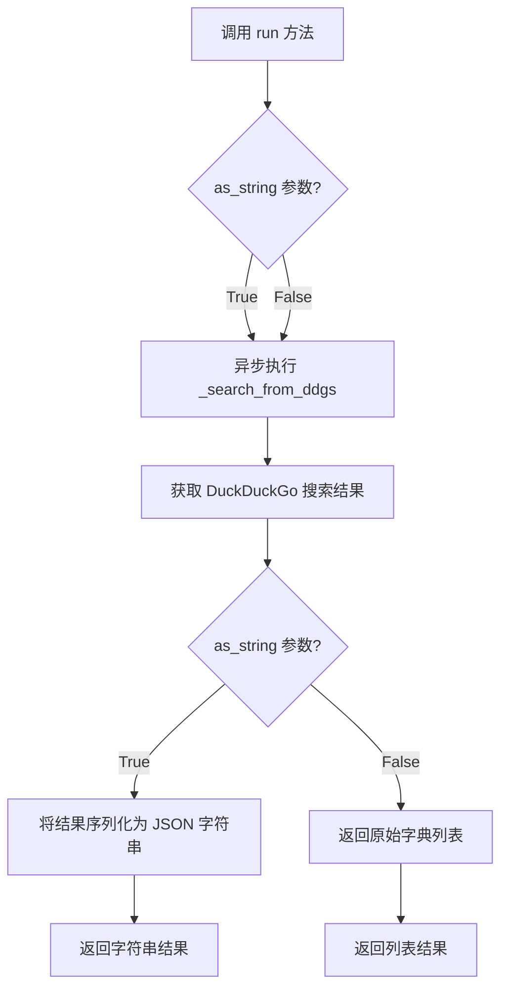
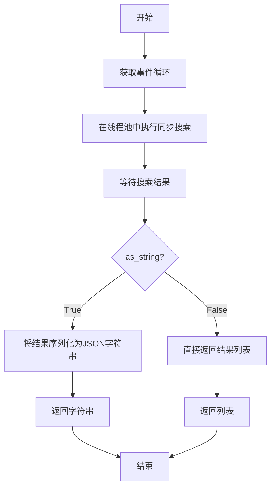

# `.\MetaGPT\metagpt\tools\search_engine_ddg.py` 详细设计文档

该代码实现了一个异步的 DuckDuckGo 搜索 API 包装器，它封装了 `duckduckgo_search` 库，提供了同步和异步两种调用方式，并支持将搜索结果以格式化字符串或结构化字典列表的形式返回。

## 整体流程



## 类结构

```
BaseModel (Pydantic 基类)
└── DDGAPIWrapper (DuckDuckGo API 包装器)
```

## 全局变量及字段


### `DDGAPIWrapper.loop`
    
异步事件循环，用于在后台线程中执行搜索任务，如果为None则使用当前事件循环

类型：`Optional[asyncio.AbstractEventLoop]`
    


### `DDGAPIWrapper.executor`
    
线程池执行器，用于管理搜索任务的并发执行，如果为None则使用默认执行器

类型：`Optional[futures.Executor]`
    


### `DDGAPIWrapper.proxy`
    
HTTP代理服务器地址，用于配置DuckDuckGo搜索客户端的网络代理

类型：`Optional[str]`
    


### `DDGAPIWrapper.ddgs`
    
DuckDuckGo搜索客户端实例的属性包装器，根据proxy配置动态创建搜索客户端

类型：`property -> DDGS`
    
    

## 全局函数及方法

### `DDGAPIWrapper.run`

该方法是一个异步方法，用于执行 DuckDuckGo 搜索。它接受一个查询字符串、最大结果数和返回格式标志，并返回搜索结果。根据 `as_string` 参数的值，结果可以是一个格式化的 JSON 字符串，也可以是一个包含详细信息的字典列表。

参数：

- `query`：`str`，搜索查询字符串。
- `max_results`：`int`，要返回的最大结果数，默认为 8。
- `as_string`：`bool`，一个布尔标志，用于确定返回结果的类型。如果为 True，则返回格式化的 JSON 字符串；如果为 False，则返回字典列表。

返回值：`str | list[dict]`，如果 `as_string` 为 True，则返回 JSON 字符串；否则返回包含搜索结果的字典列表。

#### 流程图



#### 带注释源码

```python
async def run(
    self,
    query: str,
    max_results: int = 8,
    as_string: bool = True,
) -> str | list[dict]:
    """Return the results of a Google search using the official Google API

    Args:
        query: The search query.
        max_results: The number of results to return.
        as_string: A boolean flag to determine the return type of the results. If True, the function will
            return a formatted string with the search results. If False, it will return a list of dictionaries
            containing detailed information about each search result.

    Returns:
        The results of the search.
    """
    # 获取当前事件循环，如果未设置则使用默认事件循环
    loop = self.loop or asyncio.get_event_loop()
    # 在线程池中执行同步搜索函数，避免阻塞事件循环
    future = loop.run_in_executor(
        self.executor,
        self._search_from_ddgs,
        query,
        max_results,
    )
    # 等待搜索结果
    search_results = await future

    # 根据 as_string 参数决定返回格式
    if as_string:
        # 将结果列表序列化为 JSON 字符串
        return json.dumps(search_results, ensure_ascii=False)
    # 直接返回结果列表
    return search_results
```

### `DDGAPIWrapper._search_from_ddgs`

该方法执行对 DuckDuckGo 搜索引擎的同步文本搜索，并将搜索结果格式化为一个包含链接、摘要和标题的字典列表。

参数：

- `query`：`str`，要搜索的查询字符串。
- `max_results`：`int`，要返回的最大结果数量。

返回值：`list[dict[str, str]]`，一个字典列表，每个字典包含 `link`、`snippet` 和 `title` 三个键，分别对应搜索结果的链接、摘要和标题。

#### 流程图

```mermaid
flowchart TD
    A[开始] --> B[初始化DDGS客户端]
    B --> C[执行文本搜索<br>self.ddgs.text(query)]
    C --> D[遍历搜索结果<br>使用zip限制数量]
    D --> E[为每个结果构建字典<br>link: href<br>snippet: body<br>title: title]
    E --> F[返回字典列表]
    F --> G[结束]
```

#### 带注释源码

```python
def _search_from_ddgs(self, query: str, max_results: int):
    # 使用列表推导式，将DDGS的文本搜索结果转换为指定格式的字典列表
    # 1. self.ddgs.text(query): 调用DDGS客户端的text方法执行搜索，返回一个生成器
    # 2. zip(range(max_results), ...): 将结果生成器与一个范围对象配对，以限制返回的结果数量为max_results
    # 3. for (_, i) in ...: 遍历配对后的结果，忽略索引（_），i是原始的搜索结果字典
    # 4. {"link": i["href"], "snippet": i["body"], "title": i["title"]}: 从原始结果中提取'href'、'body'和'title'字段，并映射到新的键名'link'、'snippet'和'title'
    return [
        {"link": i["href"], "snippet": i["body"], "title": i["title"]}
        for (_, i) in zip(range(max_results), self.ddgs.text(query))
    ]
```

## 关键组件


### DDGAPIWrapper 类

一个封装了 DuckDuckGo 搜索功能的异步 API 包装器，提供同步和异步两种调用方式，并支持结果格式化输出。

### 异步执行与线程池集成

通过 `asyncio` 事件循环和 `concurrent.futures.Executor` 线程池，将阻塞的同步网络搜索操作 (`duckduckgo_search`) 转换为非阻塞的异步任务，避免阻塞主事件循环。

### 结果格式化与序列化

提供灵活的返回格式选项 (`as_string` 参数)，支持将原始搜索结果字典列表转换为 JSON 字符串或保持为原始字典列表，以适应不同的下游处理需求。

### 配置与依赖管理

使用 Pydantic `BaseModel` 进行配置管理，支持通过 `proxy` 字段配置网络代理，并通过 `try...except` 结构优雅处理可选依赖 (`duckduckgo_search`) 的导入问题。


## 问题及建议

### 已知问题

-   **文档与实际行为不符**：`run` 方法的文档字符串描述为“使用官方 Google API 返回 Google 搜索结果”，但代码实际使用的是 DuckDuckGo 搜索 (`DDGS`)。这会造成严重的误导。
-   **未使用的参数**：`run` 方法签名中定义了 `focus: list[str] | None = None` 参数，但在方法体内部和 `_search_from_ddgs` 方法中均未使用。这会导致调用者困惑，并可能在未来引入错误。
-   **同步方法重载与异步实现不匹配**：代码使用 `@overload` 装饰器为同步调用定义了 `run` 方法的重载，但实际的 `run` 方法是一个 `async` 异步方法。这会导致类型提示与实际可调用接口不一致，静态类型检查器（如 mypy）可能会报错，且用户无法直接以重载签名所示的方式同步调用 `run`。
-   **潜在的阻塞操作**：`_search_from_ddgs` 方法内部执行 `self.ddgs.text(query)` 是同步的 I/O 操作。虽然它被包装在 `run_in_executor` 中以避免阻塞事件循环，但对于高并发场景，线程池可能成为瓶颈，且错误处理在另一个线程中更为复杂。
-   **缺少错误处理**：代码没有对网络请求失败、`DDGS` 初始化失败、解析响应失败等异常情况进行捕获和处理。这可能导致程序因未处理的异常而崩溃。
-   **循环和执行器的生命周期管理不明确**：`loop` 和 `executor` 由外部传入，但类本身不负责它们的创建或关闭。如果外部没有正确管理，可能会导致资源泄漏（如线程池未关闭）。

### 优化建议

-   **修正文档和命名**：将 `run` 方法及其类的文档字符串、注释中的“Google”全部更正为“DuckDuckGo”。考虑将类名 `DDGAPIWrapper` 更改为 `DuckDuckGoSearchWrapper` 以更清晰。
-   **清理未使用的参数**：从 `run` 方法的签名中移除未使用的 `focus` 参数。如果需要此功能，应在 `_search_from_ddgs` 方法中实现。
-   **统一方法签名**：移除同步的 `@overload` 装饰器。提供一个真正的同步方法（例如 `run_sync`）或明确指示这是一个异步接口。更好的做法是只保留异步接口，并让调用者自己决定如何运行（例如使用 `asyncio.run`）。
-   **增强错误处理**：在 `_search_from_ddgs` 和 `run` 方法中添加 `try-except` 块，捕获可能出现的异常（如 `RequestException`, `KeyError`, `StopIteration` 等），并记录日志或返回友好的错误信息/空结果。
-   **考虑完全异步化**：评估 `duckduckgo_search` 库是否有异步支持或替代方案。如果没有，可以考虑使用 `aiohttp` 等异步 HTTP 客户端重新实现搜索逻辑，以彻底避免线程池的使用，提高在高并发异步环境下的性能和可维护性。
-   **提供资源管理上下文**：可以实现 `__aenter__` 和 `__aexit__` 或 `__enter__` 和 `__exit__` 方法，让类能够管理其内部资源（如创建和清理默认的线程池执行器），支持 `with` 或 `async with` 语句，确保资源被正确释放。
-   **增加结果后处理选项**：当前 `as_string` 为 `True` 时直接返回 JSON 字符串。可以增加一个格式化函数或模板，让用户能自定义返回字符串的格式（如 Markdown 列表）。
-   **改进结果字段映射**：`_search_from_ddgs` 方法硬编码了字段映射（`"link"`, `"snippet"`, `"title"`）。可以使其可配置，或者直接返回原始数据字典，让调用者决定如何提取信息，提高灵活性。

## 其它


### 设计目标与约束

该代码旨在提供一个异步、类型安全的 DuckDuckGo 搜索 API 封装器。其主要设计目标包括：
1.  **功能封装**：将 DuckDuckGo 搜索的底层调用细节（如使用 `duckduckgo_search` 库、处理代理）封装在一个简洁的类接口之后。
2.  **异步支持**：通过 `asyncio` 支持异步操作，避免在异步上下文中执行同步网络 I/O 时阻塞事件循环。
3.  **类型安全与灵活性**：利用 Python 类型注解和 `@overload` 装饰器，为 `run` 方法提供清晰的类型提示，支持两种返回格式（格式化字符串或原始字典列表），提升代码的可读性和 IDE 支持。
4.  **配置解耦**：通过 Pydantic `BaseModel` 管理配置（如事件循环、执行器、代理），使类的实例化与运行时环境解耦。
5.  **命令行接口**：通过 `fire` 库提供简单的命令行调用方式，便于脚本化使用。

主要约束包括：
*   **外部依赖**：强依赖于 `duckduckgo_search` 第三方库进行实际搜索。
*   **执行模型**：同步的搜索逻辑通过 `run_in_executor` 在单独的线程/进程中执行，以适配异步框架，这引入了额外的线程切换开销。
*   **返回格式**：当 `as_string=True` 时，返回的是 JSON 字符串，而非更结构化的数据，可能增加调用方的解析负担。

### 错误处理与异常设计

代码中的错误处理机制相对基础，主要体现在：
1.  **导入时依赖检查**：在 `try-except` 块中导入 `duckduckgo_search`，如果失败则抛出明确的 `ImportError`，指导用户安装缺失的依赖项 (`pip install -e.[search-ddg]`)。
2.  **执行器异常传播**：`loop.run_in_executor` 会将 `_search_from_ddgs` 方法中抛出的任何异常（例如网络错误、`duckduckgo_search` 库的异常）捕获并封装到返回的 `Future` 对象中。当 `await future` 执行时，这些异常会在调用 `run` 的协程中重新抛出。调用方需要自行处理这些潜在的异常（如 `asyncio.TimeoutError`, `ConnectionError`, 或 `duckduckgo_search` 定义的异常）。
3.  **缺乏输入验证**：`run` 方法的参数（如 `query`, `max_results`）没有进行有效性验证（例如空查询、非正数的 `max_results`）。依赖 `duckduckgo_search` 库或底层逻辑处理无效输入，可能导致不可预知的行为或异常。
4.  **无重试机制**：网络请求失败时没有内置的重试逻辑，可靠性依赖于底层库和网络稳定性。

### 数据流与状态机

该组件的数据流清晰，无复杂的状态机：
1.  **初始化**：创建 `DDGAPIWrapper` 实例，可配置 `loop`, `executor`, `proxy`。实例本身是无状态的（`ddgs` 是属性，每次调用新建 `DDGS` 实例）。
2.  **调用 `run`**：
    *   **输入**：用户提供搜索查询 (`query`)、结果数量限制 (`max_results`) 和返回格式标志 (`as_string`)。
    *   **处理**：
        a.  获取或创建事件循环 (`loop`)。
        b.  将同步的 `_search_from_ddgs` 方法（包含对 `DDGS().text()` 的调用）提交到指定的 `executor`（默认为 `None`，使用默认线程池执行器）中运行。
        c.  `_search_from_ddgs` 方法使用 `duckduckgo_search` 库获取原始搜索结果，并将其转换为预定义结构的字典列表 `[{"link": ..., "snippet": ..., "title": ...}, ...]`。
    *   **输出**：
        *   如果 `as_string` 为 `True`，则将字典列表通过 `json.dumps` 序列化为 JSON 格式字符串返回。
        *   如果 `as_string` 为 `False`，则直接返回字典列表。
3.  **数据格式**：内部统一使用字典列表作为中间表示，最终根据 `as_string` 参数决定输出为结构化的列表还是序列化的字符串。

### 外部依赖与接口契约

1.  **显式依赖**：
    *   `duckduckgo_search`：核心依赖，用于执行 DuckDuckGo 搜索。代码通过 `DDGS` 类与之交互。版本兼容性未指定。
    *   `pydantic`：用于数据模型定义和配置管理，通过继承 `BaseModel` 并设置 `arbitrary_types_allowed=True` 来允许 `loop` 和 `executor` 这类非 Pydantic 原生类型的字段。
    *   `fire`：可选依赖，仅当脚本作为主程序运行时用于生成命令行接口。不影响核心类的功能。
2.  **隐式依赖**：
    *   `asyncio`：Python 标准库，用于异步执行支持。
    *   `concurrent.futures`：Python 标准库，用于定义 `Executor` 类型。
    *   `typing`：Python 标准库，用于类型注解。
3.  **接口契约**：
    *   **`DDGAPIWrapper.run` 方法**：是主要的外部接口。其行为由重载签名定义：接受字符串查询，返回字符串（JSON）或字典列表。它承诺在异步上下文中非阻塞地执行搜索。
    *   **`DDGAPIWrapper` 类初始化器**：接受可选的 `loop`, `executor`, `proxy` 参数，允许外部控制异步执行环境和网络代理。
    *   **`duckduckgo_search.DDGS.text` 方法**：代码假设该方法返回一个可迭代对象，其中每一项都是包含 `href`, `body`, `title` 键的字典。这是与 `duckduckgo_search` 库的一个脆弱契约，如果库的返回格式发生变化，`_search_from_ddgs` 方法将失效。
    *   **命令行接口**：当直接运行脚本时，通过 `fire.Fire` 暴露 `DDGAPIWrapper().run` 方法作为命令行工具，其参数与 `run` 方法参数对应。

    