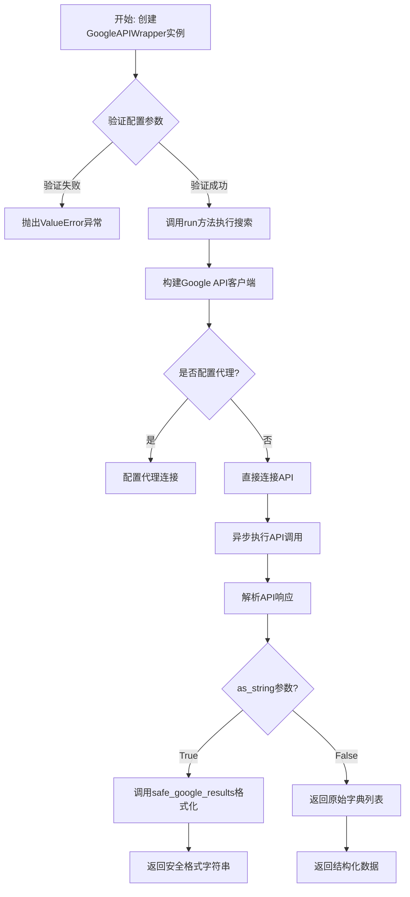
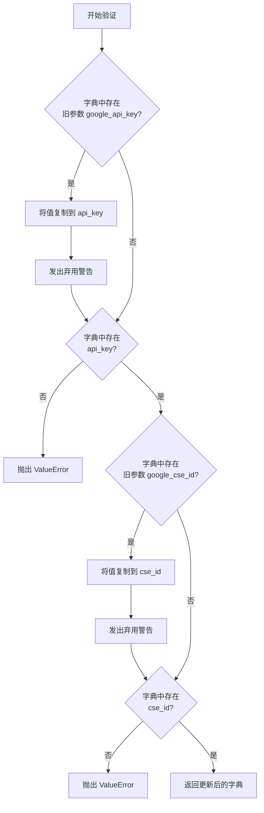

# `.\MetaGPT\metagpt\tools\search_engine_googleapi.py` 详细设计文档

该代码实现了一个Google自定义搜索API的异步封装器，核心功能是提供对Google搜索服务的程序化访问。它通过Google Custom Search JSON API执行搜索查询，支持同步和异步调用，并能将搜索结果格式化为字符串或结构化字典列表。代码还处理了API密钥验证、代理配置和向后兼容性等细节。

## 整体流程



## 类结构

```
BaseModel (Pydantic基类)
└── GoogleAPIWrapper (Google API包装器)

全局函数:
├── safe_google_results
└── __main__入口
```

## 全局变量及字段


### `GoogleAPIWrapper.api_key`
    
用于访问Google Custom Search JSON API的身份验证密钥。

类型：`str`
    


### `GoogleAPIWrapper.cse_id`
    
Google可编程搜索引擎（CSE）的唯一标识符，用于指定搜索范围。

类型：`str`
    


### `GoogleAPIWrapper.discovery_service_url`
    
Google API Discovery Service的可选自定义URL，用于构建API客户端。

类型：`Optional[str]`
    


### `GoogleAPIWrapper.loop`
    
用于运行异步任务的事件循环，如果未提供则使用默认事件循环。

类型：`Optional[asyncio.AbstractEventLoop]`
    


### `GoogleAPIWrapper.executor`
    
用于执行阻塞IO操作的线程池执行器，支持并发处理。

类型：`Optional[futures.Executor]`
    


### `GoogleAPIWrapper.proxy`
    
HTTP/HTTPS代理服务器地址，用于通过代理访问Google API。

类型：`Optional[str]`
    
    

## 全局函数及方法


### `safe_google_results`

该函数用于将谷歌搜索结果转换为安全的字符串格式。它主要处理两种输入：列表类型和字符串类型。对于列表，它使用 `json.dumps` 将其序列化为 JSON 字符串；对于字符串，它通过编码再解码的过程来移除或替换可能存在的非 UTF-8 字符，确保输出的字符串是安全且可读的。

参数：

-  `results`：`str | list`，需要被安全格式化的谷歌搜索结果。可以是原始的 JSON 字符串，也可以是一个包含搜索结果的字典列表。

返回值：`str`，经过安全处理后的字符串格式的搜索结果。

#### 流程图

```mermaid
flowchart TD
    A[开始: safe_google_results(results)] --> B{判断 results 类型};
    B -- 是列表 --> C[使用 json.dumps 序列化列表];
    B -- 是字符串 --> D[将字符串编码为字节<br/>忽略错误<br/>再解码回UTF-8字符串];
    C --> E[返回序列化后的JSON字符串];
    D --> E;
    E --> F[结束: 返回安全字符串];
```

#### 带注释源码

```python
def safe_google_results(results: str | list) -> str:
    """Return the results of a google search in a safe format.

    Args:
        results: The search results.  # 参数：需要被安全格式化的谷歌搜索结果

    Returns:
        The results of the search.  # 返回值：安全格式的搜索结果字符串
    """
    # 判断输入结果的类型
    if isinstance(results, list):
        # 如果结果是列表，使用 json.dumps 将其序列化为 JSON 格式的字符串
        safe_message = json.dumps([result for result in results])
    else:
        # 如果结果是字符串，先将其编码为字节，忽略无法编码的字符，
        # 然后再解码回 UTF-8 字符串，以确保输出字符串的编码安全。
        safe_message = results.encode("utf-8", "ignore").decode("utf-8")
    # 返回处理后的安全字符串
    return safe_message
```


### `GoogleAPIWrapper.validate_google`

这是一个Pydantic模型验证器，用于在`GoogleAPIWrapper`类实例化前验证和预处理传入的配置字典。它主要处理两个任务：1) 将旧的、已弃用的参数名（`google_api_key`, `google_cse_id`）映射到新的参数名（`api_key`, `cse_id`），并发出弃用警告；2) 确保构建Google搜索API客户端所必需的两个参数（`api_key`和`cse_id`）存在，否则抛出`ValueError`异常。

参数：

-   `cls`：`type[GoogleAPIWrapper]`，指向`GoogleAPIWrapper`类本身的引用。
-   `values`：`dict`，包含传入的、待验证的模型字段值的字典。

返回值：`dict`，返回经过验证和更新后的字段值字典。

#### 流程图



#### 带注释源码

```python
    @model_validator(mode="before")
    @classmethod
    def validate_google(cls, values: dict) -> dict:
        # 1. 处理旧的 `google_api_key` 参数，将其值迁移到新的 `api_key` 参数
        if "google_api_key" in values:
            values.setdefault("api_key", values["google_api_key"])
            # 发出弃用警告，提示用户使用新的参数名
            warnings.warn("`google_api_key` is deprecated, use `api_key` instead", DeprecationWarning, stacklevel=2)

        # 2. 检查新的 `api_key` 参数是否存在，不存在则抛出异常
        if "api_key" not in values:
            raise ValueError(
                "To use google search engine, make sure you provide the `api_key` when constructing an object. You can obtain "
                "an API key from https://console.cloud.google.com/apis/credentials."
            )

        # 3. 处理旧的 `google_cse_id` 参数，将其值迁移到新的 `cse_id` 参数
        if "google_cse_id" in values:
            values.setdefault("cse_id", values["google_cse_id"])
            # 发出弃用警告，提示用户使用新的参数名
            warnings.warn("`google_cse_id` is deprecated, use `cse_id` instead", DeprecationWarning, stacklevel=2)

        # 4. 检查新的 `cse_id` 参数是否存在，不存在则抛出异常
        if "cse_id" not in values:
            raise ValueError(
                "To use google search engine, make sure you provide the `cse_id` when constructing an object. You can obtain "
                "the cse_id from https://programmablesearchengine.google.com/controlpanel/create."
            )
        # 5. 返回处理后的参数字典，供Pydantic继续后续的模型构建
        return values
```

### `GoogleAPIWrapper.google_api_client`

这是一个属性方法，用于构建并返回一个配置好的 Google Custom Search API 客户端对象。它会根据实例的配置（如API密钥、代理设置等）来初始化 `googleapiclient.discovery.build` 客户端，并返回其 `cse()` 方法，该方法专门用于执行自定义搜索。

参数：
-  `self`：`GoogleAPIWrapper`，`GoogleAPIWrapper` 类的实例，用于访问实例的配置属性（如 `api_key`, `proxy` 等）。

返回值：`googleapiclient.discovery.Resource`，一个配置好的 Google Custom Search API 客户端对象，其 `cse()` 方法可用于执行搜索。

#### 流程图

```mermaid
flowchart TD
    A[开始] --> B[初始化构建参数字典<br>包含 api_key 和 discoveryServiceUrl]
    B --> C{是否设置了代理?}
    C -- 是 --> D[解析代理URL<br>获取协议、主机名、端口]
    D --> E[根据代理协议类型<br>创建 httplib2.Http 对象<br>并配置代理信息]
    E --> F[将配置好的 Http 对象<br>加入构建参数字典]
    C -- 否 --> F
    F --> G[使用构建参数<br>调用 build 方法<br>创建 'customsearch' 服务]
    G --> H[返回服务的 cse() 方法<br>作为搜索客户端]
    H --> I[结束]
```

#### 带注释源码

```python
    @property
    def google_api_client(self):
        # 1. 初始化构建参数字典，包含必填的开发者密钥和可选的发现服务URL
        build_kwargs = {"developerKey": self.api_key, "discoveryServiceUrl": self.discovery_service_url}
        
        # 2. 检查是否配置了代理
        if self.proxy:
            # 2.1 解析代理URL字符串，获取其组成部分（如协议、主机名、端口）
            parse_result = urlparse(self.proxy)
            proxy_type = parse_result.scheme
            
            # 2.2 处理代理协议类型：Google API客户端库可能期望'http'代表HTTPS代理
            if proxy_type == "https":
                proxy_type = "http"
            
            # 2.3 创建一个配置了代理信息的 httplib2.Http 对象
            #     httplib2.ProxyInfo 用于定义代理的详细信息
            build_kwargs["http"] = httplib2.Http(
                proxy_info=httplib2.ProxyInfo(
                    # 将代理协议字符串（如 'http', 'socks5'）映射为 httplib2 的常量
                    getattr(httplib2.socks, f"PROXY_TYPE_{proxy_type.upper()}"),
                    parse_result.hostname, # 代理服务器主机名
                    parse_result.port,     # 代理服务器端口
                ),
            )
        
        # 3. 使用配置好的参数构建 Google Custom Search API 的 'v1' 版本服务
        service = build("customsearch", "v1", **build_kwargs)
        
        # 4. 返回该服务的 'cse' 资源对象，它是执行搜索操作的主要接口
        return service.cse()
```

### `GoogleAPIWrapper.run`

该方法执行一次Google搜索，并返回格式化后的搜索结果。它支持异步执行，可以控制返回结果的数量和格式（字符串或字典列表），并能指定需要从每个搜索结果中提取的特定字段。

参数：

- `query`：`str`，搜索查询字符串。
- `max_results`：`int`，默认值为8，指定要返回的最大搜索结果数量。
- `as_string`：`bool`，默认值为`True`，决定返回结果的格式。为`True`时返回格式化的字符串，为`False`时返回包含详细信息的字典列表。
- `focus`：`list[str] | None`，默认值为`None`，指定需要从每个搜索结果中提取的特定字段列表（如 `["snippet", "link", "title"]`）。如果为`None`，则默认提取`snippet`、`link`和`title`字段。

返回值：`str | list[dict]`，根据`as_string`参数，返回格式化的搜索结果字符串或包含搜索结果的字典列表。

#### 流程图

```mermaid
flowchart TD
    A[开始: run(query, max_results, as_string, focus)] --> B{获取或创建事件循环};
    B --> C[在指定执行器中<br>异步执行同步API调用];
    C --> D[等待API调用结果];
    D --> E{API响应中<br>是否有“items”字段?};
    E -- 是 --> F[提取“items”列表];
    E -- 否 --> G[将search_results设为空列表];
    F --> H[根据focus参数<br>过滤每个结果项的字段];
    G --> H;
    H --> I{as_string参数是否为True?};
    I -- 是 --> J[调用safe_google_results<br>将结果列表格式化为字符串];
    I -- 否 --> K[直接返回结果字典列表];
    J --> L[返回格式化字符串];
    K --> M[返回字典列表];
    L --> N[结束];
    M --> N;
```

#### 带注释源码

```python
async def run(
    self,
    query: str,
    max_results: int = 8,
    as_string: bool = True,
    focus: list[str] | None = None,
) -> str | list[dict]:
    """Return the results of a Google search using the official Google API.

    Args:
        query: The search query.
        max_results: The number of results to return.
        as_string: A boolean flag to determine the return type of the results. If True, the function will
            return a formatted string with the search results. If False, it will return a list of dictionaries
            containing detailed information about each search result.
        focus: Specific information to be focused on from each search result.

    Returns:
        The results of the search.
    """
    # 获取事件循环，如果未在类中指定，则获取当前事件循环
    loop = self.loop or asyncio.get_event_loop()
    # 将同步的Google API调用（google_api_client.list(...).execute）放入执行器中异步执行
    future = loop.run_in_executor(
        self.executor, self.google_api_client.list(q=query, num=max_results, cx=self.cse_id).execute
    )
    # 等待异步任务完成，获取原始API响应
    result = await future
    # 从API响应中提取搜索结果的“items”列表，如果不存在则返回空列表
    search_results = result.get("items", [])

    # 确定需要关注的字段，如果未提供则使用默认列表
    focus = focus or ["snippet", "link", "title"]
    # 根据focus列表过滤每个搜索结果字典，只保留指定的字段
    details = [{i: j for i, j in item_dict.items() if i in focus} for item_dict in search_results]
    # 根据as_string参数决定返回格式：格式化字符串或原始字典列表
    if as_string:
        return safe_google_results(details)

    return details
```

## 关键组件


### GoogleAPIWrapper 类

封装了与 Google Custom Search JSON API 交互的核心逻辑，负责 API 客户端构建、参数验证和异步执行搜索查询。

### 模型验证器 (`validate_google`)

在类实例化前验证并处理输入参数，确保必需的 `api_key` 和 `cse_id` 存在，并提供对旧参数名的向后兼容支持。

### Google API 客户端属性 (`google_api_client`)

一个延迟加载的属性，用于构建并返回配置好的 Google Custom Search API 服务客户端对象，支持通过代理进行网络连接。

### 异步运行方法 (`run`)

异步执行 Google 搜索的核心方法。它通过线程池执行器将同步的 API 调用异步化，处理 API 响应，并根据调用者指定的格式（字符串或字典列表）和关注字段返回结果。

### 安全结果格式化函数 (`safe_google_results`)

一个工具函数，用于将搜索结果（列表或字符串）转换为安全的、可序列化的字符串格式，确保输出不包含可能引起问题的字符。


## 问题及建议


### 已知问题

-   **同步阻塞的HTTP客户端**：代码在异步方法 `run` 中使用了 `google-api-python-client` 库，该库是同步的。通过 `loop.run_in_executor` 将其放入线程池执行，虽然避免了阻塞事件循环，但增加了线程切换的开销和复杂性，并非真正的异步I/O。
-   **代理配置的健壮性不足**：`google_api_client` 属性中处理代理的逻辑仅支持 `http`/`https` 代理，且将 `https` 代理强制转换为 `http` 类型。这可能导致某些代理配置（如 `socks5`）无法正确工作，且转换逻辑可能不符合所有代理服务器的预期。
-   **错误处理不完善**：`run` 方法在执行 `google_api_client.list().execute()` 或处理其结果时，没有捕获可能发生的异常（如网络错误、API配额超限、无效响应等）。这可能导致未处理的异常直接抛出，中断程序运行。
-   **弃用参数处理**：`validate_google` 方法中使用了 `warnings.warn` 来提示弃用 `google_api_key` 和 `google_cse_id`，但警告信息 `stacklevel=2` 的设置可能无法将警告指向用户调用代码的确切位置，降低了警告的实用性。
-   **`safe_google_results` 函数逻辑冗余**：该函数对输入为 `list` 类型时进行 `json.dumps`，但 `run` 方法在 `as_string=True` 时调用它，此时传入的 `details` 已经是列表。而函数对 `str` 类型的处理（编解码）可能是不必要的，因为 `run` 方法返回的 `details` 是 `list[dict]`，不会被直接传入一个 `str`。

### 优化建议

-   **采用原生异步HTTP客户端**：考虑使用 `aiohttp` 或 `httpx` 等支持异步的HTTP库，直接实现Google Custom Search JSON API的调用。这样可以移除对 `google-api-python-client` 和线程池执行器 (`executor`) 的依赖，实现真正的异步非阻塞请求，提升在异步环境下的性能和代码简洁性。
-   **增强代理配置支持**：重构代理设置逻辑，使其能够更灵活地支持多种代理类型（如 `socks4`, `socks5`, `http`, `https`）。可以引入专门的代理配置解析库或提供更清晰的配置接口。同时，避免对代理协议类型进行可能引发问题的强制转换。
-   **完善异常处理**：在 `run` 方法中，使用 `try...except` 块包裹对Google API的调用和结果处理逻辑。捕获诸如 `httplib2.HttpLib2Error`, `googleapiclient.errors.HttpError` 等可能抛出的异常，并根据业务需求进行适当处理（如重试、返回错误信息、记录日志等）。
-   **改进弃用警告**：调整 `warnings.warn` 中的 `stacklevel` 参数，确保警告信息能指向用户初始化 `GoogleAPIWrapper` 类的位置，而不是类内部的验证方法，从而提供更清晰的调试信息。
-   **简化 `safe_google_results` 函数**：鉴于其调用上下文，可以重新评估该函数的需求。如果仅用于 `run` 方法，可以将其逻辑内联或重写，使其只处理 `list` 类型的输入并直接返回 `json.dumps` 的结果，移除对 `str` 类型输入的处理分支，使函数职责更单一、清晰。
-   **考虑配置管理**：将 `api_key` 和 `cse_id` 等敏感信息的管理外部化，例如支持从环境变量或配置文件读取，而不是硬编码在代码中，以提高安全性和灵活性。
-   **增加类型注解和文档**：为 `google_api_client` 属性添加返回类型注解。考虑为 `run` 方法中的 `focus` 参数提供更详细的文档，说明其可接受的字段列表及其含义。


## 其它


### 设计目标与约束

1.  **设计目标**：
    *   提供一个简洁、类型安全的异步接口，用于通过Google Custom Search JSON API执行搜索。
    *   支持同步和异步执行模式，通过`loop`和`executor`参数适配不同运行环境。
    *   提供结果格式化功能，支持返回原始字典列表或格式化的字符串。
    *   向后兼容旧的参数命名（`google_api_key`, `google_cse_id`），并提供清晰的弃用警告。
    *   支持通过代理访问Google API。

2.  **设计约束**：
    *   必须依赖`google-api-python-client`库与Google API交互。
    *   必须提供有效的`api_key`和`cse_id`才能工作。
    *   异步执行依赖于Python的`asyncio`和`concurrent.futures`模块。
    *   代理配置目前仅支持HTTP/HTTPS/SOCKS代理（通过`httplib2`的`ProxyInfo`）。

### 错误处理与异常设计

1.  **初始化验证**：在`model_validator`中检查`api_key`和`cse_id`是否存在，缺失时抛出`ValueError`。
2.  **导入依赖**：通过`try...except`捕获`googleapiclient`的`ImportError`，并给出明确的安装指引。
3.  **运行时错误**：
    *   `run`方法中的网络请求、API调用错误（如无效密钥、超出配额）会由底层的`googleapiclient`或`httplib2`抛出异常（如`HttpError`），这些异常会传播给调用者。
    *   代理配置错误（如无效的代理URL格式）可能在构建`httplib2.Http`对象时引发异常。
4.  **结果安全处理**：`safe_google_results`函数使用`encode("utf-8", "ignore")`来避免非UTF-8字符导致的编解码错误，确保返回的字符串是安全的。

### 数据流与状态机

1.  **数据流**：
    *   **输入**：用户提供`query`、`max_results`等参数。
    *   **处理**：
        *   参数通过`validate_google`进行验证和兼容性处理。
        *   `google_api_client`属性根据配置（API Key、代理）构建一个Google API服务对象。
        *   `run`方法将查询任务提交到执行器（线程池），异步等待API调用完成。
        *   API返回的JSON结果被解析，根据`focus`参数过滤出指定字段。
    *   **输出**：根据`as_string`参数，返回过滤后的字典列表或由`safe_google_results`格式化的JSON字符串。
2.  **状态机**：该类是无状态的（Stateless）。每个`run`调用都是独立的，不依赖于之前的调用结果。唯一的“状态”是初始化时注入的配置（API密钥、CSE ID、代理等）。

### 外部依赖与接口契约

1.  **外部依赖**：
    *   **强制依赖**：`google-api-python-client`（用于构建和调用Google API客户端）。
    *   **标准库依赖**：`asyncio`, `json`, `concurrent.futures`, `urllib.parse`。
    *   **第三方依赖**：`httplib2`（由`googleapiclient`引入，用于HTTP通信和代理支持），`pydantic`（用于数据验证和设置管理）。
    *   **可选/开发依赖**：`fire`（仅用于`__main__`中的命令行接口）。

2.  **接口契约**：
    *   **与Google Custom Search API的契约**：遵循其`cse.list`接口规范，传递`q`（查询）、`num`（结果数）、`cx`（CSE ID）和`key`（API密钥，通过`developerKey`传递）参数。期望返回一个包含`items`列表的JSON响应。
    *   **与调用者的契约**：`run`方法接受指定的参数，并返回`str`或`list[dict]`。它可能抛出来自底层库的异常。`GoogleAPIWrapper`的构造函数接受`api_key`、`cse_id`等字段。

### 安全考虑

1.  **敏感信息**：`api_key`和`cse_id`是敏感凭证，应在日志、错误消息中避免明文输出。当前代码未做额外屏蔽，需由使用者在更高层级处理。
2.  **输入净化**：查询参数`query`被直接传递给Google API。虽然Google API会处理恶意输入，但在更复杂的集成场景中，调用者应注意对用户输入进行适当的验证和净化。
3.  **代理安全**：代理配置可能涉及网络凭据，需确保代理URL的传输和存储安全。
4.  **输出净化**：`safe_google_results`函数通过忽略非UTF-8字符来防止编码问题，这是一种基本的安全措施，防止无效字节序列导致处理中断。

### 配置管理

1.  **配置来源**：配置通过`GoogleAPIWrapper`类的构造函数参数直接传入。这要求调用者（或上层框架）从环境变量、配置文件或其他安全存储中读取这些配置并实例化类。
2.  **配置项**：
    *   `api_key` (必需): Google Cloud API密钥。
    *   `cse_id` (必需): 可编程搜索引擎ID。
    *   `discovery_service_url` (可选): 自定义Google API发现服务URL。
    *   `loop` (可选): 用于运行异步任务的`asyncio`事件循环。
    *   `executor` (可选): 用于执行阻塞IO（API调用）的线程池执行器。
    *   `proxy` (可选): 代理服务器URL，格式如`http://proxy.example.com:8080`或`socks5://socks-proxy:1080`。
3.  **向后兼容**：支持旧的`google_api_key`和`google_cse_id`参数名，但会发出`DeprecationWarning`。

### 性能考量

1.  **异步非阻塞**：`run`方法使用`run_in_executor`将同步的、可能阻塞的Google API调用（`google_api_client.list().execute()`）转移到线程池中执行，避免阻塞主事件循环，适合在异步应用中使用。
2.  **连接复用**：`google_api_client`属性返回的客户端对象在实例生命周期内是缓存的吗？从代码看，每次访问该属性都会调用`build`函数创建新服务，这可能导致不必要的开销。这是一个潜在的优化点（惰性初始化并缓存客户端）。
3.  **结果分页**：当前实现仅获取单页结果（最多`max_results`条，API允许的最大值通常为10）。不支持自动分页获取更多结果。
4.  **代理开销**：配置代理会增加网络延迟。

### 测试策略建议

1.  **单元测试**：
    *   测试`validate_google`验证逻辑：有效输入、缺失密钥、旧参数名兼容。
    *   测试`google_api_client`属性：有无代理时的构建逻辑。
    *   模拟（Mock）`google_api_client.list().execute()`的返回值，测试`run`方法对不同API响应的处理逻辑，特别是`as_string`和`focus`参数的行为。
    *   测试`safe_google_results`函数对列表和字符串输入的处理，以及非UTF-8字符的过滤。
2.  **集成测试**：使用测试专用的API Key和CSE ID（或模拟服务）进行真实的API调用测试，验证端到端功能。
3.  **异步测试**：使用`pytest-asyncio`等工具测试`run`方法的异步行为。
4.  **错误处理测试**：模拟网络超时、API返回错误、无效代理等情况，验证异常是否按预期抛出或处理。

    