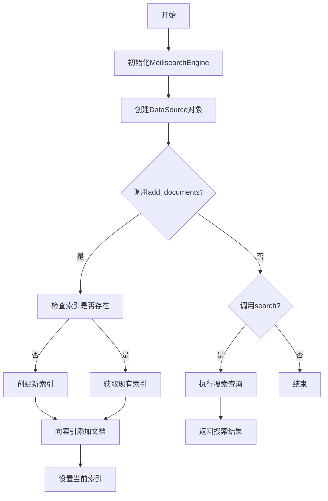
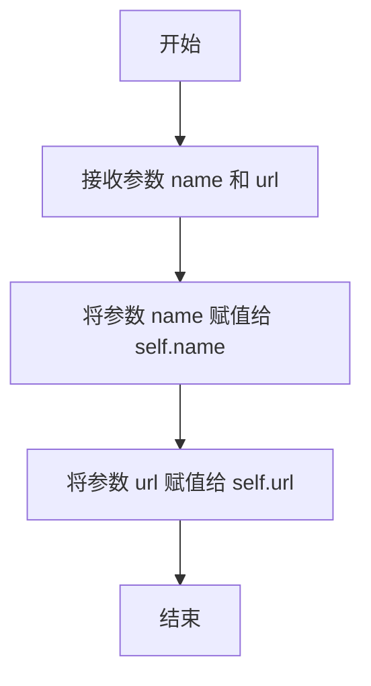
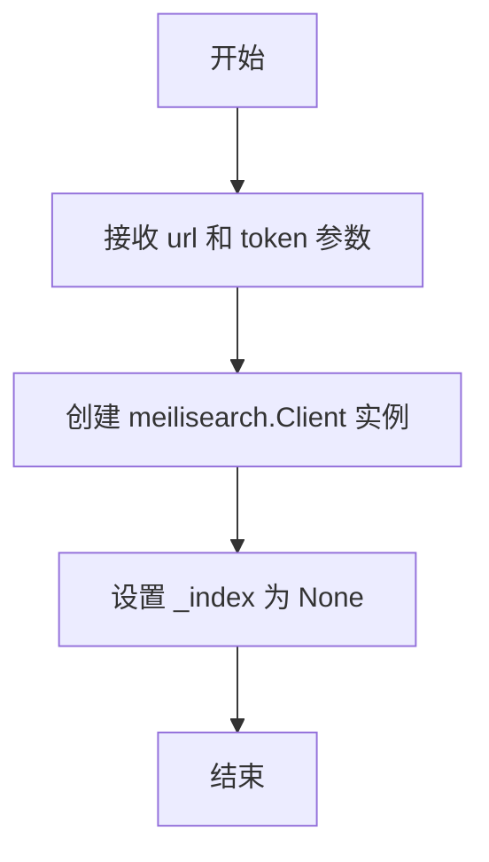
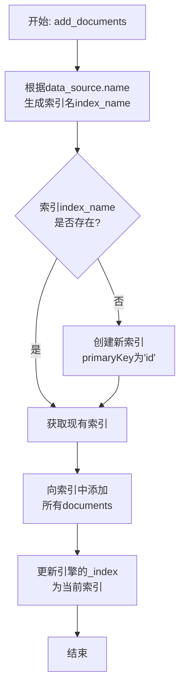
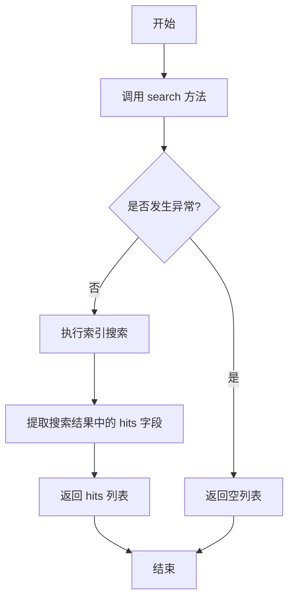

# `.\MetaGPT\metagpt\tools\search_engine_meilisearch.py` 详细设计文档

该代码实现了一个基于Meilisearch的搜索引擎封装类，提供了数据源管理、文档索引创建与添加、以及文档搜索功能。它通过DataSource类封装数据源信息，通过MeilisearchEngine类封装与Meilisearch服务器的交互，包括设置索引、批量添加文档和执行搜索查询。

## 整体流程



## 类结构

```
DataSource (数据源类)
└── MeilisearchEngine (搜索引擎主类)
```

## 全局变量及字段


### `DataSource.name`
    
数据源的名称，用于标识和构建索引名。

类型：`str`
    


### `DataSource.url`
    
数据源的URL地址，可能用于定位或访问原始数据。

类型：`str`
    


### `MeilisearchEngine.client`
    
Meilisearch服务的客户端实例，用于与Meilisearch服务器进行通信。

类型：`meilisearch.Client`
    


### `MeilisearchEngine._index`
    
当前操作的Meilisearch索引对象，用于执行文档添加和搜索等操作。

类型：`meilisearch.index.Index`
    
    

## 全局函数及方法


### `DataSource.__init__`

DataSource类的构造函数，用于初始化数据源实例，设置数据源的名称和URL。

参数：

- `name`：`str`，数据源的名称
- `url`：`str`，数据源的URL地址

返回值：`None`，构造函数不返回任何值

#### 流程图



#### 带注释源码

```
def __init__(self, name: str, url: str):
    # 将传入的数据源名称赋值给实例变量 self.name
    self.name = name
    # 将传入的数据源URL地址赋值给实例变量 self.url
    self.url = url
```


### `MeilisearchEngine.__init__`

初始化 MeilisearchEngine 类，创建 Meilisearch 客户端实例并设置索引为 None。

参数：

- `url`：`str`，Meilisearch 服务器的 URL 地址
- `token`：`str`，用于认证的 API 令牌

返回值：`None`，无返回值

#### 流程图



#### 带注释源码

```python
def __init__(self, url, token):
    # 创建 Meilisearch 客户端实例，用于后续与 Meilisearch 服务器交互
    self.client = meilisearch.Client(url, token)
    # 初始化索引为 None，表示当前未设置任何索引
    self._index: Index = None
```


### `MeilisearchEngine.set_index`

该方法用于设置 MeilisearchEngine 实例的当前索引。它将传入的索引对象赋值给实例的内部字段 `_index`，以便后续的搜索操作可以在此索引上执行。

参数：

- `index`：`meilisearch.index.Index`，一个 Meilisearch 索引对象，代表要设置为当前活动索引的索引。

返回值：`None`，该方法不返回任何值。

#### 流程图

```mermaid
flowchart TD
    A[开始: set_index(index)] --> B[将参数index赋值给self._index]
    B --> C[结束]
```

#### 带注释源码

```python
def set_index(self, index):
    # 将传入的 Meilisearch 索引对象设置为当前实例的活动索引。
    # 这个索引将在后续的 `search` 方法中被使用。
    self._index = index
```


### `MeilisearchEngine.add_documents`

该方法用于向Meilisearch搜索引擎添加一组文档。它会根据数据源名称动态创建或获取对应的索引，然后将文档批量添加到该索引中，并更新引擎当前使用的索引。

参数：

-  `data_source`：`DataSource`，数据源对象，包含用于生成索引名称的`name`属性和可选的`url`属性。
-  `documents`：`List[dict]`，一个字典列表，每个字典代表一个待添加的文档。

返回值：`None`，该方法不返回任何值，其操作结果体现在Meilisearch服务端的索引状态和引擎实例的内部状态（`_index`字段）上。

#### 流程图



#### 带注释源码

```python
def add_documents(self, data_source: DataSource, documents: List[dict]):
    # 1. 根据数据源名称构造Meilisearch索引的唯一名称
    index_name = f"{data_source.name}_index"
    
    # 2. 检查该索引是否已在Meilisearch服务端存在
    if index_name not in self.client.get_indexes():
        # 2.1 如果不存在，则创建新索引，并指定'id'字段为主键
        self.client.create_index(uid=index_name, options={"primaryKey": "id"})
    
    # 3. 从Meilisearch客户端获取（或刚刚创建的）索引对象
    index = self.client.get_index(index_name)
    
    # 4. 将提供的文档列表批量添加到该索引中
    index.add_documents(documents)
    
    # 5. 更新当前引擎实例内部记录的索引对象，以便后续操作（如搜索）使用
    self.set_index(index)
```


### `MeilisearchEngine.search`

该方法用于在Meilisearch索引中执行搜索查询，并返回匹配的文档结果。它封装了Meilisearch客户端的搜索功能，并通过异常处理机制确保在发生错误时返回一个空列表。

参数：

- `query`：`str`，搜索查询字符串，用于在索引中查找匹配的文档。

返回值：`List[dict]`，返回一个字典列表，每个字典代表一个匹配的搜索结果文档。如果搜索过程中发生异常，则返回一个空列表。

#### 流程图



#### 带注释源码

```python
@handle_exception(exception_type=Exception, default_return=[])
def search(self, query):
    # 使用当前索引对象执行搜索查询
    search_results = self._index.search(query)
    # 从搜索结果中提取 'hits' 字段，即匹配的文档列表
    return search_results["hits"]
```

## 关键组件


### MeilisearchEngine

封装了与Meilisearch搜索引擎交互的核心功能，包括索引管理、文档添加和搜索查询。

### DataSource

表示一个数据源，包含名称和URL，用于在创建索引时标识和区分不同的数据源。

### 异常处理装饰器 (handle_exception)

一个装饰器，用于包装方法以提供统一的异常处理机制，当被装饰的方法抛出指定异常时返回默认值。

### 索引管理

负责Meilisearch索引的创建、获取和设置，支持根据数据源动态创建索引并管理索引实例。

### 文档操作

提供将文档列表添加到指定索引的功能，并自动处理索引的创建逻辑。

### 搜索功能

执行搜索查询并返回匹配的文档结果，依赖于已设置的索引实例。


## 问题及建议


### 已知问题

-   **异常处理不完整**：`add_documents` 方法没有进行异常处理。如果 `meilisearch.Client` 在创建索引或添加文档时发生网络错误、认证失败或数据格式错误，程序将直接抛出异常，可能导致服务中断。
-   **索引状态管理不严谨**：`set_index` 方法可以随时被调用，将 `_index` 设置为任意值，这破坏了 `_index` 应与 `add_documents` 操作结果一致的状态契约。外部代码可能错误地设置一个无效的索引对象。
-   **数据源与索引的强耦合**：`add_documents` 方法根据 `DataSource.name` 动态创建索引名。如果 `DataSource.name` 包含不兼容字符（如空格、特殊符号），可能导致 Meilisearch 创建索引失败。同时，这种命名方式缺乏灵活性。
-   **搜索结果处理过于简单**：`search` 方法直接返回 `search_results["hits"]`，丢弃了搜索结果中的其他有用信息，如总命中数、处理时间、分页信息等，限制了调用方对搜索结果的进一步处理能力。
-   **缺乏连接与配置验证**：`__init__` 方法在创建 `meilisearch.Client` 时未验证提供的 `url` 和 `token` 是否有效，无效的配置可能直到后续方法调用时才被发现。

### 优化建议

-   **增强异常处理**：在 `add_documents` 方法中添加 `@handle_exception` 装饰器或使用 `try-except` 块，以优雅地处理创建索引和添加文档过程中可能出现的异常，并返回明确的操作结果（如成功/失败状态）。
-   **封装索引管理逻辑**：将 `_index` 设为私有属性，并移除公共的 `set_index` 方法。确保 `_index` 只能通过类内部方法（如 `add_documents`）进行设置，以维护其状态的一致性。可以提供 `get_index` 方法来安全地获取当前索引信息。
-   **解耦索引命名策略**：将索引命名逻辑从 `add_documents` 方法中抽离。可以提供一个可配置的命名函数或策略类，允许用户自定义索引名称的生成规则，并在创建前对名称进行合法性校验或清理。
-   **丰富搜索返回结果**：修改 `search` 方法的返回值，使其返回完整的 `search_results` 字典或一个封装了搜索结果的定制对象（如 `SearchResult` 类）。这样调用方可以访问所有返回信息，同时保持向后兼容性（例如，通过属性访问 `hits`）。
-   **添加配置验证与健康检查**：在 `__init__` 或一个独立的 `connect`/`health_check` 方法中，尝试与 Meilisearch 服务器建立连接并验证 token 权限，确保引擎在后续操作前处于可用状态。
-   **考虑异步支持**：Meilisearch 的 Python SDK 支持异步操作。如果应用场景涉及高并发或 I/O 密集型操作，可以考虑提供异步版本的 `add_documents` 和 `search` 方法，以提高性能。
-   **引入日志记录**：在关键操作步骤（如连接建立、索引创建、文档添加、搜索执行）添加日志记录，便于问题追踪和系统监控。


## 其它


### 设计目标与约束

本模块旨在提供一个基于 Meilisearch 的搜索引擎封装，核心设计目标包括：
1.  **封装与简化**：封装 Meilisearch 客户端的初始化和基本操作（创建索引、添加文档、搜索），为上层应用提供简洁、一致的接口。
2.  **数据源抽象**：通过 `DataSource` 类抽象不同的数据来源，便于管理和扩展。
3.  **异常处理集成**：利用项目统一的 `handle_exception` 装饰器处理搜索过程中的潜在异常，保证服务健壮性。
主要约束包括：
1.  **依赖 Meilisearch**：核心功能完全依赖于外部 Meilisearch 服务，其可用性和性能直接影响本模块。
2.  **索引命名约定**：索引名称由 `DataSource.name` 与固定后缀 `"_index"` 拼接而成，此约定在模块内部固化。
3.  **同步操作**：当前所有方法均为同步调用，在高并发或大数据量场景下可能存在性能瓶颈。

### 错误处理与异常设计

模块的错误处理策略如下：
1.  **结构化异常处理**：在关键的 `search` 方法上使用了 `@handle_exception` 装饰器。当 `Meilisearch` 客户端或网络发生 `Exception` 时，此装饰器会捕获异常，记录日志，并返回一个空的列表 `[]` 作为默认值，防止因搜索失败导致上游服务崩溃。
2.  **隐式异常传播**：`add_documents` 方法未显式装饰异常处理。其中 `client.create_index` 和 `index.add_documents` 等操作可能抛出 `Meilisearch` 相关的异常（如 `MeilisearchApiError`），这些异常将直接向上层调用者传播，由调用方决定如何处理。
3.  **客户端初始化异常**：`__init__` 中创建 `meilisearch.Client` 时，如果提供的 `url` 或 `token` 无效，会立即抛出异常，这属于严重的配置错误，应在服务启动阶段被发现。

### 数据流与状态机

模块内部的数据流和状态变化如下：
1.  **初始化流程**：`MeilisearchEngine` 实例化时，立即根据 `url` 和 `token` 创建 `client`。此时 `_index` 属性为 `None`，表示未绑定到任何具体索引。
2.  **索引创建与绑定流程**：
    *   调用 `add_documents(data_source, documents)`。
    *   根据 `data_source.name` 生成 `index_name`。
    *   检查该名称的索引是否存在。若不存在，则创建新索引（设置主键为 `"id"`）。
    *   获取该索引的 `Index` 对象，并调用其 `add_documents` 方法上传数据。
    *   最后，通过 `set_index` 将实例的 `_index` 绑定到当前操作的索引。
3.  **搜索流程**：执行 `search(query)` 时，直接使用已绑定的 `_index` 进行搜索。**注意**：如果从未调用 `add_documents` 或 `set_index`，`_index` 为 `None`，`_index.search` 调用将失败。`@handle_exception` 会捕获此异常并返回空列表。
4.  **状态总结**：实例的状态主要由 `_index` 表示。它是一个“惰性绑定”状态，在第一次 `add_documents` 操作后确立。后续搜索操作依赖于该状态。

### 外部依赖与接口契约

1.  **外部依赖**：
    *   **Meilisearch Python SDK (`meilisearch`)**：核心依赖，版本兼容性需得到保证。用于所有与 Meilisearch 服务器的通信。
    *   **Meilisearch 服务器**：必须有一个正在运行且可访问的 Meilisearch 服务实例，其版本应与 SDK 兼容。
    *   **项目内部工具 (`metagpt.utils.exceptions.handle_exception`)**：依赖于项目内定义的异常处理装饰器。
2.  **接口契约（对上游调用者）**：
    *   `MeilisearchEngine.__init__(url, token)`：要求提供有效的 Meilisearch 服务器地址和认证令牌。
    *   `add_documents(data_source: DataSource, documents: List[dict])`：
        *   契约：`documents` 列表中的每个字典都应包含被定义为索引主键的字段（默认为 `"id"`），否则 Meilisearch 可能报错或产生非预期行为。
        *   副作用：可能创建新索引，并改变实例内部 `_index` 的绑定状态。
    *   `search(query)`：契约：调用此方法前，应确保实例已通过 `add_documents` 或 `set_index` 绑定到一个有效的索引，否则可能返回空结果（因异常被处理）。
3.  **接口契约（对下游 Meilisearch）**：遵循 Meilisearch SDK 定义的 API 调用规范，包括请求格式、认证方式和错误响应。

    