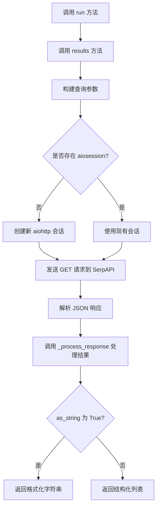
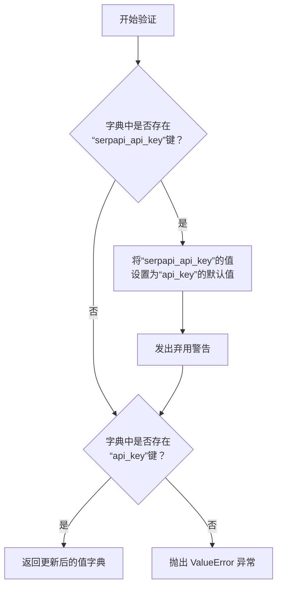
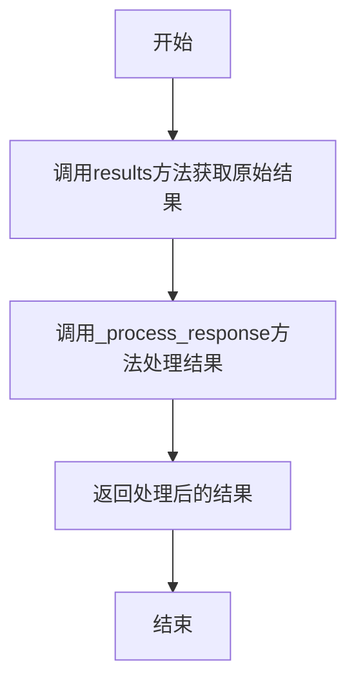
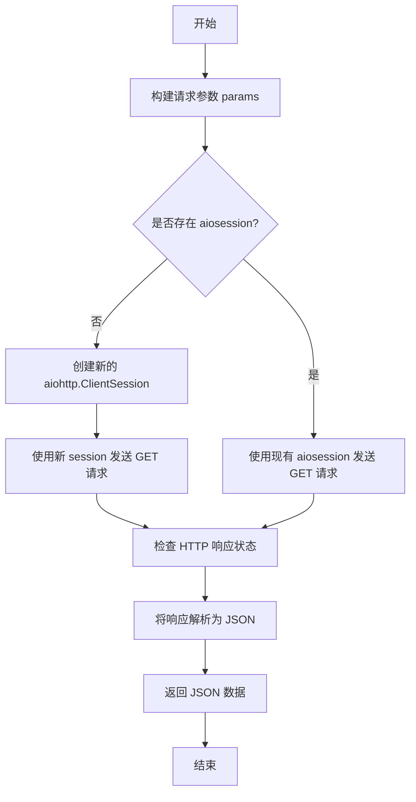
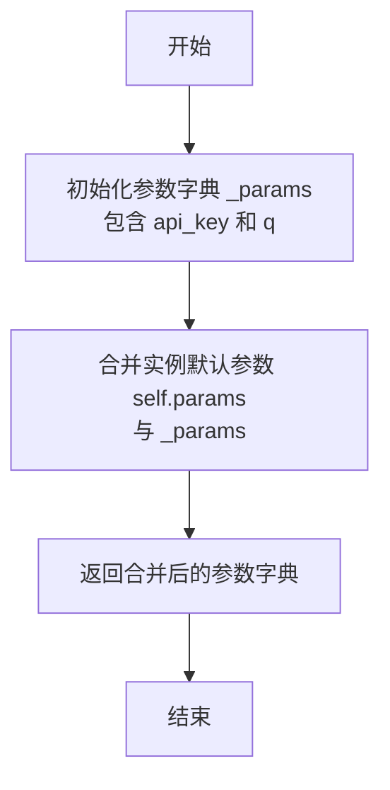

# `.\MetaGPT\metagpt\tools\search_engine_serpapi.py` 详细设计文档

该代码实现了一个基于 SerpAPI 的异步搜索引擎封装类，提供对 Google 搜索结果的查询和解析功能。核心功能包括：通过 SerpAPI 执行搜索查询、处理返回的 JSON 数据、提取关键信息（如标题、摘要、链接），并以字符串或结构化列表形式返回结果。

## 整体流程



## 类结构

```
SerpAPIWrapper (继承自 pydantic.BaseModel)
├── 字段: api_key, params, url, aiosession, proxy
├── 方法: validate_serpapi (类方法)
├── 方法: run
├── 方法: results
├── 方法: get_params
└── 方法: _process_response (静态方法)
```

## 全局变量及字段


### `SerpAPIWrapper.api_key`
    
用于访问SerpAPI服务的API密钥，是进行搜索请求的必要凭证。

类型：`str`
    


### `SerpAPIWrapper.params`
    
一个字典，包含发送给SerpAPI的默认查询参数，如搜索引擎、域名、地理位置和语言设置。

类型：`dict`
    


### `SerpAPIWrapper.url`
    
SerpAPI服务的端点URL，默认为'https://serpapi.com/search'。

类型：`str`
    


### `SerpAPIWrapper.aiosession`
    
一个可选的aiohttp客户端会话对象，用于复用HTTP连接以提高异步请求的效率。

类型：`Optional[aiohttp.ClientSession]`
    


### `SerpAPIWrapper.proxy`
    
一个可选的代理服务器地址字符串，用于通过代理发送HTTP请求。

类型：`Optional[str]`
    
    

## 全局函数及方法

### `SerpAPIWrapper.validate_serpapi`

`SerpAPIWrapper.validate_serpapi` 是一个类方法，用于在 `SerpAPIWrapper` 类实例化前验证和预处理传入的配置值。它的主要功能是确保 `api_key` 存在，并处理向后兼容性，将已弃用的 `serpapi_api_key` 参数映射到新的 `api_key` 字段。

参数：

- `cls`：`type`，指向 `SerpAPIWrapper` 类本身的引用。
- `values`：`dict`，包含在实例化 `SerpAPIWrapper` 时传入的原始字段值。

返回值：`dict`，返回经过验证和更新后的字段值字典，供后续的模型验证和实例化使用。

#### 流程图



#### 带注释源码

```python
    @model_validator(mode="before")
    @classmethod
    def validate_serpapi(cls, values: dict) -> dict:
        # 检查传入的字典中是否包含旧的、已弃用的键名 `serpapi_api_key`
        if "serpapi_api_key" in values:
            # 如果存在，则将其值设置为 `api_key` 的默认值，确保向后兼容
            values.setdefault("api_key", values["serpapi_api_key"])
            # 发出弃用警告，提示用户应使用新的 `api_key` 参数
            warnings.warn("`serpapi_api_key` is deprecated, use `api_key` instead", DeprecationWarning, stacklevel=2)

        # 验证处理后的字典中是否包含必需的 `api_key` 键
        if "api_key" not in values:
            # 如果没有找到 `api_key`，则抛出 ValueError 异常，并给出清晰的错误提示和获取密钥的指引
            raise ValueError(
                "To use serpapi search engine, make sure you provide the `api_key` when constructing an object. You can obtain"
                " an API key from https://serpapi.com/."
            )
        # 返回经过验证和更新后的值字典
        return values
```

### `SerpAPIWrapper.run`

该方法异步执行一个搜索查询，通过SerpAPI获取搜索结果，并根据指定的格式（字符串或列表）处理并返回结果。

参数：

- `query`：`str`，要搜索的查询字符串
- `max_results`：`int`，默认值为8，指定返回的最大结果数量
- `as_string`：`bool`，默认值为True，指定返回结果的格式。如果为True，则返回字符串格式；如果为False，则返回列表格式
- `**kwargs`：`Any`，其他关键字参数，当前方法中未使用

返回值：`str`，处理后的搜索结果。如果`as_string`为True，则返回字符串格式；如果为False，则返回列表格式的字符串表示

#### 流程图



#### 带注释源码

```python
async def run(self, query, max_results: int = 8, as_string: bool = True, **kwargs: Any) -> str:
    """Run query through SerpAPI and parse result async."""
    # 调用results方法异步获取搜索结果
    result = await self.results(query, max_results)
    # 调用_process_response方法处理结果，并根据as_string参数决定返回格式
    return self._process_response(result, as_string=as_string)
```

### `SerpAPIWrapper.results`

该方法使用 aiohttp 异步地向 SerpAPI 发送搜索请求，并返回 JSON 格式的搜索结果。

参数：
- `query`：`str`，要搜索的查询字符串。
- `max_results`：`int`，指定返回的最大结果数量。

返回值：`dict`，SerpAPI 返回的原始 JSON 响应数据。

#### 流程图



#### 带注释源码

```python
async def results(self, query: str, max_results: int) -> dict:
    """Use aiohttp to run query through SerpAPI and return the results async."""

    # 1. 获取基础参数，并添加本次请求的特定参数
    params = self.get_params(query)
    params["source"] = "python"
    params["num"] = max_results
    params["output"] = "json"

    # 2. 判断是否提供了预定义的 aiohttp 会话 (aiosession)
    #    如果没有，则创建一个新的临时会话。
    if not self.aiosession:
        async with aiohttp.ClientSession() as session:
            # 3. 使用会话发送 GET 请求到 SerpAPI 端点
            async with session.get(self.url, params=params, proxy=self.proxy) as response:
                # 4. 检查 HTTP 响应状态，如果出错则抛出异常
                response.raise_for_status()
                # 5. 将响应体解析为 JSON 格式
                res = await response.json()
    else:
        # 6. 如果提供了预定义的会话，则直接使用它发送请求
        async with self.aiosession.get(self.url, params=params, proxy=self.proxy) as response:
            response.raise_for_status()
            res = await response.json()

    # 7. 返回解析后的 JSON 数据
    return res
```

### `SerpAPIWrapper.get_params`

该方法用于构建调用 SerpAPI 搜索接口所需的参数字典。它将类实例的默认参数（如搜索引擎、域名、语言等）与 API 密钥和用户查询合并，生成最终的请求参数。

参数：

-  `query`：`str`，用户输入的搜索查询字符串。

返回值：`Dict[str, str]`，一个包含所有必要参数的字典，用于向 SerpAPI 发起 HTTP GET 请求。

#### 流程图



#### 带注释源码

```python
def get_params(self, query: str) -> Dict[str, str]:
    """Get parameters for SerpAPI."""
    # 1. 构建基础参数字典，包含 API 密钥和查询字符串
    _params = {
        "api_key": self.api_key,
        "q": query,
    }
    # 2. 将实例的默认参数（self.params）与基础参数（_params）合并。
    #    如果键名冲突，_params 中的值（即 api_key 和 q）将覆盖 self.params 中的值。
    params = {**self.params, **_params}
    # 3. 返回合并后的完整参数字典。
    return params
```


### `SerpAPIWrapper._process_response`

这是一个静态方法，用于处理从 SerpAPI 搜索引擎返回的原始 JSON 响应。它根据响应内容的结构，提取并格式化最相关的信息（如答案框、知识图谱、有机搜索结果等），最终返回一个字符串或列表。其核心逻辑是优先返回结构化、简洁的答案，其次返回搜索结果的摘要列表。

参数：

-  `res`：`dict`，从 SerpAPI 接口获取的原始 JSON 响应数据。
-  `as_string`：`bool`，控制返回值的格式。为 `True` 时返回字符串，为 `False` 时返回列表。

返回值：`str` 或 `list`，当 `as_string` 为 `True` 时，返回一个组合了主要结果摘要和格式化结果列表的字符串；当 `as_string` 为 `False` 时，返回一个包含格式化结果（字典）的列表。

#### 流程图

```mermaid
flowchart TD
    A[开始: _process_response(res, as_string)] --> B{res中是否存在'error'键?};
    B -- 是 --> C{错误信息是否为“无结果”?};
    C -- 是 --> D[toret = “No good search result found”];
    C -- 否 --> E[抛出ValueError异常];
    B -- 否 --> F{res中是否存在'answer_box'键?};
    F -- 是 --> G{answer_box中是否存在'answer'键?};
    G -- 是 --> H[toret = answer_box['answer']];
    G -- 否 --> I{answer_box中是否存在'snippet'键?};
    I -- 是 --> J[toret = answer_box['snippet']];
    I -- 否 --> K{answer_box中是否存在'snippet_highlighted_words'键?};
    K -- 是 --> L[toret = snippet_highlighted_words[0]];
    F -- 否 --> M{res中是否存在'sports_results'键?};
    M -- 是 --> N[toret = sports_results['game_spotlight']];
    M -- 否 --> O{res中是否存在'knowledge_graph'键?};
    O -- 是 --> P[toret = knowledge_graph['description']];
    O -- 否 --> Q{res中是否存在'organic_results'键?};
    Q -- 是 --> R[toret = organic_results[0]['snippet']];
    Q -- 否 --> S[toret = “No good search result found”];
    D & H & J & L & N & P & R & S --> T[初始化 toret_l 为空列表];
    T --> U{res中是否存在'answer_box'且包含'snippet'键?};
    U -- 是 --> V[将格式化后的answer_box加入toret_l];
    U -- 否 --> W;
    V --> W{res中是否存在'organic_results'键?};
    W -- 是 --> X[遍历organic_results<br>将每个结果格式化后加入toret_l];
    W -- 否 --> Y;
    X --> Y{as_string 是否为 True?};
    Y -- 是 --> Z[返回 str(toret) + “\n” + str(toret_l)];
    Y -- 否 --> AA[返回 toret_l];
```

#### 带注释源码

```python
    @staticmethod
    def _process_response(res: dict, as_string: bool) -> str:
        """Process response from SerpAPI."""
        # 定义需要从结果中提取的字段
        focus = ["title", "snippet", "link"]
        # 定义一个lambda函数，用于从字典中筛选出focus列表中的字段
        get_focused = lambda x: {i: j for i, j in x.items() if i in focus}

        # 1. 错误处理：检查响应中是否包含错误信息
        if "error" in res.keys():
            if res["error"] == "Google hasn't returned any results for this query.":
                toret = "No good search result found"
            else:
                # 对于其他错误，抛出异常
                raise ValueError(f"Got error from SerpAPI: {res['error']}")
        # 2. 优先级1：答案框（answer_box）中的直接答案
        elif "answer_box" in res.keys() and "answer" in res["answer_box"].keys():
            toret = res["answer_box"]["answer"]
        # 3. 优先级2：答案框中的摘要（snippet）
        elif "answer_box" in res.keys() and "snippet" in res["answer_box"].keys():
            toret = res["answer_box"]["snippet"]
        # 4. 优先级3：答案框中的高亮词
        elif "answer_box" in res.keys() and "snippet_highlighted_words" in res["answer_box"].keys():
            toret = res["answer_box"]["snippet_highlighted_words"][0]
        # 5. 优先级4：体育比赛结果
        elif "sports_results" in res.keys() and "game_spotlight" in res["sports_results"].keys():
            toret = res["sports_results"]["game_spotlight"]
        # 6. 优先级5：知识图谱（knowledge_graph）中的描述
        elif "knowledge_graph" in res.keys() and "description" in res["knowledge_graph"].keys():
            toret = res["knowledge_graph"]["description"]
        # 7. 优先级6：第一个有机搜索结果（organic_results）的摘要
        elif "snippet" in res["organic_results"][0].keys():
            toret = res["organic_results"][0]["snippet"]
        # 8. 兜底：未找到任何有效信息
        else:
            toret = "No good search result found"

        # 初始化一个列表，用于存放格式化后的详细结果
        toret_l = []
        # 如果答案框中有摘要，将其格式化后加入列表
        if "answer_box" in res.keys() and "snippet" in res["answer_box"].keys():
            toret_l += [get_focused(res["answer_box"])]
        # 如果存在有机搜索结果，遍历每个结果，格式化后加入列表
        if res.get("organic_results"):
            toret_l += [get_focused(i) for i in res.get("organic_results")]

        # 根据as_string参数决定返回格式
        # 为True时，返回主要摘要和详细列表的组合字符串
        # 为False时，仅返回详细列表
        return str(toret) + "\n" + str(toret_l) if as_string else toret_l
```


## 关键组件


### SerpAPIWrapper 类

封装了与 SerpAPI 服务进行异步交互的核心逻辑，负责构建请求、发送查询、处理响应，并将搜索结果格式化为字符串或结构化列表。

### 参数管理与验证

通过 Pydantic 模型定义和验证器，管理 API 密钥、请求参数等配置，支持旧参数名的向后兼容，并确保运行前必要的配置已就绪。

### 异步 HTTP 客户端

利用 `aiohttp` 库实现异步 HTTP 请求，支持传入外部 `ClientSession` 以复用连接，并可配置代理，提高了网络 I/O 效率。

### 响应解析与结果处理

定义了从 SerpAPI 返回的复杂 JSON 响应中提取关键信息（如答案框、知识图谱、有机结果）的逻辑，并可根据需要将结果格式化为纯文本字符串或结构化的字典列表。


## 问题及建议


### 已知问题

-   **硬编码的默认参数**：`params` 字段的默认值（如 `"engine": "google"`, `"gl": "us"`, `"hl": "en"`）是硬编码在类定义中的。这使得在不修改代码的情况下，难以根据不同的使用场景（例如，针对不同地区或语言）灵活调整默认搜索行为。
-   **错误处理粒度较粗**：`_process_response` 方法在遇到 `"error"` 键时，仅处理了 `"Google hasn't returned any results for this query."` 这一种特定错误信息，对于其他错误类型直接抛出 `ValueError`。这可能导致一些可恢复的或需要特殊处理的错误（如API配额不足、无效请求参数等）被简单地以异常形式抛出，缺乏更细致的错误分类和处理逻辑。
-   **结果处理逻辑复杂且脆弱**：`_process_response` 方法使用了一长串的 `if-elif-else` 语句来从响应字典的不同位置提取信息。这种逻辑结构较为复杂，且严重依赖于 SerpAPI 返回的 JSON 结构。如果 SerpAPI 的响应格式在未来发生变更，此方法很容易失效或返回不准确的结果，维护成本高。
-   **潜在的资源泄漏**：在 `results` 方法中，当 `self.aiosession` 为 `None` 时，会创建一个新的 `aiohttp.ClientSession`。虽然使用了 `async with` 确保在块结束时关闭，但如果 `run` 方法被频繁调用且 `aiosession` 未提供，会导致频繁创建和销毁会话，可能带来不必要的开销。最佳实践是复用同一个会话。
-   **类型注解不完整**：部分方法（如 `get_params`）的返回值类型注解为 `Dict[str, str]`，但实际返回的参数字典中可能包含非字符串值（例如，从 `self.params` 合并而来的值）。这可能导致类型检查工具（如 mypy）报错或开发者误解。
-   **`as_string` 参数行为不一致**：当 `as_string=False` 时，`_process_response` 返回 `toret_l`（一个列表），而 `run` 方法直接返回这个列表。但当 `as_string=True` 时，`run` 方法返回的是 `str(toret) + "\n" + str(toret_l)`，这个拼接后的字符串格式可能不是最清晰或最易于程序化处理的数据结构。

### 优化建议

-   **将默认参数配置化**：建议将 `params` 的默认值提取到类级别常量或通过配置文件、环境变量管理。这样可以在不修改代码的情况下，为不同的部署环境或应用场景设置不同的默认搜索参数。
-   **细化错误处理机制**：建议定义一个自定义的异常层次结构（例如，`SerpAPIError`, `SerpAPINoResultsError`, `SerpAPIQuotaError` 等）。在 `_process_response` 和 `results` 方法中，根据响应的具体错误信息抛出相应的异常，使调用方能更精确地捕获和处理不同故障场景。
-   **重构结果解析逻辑**：考虑将 `_process_response` 中复杂的 `if-elif-else` 链重构为更清晰、可扩展的策略模式或责任链模式。可以定义一系列“结果提取器”类或函数，每个负责从一种特定的响应结构（如 `answer_box`, `knowledge_graph`）中提取信息。这样更容易维护、测试和适应API的变化。
-   **优化会话管理**：在类中提供一个内部默认会话，或者修改 `__init__` 方法，使其在未提供 `aiosession` 时自动创建一个并存储在实例变量中，并在类中实现一个 `close` 或 `__aexit__` 方法来管理该会话的生命周期。这样可以避免在多次调用中重复创建会话。
-   **完善类型注解**：修正 `get_params` 等方法的返回值类型，例如改为 `Dict[str, Any]`。同时，为 `_process_response` 方法的返回值添加更精确的联合类型注解（如 `Union[str, List[Dict[str, str]]]`），以提高代码的清晰度和工具支持度。
-   **统一返回格式**：重新考虑 `as_string` 参数的设计。可以始终返回一个结构化的数据对象（如一个包含 `summary` 和 `details` 字段的字典或Pydantic模型），让调用方决定如何格式化输出。或者，提供两个独立的方法（如 `run` 返回字符串，`run_structured` 返回字典），使接口意图更明确。
-   **增加日志记录**：在关键步骤（如发起请求、收到响应、处理特定结果类型）添加日志记录，使用 `logging` 模块而非 `print` 或 `warnings`。这有助于调试和监控搜索组件的运行状态。
-   **考虑添加重试机制**：网络请求可能因暂时性故障而失败。可以考虑在 `results` 方法中集成重试逻辑（例如，使用 `tenacity` 库），对特定的HTTP状态码或异常进行有限次数的重试，以提高鲁棒性。


## 其它


### 设计目标与约束

本模块的核心设计目标是提供一个异步、可配置的封装器，用于与 SerpAPI 服务进行交互，执行网络搜索并解析返回的 JSON 结果。主要约束包括：1) 必须支持异步操作以提升在高并发场景下的性能；2) 必须向后兼容旧的 `serpapi_api_key` 参数名；3) 必须能够处理 SerpAPI 返回的各种结果结构，并从中提取关键信息（标题、摘要、链接）；4) 必须支持通过代理进行网络请求；5) 必须能够复用外部的 `aiohttp.ClientSession` 以优化连接管理。

### 错误处理与异常设计

模块的错误处理主要分为几个层面：
1.  **初始化验证**：在 `@model_validator` 装饰的 `validate_serpapi` 方法中，确保构造对象时提供了必要的 `api_key`。若未提供，则抛出 `ValueError`。
2.  **API 请求错误**：在 `results` 方法中，使用 `response.raise_for_status()` 检查 HTTP 响应状态码。如果状态码表示错误（如 4xx, 5xx），将抛出 `aiohttp.ClientResponseError` 异常。
3.  **API 业务逻辑错误**：在 `_process_response` 静态方法中，检查返回的 JSON 数据中是否包含 `"error"` 键。如果错误信息是特定的无结果提示，则返回友好字符串；对于其他错误，则抛出 `ValueError` 异常。
4.  **数据结构异常**：`_process_response` 方法在访问嵌套字典键（如 `res["organic_results"][0]["snippet"]`）时，如果预期的键不存在，可能引发 `KeyError` 或 `IndexError`。当前代码通过多个 `elif` 分支和 `res.get()` 方法进行防御性访问，但若所有分支都未匹配且 `as_string=False`，返回的 `toret_l` 可能为空列表，调用方需处理此情况。

### 数据流与状态机

模块的数据流清晰且线性：
1.  **输入**：用户调用 `run(query, max_results, as_string, **kwargs)` 方法。
2.  **参数准备**：`run` 方法调用 `results` 方法，后者调用 `get_params` 方法合并默认参数、实例参数和查询参数，形成最终的请求参数字典。
3.  **网络请求**：`results` 方法使用 `aiohttp` 向 `self.url` 发起异步 GET 请求，并传入参数和代理设置。根据 `self.aiosession` 是否存在，决定是创建临时会话还是复用外部会话。
4.  **响应处理**：获取到 JSON 响应后，`results` 方法将其返回给 `run` 方法。
5.  **结果解析与格式化**：`run` 方法调用 `_process_response` 静态方法。该方法按照预设的优先级（答案框 > 体育结果 > 知识图谱 > 普通有机结果）尝试从响应数据中提取核心文本信息 (`toret`)。同时，它也会从答案框和有机结果中提取聚焦信息（标题、摘要、链接）到列表 `toret_l` 中。
6.  **输出**：根据 `as_string` 标志，`_process_response` 将核心文本与聚焦信息列表组合成字符串返回，或直接返回聚焦信息列表。

模块本身无复杂内部状态，其状态主要体现在 `SerpAPIWrapper` 实例的配置字段（`api_key`, `params`, `proxy`, `aiosession`）上。

### 外部依赖与接口契约

1.  **外部服务依赖**：严重依赖 SerpAPI 服务 (`https://serpapi.com/search`)。代码逻辑与 SerpAPI 返回的 JSON 数据结构紧密耦合。任何 SerpAPI 接口的变更都可能破坏 `_process_response` 方法的解析逻辑。
2.  **第三方库依赖**：
    *   `aiohttp`：用于执行异步 HTTP 请求。版本兼容性需保证。
    *   `pydantic`：用于数据模型验证和配置管理。`@model_validator` 和 `Field` 的使用依赖于特定版本特性。
    *   `fire`：仅在 `__main__` 中用于快速创建命令行接口，非核心运行时依赖。
3.  **接口契约**：
    *   `run` 方法：是模块的主要对外接口。它承诺返回一个字符串（当 `as_string=True`）或一个字典列表（当 `as_string=False`）。调用方需要处理可能抛出的 `aiohttp.ClientResponseError` 和 `ValueError`。
    *   `results` 方法：返回原始的 SerpAPI 响应字典。供需要更细粒度数据的调用方使用。
    *   `aiosession` 参数：允许传入一个外部的、已配置的 `aiohttp.ClientSession` 实例。调用方需负责该会话的生命周期管理（如正确关闭）。模块内部使用该会话时遵循“不创建即使用”的原则。

    