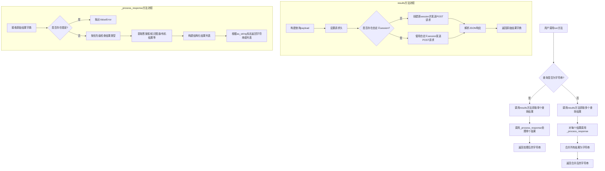
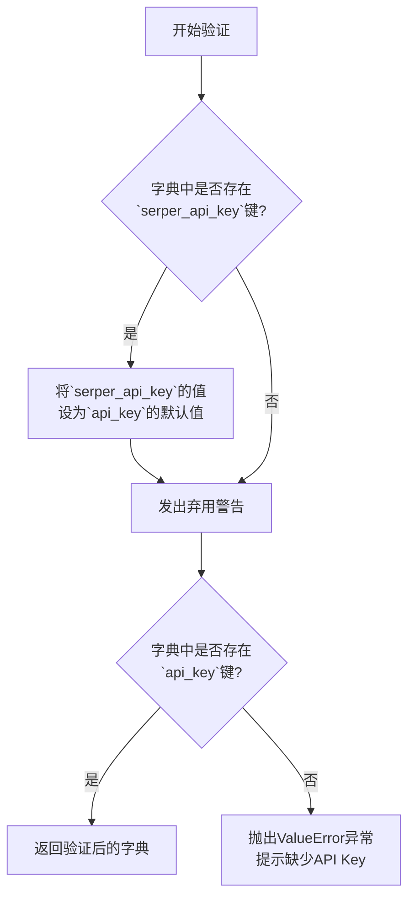
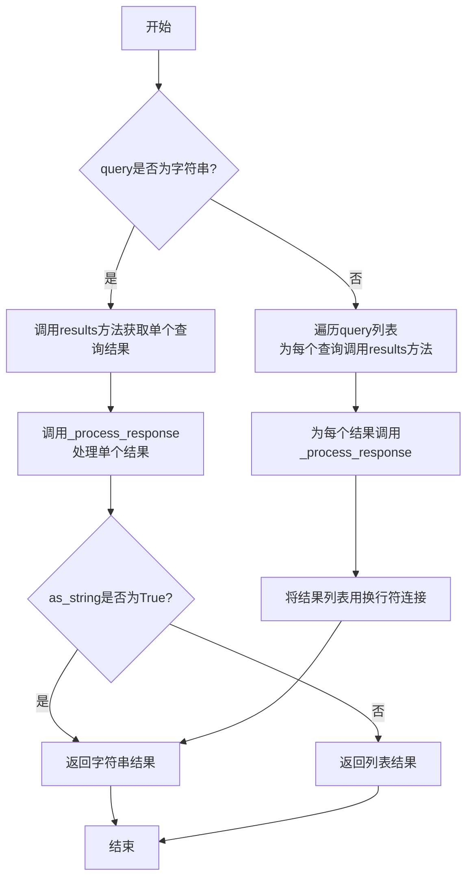
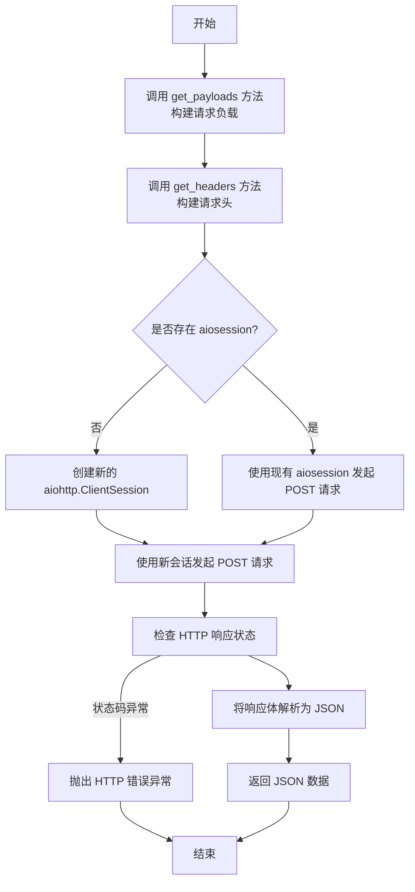
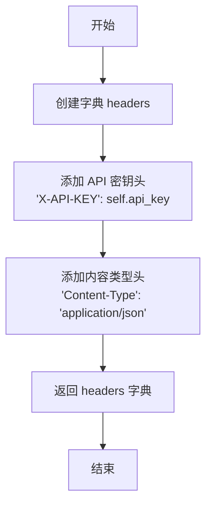

# `.\MetaGPT\metagpt\tools\search_engine_serper.py` 详细设计文档

该代码实现了一个基于Serper API的异步搜索引擎封装类，提供对Google搜索结果的查询和解析功能。核心功能包括：通过异步HTTP请求向Serper API发送搜索查询，处理返回的JSON响应，并根据不同的响应结构（如答案框、知识图谱、有机搜索结果等）提取关键信息（标题、摘要、链接），最终以字符串或结构化列表的形式返回搜索结果。

## 整体流程



## 类结构

```
SerperWrapper (Pydantic BaseModel)
├── 字段: api_key, url, payload, aiosession, proxy
├── 类方法: validate_serper (模型验证器)
├── 实例方法: run (主查询接口)
├── 实例方法: results (执行HTTP请求)
├── 实例方法: get_payloads (构建请求负载)
├── 实例方法: get_headers (构建请求头)
└── 静态方法: _process_response (处理API响应)
```

## 全局变量及字段


### `SerperWrapper.api_key`
    
用于访问 Serper API 的认证密钥。

类型：`str`
    


### `SerperWrapper.url`
    
Serper API 的端点 URL，默认为 'https://google.serper.dev/search'。

类型：`str`
    


### `SerperWrapper.payload`
    
发送给 Serper API 的默认请求负载，包含分页和结果数量等参数。

类型：`dict`
    


### `SerperWrapper.aiosession`
    
可选的 aiohttp 客户端会话，用于复用 HTTP 连接，提高性能。

类型：`Optional[aiohttp.ClientSession]`
    


### `SerperWrapper.proxy`
    
可选的代理服务器地址，用于通过代理发送 HTTP 请求。

类型：`Optional[str]`
    
    

## 全局函数及方法


### `SerperWrapper.validate_serper`

`validate_serper` 是 `SerperWrapper` 类的一个类方法，用作 Pydantic 模型的验证器。它的主要功能是在模型实例化前，对传入的配置字典进行预处理和验证，确保 `api_key` 字段存在且有效。具体来说，它处理了向后兼容性（将已弃用的 `serper_api_key` 参数映射到 `api_key`），并在缺少必要参数时抛出清晰的错误信息。

参数：

-  `cls`：`type[SerperWrapper]`，指向 `SerperWrapper` 类本身的引用。
-  `values`：`dict`，包含模型初始化时传入的原始字段名和值的字典。

返回值：`dict`，返回经过验证和可能修改后的字段值字典，供后续的模型构建过程使用。

#### 流程图



#### 带注释源码

```python
@model_validator(mode="before")  # 这是一个Pydantic模型验证器，在模型实例化之前运行。
@classmethod                     # 这是一个类方法，第一个参数是类本身。
def validate_serper(cls, values: dict) -> dict:
    # 检查传入的字典中是否包含旧的参数名 `serper_api_key`
    if "serper_api_key" in values:
        # 如果存在，将其值设置为 `api_key` 的默认值（如果 `api_key` 尚未设置）。
        values.setdefault("api_key", values["serper_api_key"])
        # 发出弃用警告，提示用户应使用新的参数名 `api_key`。
        warnings.warn("`serper_api_key` is deprecated, use `api_key` instead", DeprecationWarning, stacklevel=2)

    # 验证处理后的字典中是否包含必需的 `api_key` 字段。
    if "api_key" not in values:
        # 如果没有找到 `api_key`，抛出 ValueError 异常，并提供清晰的错误信息和获取API Key的指引。
        raise ValueError(
            "To use serper search engine, make sure you provide the `api_key` when constructing an object. You can obtain "
            "an API key from https://serper.dev/."
        )

    # 返回经过验证和可能修改后的字段值字典。
    return values
```


### `SerperWrapper.run`

该方法通过Serper搜索引擎异步执行查询，并根据`as_string`参数将结果处理为字符串或列表形式返回。

参数：

- `query`：`str`，要搜索的查询字符串
- `max_results`：`int`，最大返回结果数量，默认为8
- `as_string`：`bool`，是否将结果转换为字符串形式，默认为True
- `**kwargs`：`Any`，其他关键字参数

返回值：`str`，处理后的搜索结果，根据`as_string`参数可能为字符串或字符串列表

#### 流程图



#### 带注释源码

```python
async def run(self, query: str, max_results: int = 8, as_string: bool = True, **kwargs: Any) -> str:
    """Run query through Serper and parse result async."""
    # 如果query是字符串，处理单个查询
    if isinstance(query, str):
        # 调用results方法获取查询结果，然后通过_process_response处理
        return self._process_response((await self.results([query], max_results))[0], as_string=as_string)
    else:
        # 如果query是列表，为每个查询获取结果并处理
        results = [self._process_response(res, as_string) for res in await self.results(query, max_results)]
    # 根据as_string参数决定返回格式
    return "\n".join(results) if as_string else results
```

### `SerperWrapper.results`

该方法用于异步执行多个搜索查询，通过 Serper API 获取搜索结果，并以 JSON 格式返回原始响应数据。

参数：

- `queries`：`list[str]`，包含要搜索的查询字符串的列表。
- `max_results`：`int`，每个查询希望返回的最大结果数量，默认为 8。

返回值：`dict`，Serper API 返回的原始 JSON 响应数据。

#### 流程图



#### 带注释源码

```python
async def results(self, queries: list[str], max_results: int = 8) -> dict:
    """Use aiohttp to run query through Serper and return the results async."""

    # 1. 为每个查询构建请求负载（Payload）
    payloads = self.get_payloads(queries, max_results)
    # 2. 构建包含 API 密钥的请求头
    headers = self.get_headers()

    # 3. 判断是否提供了自定义的 aiohttp 会话
    if not self.aiosession:
        # 3.1 如果没有提供，则创建一个新的临时会话
        async with aiohttp.ClientSession() as session:
            # 3.2 使用新会话向 Serper API 发送 POST 请求
            async with session.post(self.url, data=payloads, headers=headers, proxy=self.proxy) as response:
                # 3.3 如果 HTTP 状态码不是 2xx，抛出异常
                response.raise_for_status()
                # 3.4 将响应体解析为 JSON 格式
                res = await response.json()
    else:
        # 3.5 如果提供了自定义会话，则使用它来发送请求
        async with self.aiosession.post(self.url, data=payloads, headers=headers, proxy=self.proxy) as response:
            response.raise_for_status()
            res = await response.json()

    # 4. 返回解析后的 JSON 数据
    return res
```


### `SerperWrapper.get_payloads`

该方法用于为给定的搜索查询列表和最大结果数，构建符合 Serper API 要求的 JSON 格式请求载荷。它会将类实例的默认载荷与每个查询的特定参数合并，最终序列化为一个 JSON 字符串。

参数：

-  `queries`：`list[str]`，一个包含多个搜索查询字符串的列表。
-  `max_results`：`int`，每个查询期望返回的最大结果数量。

返回值：`Dict[str, str]`，一个字典，其键为 `'payloads'`，值为一个 JSON 字符串。该字符串是一个列表，列表中的每个元素都是一个代表单个查询请求的字典。

#### 流程图

```mermaid
flowchart TD
    A[开始: get_payloads(queries, max_results)] --> B[初始化空列表 payloads]
    B --> C{遍历 queries 列表?}
    C -- 是 --> D[为当前查询 query 构建字典 _payload<br>包含 'q' 和 'num' 键]
    D --> E[将实例默认载荷 self.payload<br>与 _payload 合并]
    E --> F[将合并后的字典添加到 payloads 列表]
    F --> C
    C -- 否 --> G[将 payloads 列表序列化为 JSON 字符串]
    G --> H[返回字典 {'payloads': json_string}]
    H --> I[结束]
```

#### 带注释源码

```python
def get_payloads(self, queries: list[str], max_results: int) -> Dict[str, str]:
    """Get payloads for Serper."""
    # 初始化一个空列表，用于存储每个查询的载荷字典
    payloads = []
    # 遍历传入的查询列表
    for query in queries:
        # 为当前查询构建一个基础载荷字典，包含查询字符串和结果数量
        _payload = {
            "q": query,
            "num": max_results,
        }
        # 将类实例的默认载荷 (self.payload) 与当前查询的特定载荷 (_payload) 合并。
        # 使用 `{**dict1, **dict2}` 语法，后者 (`_payload`) 的键值对会覆盖前者 (`self.payload`) 中的同名键。
        # 然后将合并后的字典添加到 payloads 列表中。
        payloads.append({**self.payload, **_payload})
    # 使用 json.dumps 将 payloads 列表序列化为一个 JSON 格式的字符串。
    # sort_keys=True 确保输出的 JSON 字符串中字典的键是排序的，这有助于生成一致的请求（例如用于缓存或测试）。
    # 最终返回一个字典，其键为 'payloads'，值为序列化后的 JSON 字符串。
    # 注意：根据 Serper API 文档，POST 请求的 body 应直接是这个 JSON 字符串，而不是一个包含 'payloads' 键的字典。
    # 此处的返回值类型标注 `Dict[str, str]` 与实际返回的 JSON 字符串可能不完全匹配。
    # 更准确的返回类型应为 `str`，或者方法内部应直接返回 json.dumps(payloads)。
    # 当前实现可能是为了与某些期望特定键的旧接口兼容，或者是一个需要修正的技术债务点。
    return json.dumps(payloads, sort_keys=True)
```


### `SerperWrapper.get_headers`

该方法用于生成向 Serper API 发送 HTTP 请求时所需的请求头。它构造了一个包含 API 认证密钥和内容类型的字典。

参数：
-  `self`：`SerperWrapper`，`SerperWrapper` 类的实例，用于访问实例的 `api_key` 属性。

返回值：`Dict[str, str]`，一个包含 `'X-API-KEY'` 和 `'Content-Type'` 两个键值对的字典，用于 HTTP 请求头。

#### 流程图



#### 带注释源码

```python
def get_headers(self) -> Dict[str, str]:
    # 初始化一个空字典用于存放请求头
    headers = {"X-API-KEY": self.api_key, "Content-Type": "application/json"}
    # 返回构造好的请求头字典
    return headers
```


### `SerperWrapper._process_response`

这是一个静态方法，用于处理从 Serper API 返回的原始 JSON 响应。它根据响应中不同字段的优先级（如 `answer_box`、`knowledge_graph`、`organic` 结果等）提取核心信息（标题、摘要、链接），并根据 `as_string` 参数决定返回格式化字符串还是结构化列表。

参数：

-  `res`：`dict`，从 Serper API 获取的原始响应字典。
-  `as_string`：`bool`，默认为 `False`。控制返回值格式。为 `True` 时返回一个组合的字符串；为 `False` 时返回一个包含结构化信息的字典列表。

返回值：`str` 或 `list`，根据 `as_string` 参数，返回处理后的搜索结果摘要字符串或一个包含 `title`、`snippet`、`link` 字段的字典列表。

#### 流程图

```mermaid
flowchart TD
    A[开始: 输入 res, as_string] --> B{res 中是否包含 'error' 键?};
    B -- 是 --> C[抛出 ValueError 异常];
    B -- 否 --> D{检查 answer_box.answer};
    D -- 存在 --> E[toret = answer_box.answer];
    D -- 不存在 --> F{检查 answer_box.snippet};
    F -- 存在 --> G[toret = answer_box.snippet];
    F -- 不存在 --> H{检查 answer_box.snippet_highlighted_words};
    H -- 存在 --> I[toret = snippet_highlighted_words[0]];
    H -- 不存在 --> J{检查 sports_results.game_spotlight};
    J -- 存在 --> K[toret = game_spotlight];
    J -- 不存在 --> L{检查 knowledge_graph.description};
    L -- 存在 --> M[toret = knowledge_graph.description];
    L -- 不存在 --> N{检查 organic[0].snippet};
    N -- 存在 --> O[toret = organic[0].snippet];
    N -- 不存在 --> P[toret = 'No good search result found'];
    
    E & G & I & K & M & O & P --> Q[初始化 toret_l 为空列表];
    Q --> R{answer_box 存在且包含 snippet?};
    R -- 是 --> S[将 answer_box 的聚焦字段<br>（title, snippet, link）加入 toret_l];
    R -- 否 --> T;
    S --> T{res 中是否存在 organic 结果?};
    T -- 是 --> U[遍历 organic 列表<br>将每个结果的聚焦字段加入 toret_l];
    T -- 否 --> V;
    U --> V{as_string 是否为 True?};
    V -- 是 --> W[返回 str(toret) + '\n' + str(toret_l)];
    V -- 否 --> X[返回 toret_l];
```

#### 带注释源码

```python
    @staticmethod
    def _process_response(res: dict, as_string: bool = False) -> str:
        """Process response from SerpAPI."""
        # 定义需要从结果中提取的核心字段
        focus = ["title", "snippet", "link"]

        # 辅助函数：从字典中筛选出 focus 列表指定的字段
        def get_focused(x):
            return {i: j for i, j in x.items() if i in focus}

        # 1. 错误处理：如果响应中包含 'error' 键，直接抛出异常
        if "error" in res.keys():
            raise ValueError(f"Got error from SerpAPI: {res['error']}")

        # 2. 优先级提取主要答案 (toret)
        #    优先级顺序: answer_box.answer > answer_box.snippet > answer_box.snippet_highlighted_words
        #               > sports_results.game_spotlight > knowledge_graph.description > organic[0].snippet
        if "answer_box" in res.keys() and "answer" in res["answer_box"].keys():
            toret = res["answer_box"]["answer"]
        elif "answer_box" in res.keys() and "snippet" in res["answer_box"].keys():
            toret = res["answer_box"]["snippet"]
        elif "answer_box" in res.keys() and "snippet_highlighted_words" in res["answer_box"].keys():
            toret = res["answer_box"]["snippet_highlighted_words"][0]
        elif "sports_results" in res.keys() and "game_spotlight" in res["sports_results"].keys():
            toret = res["sports_results"]["game_spotlight"]
        elif "knowledge_graph" in res.keys() and "description" in res["knowledge_graph"].keys():
            toret = res["knowledge_graph"]["description"]
        elif "snippet" in res["organic"][0].keys():
            toret = res["organic"][0]["snippet"]
        else:
            toret = "No good search result found"

        # 3. 构建结构化结果列表 (toret_l)
        toret_l = []
        # 如果 answer_box 存在且有 snippet，将其聚焦字段加入列表
        if "answer_box" in res.keys() and "snippet" in res["answer_box"].keys():
            toret_l += [get_focused(res["answer_box"])]
        # 如果存在 organic 结果，将每个结果的聚焦字段加入列表
        if res.get("organic"):
            toret_l += [get_focused(i) for i in res.get("organic")]

        # 4. 根据 as_string 参数决定返回值格式
        #    为 True: 返回主要答案和结构化列表的组合字符串
        #    为 False: 仅返回结构化列表
        return str(toret) + "\n" + str(toret_l) if as_string else toret_l
```


## 关键组件


### Serper API 封装器

该类封装了 Serper 搜索引擎的 API 调用，提供了异步查询、结果解析和错误处理的核心功能，是代码与外部搜索服务交互的主要组件。

### 异步 HTTP 客户端管理

通过集成 `aiohttp.ClientSession`，代码实现了高效的异步 HTTP 请求发送与接收，支持复用会话连接和代理设置，以优化网络性能。

### 响应解析与结果提取

定义了从 Serper API 返回的复杂 JSON 响应中提取关键信息（如答案框、知识图谱、有机搜索结果）的逻辑，并支持将结果格式化为字符串或结构化列表。

### 配置验证与向后兼容

使用 Pydantic 模型验证器确保必需的 API 密钥存在，并处理了旧版配置参数 `serper_api_key` 的向后兼容性，同时发出弃用警告。

### 命令行接口集成

通过 `fire` 库，为 `SerperWrapper` 类的 `run` 方法提供了简单的命令行调用接口，便于脚本化使用。


## 问题及建议


### 已知问题

-   **方法名与功能不符**：`_process_response` 方法的注释和内部逻辑表明它处理的是来自 `SerpAPI` 的响应，但类名和代码上下文（如 `get_headers` 中的 `X-API-KEY`）都表明它使用的是 `Serper` API。这会造成混淆，可能意味着代码是从使用 SerpAPI 的版本修改而来，但未完全更新。
-   **错误处理不完整**：`results` 方法在 `response.raise_for_status()` 后直接假设响应体是有效的 JSON。如果响应状态码为 200 但内容不是 JSON（例如，服务器返回错误页面），`await response.json()` 会抛出 `aiohttp.ContentTypeError` 异常，但此异常未被捕获或处理。
-   **潜在的会话管理问题**：当 `aiosession` 由外部提供时，`run` 方法中的 `if isinstance(query, str):` 分支会为每个查询创建一个新的临时 `aiohttp.ClientSession`。这可能导致在外部会话存在的情况下，意外地创建和销毁额外的会话，违背了复用会话的初衷。
-   **`get_payloads` 方法返回类型标注错误**：方法签名标注返回 `Dict[str, str]`，但实际实现返回的是 `str` 类型（`json.dumps` 的结果）。这会导致类型检查工具（如 mypy）报错，并可能误导开发者。
-   **`run` 方法逻辑分支不一致**：当 `query` 参数为字符串时，它直接处理单个结果。当 `query` 为列表时，它处理多个结果。然而，`run` 方法的类型提示并未明确说明 `query` 可以是列表，且 `as_string` 参数在列表查询时返回字符串的逻辑（`"\n".join(results)`）可能过于简单，丢失了结构信息。

### 优化建议

-   **重命名或更新注释**：将 `_process_response` 方法及相关注释中的 `SerpAPI` 更正为 `Serper`，以保持术语一致性，避免混淆。
-   **增强错误处理**：在 `results` 方法中，捕获 `aiohttp.ContentTypeError` 异常，并抛出一个更具信息量的自定义异常，或者将非 JSON 响应体作为错误信息的一部分。
-   **优化会话使用逻辑**：重构 `run` 方法，确保当 `aiosession` 被提供时，所有 HTTP 请求都使用该会话。可以提取一个内部方法（如 `_fetch_results`）来统一处理带或不带外部会话的请求逻辑。
-   **修正类型标注**：将 `get_payloads` 方法的返回类型从 `Dict[str, str]` 更正为 `str`，以准确反映其返回 JSON 字符串的事实。
-   **明确接口契约**：考虑将 `run` 方法的 `query` 参数类型明确为 `Union[str, List[str]]`，并优化其返回逻辑。例如，可以为列表查询提供一个更结构化的返回值选项，而不是简单地用换行符连接字符串。
-   **代码结构优化**：`_process_response` 方法中的 `if-elif-else` 链较长，可以考虑使用策略模式或字典映射来提取不同结果类型的处理逻辑，提高可读性和可维护性。
-   **考虑添加重试机制**：对于网络请求，可以考虑添加指数退避等重试逻辑，以提高在临时网络故障或 API 限流情况下的鲁棒性。
-   **环境变量支持**：除了在构造时传入，可以考虑支持从环境变量（如 `SERPER_API_KEY`）读取 `api_key`，增加使用的灵活性。


## 其它


### 设计目标与约束

本模块的核心设计目标是提供一个异步、类型安全、易于集成的封装，用于调用 Serper API 进行网络搜索。主要约束包括：1) 必须支持异步操作以提高并发性能；2) 必须向后兼容旧的 `serper_api_key` 参数；3) 必须能够处理 Serper API 返回的多种响应结构，并从中提取关键信息；4) 必须支持通过代理进行网络请求。

### 错误处理与异常设计

模块的错误处理主要分为两类：1) **初始化验证错误**：在 `@model_validator` 装饰的 `validate_serper` 方法中，若未提供必要的 `api_key`，会抛出 `ValueError` 异常。2) **API 调用错误**：在 `results` 方法中，使用 `response.raise_for_status()` 来检查 HTTP 响应状态，若状态码表示错误（如 4xx, 5xx），会抛出 `aiohttp.ClientResponseError` 异常。3) **业务逻辑错误**：在 `_process_response` 静态方法中，如果响应字典中包含 `"error"` 键，会抛出 `ValueError` 异常，携带 API 返回的错误信息。其他未预期的数据结构会导致返回默认的 `"No good search result found"` 字符串，这是一种静默的降级处理。

### 数据流与状态机

1.  **初始化流**：用户提供配置（API Key、URL 等）创建 `SerperWrapper` 实例。`model_validator` 会验证并处理参数（如兼容旧参数名）。
2.  **查询执行流**：
    *   用户调用 `run(query, ...)` 方法。
    *   `run` 方法内部调用 `results([query], ...)` 方法。
    *   `results` 方法通过 `get_payloads` 和 `get_headers` 构建请求载荷和头部。
    *   使用 `aiohttp` 向配置的 `url` 发送 POST 请求。
    *   接收响应并解析为 JSON。
    *   将原始响应字典传递给 `_process_response` 方法进行解析和格式化。
    *   `_process_response` 按照预定义的优先级（答案框 > 体育结果 > 知识图谱 > 普通有机结果）提取信息，并可选地附加聚焦字段（标题、摘要、链接）。
    *   格式化后的结果返回给 `run` 方法，最终返回给调用者。
3.  **状态**：该类是无状态的（Stateless）。每个请求都是独立的，不依赖于之前的请求。唯一的“状态”是初始化时注入的配置（如 `api_key`, `url`, `aiosession`）。

### 外部依赖与接口契约

1.  **外部服务依赖**：严重依赖 Serper API (`https://google.serper.dev/search`)。代码行为受该外部 API 的接口契约、速率限制、计费策略和返回数据结构变化的约束。
2.  **第三方库依赖**：
    *   `aiohttp`: 用于执行异步 HTTP 请求。接口契约是能够创建 `ClientSession` 并发送 POST 请求。
    *   `pydantic`: 用于数据验证和设置管理。依赖其 `BaseModel`, `Field`, `validator` 等功能。
    *   `typing`: 用于类型注解。
    *   （可选）`fire`: 仅在 `__main__` 中用于创建命令行接口。
3.  **接口契约（对调用者）**：
    *   `__init__`: 接受 `api_key` (必需), `url`, `payload`, `aiosession`, `proxy` 等参数。
    *   `run` 方法: 主要对外接口。接受查询字符串（或列表）、`max_results`、`as_string` 等参数，返回格式化后的搜索结果字符串或列表。
    *   `results` 方法: 较低层级的接口，返回 Serper API 的原始 JSON 响应字典。

### 并发与性能考虑

1.  **并发模型**：核心采用异步 I/O 模型（基于 `async/await` 和 `aiohttp`），允许在等待网络响应时释放事件循环，适合高并发搜索场景。
2.  **会话复用**：支持通过 `aiosession` 参数传入一个共享的 `aiohttp.ClientSession` 实例。这可以复用 TCP 连接和连接池，对于频繁调用能显著提升性能并减少资源开销。若未提供，则每次调用 `run` 会创建新的临时会话。
3.  **批量请求**：`results` 方法设计为接受查询列表 (`queries: list[str]`)，理论上支持将多个查询打包到一次 API 调用中（尽管当前 `get_payloads` 的实现和 Serper API 的实际接受能力可能需要确认）。这是潜在的批量处理优化点。
4.  **代理支持**：通过 `proxy` 参数支持代理，便于在受限网络环境中使用或进行流量管理。

### 配置管理与可测试性

1.  **配置来源**：配置主要通过 `SerperWrapper` 类的构造函数参数传入。API Key 是必需配置，通过环境变量或配置文件读取后再传入类是推荐做法。
2.  **硬编码配置**：`url` 和默认 `payload` 在类定义中硬编码。这使得修改 API 端点或默认搜索参数需要修改代码，降低了灵活性。
3.  **可测试性**：
    *   **依赖注入**：通过 `aiosession` 参数支持注入 mock 的 `aiohttp.ClientSession`，便于单元测试中模拟网络请求和响应，而无需实际调用外部 API。
    *   **方法分离**：`get_payloads`, `get_headers`, `_process_response` 等方法都是独立的、无状态的纯函数或类方法，易于进行单元测试。
    *   **子类化与重写**：由于使用 Pydantic 和相对清晰的方法边界，可以通过子类化并重写特定方法（如 `results`）来进行集成测试或定制行为。

    