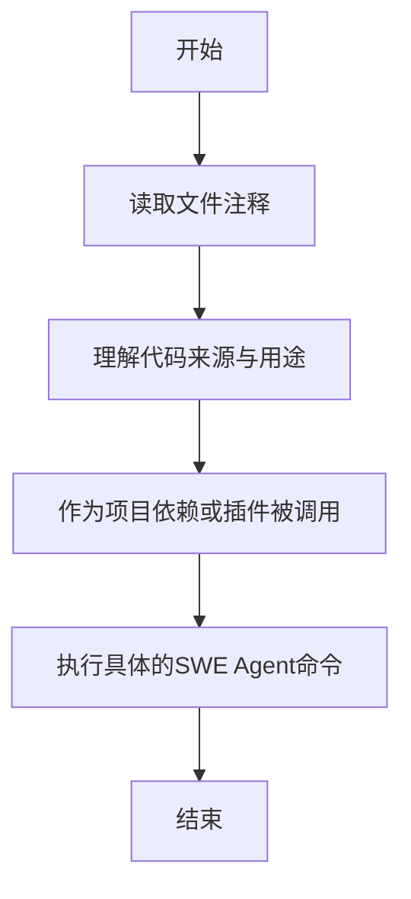

# `.\MetaGPT\metagpt\tools\swe_agent_commands\__init__.py` 详细设计文档

该文件是一个占位符或说明文件，本身不包含可执行代码。它通过注释说明当前目录（`swe_agent_commands`）中的代码来源于Princeton NLP的SWE-agent项目，并由OpenDevin项目进行了修改。其核心功能是作为一组用于软件工程代理（SWE Agent）的命令集合的配置或实现，这些命令可能用于与代码库交互、执行测试、修复bug等自动化任务。

## 整体流程



## 类结构

```
无具体类结构 (仅注释文件)
```

## 全局变量及字段


    

## 全局函数及方法


## 关键组件


### 代码来源与引用说明

此代码片段是一个文档字符串，用于说明当前文件夹中代码的来源和引用关系。它明确指出代码源自 `princeton-nlp/SWE-agent` 项目，并提供了原始仓库的链接。同时，它也说明了当前使用的是经过 `OpenDevin` 项目修改后的版本，并提供了相应链接。


## 问题及建议


### 已知问题

-   **代码功能缺失**：提供的代码片段仅包含注释，没有实现任何实际功能。这导致该模块无法执行任何设计任务，无法作为有效的工具或组件被调用。
-   **依赖关系不明确**：注释中提到了对 `princeton-nlp/SWE-agent` 和 `OpenDevin/OpenDevin` 项目的依赖，但代码中未通过 `import` 语句或配置文件明确声明这些依赖。这可能导致运行时错误或版本冲突。
-   **缺乏配置和初始化逻辑**：作为一个从外部项目“借用”的文件夹，代码中没有包含任何配置加载、环境检查或插件初始化的逻辑，使得该模块无法在目标系统中直接运行或集成。

### 优化建议

-   **实现核心功能或明确占位符作用**：应基于注释中提到的来源（SWE-agent 或 OpenDevin 的修改版），实现具体的命令逻辑。如果当前仅作为结构占位符，应在代码中添加明确的 `TODO` 或 `FIXME` 注释，说明待实现的功能和计划。
-   **明确定义外部依赖**：在模块的入口文件或 `requirements.txt`/`pyproject.toml` 中，明确声明对 `princeton-nlp/SWE-agent` 或 `OpenDevin` 特定版本或分支的依赖。同时，考虑添加导入语句和依赖检查，确保运行环境正确。
-   **添加配置与集成接口**：设计并实现一个清晰的配置接口（如从 YAML 文件读取）和一个初始化函数。该函数应负责设置模块的运行环境、加载必要的资源，并提供一个清晰的 API 供主系统调用，确保模块能够作为插件被正确集成和启用。


## 其它


### 设计目标与约束

该代码模块的设计目标是为项目提供一个从外部项目（Princeton NLP 的 SWE-agent 和 OpenDevin）借鉴并修改的命令配置集合。其核心约束包括：1）保持与原始项目命令接口的兼容性或明确标注修改点，以确保功能的正确性；2）作为运行时插件集成，需遵循主项目的插件架构规范；3）代码本身主要为配置和命令定义，因此设计上强调清晰性、可维护性和易于扩展，而非复杂的运行时逻辑。

### 错误处理与异常设计

由于当前代码片段仅为模块说明和引用声明，未包含可执行逻辑，因此没有定义具体的错误处理机制。在完整的命令实现中，预期错误处理应遵循以下原则：1）每个命令函数应能捕获其操作中可能出现的异常（如文件不存在、权限错误、命令执行失败等）；2）将底层异常转化为对用户或调用方友好的错误信息或特定状态码；3）可能通过返回统一的`CommandResult`类来封装执行结果、输出、错误状态和消息，而非直接抛出异常中断主流程。

### 数据流与状态机

本模块作为命令集，其数据流主要由调用方驱动：1）调用方（如智能体控制器）传入命令名称和参数；2）模块内的命令分发器或工厂根据名称找到对应的命令函数；3）命令函数执行，操作文件系统或与子进程交互，产生标准输出、标准错误和返回码；4）执行结果被封装并返回给调用方。由于命令通常是离散且无状态的，因此不涉及复杂的状态机。每个命令的执行是独立的，不依赖于其他命令的历史状态。

### 外部依赖与接口契约

该模块明确声明了其外部依赖和来源：1）**原始依赖**：Princeton NLP 的 SWE-agent 仓库中的命令配置（`princeton-nlp/SWE-agent`）。2）**直接来源**：OpenDevin 项目中的修改版本（`OpenDevin/OpenDevin`）。模块与外部（即主项目）的接口契约是：提供一组可在沙箱或运行时环境中执行的操作命令（如文件编辑、搜索、执行测试等），这些命令的输入参数和输出格式需要符合主项目中智能体（Agent）的预期。任何对原始命令的修改都需要在此说明，以管理依赖和兼容性风险。

### 安全与权限考量

虽然代码片段未展示具体命令，但作为系统命令执行插件，安全是重要考量：1）所有命令应在受限的沙箱环境（如 Docker 容器）中执行，以隔离对主机系统的潜在影响。2）命令执行应遵循最小权限原则，避免使用高权限（如 root）执行用户提供的操作。3）需要对命令参数进行严格的验证和清理，防止命令注入攻击。4）对于文件操作命令，应有路径遍历检查，将操作限制在指定工作区内。

### 配置与可扩展性

该模块作为“命令配置”集合，其本身的结构应便于配置和管理：1）命令可能通过配置文件（如 YAML、JSON）或装饰器进行声明和注册。2）应提供清晰的机制供开发者添加新的自定义命令或覆盖现有命令的行为。3）命令的元数据（如描述、参数模式）应易于获取，以支持动态帮助生成或智能体规划。当前文档头已体现了配置来源的可追溯性，这是良好配置管理的一部分。

### 测试策略

为确保命令的可靠性，应配套相应的测试策略：1）**单元测试**：针对每个命令函数，模拟其依赖（如文件系统、子进程），测试各种正常和异常输入。2）**集成测试**：在轻量级沙箱中测试命令组合执行的效果。3）**回归测试**：当同步上游（SWE-agent 或 OpenDevin）更改时，需运行测试套件以确保兼容性和功能正确性。测试用例应覆盖从原始项目继承的行为和本地修改的行为。

    