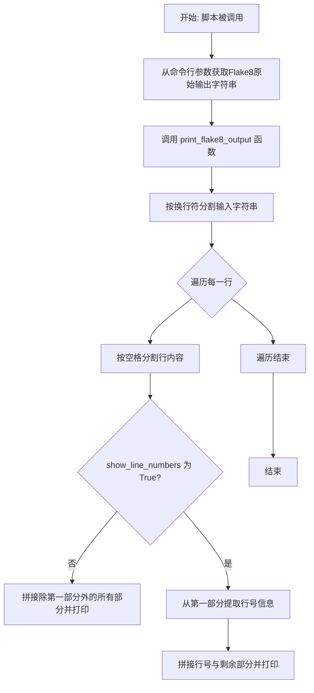

# `.\MetaGPT\metagpt\tools\swe_agent_commands\_split_string.py` 详细设计文档

该代码是一个简单的命令行工具，用于格式化Flake8静态代码检查工具的输出结果。它接收Flake8的原始输出字符串，可以选择性地显示或隐藏行号信息，并以更清晰、结构化的方式（如项目符号列表）重新格式化输出，以提高可读性。

## 整体流程



## 类结构

```
该脚本不包含类定义，仅包含函数和主程序逻辑。
```

## 全局变量及字段


### `sys`
    
Python标准库模块，提供对解释器使用或维护的一些变量的访问，以及与解释器交互的函数。

类型：`module`
    


### `lint_output`
    
从命令行参数获取的字符串，包含flake8等代码检查工具的输出结果。

类型：`str`
    


    

## 全局函数及方法


### `print_flake8_output`

该函数用于解析并格式化 Flake8 代码检查工具的输出字符串。它接收原始的 Flake8 输出，将其按行分割，并可以选择性地显示或隐藏错误所在的行号信息，最终以更易读的列表格式打印到标准输出。

参数：

-  `input_string`：`str`，包含 Flake8 原始输出的字符串，通常格式为 `"文件名:行号:列号: 错误码 错误描述"`。
-  `show_line_numbers`：`bool`，一个布尔标志，指示是否在输出中包含行号信息。默认为 `False`。

返回值：`None`，该函数不返回任何值，其作用是将格式化后的内容直接打印到控制台。

#### 流程图

```mermaid
flowchart TD
    A[开始: print_flake8_output] --> B[遍历 input_string 的每一行]
    B --> C{行内容是否为空?}
    C -- 是 --> B
    C -- 否 --> D[按空格分割行内容为 parts]
    D --> E{show_line_numbers 为 True?}
    E -- 否 --> F[打印 parts[1:] 的合并内容]
    E -- 是 --> G[从 parts[0] 提取行号信息 line_nums]
    G --> H[打印 line_nums 和 parts[1:] 的合并内容]
    F --> I[循环结束?]
    H --> I
    I -- 否 --> B
    I -- 是 --> J[结束]
```

#### 带注释源码

```python
def print_flake8_output(input_string, show_line_numbers=False):
    # 遍历输入字符串按换行符分割后的每一行
    for value in input_string.split("\n"):
        # 将当前行按空格分割成多个部分，例如 ['file.py:10:20:', 'E501', 'line', 'too', 'long']
        parts = value.split()
        # 检查是否需要显示行号
        if not show_line_numbers:
            # 如果不显示行号，则跳过第一个元素（包含文件路径和行列号的部分），
            # 将剩余部分用空格连接并打印
            print(f"- {' '.join(parts[1:])}")
        else:
            # 如果需要显示行号，则从第一个元素（如'file.py:10:20:'）中提取行号和列号
            # 通过冒号分割后，取第一个元素之后的部分（即索引1开始的部分），再用冒号连接
            # 例如 'file.py:10:20:' -> ['file.py', '10', '20', ''] -> '10:20'
            line_nums = ":".join(parts[0].split(":")[1:])
            # 打印提取的行号信息以及错误详情
            print(f"- {line_nums} {' '.join(parts[1:])}")
```


## 关键组件


### 命令行参数解析与输入处理

该组件负责从命令行接收原始输入字符串，并将其作为参数传递给核心处理函数，是程序的入口和数据输入点。

### 格式化输出逻辑

该组件定义了 `print_flake8_output` 函数，其核心功能是解析并重新格式化输入的字符串（模拟Flake8的输出格式），根据 `show_line_numbers` 标志决定是否在输出中包含行号信息。

### 条件输出控制

该组件通过 `show_line_numbers` 参数控制输出内容的详细程度。当该标志为 `False` 时，输出省略文件名和行号信息；当为 `True` 时，则解析并保留行号信息，实现了输出格式的灵活切换。


## 问题及建议


### 已知问题

-   **脆弱的输入解析**：代码假设输入字符串的格式严格为 `filename:line:column:code message`，并且通过空格分割。如果 `flake8` 的输出格式发生变化（例如，消息中包含空格），或者输入来自其他工具，解析将失败或产生错误输出。
-   **缺乏输入验证**：函数 `print_flake8_output` 没有对输入参数 `input_string` 进行有效性检查。如果传入 `None`、空字符串或非字符串类型，代码可能会抛出异常（如 `AttributeError` 或 `TypeError`）。
-   **硬编码的格式逻辑**：输出格式（如 `- ` 前缀）和解析逻辑（如按空格分割、按冒号分割行号）都直接写在函数中，使得代码难以适应不同的输出需求或格式。
-   **有限的命令行参数处理**：主程序仅从 `sys.argv[1]` 获取输入，没有提供标准的命令行参数解析（如 `argparse`），不支持帮助信息、可选参数（如 `show_line_numbers` 无法通过命令行控制）或错误提示。
-   **函数职责不单一**：`print_flake8_output` 函数同时负责解析输入字符串和格式化输出，违反了单一职责原则，降低了代码的可测试性和可维护性。

### 优化建议

-   **增强解析鲁棒性**：使用正则表达式或专门的解析库来解析 `flake8` 的输出行，以更准确地处理可能包含空格的错误消息。例如，匹配模式 `^(.*?):(\d+):(\d+):\s*(\w+)\s+(.*)$` 来捕获文件名、行号、列号、错误码和消息。
-   **添加输入验证和错误处理**：在函数开始处检查 `input_string` 是否为字符串类型，并优雅地处理空输入。考虑使用 `try-except` 块来捕获并处理解析过程中可能出现的异常。
-   **分离关注点**：将代码重构为两个独立的函数：一个用于解析单行输入并返回结构化的数据（如字典或命名元组），另一个用于根据配置（如是否显示行号）格式化并打印这些数据。这提高了模块化和可测试性。
-   **使用 `argparse` 模块**：重构主程序部分，使用 `argparse` 来定义命令行接口。可以添加参数来控制是否显示行号、指定输入文件或直接从标准输入读取，并自动生成帮助文档。
-   **提高代码可配置性**：将输出格式的前缀（如 `- `）和分隔符作为可配置参数或常量，而不是硬编码在函数内部，使代码更易于适应不同的使用场景。
-   **添加单元测试**：为解析和格式化函数编写单元测试，覆盖各种边界情况（如空输入、格式错误行、包含特殊字符的消息等），以确保代码的稳定性和可靠性。


## 其它


### 设计目标与约束

该脚本的设计目标是将 Flake8 工具输出的、以冒号分隔行号信息的原始字符串，转换为更易读的列表格式。核心约束包括：1) 保持轻量级，作为命令行工具运行，不引入外部依赖；2) 处理来自标准输入或命令行参数的字符串输入；3) 提供可选的开关以控制是否在输出中包含行号信息。

### 错误处理与异常设计

当前代码缺乏显式的错误处理机制。例如，当 `sys.argv[1]` 不存在（即未提供命令行参数）时，会引发 `IndexError`。此外，`input_string.split("\n")` 和 `parts[0].split(":")` 等操作假设输入格式严格符合预期，如果输入格式不符（如空字符串、不包含冒号的行），可能导致 `IndexError` 或产生非预期的输出。设计上依赖调用者提供正确格式的输入，属于“快速失败”策略，但未对用户提供清晰的错误指引。

### 数据流与状态机

程序的数据流是线性的、无状态的。输入数据（原始 Flake8 输出字符串）通过命令行参数传入。在 `print_flake8_output` 函数中，数据经历以下转换：1) 按换行符拆分为行列表；2) 对每一行按空格拆分为单词列表 (`parts`)；3) 根据 `show_line_numbers` 标志，选择性地从 `parts[0]` 中提取并重新格式化行号信息；4) 将处理后的部分重新组合并打印输出。整个过程没有内部状态维持，每一行的处理相互独立。

### 外部依赖与接口契约

**外部依赖**：仅依赖 Python 标准库的 `sys` 模块，用于访问命令行参数。无第三方依赖。

**接口契约**：
*   **函数 `print_flake8_output`**:
    *   **输入契约**: 参数 `input_string` 应为字符串，其内容预期为 Flake8 的默认输出格式（每行格式如 `file_path:line_num:col_num:code message`）。参数 `show_line_numbers` 应为布尔值。
    *   **输出契约**: 函数无返回值 (`None`)。其副作用是将格式化后的内容逐行打印到标准输出。每行以“- ”开头，后接处理后的信息。
*   **脚本主入口**:
    *   **命令行接口契约**: 期望至少一个命令行参数。第一个参数 (`sys.argv[1]`) 被解释为需要处理的 Flake8 输出字符串。当前版本未定义用于启用行号显示的标志参数。

    