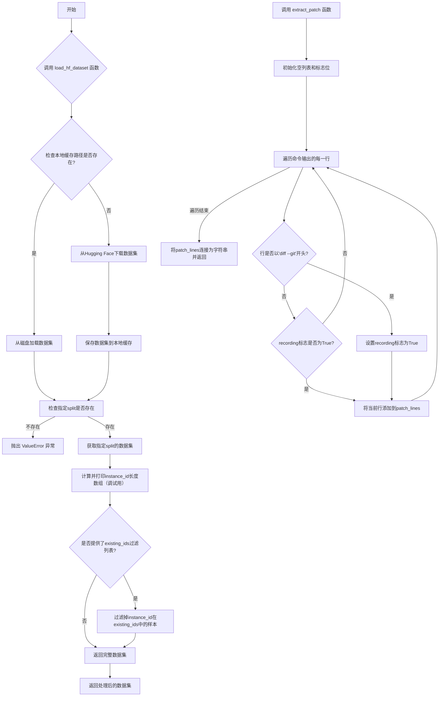
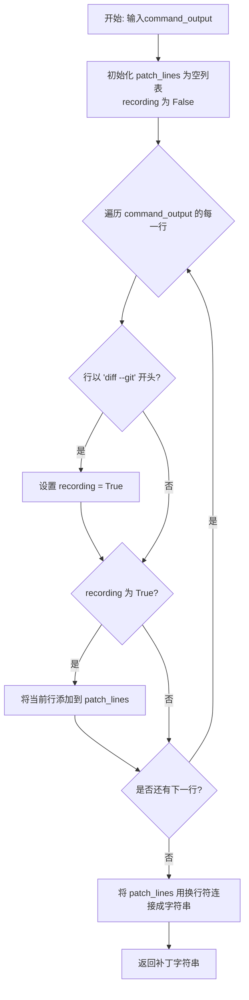
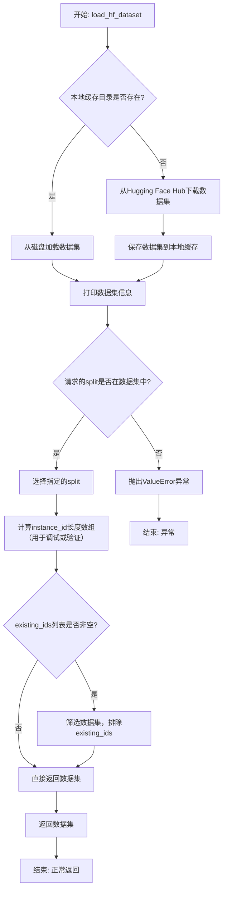

# `.\MetaGPT\metagpt\tools\swe_agent_commands\swe_agent_utils.py` 详细设计文档

该代码文件主要包含两个功能：1) 从命令输出中提取Git补丁（patch）文本；2) 从Hugging Face数据集库或本地缓存加载数据集，并支持基于ID的过滤。它封装了数据集的加载、缓存和预处理逻辑，是机器学习数据管道中的一个实用工具模块。

## 整体流程



## 类结构

```
该文件不包含类定义，仅包含函数。
├── 全局函数
│   ├── extract_patch
│   └── load_hf_dataset
```

## 全局变量及字段


### `data_dir`
    
用于存储或加载数据集的本地目录路径。

类型：`pathlib.Path`
    


### `dataset`
    
从Hugging Face加载或从磁盘读取的数据集对象。

类型：`datasets.Dataset | datasets.DatasetDict`
    


### `patch_lines`
    
用于临时存储从命令输出中提取的补丁代码行的列表。

类型：`list[str]`
    


### `recording`
    
一个标志，指示是否开始记录补丁行。

类型：`bool`
    


    

## 全局函数及方法


### `extract_patch`

该函数用于从一段包含 `git diff` 命令输出的文本中，提取出纯粹的补丁（patch）部分。它通过识别 `"diff --git"` 起始行来定位补丁的开始，并收集从该行开始到文本末尾的所有行，最后将它们合并成一个字符串返回。

参数：

-  `command_output`：`str`，包含 `git diff` 命令输出的完整文本字符串。

返回值：`str`，从输入文本中提取出的补丁字符串。

#### 流程图



#### 带注释源码

```python
def extract_patch(command_output):
    # 初始化一个空列表，用于存储提取出的补丁行
    patch_lines = []
    # 初始化一个标志位，表示是否开始记录补丁行
    recording = False
    # 遍历输入字符串的每一行（按换行符分割）
    for line in command_output.split("\n"):
        # 检查当前行是否以 "diff --git" 开头，这是 git diff 补丁的标准起始标记
        if line.startswith("diff --git"):
            # 找到起始标记，将记录标志设为 True
            recording = True
        # 如果记录标志为 True，则当前行属于补丁的一部分
        if recording:
            # 将当前行添加到补丁行列表中
            patch_lines.append(line)
    # 使用换行符将列表中的所有行连接成一个字符串，并返回
    return "\n".join(patch_lines)
```


### `load_hf_dataset`

该函数负责从Hugging Face Hub加载指定的数据集，或从本地缓存目录加载已保存的数据集。它支持数据集的筛选，以排除已存在的实例ID，并确保请求的数据集分割（如“train”、“test”）有效。

参数：

- `dataset_name_or_path`：`str`，Hugging Face Hub上的数据集名称或本地数据集的路径。
- `cache_dir`：`Path`，用于缓存数据集的本地目录路径。
- `split`：`str`，默认为“test”，指定要加载的数据集分割（如“train”、“validation”、“test”）。
- `existing_ids`：`list`，默认为空列表，包含已存在的实例ID列表，用于筛选数据集，排除这些ID对应的数据。

返回值：`datasets.Dataset`，返回一个Hugging Face `datasets.Dataset`对象，表示加载（并可能筛选后）的数据集。

#### 流程图



#### 带注释源码

```python
def load_hf_dataset(dataset_name_or_path: str, cache_dir, split: str = "test", existing_ids: list = []):
    # 构建本地缓存路径：cache_dir / dataset_name_or_path
    data_dir = cache_dir / dataset_name_or_path
    # 检查本地缓存路径是否存在
    if Path(data_dir).exists():
        # 如果存在，直接从磁盘加载数据集
        dataset = load_from_disk(data_dir)
    else:
        # 如果不存在，从Hugging Face Hub下载数据集
        dataset = load_dataset(dataset_name_or_path)
        # 将下载的数据集保存到本地缓存目录，供后续使用
        dataset.save_to_disk(data_dir)
    # 打印数据集信息（通常用于调试，了解数据集结构）
    print(dataset)
    # 验证请求的数据集分割（split）是否存在于数据集中
    if split not in dataset:
        # 如果不存在，抛出ValueError异常
        raise ValueError(f"Invalid split {split} for dataset {dataset_name_or_path}")
    # 选择指定的数据集分割
    dataset = dataset[split]
    # 计算数据集中每个'instance_id'字段的长度，并转换为numpy数组
    # 此行代码可能用于调试或验证数据完整性，但结果未使用
    np.array(list(map(len, dataset["instance_id"])))

    # 检查是否提供了需要排除的existing_ids列表
    if existing_ids:
        # 如果提供了，使用filter方法筛选数据集
        # 只保留那些'instance_id'不在existing_ids列表中的样本
        dataset = dataset.filter(
            lambda x: x["instance_id"] not in existing_ids,  # 筛选条件
            desc="Filtering out existing ids",  # 进度条描述
            load_from_cache_file=False,  # 禁用缓存，确保每次执行都重新筛选
        )

    # 返回最终的数据集（可能已筛选）
    return dataset
```

## 关键组件


### 数据集加载与缓存管理

该组件负责从Hugging Face Hub加载数据集或从本地缓存加载，支持数据集的缓存、分片选择、以及基于现有ID的过滤功能，以提高数据加载效率和避免重复处理。

### 补丁提取器

该组件用于从命令输出中提取Git格式的补丁内容，通过识别"diff --git"行作为起始标记，捕获后续所有行以构建完整的补丁文本。

### 数据过滤与去重

该组件通过`filter`操作，基于给定的`existing_ids`列表，从数据集中排除已存在的实例，确保数据处理的唯一性和避免重复工作。


## 问题及建议


### 已知问题

-   **`extract_patch` 函数逻辑不严谨**：该函数通过检测行首是否为 `"diff --git"` 来开始记录补丁行。然而，一个有效的补丁文件可能包含多个 `"diff --git"` 块（例如，一个提交包含多个文件的修改）。当前实现会从第一个 `"diff --git"` 开始，一直记录到文件末尾，这会将多个独立的补丁块错误地合并成一个。如果输入文本在 `"diff --git"` 行之前包含其他内容，这些内容会被错误地丢弃。
-   **`load_hf_dataset` 函数存在潜在的缓存污染风险**：函数使用 `cache_dir / dataset_name_or_path` 作为本地缓存路径。如果 `dataset_name_or_path` 是一个远程仓库标识（如 `'username/dataset'`），此逻辑可行。但如果它是一个本地路径（如 `'./my_data'`），与 `cache_dir` 拼接后可能产生非预期的、无效的路径，导致无法正确加载或保存数据集。
-   **`load_hf_dataset` 函数存在不必要的计算和可能的错误**：代码行 `np.array(list(map(len, dataset["instance_id"])))` 创建了一个数组但未赋值给任何变量，该操作没有实际效用，属于冗余代码。如果 `dataset["instance_id"]` 中的元素不是字符串（例如是数字），`len()` 函数会抛出 `TypeError`。
-   **`load_hf_dataset` 函数错误处理不完整**：函数检查了 `split` 是否在数据集中，但如果 `split` 参数为 `None` 或空字符串，或者数据集加载失败（如网络问题、数据集不存在），错误信息可能不够清晰或未被妥善捕获。
-   **硬编码的字符串和缺乏配置性**：函数中的 `"instance_id"` 字段名是硬编码的，这降低了代码的复用性。如果数据集使用不同的标识符字段名（如 `"id"`, `"sample_id"`），代码将无法工作。
-   **`existing_ids` 参数默认值使用可变对象**：参数 `existing_ids: list = []` 使用了可变列表作为默认值。这是一个常见的Python陷阱，因为默认列表在函数定义时被创建，并在所有函数调用中共享，可能导致意外的数据残留。

### 优化建议

-   **重构 `extract_patch` 函数**：建议修改逻辑以正确处理包含多个补丁块的情况。可以改为收集所有以 `"diff --git"` 开头的行及其后续行，直到遇到下一个 `"diff --git"` 或文件结尾，然后将每个块作为独立补丁处理或返回一个补丁列表。
-   **改进 `load_hf_dataset` 的缓存路径逻辑**：在构造缓存路径前，应检查 `dataset_name_or_path` 是否为有效的本地路径（例如，使用 `Path(dataset_name_or_path).exists()`）。如果是，则考虑直接使用该路径或给出明确警告/错误。更好的做法是使用 `datasets` 库内置的缓存机制或明确区分“数据集标识符”和“本地路径”两种输入模式。
-   **移除冗余代码并增强健壮性**：删除无用的 `np.array(list(map(len, dataset["instance_id"])))` 行。在访问 `dataset["instance_id"]` 前，可添加检查以确保该字段存在且元素类型合适。
-   **完善错误处理**：使用更精细的 `try-except` 块来捕获数据集加载、保存及字段访问过程中可能出现的异常（如 `FileNotFoundError`, `ConnectionError`, `KeyError`, `TypeError`），并提供更友好的错误消息。
-   **提高代码可配置性和复用性**：将 `"instance_id"` 作为函数的参数（如 `id_field_name="instance_id"`），允许调用者指定数据集中用作唯一标识的字段名。
-   **修正默认参数**：将 `existing_ids` 的默认值改为 `None`，并在函数内部将其初始化为空列表：`def load_hf_dataset(..., existing_ids: Optional[List] = None): if existing_ids is None: existing_ids = []`。
-   **添加类型注解和文档字符串**：为函数添加完整的类型注解（例如使用 `from typing import Optional, List`）和详细的文档字符串（Docstring），说明函数的目的、参数、返回值及可能抛出的异常。
-   **考虑性能**：如果 `existing_ids` 列表很大，`filter` 操作中的 `x["instance_id"] not in existing_ids` 可能会比较慢，因为 `in` 操作在列表上是 O(n) 复杂度。可以考虑将 `existing_ids` 转换为 `set` 以提高查找效率。


## 其它


### 设计目标与约束

本模块的核心设计目标是提供一个可复用的、高效的数据集加载与预处理工具，专注于处理包含代码变更（patch）的特定格式数据集。其主要约束包括：1) 必须兼容 Hugging Face `datasets` 库的接口，支持从远程仓库加载或从本地缓存加载以提升效率。2) 需要能够根据给定的 `instance_id` 列表对数据集进行过滤，以避免在分布式或增量处理场景下的数据重复。3) 函数 `extract_patch` 作为辅助工具，设计目标是从命令输出中鲁棒地提取出标准的 `diff` 格式补丁，其实现假设补丁内容以 `"diff --git"` 行开始。

### 错误处理与异常设计

模块的错误处理主要采用 Python 异常机制。在 `load_hf_dataset` 函数中，当请求的数据集分割（`split`）不存在时，会抛出 `ValueError` 异常，并给出明确的错误信息。对于 `load_dataset` 或 `load_from_disk` 等底层库调用可能抛出的异常（如网络错误、文件损坏、格式错误等），本模块未进行显式捕获，而是选择将其向上层传播，由调用者根据具体业务场景决定如何处理。`extract_patch` 函数对输入格式有隐含假设，如果输入中不包含 `"diff --git"` 行，则返回空字符串，这可以视为一种静默处理，调用者需注意检查返回值。

### 数据流与状态机

1.  **数据集加载流程**：`load_hf_dataset` 函数的数据流始于一个数据集标识符（名称或路径）和缓存目录。首先检查本地缓存，命中则直接加载，未命中则从 Hugging Face Hub 下载并保存到缓存。随后，根据 `split` 参数选择数据子集，并进行可选的 ID 过滤。最终返回过滤后的 `datasets.Dataset` 对象。
2.  **补丁提取流程**：`extract_patch` 函数实现了一个简单的两状态机来处理文本行流。
    *   **初始状态 (非记录状态)**：逐行读取输入文本。
    *   **触发条件**：当遇到以 `"diff --git"` 开头的行时，状态切换为**记录状态**。
    *   **记录状态**：将此行及之后的所有行添加到结果列表中。
    *   **终止**：处理完所有行后，将记录的行列表连接成字符串返回。该过程没有明确的退出记录状态的条件。

### 外部依赖与接口契约

1.  **外部库依赖**：
    *   `datasets` (Hugging Face): 核心依赖，用于数据集的加载、缓存和过滤操作。模块强依赖于其 `load_dataset`, `load_from_disk`, `Dataset.save_to_disk`, `Dataset.filter` 等接口的稳定性和行为。
    *   `numpy`: 轻量级依赖，仅用于 `np.array` 调用，可能用于后续处理或调试，非核心必需。
    *   `pathlib.Path`: Python 标准库，用于路径操作。
2.  **接口契约**：
    *   `load_hf_dataset` 函数契约：输入参数 `dataset_name_or_path` 和 `cache_dir` 需兼容 `datasets.load_dataset` 的要求。返回的 `datasets.Dataset` 对象预期包含 `"instance_id"` 字段以供过滤。`existing_ids` 列表中的元素类型应与 `instance_id` 字段类型匹配。
    *   `extract_patch` 函数契约：输入 `command_output` 应为字符串类型。函数不保证提取出的补丁字符串是语法有效的 `diff`，仅保证它从第一个 `"diff --git"` 行开始。

### 性能考量

1.  **缓存策略**：通过本地磁盘缓存避免了重复从网络下载数据集，是主要的性能优化点。
2.  **过滤操作**：`dataset.filter` 操作在数据集较大时可能较慢，尤其是当 `existing_ids` 列表很大时。当前的 `lambda` 函数检查 `x["instance_id"] not in existing_ids`，其时间复杂度为 O(n*m)，其中 n 是数据集大小，m 是 `existing_ids` 列表大小。对于大规模过滤，建议将 `existing_ids` 转换为 `set` 以获得 O(1) 的查找复杂度。当前实现未做此优化，是一个潜在的瓶颈。
3.  **内存与调试**：`np.array(list(map(len, dataset["instance_id"])))` 这行代码创建了一个包含所有 `instance_id` 长度的新数组，但该结果未被使用。这会导致不必要的内存分配和计算开销，应被视为调试遗留代码或待移除的代码。

### 可测试性设计

1.  **`extract_patch` 函数**：易于进行单元测试。可以构造包含/不包含 `"diff --git"` 头部、包含多段 diff 等的字符串输入，验证输出是否符合预期。
2.  **`load_hf_dataset` 函数**：测试较为复杂，涉及外部资源（HF Hub，本地文件系统）。可通过以下方式增强可测试性：
    *   **依赖注入（当前未使用）**：可以将 `load_dataset` 和 `load_from_disk` 作为参数传入，以便在测试中替换为模拟对象（Mock）。
    *   **使用临时目录**：测试时应使用 `tempfile.TemporaryDirectory` 作为 `cache_dir`，确保测试隔离性。
    *   **模拟网络请求**：可以使用 `pytest` 的 `monkeypatch` 或 `responses` 库来模拟 `datasets.load_dataset` 的 HTTP 请求，避免实际网络调用。
    *   **测试过滤逻辑**：可以创建一个小的、内存中的模拟数据集对象，专门测试 ID 过滤逻辑是否正确。

### 配置与环境

模块的行为受以下配置或环境影响：
1.  **缓存目录 (`cache_dir`)**：由调用者指定，决定了数据集缓存在文件系统的位置。需要确保该目录有写入权限。
2.  **Hugging Face 身份验证**：如果加载的数据集是私有的或需要认证，`load_dataset` 的行为依赖于外部的 Hugging Face 令牌（通过环境变量 `HF_TOKEN` 或 `~/.huggingface` 中的配置文件设置）。本模块不处理认证逻辑。
3.  **网络连接**：当缓存未命中时，需要有效的网络连接来访问 Hugging Face Hub。

    