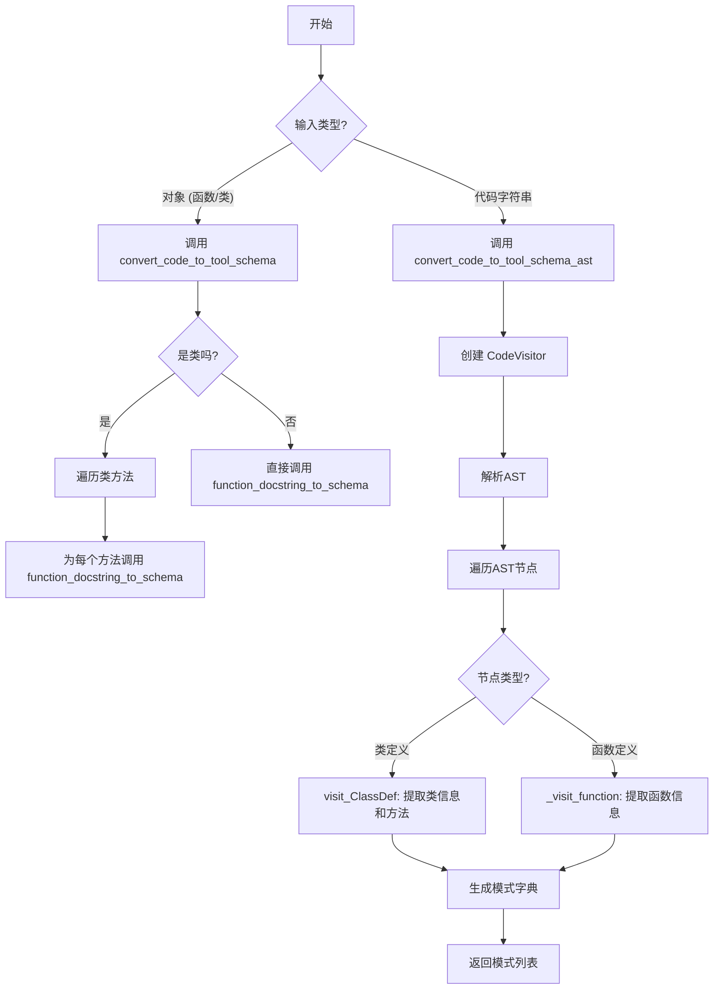
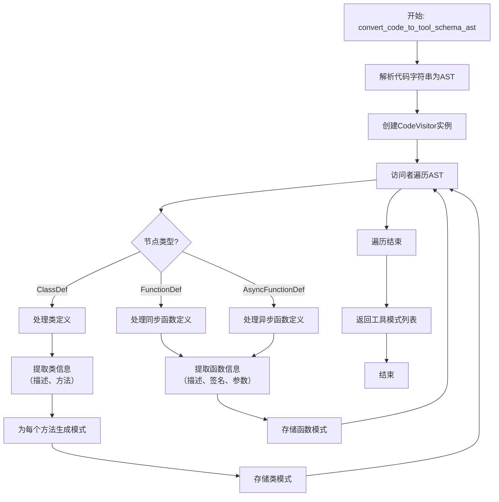
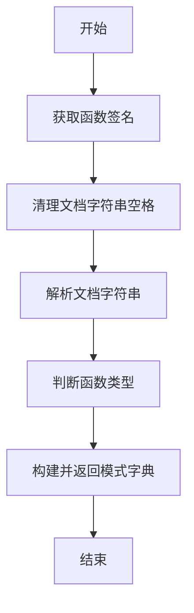
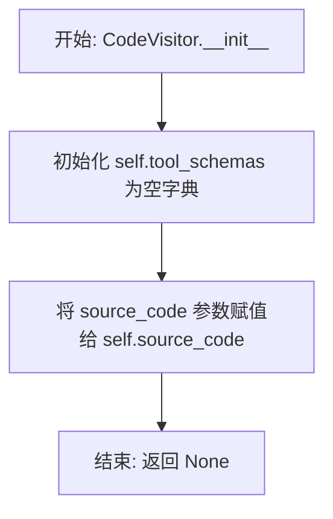
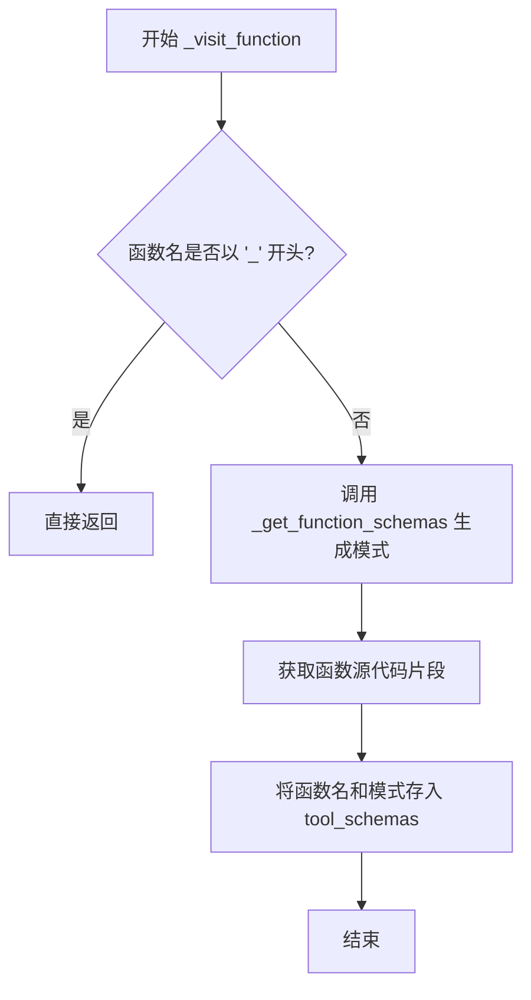
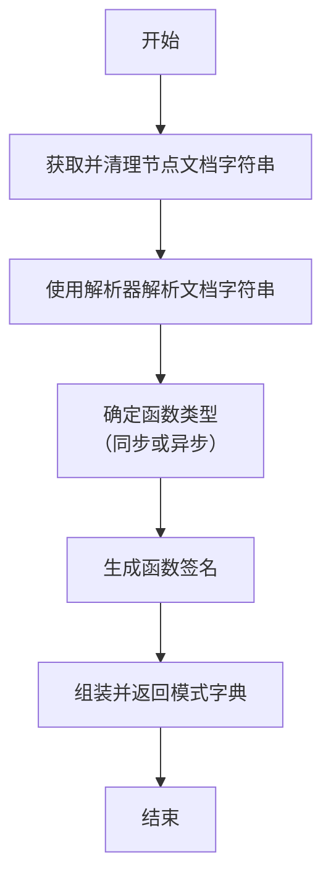
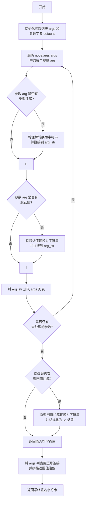
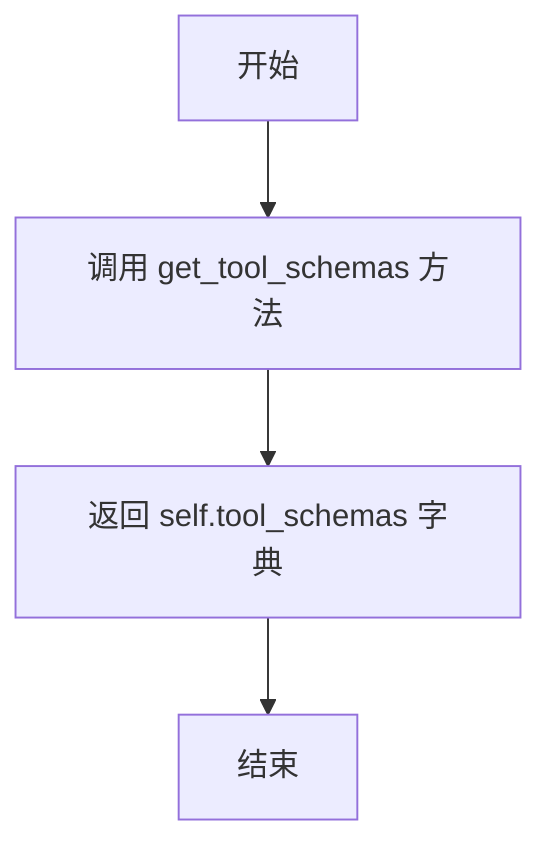

# `.\MetaGPT\metagpt\tools\tool_convert.py` 详细设计文档

该代码文件提供了一个工具模式转换器，核心功能是通过代码内省（inspect模块）或抽象语法树（AST）解析，将Python函数或类的定义及其文档字符串转换为结构化的工具模式（tool schema）。这种模式可用于自动化文档生成、API接口描述，或作为大型语言模型（LLM）理解和使用代码功能的元数据。

## 整体流程



## 类结构

```
CodeVisitor (AST节点访问器)
├── __init__ (初始化)
├── visit_ClassDef (访问类定义节点)
├── visit_FunctionDef (访问同步函数定义节点)
├── visit_AsyncFunctionDef (访问异步函数定义节点)
├── _visit_function (内部函数访问逻辑)
├── _get_function_schemas (从AST节点生成函数模式)
└── _get_function_signature (从AST节点生成函数签名)

全局函数
├── convert_code_to_tool_schema (基于内省的对象转换)
├── convert_code_to_tool_schema_ast (基于AST的代码字符串转换)
├── function_docstring_to_schema (函数文档字符串转模式)
└── get_class_method_docstring (获取类方法的文档字符串)
```

## 全局变量及字段


### `PARSER`
    
全局的文档字符串解析器实例，用于解析函数和方法的docstring。

类型：`GoogleDocstringParser`
    


### `CodeVisitor.tool_schemas`
    
存储通过AST解析代码后生成的工具模式字典，键为工具名称，值为对应的模式信息。

类型：`dict`
    


### `CodeVisitor.source_code`
    
存储待解析的源代码字符串，用于在AST节点访问过程中获取源代码片段。

类型：`str`
    
    

## 全局函数及方法

### `convert_code_to_tool_schema`

该函数是代码到工具模式转换模块的核心入口。它接收一个Python对象（函数或类），通过内省（inspection）获取其文档字符串和签名信息，并将其转换为一个结构化的字典模式（schema）。该模式旨在为大型语言模型（LLM）提供关于代码功能的标准化描述，以便LLM能够理解、推荐和调用这些代码工具。

参数：

- `obj`：`Any`，需要被转换的Python对象，通常是函数（`function`）或类（`class`）。
- `include`：`list[str]`，可选参数。当`obj`为类时，用于指定需要包含在模式中的方法名列表。如果为`None`或未提供，则包含所有非私有方法（`__init__`除外）。

返回值：`dict`，返回一个表示工具模式的字典。对于类，模式包含类描述及其方法列表的模式；对于函数，则直接返回该函数的模式。

#### 流程图

```mermaid
flowchart TD
    A[开始: convert_code_to_tool_schema(obj, include)] --> B{obj 是类?};
    B -- 是 --> C[初始化类模式 schema<br>type='class', description=类文档];
    C --> D[遍历类的所有方法];
    D --> E{方法名以 '_' 开头<br>且不是 '__init__'?};
    E -- 是 --> F[跳过此私有方法];
    E -- 否 --> G{include 列表存在<br>且方法名不在其中?};
    G -- 是 --> H[跳过此方法];
    G -- 否 --> I[获取方法文档字符串];
    I --> J[调用 function_docstring_to_schema<br>生成方法模式];
    J --> K[将方法模式加入 schema['methods']];
    K --> D;
    D --> L[遍历结束];
    L --> M[返回类模式 schema];
    B -- 否 --> N{obj 是函数?};
    N -- 是 --> O[调用 function_docstring_to_schema<br>生成函数模式];
    O --> P[返回函数模式 schema];
    N -- 否 --> Q[流程结束，返回 schema];
```

#### 带注释源码

```python
def convert_code_to_tool_schema(obj, include: list[str] = None) -> dict:
    """Converts an object (function or class) to a tool schema by inspecting the object"""
    # 获取对象的文档字符串。如果对象没有文档字符串，docstring 将为 None。
    docstring = inspect.getdoc(obj)
    # 原代码中有一行被注释掉的断言，用于在无文档字符串时跳过注册。
    # assert docstring, "no docstring found for the objects, skip registering"

    # 判断对象是否为类
    if inspect.isclass(obj):
        # 初始化类级别的模式字典。
        # 'type' 标识对象类型为类。
        # 'description' 存储类的整体描述（去除多余空格的文档字符串首段）。
        # 'methods' 是一个空字典，用于存放该类下各个方法的模式。
        schema = {"type": "class", "description": remove_spaces(docstring), "methods": {}}
        # 使用 inspect.getmembers 获取类的所有成员，并过滤出函数类型的成员（即方法）。
        for name, method in inspect.getmembers(obj, inspect.isfunction):
            # 跳过私有方法（以下划线开头），但保留特殊的 __init__ 方法。
            if name.startswith("_") and name != "__init__":  # skip private methods
                continue
            # 如果提供了 include 列表，则只处理列表中指定的方法。
            if include and name not in include:
                continue
            # 获取方法的文档字符串。这里使用自定义函数 get_class_method_docstring，
            # 以便在类的继承链中正确查找文档。
            # method_doc = inspect.getdoc(method) # 原直接获取方式可能无法找到继承的方法
            method_doc = get_class_method_docstring(obj, name)
            # 调用 function_docstring_to_schema 将方法对象及其文档转换为模式字典，
            # 并将其添加到 schema['methods'] 中，以方法名作为键。
            schema["methods"][name] = function_docstring_to_schema(method, method_doc)

    # 判断对象是否为函数（包括普通函数和异步函数）
    elif inspect.isfunction(obj):
        # 对于函数对象，直接调用 function_docstring_to_schema 生成其模式。
        schema = function_docstring_to_schema(obj, docstring)

    # 返回最终生成的模式字典。
    return schema
```

### `convert_code_to_tool_schema_ast`

该函数通过解析给定的代码字符串，利用抽象语法树（AST）遍历代码结构，提取其中的类和函数定义，并将其转换为工具模式（Tool Schema）列表。它主要用于自动化生成代码的API文档或工具调用接口描述。

参数：

- `code`：`str`，需要解析的源代码字符串。

返回值：`list[dict]`，返回一个字典列表，每个字典代表一个从代码中提取的工具模式（类或函数）。

#### 流程图



#### 带注释源码

```python
def convert_code_to_tool_schema_ast(code: str) -> list[dict]:
    """Converts a code string to a list of tool schemas by parsing the code with AST"""

    # 1. 创建AST访问者实例，传入源代码字符串
    visitor = CodeVisitor(code)
    # 2. 将源代码字符串解析为AST（抽象语法树）
    parsed_code = ast.parse(code)
    # 3. 使用访问者遍历AST，在此过程中会填充visitor.tool_schemas
    visitor.visit(parsed_code)

    # 4. 从访问者对象中获取并返回收集到的所有工具模式
    return visitor.get_tool_schemas()
```

### `function_docstring_to_schema`

将函数的文档字符串解析并转换为一个结构化的模式字典，用于描述函数的元信息，如类型、描述、签名和参数详情。

参数：
- `fn_obj`：`Any`，函数对象，用于获取其签名和判断是否为协程函数。
- `docstring`：`str`，函数的文档字符串，用于解析出总体描述和参数描述。

返回值：`dict`，返回一个字典，包含函数的类型、描述、签名和参数详情。

#### 流程图



#### 带注释源码

```python
def function_docstring_to_schema(fn_obj, docstring="") -> dict:
    """
    Converts a function's docstring into a schema dictionary.

    Args:
        fn_obj: The function object.
        docstring: The docstring of the function.

    Returns:
        A dictionary representing the schema of the function's docstring.
        The dictionary contains the following keys:
        - 'type': The type of the function ('function' or 'async_function').
        - 'description': The first section of the docstring describing the function overall. Provided to LLMs for both recommending and using the function.
        - 'signature': The signature of the function, which helps LLMs understand how to call the function.
        - 'parameters': Docstring section describing parameters including args and returns, served as extra details for LLM perception.
    """
    # 获取函数的签名，用于后续生成字符串表示
    signature = inspect.signature(fn_obj)

    # 清理文档字符串中的多余空格
    docstring = remove_spaces(docstring)

    # 使用解析器将文档字符串拆分为总体描述和参数描述部分
    overall_desc, param_desc = PARSER.parse(docstring)

    # 判断函数是普通函数还是异步函数
    function_type = "function" if not inspect.iscoroutinefunction(fn_obj) else "async_function"

    # 返回包含所有元信息的字典
    return {"type": function_type, "description": overall_desc, "signature": str(signature), "parameters": param_desc}
```

### `get_class_method_docstring`

该方法用于检索指定类中特定方法的文档字符串。它会遍历该类的整个方法解析顺序（MRO），包括其所有父类，以查找并返回该方法的第一个有效文档字符串。如果在整个类层次结构中都没有找到文档字符串，则返回 `None`。

参数：
- `cls`：`type`，需要检索方法文档字符串的类。
- `method_name`：`str`，需要检索文档字符串的方法名称。

返回值：`str | None`，如果找到则返回方法的文档字符串，否则返回 `None`。

#### 流程图

```mermaid
flowchart TD
    A[开始: get_class_method_docstring(cls, method_name)] --> B[遍历 cls 的 MRO 列表]
    B --> C{当前基类 base_class 中<br>是否存在 method_name?}
    C -- 是 --> D[获取方法对象 method]
    D --> E{method 是否有 __doc__?}
    E -- 是 --> F[返回 method.__doc__]
    E -- 否 --> B
    C -- 否 --> B
    B --> G[遍历结束，未找到]
    G --> H[返回 None]
```

#### 带注释源码

```python
def get_class_method_docstring(cls, method_name):
    """Retrieve a method's docstring, searching the class hierarchy if necessary."""
    # 遍历类的 MRO（Method Resolution Order），确保从子类到父类依次查找
    for base_class in cls.__mro__:
        # 检查当前基类的 __dict__ 中是否直接定义了该方法
        if method_name in base_class.__dict__:
            # 获取方法对象
            method = base_class.__dict__[method_name]
            # 检查该方法是否有文档字符串
            if method.__doc__:
                # 返回找到的第一个有效文档字符串
                return method.__doc__
    # 如果遍历完整个类层次结构都没有找到文档字符串，则返回 None
    return None  # No docstring found in the class hierarchy
```

### `CodeVisitor.__init__`

`CodeVisitor.__init__` 是 `CodeVisitor` 类的构造函数，用于初始化一个代码访问器实例。其主要职责是设置用于存储解析结果的字典和保存待分析的源代码字符串，为后续的 AST 遍历和工具模式提取做好准备。

参数：

- `self`：`CodeVisitor`，`CodeVisitor` 类的实例自身。
- `source_code`：`str`，需要被解析为 AST 并提取工具模式的源代码字符串。

返回值：`None`，构造函数不返回任何值。

#### 流程图



#### 带注释源码

```python
def __init__(self, source_code: str):
    # 初始化一个空字典，用于存储从代码中提取出的工具模式。
    # 键为函数名或类名，值为对应的模式字典。
    self.tool_schemas = {}  # {tool_name: tool_schema}
    
    # 保存传入的源代码字符串，以便后续使用 `ast.get_source_segment` 等方法
    # 从 AST 节点中提取对应的源代码片段。
    self.source_code = source_code
```

### `CodeVisitor.visit_ClassDef`

该方法用于访问并处理抽象语法树（AST）中的类定义节点。它会提取类的文档字符串、遍历类体中的方法（包括普通函数和异步函数，但排除私有方法，除非是 `__init__`），为每个方法生成工具模式（schema），并将这些信息整合到类的工具模式中。最后，它会从源代码中提取该类的完整代码段，并将整个类的模式存储起来。

参数：

- `node`：`ast.ClassDef`，表示AST中的一个类定义节点。

返回值：`None`，该方法不直接返回值，但会修改`self.tool_schemas`字典，将生成的类模式添加进去。

#### 流程图

```mermaid
flowchart TD
    A[开始: visit_ClassDef(node)] --> B[初始化类模式字典<br>class_schemas]
    B --> C[获取并清理类文档字符串]
    C --> D[遍历类体 node.body]
    D --> E{节点是函数定义<br>且非私有或为__init__?}
    E -- 是 --> F[调用_get_function_schemas<br>生成方法模式]
    F --> G[将方法模式添加到<br>class_schemas['methods']]
    E -- 否 --> D
    G --> D
    D --> H[遍历结束]
    H --> I[从源代码提取类代码段]
    I --> J[将类模式存入<br>self.tool_schemas]
    J --> K[结束]
```

#### 带注释源码

```python
def visit_ClassDef(self, node):
    # 1. 初始化一个字典，用于存储当前类的工具模式。
    #    模式包含类型（'class'）、描述、方法字典和源代码。
    class_schemas = {"type": "class", "description": remove_spaces(ast.get_docstring(node)), "methods": {}}
    
    # 2. 遍历类定义体（node.body）中的所有节点。
    for body_node in node.body:
        # 3. 判断节点是否为函数定义（普通函数或异步函数），
        #    并且不是以下划线开头的私有方法（但允许__init__）。
        if isinstance(body_node, (ast.FunctionDef, ast.AsyncFunctionDef)) and (
            not body_node.name.startswith("_") or body_node.name == "__init__"
        ):
            # 4. 调用内部方法，为当前函数节点生成其工具模式。
            func_schemas = self._get_function_schemas(body_node)
            # 5. 将生成的方法模式添加到类模式的'methods'字典中，键为方法名。
            class_schemas["methods"].update({body_node.name: func_schemas})
    
    # 6. 使用AST工具从原始源代码中提取当前类节点的完整代码段。
    class_schemas["code"] = ast.get_source_segment(self.source_code, node)
    # 7. 将最终构建好的类模式字典，以类名（node.name）为键，存储到实例变量tool_schemas中。
    self.tool_schemas[node.name] = class_schemas
```

### `CodeVisitor.visit_FunctionDef`

该方法用于处理AST中的同步函数定义节点（`ast.FunctionDef`）。当访问器遍历AST遇到一个函数定义时，此方法被调用。它通过调用内部辅助方法 `_visit_function` 来处理该节点，其核心逻辑是跳过私有函数（以下划线 `_` 开头的函数），并为公有函数生成工具模式（tool schema），然后将其存储在 `tool_schemas` 字典中。

参数：

- `node`：`ast.FunctionDef`，表示AST中的一个同步函数定义节点。

返回值：`None`，此方法不返回任何值，其作用是通过修改实例的 `self.tool_schemas` 属性来产生副作用。

#### 流程图

```mermaid
flowchart TD
    A[开始: visit_FunctionDef] --> B{函数名是否以 '_' 开头?}
    B -- 是 --> C[直接返回，不处理]
    B -- 否 --> D[调用 _visit_function(node)]
    D --> E[结束]
```

#### 带注释源码

```python
def visit_FunctionDef(self, node):
    # 处理AST中的同步函数定义节点。
    # 直接调用内部辅助方法 `_visit_function` 来处理该节点。
    # `_visit_function` 方法会检查函数名，并为公有函数生成工具模式。
    self._visit_function(node)
```

### `CodeVisitor.visit_AsyncFunctionDef`

该方法用于处理抽象语法树（AST）中的异步函数定义节点（`ast.AsyncFunctionDef`）。它作为AST访问者模式的一部分，当遍历到异步函数定义时被调用。其核心逻辑是调用内部辅助方法 `_visit_function` 来处理函数节点，从而将异步函数的信息（如名称、文档字符串、签名等）提取并存储到工具模式字典中。

参数：

- `node`：`ast.AsyncFunctionDef`，表示AST中的异步函数定义节点，包含该函数的所有语法信息。

返回值：`None`，该方法不返回任何值，其作用是通过修改实例状态（`self.tool_schemas`）来产生副作用。

#### 流程图

```mermaid
flowchart TD
    A[开始: visit_AsyncFunctionDef(node)] --> B{函数名是否以 '_' 开头?};
    B -- 是 --> C[直接返回，不处理私有函数];
    B -- 否 --> D[调用 _visit_function(node)];
    D --> E[在 _visit_function 中调用 _get_function_schemas];
    E --> F[提取文档字符串和签名];
    F --> G[构建函数模式字典];
    G --> H[将模式字典存入 self.tool_schemas];
    H --> I[结束];
```

#### 带注释源码

```python
def visit_AsyncFunctionDef(self, node):
    # 调用内部辅助方法 `_visit_function` 来处理函数节点。
    # 该方法会检查函数名（跳过私有函数），提取函数信息，并存储到 `self.tool_schemas` 中。
    self._visit_function(node)
```

### `CodeVisitor._visit_function`

该方法用于处理AST中的函数定义节点（包括普通函数和异步函数）。它会检查函数名是否以"_"开头（即是否为私有方法），如果是则跳过。对于公共函数，它会调用`_get_function_schemas`方法生成函数模式，并获取函数的源代码片段，然后将函数名和模式添加到`tool_schemas`字典中。

参数：

- `node`：`ast.FunctionDef` 或 `ast.AsyncFunctionDef`，表示AST中的函数定义节点。

返回值：`None`，该方法不返回任何值，其作用是将处理结果存储在类的`tool_schemas`字段中。

#### 流程图



#### 带注释源码

```python
def _visit_function(self, node):
    # 检查函数名是否以 '_' 开头，如果是则跳过（视为私有方法）
    if node.name.startswith("_"):
        return
    # 调用内部方法获取函数的模式信息（类型、描述、签名、参数等）
    function_schemas = self._get_function_schemas(node)
    # 使用 ast.get_source_segment 从源代码中提取该函数的完整代码片段
    function_schemas["code"] = ast.get_source_segment(self.source_code, node)
    # 将函数名作为键，其模式信息作为值，存储到 tool_schemas 字典中
    self.tool_schemas[node.name] = function_schemas
```

### `CodeVisitor._get_function_schemas`

该方法用于从给定的AST函数定义节点中提取信息，并构建一个描述该函数的结构化模式字典。它解析函数的文档字符串、签名和参数信息，以生成一个标准化的表示形式，供后续工具使用。

参数：

- `node`：`ast.FunctionDef` 或 `ast.AsyncFunctionDef`，表示一个函数或异步函数的AST节点。

返回值：`dict`，返回一个包含函数模式信息的字典。字典包含以下键：
    - `type`：字符串，表示函数类型（`'function'` 或 `'async_function'`）。
    - `description`：字符串，从文档字符串中提取的总体描述。
    - `signature`：字符串，表示函数的签名（包括参数和返回类型）。
    - `parameters`：字典，从文档字符串中解析出的参数和返回值详细信息。

#### 流程图



#### 带注释源码

```python
def _get_function_schemas(self, node):
    """
    从AST函数节点生成函数模式字典。

    该方法是CodeVisitor类的内部方法，负责处理单个函数或异步函数节点。
    它执行以下步骤：
    1. 获取并清理节点的文档字符串。
    2. 使用GoogleDocstringParser解析文档字符串，分离总体描述和参数详情。
    3. 根据节点类型确定函数是同步还是异步。
    4. 调用内部方法生成函数的字符串签名。
    5. 将所有信息组装成一个字典并返回。

    Args:
        node (ast.FunctionDef | ast.AsyncFunctionDef): 表示函数定义的AST节点。

    Returns:
        dict: 包含函数模式信息的字典。
    """
    # 1. 获取并清理文档字符串
    docstring = remove_spaces(ast.get_docstring(node))
    # 2. 解析文档字符串，得到总体描述和参数字典
    overall_desc, param_desc = PARSER.parse(docstring)
    # 3. 根据节点类型确定函数类型
    function_type = "async_function" if isinstance(node, ast.AsyncFunctionDef) else "function"
    # 4. 组装并返回模式字典
    return {
        "type": function_type,          # 函数类型：'function' 或 'async_function'
        "description": overall_desc,    # 函数的总体描述
        "signature": self._get_function_signature(node), # 函数的签名字符串
        "parameters": param_desc,       # 从文档字符串解析出的参数详情
    }
```


### `CodeVisitor._get_function_signature`

该方法用于从AST函数定义节点中提取并格式化函数的签名字符串。它解析函数的参数（包括类型注解和默认值）以及返回值注解，最终生成一个符合Python语法风格的函数签名。

参数：

-  `node`：`ast.FunctionDef` 或 `ast.AsyncFunctionDef`，表示AST中的函数或异步函数定义节点。

返回值：`str`，返回格式化后的函数签名字符串，例如 `(arg1: str, arg2: int = 10) -> bool`。

#### 流程图



#### 带注释源码

```python
def _get_function_signature(self, node):
    # 初始化一个空列表，用于存储格式化后的参数字符串
    args = []
    # 创建一个参数字典，将参数名映射到其默认值的AST节点。
    # 通过切片操作，将默认值列表与参数列表的尾部对齐（因为默认值只对应最后几个参数）。
    defaults = dict(zip([arg.arg for arg in node.args.args][-len(node.args.defaults) :], node.args.defaults))
    
    # 遍历函数定义中的所有参数节点
    for arg in node.args.args:
        # 以参数名开始构建参数字符串
        arg_str = arg.arg
        # 如果参数有类型注解
        if arg.annotation:
            # 使用 ast.unparse 将注解的AST节点转换回源代码字符串
            annotation = ast.unparse(arg.annotation)
            # 将类型注解拼接到参数字符串中，格式为 `arg: annotation`
            arg_str += f": {annotation}"
        # 如果当前参数在 defaults 字典中（即有默认值）
        if arg.arg in defaults:
            # 获取默认值的AST节点，并转换回源代码字符串
            default_value = ast.unparse(defaults[arg.arg])
            # 将默认值拼接到参数字符串中，格式为 `arg = default_value`
            arg_str += f" = {default_value}"
        # 将格式化好的参数字符串添加到列表中
        args.append(arg_str)

    # 初始化返回值注解字符串
    return_annotation = ""
    # 如果函数有返回值注解
    if node.returns:
        # 将返回值注解的AST节点转换回源代码字符串，并格式化为 `-> type`
        return_annotation = f" -> {ast.unparse(node.returns)}"

    # 将参数字符串列表用逗号和空格连接，形成参数部分，再拼接上返回值注解，返回完整的签名字符串
    return f"({', '.join(args)}){return_annotation}"
```


### `CodeVisitor.get_tool_schemas`

该方法用于获取并返回通过AST解析收集到的所有工具模式（tool schemas）。它不接收任何参数，直接返回一个字典，其中键是类或函数的名称，值是对应的模式字典。

参数：
- 无

返回值：`dict`，一个字典，包含了所有已访问的类定义和函数定义的模式信息。字典的键是类名或函数名，值是对应的模式字典（包含类型、描述、方法、代码等信息）。

#### 流程图



#### 带注释源码

```python
def get_tool_schemas(self):
    """
    返回通过AST访问器收集到的所有工具模式。
    该方法在遍历完AST节点后被调用，汇总所有已解析的类和函数模式。
    
    Returns:
        dict: 一个字典，键为工具（类或函数）的名称，值为对应的模式字典。
              模式字典的结构取决于工具类型（类或函数）。
    """
    return self.tool_schemas
```

## 关键组件


### 代码到工具模式转换器

该组件是系统的核心，负责将Python代码（函数或类）解析并转换为结构化的工具模式字典。它提供了两种转换方式：一种是通过运行时反射（`inspect`模块）分析已加载的对象，另一种是通过静态代码分析（`ast`模块）解析源代码字符串。生成的模式包含了类型、描述、签名和参数等关键信息，旨在为LLM（大语言模型）提供清晰、结构化的代码接口定义。

### 文档字符串解析器

该组件负责解析Google风格的Python文档字符串。它将一个完整的文档字符串分割为两部分：`overall_desc`（函数或类的总体描述）和`param_desc`（包含参数、返回值等详细描述的字典）。这个解析过程是生成工具模式中`description`和`parameters`字段的基础，确保了从自然语言文档到结构化数据的准确映射。

### AST代码访问器

该组件通过继承`ast.NodeVisitor`类，实现了对Python抽象语法树的遍历。它专门识别代码中的类定义（`ClassDef`）和函数定义（`FunctionDef`/`AsyncFunctionDef`），跳过私有方法（以下划线开头），并为每个公共的类或函数构建对应的工具模式。它能够从AST节点中提取源代码片段、函数签名和文档字符串，是静态代码分析路径的核心执行者。

### 函数签名生成器

该组件是`CodeVisitor`类的一个内部方法（`_get_function_signature`），专门负责从AST的函数定义节点中重构出可读的Python函数签名字符串。它处理参数名、类型注解、默认值以及返回类型注解，生成如`(arg1: str, arg2: int = 5) -> bool`格式的签名，这对于LLM理解如何调用该函数至关重要。


## 问题及建议


### 已知问题

-   **`convert_code_to_tool_schema` 函数对 `include` 参数的处理不一致**：当 `obj` 是类时，`include` 参数用于过滤方法。但当 `obj` 是函数时，`include` 参数被忽略，这可能导致调用者困惑或功能缺失。
-   **`convert_code_to_tool_schema_ast` 函数返回类型与文档不符**：函数签名声明返回 `list[dict]`，但 `CodeVisitor.get_tool_schemas()` 实际返回的是 `dict`（以工具名为键，模式为值的字典），这会导致类型提示错误和潜在的调用错误。
-   **`CodeVisitor._get_function_signature` 方法对默认值的处理不完整**：它只处理了位置参数（`args.args`）的默认值，忽略了关键字参数（`args.kwonlyargs`）的默认值，这会导致生成的函数签名不准确。
-   **`CodeVisitor._get_function_signature` 方法对参数注解的处理可能失败**：使用 `ast.unparse` 来转换注解节点，如果注解是复杂的表达式（如字符串字面量 `‘int’` 或 `typing.Optional[int]`），在某些Python版本或环境下可能无法正确反解析或导致错误。
-   **`get_class_method_docstring` 函数可能返回不准确的文档**：它遍历类的 `__mro__` 并检查 `base_class.__dict__`。如果方法是通过描述符（如 `@property`）或 `__getattr__` 动态添加的，或者被子类重写但未定义新的 `__doc__`，此函数可能无法找到或返回正确的文档字符串。
-   **全局变量 `PARSER` 硬编码为 `GoogleDocstringParser`**：这使得代码库难以扩展或切换为其他文档字符串解析风格（如 reStructuredText, Numpy），缺乏灵活性。
-   **`CodeVisitor` 类在 `visit_ClassDef` 中处理 `__init__` 方法的逻辑不一致**：它允许 `__init__` 方法被包含，但 `convert_code_to_tool_schema` 函数中对于类的处理逻辑也允许 `__init__`。然而，`__init__` 通常不是作为独立工具被调用的，将其包含在“方法”列表中可能不符合工具模式的典型用途，且其签名（返回 `None`）可能对LLM造成困惑。
-   **错误处理不足**：代码中多处存在潜在的异常点（如 `ast.unparse`、`ast.get_source_segment`、`inspect.signature`、解析空文档字符串等），但没有进行捕获和处理，可能导致程序意外崩溃。
-   **`remove_spaces` 函数副作用不明确**：在 `function_docstring_to_schema` 和 `CodeVisitor` 中，对文档字符串调用了 `remove_spaces`。如果此函数是原地修改或返回新字符串，其行为需要明确。此外，过度移除空格可能会破坏文档字符串的原有格式（如代码块、缩进列表）。

### 优化建议

-   **统一 `include` 参数的行为**：修改 `convert_code_to_tool_schema` 函数，使其在处理函数对象时也能考虑 `include` 参数（例如，通过函数名匹配），或者至少添加注释说明该参数仅对类有效。更好的做法是重构，使 `include` 对两者都有效或提供独立的过滤机制。
-   **修正返回类型或返回值**：将 `convert_code_to_tool_schema_ast` 的返回类型声明改为 `dict`，或者修改 `CodeVisitor.get_tool_schemas()` 的返回值为列表。考虑到工具模式通常以名称索引，返回 `dict` 可能更实用，因此建议修正函数签名。
-   **完善 `_get_function_signature` 方法**：添加对关键字参数（`node.args.kwonlyargs`）及其默认值（`node.args.kw_defaults`）的处理逻辑，以确保生成的函数签名完整。
-   **增强注解处理的健壮性**：在 `_get_function_signature` 中使用 `ast.unparse` 时，添加 `try-except` 块，在反解析失败时提供一个安全的回退值（如 `‘Any’` 或空字符串），并记录警告。
-   **改进文档字符串检索逻辑**：`get_class_method_docstring` 可以考虑使用 `inspect.getdoc`，它会自动处理描述符并遵循方法解析顺序（MRO），提供更可靠的文档获取方式。或者，明确其局限性并在文档中说明。
-   **将解析器配置化**：将 `PARSER` 作为可配置参数引入相关函数（如 `convert_code_to_tool_schema`, `function_docstring_to_schema`, `CodeVisitor` 的初始化），允许调用者指定不同的文档字符串解析器，提高模块的扩展性。
-   **重新评估 `__init__` 的包含策略**：考虑是否真的需要将 `__init__` 作为工具方法暴露。如果不需要，可以统一在 `visit_ClassDef` 和 `convert_code_to_tool_schema` 中将其过滤掉。如果需要，应明确其目的并在生成的模式中做特殊标记。
-   **添加全面的异常处理**：在关键操作（如AST解析、反解析、源码获取、签名获取）周围添加 `try-except` 块，捕获 `ValueError`, `TypeError`, `AttributeError` 等可能异常，并记录错误日志或提供有意义的默认值/错误信息，避免进程中断。
-   **明确 `remove_spaces` 的契约**：确保 `remove_spaces` 函数是纯函数（返回新字符串）且其行为有清晰定义（例如，仅压缩多余空白行和行首尾空格，保留代码块内的缩进）。考虑重命名以更精确地反映其功能，如 `normalize_docstring_whitespace`。
-   **性能优化**：`CodeVisitor` 在 `visit_ClassDef` 和 `_visit_function` 中多次调用 `ast.get_source_segment` 来获取代码片段。如果源文件很大，这可能带来性能开销。可以考虑在初始化时构建一个行号到源代码的映射，或者仅在需要时（如配置要求）才获取代码片段。
-   **增加缓存机制**：对于频繁转换的相同对象或代码字符串，可以考虑引入缓存（例如，使用 `functools.lru_cache` 装饰器），以避免重复的AST解析和文档字符串解析开销。


## 其它


### 设计目标与约束

本模块的核心设计目标是将 Python 代码（函数或类）解析并转换为结构化的工具模式（Tool Schema），以便于大型语言模型（LLM）理解和使用。主要约束包括：1）依赖 Python 的 `inspect` 和 `ast` 标准库进行代码内省和解析，不引入外部依赖；2）生成的模式需包含足够信息（如描述、签名、参数细节）供 LLM 决策和调用；3）需处理同步/异步函数、类方法继承、私有方法过滤等 Python 语言特性。

### 错误处理与异常设计

当前代码对错误处理较为宽松。主要潜在问题包括：1）`inspect.getdoc` 或 `ast.get_docstring` 可能返回 `None`，导致后续处理（如 `remove_spaces`）出错；2）`ast.unparse` 在解析复杂注解时可能失败；3）`PARSER.parse` 可能无法解析非标准格式的文档字符串。目前代码未显式捕获这些异常，可能导致整个转换过程因单个函数解析失败而中断。建议增加 `try-except` 块，对解析失败的函数记录警告并跳过，或返回一个包含错误信息的占位符模式，保证整体流程的健壮性。

### 数据流与状态机

模块的数据流清晰，分为两个主要入口：
1.  **运行时内省路径**：`convert_code_to_tool_schema` -> `function_docstring_to_schema` / `get_class_method_docstring` -> `GoogleDocstringParser.parse`。数据从内存中的 Python 对象流向最终的字典模式。
2.  **静态代码分析路径**：`convert_code_to_tool_schema_ast` -> 实例化 `CodeVisitor` -> 遍历 AST 节点 (`visit_ClassDef`, `visit_FunctionDef` 等) -> `_get_function_schemas` -> `GoogleDocstringParser.parse`。数据从源代码字符串经 AST 解析后流向最终的字典模式。
两条路径最终汇聚，生成结构相似的字典模式。`CodeVisitor` 类内部维护 `tool_schemas` 字典作为状态，在遍历 AST 节点过程中逐步填充。

### 外部依赖与接口契约

1.  **外部依赖**：
    *   `metagpt.utils.parse_docstring.GoogleDocstringParser`：核心依赖，用于解析 Google 风格文档字符串。其 `parse` 方法的输出格式（返回总体描述和参数字典）是本模块设计的基石。
    *   `metagpt.utils.parse_docstring.remove_spaces`：用于清理文档字符串中的空白字符。
2.  **接口契约（输入/输出）**：
    *   **输入**：`convert_code_to_tool_schema` 接受一个 Python 对象（函数或类）；`convert_code_to_tool_schema_ast` 接受一个代表 Python 源代码的字符串。
    *   **输出**：两者均返回一个字典（或字典列表），其结构为工具模式。该模式必须包含 `type`、`description`、`signature`、`parameters` 等关键字段，且 `parameters` 字段的结构需与下游 LLM 调用期望的格式兼容。
    *   **隐含契约**：输入的代码对象或源代码字符串应包含格式基本正确的文档字符串（最好是 Google 风格），否则解析出的描述和参数信息可能不完整或为空。

### 配置与扩展点

1.  **解析器配置**：全局变量 `PARSER` 被硬编码为 `GoogleDocstringParser`。这是一个明显的扩展点，可以通过将其改为可配置项（如通过环境变量、函数参数传入）来支持其他风格的文档字符串解析器（如 NumPy 风格、Sphinx 风格）。
2.  **方法过滤逻辑**：在 `convert_code_to_tool_schema` 和 `CodeVisitor.visit_ClassDef` 中，通过判断方法名是否以 `_` 开头来过滤私有方法。此逻辑是固定的，但可通过修改 `include` 参数或重构过滤条件来调整包含/排除规则。
3.  **模式字段扩展**：当前输出的工具模式字典结构是固定的。未来若需为 LLM 提供更多上下文（如函数所属模块、代码示例等），可在 `function_docstring_to_schema` 和 `_get_function_schemas` 方法中扩展返回的字典内容。

### 性能考量

1.  **AST 解析开销**：`convert_code_to_tool_schema_ast` 每次调用都会执行 `ast.parse`，对于大型代码文件或频繁调用场景，这可能成为性能瓶颈。考虑对解析结果进行缓存（例如，基于代码内容的哈希值）。
2.  **`inspect` 模块使用**：`inspect.getdoc` 和 `inspect.signature` 在运行时内省可能有一定开销，但对于工具注册这类通常一次性或启动时执行的操作，影响通常可接受。
3.  **`__mro__` 遍历**：`get_class_method_docstring` 中遍历方法解析顺序（MRO）以查找文档字符串，在深度继承层次中可能增加开销。不过，Python 的 MRO 缓存机制会缓解此问题。

### 安全考量

1.  **代码执行风险**：`convert_code_to_tool_schema` 直接接收并内省 Python 对象，该对象可能来自不受信任的源。虽然 `inspect` 模块本身不执行目标代码，但获取对象的过程可能隐含风险。`convert_code_to_tool_schema_ast` 仅进行静态分析（AST 解析），不执行代码，因此相对更安全。
2.  **信息泄露**：生成的工具模式可能包含函数签名、参数名和文档字符串，这些信息可能暴露内部实现细节。需确保该模块仅在受信任的环境中使用，或对输出内容进行适当的审查和脱敏。

    