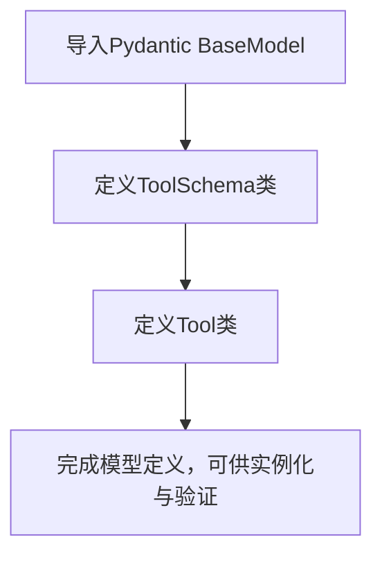

# `.\MetaGPT\metagpt\tools\tool_data_type.py` 详细设计文档

该代码定义了两个用于描述工具（Tool）及其接口模式（Schema）的数据模型类，使用Pydantic库进行数据验证和序列化，为工具管理或自动化系统提供结构化的元数据定义。

## 整体流程



## 类结构

```
BaseModel (Pydantic基类)
├── ToolSchema (工具模式类)
└── Tool (工具元数据类)
```

## 全局变量及字段


### `ToolSchema.description`
    
描述工具的功能或用途的字符串

类型：`str`
    


### `Tool.name`
    
工具的唯一标识名称

类型：`str`
    


### `Tool.path`
    
工具在文件系统中的路径或访问地址

类型：`str`
    


### `Tool.schemas`
    
存储工具相关模式或配置信息的字典，默认为空字典

类型：`dict`
    


### `Tool.code`
    
工具的源代码或实现代码，默认为空字符串

类型：`str`
    


### `Tool.tags`
    
用于分类或标记工具的字符串列表，默认为空列表

类型：`list[str]`
    
    

## 全局函数及方法


## 关键组件


### ToolSchema 类

一个用于定义工具模式（Schema）的数据模型，基于 Pydantic 的 BaseModel，用于描述工具的功能或用途。

### Tool 类

一个用于定义工具（Tool）的数据模型，基于 Pydantic 的 BaseModel，用于封装工具的名称、路径、模式、代码和标签等信息。

### Pydantic BaseModel

一个用于数据验证和设置管理的基类，确保 `ToolSchema` 和 `Tool` 类实例的数据类型和结构符合定义，并支持默认值。


## 问题及建议


### 已知问题

-   **`schemas` 字段的默认可变对象风险**：`Tool` 类中 `schemas: dict = {}` 使用了可变对象（空字典）作为默认参数。在 Python 中，默认参数值在函数或类定义时被创建并绑定，所有未显式提供该参数的实例将共享同一个默认字典对象。这可能导致一个实例对 `schemas` 的修改意外地影响到其他实例的 `schemas` 字段。
-   **`tags` 字段的默认可变对象风险**：与 `schemas` 字段类似，`tags: list[str] = []` 使用了空列表作为默认参数，存在同样的实例间意外共享和修改的风险。
-   **`schemas` 字段类型过于宽泛**：`schemas` 字段被定义为 `dict` 类型，这缺乏对字典内部结构的约束。理想情况下，它可能应该是一个映射工具名到 `ToolSchema` 实例的字典，但当前类型提示无法表达这一点，降低了代码的清晰度和类型安全性。
-   **`code` 字段的默认值可能不符合语义**：`code: str = ""` 将空字符串作为默认值。如果“空代码”是一个有效的业务状态（例如，表示工具尚未实现），这没有问题。否则，使用 `None` 并配合 `Optional[str]` 类型可能更能明确表示“缺失”状态。
-   **缺乏数据验证**：虽然使用了 Pydantic，但当前模型仅进行了基础类型检查。对于 `path` 字段，可以添加格式验证（如是否为一个有效的路径字符串）。对于 `tags` 列表，可以添加约束（如最小/最大长度、内容校验）。

### 优化建议

-   **使用 `Field` 和默认工厂函数**：将 `schemas` 和 `tags` 的默认值改为使用 Pydantic 的 `Field` 和 `default_factory` 参数。例如：`schemas: dict = Field(default_factory=dict)` 和 `tags: list[str] = Field(default_factory=list)`。这确保了每个新实例都会获得一个全新的空字典或列表。
-   **细化 `schemas` 字段的类型提示**：将 `schemas` 的类型提示具体化，例如定义为 `Dict[str, ToolSchema]`。这能明确其结构，并利用 Pydantic 对嵌套模型进行验证。
-   **考虑将 `code` 字段设为可选**：如果代码不是必须的，可以将字段类型改为 `Optional[str]` 并将默认值设为 `None`，即 `code: Optional[str] = None`。这能更清晰地表达字段的可选性。
-   **增强字段验证**：利用 Pydantic 的验证器（`@validator` 装饰器）或类型约束（如 `constr`）为字段添加业务规则。例如，验证 `path` 的格式，或确保 `tags` 列表中的元素是唯一的、非空的字符串。
-   **考虑添加示例或描述**：为每个字段添加 `description` 或 `example`（通过 Pydantic 的 `Field`），这能自动生成更清晰的 API 文档（如使用 OpenAPI）。
-   **评估继承的必要性**：当前 `Tool` 和 `ToolSchema` 都继承自 `BaseModel`。如果 `ToolSchema` 未来会有更复杂的结构或行为，当前设计是合理的。如果它始终只是一个简单的数据容器，也可以考虑使用 `TypedDict` 或 `dataclasses`，但 Pydantic 提供了额外的验证和序列化优势，通常值得保留。


## 其它


### 设计目标与约束

本模块旨在定义一个轻量级的工具元数据描述模型，用于在系统中统一表示和传递工具（例如函数、API接口、脚本等）的基本信息。其核心设计目标包括：
1.  **标准化工具描述**：通过结构化的数据模型（`Tool` 和 `ToolSchema`）确保工具名称、路径、描述、代码、标签等关键属性格式一致。
2.  **与 Pydantic 集成**：利用 Pydantic 库提供的数据验证、序列化和反序列化能力，确保模型数据的完整性和类型安全，便于与 FastAPI 等框架或配置文件（如 YAML/JSON）无缝集成。
3.  **灵活性与可扩展性**：`Tool` 类的 `schemas` 字段使用字典类型，允许存储任意结构的模式定义（如输入/输出参数模式），`tags` 字段支持对工具进行分类和过滤，为未来功能扩展预留空间。
4.  **简洁性**：模型定义保持最小化，仅包含核心元数据，避免过度设计，降低使用和理解成本。

主要约束包括：
*   模型本身不包含任何工具的执行逻辑，仅作为数据容器。
*   `schemas` 字段的具体结构和语义由使用该模型的上下文定义，模型本身不做强制约定。

### 错误处理与异常设计

当前代码模块主要定义数据模型，不包含主动的业务逻辑，因此错误处理主要体现在 Pydantic 模型自身的验证机制上：
1.  **类型验证错误**：当使用错误类型的数据实例化 `Tool` 或 `ToolSchema` 类时（例如，为 `name` 字段提供非字符串值），Pydantic 会抛出 `ValidationError` 异常。调用方需要捕获并处理此异常。
2.  **字段缺失/必填验证**：`ToolSchema` 的 `description` 字段和 `Tool` 的 `name`、`path` 字段没有默认值，属于必填字段。实例化时若缺失，Pydantic 同样会抛出 `ValidationError`。
3.  **默认值风险**：`Tool` 类的 `schemas`、`code`、`tags` 字段使用了可变对象（`dict`， `list`）作为默认值。这是一个常见的 Python 陷阱，可能导致多个 `Tool` 实例意外共享同一个字典或列表对象。虽然当前代码中直接作为默认值存在此风险，但更安全的做法是使用 `default_factory`（例如 `schemas: dict = Field(default_factory=dict)`）。

模块本身未定义自定义异常。在集成到更大系统时，调用方应负责处理 Pydantic 的验证错误，并可能根据业务需求定义更上层的异常（如 `ToolRegistrationError`、`InvalidToolConfigError`）。

### 数据流与状态机

由于本模块是纯粹的数据定义层（模型层），不涉及动态的业务流程或状态变迁，因此不存在复杂的数据流或状态机。
1.  **数据流**：数据通常是单向流入和流出这些模型对象。例如：
    *   **创建**：从配置文件读取、数据库查询结果或 API 请求体解析数据，用于实例化 `Tool` 对象。
    *   **使用**：实例化后的 `Tool` 对象作为参数在系统的其他部分（如工具注册表、执行引擎、UI 渲染层）之间传递。
    *   **输出**：`Tool` 对象可被序列化为字典或 JSON 字符串，用于 API 响应、缓存或持久化存储。
2.  **状态机**：`Tool` 和 `ToolSchema` 对象本身是无状态的（Immutable Data Object）。它们的字段在实例化后不应（通过常规手段）被修改，尽管 Pydantic 默认允许修改。若需强调不可变性，可考虑配置 `frozen=True`。对象生命周期简单：创建 -> 使用 -> 销毁。没有“激活”、“禁用”、“执行中”等状态概念，这些状态应由管理 `Tool` 对象的其他服务或实体来维护。

### 外部依赖与接口契约

1.  **外部依赖**：
    *   **Pydantic**：核心依赖，版本需兼容。用于基类（`BaseModel`）继承和数据验证。这是强依赖，移除它将导致代码无法运行。
2.  **接口契约**：
    *   **`ToolSchema` 类**：
        *   **提供**：一个包含 `description` 字符串字段的简单模型。作为 `Tool` 模型中 `schemas` 字典值类型的潜在候选（虽未强制）。
        *   **期望**：调用者理解 `description` 应清晰描述某个模式（如输入模式）的用途。
    *   **`Tool` 类**：
        *   **提供**：一个标准化的工具描述数据结构，包含 `name`, `path`, `schemas`, `code`, `tags` 字段。
        *   **期望**：
            *   调用者确保 `name` 和 `path` 在特定上下文（如一个工具集合）中具有唯一性或符合特定命名规范。
            *   调用者理解 `schemas` 字段是灵活的字典，其内部结构需在系统层面另行约定（例如，键为 `"input"` 和 `"output"`，值为符合 JSON Schema 或 `ToolSchema` 的字典）。
            *   调用者注意 `tags` 用于分类和检索。
    *   **序列化/反序列化契约**：由于继承自 `Pydantic` 的 `BaseModel`，`Tool` 和 `ToolSchema` 实例天然支持 `.dict()`、`.json()` 方法进行序列化，以及 `parse_obj()`、`parse_raw()` 方法进行反序列化。这构成了与外部系统（如 HTTP API、消息队列、配置文件）交换数据的主要契约。

### 配置管理

当前模块不直接处理配置文件。然而，`Tool` 对象常常是从配置中加载的。因此，其设计隐含了与配置管理的关联：
1.  **配置源**：`Tool` 对象的初始数据可能来源于 YAML、JSON 配置文件，环境变量，或数据库。
2.  **模型作为配置模式**：`Tool` 类本身可以视作配置数据的模式（Schema）。使用 Pydantic 加载配置（例如使用 `BaseSettings` 或 `parse_file`）能确保配置符合预期结构，并完成类型转换。
3.  **字段与配置的映射**：`name`、`path`、`description`、`code`（可能作为多行字符串）、`tags` 都可以是配置文件中的直接项。`schemas` 可能对应配置中一个复杂的嵌套子节。
4.  **安全考虑**：如果 `code` 字段用于存储可执行代码字符串，从不可信源加载配置时必须极度谨慎，避免代码注入风险。模型本身不负责代码的安全检查或沙箱执行。

### 测试策略

针对此模型模块的测试应聚焦于数据验证和基本功能：
1.  **单元测试**：
    *   **有效数据**：测试使用合规数据能成功创建 `Tool` 和 `ToolSchema` 实例。
    *   **无效数据**：测试传入错误类型、缺失必填字段时，是否会正确抛出 `ValidationError`。
    *   **默认值**：测试未提供 `schemas`、`code`、`tags` 时，是否使用正确的空默认值，并验证可变默认值问题的规避（如果已修复）。
    *   **序列化/反序列化**：测试 `.dict()`、`.json()`、`parse_obj()` 等方法能正确工作，往返无损。
2.  **集成测试**：在更广泛的上下文中测试，例如：
    *   从 YAML 配置文件读取并解析成 `Tool` 对象列表。
    *   在 FastAPI 中，将 `Tool` 作为请求体或响应模型，测试 API 端点能否正确处理。
3.  **测试工具**：可使用 `pytest` 框架，配合 `pydantic` 的 `ValidationError` 进行异常断言。

    