# `.\MetaGPT\metagpt\tools\tool_recommend.py` 详细设计文档

该代码实现了一个工具推荐系统，旨在根据给定的任务上下文或计划，从预注册的工具池中智能地筛选和推荐最相关的工具。系统采用“召回-排序”两阶段架构：首先通过多种策略（如类型匹配、BM25文本检索）从大量工具中初步筛选候选集，然后利用大语言模型（LLM）对候选工具进行精排，最终输出最相关的工具列表，以辅助自动化任务执行。

## 整体流程

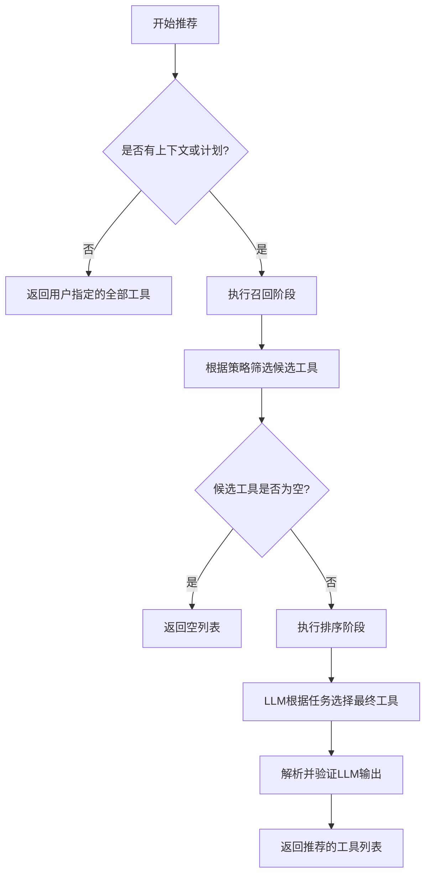

## 类结构

```
BaseModel (Pydantic基类)
└── ToolRecommender (工具推荐器基类)
    ├── TypeMatchToolRecommender (基于任务类型匹配的推荐器)
    ├── BM25ToolRecommender (基于BM25文本检索的推荐器)
    └── EmbeddingToolRecommender (基于嵌入向量的推荐器 - 待实现)
```

## 全局变量及字段


### `TOOL_INFO_PROMPT`
    
一个用于在提示中格式化工具信息的模板字符串，包含工具的使用说明和可用工具的模式描述。

类型：`str`
    


### `TOOL_RECOMMENDATION_PROMPT`
    
一个用于指导LLM从可用工具列表中推荐相关工具的提示模板字符串，包含用户需求、任务描述和输出格式要求。

类型：`str`
    


### `ToolRecommender.tools`
    
存储所有可用工具的字典，键为工具名称，值为对应的Tool对象，用于工具推荐的基础数据源。

类型：`dict[str, Tool]`
    


### `ToolRecommender.force`
    
一个布尔标志，指示是否强制推荐用户指定的工具，而不进行基于上下文的召回和排序。

类型：`bool`
    


### `BM25ToolRecommender.bm25`
    
BM25检索模型的实例，用于基于查询和工具描述之间的文本相似度进行工具召回。

类型：`Any (实际为BM25Okapi实例)`
    
    

## 全局函数及方法

### `ToolRecommender.validate_tools`

`ToolRecommender.validate_tools` 是一个类方法，用于验证并转换传入的工具列表。它作为 `@field_validator` 装饰器应用于 `ToolRecommender` 类的 `tools` 字段，确保在模型初始化或反序列化时，`tools` 字段被正确地处理为字典格式。其主要功能包括：如果输入已经是字典则直接返回；如果输入是特殊标记 `["<all>"]`，则返回所有已注册的工具；否则，验证输入的工具名称列表并返回对应的工具字典。

参数：

- `cls`：`type[ToolRecommender]`，类方法隐含的第一个参数，指向 `ToolRecommender` 类本身。
- `v`：`list[str]`，待验证的原始输入值，通常是一个工具名称的字符串列表。

返回值：`dict[str, Tool]`，返回一个字典，其中键是工具名称，值是 `Tool` 对象。

#### 流程图

```mermaid
flowchart TD
    A[开始: validate_tools(v)] --> B{判断 v 的类型};
    B -- v 是 dict --> C[直接返回 v];
    B -- v 是 list --> D{判断 v 的内容};
    D -- v == ["<all>"] --> E[返回所有注册工具<br>TOOL_REGISTRY.get_all_tools()];
    D -- v 是普通列表 --> F[验证工具名称列表<br>validate_tool_names(v)];
    C --> G[结束: 返回工具字典];
    E --> G;
    F --> G;
```

#### 带注释源码

```python
    @field_validator("tools", mode="before")
    @classmethod
    def validate_tools(cls, v: list[str]) -> dict[str, Tool]:
        # 如果 `v` 已经是字典（例如，在反序列化过程中），则直接返回。
        if isinstance(v, dict):
            return v

        # 可以使用特殊符号 ["<all>"] 来表示使用所有已注册的工具
        if v == ["<all>"]:
            return TOOL_REGISTRY.get_all_tools()
        else:
            # 否则，验证输入的工具名称列表，并返回对应的工具字典
            return validate_tool_names(v)
```

### `ToolRecommender.recommend_tools`

该方法根据给定的上下文和计划，通过“召回-排序”两阶段流程推荐工具。首先，从工具池中召回一批候选工具；然后，使用大语言模型（LLM）对召回的工具进行排序，筛选出最相关的工具作为最终推荐结果。

参数：

- `context`：`str`，用于工具推荐的上下文信息。
- `plan`：`Plan`，用于工具推荐的任务计划。
- `recall_topk`：`int`，初始召回阶段返回的工具数量。
- `topk`：`int`，排序后最终返回的推荐工具数量。

返回值：`list[Tool]`，推荐的工具列表。

#### 流程图

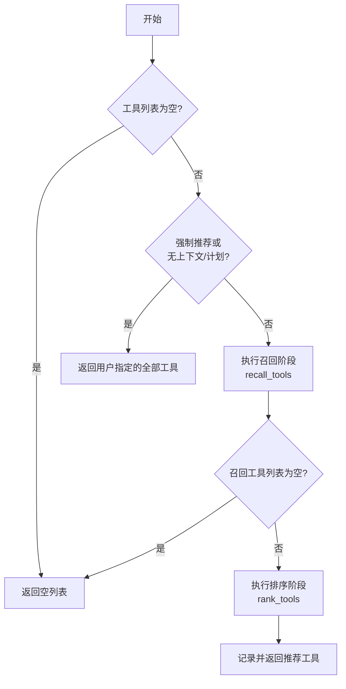

#### 带注释源码

```python
async def recommend_tools(
    self, context: str = "", plan: Plan = None, recall_topk: int = 20, topk: int = 5
) -> list[Tool]:
    """
    根据给定的上下文和计划推荐工具列表。推荐过程包括两个阶段：从大池子中召回，然后对召回的工具进行排序以选择最终集合。

    Args:
        context (str): 工具推荐的上下文。
        plan (Plan): 工具推荐的计划。
        recall_topk (int): 初始召回步骤中召回的工具数量。
        topk (int): 排序后作为最终推荐返回的工具数量。

    Returns:
        list[Tool]: 推荐的工具列表。
    """

    # 1. 边界条件检查：如果工具列表为空，直接返回空列表
    if not self.tools:
        return []

    # 2. 特殊情况处理：如果是强制推荐模式，或者没有提供有效的上下文和计划信息，则直接返回用户指定的全部工具
    if self.force or (not context and not plan):
        # 强制推荐时直接使用用户指定的工具作为结果；
        # 如果没有有用信息，则直接使用整个工具集
        return list(self.tools.values())

    # 3. 召回阶段：根据上下文和计划，从工具池中召回 recall_topk 个候选工具
    recalled_tools = await self.recall_tools(context=context, plan=plan, topk=recall_topk)
    # 如果召回结果为空，直接返回空列表
    if not recalled_tools:
        return []

    # 4. 排序阶段：使用LLM对召回的工具进行排序，选出 topk 个最相关的工具
    ranked_tools = await self.rank_tools(recalled_tools=recalled_tools, context=context, plan=plan, topk=topk)

    # 5. 记录日志并返回最终推荐的工具列表
    logger.info(f"Recommended tools: \n{[tool.name for tool in ranked_tools]}")

    return ranked_tools
```

### `ToolRecommender.get_recommended_tool_info`

该方法用于获取推荐工具的信息，并将其格式化为一个字符串，该字符串可以直接用于提示（prompt）中。它首先调用 `recommend_tools` 方法获取推荐的工具列表，然后根据 `fixed` 参数添加指定的固定工具，最后将所有推荐工具的架构信息格式化为一个预定义的提示模板字符串。

参数：

-  `fixed`：`list[str]`，一个可选的工具名称列表，这些工具将被强制添加到推荐列表中，无论它们是否被 `recommend_tools` 方法推荐。
-  `**kwargs`：`Any`，可变关键字参数，这些参数将被传递给 `recommend_tools` 方法，用于控制工具推荐过程（例如 `context`, `plan`, `recall_topk`, `topk`）。

返回值：`str`，一个格式化后的字符串，包含了所有推荐工具（包括通过算法推荐的和通过 `fixed` 参数指定的）的架构信息。如果没有任何工具被推荐，则返回空字符串。

#### 流程图

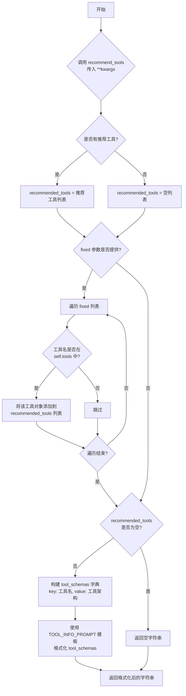

#### 带注释源码

```python
async def get_recommended_tool_info(self, fixed: list[str] = None, **kwargs) -> str:
    """
    Wrap recommended tools with their info in a string, which can be used directly in a prompt.
    """
    # 1. 调用核心推荐方法，获取基于上下文和计划的推荐工具列表。
    recommended_tools = await self.recommend_tools(**kwargs)
    
    # 2. 处理 fixed 参数：如果提供了 fixed 列表，则将其中的工具（如果存在于可用工具池中）添加到最终列表。
    if fixed:
        # 遍历 fixed 列表中的每个工具名
        for tool_name in fixed:
            # 检查工具名是否在实例的可用工具字典 self.tools 中
            if tool_name in self.tools:
                # 如果存在，则将该工具对象添加到推荐列表末尾
                recommended_tools.append(self.tools[tool_name])
    
    # 3. 边界情况处理：如果经过上述步骤后推荐列表仍为空，则返回空字符串。
    if not recommended_tools:
        return ""
    
    # 4. 数据准备：从推荐的工具对象中提取名称和架构信息，构建字典。
    #    键为工具名，值为工具的完整架构信息（通常是一个字典，包含描述、参数等）。
    tool_schemas = {tool.name: tool.schemas for tool in recommended_tools}
    
    # 5. 格式化输出：使用预定义的提示模板 TOOL_INFO_PROMPT，将工具架构字典填充进去。
    #    生成一个结构化的字符串，该字符串可以直接插入到给LLM的提示中，告知LLM可用的工具及其用法。
    return TOOL_INFO_PROMPT.format(tool_schemas=tool_schemas)
```

### `ToolRecommender.recall_tools`

该方法是一个抽象方法，用于从大型工具池中根据给定的上下文和计划召回相关工具列表。它作为工具推荐流程中“召回”阶段的核心，需要子类实现具体的召回逻辑（如基于类型匹配、BM25或嵌入向量）。该方法旨在缩小候选工具范围，为后续的“排序”阶段提供输入。

参数：

-  `context`：`str`，用于工具推荐的上下文信息，默认为空字符串。
-  `plan`：`Plan`，用于工具推荐的任务计划，默认为None。
-  `topk`：`int`，在初始召回步骤中要召回的工具数量，默认为20。

返回值：`list[Tool]`，返回一个根据上下文和计划召回的相关工具列表。

#### 流程图

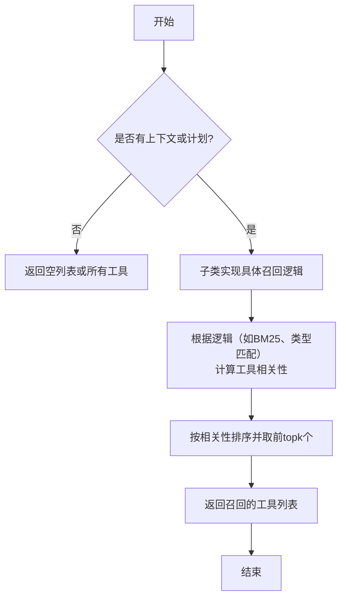

#### 带注释源码

```python
async def recall_tools(self, context: str = "", plan: Plan = None, topk: int = 20) -> list[Tool]:
    """
    从大型工具池中根据给定的上下文和计划召回相关工具列表。
    这是一个抽象方法，需要子类实现具体的召回逻辑（例如，基于类型匹配、BM25或嵌入向量）。
    该方法旨在缩小候选工具范围，为后续的“排序”阶段提供输入。

    Args:
        context (str): 用于工具推荐的上下文信息。
        plan (Plan): 用于工具推荐的任务计划。
        topk (int): 在初始召回步骤中要召回的工具数量。

    Returns:
        list[Tool]: 一个根据上下文和计划召回的相关工具列表。
    """
    raise NotImplementedError  # 强制子类必须实现此方法
```

### `ToolRecommender.rank_tools`

该方法使用大语言模型（LLM）对召回的工具列表进行排序和筛选，基于给定的上下文和计划，选择最相关的工具作为最终推荐。

参数：

- `recalled_tools`：`list[Tool]`，通过召回阶段初步筛选出的工具列表。
- `context`：`str`，用于工具推荐的上下文信息。
- `plan`：`Plan`，用于工具推荐的任务计划。
- `topk`：`int`，最终推荐的工具数量上限。

返回值：`list[Tool]`，经过排序和筛选后推荐的工具列表。

#### 流程图

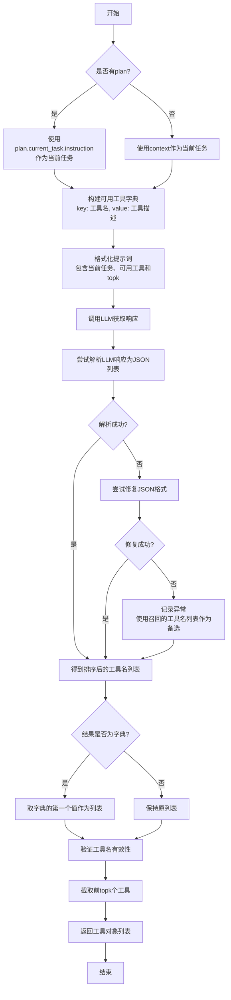

#### 带注释源码

```python
async def rank_tools(
    self, recalled_tools: list[Tool], context: str = "", plan: Plan = None, topk: int = 5
) -> list[Tool]:
    """
    Default rank methods for a ToolRecommender. Use LLM to rank the recalled tools based on the given context, plan, and topk value.
    """
    # 确定当前任务：优先使用计划中的任务指令，否则使用上下文
    current_task = plan.current_task.instruction if plan else context

    # 构建可用工具字典，key为工具名，value为工具描述，用于构建提示词
    available_tools = {tool.name: tool.schemas["description"] for tool in recalled_tools}
    # 格式化提示词模板，传入当前任务、可用工具描述和topk值
    prompt = TOOL_RECOMMENDATION_PROMPT.format(
        current_task=current_task,
        available_tools=available_tools,
        topk=topk,
    )
    # 调用大语言模型（LLM）获取响应
    rsp = await LLM().aask(prompt, stream=False)

    # 临时方案，待role zero的版本完成可将本注释内的代码直接替换掉
    # -------------开始---------------
    try:
        # 尝试从LLM响应中解析JSON代码块
        ranked_tools = CodeParser.parse_code(block=None, lang="json", text=rsp)
        # 尝试修复LLM原始输出中的JSON格式问题并加载为Python对象
        ranked_tools = json.loads(
            repair_llm_raw_output(output=ranked_tools, req_keys=[None], repair_type=RepairType.JSON)
        )
    except json.JSONDecodeError:
        # 如果JSON解析失败，尝试使用另一个LLM调用修复JSON格式
        ranked_tools = await LLM().aask(msg=JSON_REPAIR_PROMPT.format(json_data=rsp))
        # 再次解析修复后的响应中的JSON代码块
        ranked_tools = json.loads(CodeParser.parse_code(block=None, lang="json", text=ranked_tools))
    except Exception:
        # 捕获其他异常并打印堆栈信息
        tb = traceback.format_exc()
        print(tb)

    # 为了对LLM不按格式生成进行容错：如果结果是字典，则取第一个值作为列表
    if isinstance(ranked_tools, dict):
        ranked_tools = list(ranked_tools.values())[0]
    # -------------结束---------------

    # 如果最终结果不是列表，记录警告并使用召回的工具名列表作为备选
    if not isinstance(ranked_tools, list):
        logger.warning(f"Invalid rank result: {ranked_tools}, will use the recalled tools instead.")
        ranked_tools = list(available_tools.keys())

    # 验证排序后的工具名列表是否有效，并获取对应的Tool对象
    valid_tools = validate_tool_names(ranked_tools)

    # 返回前topk个有效的Tool对象
    return list(valid_tools.values())[:topk]
```

### `TypeMatchToolRecommender.recall_tools`

该方法属于 `TypeMatchToolRecommender` 类，是该类对父类 `ToolRecommender` 中抽象方法 `recall_tools` 的具体实现。其核心功能是基于给定的任务计划（`Plan`），通过精确匹配当前任务的类型（`task_type`）与工具标签（`tag`），从用户指定的工具池中召回最相关的工具。

参数：
- `context`：`str`，工具召回的上下文信息。在此实现中未直接使用。
- `plan`：`Plan`，包含任务计划的对象。用于提取当前任务的类型以进行匹配。
- `topk`：`int`，指定要召回的工具数量上限。

返回值：`list[Tool]`，返回一个 `Tool` 对象列表，包含了根据任务类型匹配召回的工具，数量不超过 `topk`。

#### 流程图

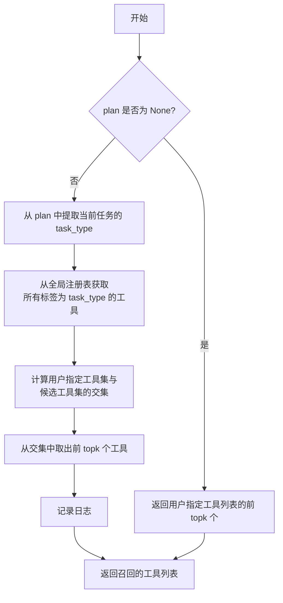

#### 带注释源码

```python
async def recall_tools(self, context: str = "", plan: Plan = None, topk: int = 20) -> list[Tool]:
    # 如果没有提供任务计划（plan），则无法进行类型匹配。
    # 此时，直接返回用户通过 `self.tools` 指定的所有工具的前 `topk` 个。
    if not plan:
        return list(self.tools.values())[:topk]

    # 从任务计划（plan）中提取当前任务的类型（task_type）。
    task_type = plan.current_task.task_type
    # 从全局工具注册表（TOOL_REGISTRY）中，获取所有标签（tag）等于 `task_type` 的工具。
    candidate_tools = TOOL_REGISTRY.get_tools_by_tag(task_type)
    # 计算用户指定的工具集（self.tools.keys()）与候选工具集（candidate_tools.keys()）的交集。
    # 这确保了只召回用户允许使用的、且标签匹配的工具。
    candidate_tool_names = set(self.tools.keys()) & candidate_tools.keys()
    # 从交集中取出工具，并限制数量不超过 `topk`。
    recalled_tools = [candidate_tools[tool_name] for tool_name in candidate_tool_names][:topk]

    # 记录召回的工具名称，便于调试和监控。
    logger.info(f"Recalled tools: \n{[tool.name for tool in recalled_tools]}")

    # 返回召回的工具列表。
    return recalled_tools
```

### `BM25ToolRecommender.__init__`

该方法用于初始化`BM25ToolRecommender`类的实例。它首先调用父类`ToolRecommender`的构造函数，然后调用`_init_corpus`方法来初始化BM25模型所需的语料库。语料库由所有可用工具的名称、标签和描述组成，这些信息将被分词并用于构建BM25模型，以便后续进行工具召回。

参数：

-  `kwargs`：`dict`，传递给父类`ToolRecommender`构造函数的任意关键字参数。

返回值：`None`，无返回值。

#### 流程图

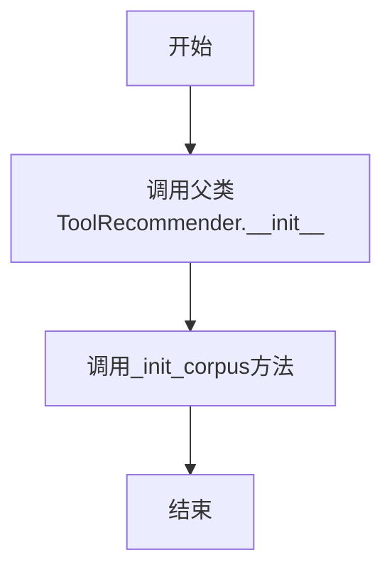

#### 带注释源码

```python
def __init__(self, **kwargs):
    # 调用父类ToolRecommender的构造函数，传入任意关键字参数
    super().__init__(**kwargs)
    # 初始化BM25模型所需的语料库
    self._init_corpus()
```

### `BM25ToolRecommender._init_corpus`

该方法用于初始化BM25检索模型的语料库。它遍历所有可用的工具，将每个工具的名称、标签和描述拼接成一个文档字符串，然后进行简单的分词处理，最后使用这些分词后的文档构建BM25模型，以便后续进行基于文本相似度的工具召回。

参数：

-  `self`：`BM25ToolRecommender`，当前BM25ToolRecommender类的实例，用于访问实例属性和方法。

返回值：`None`，该方法不返回任何值，仅初始化实例的`bm25`属性。

#### 流程图

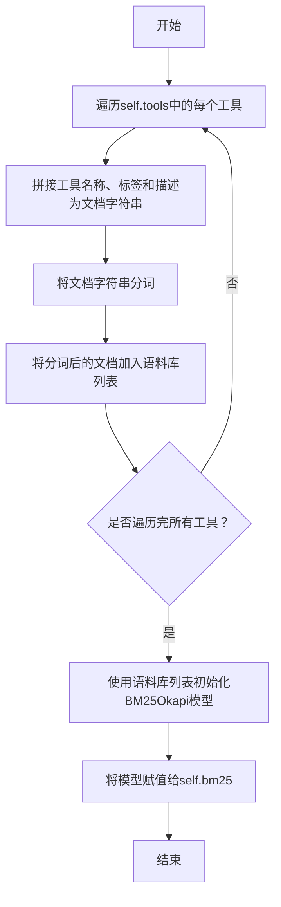

#### 带注释源码

```python
def _init_corpus(self):
    # 遍历self.tools中的所有工具，将每个工具的名称、标签和描述拼接成一个文档字符串
    corpus = [f"{tool.name} {tool.tags}: {tool.schemas['description']}" for tool in self.tools.values()]
    # 对每个文档字符串进行分词处理，这里使用简单的空格分词（后续可能需要更复杂的分词方法）
    tokenized_corpus = [self._tokenize(doc) for doc in corpus]
    # 使用分词后的语料库初始化BM25Okapi模型，并将其赋值给实例变量self.bm25
    self.bm25 = BM25Okapi(tokenized_corpus)
```

### `BM25ToolRecommender._tokenize`

该方法是一个简单的文本分词器，用于将输入的文本字符串分割成单词列表。它被 `BM25ToolRecommender` 类在初始化语料库和查询时调用，为 BM25 算法准备分词后的数据。当前实现仅使用空格进行分割，注释指出未来需要更复杂的分词逻辑。

参数：

- `text`：`str`，需要被分词的文本字符串。

返回值：`list[str]`，由输入文本按空格分割后得到的单词列表。

#### 流程图

```mermaid
flowchart TD
    A[“开始: 输入文本 text”] --> B{“text 是否为空或 None?”}
    B -- 是 --> C[“返回空列表 []”]
    B -- 否 --> D[“调用 text.split() 按空格分割”]
    D --> E[“返回分割后的单词列表”]
    E --> F[“结束”]
```

#### 带注释源码

```python
def _tokenize(self, text):
    # 使用空格将文本分割成单词列表。
    # FIXME: 当前实现较为简单，未来可能需要更复杂的分词逻辑（例如处理标点、停用词等）。
    return text.split()
```

### `BM25ToolRecommender.recall_tools`

该方法属于 `BM25ToolRecommender` 类，是其召回阶段的核心实现。它使用 BM25 算法，根据给定的查询（来自任务指令或上下文）对工具库中的工具进行相关性评分，并返回得分最高的前 `topk` 个工具。其核心流程是：对查询和工具描述文档进行分词，利用预构建的 BM25 模型计算查询与每个工具文档的匹配分数，然后根据分数降序排序并选取前 `topk` 个工具作为召回结果。

参数：

- `context`：`str`，用于工具推荐的上下文信息。当没有 `plan` 时，此参数将作为查询文本。
- `plan`：`Plan`，包含当前任务等信息的计划对象。如果存在，将优先使用 `plan.current_task.instruction` 作为查询文本。
- `topk`：`int`，指定需要召回的工具数量上限。

返回值：`list[Tool]`，返回一个 `Tool` 对象列表，这些工具是根据 BM25 算法计算出的与查询最相关的前 `topk` 个工具。

#### 流程图

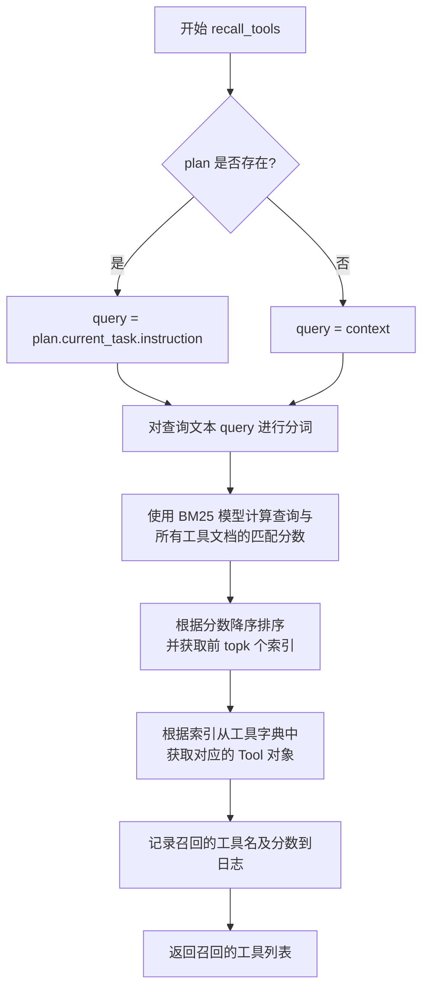

#### 带注释源码

```python
async def recall_tools(self, context: str = "", plan: Plan = None, topk: int = 20) -> list[Tool]:
    """
    基于 BM25 算法召回工具。
    1. 确定查询文本：优先使用计划中当前任务的指令，否则使用上下文。
    2. 对查询文本进行分词。
    3. 使用预训练的 BM25 模型计算查询与工具库中每个工具描述文档的相似度得分。
    4. 根据得分降序排序，选取前 `topk` 个工具。
    5. 记录日志并返回召回的工具列表。

    Args:
        context (str): 用于工具推荐的上下文信息。
        plan (Plan): 包含任务信息的计划对象。
        topk (int): 需要召回的工具数量上限。

    Returns:
        list[Tool]: 召回的工具对象列表。
    """
    # 步骤1: 确定查询文本。优先使用计划中的任务指令。
    query = plan.current_task.instruction if plan else context

    # 步骤2: 对查询文本进行分词（使用简单的空格分词，注释指出此处有待优化）。
    query_tokens = self._tokenize(query)
    # 步骤3: 使用 BM25 模型计算查询与所有工具文档的匹配分数。
    doc_scores = self.bm25.get_scores(query_tokens)
    # 步骤4: 获取分数最高的前 `topk` 个工具的索引。
    # np.argsort 默认升序，[::-1] 反转后变为降序，[:topk] 取前 topk 个。
    top_indexes = np.argsort(doc_scores)[::-1][:topk]
    # 根据索引从 `self.tools` 字典的值（Tool对象列表）中取出对应的工具。
    recalled_tools = [list(self.tools.values())[index] for index in top_indexes]

    # 步骤5: 记录日志，包含工具名和对应的 BM25 分数（保留四位小数）。
    logger.info(
        f"Recalled tools: \n{[tool.name for tool in recalled_tools]}; Scores: {[np.round(doc_scores[index], 4) for index in top_indexes]}"
    )

    # 返回召回的工具列表。
    return recalled_tools
```

### `EmbeddingToolRecommender.__init__`

该方法用于初始化 `EmbeddingToolRecommender` 类的实例。它继承自 `ToolRecommender` 类，并调用父类的初始化方法，同时为后续基于嵌入向量的工具召回阶段做准备。

参数：

- `**kwargs`：`dict`，关键字参数，用于传递给父类 `ToolRecommender` 的初始化方法。

返回值：`None`，无返回值。

#### 流程图

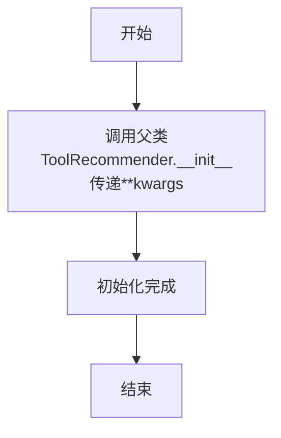

#### 带注释源码

```python
def __init__(self, **kwargs):
    # 调用父类ToolRecommender的初始化方法，传递所有关键字参数
    super().__init__(**kwargs)
```

### `EmbeddingToolRecommender.recall_tools`

该方法旨在基于给定的上下文和计划，使用嵌入向量（embeddings）计算查询与工具信息之间的相似度，从而从大量工具池中召回最相关的工具。它是 `EmbeddingToolRecommender` 类的核心召回方法，但目前尚未实现具体逻辑，仅作为占位符存在。

参数：

- `context`：`str`，用于工具推荐的上下文信息。
- `plan`：`Plan`，用于工具推荐的任务计划，包含当前任务等信息。
- `topk`：`int`，指定需要召回的工具数量上限。

返回值：`list[Tool]`，返回一个包含召回工具的列表，列表长度不超过 `topk`。

#### 流程图

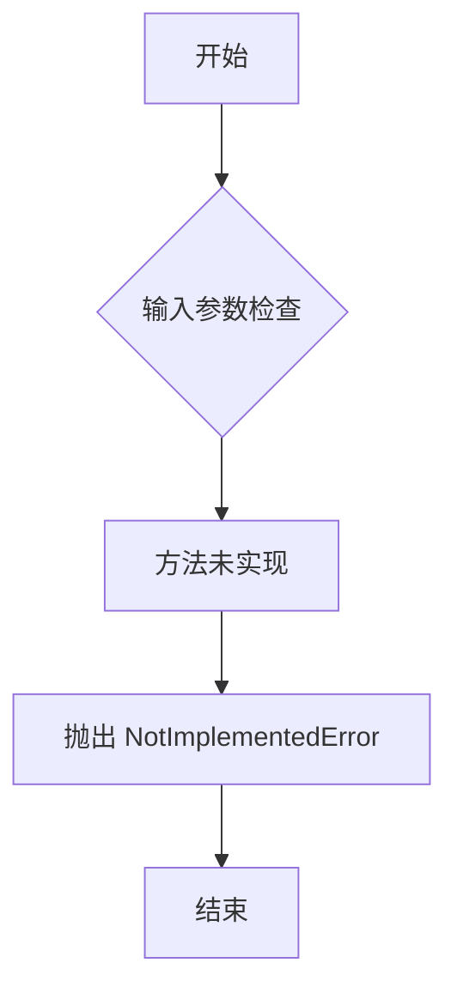

#### 带注释源码

```python
async def recall_tools(self, context: str = "", plan: Plan = None, topk: int = 20) -> list[Tool]:
    """
    基于给定的上下文和计划，使用嵌入向量计算查询与工具信息之间的相似度，从而召回相关工具。
    注意：此方法目前尚未实现，仅作为占位符。

    Args:
        context (str): 用于工具推荐的上下文信息。
        plan (Plan): 用于工具推荐的任务计划。
        topk (int): 需要召回的工具数量上限。

    Returns:
        list[Tool]: 召回的工具列表。

    Raises:
        NotImplementedError: 方法尚未实现。
    """
    pass  # 方法体为空，表示功能待实现
```

## 关键组件

### ToolRecommender

一个用于推荐工具的基类，采用“召回-排序”两阶段策略。它首先从工具池中召回候选工具，然后使用LLM对召回的工具进行排序，最终返回最相关的工具列表。

### TypeMatchToolRecommender

基于任务类型匹配的召回策略。在召回阶段，通过精确匹配当前任务的`task_type`与工具的`tag`来筛选候选工具，然后使用基类的LLM排序策略进行最终推荐。

### BM25ToolRecommender

基于BM25算法的召回策略。在召回阶段，将当前任务指令作为查询，对工具的描述文本进行BM25检索，返回相关性最高的工具，然后使用基类的LLM排序策略进行最终推荐。

### EmbeddingToolRecommender

基于嵌入向量的召回策略（待实现）。计划在召回阶段使用嵌入模型计算查询与工具信息的语义相似度，然后使用基类的LLM排序策略进行最终推荐。

## 问题及建议


### 已知问题

-   **`rank_tools` 方法中的 JSON 解析逻辑脆弱且复杂**：该方法尝试使用 `CodeParser` 和 `repair_llm_raw_output` 来解析 LLM 的响应，并在失败时尝试修复。然而，修复逻辑（`JSON_REPAIR_PROMPT`）本身也依赖 LLM，增加了复杂性和不确定性。当 LLM 返回非标准格式时，最终的 `ranked_tools` 变量类型可能不符合预期（例如，可能为 `dict`），导致后续处理逻辑（如 `validate_tool_names`）可能出错或产生意外结果。
-   **`BM25ToolRecommender._tokenize` 方法过于简单**：该方法仅使用空格进行分词（`text.split()`），对于英文以外的语言或包含标点符号、特殊字符的文本处理效果不佳，会影响 BM25 算法的召回准确率。
-   **`EmbeddingToolRecommender` 类未实现**：该类被标记为“待实现”，但其 `recall_tools` 方法仅包含 `pass` 语句。如果被实例化并调用，将直接抛出 `NotImplementedError`，导致程序中断。
-   **`TypeMatchToolRecommender` 的召回逻辑可能过于严格**：该类仅根据 `plan.current_task.task_type` 与工具标签进行精确匹配来召回工具。如果任务类型定义不完善或工具标签体系与任务类型不完全对应，可能导致大量相关工具无法被召回。
-   **错误处理不完善**：在 `rank_tools` 方法中，当 JSON 解析失败并进入异常处理流程时，如果 `JSON_REPAIR_PROMPT` 的调用也失败，异常被捕获并仅打印堆栈跟踪（`print(tb)`），但程序会继续执行，此时 `ranked_tools` 变量可能未定义或为 `None`，导致后续代码出现 `UnboundLocalError` 或其他运行时错误。
-   **`ToolRecommender.recommend_tools` 方法中 `force` 参数的行为描述可能不直观**：当 `force=True` 时，无论 `context` 和 `plan` 是否提供，都直接返回用户指定的工具。这与参数名“force”的直觉（强制使用某种推荐逻辑）可能不完全一致，容易造成误解。

### 优化建议

-   **重构 `rank_tools` 的响应解析逻辑**：将复杂的 JSON 解析和修复逻辑封装到一个独立的、健壮的函数中。该函数应能处理多种常见的 LLM 输出格式错误，并明确返回一个工具名称列表或一个明确的失败标识。减少对链式 LLM 调用的依赖，以降低复杂性和延迟。
-   **改进 `BM25ToolRecommender._tokenize` 方法**：引入更健壮的分词器，例如使用正则表达式处理标点，或集成 `nltk`、`jieba`（中文）等第三方库进行更准确的分词，以提高跨语言场景下的召回质量。
-   **实现 `EmbeddingToolRecommender` 或明确其状态**：如果计划使用基于嵌入的召回，应实现该类的核心逻辑（如计算查询与工具描述的相似度）。如果不计划使用，应考虑将该类标记为抽象基类或从代码库中移除，以避免误导。
-   **增强 `TypeMatchToolRecommender` 的召回策略**：除了精确匹配，可以引入模糊匹配（如子字符串匹配、同义词匹配）或结合任务指令的简单关键词匹配作为后备方案，以提高召回率。
-   **加强错误处理与日志记录**：在 `rank_tools` 方法中，应确保在所有异常分支中 `ranked_tools` 都有合理的默认值（例如，回退到 `recalled_tools` 列表）。将 `print(tb)` 替换为结构化的错误日志记录（如 `logger.error`），并考虑在无法修复时抛出更明确的业务异常或返回安全默认值。
-   **优化 `ToolRecommender` 的初始化与配置**：考虑将 `force` 参数重命名为更贴切的名称（如 `use_specified_tools_only`），并在文档中清晰说明其与 `context`/`plan` 参数的互斥关系。同时，可以探索在 `validate_tools` 中支持更灵活的工具筛选表达式。
-   **考虑性能优化**：对于 `BM25ToolRecommender`，如果工具集很大且不变，`_init_corpus` 和 BM25 模型可以只初始化一次并缓存。对于所有推荐器，如果 `recommend_tools` 被频繁调用且参数相同，可以考虑引入简单的缓存机制（基于 `context` 和 `plan` 的哈希值）。
-   **增加单元测试与集成测试**：为每个推荐器类（特别是其 `recall_tools` 和 `rank_tools` 方法）编写全面的测试用例，覆盖正常流程、边界情况（如空输入、无匹配工具）以及 LLM 返回异常格式的情况，以确保代码的健壮性。


## 其它


### 设计目标与约束

本模块的核心设计目标是构建一个灵活、可扩展的工具推荐系统，用于在AI智能体执行任务时，根据上下文和任务计划，从预注册的工具池中筛选出最相关的工具。系统遵循“召回-排序”两阶段架构，支持通过继承基类实现不同的召回策略（如类型匹配、BM25、向量检索）。主要约束包括：1) 依赖外部LLM进行最终排序，存在响应延迟和格式不确定性；2) 工具信息需预先以特定格式注册；3) 当前实现中，BM25召回使用简单空格分词，对中文或复杂描述支持有限。

### 错误处理与异常设计

模块通过多种机制处理异常：
1. **输入验证**：`ToolRecommender`类的`validate_tools`验证器确保`tools`字段被正确初始化为工具字典，支持`["<all>"]`特殊符号。
2. **JSON解析容错**：在`rank_tools`方法中，对LLM返回的JSON格式结果进行捕获`json.JSONDecodeError`，并尝试使用`repair_llm_raw_output`或调用LLM进行修复。
3. **结果格式兜底**：当LLM返回的排序结果不是列表时（例如是字典），通过类型判断和转换进行容错，并回退到使用召回的工具列表。
4. **日志记录**：使用`logger`记录关键步骤（如召回、推荐的工具列表）和警告信息（如无效的排序结果），便于调试和监控。
5. **异常传播**：对于未实现的抽象方法（如`recall_tools`），直接抛出`NotImplementedError`，强制子类实现。

### 数据流与状态机

1. **初始化流程**：用户指定工具列表（或`<all>`） -> `validate_tools`验证并加载工具字典 -> 子类（如`BM25ToolRecommender`）可能进行额外的索引构建（`_init_corpus`）。
2. **推荐主流程**：
   a. **入口**：`recommend_tools` 接收`context`和`plan`。
   b. **条件判断**：若无可用工具、强制推荐模式或无有效上下文，直接返回指定工具或空列表。
   c. **召回阶段**：调用`recall_tools`（由子类实现），基于任务指令或上下文从工具池中初步筛选出`recall_topk`个候选工具。
   d. **排序阶段**：调用`rank_tools`，将召回的工具描述和当前任务组合成Prompt，交由LLM判断并返回最相关的`topk`个工具名，最终映射回`Tool`对象列表。
3. **信息获取流程**：`get_recommended_tool_info` 调用推荐流程，并将结果格式化为可直接插入Prompt的字符串。

### 外部依赖与接口契约

1. **外部库依赖**：
   - `rank_bm25`：用于`BM25ToolRecommender`的文本相关性评分。
   - `numpy`：用于处理BM25的分数数组。
   - `pydantic`：用于数据验证和模型定义。
   - `metagpt.llm.LLM`：提供与大语言模型交互的异步接口。
   - `metagpt.tools.TOOL_REGISTRY`：全局工具注册表，提供工具查询功能。
   - `metagpt.utils.repair_llm_raw_output`：提供修复LLM原始输出的功能。

2. **接口契约**：
   - **输入**：`recommend_tools`方法接受字符串`context`和`Plan`对象作为主要查询依据。
   - **输出**：返回`List[Tool]`，即推荐的工具对象列表。
   - **工具对象契约**：`Tool`对象需包含`name`、`tags`、`schemas`（其中需有`description`字段）等属性，以满足不同召回策略和Prompt构建的需求。
   - **Plan对象契约**：`Plan`对象需包含`current_task`属性，该属性需有`instruction`和`task_type`字段。

### 配置与扩展点

1. **配置参数**：
   - `tools`：可配置为具体工具名列表或`["<all>"]`。
   - `force`：布尔标志，为`True`时跳过推荐逻辑直接返回配置的工具。
   - `recall_topk`与`topk`：控制召回数量和最终推荐数量的超参数。

2. **扩展点**：
   - **召回策略**：通过继承`ToolRecommender`并实现`recall_tools`方法，可以轻松集成新的召回算法（如示例中的`TypeMatchToolRecommender`、`BM25ToolRecommender`和预留的`EmbeddingToolRecommender`）。
   - **排序策略**：`rank_tools`方法可作为扩展点，未来可集成非LLM的排序器。
   - **工具信息格式化**：`TOOL_INFO_PROMPT`和`TOOL_RECOMMENDATION_PROMPT`模板允许调整传递给LLM的工具描述格式。

    